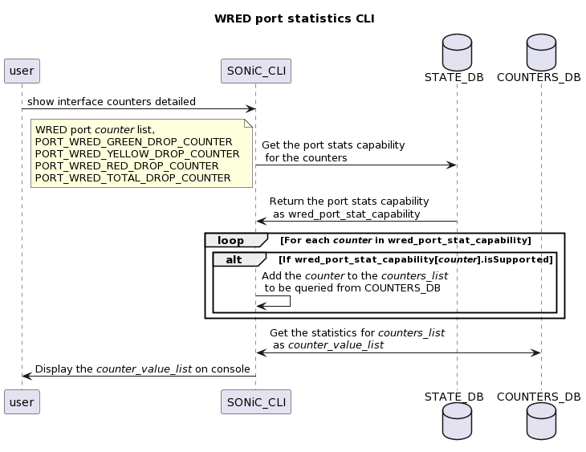

# WRED and ECN Statistics


## Table of Contents
- [WRED and ECN Statistics](#wred-and-ecn-statistics)
  - [Table of Contents](#table-of-contents)
    - [Revision](#revision)
    - [Scope](#scope)
    - [Abbreviations](#abbreviations)
    - [Overview](#overview)
    - [Requirements](#requirements)
    - [Architecture Design](#architecture-design)
    - [High-Level Design](#high-level-design)
      - [Changes in CONFIG_DB](#changes-in-config_db)
      - [Changes in STATE_DB](#changes-in-state_db)
      - [Changes in FLEX_COUNTER_DB](#changes-in-flex_counter_db)
      - [Changes in COUNTERS_DB](#changes-in-counters_db)
      - [Changes in Orchagent](#changes-in-orchagent)
      - [CLI Changes](#cli-changes)
        - [CLI output on a WRED and ECN queue statistics supported platform](#cli-output-on-a-wred-and-ECN-queue-statistics-supported-platform)
        - [CLI output on a platform which supports WRED drop statistics and does not support ECN statistics](#cli-output-on-a-platform-which-supports-wred-drop-statistics-and-does-not-support-ecn-statistics)
        - [CLI output on a platform which supports ECN statistics and does not support WRED statistics](#cli-output-on-a-platform-which-supports-ecn-statistics-and-does-not-support-wred-statistics)
        - [show interface counters CLI output on a WRED drop statistics supported platform](#show-interface-counters-cli-output-on-a-wred-drop-statistics-supported-platform)
        - [show interface counters on a platform which does not support WRED drop statistics](#show-interface-counters-cli-output-on-a-platform-which-does-not-support-wred-drop-statistics)
    - [SAI API](#sai-api)
    - [Configuration and management](#configuration-and-management)
    - [Warmboot and Fastboot Design Impact](#warmboot-and-fastboot-design-impact)
    - [Restrictions/Limitations](#restrictionslimitations)
    - [Testing Requirements/Design](#testing-requirementsdesign)
      - [Unit Test cases](#unit-test-cases)
      - [System Test cases](#system-test-cases)

### Revision

| Rev | Date     | Author                      | Change Description |
|:---:|:--------:|:---------------------------:|--------------------|
| 0.1 |23/Feb/23 | Rajesh Perumal **(Marvell)**| Initial Version    |

### Scope

This document provides the high level design for WRED and ECN Statistics in SONiC

### Abbreviations


|  Abbreviation | Description                     |
|:-------------:|---------------------------------|
| __ECN__       | Explicit Congestion Notification|
| __WRED__      | Weighted Random Early Detection |
| __CLI__       | Command Line interface          |
| __SAI__       | Switch Abstraction Interface    |


### Overview

The main goal of this feature is to provide better WRED impact visibility in SONiC by providing a mechanism to count the packets that are dropped or ECN-marked due to WRED.

The other goal of this feature is to display these statistics only if the underlying platform supports it. [CLI changes](#cli-changes) section explains this in detail. Every platform may have unique statistics capabilities, and they change over time, and so it is important for this feature to be capability based.

We will accomplish both the goals by adding statistics support for per-queue WRED dropped packets/bytes, per-queue ECN marked packets/bytes and per-port WRED dropped packets. Existing “show interface counters detailed” CLI  will be enhanced for displaying the port level WRED statistics. New CLI will be introduced for queue level WRED and ECN statistics.

In this document, we will be using the term "WRED and ECN statistics" for combined statistics of per-queue WRED dropped packets/bytes, per-queue ECN marked packets/bytes and per-port WRED dropped packets.

### Requirements

1. Support per-queue total ECN marked packets counters(ECN marked in the local switch)
2. Support per-queue total ECN marked byte counters(ECN marked in the local switch)
3. Support per-queue total WRED dropped packets counters
4. Support per-queue total WRED dropped byte counters
5. Support per-port WRED dropped packets counters (per-color and total count)
6. Support per-port total ECN marked packets(in the local switch) counters [to be supported in the next phase of enhancement]
7. Support configuration control to enable and disable the above statistics
8. Non-supported platforms will not display these statistics on CLI


### Architecture Design

There are no architectural design changes as part of this design.

### High-Level Design

This section covers the high level design of the WRED and ECN statistics feature. The following step-by-step short description provides an overview of the operations involved in this feature,

1. Orchagent fetches the platform statistics capability for WRED and ECN Statistics from SAI
2. The stats capability will be updated to STATE_DB by orchagent
3. Based on the stats capability and CONFIG_DB status of respective statistics, Orchagent sets stat-ids to FLEX_COUNTERS_DB
    * In case, the platform is capable of WRED and ECN statistics,
        * Per-queue WRED and ECN counters will create and use the new flexcounter group WRED_ECN_QUEUE
        * Per-port WRED and ECN counters will create and use the new flexcounter group WRED_ECN_PORT
5. Syncd has subscribed to Flex Counter DB and it will set up flex counters.
6. Flex counters periodically query platform counters and publishes data to COUNTERS_DB
7. CLI will look-up the Capability at STATE_DB
8. Only the supported statistics will be fetched and displayed on the CLI output

#### Changes in CONFIG_DB

CONFIG_DB changes are required to enable and disable these statistics globally. For that purpose, Two new flexcounter groups that poll for WRED and ECN statistics will be added to FLEX_COUNTER_TABLE of CONFIG_DB. Flexcounters WRED_ECN_QUEUE and WRED_ECN_PORT will be added to FLEX_COUNTER_TABLE as shown below,

```
{
	"FLEX_COUNTER_TABLE": {
		"WRED_ECN_QUEUE": {
			"FLEX_COUNTER_STATUS": "enable",
			"POLL_INTERVAL": "10000"
		},
		"WRED_ECN_PORT": {
			"FLEX_COUNTER_STATUS": "enable",
			"POLL_INTERVAL": "1000"
		},
    }
}
```

Default polling intervals for flexcounter groups WRED_ECN_QUEUE and WRED_ECN_PORT are 10000 millisecond and 1000 millisecond respectively. By default these flexcounter groups are disabled for polling.

#### Changes in STATE_DB
State DB will store information about WRED and ECN statistics support as per the platform capability. Statistics capabilities will be populated during Orchagent startup by checking the platform capability. These capabilities are used in CLI to display only the supported counters to user.

```
"QUEUE_COUNTER_CAPABILITIES": {
    "WRED_ECN_QUEUE_ECN_MARKED_PKT_COUNTER": {
        "isSupported": "true",
    },
    "WRED_ECN_QUEUE_ECN_MARKED_BYTE_COUNTER": {
       "isSupported": "true",
    },
    "WRED_ECN_QUEUE_WRED_DROPPED_PKT_COUNTER": {
        "isSupported": "true",
    },
    "WRED_ECN_QUEUE_WRED_DROPPED_BYTE_COUNTER": {
       "isSupported": "true",
    },
}

"PORT_COUNTER_CAPABILITIES": {
    "WRED_ECN_PORT_WRED_GREEN_DROP_COUNTER": {
        "isSupported": "true",
    },
    "WRED_ECN_PORT_WRED_YELLOW_DROP_COUNTER": {
        "isSupported": "true",
    },
    "WRED_ECN_PORT_WRED_RED_DROP_COUNTER": {
        "isSupported": "true",
    },
    "WRED_ECN_PORT_WRED_TOTAL_DROP_COUNTER": {
        "isSupported": "true",
    },
}

```

The default capability will be isSupported=false for all the above statistics.

#### Changes in FLEX_COUNTER_DB

The flexcounter groups need to be created for polling the required statistics. Two new flex counter groups will be introduced for this feature. These are created during Orchagent startup.

On supported platforms,
* The WRED and ECN queue counters will use the new flexcounter group WRED_ECN_QUEUE for following list of counters,
    * SAI_QUEUE_STAT_WRED_ECN_MARKED_PACKETS
    * SAI_QUEUE_STAT_WRED_ECN_MARKED_BYTES
    * SAI_QUEUE_STAT_WRED_DROPPED_PACKETS
    * SAI_QUEUE_STAT_WRED_DROPPED_BYTES

* The WRED port counters will use the new flex counter group WRED_ECN_PORT for following list of counters,
    * SAI_PORT_STAT_GREEN_WRED_DROPPED_PACKETS
    * SAI_PORT_STAT_YELLOW_WRED_DROPPED_PACKETS
    * SAI_PORT_STAT_RED_WRED_DROPPED_PACKETS
    * SAI_PORT_STAT_WRED_DROPPED_PACKETS
    * SAI_PORT_STAT_ECN_MARKED_PACKETS [to be supported in next phase of Enhancement]


#### Changes in COUNTERS_DB

The following new port counters will be added along with existing counters on supported platforms

* COUNTERS:oid:port_oid
    * SAI_PORT_STAT_GREEN_WRED_DROPPED_PACKETS
    * SAI_PORT_STAT_YELLOW_WRED_DROPPED_PACKETS
    * SAI_PORT_STAT_RED_WRED_DROPPED_PACKETS
    * SAI_PORT_STAT_WRED_DROPPED_PACKETS
    * SAI_PORT_STAT_ECN_MARKED_PACKETS [to be supported in next phase of Enhancement]

For every egress queue, the following statistics will be added along with existing queue conters on supported platforms

* COUNTERS:oid:queue_oid
    * SAI_QUEUE_STAT_WRED_ECN_MARKED_PACKETS
    * SAI_QUEUE_STAT_WRED_ECN_MARKED_BYTES
    * SAI_QUEUE_STAT_WRED_DROPPED_PACKETS
    * SAI_QUEUE_STAT_WRED_DROPPED_BYTES


### Changes in Orchagent
Orchagent gets the WRED and ECN statistics capability during the startup and updates the STATE_DB with supported statistics. If a counter is supported, respective capability will be set to true. Otherwise the capability will be set to false.  Based on the capability in STATE_DB, FLEXCOUNTER_DB will be updated with supported statistics for polling.
<p align=center>

</p>

Once the WRED_ECN_QUEUE or WRED_ECN_PORT of FLEX_COUNTER_TABLE is enabled, Orchagent will enable the respective flexcounter group. The following diagram illustrates the same,
<p align=center>

</p>

If the user enables the WRED and ECN statistics on a platform in which all of the statistics of a flexcounter group are not supported, there will be an error message logged to syslog. For example, assume that none of the Queue-level Wred and ECN statistics are supported on a platform, enabling the same will log a syslog error.

### CLI Changes

There are few new CLIs and new CLI tokens are introduced for this feature. And also the output of existing "show interface counters detailed" CLI would change. The details are illustrated below in this section. The show CLIs will display the WRED and ECN statistics only if the capability is supported by the platform. It gets the capability from STATE_DB and queries only the supported statistics from COUNTERS_DB.

* New CLI tokens are introduced under the existing ```counterpoll``` CLI for enabling and disabling the WRED and ECN statistics polling globally,
    * Enable/Disable the queue level counters : ```counterpoll wredqueue <enable | disable>```
    * Enable/Disable the port level counters : ```counterpoll wredport <enable | disable>```
* New CLI tokens are introduced under the existing ```counterpoll``` CLI for setting the polling interval of the statistics,
    * Set polling interval for queue level counters: ```counterpoll wredqueue interval <value>```
    * Set polling interval for port level counters: ```counterpoll wredport  interval <value>```

* Existing ```counterpoll``` CLI  can be used to display counter status and polling interval,
    * Display the status of the counters : ```counterpoll show```

* Following new CLIs are introduced for Per-queue WRED and ECN Statistics
    * Statistics are cleared on user request : ```sonic-clear queue wredcounters```
    * Display the statistics on the console      : ```show queue wredcounters [interface-name]```


* Following existing CLIs are used for Per-port WRED statistics
    * Statistics are cleared on user request :  ```sonic-clear counters```
    * Display the statistics on the console : ```show interfaces counters detailed <interface-name>```

#### CLI output on a WRED and ECN queue statistics supported platform

```
sonic-dut:~# show queue wredcounters Ethernet16
      Port    TxQ    WredDrp/pkts    WredDrp/bytes  EcnMarked/pkts EcnMarked/bytes
----------  -----  --------------  ---------------  -------------- ---------------
Ethernet16    UC0               0                0               0               0
Ethernet16    UC1               1              120               0               0
Ethernet16    UC2               0                0               0               0
Ethernet16    UC3               0                0               0               0
Ethernet16    UC4               0                0               0               0
Ethernet16    UC5               0                0               0               0
Ethernet16    UC6               0                0               0               0
Ethernet16    UC7               0                0               0               0
```
#### CLI output on a platform which supports WRED drop statistics and does not support ECN statistics
```
sonic-dut:~# show queue wredcounters Ethernet8
     Port    TxQ    WredDrp/pkts    WredDrp/bytes    EcnMarked/pkts    EcnMarked/bytes
---------  -----  --------------  ---------------  ----------------  -----------------
Ethernet8    UC0               0                0               N/A                N/A
Ethernet8    UC1               1              120               N/A                N/A
Ethernet8    UC2               0                0               N/A                N/A
Ethernet8    UC3               0                0               N/A                N/A
Ethernet8    UC4               0                0               N/A                N/A
Ethernet8    UC5               0                0               N/A                N/A
Ethernet8    UC6               0                0               N/A                N/A
Ethernet8    UC7               0                0               N/A                N/A

```
#### CLI output on a platform which supports ECN statistics and does not support WRED statistics
```
sonic-dut:~# show queue wredcounters Ethernet16
      Port    TxQ    WredDrp/pkts    WredDrp/bytes    EcnMarked/pkts    EcnMarked/bytes
----------  -----  --------------  ---------------  ----------------  -----------------
Ethernet16    UC0             N/A              N/A                 0                  0
Ethernet16    UC1             N/A              N/A                 1                120
Ethernet16    UC2             N/A              N/A                 0                  0
Ethernet16    UC3             N/A              N/A                 0                  0
Ethernet16    UC4             N/A              N/A                 0                  0
Ethernet16    UC5             N/A              N/A                 0                  0
Ethernet16    UC6             N/A              N/A                 0                  0
Ethernet16    UC7             N/A              N/A                 0                  0

```
#### show interface counters CLI output on a WRED drop statistics supported platform
```
root@sonic-dut:~# show interfaces counters detailed Ethernet8
Packets Received 64 Octets..................... 0
Packets Received 65-127 Octets................. 2
Packets Received 128-255 Octets................ 0
Packets Received 256-511 Octets................ 0
Packets Received 512-1023 Octets............... 0
Packets Received 1024-1518 Octets.............. 0
Packets Received 1519-2047 Octets.............. 0
Packets Received 2048-4095 Octets.............. 0
Packets Received 4096-9216 Octets.............. 0
Packets Received 9217-16383 Octets............. 0

Total Packets Received Without Errors.......... 2
Unicast Packets Received....................... 0
Multicast Packets Received..................... 2
Broadcast Packets Received..................... 0

Jabbers Received............................... N/A
Fragments Received............................. N/A
Undersize Received............................. 0
Overruns Received.............................. 0

Packets Transmitted 64 Octets.................. 32,893
Packets Transmitted 65-127 Octets.............. 16,449
Packets Transmitted 128-255 Octets............. 3
Packets Transmitted 256-511 Octets............. 2,387
Packets Transmitted 512-1023 Octets............ 0
Packets Transmitted 1024-1518 Octets........... 0
Packets Transmitted 1519-2047 Octets........... 0
Packets Transmitted 2048-4095 Octets........... 0
Packets Transmitted 4096-9216 Octets........... 0
Packets Transmitted 9217-16383 Octets.......... 0

Total Packets Transmitted Successfully......... 51,732
Unicast Packets Transmitted.................... 0
Multicast Packets Transmitted.................. 18,840
Broadcast Packets Transmitted.................. 32,892
Time Since Counters Last Cleared............... None

WRED Green Dropped Packets..................... 1
WRED Yellow Dropped Packets.................... 3
WRED RED Dropped Packets....................... 10
WRED Total Dropped Packets..................... 14

```

#### show interface counters CLI output on a platform which does not support WRED drop statistics
```
root@sonic-dut:~# show interfaces counters detailed Ethernet8
Packets Received 64 Octets..................... 0
Packets Received 65-127 Octets................. 2
Packets Received 128-255 Octets................ 0
Packets Received 256-511 Octets................ 0
Packets Received 512-1023 Octets............... 0
Packets Received 1024-1518 Octets.............. 0
Packets Received 1519-2047 Octets.............. 0
Packets Received 2048-4095 Octets.............. 0
Packets Received 4096-9216 Octets.............. 0
Packets Received 9217-16383 Octets............. 0

Total Packets Received Without Errors.......... 2
Unicast Packets Received....................... 0
Multicast Packets Received..................... 2
Broadcast Packets Received..................... 0

Jabbers Received............................... N/A
Fragments Received............................. N/A
Undersize Received............................. 0
Overruns Received.............................. 0

Packets Transmitted 64 Octets.................. 32,893
Packets Transmitted 65-127 Octets.............. 16,449
Packets Transmitted 128-255 Octets............. 3
Packets Transmitted 256-511 Octets............. 2,387
Packets Transmitted 512-1023 Octets............ 0
Packets Transmitted 1024-1518 Octets........... 0
Packets Transmitted 1519-2047 Octets........... 0
Packets Transmitted 2048-4095 Octets........... 0
Packets Transmitted 4096-9216 Octets........... 0
Packets Transmitted 9217-16383 Octets.......... 0

Total Packets Transmitted Successfully......... 51,732
Unicast Packets Transmitted.................... 0
Multicast Packets Transmitted.................. 18,840
Broadcast Packets Transmitted.................. 32,892
Time Since Counters Last Cleared............... None
```

The "show queue wredcounters" fetches the statistics from COUNTERS_DB and will display to the console based on the capability of the platform. The below sequence diagram logically explains the "show queue wredcounters" interaction among CLI, STATE_DB and COUNTERS_DB for ECN and WRED statistics on supported platform,
<p align=center>

</p>

The "show interface counters detailed" will follow the same flow as of now for existing statistics. The below sequence diagram explains the "show interface counters detailed" interaction among CLI, STATE_DB and COUNTERS_DB for WRED drop statistics on supported platform,
<p align=center>

</p>


### SAI API

Following SAI statistics are used in this feature,

* SAI counters list,
    * SAI_QUEUE_STAT_WRED_ECN_MARKED_PACKETS
    * SAI_QUEUE_STAT_WRED_ECN_MARKED_BYTES
    * SAI_QUEUE_STAT_WRED_DROPPED_PACKETS
    * SAI_QUEUE_STAT_WRED_DROPPED_BYTES
    * SAI_PORT_STAT_GREEN_WRED_DROPPED_PACKETS
    * SAI_PORT_STAT_YELLOW_WRED_DROPPED_PACKETS
    * SAI_PORT_STAT_RED_WRED_DROPPED_PACKETS
    * SAI_PORT_STAT_WRED_DROPPED_PACKETS
    * SAI_PORT_STAT_ECN_MARKED_PACKETS [to be supported in next phase of Enhancement]

* sai_query_stats_capability() will be used to identify the supported statistics

* For statistics get and clear, existing APIs are used as it is

### Configuration and management

The config CLI commands ```"counterpoll wredqueue <enable | disable>"``` and ```"counterpoll wredport <enable | disable>"``` will enable and disable the WRED and ECN statistics by interacting with the FLEX_COUNTER_TABLE table of CONFIG_DB.

### Manifest (if the feature is an Application Extension)
Not applicable?

### CLI/YANG model Enhancements
The sonic-flex_counter.yang will be updated with new containers to reflect the proposed CONFIG_DB changes as shown below,

        {
            container WRED_ECN_QUEUE {
                /* WRED_ECN_QUEUE_FLEX_COUNTER_GROUP */
                leaf FLEX_COUNTER_STATUS {
                    type flex_status;
                }
                leaf FLEX_COUNTER_DELAY_STATUS {
                    type flex_delay_status;
                }
                leaf POLL_INTERVAL {
                    type poll_interval;
                }
            },
            container WRED_ECN_PORT {
                /* WRED_ECN_PORT_FLEX_COUNTER_GROUP */
                leaf FLEX_COUNTER_STATUS {
                    type flex_status;
                }
                leaf FLEX_COUNTER_DELAY_STATUS {
                    type flex_delay_status;
                }
                leaf POLL_INTERVAL {
                    type poll_interval;
                }
            }
        }


### Warmboot and Fastboot Design Impact
There are no impact to warmboot or fastboot.


### Restrictions/Limitations

* None

### Testing Requirements/Design

#### Unit Test cases
- On Supported platforms, Verify if the queuestat CLI display has WRED and ECN Queue statistics
- On Supported platforms, Verify if the port statistcs CLI display has the WRED statistics
- On ECN-WRED stats non-supported platforms,
    - Verify that CLI does not show the respective Headers in queue stats
    - Verify that CLI does not show the respective rows in port stats
    - Verify that the stat capability get is not logging errors to syslog

#### System Test cases
* New sonic-mgmt(PTF) ecn wred statistics testcase will be created to verify the statistics on supported platforms
