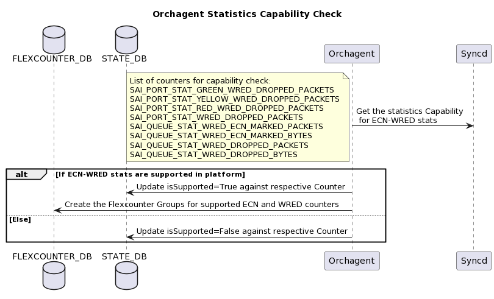
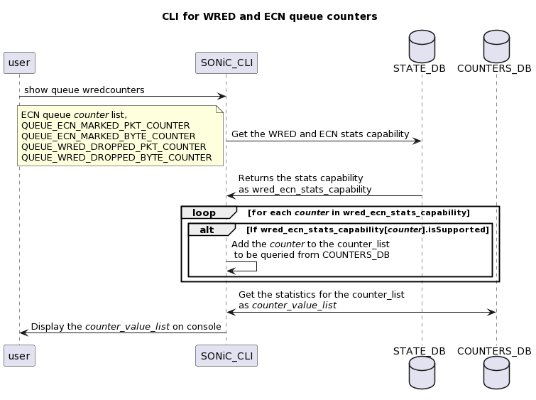

# ECN and WRED Statistics


## Table of Contents
- [ECN and WRED Statistics](#ecn-and-wred-statistics)
  - [Table of Contents](#table-of-contents)
    - [Revision](#revision)
    - [Scope](#scope)
    - [Abbreviations](#abbreviations)
    - [Overview](#overview)
    - [Requirements](#requirements)
    - [Architecture Design](#architecture-design)
    - [High-Level Design](#high-level-design)
      - [Changes in COUNTERS_DB](#changes-in-counters_db)
      - [Changes in FLEX_COUNTER_DB](#changes-in-flex_counter_db)
      - [Changes in STATE_DB](#changes-in-state_db)
      - [Changes in Orchagent](#changes-in-orchagent)
      - [CLI Changes](#cli-changes)
        - [show queue counters on a ECN statistics supported platform](#show-queue-counters-on-a-ecn-statistics-supported-platform)
        - [show queue counters on a platform which does not support ECN statistics](#show-queue-counters-on-a-platform-which-does-not-support-ecn-statistics)
        - [show interface counters on a WRED drop statistics supported platform](#show-interface-counters-on-a-wred-drop-statistics-supported-platform)
        - [show interface counters on a platform which does not support WRED drop statistics](#show-interface-counters-on-a-platform-which-does-not-support-wred-drop-statistics)
    - [SAI API](#sai-api)
    - [Configuration and management](#configuration-and-management)
    - [Warmboot and Fastboot Design Impact](#warmboot-and-fastboot-design-impact)
    - [Restrictions/Limitations](#restrictionslimitations)
    - [Testing Requirements/Design](#testing-requirementsdesign)
      - [Unit Test cases](#unit-test-cases)
      - [System Test cases](#system-test-cases)

### Revision

| Rev | Date     | Author                      | Change Description |
|:---:|:--------:|:---------------------------:|--------------------|
| 0.1 |23/Feb/23 | Rajesh Perumal **(Marvell)**| Initial Version    |

### Scope

This document provides the high level design for ECN Queue Statistics, WRED Port Statistics in SONiC

### Abbreviations


| Abbreviation  | Description                     |
|:-------------:|---------------------------------|
| __ECN__       | Explicit Congestion Notification|
| __WRED__      | Weighted Random Early Detection |
| __CLI__       | Command Line interface          |


### Overview

The main goal of this feature is to provide better WRED impact visibility in SONiC by providing a mechanism to count the packets that are discarded or ECN-marked due to WRED.

The other goal of this feature is to display these statistics only if the underlying platform supports it (Capability based statistics). CLI changes section explains this in detail. Every platform may have unique statistics capabilities, and they change over time, and so it is important for this feature to be capability based.

We will accomplish both the goals by adding support for per-queue ECN marked packets/bytes counters and per-port WRED dropped packets. Existing “queue counters” and “show interface counters detailed” CLI  will be enhanced for displaying these statistics.


### Requirements

1. Support per-queue total ECN marked packets counters
2. Support per-queue total ECN marked byte counters
3. Support per-port WRED dropped packets counters (per-color and total count)
4. Non-supported platforms will not display these statistics on CLI


### Architecture Design

There are no architectural design changes as part of this design.

1. Orchagent fetches the platform statistics capability for ECN and WRED counters from SAI
2. The stats capability will be updated to STATE_DB by orchagent
3. Based on the stats capability, Orchagent sets stat-ids to FLEX_COUNTERS_DB
    * In case, the platform is capable of ECN and WRED stats, they will be added to the respective QUEUE or PORT groups of the FLEX_COUNTERS_DB
5. Syncd has subscribed to Flex Counter DB and it will set up flex counters.
6. Flex counters periodically query platform counters and publishes data to COUNTERS_DB
7. CLI will look-up the Capability at STATE_DB
8. Only the supported statistics will be fetched and displayed on the CLI output

Existing flexcounter groups for port statistics(PORT_STAT_COUNTER_FLEX_COUNTER_GROUP) and queue statistics(QUEUE_STAT_COUNTER_FLEX_COUNTER_GROUP) will be enhanced to include the respective WRED and ECN statistics

### High-Level Design

This section covers the high level design of the WRED and ECN statistics feature.
This feature extends the existing queue stats and interface stats.

#### Changes in COUNTERS_DB

The following new port counters will be added along with existing counters on supported platforms

* COUNTERS_PORT_NAME_MAP:port
    * SAI_PORT_STAT_GREEN_WRED_DROPPED_PACKETS
    * SAI_PORT_STAT_YELLOW_WRED_DROPPED_PACKETS
    * SAI_PORT_STAT_RED_WRED_DROPPED_PACKETS
    * SAI_PORT_STAT_WRED_DROPPED_PACKETS

For every egress queue, the following statistics will be added along with existing queue conters on supported platforms

* COUNTERS_QUEUE_PORT_MAP:queue
    * SAI_QUEUE_STAT_WRED_ECN_MARKED_PACKETS
    * SAI_QUEUE_STAT_WRED_ECN_MARKED_BYTES

#### Changes in FLEX_COUNTER_DB

There are no new flex counter groups introduced for this feature.

On supported platforms,
* The ECN queue counters will use existing flexcounter group QUEUE_STAT_COUNTER_FLEX_COUNTER_GROUP
* The WRED port counter will use the existing flex counter group PORT_STAT_COUNTER_FLEX_COUNTER_GROUP.

#### Changes in STATE_DB
State DB will store information about ECN and WRED counter support as per the platform capability. This information will be populated during Orchagent startup by checking the platform capability.

```
"QUEUE_COUNTER_CAPABILITIES": {
    "QUEUE_ECN_MARKED_PKT_COUNTER": {
        "isSupported": "true",
    },
    "QUEUE_ECN_MARKED_BYTE_COUNTER": {
       "isSupported": "true",
    },
}

"PORT_COUNTER_CAPABILITIES": {
    "PORT_WRED_GREEN_DROP_COUNTER": {
        "isSupported": "true",
    },
    "PORT_WRED_YELLOW_DROP_COUNTER": {
        "isSupported": "true",
    },
    "PORT_WRED_RED_DROP_COUNTER": {
        "isSupported": "true",
    },
    "PORT_WRED_TOTAL_DROP_COUNTER": {
        "isSupported": "true",
    },
}

```

The default capability will be isSupported=false for all the above statistics.

### Changes in Orchagent
Orchagent gets the WRED and ECN counter capability during the startup and updates the STATE_DB with supported statistics. Based on the capability in STATE_DB, FLEXCOUNTER_DB will be updated with supported statistics for polling.
<p align=center>

</p>


### CLI Changes

There are no changes to existing CLI commands. However, the output of existing CLI would change. The CLI will display the ECN-WRED statistics only if the capability is supported by the platform. It gets the capability from STATE_DB and queries only the supported statistics from COUNTERS_DB.
Following are the CLI usages,

* ECN Marked Statistics
    * Cleared on user request (clear queue) :  clear queuecounters
    * Used by CLI (show queue) : show queue counters [interface-name]
* WRED drop statistics
    * Cleared on user request (clear counters) :  clear counters
    * Used by CLI (show queue) : show interfaces counters detailed \<interface-name\>

#### show queue counters on a ECN statistics supported platform

```
sonic-dut:~# show queue counters Ethernet16
      Port    TxQ    Counter/pkts    Counter/bytes    Drop/pkts    Drop/bytes   EcnMarked/pkts EcnMarked/bytes
----------  -----  --------------  ---------------  -----------  ------------   -------------- ---------------
Ethernet16    UC0               0                0            0             0               0               0
Ethernet16    UC1               1              120            0             0               1             120
Ethernet16    UC2               0                0            0             0               0               0
Ethernet16    UC3               0                0            0             0               0               0
Ethernet16    UC4               0                0            0             0               0               0
Ethernet16    UC5               0                0            0             0               0               0
Ethernet16    UC6               0                0            0             0               0               0
Ethernet16    UC7               0                0            0             0               0               0
```
#### show queue counters on a platform which does not support ECN statistics
```
sonic-dut:~# show queue counters Ethernet16
      Port    TxQ    Counter/pkts    Counter/bytes    Drop/pkts    Drop/bytes
----------  -----  --------------  ---------------  -----------  ------------
Ethernet16    UC0               0                0            0             0
Ethernet16    UC1               1              120            0             0
Ethernet16    UC2               0                0            0             0
Ethernet16    UC3               0                0            0             0
Ethernet16    UC4               0                0            0             0
Ethernet16    UC5               0                0            0             0
Ethernet16    UC6               0                0            0             0
Ethernet16    UC7               0                0            0             0

```
#### show interface counters on a WRED drop statistics supported platform
```
root@sonic-dut:~# show interfaces counters detailed Ethernet8
Packets Received 64 Octets..................... 0
Packets Received 65-127 Octets................. 2
Packets Received 128-255 Octets................ 0
Packets Received 256-511 Octets................ 0
Packets Received 512-1023 Octets............... 0
Packets Received 1024-1518 Octets.............. 0
Packets Received 1519-2047 Octets.............. 0
Packets Received 2048-4095 Octets.............. 0
Packets Received 4096-9216 Octets.............. 0
Packets Received 9217-16383 Octets............. 0

Total Packets Received Without Errors.......... 2
Unicast Packets Received....................... 0
Multicast Packets Received..................... 2
Broadcast Packets Received..................... 0

Jabbers Received............................... N/A
Fragments Received............................. N/A
Undersize Received............................. 0
Overruns Received.............................. 0

Packets Transmitted 64 Octets.................. 32,893
Packets Transmitted 65-127 Octets.............. 16,449
Packets Transmitted 128-255 Octets............. 3
Packets Transmitted 256-511 Octets............. 2,387
Packets Transmitted 512-1023 Octets............ 0
Packets Transmitted 1024-1518 Octets........... 0
Packets Transmitted 1519-2047 Octets........... 0
Packets Transmitted 2048-4095 Octets........... 0
Packets Transmitted 4096-9216 Octets........... 0
Packets Transmitted 9217-16383 Octets.......... 0

Total Packets Transmitted Successfully......... 51,732
Unicast Packets Transmitted.................... 0
Multicast Packets Transmitted.................. 18,840
Broadcast Packets Transmitted.................. 32,892
Time Since Counters Last Cleared............... None

WRED Green Dropped Packets..................... 1
WRED Yellow Dropped Packets.................... 3
WRED RED Dropped Packets....................... 10
WRED Total Dropped Packets..................... 14

```

#### show interface counters on a platform which does not support WRED drop statistics
```
root@sonic-dut:~# show interfaces counters detailed Ethernet8
Packets Received 64 Octets..................... 0
Packets Received 65-127 Octets................. 2
Packets Received 128-255 Octets................ 0
Packets Received 256-511 Octets................ 0
Packets Received 512-1023 Octets............... 0
Packets Received 1024-1518 Octets.............. 0
Packets Received 1519-2047 Octets.............. 0
Packets Received 2048-4095 Octets.............. 0
Packets Received 4096-9216 Octets.............. 0
Packets Received 9217-16383 Octets............. 0

Total Packets Received Without Errors.......... 2
Unicast Packets Received....................... 0
Multicast Packets Received..................... 2
Broadcast Packets Received..................... 0

Jabbers Received............................... N/A
Fragments Received............................. N/A
Undersize Received............................. 0
Overruns Received.............................. 0

Packets Transmitted 64 Octets.................. 32,893
Packets Transmitted 65-127 Octets.............. 16,449
Packets Transmitted 128-255 Octets............. 3
Packets Transmitted 256-511 Octets............. 2,387
Packets Transmitted 512-1023 Octets............ 0
Packets Transmitted 1024-1518 Octets........... 0
Packets Transmitted 1519-2047 Octets........... 0
Packets Transmitted 2048-4095 Octets........... 0
Packets Transmitted 4096-9216 Octets........... 0
Packets Transmitted 9217-16383 Octets.......... 0

Total Packets Transmitted Successfully......... 51,732
Unicast Packets Transmitted.................... 0
Multicast Packets Transmitted.................. 18,840
Broadcast Packets Transmitted.................. 32,892
Time Since Counters Last Cleared............... None
```

The below sequence diagram explains the "show queue counters" interaction among CLI, STATE_DB and COUNTERS_DB,
<p align=center>

</p>

The below sequence diagram explains the "show interface counters detailed" interaction among CLI, STATE_DB and COUNTERS_DB,
<p align=center>

</p>


### SAI API
Following SAI statistics are used in this feature,
* sai_query_stats_capability() is used to query the stats capability
    * For queue statistics, the object type must be SAI_OBJECT_TYPE_QUEUE
    * For port statistics, the object type must be SAI_OBJECT_TYPE_PORT

* SAI counters list,
    * SAI_QUEUE_STAT_WRED_ECN_MARKED_PACKETS
    * SAI_QUEUE_STAT_WRED_ECN_MARKED_BYTES
    * SAI_PORT_STAT_GREEN_WRED_DROPPED_PACKETS
    * SAI_PORT_STAT_YELLOW_WRED_DROPPED_PACKETS
    * SAI_PORT_STAT_RED_WRED_DROPPED_PACKETS
    * SAI_PORT_STAT_WRED_DROPPED_PACKETS

There are no new SAI APIs required for this feature.

### Configuration and management
No new CLI or datamodel changes are introduced.
No new fields are added to the Config DB.

### Manifest (if the feature is an Application Extension)
Not applicable?

### CLI/YANG model Enhancements
Not applicable


### Warmboot and Fastboot Design Impact
There are no impact to warmboot or fastboot.


### Restrictions/Limitations

* None

### Testing Requirements/Design

#### Unit Test cases
- On Supported platforms, Verify if the queuestat CLI display has ECN Queue statistics
- On Supported platforms, Verify if the port statistcs CLI display has the WRED statistics
- On ECN-WRED stats non-supported platforms,
    - Verify that CLI does not show the respective Headers in queue stats
    - Verify that CLI does not show the respective rows in port stats
    - Verify that the stat capability get is not logging errors to syslog

#### System Test cases
* New sonic-mgmt(PTF) ecn wred statistics testcase will be created to verify the statistics on supported platforms
