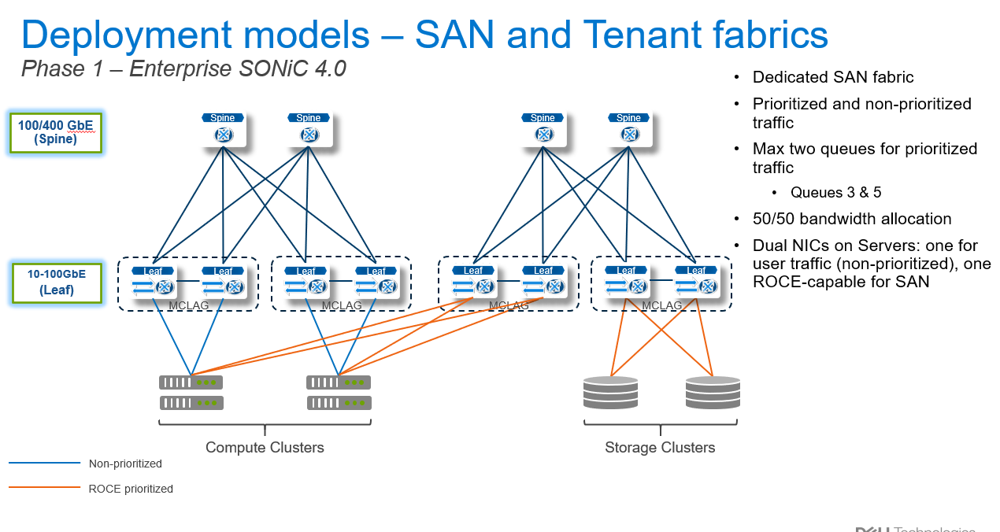
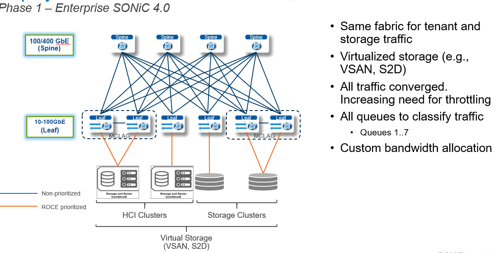

# Feature Name

RDMA (Remote Direct Memory Access) over Converged Ethernet (ROCEv2) support

# High Level Design Document

#### Rev 0.3

# Table of Contents

* [List of Tables](#list-of-tables)
* [Revision](#revision)
* [About This Manual](#about-this-manual)
* [Scope](#scope)
* [Definition/Abbreviation](#definitionabbreviation)

# List of Tables

[Table 1: Abbreviations](#table-1-abbreviations)

# Revision

| Rev |     Date    |       Author      	  | Change Description                |
|:---:|:-----------:|:---------------------------:|-----------------------------------|
| 0.1 | 06/17/2021  |   Venkatesan Mahalingam     | Initial version                   |
| 0.2 | 07/16/2021  |   Venkatesan Mahalingam     | Addressed review comments         |
| 0.3 | 08/03/2021  |   Venkatesan Mahalingam     | Added sample configurations       |
| 0.4 | 06/30/2022  |   Ashok Daparthi            | Added ROCE default configurations |
| 0.5 | 09/12/2022  |   Ashok Daparthi            | Per NPU feature capability checks |

# About this Manual

This document provides functional requirements and high-level design for ROCEv2 support in SONiC and introduces to support ROCEv2 in mgmt-framework,
this provides the North Bound Interface (NBI) interfaces i.e REST/gNMI/KLISH for the ROCEv2 configurations.

# References

# Scope

ROCEv2 uses available SONiC Qos Maps, Scheduler, ECN, PFC features to achieve functionality which is detailed in other design documents.
This document describes the high level design changes done for ROCEv2 support and other enhancements done in SONiC to achieve better manageability.

This document covers the following,

1) NBI interface to initialize QoS buffers for PFC
2) NBI interface to enable ROCE for PFC
3) NBI interface to modify buffer pool
4) NBI interface to create/delete/modify buffer profile
5) NBI interface to map/unmap priority group to buffer profile
6) NBI interface to map/unmap queues to buffer profile
7) NBI interface to set/unset PORT table for default buffer profile creation
   based on cable length and speed
8) Unit Test cases

# Definition/Abbreviation

## Table 1: Abbreviations

| **Term**                 | **Meaning**        	                |
|--------------------------|--------------------------------------------|
| RDMA                     | Remote Direct Memory Access         	|
| ROCEv2                   | RDMA over Converged Ethernet version 2	|
| PFC                      | Priority Flow Control               	|
| WRED                     | Weighted random early detection     	|
| ECN                      | Early congestion notification       	|
| CNP                      | Congestion notification packets     	|
| PG                       | Priority group           		 	|
| TC                       | Traffic Class           		 	|
| ISCSI                    | Internet Small Computer System Interface   |
| MMU                      | Memory Management Unit          		|
| HDRM                     | Headroom           		 	|
| NOS                      | Network Operating System          		|
| DWRR                     | Deficit Weighted Round Robin       	|


# 1 Feature Overview

ROCE provides the ability to transport Infiniband (IB) protocol traffic using RDMA over lossless converged Ethernet
across storage or compute nodes.

ROCEv2 stands for RDMA over Converged Ethernet version 2, this is an extension of ROCE protocol a.k.a routable ROCE,
This overcomes the limitation of ROCEv1 bounded to a single broadcast domain (VLAN),
ROCEv2 encapsulates an RDMA transport packet within the Ethernet/IPv4/UDP packet.
A RoCEv2 network should use various intelligent congestion control technologies to eliminate the potential packet loss
and high latency of a traditional Ethernet network. The goal is to have a zero-packet-loss, low-latency,
and high-throughput network for RoCEv2 distributed applications, meeting the stringent performance requirements of these applications.

ROCEv2 includes

* 802.1Qbb Policy Flow Control (PFC)
  ROCEv2 uses PFC to prevent buffer overflow and get zero-packet loss by generating priority based pause. With PFC, port having lossless and lossy priorities traffic at the same time by sending pause frame to only one (or some) priority traffic without impacting the others priority traffic. PFC is propagated on a hop by hop basis. And PFC frames are sent from node that has experienced congestion toward the sender. For example, from a switch to another switch, then from a switch to a server’s NIC.

* 802.1Qaz Enhanced Transmission Selection (ETS)
  With ETS, specific bandwidth is assigned to each of the CoS. It prevents a single traffic class of “hogging” all the bandwidth and starving other classes. And when a given load doesn’t fully utilize its allocated bandwidth, it is available to others classes.

* Data Center Bridging Capability Exchange protocol (DCBX) – 802.1Qaz [optional]

  DCBX negotiates Ethernet capability’s: PFC, ETC, CoS values between DCB capable peer devices.
  It is not mandatory but simplifies the management. DCBX is simply LLDP with new TLV fields.

* 802.1Qau Explicit Congestion Notification (ECN)
  ECN is an extension to WRED that marks packets instead of dropping them when the average queue length exceeds a specific threshold value.
  WRED ECN needs to be configured for all the nodes between source and destination host. When configured with the WRED ECN feature, switches, routers and end hosts use this marking as a signal that the network is congested to slow down sending packets.
  PFC performs by per-hop behavior, which at times might take more time than others to propagate congestion information to the sender.
  With ECN, congestion on any network device is propagated immediately to the endpoints and traffic is marked on any network device that experienced congestion.

* ROCEv2 deployments can use other features like PFC storm control/watchdog to prevent congestion caused by the malfunctioning NIC on a host may not be able to receive any traffic from the network and keeps sending PFC pause frames towards the switch. When the switches detect this situation on any egress queue, all the packets in the queue are flushed and new packets destined to the same queue are dropped as well, until PFC storming is relieved.

ROCEv2 uses PFC and ECN are used together, ECN should be the primary congestion management mechanism and PFC is secondary.

## 1.1 Requirements

### 1.1.1 Functional Requirements

- ROCEv2 support by hardening PFC, ETS, ECN
- Support 2 lossless priorities.
- Support enable/disable lossless configurations.
- Support Tuning lossless buffers like HDRM pool size, PG/Q min or alpha, PG_HDRM, HRDM offsets.
- Provide required performance and monitoring features.
- Support easy way to configure ROCEv2 required features (QoS maps, PFC, ETS, ECN) with well known standard default values.
- Support ROCEv2 and above changes in TD3 and TH3 platforms.
- All ports should be breakout before enabled lossless/roce, otherwise only next reboot only should bring ports in lossless mode/user allowed to use ports for lossy mode.

### 1.1.2 Functional Requirements out of scope

- Support SONiC NOS should have always default MMU buffers at pool, Priority group's, Queue's, this defaults should be as much as same as SDK default settings.
- Support any buffer configuration change without require reboot with min traffic loss.
- Support all Queues and PG's in lossy mode and user should able to tune buffer configurations.
- Support dynamic moving of PG3&4 and Q3&4 from lossy to lossless and vice versa.
- DCBX
- ROCEv2 over VXLAN support such as Copy 802.1p/DSCP/ECN bits from inner to outer header at ingress and vice-versa at egress to honor the QoS and priorities
- Support of Dynamic tuning of HDRM and buffers supported in Azure sonic "202012" branch.
- Support of selecting lossless PG and Q other than 3 &4.
- Support of enhanced functionality/configurations for "click" based management. 
- Support of control traffic isolation from data traffic.
- Support used to enable/disable lossless subset of ports/all ports.
- Support applying/removing buffers configuration during Dynamically breaking ports.

### 1.1.3 Configuration and Management Requirements

- CLI style configuration and show commands for features required for ROCEv2 support
- REST API support
- gNMI Support

#### 1.1.3.1 QoS buffer init/clear

This requirement is to follow the default lossless buffer settings defined for a particular platform.

#### 1.1.3.2 roce enable/disable

This requirement is to follow the default lossless buffer settings defined for a particular platform along with WRED/ECN configurations.

#### 1.1.3.3 QoS buffer pool modifications

This requirement is to modify the buffer pool for ingress & egress QoS operations.

#### 1.1.3.4 QoS buffer profile add/delete

This requirement is to add/delete the buffer profile for priority group (ingress) & queue(egress) QoS operations.

#### 1.1.3.5 QoS buffer priority group (ingress) to buffer profile map/unmap

This requirement is to map/unmap priority group (ingress) with buffer profile.

#### 1.1.3.6 QoS buffer queue (egress) to buffer profile map/unmap

This requirement is to map/unmap queue (egress) with buffer profile.

#### 1.1.3.7 Get operation on QoS buffer and it's mapping

This displays the output of the buffer pool/profile and it's mapping with priority group and queue.

#### 1.1.3.8 Allow user defined lossless profile based on cable length and speed

This requirement is to add a field in the PORT table to avoid automatic creation of buffer profile
for lossless profile based on the cable length and speed so that user can create the profile based on the particular use-case.

### 1.1.4 Scalability Requirements

### 1.1.5 Warm Boot Requirements

## 1.2 Design Overview

### 1.2.1 Basic Approach

- ROCEv2 required features are already implemented in SONiC, approach is to hardening existing features.

- New code changes to handle setting lossless buffer configurations on ports created newly during DPB.

- Implement QoS buffer configuration and get support using transformer in sonic-mgmt-framework.

### 1.2.2 Container

The front end code change will be done in management-framework container including:

- XML file for the CLI
- Python script to handle CLI request (actioner)
- Jinja template to render CLI output (renderer)
- OpenConfig YANG model for QoS buffer openconfig-qos.yang
- SONiC QoS buffer model on Redis DB schema
- Transformer functions to convert OpenConfig YANG model to SONiC YANG model for buffer related configurations

SWSS:

- Generate default ROCE configurations and apply to config_db for new ports created with DPB.

### 1.2.3 SAI Overview

There is no new API's required, SAI enhanced to support buffer tuning after moving to lossless mode.

- Allow buffer pool, PG, unicast queues, multicast queues, CPU queues buffer configurations while moving to lossless mode.
- PG buffer profile settings
- Headroom pool settings
- Q buffer profile settings

# 2 Functionality

## 2.1 Target Deployment Use Cases



**Figure 1: Example deployment model 1**



**Figure 1: Example deployment model 2**

## 2.2 Functional Description

ROCEv2 is collection of features in SONiC i.e QoS classification, scheduling(ETS), PFC, PFC Asymmetric, PFC watchdog, ECN, remark and counters and stats.
All below configurations already present in SONiC, Functionality adding as part of enhancements is to solve inherit problems in SONiC and provide better controllability with CLI, gNMI and REST support.

### 2.2.1 Configurations already supported

#### 2.2.1.1 dot1p & DSCP to Traffic Class mapping:

DSCP is preferred over dot1p when both are present in the data traffic but both is not expected to co-exist.

```
sonic(config)# qos map dot1p-tc rocev2_dot1p-to-tc
sonic(conf-dot1p-tc-map-rocev2_dot1p-to-tc)# dot1p 4 traffic-class 4
sonic(conf-dot1p-tc-map-rocev2_dot1p-to-tc)#

sonic(config)# qos map dscp-tc rocev2_dscp-to-tc
sonic(conf-dscp-tc-map-rocev2_dscp-to-tc)# dscp 6 traffic-class 4
sonic(conf-dscp-tc-map-rocev2_dscp-to-tc)#
```

#### 2.2.1.2 Traffic class to dot1p & DSCP mapping

```
sonic(config)# qos map tc-dot1p rocev2_tc-to-dot1p
sonic(conf-tc-dot1p-map-rocev2_tc-to-dot1p)# traffic-class 4 dot1p 4
sonic(conf-tc-dot1p-map-rocev2_tc-to-dot1p)#

sonic(config)# qos map tc-dscp rocev2_tc-to-dscp
sonic(conf-tc-dscp-map-rocev2_tc-to-dscp)# traffic-class 4 dscp 6
sonic(conf-tc-dscp-map-rocev2_tc-to-dscp)#

```

#### 2.2.1.3 Traffic Class to Queue mapping

```
sonic(config)# qos map tc-queue rocev2_tc-q
sonic(conf-tc-queue-map-rocev2_tc-q)# traffic-class 4 queue 4

```

#### 2.2.1.4 Traffic Class to Priority-group mapping: (PFC Pause frames priority only 3 & 4 are supported HW)

```
sonic(config)# qos map tc-pg rocev2_tc-pg
sonic(conf-tc-pg-map-rocev2_tc-q)# traffic-class 3 priority-group 3
sonic(conf-tc-pg-map-rocev2_tc-q)# traffic-class 4 priority-group 4

```

#### 2.2.1.5 PFC priority to queue 

```
sonic(config)# qos map pfc-priority-q rocev2_pfc-priority-q
sonic(conf-tc-queue-map-rocev2_tc-q)# pfc-priority 3 queue 3
sonic(conf-tc-queue-map-rocev2_tc-q)# pfc-priority 4 queue 4

```

#### 2.2.1.6 ECN configuration

```
sonic(config)# qos wred-policy rocev2_wred
sonic(conf-wred-rocev2_wred)# green minimum-threshold 1048 maximum-threshold 2097 drop-probability 5
sonic(conf-wred-rocev2_wred)# ecn all

```

#### 2.2.1.7 PFC watchdog configuration

```
sonic(config)# priority-flow-control watchdog polling-interval 300
sonic(config)# priority-flow-control watchdog counter-poll

```

#### 2.2.1.8 counters

- Support for queue, pg watermark counters
- Support for ECN marked counters
- support for queue counters
- Support for PFC counters
- Support for PFC watchdog counters

```
clear queue watermark unicast
clear priority-group watermark shared
clear priority-group watermark headroom

show queue watermark unicast|multicast 

show priority-group watermark shared

show priority-group watermark headroom
show priority-group watermark headroom
```

### 2.2.1.9 Existing CLICK commands

``` config qos reload ```
- Clear all qos maps, scheduler, wred and buffer configuration tables  in config db
-  Generate defaults qos and buffer configuration on all ports by buffer_config.j2/qos_config.j2 files

``` config qos clear ```
- Clear all qos maps, scheduler, wred and buffer configuration tables  in config db

``` config qos buffers reload ```

- Clear all buffer configuration tables in config db
- Generate defaults buffer configuration on all ports by buffer_config.j2/qos_config.j2 files

``` config qos buffers clear  ```

- Clear all buffer configuration tables  in config db

``` config qos classifiers reload ```
- Clear all qos maps, scheduler, wred configuration tables  in config db
- Generate defaults qos configuration on all ports by buffer_config.j2/qos_config.j2 files

``` config qos classifier clear  ```
- Clear all qos maps, scheduler, wred  configuration tables  in config db


ROCEv2 to work, PFC should work. PFC to work all required configurations to set properly and need provision to modify values based on customer needs. Which will allow to get better throughput and latency incase of defaults provided by SONiC does not work in some deployments. PFC is mainly depends on buffer configuration set on PG's and Q's.

### 2.2.2 Default SONiC buffers

Present SONiC buffers default are SDK defaults. MMU has concept of applying buffers at pool's, PG's and Queue's. Buffer thresholds and accounting done at ingress and egress. And total buffers can split to pool's, PG's/Q's can map to pool. Each PG/Q can have some reserved buffers and rest can be shared in the same pool. Shared can have static limit and dynamic limit(%) of available shared buffers at instance.

#### 2.2.2.1 SDK buffer defaults

As part of SDK initialization, buffers are allocated as below and can vary from each NPU

Ingress:

- Single pool - Max buffer size by removing the reserved sizes.
- All traffic classes i.e all packets are mapped to PG7.
  - PG7 min
  - PG7 Shared static and set with static_th of max buffer size.

Egress:

- Single pool - Max buffer size by removing the reserved sizes.
- All queues are lossy mode i.e tail drop can happen after utilization of total shared buffers.
  - Q_min  -
  - Q shared is dynamic mode with value of 3.

#### 2.2.2.2 SONiC buffer defaults

There is no NOS/SONiC defaults, SDK defaults are SONiC defaults when ROCEv2/lossless behavior not enabled.

#### 2.2.2.3 Backend mechanism to support buffer configuration and get

QoS has the following tables in the Redis ConfigDB, the size & xoff values vary based on HW capabilities.

```
"BUFFER_POOL": {
 "egress_lossless_pool": {
     "mode": "static",
     "size": "32575488",
     "type": "egress"
 },
 "ingress_lossless_pool": {
     "mode": "dynamic",
     "size": "26284032",
     "type": "ingress",
     "xoff": "6291456"
 }
},
"BUFFER_PROFILE": {
 "egress_lossless_profile": {
     "mode": "static",
     "pool": "[BUFFER_POOL|egress_lossless_pool]",
     "size": "0",
     "static_th": "32575488"
 },
 "egress_lossy_profile": {
     "dynamic_th": "3",
     "mode": "dynamic",
     "pool": "[BUFFER_POOL|egress_lossless_pool]",
     "size": "0"
 },
 "ingress_lossy_profile": {
     "dynamic_th": "3",
     "pool": "[BUFFER_POOL|ingress_lossless_pool]",
     "size": "0"
 },
 "pg_lossless_100000_40m_profile": {
     "dynamic_th": "-3",
     "pool": "[BUFFER_POOL|ingress_lossless_pool]",
     "size": "1248",
     "xoff": "177632",
     "xon": "2288",
     "xon_offset": "2288"
 },
 "pg_lossless_10000_40m_profile": {
     "dynamic_th": "-3",
     "pool": "[BUFFER_POOL|ingress_lossless_pool]",
     "size": "1248",
     "xoff": "37024",
     "xon": "2288",
     "xon_offset": "2288"
 }
},
"BUFFER_PG": {
       "Ethernet0|0": {
           "profile": "[BUFFER_PROFILE|ingress_lossy_profile]"
       },
       "Ethernet0|3-4": {
           "profile": "[BUFFER_PROFILE|pg_lossless_100000_40m_profile]"
       },
       ........
       .......
}

"BUFFER_QUEUE": {
  "Ethernet0|0-2": {
          "profile": "[BUFFER_PROFILE|egress_lossy_profile]"
   },
  "Ethernet0|3-4": {
          "profile": "[BUFFER_PROFILE|egress_lossless_profile]"
   },
  "Ethernet0|5-6": {
          "profile": "[BUFFER_PROFILE|egress_lossy_profile]"
  },
  .......
  .......
}

```

The above tables are populated in the SONiC system upon executing the '"config qos reload"/"config qos buffer reload"/"buffer init"/"roce enable"' command, otherwise there is no configs from NOS.

#### 2.2.2.5 Lossy ingress Buffer

- PG7 is default priority group to map lossy traffic.
- Traffic mapped to PG7 are not pause enabled.
- Always PG7 have "ingress_lossy_profile" profile applied or user defined buffer profile applied.
- Ingress lossy profile settings should make sure no traffic drops at ingress due to buffer thresholds by setting static_th to max buffer size.
- User defined buffer profiles applied PG should persist after saving config's and reload.
- "ingress_lossy_profile" is not allowed to modify and delete not supported.

```
 "ingress_lossy_profile": {
      "pool":"ingress_lossless_pool",
      "size":"0",
      "static_th":"32712448"
  },
        
```

#### 2.2.2.6 Lossy egress Buffer 

- Lossy queue means, i.e traffic can drop by tail drop when it congested and available buffers are fair share for required queues.
- Lossy egress buffer profile set with "dynamic" mode.
- Always lossy unicast queues should have "egress_lossy_profile" profile or user defined buffer profile applied.
- Always Multicast queues have "egress_lossy_profile" profile applied.
- Always CPU queues have "egress_lossy_profile" profile applied.
- User defined buffer profiles applied on queue should persist after saving config's and reload.
- "egress_lossy_profile" is allowed to modify and delete is not supported.

```
"egress_lossy_profile": {
     "dynamic_th": "3",
     "mode": "dynamic",
     "pool": "[BUFFER_POOL|egress_lossless_pool]",
     "size": "0"
 },

```

#### 2.2.2.7 Ingress Lossless Buffer

- Ingress PG lossless buffers, which are used to generate pause (PFC) and to handle RTT packets(HDRM).
- PG3&4 is reserved for ingress lossless traffic. Map only lossless traffic should be mapped to these PG's.
- Ingress PG3&4 lossless buffer profiles are dynamically derived based on speed of port and cable length and allowed to modify/ apply new user defined lossless profiles.
- Lossless profile is dynamic mode, After PG utilizes shared available buffer, pause will generate.
- xoff in profiles is max limit of each lossless PG can use buffer form HDRM pool.
- Default ingress profiles is not allowed to change, but user can create profile and apply.

```

"pg_lossless_10000_40m_profile": {
     "dynamic_th": "-3",
     "pool": "[BUFFER_POOL|ingress_lossless_pool]",
     "size": "1248",
     "xoff": "37024",
     "xon": "2288",
     "xon_offset": "2288"
 }

```

#### 2.2.2.8 Egress Lossless Buffers

- Lossless queue's should not drop any traffic due to buffer limits. lossless profiles is set with static_th of max buffer size.
- Egress Queue lossless buffers should allow packets which are allowed by ingress lossless PG's.
- Q3 and Q4 are reserved for egress lossless traffic. Map only lossless traffic should be mapped to these Q's.
- Egress Q3&Q4 are applied with "egress_lossless_profile"
- "egress_lossless_profile" is not allowed to delete or change.

```
 "egress_lossless_profile": {
     "mode": "static",
     "pool": "[BUFFER_POOL|egress_lossless_pool]",
     "size": "0",
     "static_th": "32575488"
 },

```

#### 2.2.2.9 Buffer pools

Number of buffer pools required to support lossless behavior depends on MMU architecture.
Some NPU i.e require 2 egress pools at egress to support lossless functionality.
Below are buffer pool, profiles setting for TD3 and TH3 platforms


### 2.2.3 Platform lossless mode buffer settings

#### 2.2.3.1 TD3 Platform lossless mode buffer settings

```

    "BUFFER_POOL": {
        "ingress_lossless_pool": {
            "size": "32756480",
            "type": "ingress",
            "mode": "dynamic",  
            "xoff": "2621440"
        },
        "egress_lossy_pool": {
            "size": "24709632",
            "type": "egress",
            "mode": "dynamic"
        },
        "egress_lossless_pool": {
            "size": "32475136",
            "type": "egress",
            "mode": "static"
        }
    },

    "BUFFER_PROFILE": {
        "ingress_lossy_profile": {
            "pool":"ingress_lossless_pool",
            "size":"0",
            "static_th":"32756480"
        },
        "egress_lossless_profile": {
            "pool":"egress_lossless_pool",
            "size":"0",
            "static_th":"32475136"
        },
        "egress_lossy_profile": {
            "pool":"egress_lossy_pool",
            "size":"0",
            "dynamic_th":"3"
        }
    },


```

- Ingress is always single pool i.e "ingress_lossless_pool
- With lossless configurations, pool XOFF size is reserved buffer for HDRM or RTT packets after generate pause.
- XOFF should be configurable by user.
- Egress needs 2 pools to support lossless behavior in TD3.
- For lossless, egress_lossless_pool is used and configured with maximum buffer size.
  But lossy pool size is adjusted based on configuration in above file, this is to share some lossless buffers to lossy traffic and guarantee lossless behavior.
- Pool size modifications are supported but pool delete and modifying pool names not supported.
- XOFF pool limits are updated based on port count in each platform.

#### 2.2.3.2 TH3 Platform lossless mode buffer settings

```
buffer_defaults.json.j2  




    "BUFFER_POOL": {
        "ingress_lossless_pool": {
            "size": "66394076",
            "type": "ingress",
            "mode": "dynamic",
            "xoff": "15728640"
        },
        "egress_lossless_pool": {
            "size": "50665436",
            "type": "egress",
            "mode": "static"
        }
    },
    "BUFFER_PROFILE": {
        "ingress_lossy_profile": {
            "pool":"[BUFFER_POOL|ingress_lossless_pool]",
            "size":"0",
            "static_th":"66394076"
        },
        "egress_lossless_profile": {
            "pool":"[BUFFER_POOL|egress_lossless_pool]",
            "size":"0",
            "static_th":"67117468"
        },
        "egress_lossy_profile": {
            "pool":"[BUFFER_POOL|egress_lossless_pool]",
            "size":"0",
            "mode": "dynamic",
            "dynamic_th":"2"
        }
    },


```

- Ingress is always single pool i.e "ingress_lossless_pool
- With lossless configurations, pool XOFF size is reserved buffer for HDRM or RTT packets after generate pause.
- Xoff should be configurable by user.
- Egress also single pool to support lossless behavior in TH3 i.e  egress_lossless_pool
- With this approach lossy traffic and lossless traffic will share buffers and better utilization of buffer for lossy traffic.
- Pool size modifications are supported but pool delete and modifying pool names not supported.

### 2.2.4 Moving to lossless buffers mode

Change default buffers to lossless buffers to support lossless behavior. This changes requires reboot for clean initialization of MMU.

- Lossless buffers will be initialized/de-initialized by "buffer init"/"roce enable".
- Pool's for lossy and lossless are created traffic based on NPU.
- Configure HDRM Pool in ingress pool
- Apply PG3&PG4 with default lossless buffer profiles and PG7 with lossy profile
- Apply Q3&Q4 with lossless buffer profiles and All other queues in system with lossy.

"buffer init" supports only initializing only buffers at pool, PG and queue. All other required configurations to support ROCEv2 should be done by user.

To minimize user configurations mistakes this release will enhanced to provide "roce enable" to set ROCEv2 default configurations.

### 2.2.5 Moving from lossless mode to defaults

SONiC clears buffer configuration from NOS to bring it to original defaults by "buffer deinit"/"roce disable". This changes requires reboot for clean initialization of MMU.

"buffer de-init" supports clearing only buffers at pool, PG and queue. All other required configurations should be removed by user to disable ROCEv2.

To minimize user configurations mistakes this release will enhanced clear all roce defaults by "roce disable".

### 2.2.6 Dynamic buffer configuration change

NPU has limitations for changing buffer configurations when traffic is running on PG/Q or port, which leads to MMU to corrupt.

- SONiC Default buffer configurations will be applied before declare portsReady.
- Recommended to change any buffer parameters when there is no traffic in system.

Below are buffer parameters are supported for tuning

### Table 1: Configurations change supported in lossless mode

| **Attribute**                 | **Support**|
|-------------------------------|------------|
| pool size                	| Yes        |
| pool xoff                	| Yes        |
| ingress PG profile creation   | Yes        |
| ingress PG profile apply      | Yes        |
| ingress PG MIN       		| Yes        |
| ingress PG dynamic th         | Yes        |
| ingress PG shared th          | Yes        |
| ingress PG xoff th        	| Yes        |
| Egress Q buffer profile       | Yes        |
| Egress Q buffer profile apply | Yes        |
| Egress Q min      		| Yes        |
| Egress Q dynamic th       	| Yes        |
| Egress Q static  th       	| Yes        |

### 2.2.7 ROCEv2 default configurations

Typical deployments for lossless is ROCEv2 and ISCSI and it not limited to these 2. Customers can use any unicast traffic as lossless, but SONiC supports only 2 lossless priorities in this release. ROCEv2 is achieved by enable multiple features. SONiC is enhanced to provide single command as configuration option to setup with default ROCEv2/ISCSI lossless settings, classifications, ECN, scheduling etc and also provided to option to modify based on customer specific needs with mgmt-framework CLI.

- Added "roce enable" CLI to enable lossless functionality in SONiC and also it configures below default configurations

- SONiC supports 2 lossless priorities
  - Priority 3 is default reserved for RDMA
  - Priority 4 is default reserved for ISCSI
- RDMA traffic is classified as DSCP 24 & 26/DOT1P 3 -> TC-3 -> PG-3 -> Q-3
- ISCSI traffic is classified to DSCP 4/DOT1P 4 -> TC-4 -> PG-4 -> Q-4
- CNP packets generated by server typically marked with DSCP 48, default DSCP 48 mapped to Q6 to give high priority scheduling.
- All other DSCP/DOT1P -> TC0 -> PG7 -> Q0

- Default DSCP 24&26 are general use for RDMA from server world in case RDMA traffic coming from different DSCP, SONiC provides option to change default DSCP-TC map. But recommends to use traffic class 3.

- Configure buffers from lossy to lossless i.e refer 2.2.4
- ECN is enabled on Q3
- Bandwidth are set equally to Q0:Q3:Q4

Below is set of default configurations set in all existing ports:

```
 "DOT1P_TO_TC_MAP|ROCE": {
    "value": {
      "0": "0",
      "1": "0",
      "2": "0",
      "3": "3",
      "4": "4",
      "5": "0",
      "6": "0",
      "7": "0"
    }
  },

 "DSCP_TO_TC_MAP|ROCE": {
    "value": {
      "4": "4",
      "24": "3",
      "26": "3",
      "48": "6"
    }
  },

 "MAP_PFC_PRIORITY_TO_QUEUE|ROCE": {
    "value": {
      "0": "0",
      "1": "1",
      "2": "2",
      "3": "3",
      "4": "4",
      "5": "5",
      "6": "6",
      "7": "7"
    }
  },

 "TC_TO_PRIORITY_GROUP_MAP|ROCE": {
    "value": {
      "0": "7",
      "1": "7",
      "2": "7",
      "3": "3",
      "4": "4",
      "5": "7",
      "6": "7",
      "7": "7"
    }
  },

 "TC_TO_QUEUE_MAP|ROCE": {
    "value": {
      "0": "0",
      "1": "1",
      "2": "2",
      "3": "3",
      "4": "4",
      "5": "5",
      "6": "6",
      "7": "7"
    }
  },

 "PORT_QOS_MAP|Ethernet0": {
    "value": {
      "dot1p_to_tc_map": "[DOT1P_TO_TC_MAP|ROCE]",
      "dscp_to_tc_map": "[DSCP_TO_TC_MAP|ROCE]",
      "pfc_enable": "3,4",
      "pfc_to_queue_map": "[MAP_PFC_PRIORITY_TO_QUEUE|ROCE]",
      "tc_to_pg_map": "[TC_TO_PRIORITY_GROUP_MAP|ROCE]",
      "tc_to_queue_map": "[TC_TO_QUEUE_MAP|ROCE]"
    }
  },


"BUFFER_PG|Ethernet0|7": {
    "value": {
      "profile": "[BUFFER_PROFILE|ingress_lossy_profile]"
    }
  },
  "BUFFER_PG|Ethernet0|3-4": {
    "value": {
      "profile": "[BUFFER_PROFILE|pg_lossless_10000_40m_profile]"
    }
  },

 "BUFFER_QUEUE|Ethernet0|0-2": {
    "value": {
      "profile": "[BUFFER_PROFILE|egress_lossy_profile]"
    }
  },
  "BUFFER_QUEUE|Ethernet0|3-4": {
    "value": {
      "profile": "[BUFFER_PROFILE|egress_lossless_profile]"
    }
  },
 "BUFFER_QUEUE|Ethernet0|5-9": {
    "value": {
      "profile": "[BUFFER_PROFILE|egress_lossy_profile]"
    }
  },
   /* Multicast queues */
   "BUFFER_QUEUE|Ethernet0|10-17": {
    "value": {
      "profile": "[BUFFER_PROFILE|egress_lossy_profile]"
    }
  },


 "WRED_PROFILE|ROCE": {
    "value": {
      "ecn": "ecn_green",
      "green_drop_probability": "5",
      "green_max_threshold": "2097152",
      "green_min_threshold": "1048576",
      "wred_green_enable": "true",
    }
  },

"SCHEDULER|scheduler@0": {
    "value": {
      "type": "DWRR",
      "weight": "50"
    }
  },
"SCHEDULER|scheduler@3": {
    "value": {
      "type": "DWRR",
      "weight": "50"
    }
  },

"SCHEDULER|scheduler@4": {
    "value": {
      "type": "DWRR",
      "weight": "50"
    }
  },

"SCHEDULER|scheduler@6": {
    "value": {
      "type": "STRICT",
    }
  },

 "QUEUE|Ethernet0|0": {
    "value": {
      "scheduler": "[SCHEDULER|scheduler@0]"
    }
  },

"QUEUE|Ethernet0|3": {
    "value": {
      "scheduler": "[SCHEDULER|scheduler@3]"
      "wred_profile": "[WRED_PROFILE|ROCE]"
    }
  },

"QUEUE|Ethernet0|4": {
    "value": {
      "scheduler": "[SCHEDULER|scheduler@4]"
    }
  },

"QUEUE|Ethernet0|6": {
    "value": {
      "scheduler": "[SCHEDULER|scheduler@6]"
    }
  },

```
### 2.2.8 CLI Functional behaviors

#### 2.2.8.1 Lossless buffer initialization

- Buffer mode is lossless already, No change to system configurations.
- No pre applied buffer configurations, enable all default settings.
- Update buffer mode as "Lossless" in "SWITCH" db table in config db.
- Configs are saved and system will reboot

#### 2.2.8.2 roce enable

- if "buffer init" is done, Return "roce enable" with error. This will avoid conflicts.
- if ROCE already enabled, No change to system configurations.
- Check if any conflicting configurations across all ports. i.e Any pre applied buffer configurations, maps, scheduler, wred and return error with details.
- No pre applied configurations, enable all default settings.
- With ``` roce enable force-defaults ```, below is behavior
  - clear all roce default buffer, maps, scheduler, wred configurations
  - Generate all ROCE defaults in all ports.
- Update roce as true in "SWITCH" db table in config db.
- ROCE state is stored in "SWITCH" db table in config db.
- Configs are saved and system will reboot

#### 2.2.8.3 buffer de-initialization

- roce enabled in SWITCH table, buffer de-init cannot be done.
- if buffer mode is not lossless, no changes required.
- All buffer configurations are removed from config db.
- Remove buffer mode from SWITCH table in config db.
- Configs are saved and system will reboot

#### 2.2.8.4 roce disable

- roce is not enabled in SWITCH table, no action.
- Remove all buffer configurations from Config DB.
- All default ROCE required configurations are removed i.e maps, scheduler, ecn.
- Configs are saved and system will reboot

#### 2.2.8.5 Lossy buffer initialization {lossy}- future enhancements not in 4.1

- ``` buffer init lossy ``` will be enhanced to configure buffers with lossy defaults. And can be used to provide buffer tuning in lossy mode.

#### 2.2.8.6 roce enable {} - future enhancements not in 4.1

- Take RDMA, CNP, ISCSI DSCP values and generate DSCP_TC maps.
- Bandwidth % for split for between lossy and lossless traffic.

### 2.2.8.9 CLICK CLI Enhancements

- Below are newly added in community, This will be taken to inherit this to e-sonic

```
config qos reload --ports Ethernet0, Ethernet4
config qos reload --no-dynamic-buffer 
config qos reload --json-data --dry-run

```

- Generate default Configurations for newly created ports  or ports does not have ROCE/buffer configurations and load it to config db. This can be used to generate configs after DPB.

```
config qos reload --update --all-new-ports

```
- Clear only default ROCE qos maps, scheduler, wred etc.

```
config qos classifier clear --defaults
```

### 2.2.9 Dynamic port breakout

- Recommended to breakout ports before moving to lossless mode.
- Ports created after moving to lossless mode should not be usable until next reboot.
- While next bootup, All new ports are applied with lossless profiles based on "buffer init"/"roce enable" configuration.
- All configurations removed before on port delete as part of DPB and set with NULL oid for PG and Q buffer profiles on that port.
- CLI warning should be given to user in while giving DPB in lossless mode

```
sonic# configure terminal
sonic(config)#interface breakout  port 1/1 mode 4x10G
Warning: Switch in "lossless" mode, Ports created can be used only after reboot
```

### 2.2.7 Platform capability support

Support of RoCEv2/Lossless configurations are targeting only for TD3 and TH3 in 4.1 release.
Feature support should be controlled by capability of NPU and also some of the configurations limits depends NPU, which needs to be derive dynamically from NPU/SAI. In 4.1, We are adding this based on new platform file.

- Add platform_qos.json file each TD3/TH3 platform hwsku directory i.e  ```usr/share/sonic/hwsku/```
- platform_qos.json file will have QOS capabilities as below.

```
QOS_CAPABILITIES {
  “buffer_mode” : “lossless/lossy/both”,
  “buffer_dynamic_tuning” : “true/false”,
  “POOL_XOFF_MIN_LIMT: “1MB”,
  “POOL_XOFF_MAX_LIMT: “16MB”,
  “PG_MIN_LOW_LIMIT” : “0”,
  “PG_MIN_HIGH_LIMIT” : “XXX”,
  “PG_XOFF_LOW_LIMIT” : “0”,
  “PG_XOFF_HIGH_LIMIT” : “XXX”,
  “PG_XON_LOW_LIMIT” : “0”,
  “PG_XON_HIGH_LIMIT” : “XXX”,
  “Q_MIM_LOW_LIMIT” : “0”,
  “Q_MAX_HIGH_LIMIT” : “XXX”,
  “WRED_MAX_LIMIT” : “XXX”
}

```
- swss container start will read platform_qos.json and update QOS_CAPABILITIES in STATE_DB.
- QOS_CAPABILITIES in STATE_DB will be used by management interfaces like CLI/YANG to validate before enabling ROCE/Lossless per platform.
- TD3/TH3 qos capabilities
```
QOS_CAPABILITIES { 
  “buffer_mode” : “lossless”,
  “buffer_dynamic_tuning” : “true”
}
```
## 2.3 Backend change to support new configurations

Provide change in management framework and buffermgrd modules.

# 3 Design

## 3.1 Overview

Enhancing the management framework backend code and transformer methods to add support for QoS buffer.

## 3.2 DB Changes

### 3.2.1 CONFIG DB

Config DB table is enhanced to store "lossless enable/disable" state

**SWITCH table**

* Producer: Management framework/config_db.json/Click command
* Consumer: buffermgrd
* Description: Update existing table to store "buffer init"/"roce enable" state configuration.
* Schema:

```
;Existing table
;defines SWITCH information. Store buffer mode/roce enable state configuration
;
;Status: stable
buffer_mode_lossless = true/false ; default value - false
roce_enable = true/false ; default value - false
```

**PORT table**

* Producer: Management framework/config_db.json/Click command
* Consumer: buffermgrd
* Description: Update existing table to store 'default_lossless_buffer_profile' configuration.
* Schema:

```
;Existing table
;defines PORT information. Store default_lossless_buffer_profile configuration
;
;Status: stable
key = PORT|ifname;
default_lossless_buffer_profile = true/false ; default value - true
```

### 3.2.2 APP DB

### 3.2.3 STATE DB

### 3.2.4 ASIC DB

### 3.2.5 COUNTER DB

## 3.3 Switch State Service Design

### 3.3.1 Qos Configuration generation


#### 3.3.1.1 Port ROCE/buffer configuration generation

SONiC ```files/build_templates/buffers_config.j2``` and ```files/build_templates/qos_config.j2``` files are used for generate default buffer and qos configurations by using the platfrom specific files like ```/usr/share/sonic/hwsku/qos.json.j2``` and ```/usr/share/sonic/hwsku/buffer.json.j2```

- buffers_config.j2 & qos_config.j2 files are enhanced to generate configuration by taking input "roce_enable/buffer_mode_lossless".

- buffers_config.j2 & qos_config.j2 are modified to remove references for "AZURE" and changed to generate ROCE configurations listed section 2.2.7(ROCEv2 default configurations)

##### 3.3.1.2 Dynamic port breakout

All new ports created with DPB will be configured with lossless/ROCE configurations in next reboot. To achieve this

As part of "swss" docker pre start action, ROCE configs are generated with ports does not have default configurations in config DB. This is handled in ```files/build_templates/docker_image_ctl.j2```.

```
function preStartAction()
  # if roce enabled 
  config qos reload --update --all-new-ports 

  #if buffer_mode_lossless 
  config qos buffers reload -update --all-new-ports 

```

### 3.3.2 Configuration Manager


#### 3.3.2.1 CPU port buffer configurations

- CPU port are not handled BUFFER_QUEUE/BUFFER_PG. Changes are done to take CPU port also as KEY and to accept CPU queue index 0-24.

```
sonic-buffer-pg.yang 
sonic-buffer-queue.yang
```
- TBD code details.

#### 3.3.2.2 Per port multicast queues buffer configurations

- Configurations Generation and apply profiles to multicast queues enhanced in ``` buffer_config.j2 ```

- YANG index validations are modified
```
sonic-buffer-queue.yang
```
- No changes are expected in backend.


### 3.3.1.2 Defaults Configurations

* Avoid the default buffer profile creation based on cable length and speed when the field 'default_lossless_buffer_profile' in PORT table is set to false.

### 3.3.3 Orchestration Agent

Dynamic buffer configuration changes

#### 3.3.3.1 CPU queues buffer configurations

Add support to handle CPU port queues/PG buffer configurations

### 3.3.3 Other Process

## 3.4 SyncD

## 3.5 SAI

- sal sai_optimized_mmu=1 configuration to be added to config.bcm files for td3 and th3.

- Add below configurations in td3, this will adjust the reserved size based on egress settings in ingress pool.
 
```
buf.map.egress_pool0.ingress_pool=0
buf.map.egress_pool1.ingress_pool=0
buf.map.egress_pool2.ingress_pool=1

```
Following are attribute support added in TD3, Th3 after moving to lossless mode:

- SAI_BUFFER_POOL_ATTR_SIZE
- SAI_BUFFER_POOL_ATTR_XOFF_SIZE
- SAI_BUFFER_PROFILE_ATTR_RESERVED_BUFFER_SIZE
- SAI_BUFFER_PROFILE_ATTR_BUFFER_SIZE
- SAI_BUFFER_PROFILE_ATTR_SHARED_DYNAMIC_TH
- SAI_BUFFER_PROFILE_ATTR_SHARED_STATIC_TH
- SAI_BUFFER_PROFILE_ATTR_XOFF_TH
- SAI_BUFFER_PROFILE_ATTR_XON_TH
- SAI_BUFFER_PROFILE_ATTR_XON_OFFSET_TH

## 3.6 User Interface

### 3.6.1 Data Models

YANG model needed for QoS buffer handling in the management framework:
gb
**openconfig-qos-deviation.yang** - RPC for buffer initialization \
**openconfig-qos-buffer.yang** - YANG objects for fine tuning the system defaults

Supported yang objects and attributes:

```

module: openconfig-qos-deviation

  rpcs:
    +---x qos-buffer-config
       +---w input
       |  +---w operation?   enumeration
       +--ro output
          +--ro status?          uint32
          +--ro status-detail?   string
rpcs:
    +---x qos-roce-config
       +---w input
       |  +---w operation?   enumeration
       +--ro output
          +--ro status?          uint32
          +--ro status-detail?   string

module: openconfig-qos
    +--rw qos
      |
      +--rw interfaces
      |  +--rw interface* [interface-id]
      |     |
      |     +--rw oc-qos-dev:buffer
      |        +--rw oc-qos-dev:config
      |        |  +--rw oc-qos-dev:default-lossless-buffer-profile?   boolean
      |        +--ro oc-qos-dev:state
      |           +--ro oc-qos-dev:default-lossless-buffer-profile?   boolean
      +--rw oc-qos-ext:buffer
         +--rw oc-qos-ext:buffer-pools
         |  +--rw oc-qos-ext:buffer-pool* [name]
         |     +--rw oc-qos-ext:name      -> ../config/name
         |     +--rw oc-qos-ext:config
         |     |  +--rw oc-qos-ext:name?   string
         |     |  +--rw oc-qos-ext:type    qos-buffer-type
         |     |  +--rw oc-qos-ext:size    uint32
         |     |  +--rw oc-qos-ext:xoff?   uint32
         |     |  +--rw oc-qos-ext:mode                       qos-buffer-mode
         |     +--ro oc-qos-ext:state
         |        +--ro oc-qos-ext:name?   string
         |        +--ro oc-qos-ext:type    qos-buffer-type
         |        +--ro oc-qos-ext:size    uint32
         |        +--ro oc-qos-ext:xoff?   uint32
         |        +--rw oc-qos-ext:mode                       qos-buffer-mode
         +--rw oc-qos-ext:buffer-profiles
         |  +--rw oc-qos-ext:buffer-profile* [name]
         |     +--rw oc-qos-ext:name      -> ../config/name
         |     +--rw oc-qos-ext:config
         |     |  +--rw oc-qos-ext:name?                      string
         |     |  +--rw oc-qos-ext:pool                       -> ../../../../buffer-pools/buffer-pool/name
         |     |  +--rw oc-qos-ext:type                       qos-buffer-type
         |     |  +--rw oc-qos-ext:size                       uint32
         |     |  +--rw oc-qos-ext:static-threshold           uint32
         |     |  +--rw oc-qos-ext:dynamic-threshold          uint32
         |     |  +--rw oc-qos-ext:pause-threshold?           uint32
         |     |  +--rw oc-qos-ext:resume-threshold?          uint32
         |     |  +--rw oc-qos-ext:resume-offset-threshold?   uint32
         |     +--ro oc-qos-ext:state
         |        +--ro oc-qos-ext:name?                      string
         |        +--ro oc-qos-ext:pool                       -> ../../../../buffer-pools/buffer-pool/name
         |        +--ro oc-qos-ext:type                       qos-buffer-type
         |        +--ro oc-qos-ext:size                       uint32
         |        +--ro oc-qos-ext:static-threshold           uint32
         |        +--ro oc-qos-ext:dynamic-threshold          uint32
         |        +--ro oc-qos-ext:pause-threshold?           uint32
         |        +--ro oc-qos-ext:resume-threshold?          uint32
         |        +--ro oc-qos-ext:resume-offset-threshold?   uint32
         +--rw oc-qos-ext:buffer-priority-groups
         |  +--rw oc-qos-ext:buffer-priority-group* [ifname priority-group]
         |     +--rw oc-qos-ext:ifname            -> ../config/ifname
         |     +--rw oc-qos-ext:priority-group    -> ../config/priority-group
         |     +--rw oc-qos-ext:config
         |     |  +--rw oc-qos-ext:ifname?           oc-if:base-interface-ref
         |     |  +--rw oc-qos-ext:profile           -> ../../../../buffer-profiles/buffer-profile/name
         |        +--ro oc-qos-ext:ifname?           oc-if:base-interface-ref
         |        +--ro oc-qos-ext:priority-group?   string
         |        +--ro oc-qos-ext:profile           -> ../../../../buffer-profiles/buffer-profile/name
         +--rw oc-qos-ext:buffer-queues
            +--rw oc-qos-ext:buffer-queue* [ifname queue]
               +--rw oc-qos-ext:ifname    -> ../config/ifname
               +--rw oc-qos-ext:queue     -> ../config/queue
              +--rw oc-qos-ext:config
              |  +--rw oc-qos-ext:ifname?    oc-if:base-interface-ref
              |  +--rw oc-qos-ext:queue?     string
              |  +--rw oc-qos-ext:profile    -> ../../../../buffer-profiles/buffer-profile/name
              +--ro oc-qos-ext:state
                 +--ro oc-qos-ext:ifname?    oc-if:base-interface-ref
                 +--ro oc-qos-ext:queue?     string
                 +--ro oc-qos-ext:profile    -> ../../../../buffer-profiles/buffer-profile/name


module: sonic-switch
  +--rw sonic-switch
     +--rw SWITCH
        +--rw SWITCH_LIST* [switch]
           +--rw switch               enumeration
           +--rw fdb_aging_time?      uint32
           +--rw rif_cntr_interval?   uint32
           +--rw buffer_mode_lossless?  bool
           +--rw roce_enable?   bool
```

### 3.6.2 CLI

#### 3.6.2.1 CLICK Configuration Commands

- Generate default Configurations for newly created ports  or ports does not have ROCE/buffer configurations and load it to config DB. This can be used to generate configs after DPB.

```
config qos reload --update --all-new-ports

```
- Clear only default ROCE qos maps, scheduler, wred etc.

```
config qos classifier clear --defaults
```

#### 3.6.2.2 Configuration Commands

All commands are executed in `configuration-view`:

```
sonic# configure terminal
sonic(config)#
```

##### 3.6.2.2.1 Initialize the lossless buffers based on system defaults

Initialize the lossless buffer defaults based on platform specific values (ingress/ingress buffer pools size, buffer profile, priority-group, queue..etc)

```
sonic(config)# qos buffer init lossless

```

##### 3.6.2.2.2 Delete lossless buffers

Clear buffer initialization.

```
sonic(config)# no qos buffer init

```

##### 3.6.2.2.3 Configure buffer pool

Configure shared head room size for the ingress buffer pool (fixed name - ingress_lossless_pool), other settings such as pool size and egress pool are automatically created during buffer init.
Please refer user guide for platform specific defaults and based on that use these CLIs to fine-tune the numbers for the use-case.

```
sonic(config)# qos buffer pool ingress_lossless_pool shared-headroom-size shared-headroom-size <xoff>

Note: We use fixed pool name due to the backend restriction to use fixed pool name, once that's relaxed, any pool-name can be used from NBI.
```

##### 3.6.2.2.4 Delete buffer pool

Delete buffer pool is not supported

##### 3.6.2.2.5 Configure buffer profile

Configure buffer profile and associate with buffer pool.

```
sonic(config)# qos buffer-profile <name> <pool-name> <qmin/pgmin reserved-buffer-size-in-bytes> [threshold-mode {static | dynamic}]   { static-threshold <value> | dynamic-threshold <signed-integer-value>}}  [pause [pause-threshold <xoff>] [resume-threshold <xon>] [resume-offset-threshold <xon_offset>] ]

```

##### 3.6.2.2.6 Delete buffer profile

Delete buffer profile.

```
sonic(config)# no qos buffer-profile <name>

```

##### 3.6.2.2.7 Associate priority-group with buffer profile

Associate priority group (ingress) with buffer profile.

```
sonic(config)# interface Ethernet0
sonic(conf-if-Ethernet0)# qos buffer priority-group <pg-value-range> <profile-name(depend on profile config)>
```
- Support only to allow apply to PG3, PG4.

##### 3.6.2.2.8 Dissociate priority-group from buffer profile

Dissociate priority-group (ingress) from buffer profile not supported, Only modify is supported.

##### 3.6.2.2.9 Associate queue with buffer profile

Associate queue (egress) with buffer profile.

```
sonic(config)# interface Ethernet0
sonic(conf-if-Ethernet0)# qos buffer queue <queue-value-range> <profile-name(depend on profile config)>
```
- Do not allow Q3 and Q4 modify with user defined profile.

##### 3.6.2.2.10 Dissociate queue from buffer profile

Dissociate queue (egress) with buffer profile is not supported always queue should be associated with profile.

##### 3.6.2.2.11 Enable/disable default lossless buffer profile

New field (default_lossless_buffer_profile) will be introduced in PORT table to avoid creation of buffer profile based
on cable length and speed e.g [BUFFER_PROFILE|pg_lossless_40000_300m_profile] for lossless traffic in SWSS buffermgrd.

```
sonic(config)# interface Ethernet0
sonic(conf-if-Ethernet0)# [no] qos default-lossless-buffer-profile
```

##### 3.6.2.2.12 roce enable

Initialize roce required configurations including lossless buffer defaults based on platform specific values (ingress/ingress buffer pools size, buffer profile, priority-group, queue..etc)
and qos maps, WRED, scheduler.

```
sonic(config)# roce enable {force-defaults}

```

##### 3.6.2.2.13 no roce enable

Clear default ROCE qos configurations and delete all buffer initializations.

```
sonic(config)#no roce enable

```

#### 3.6.2.3 Show Commands

#### 3.6.2.3.1 Show Buffer Pool

The below command shows buffer pool information.

```
sonic# show buffer pool
Pool egress_lossless_pool:
   mode : static
   size : 32575488 bytes
   type : egress
Pool ingress_lossless_pool:
   mode             : dynamic
   size             : 26284032 bytes
   type             : ingress
   shared head room : 6291456 bytes
```

#### 3.6.2.3.2 Show Buffer Profile

The below command shows buffer profile information.

```
sonic# show buffer profile
Profile egress_lossless_profile:
   mode             : static
   pool             : egress_lossless_pool
   size             : 0
   static_threshold : 32575488 bytes
```

#### 3.6.2.3.3 Show interface to priority group mapping

The below command shows all interfaces to priority group or particular interface

```
sonic# show buffer interface all priority-group
Interface   Priority-group     Profile
Ethernet0        0             ingress_lossy_profile
Ethernet4        3-4           ingress_lossless_profile
.......
.......

sonic# show buffer interface Ethernet0 priority-group
Interface   Priority-group     Profile
Ethernet0        0             ingress_lossy_profile
sonic# show buffer interface all queue
Interface       Queue          Profile
Ethernet0        0             ingress_lossy_profile
Ethernet4        3-4           ingress_lossless_profile
.......
.......
```

#### 3.6.2.3.4 Show interface to queue mapping

The below command shows all interfaces to queue or particular interface

```
sonic# show buffer interface all queue
Interface       Queue     Profile
Ethernet0        0             ingress_lossy_profile
Ethernet4        3-4           ingress_lossless_profile
.......
.......
sonic# show buffer interface Ethernet0 queue
Interface       Queue          Profile
Ethernet0        0             ingress_lossy_profile (edited)
```


#### 3.6.2.5 Debug Commands

#### 3.6.2.6 IS-CLI Compliance

### 3.6.3 REST API Support

```
GET - Get existing buffer configuration information from CONFIG DB.
POST - Add buffer configuration into CONFIG DB.
PATCH - Update existing buffer Configuration information in CONFIG DB.
DELETE - Delete a existing buffer configuration from CONFIG DB.
```

# 4 Flow Diagrams

## 4.1 FDB Flow Diagrams

### 4.1.1 Local Static MAC upstream

# 5 Error Handling

# 6 Serviceability and Debug

# 7 Warm Boot Support

# 8 Scalability

# 9 Limitations

# 9 Unit Test

The unit-test for this feature will include:


## 9.1 Configuration via CLI

1) Initialize buffer settings to populate various buffer tables and make sure all the tables are populated.
2) Remove buffer settings and check whether all the default tables are removed
3) Create buffer pool (type ingress & egress) and check the config DB
4) Remove buffer pool and verify that buffer pool entry is not present in the config DB
5) Disable default buffer profile under interface and verify that default lossless profile
   based on able length and speed is not created.

## 9.2 Configuration via gNMI

Same test as CLI configuration Test but using gNMI request.
Additional tests will be done to set buffer configuration at different levels of Yang models.

## 9.3 Get configuration via gNMI

Same as CLI show test but with gNMI request, will verify the JSON response is correct.
Additional tests will be done to get buffer configuration and buffer states at different levels of Yang models.

## 9.4 ONCHANGE/SAMPLE/TARGET_DEFINED subscription support

Below is the list of URIs supported at the top level for gNMI subscription request,
all subsequent paths from parent are expected to support the same subscription request as that of the parent.

|     Paths                                                                        | ON_CHANGE/SAMPLE/TARGET_DEFINED Supported yes(y)/no(n) |
|---------------------------------------------------------------------------| -------------|
|"/openconfig-qos:qos/openconfig-qos-buffer:buffer/buffer-pools"|y|
|"/openconfig-qos:qos/openconfig-qos-buffer:buffer/buffer-pools/buffer-pool[name=*]"|y|
|"/openconfig-qos:qos/openconfig-qos-buffer:buffer/buffer-profiles"|y|
|"/openconfig-qos:qos/openconfig-qos-buffer:buffer/buffer-profiles/buffer-profiles[name=*]"|y|
|"/openconfig-qos:qos/openconfig-qos-buffer:buffer/buffer-priority-groups"|y|
|"/openconfig-qos:qos/openconfig-qos-buffer:buffer/buffer-priority-groups/buffer-priority-group[ifname=*, priority-group=*]"|y|
|"/openconfig-qos:qos/openconfig-qos-buffer:buffer/buffer-queues"|y|
|"/openconfig-qos:qos/openconfig-qos-buffer:buffer/buffer-queues/buffer-queue[ifname=*, queue=*]"|y|

## 9.5 Configuration via REST (POST/PUT/PATCH)

Same test as CLI configuration Test but using REST POST request
Additional tests will be done to set buffer configuration at different levels of Yang models.

**URIs for REST configurations:**
Buffer init/clear RPC -  /restconf/data/openconfig-qos:qos-buffer-config
Buffer configuration parent URI  - /restconf/data/openconfig-qos/openconfig-qos-ext:buffer
Default lossless profile configuration under interface - /restconf/data/openconfig-qos/oc-qos:interfaces/oc-qos:interface/oc-qos-dev:buffer/oc-qos-dev:config/oc-qos-dev:default-lossless-buffer-profile

#### Get configuration via REST (GET)

Same as CLI show test but with REST GET request, will verify the JSON response is correct.
Additional tests will be done to get buffer configuration and buffer states at different levels of Yang models.

 
## 9.1 Functional Test Cases

- Verify pool, queue, PG's MMU registers after "buffer init"/"roce enable"
- Apply and Verify DSCP->TC, TC->Q, TC->PG, PFC_PRIROITY->QUEUE maps behavior
- Verify PFC generation on PG3 by oversubscribing traffic
- Verify PFC honoring on Q3 for received pause frames 
- Verify traffic is paused only on lossless priority
- Verify ECN marking functionality by configuring ECN
- Verify each PG is able to utilize configured HDRM limit from pool.
- Verify each lossless queue is able to utilize max buffers from pool.
- Modify HDRM pool limit and verify MMU register to confirm 
- Modify buffer profiles and verify MMU register to confirm
- Verify new Click command options 
- Verify new klish configuration and show commands

- Enable ROCE and send traffic with ROCE DSCP and verify.
  - PFC generation
  - PFC honoring
  - No ingress drops on PG3
  - No Egress drop on Q3
  - ECN Marking on Q3 before PFC generation
  - ETS scheduling
  - Make sure end to end no single packet dropped.

- Disable ROCE and make sure all ROCE default are cleared.
- Verify conflict cases with "buffer init" vs "roce enable" and vice versa 
- Verify conflict cases with "buffer de-init" vs "roce eable" and vice versa
- Do breakout port in lossless mode and verify after reboot port is configured with ROCE defaults.

## 9.2 Negative Test Cases

# 10 Internal Design Information

# 11 Configuration Example

Supported 2 ways to configure

## 11.1 Configuration Example with single command

Enabled ROCE with defaults

```
sonic(config)# roce enable

```
## 11.2 Configuration Example with buffer command

The below configurations are already supported and should be configured along with above buffer configuration for ROCEv2 Functionality.


| CoS/DSCP |     Traffic Class  |    Priority Group          |Queue|PFC (supported only for 3 & 4 Traffic Class)|Scheduling |
|---|-----------|------------------|-----------------------------------|----|---|
| 0-1,5-6 | 6 |   0         | 6                   | No | DWRR - 40% |
|2 |1| 0 |3 |No |DWRR - 25%|
|3 |3 |3 |1 |Yes| DWRR - 10%|
|4 |4 |4 |4 |Yes |DWRR - 25%|
|7 |7 |0 |7 |No |Strict Priority|


Initialize lossless buffer

```
sonic(config)#buffer init

```

dot1p to Traffic Class mapping

```
sonic(config)# qos map dot1p-tc rocev2_dot1p-to-tc
sonic(conf-dot1p-tc-map-rocev2_dot1p-to-tc)# dot1p 0-1,5-6 traffic-class 6
sonic(conf-dot1p-tc-map-rocev2_dot1p-to-tc)# dot1p 2 traffic-class 1
sonic(conf-dot1p-tc-map-rocev2_dot1p-to-tc)# dot1p 3 traffic-class 3
sonic(conf-dot1p-tc-map-rocev2_dot1p-to-tc)# dot1p 4 traffic-class 4
sonic(conf-dot1p-tc-map-rocev2_dot1p-to-tc)# dot1p 7 traffic-class 7

Note: Similar mapping can be for DSCP to TC as well.

```

Traffic Class to Queue mapping

```
sonic(config)# qos map tc-queue rocev2_tc-q
sonic(conf-tc-queue-map-rocev2_tc-q)# traffic-class 6 queue 6
sonic(conf-tc-queue-map-rocev2_tc-q)# traffic-class 1 queue 3
sonic(conf-tc-queue-map-rocev2_tc-q)# traffic-class 3 queue 1
sonic(conf-tc-queue-map-rocev2_tc-q)# traffic-class 4 queue 4
sonic(conf-tc-queue-map-rocev2_tc-q)# traffic-class 7 queue 7
```

Traffic Class to Priority Group mapping

```
sonic(config)# qos map tc-pg rocev2_tc-pg
sonic(conf-tc-pg-map-rocev2_tc-pg)# traffic-class 0-2,5-7 priority-group 0
sonic(conf-tc-pg-map-rocev2_tc-pg)# traffic-class 3 priority-group 3
sonic(conf-tc-pg-map-rocev2_tc-pg)# traffic-class 4 priority-group 4
```

PFC priority to Queue mapping

```
sonic(config)# qos map pfc-priority-queue rocev2_pfc-to-q
sonic(conf-pfc-priority-queue-map-rocev2_pfc-to-q)# pfc-priority 3 queue 1
sonic(conf-pfc-priority-queue-map-rocev2_pfc-to-q)# pfc-priority 4 queue 4
```

ETS (Enhanced Transmission Selection) configurations

```
sonic(config)# qos scheduler-policy rocev2_sched1
sonic(conf-sched-policy-rocev2_sched1)#
sonic(conf-sched-policy-rocev2_sched1)# queue 6
sonic(conf-scheduler-rocev2_sched1-queue-6)# type dwrr
sonic(conf-scheduler-rocev2_sched1-queue-6)# weight 40
sonic(conf-scheduler-rocev2_sched1-queue-6)# exit
sonic(conf-sched-policy-rocev2_sched1)# queue 3
sonic(conf-scheduler-rocev2_sched1-queue-3)# type dwrr
sonic(conf-scheduler-rocev2_sched1-queue-3)# weight 25
sonic(conf-scheduler-rocev2_sched1-queue-3)# exit
sonic(conf-sched-policy-rocev2_sched1)# queue 1
sonic(conf-scheduler-rocev2_sched1-queue-1)# type dwrr
sonic(conf-scheduler-rocev2_sched1-queue-1)# weight 10
sonic(conf-scheduler-rocev2_sched1-queue-1)# exit
sonic(conf-sched-policy-rocev2_sched1)# queue 4
sonic(conf-scheduler-rocev2_sched1-queue-4)# type dwrr
sonic(conf-scheduler-rocev2_sched1-queue-4)# weight 25
sonic(conf-scheduler-rocev2_sched1-queue-4)# exit
sonic(conf-sched-policy-rocev2_sched1)# queue 7
sonic(conf-scheduler-rocev2_sched1-queue-7)# type strict
sonic(conf-scheduler-rocev2_sched1-queue-7)#
```

WRED ECN configurations

```

```

Apply QoS templates on interface

```
sonic(config)# interface Ethernet <id>
sonic(conf-if-Ethernet0)# qos-map dot1p-tc  rocev2_dot1p-to-tc
sonic(conf-if-Ethernet0)# qos-map tc-queue  rocev2_tc-q
sonic(conf-if-Ethernet0)# qos-map tc-pg  rocev2_tc-pg
sonic(conf-if-Ethernet0)# qos-map pfc-priority-queue rocev2_pfc-to-q
sonic(conf-if-Ethernet0)# scheduler-policy rocev2_sched1
sonic(conf-if-Ethernet0)# priority-flow-control priority 3
sonic(conf-if-Ethernet0)# priority-flow-control priority 4
```
