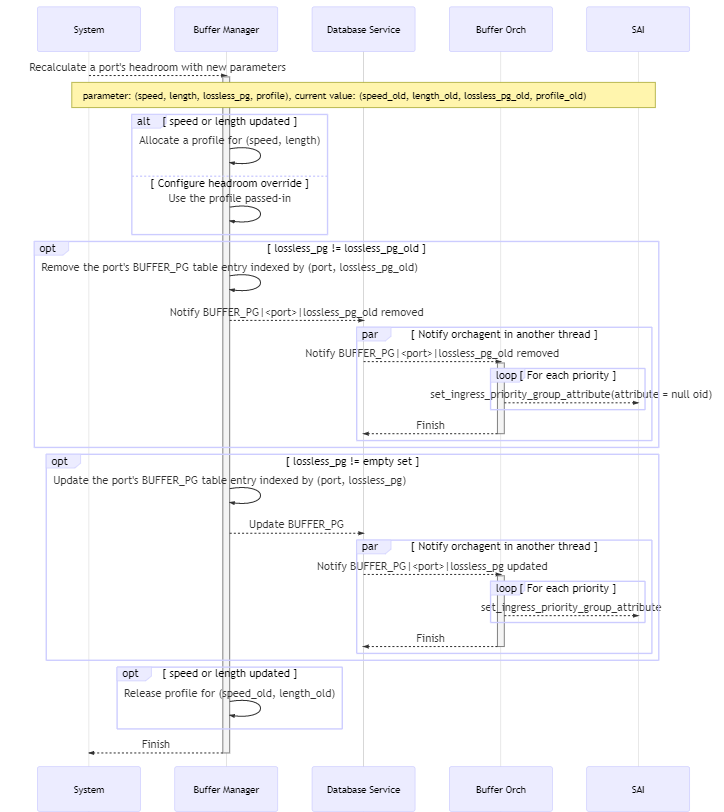
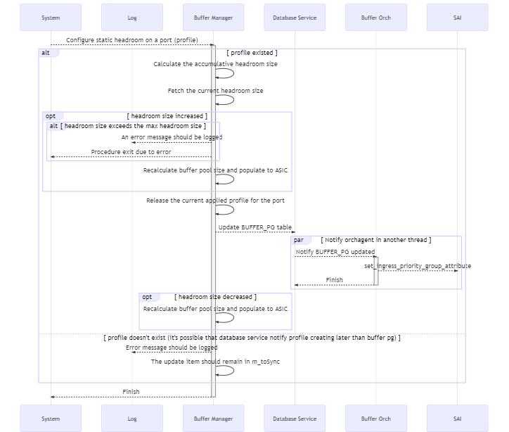
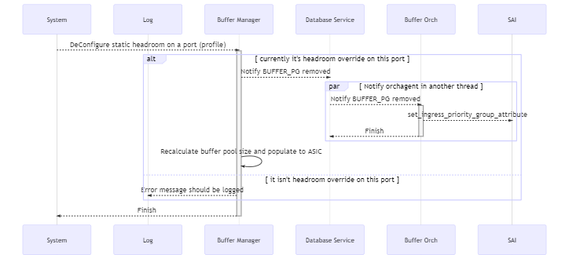

# Dynamically Headroom Calculation

## Abbreviations

| Term | Meaning |
|:--------:|:---------------------------------------------:|
| Statically headroom look-up | The current solution of headroom calculation. In this solution, the headroom is retrieved by looking up a pre-defined table with the port's cable length and speed as the key. Only a limited set of cable length is supported. Or `statically look-up` for short.|
| Dynamically headroom calculation | The solution of headroom calculation which will be introduced in this design. In this solution the headroom is calculated by the well known formula based with the cable length and speed as input. Arbitrary cable length will be supported. Or `dynamically calculation` for short.|

## Introduction

RoCE is an important feature in the datacenter network. As we all knew, headroom size is the key to ensure lossless traffic which is the key of RoCE.
Currently, the headroom size is calculated by looking up the port's cable length and speed in the pre-defined pg_profile_lookup.ini, which has some drawbacks.

### Current Solution

Currently the headroom buffer calculation is done by looking up the `pg_profile_lookup.ini` table with the ports' cable length and speed as the key.

- When system start, it reads the pg_profile_lookup.ini and generates an internal lookup table indexed by speed and cable length, and containing size, xon, xoff and threshold.
- When a port's cable length updated, it records the cable length of the port. But it doesn't update relavent tables accordingly.
- When a port's speed updated,
    1. It looks up the (speed, cable length) tuple in the BUFFER_PROFILE table or generate a new profile according to the internal lookup table.
    2. And then update the port's BUFFER_PG table for the lossless priority group.

There are some limitations:

- The `pg_profile_lookup.ini` is predefined for each SKU. When a new system supports SONiC the file should be provided accordingly.
- Only a fixed set of cable lengths are supproted.
- Static headroom isn't supported.

In general, we would like to:

1. have the headroom calculated in the code so that the users won't need to be familiar with that.
2. support headroom override, which means we will have fixed headroom size on some ports regardless of the ports' speed and cable length.
3. have more shared buffer and less headroom.

The headroom size calculation discussed in this design will be implemented in the `BufferManager` which is a daemon running in the swss docker.

### The Requirement

We will have the following groups of parameters

- List of SONiC configuration, such as speed and cable length.
- List of ASIC related configuration, such as cell size, MAC/PHY delay, peer response time, IPG.
- List of PERIPHERIAL related configuration, such as gearbox delay.
- List of RoCE related configuration, such as MTU, small packet size percentage.

Based on the parameters and a well-known formula the code in buffer manager will do the calculation and not take it from a pre-defined values as we have today.
On top of that, we need to support the ability to override headroom and not to calculate it in the code.

Meanwhile, the backward compatibility for the vendors who haven't provided the tables required for dynamically headroom calculation is also provided.

### The behavior of the dynamically headroom calculation solution

- When a port's cable length or speed updated, headroom of all lossless priority groups will be updated according to the well-known formula and then programed to ASIC.
- When a port is shut down/started up or its headroom size is updated, the size of shared buffer pool will be adjusted accordingly. The less the headroom, the more the shared buffer and vice versa. By doing so, we are able to have as much shared buffer as possible.
- When SONiC switch is upgraded from statically look-up to dynamically calculation, a port's headroom size of all the lossless priority groups will be calculated. The shared buffer pool will be adjusted according to the headroom size as well.
- Pre-defined `pg_profile_lookup.ini` isn't required any more. When a new platform supports SONiC only a few parameters are required.
- Support arbitrary cable length.
- Support headroom override, which means user can configure static headroom on certain ports.
- Priority groups on which lossless traffic runs on is configurable. By default they're 3, 4.
- Ports' speed and cable length need to be statically configured.
- All the statically configured data will be stored in `CONFIG_DB` and all dynamically data in `APPL_DB`. CLI or other management plane entity is responsible for updating `CONFIG_DB` while `Buffer Manager` is responsible for updating `APPL_DB`.

### Backward compatibility

Backward compatibility is supported for vendors who haven't provided the related tables yet. In this section we will introduce the way it is achieved.

Currently, the SONiC system starts buffer manager from swss docker by the `supervisor` according to the following settings in [`/etc/supervisor/conf.d/supervisord.conf`](https://github.com/Azure/sonic-buildimage/blob/master/dockers/docker-orchagent/supervisord.conf) in `swss` docker.

```shell
[program:buffermgrd]
command=/usr/bin/buffermgrd -l /usr/share/sonic/hwsku/pg_profile_lookup.ini
priority=11
autostart=false
autorestart=false
stdout_logfile=syslog
stderr_logfile=syslog
```

For the vendors who implement dynamically buffer calculating, a new command line option `-c` is provided. As a result, the `supervisor` setting will be:

```shell
[program:buffermgrd]
command=/usr/bin/buffermgrd -c
priority=11
autostart=false
autorestart=false
stdout_logfile=syslog
stderr_logfile=syslog
```

A new class is introduced to implement the dynamically buffer calculating while the class for statically look-up solution is remained.
When buffer manager starts it will test the command line options, loading the corresponding class according to the command line option.

The database schema for the dynamically buffer calculation is added on top of that of the current solution without any field renamed or removed, which means it won't hurt the current solution.

In the rest part of this document, we will focus on the dynamically headroom calculation and the SONiC-to-SONiC upgrade process from the current solution to the new one.

## Database schema design

The following tables are related to dynamically headroom calculation:

1. The following tables are newly introduced and stored in `CONFIG_DB`, including:
   - Tables which stores the parameters determined by the switch hardware, including:
     - `ASIC_TABLE` where the ASIC related parameters are stored.
     - `PERIPHERAL_TABLE` where the peripheral parameters are stored, like gearbox.
   - Tables which stores the user configurations, including `ROCE_TABLE` where the RoCE parameters are stored.
2. The static buffer configuration is stored in tables `BUFFER_POOL`, `BUFFER_PROFILE` and `BUFFER_PG` in `CONFIG_DB`.
3. The dynamically generated headroom information is stored in tables in `APPL_DB`, including `BUFFER_POOL`, `BUFFER_PROFILE` and `BUFFER_PG`. They are the equivalent of the tables with the same names in configuration database in current solution.

`Buffer Manager` will consume the tables in `CONFIG_DB` and generate corresponding tables in `APPL_DB`. `Buffer Orchagent` will consume the tables in `APPL_DB` and propagate the data to `ASIC_DB`.

### CONFIG_DB

#### Table ASIC_TABLE

This table is introduced to store the switch ASIC related parameters required for calculating the headroom buffer size.

This table is not supposed to be updated on-the-fly.

##### Schema

The key can be the chip/vendor name in captical letters.

```schema
    ; The following fields are introduced to calculate the headroom sizes
    key                     = ASIC_TABLE|<vendor name>      ; Vendor name should be in captical letters.
                                                            ; For Mellanox, "MELLANOX"
    cell_size               = 1*4DIGIT                      ; Mandatory. The cell size of the switch chip.
    ipg                     = 1*2DIGIT                      ; Optional. Inter-packet gap.
    pipeline_latency        = 1*6DIGIT                      ; Mandatory. Pipeline latency, in unit of kBytes.
    mac_phy_delay           = 1*6DIGIT                      ; Mandatory. Max/phy delay, in unit of Bytes.
    peer_response_time      = 1*6DIGIT                      ; Mandatory. The maximum of peer switch response time
                                                            ; in unit of kBytes.
    ; The following fields are introduced to calculate the buffer pools
    max_headroom_size       = 1*6DIGIT                      ; Optional. The maxinum value of headroom size a physical port can have.
                                                            ; For split ports, the accumulative headrooms of lossless PGs of all
                                                            ; split ports belonging to a same physical port should be less than this filed.
                                                            ; Not providing this field means no such limitation for the ASIC.
    reserved_lossy_pg       = 1*6DIGIT                      ; Optional. The reserved headroom size for each lossy priority group.
                                                            ; Not providing this field means the size is 0.
    default_dynamic_th      = 1*2DIGIT                      ; Default dynamic_th for dynamically generated buffer profiles
```

##### Initialization

Every vendor should provide the ASIC_TABLE for all switch chips it supports in SONiC. It should be stored in `files/build_templates` in the [sonic-buildimage](https://github.com/azure/sonic-buildimage) repo and `/usr/shared/sonic/template/asic_config.json.j2` on the switch.

There should be a map from SKU to switch chip in the template. When the template is being rendering, the SKU will be mapped to switch chip and the switch chip is used to choose which group of parameters in the `ASIC_TABLE` will be adopted on the switch. As a result, the `ASIC_TABLE` with a single group of parameters will be loaded into config database.

The rendering takes place on the switch when the command `config qos reload` is executed when the switch starts for the first time or `config load_minigraph` is executed.

After that the table will be loaded from config database each time system starts.

***Example***

The below is an example for Mellanox switches based on Spectrum-1 switch chip.

Example of pre-defined json.j2 file:

```json

    {% set platform2asic = {
            'x86_64-mlnx_lssn2700-r0':'MELLANOX-SPECTRUM'
            'x86_64-mlnx_msn2010-r0':'MELLANOX-SPECTRUM'
            'x86_64-mlnx_msn2100-r0':'MELLANOX-SPECTRUM'
            'x86_64-mlnx_msn2410-r0':'MELLANOX-SPECTRUM'
            'x86_64-mlnx_msn2700-r0':'MELLANOX-SPECTRUM'
            'x86_64-mlnx_msn2700_simx-r0':'MELLANOX-SPECTRUM'
            'x86_64-mlnx_msn2740-r0':'MELLANOX-SPECTRUM'
            'x86_64-mlnx_msn3700c-r0':'MELLANOX-SPECTRUM-2'
            'x86_64-mlnx_msn3700-r0':'MELLANOX-SPECTRUM-2'
            'x86_64-mlnx_msn3700_simx-r0':'MELLANOX-SPECTRUM-2'
            'x86_64-mlnx_msn3800-r0':'MELLANOX-SPECTRUM-2'
            'x86_64-mlnx_msn4700_simx-r0':'MELLANOX-SPECTRUM-3'
            'x86_64-mlnx_msn4700-r0':'MELLANOX-SPECTRUM-3'
        }
    %}
    
    "ASIC_TABLE": {
        
        "MELLANOX-SPECTRUM": {
            "cell_size": "96",
            "pipeline_latency": "18",
            "mac_phy_delay": "0.8",
            "peer_response_time": "3.8"
        }
        

        
        "MELLANOX-SPECTRUM-2": {
            "cell_size": "144",
            "pipeline_latency": "18",
            "mac_phy_delay": "0.8",
            "peer_response_time": "3.8"
        }
        

        
        "MELLANOX-SPECTRUM-3": {
            "cell_size": "144",
            "pipeline_latency": "18",
            "mac_phy_delay": "0.8",
            "peer_response_time": "3.8"
        }
        
    }

```

Example of a rendered json snippet (which will be loaded into config database) on a Mellanox Spectrum switch:

```json
    "ASIC_TABLE": {
        "MELLANOX-SPECTRUM": {
            "cell_size": "96",
            "pipeline_latency": "18",
            "mac_phy_delay": "0.8",
            "peer_response_time": "3.8"
        }
    }
```

#### Table PERIPHERAL_TABLE

##### Schema

This table contains the peripheral parameters, like gearbox. The key can be gearbox model name.

This table is not supposed to be updated on-the-fly.

```schema
    key                     = PERIPHERAL_TABLE|<gearbox model name>   ; Model name should be in captical letters.
    gearbox_delay           = 1*4DIGIT      ; Optional. Latency introduced by gearbox, in unit of kBytes.
```

##### Initialization

Every vendor should provide the `PERIPHERAL_TABLE` for all peripheral devices it supports in SONiC, like gearbox models. It should be stored in `files/build_templates/peripheral_config.json.j2` in the [sonic-buildimage](https://github.com/azure/sonic-buildimage) repo and `/usr/shared/sonic/template/peripheral_config.json.j2` on the switch.

When the template is being rendering, all entries in `PERIPHERAL_TABLE` will be loaded into the configuration database.

There should be a gearbox configure file in which the gearbox model installed in the system is defined.

For non-chassis systems, all ports share the unique gearbox model. As a result, the initialization of `PERIPHERAL_TABLE` is the same as that of `ASIC_TABLE`.

For chassis systems the gearbox in variant line-cards can differ, which means a mapping from port/line-card to gearbox model is required to get the correct gearbox model for a port. This requires additional field defined in `PORT` table or some newly introduced table. As this part is still under discussion in community, we will not discuss this case for now.

The below is an example for Mellanox switches.

***Example***

```json

    
    
    
    
    "PERIPHERAL_TABLE": {
        "MELLANOX-PERIPHERAL-1": {
            "gearbox_delay": "9.765"
        }
    }
    

```

#### Table ROCE_TABLE

This table contains the parameters related to RoCE configuration.

##### schema

```schema
    key                     = ROCE_TABLE|<name>   ; Name should be in captical letters. For example, "AZURE"
    mtu                     = 1*4DIGIT      ; Mandatory. Max transmit unit of RDMA packet, in unit of kBytes.
    small_packet_percentage = 1*3DIGIT      ; Mandatory. The percentage of small packets against all packets.
```

##### Initialization

Typically all vendors share the identical RoCE parameters. It should be stored in `/usr/share/sonic/templates/buffers_config.j2` which will be used to render the buffer configuration by `config qos reload`.

***Example***

```json
    "ROCE_TABLE": {
        "AZURE": {
            "mtu": "1500",
            "small_packet_percentage": "100"
        }
    }
```

#### BUFFER_POOL

Table `BUFFER_POOL` contains the information of a buffer pool.

##### Schema

Currently, there already are some fields in `BUFFER_POOL` table. In this design, the field `dynamically_update` is newly introduced, indicating whether the pool will be updated accordingly when one port's headroom size updated.

```schema
    key                 = BUFFER_POOL|<name>
    type                = "ingress" / "egress"      ; for ingress or egress traffic
    mode                = "static" / "dynamic"      ; indicating the pool's threshold mode
    size                = 9*DIGIT                   ; the size of the pool
                                                    ; for the pools with dynamically_update as true, the size is the original size of the pool
    dynamically_update  = "true" / "false"          ; whether the pool's size will be updated dynamically
```

##### Initialization

Typically there are the following entries defined in `/usr/shared/sonic/device/<platfrom>/<SKU>/buffers.json.j2` by all vendors.

- ingress_lossless_pool
- ingress_lossy_pool
- egress_lossless_pool
- egress_lossy_pool

When the system starts for the first time or `config qos reload` is configured, the buffer pools will be initialized by rendering the template.

In other cases, the buffer pools will be loaded from configure database.

#### BUFFER_PROFILE

Table `BUFFER_PROFILE` contains the profiles of headroom parameters and the proportion of free shared buffers can be utilized by a `port`, `PG` tuple on ingress side or a `port`, `queue` tuple on egress side.

##### Schema

Currently, there already are some fields in `BUFFER_PROFILE` table. In this design, the field `headroom_type` is newly introduced, indicating whether the headroom information, including `xon`, `xoff` and `size`, are dynamically calculated based on the `speed` and `cable length` of the port. Accordingly, the fileds `xon`, `xoff` and `size` only exist when the `headroom_type` is `static`.

```schema
    key             = BUFFER_PROFILE|<name>
    pool            = reference to BUFFER_POOL object
    xon             = 6*DIGIT               ; xon threshold
    xoff            = 6*DIGIT               ; xoff threshold
    size            = 6*DIGIT               ; size of headroom for ingress lossless
    dynamic_th      = 2*DIGIT               ; for dynamic pools, proportion of free pool the port, PG tuple referencing this profile can occupy
    static_th       = 10*DIGIT              ; similar to dynamic_th but for static pools and in unit of bytes
    headroom_type   = "static" / "dynamic"  ; Optional. Whether the profile is dynamically calculated or user configured.
                                            ; Default value is "static"
```

The profile is configured by CLI.

##### Initialization

Typically there are the following entries defined in `/usr/shared/sonic/device/<platfrom>/<SKU>/buffers.json.j2` by all vendors.

- ingress_lossless_profile
- ingress_lossy_profile
- egress_lossless_profile
- egress_lossy_profile
- q_lossy_profile

The initialization of the above entries is the same as that of `BUFFER_PROFILE` table.

Besides the above entries, there are the following ones which will be generated on-the-fly:

1. Headroom override entries for lossless traffic, which will be configured by user.
2. Entries for ingress loessless traffic with specific cable length and speed. They will be referenced by `BUFFER_PG` table and created if there is no such entry corresponding to a newly occuring `speed` and `cable length` tuple.

***Example***

An example of mandatory entries on Mellanox platform:

```json
    "BUFFER_PROFILE": {
        "ingress_lossless_profile": {
            "pool":"[BUFFER_POOL|ingress_lossless_pool]",
            "size":"0",
            "dynamic_th":"0"
        },
        "ingress_lossy_profile": {
            "pool":"[BUFFER_POOL|ingress_lossy_pool]",
            "size":"0",
            "dynamic_th":"3"
        },
        "egress_lossless_profile": {
            "pool":"[BUFFER_POOL|egress_lossless_pool]",
            "size":"0",
            "dynamic_th":"7"
        },
        "egress_lossy_profile": {
            "pool":"[BUFFER_POOL|egress_lossy_pool]",
            "size":"4096",
            "dynamic_th":"3"
        },
        "q_lossy_profile": {
            "pool":"[BUFFER_POOL|egress_lossy_pool]",
            "size":"0",
            "dynamic_th":"3"
        }
    }
```

#### BUFFER_PG

Table BUFFER_PG contains the maps from the `port, priority group` tuple to the `buffer profile` object.

Currently, there already are some fields in `BUFFER_PG` table. In this design, the field `headroom_type` is newly introduced, indicating whether the `profile` are dynamically calculated.

##### Schema

```schema
    key             = BUFFER_PG|<name>
    headroom_type   = "static" / "dynamic"                  ; Optional. Whether the profile is dynamically calculated or user configured.
                                                            ; Default value is "static"
    profile         = reference to BUFFER_PROFILE object    ; Exists only when headroom_type is "static"
                                                            ; For "dynamic" headroom_type the profile isn't required in CONFIG_DB.
```

##### Initialization

The entry `BUFFER_PG|<port>|0` is for ingress lossy traffic and will be generated when system starts for the first time or minigraph is loaded.

The headroom override entries are configured via CLI.

Other entries are for ingress lossless traffic and will be generated when the ports' `speed` or `cable length` updated.

#### Other tables referenced

The port speed needs to be fetched from `PORT` table.
The cable length needs to be fetched from `CABLE_LENGTH` table.

### APPL_DB

Table `BUFFER_POOL`, `BUFFER_PROFILE` and `BUFFER_PG` are introduced in `APPL_DB`. They are the equivalent of tables with the same name in `CONFIG_DB`. The `APPL_DB` tables shared the similar fields with that in `CONFIG_DB` tables except some minor differences which will be elaborated below.

The ways in which the `APPL_DB` tables are initializd are similar:

- When system starts, `Buffer Manager` consumes entries of the equivalent tables in `CONFIG_DB` and creates corresponding entries in `APPL_DB` tables for `static` entries.
- When a new `speed`, `cable length` tuple occurs in the system, the `Buffer Manager` will create new entries in tables `APPL_DB` table.

#### BUFFER_POOL

The field `dynamically_update` of `CONFIG_DB.BUFFER_POOL` doesn't exist in `APPL_DB.BUFFER_POOL`. Other fields are the same.

##### Schema

```schema
    key                 = BUFFER_PROFILE|<name>
    type                = "ingress" / "egress"      ; for ingress or egress traffic
    mode                = "static" / "dynamic"      ; indicating the pool's threshold mode
    size                = 9*DIGIT                   ; the size of of the pool
```

#### BUFFER_PROFILE

Difference between `APPL_DB.BUFFER_PROFILE` and `CONFIG_DB.BUFFER_PROFILE` including:

1. `headroom_type` exists only in CONFIG_DB.
2. In APPL_DB the `xon`, `xoff` and `size` always exist while in CONFIG_DB these fields exist only if `headroom_type` is `static`.

##### Schema

```schema
    key             = BUFFER_PROFILE|<name>
    pool            = reference to BUFFER_POOL object
    xon             = 6*DIGIT               ; xon threshold
    xoff            = 6*DIGIT               ; xoff threshold
    size            = 6*DIGIT               ; size of headroom for ingress lossless
    dynamic_th      = 2*DIGIT               ; for dynamic pools, proportion of free pool the port, PG tuple referencing this profile can occupy
    static_th       = 10*DIGIT              ; similar to dynamic_th but in unit of bytes
```

#### BUFFER_PG

The field `headroom_type` of `CONFIG_DB.BUFFER_PG` doesn't exist in `APPL_DB.BUFFER_PG`. Other fields are the same.

##### Schema

```schema
    key             = BUFFER_PG|<name>
    profile         = reference to BUFFER_PROFILE object
```

## Flows

The following flows will be described in this section.

- When a port's speed or cable length is updated, the `BUFFER_PG`, `BUFFER_PROFILE` will be updated to reflect the headroom size regarding the new speed and cable length. As the headroom size updated, `BUFFER_POOL` will be also updated accordingly.
- When a port's admin status is updated, the `BUFFER_PG` and `BUFFER_PROFILE` won't be updated. However, as only administratively up ports consume headroom, the `BUFFER_POOL` should be updated by adding the buffer released by the admin down port.
- When a static profile is configured on or removed from a port, the `BUFFER_PROFILE` and/or `BUFFER_PG` table will be updated accordingly.
- When the system starts, how the tables are loaded.
- Warm reboot flow.

This section will be split to two parts. In `meta flows` we will describe some flows which are building blocks of other flows. In `main flows` we will describe the flows listed in the above list.

### Meta Flows

Meta flows are the flows that will be called in other flows.

#### The well-known formula

Headroom is calculated as the following:

- `headroom` = `Xoff` + `Xon`
- `Xon` = `pipeline latency`
- `Xoff` = `mtu` + `propagation delay` * `small packet multiply`
- `worst case factor` = 2 * `cell` / (1 + `cell`)
- `small packet multiply` = (100 - `small packet percentage` + `small packet percentage` * `worst case factor`) / 100
- `propagation delay` = `mtu` + 2 * (`kb on cable` + `kb on gearbox`) + `mac/phy delay` + `peer response`
- `kb on cable` = `cable length` / `speed of light in media` * `port speed`

The values used in the above procedure are fetched from the following table:

- `cable length`: CABLE_LENGTH|\<name\>|\<port\>
- `port speed`: PORT|\<port name\>|speed
- `kb on gearbox`: PERIPHERIAL_TABLE|\<gearbox name\>|gearbox_delay
- `mac/phy delay`: ASIC_TABLE|\<asic name\>|mac_phy_delay
- `peer response`: ASIC_TABLE|\<asic name\>|peer_response_time
- `cell`: ASIC_TABLE|\<asic name\>|cell_size
- `small packet percentage`: ROCE_TABLE|\<name\>|small_packet_percentage
- `mtu`: ROCE_TABLE|\<name\>|mtu

#### Allocate a new profile

When a port's `cable length` or `speed` updated, a profile corresponding to the new `cable length`, `speed` tuple should be looked up from the database. If there isn't one, a new one should be created.

The flow is like the following:

1. Look up in `APPL_DB`, check whether there has already been a profile corresponding to the new `cable length` and `speed` tuple. If yes, return the entry.
2. Create a profile based on the well-known formula and insert it to the `APPL_DB.BUFFER_PROFILE` table.
3. The `BufferOrch` will consume the update in `APPL_DB.BUFFER_PROFILE` table and call SAI to create a new profile.


__Figure 1: Allocate a New Profile__

#### Release a no-longer-referenced profile

This is for dynamic profile only. Static profile won't be removed even it isn't referenced any more.

When a port's `cable length` or `speed` updated, the profile related to the old `cable length` or `speed` tuple probably won't be referenced any longer. In this case, the profile should be removed.


__Figure 2: Release a No-Longer-Referenced Profile__

#### Calculate the Buffer Pool Size

When any port's `cable length` or `speed` updated or `admin state` changed, the buffer pool size should be recalculated.

An exception is warm reboot. During warm reboot the headroom is updated for each ports, which causes the buffer pool be updated for many times. However, the correct buffer pool data that it will eventually be has already been in switch chip. In this sense, to update buffer pool frequently is unnecessary and should be avoided.

To achieve that, the buffer pool shouldn't be updated during warm reboot and will be updated once warm reboot finished.

The avaliable buffer pool size euqals to the maxinum avaliable buffer pool size minus the size of buffer reserved for port and (port, PG) in ingress. The algorithm is as below:

1. Accumulate all headroom by iterating all `port`, `priority group` tuple and putting their `size` together.
2. Some vendors may reserve memory for lossy PGs regardless of the `BUFFER_PROFILE` configuration. In this case, the reserved memory size for each lossy PG should be fetched from `ASIC_TABLE.reserved_lossy_pg`.
3. Accumulate all reserved buffer for egress traffic for all ports.

The administratively down ports doesn't consume buffer hense they should be ruled out.


__Figure 3: Calculate the Pool Size__

#### Calculate and deploy the headroom for a port, PG tuple

For any port, when:

- its `cable length` or `speed` is updated, or
- a PG is added to or removed from its `lossless PG` set

Its headroom buffer should be recalculated and programed to ASIC.

The flow is:

1. Find or create a buffer profile according to the new `cable length` and `speed` tuple.
2. If `lossless PG` updated, remove the old `APPL_DB.BUFFER_PG` object related to the old `lossless PG` and create the new one.

   For example, if the `lossless PG` for `Ethernet0` is updated from `3-4` to `3-5`, the entry `Ethernet0|3-4` will be removed and the one `Ethernet0|3-5` will be created.
3. Update the port's buffer pg and update the `APPL_DB.BUFFER_PG` table.
4. Once BufferOrch is notifed on the `APPL_DB.BUFFER_PG` updated, it will update the related SAI object.
5. Release the `APPL_DB.BUFFER_PROFILE` referenced by old `cable length` and `speed` tuple.



__Figure 4: Calculate and deploy the Headroom For a Port, PG__

### Main Flows

#### Port's speed or cable length updated

There are admin speed and operational speed in the system, which stand for the speed configured by user and negotiated with peer device respectively. In the buffer design, we are talking about the admin speed.

1. Read the speed and cable length of the port
2. Check the following conditions, exit on anyone fails:
    - Check whether `headroom_type` in `CONFIG_DB.BUFFER_PG|<port>|<lossless PG>` is of `dynamic` which means dynamically calculating headroom is required for the port.
    - Check whether there is a cable length configured for the port.
    - Check whether the headroom size calculated based on the speed, cable length pair is legal, which means it doesn't exceed the maxinum value.

   If anyone of the above condition failed, none of the `CNOFIG_DB`, `APPL_DB` or `Buffer Manager`'s internal data will be changed. This will result in inconsistence among the entities. A piece of error message will be logged for the purpose of promoting user to revert the configuration.
3. Allocate a buffer profile related to the `cable length` and `speed`.
4. Calculate and deploy the headroom for the port, PG tuple.


__Figure 5: Cable length or speed updated__

#### Port is administratively up/down

When a port's administratively status is changed, the `BUFFER_PG` and `BUFFER_PROFILE` won't be touched. However, as an admin down port doesn't consume headroom buffer while an admin up one does, the sum of effective headroom size will be udpated accordingly, hense the `BUFFER_POOL` should be updated.

#### Apply static headroom configure

When a static headroom is configured on a port

1. Release the buffer profile currently used on the port.
2. Update the port's buffer pg according to the configuration.
3. Recalculate the buffer pool size.



__Figure 6: Apply Static Headroom Configure__

#### Remove static headroom configure

When a static headroom is removed on a port:

1. Allocate the buffer profile according to the port's speed and cable length.
2. Recalculate the buffer pool size.



__Figure 7: Remove Static Headroom Configure__

#### Update static buffer profile

When a static buffer profile is updated, it will be propagated to `Buffer Orch` and then `SAI`. The buffer pgs that reference this buffer profile don't need to be updated. However, as the total number of headroom buffer updated, the buffer pool size should be recalculated.


__Figure 8: Static Buffer Profile Updated__

#### Configure the priorities on which lossless traffic runs

When the lossless priorities are configured, the system should recalcuate the port's headroom, just like what is done when `speed` or `cable length` is updated.

### Start and SONiC-to-SONiC upgrade flows

In this section we will discuss the start flow and the flows of SONiC-to-SONiC upgrade from statically headroom look-up to dynamically calculation by:

- Cold reboot
- Warm reboot

#### Upgrade by cold reboot

When system cold reboot from current implementation to new one, `db_migrator` will take care of generating new table and converting old data.

1. Initialize `ASIC_TABLE`, `PERIPHERAL_TABLE` and `ROCE_TABLE` from predefined templates into config database, just like what is done when the system starts for the first time or `config load_minigraph`
2. Convert the current data in `BUFFER_PROFILE` and `BUFFER_PG` into new format with `headroom_type` inserted via the following logic:

    - If a `BUFFER_PROFILE` entry has name convention of `pg_lossless_<speed>_<length>_profile` and the same `dynamic_th` value as `ASIC_TABLE.default_dynamic_th`, it will be treated as a dynamically generated profile based on the port's speed and cable length. In this case it will be removed from the `CONFIG_DB`.
    - If a `BUFFER_PG` references a profile whose `headroom_type` is `dynamic`, it will be also treated as a dynamic buffer pg object and its `headroom_type` will be initialized as `dynamic`.
    - If a `BUFFER_PROFILE` or `BUFFER_PG` item doesn't meet any of the above conditions, it will be treated as a `static` profile.

After that, `Buffer Manager` will start as normal flow which will be described in the next section.

#### Daemon starts with -c option

When the daemon starts, it will:

1. Test the command line options. If `-c` option is provided, the class for dynamically buffer calculation will be instantiated. Otherwise it should be the current solution of calculating headroom buffers, which is out of the scope of this design.
2. Load table `ASIC_TABLE`, `PERIPHERAL_TABLE` and `ROCE_TABLE` from `CONFIG_DB` into internal data structures.
3. Load table `CABLE_LENGTH` and `PORT` from `CONFIG_DB` into internal data structures.
4. After that it will:
   - handle items in `CALBLE_LENGTH` and `PORT` tables
   - handle items in `BUFFER_POOL`, `BUFFER_PROFILE` and `BUFFER_PG` in `CONFIG_DB` via calculating the headroom size for the ports and then pushing result into `BUFFER_PROFILE` and `BUFFER_PG` tables in `APPL_DB` except the `port` and `priority group` tuples configured headroom override.

#### Warm reboot

When system starts, the port's headroom will always be recalculated according to its speed and cable length. As a result, when system warm restarts between images who calculate headroom size in different ways, the `Buffer Manager` will eventually regenerate items for each `port`, `priority group` according to the ports' `speed` and `cable length` and items in `CONFIG_DB` and then push the item into `APPL_DB`.

In this sense, no specific steps is required regarding configuration migration for the above tables.

For the table `BUFFER_POOL`, each time the headroom size updated the buffer pool size should be updated accordingly. When the system warm reboots, the headroom size of each port will be updated as well, which means the buffer pool size will be updated for many times even though the value they eventually should be have already been in the switch chip. This should be avoided as the correct value has already been in the switch chip.

This can be achieved by checking whether the warm reboot is finished ahead of calling SAI api.

## Command line interface

### To configure lossless traffic on certain priority

The command `configure interface lossless_pg <set|clear>` is designed to configure the priorities used for lossless traffic.

```cli
sonic#config interface lossless_pg set <port> <pg-map>
sonic#config interface lossless_pg clear <port>
```

All the parameters are mandatory.

The `pg-map` stands for the map of priorities for lossless traffic. It should be a string and in form of a bit map like `3-4` or `3-4,6`. The `-` connects the lower bound and upper bound of a range of priorities and the `,` seperates multiple ranges.

Every time the lossless priority is set the old value will be overwritten.

### To configure a static profile

A static profile can be used to override the headroom size and/or dynamic_th of a port, PG.

The command `configure buffer_profile` is designed to create or destroy a static buffer profile which will be used for headroom override.

```cli
sonic#config buffer_profile <name> add --xon <xon> --xoff <xoff> --headroom <headroom> --dynamic_th <dynamic_th>
sonic#config buffer_profile <name> del
```

All the parameters are devided to two groups, one for headroom and one for dynamic_th. For any command at lease one group of parameters should be provided.

For headroom parameters:

- At lease one of `xoff` and `headroom` should be provided and the other will be optional and conducted via the formula `xon + xoff = headroom`.
All other parameters are mandatory.
- `xon` is madantory.
- `xon` + `xoff` <= `headroom`; For Mellanox platform xon + xoff == headroom

If only headroom parameters are provided, the `dynamic_th` will be taken from `CONFIG_DB.ASIC_DB.default_dynamic_th`.

If only dynamic_th parameter is provided, the `headroom_type` will be set as `dynamic` and `xon`, `xoff` and `size` won't be set.

When delete a profile, it shouldn't be referenced by any entry in `CONFIG_DB.BUFFER_PG`.

### To configure headroom override on a port or port, PG

The command `configure interface headroom_override` is designed to enable or disable the headroom override for a certain port.

```cli
sonic#config interface headroom_override enable <port> --profile <profile>
sonic#config interface headroom_override disable <port>
```

Headroom override will be enabled on all lossless PGs configured by `configure interface lossless_pg` on the `<port>`

The `<profile>` must be defined in advance.

### To configure cable length

The command `configure interface cable_length` is designed to configure the cable length of a port.

```cli
sonic#config interface cable_length <port> <length>
```

All the parameters are mandatory.

The `length` stands for the length of the cable connected to the port. It should be integer and in the unit of meter.

The following command is used to configure the cable length of Ethernet0 as 10 meters.

```cli
sonic#config interface cable_length Ethernet0 10
```

### To display the current configuration

The command `mmuconfig` is extended to display the current configuration.

```cli
sonic#mmuconfig -l
```

### To clear all QoS related configuration from database

The command `config qos clear` is provided to all the QoS configurations from database, including the all the above mentioned configurations.

### Examples of typical configuration

#### Dynamic calculation with default alpha

Configure commands:

```cli
config interface lossless_pg set Ethernet0 3-5
```

In configure database there should be:

```json
    {
        "BUFFER_PG" : {
            "Ethernet0|3-5" : {
                "headroom_type" : "dynamic"
            }
        }
    }
```

In APPL_DB there should be:

```json
    {
        "BUFFER_PROFILE" : {
            "pg_lossless_100000_5m_profile" : {
                "pool" : "[BUFFER_POOL|ingress_lossless_pool]",
                "xon" : "18432",
                "xoff" : "20480",
                "size" : "38912",
                "dynamic_th" : "0"
            }
        },
        "BUFFER_PG" : {
            "Ethernet0|3-4" : {
                "profile" : "[BUFFER_PROFILE|pg_lossless_100000_5m_profile]"
            }
        }
    }
```

#### Dynamic calculation with non-default alpha

Configure commands:

```cli
config buffer_profile add pg_lossless_100000_5m_customize_profile --dynamic_th 3
config interface headroom_override enable Ethernet0 --profile pg_lossless_100000_5m_customize_profile
```

In configure database there should be:

```json
    {
        "BUFFER_PROFILE" : {
            "pg_lossless_100000_5m_customize_profile" : {
                "pool" : "[BUFFER_POOL|ingress_lossless_pool]",
                "dynamic_th" : "3",
                "headroom_type" : "dynamic"
            }
        },
        "BUFFER_PG" : {
            "Ethernet0|3-4" : {
                "profile" : "[BUFFER_PROFILE|pg_lossless_100000_5m_customize_profile]",
                "headroom_type" : "dynamic"
            }
        }
    }
```

In APPL_DB there should be:

```json
    {
        "BUFFER_PROFILE" : {
            "pg_lossless_100000_5m_customize_profile" : {
                "pool" : "[BUFFER_POOL|ingress_lossless_pool]",
                "xon" : "18432",
                "xoff" : "20480",
                "size" : "38912",
                "dynamic_th" : "3"
            }
        },
        "BUFFER_PG" : {
            "Ethernet0|3-4" : {
                "profile" : "[BUFFER_PROFILE|pg_lossless_100000_5m_customize_profile]"
            }
        }
    }
```

#### Static calculation

Configure commands:

```cli
config interface lossless_pg set Ethernet0 --pg 3-4,6
config buffer_profile add pg_lossless_custom_profile --dynamic_th 3 --xon 18432 --size 36864
config interface headroom_override enable Ethernet0 --profile pg_lossless_custom_profile --pg 3-4
```

In configure database there should be:

```json
    {
        "BUFFER_PROFILE" : {
            "pg_lossless_custom_profile" : {
                "pool" : "[BUFFER_POOL|ingress_lossless_pool]",
                "dynamic_th" : "3",
                "headroom_type" : "static",
                "xon" : "18432",
                "xoff" : "18432",
                "size" : "36864"
            }
        },
        "BUFFER_PG" : {
            "Ethernet0|3-4" : {
                "profile" : "[BUFFER_PROFILE|pg_lossless_custom_profile]",
                "headroom_type" : "static"
            },
            "Ethernet0|6" : {
                "headroom_type" : "dynamic"
            }
        }
    }
```

In APPL_DB there should be:

```json
    {
        "BUFFER_PROFILE" : {
            "pg_lossless_custom_profile" : {
                "pool" : "[BUFFER_POOL|ingress_lossless_pool]",
                "xon" : "18432",
                "xoff" : "18432",
                "size" : "36864",
                "dynamic_th" : "3"
            },
            "pg_lossless_100000_5m_profile" : {
                "pool" : "[BUFFER_POOL|ingress_lossless_pool]",
                "xon" : "18432",
                "xoff" : "20480",
                "size" : "38912",
                "dynamic_th" : "0"
            }
        },
        "BUFFER_PG" : {
            "Ethernet0|3-4" : {
                "profile" : "[BUFFER_PROFILE|pg_lossless_custom_profile]"
            },
            "Ethernet0|6" : {
                "profile" : "[BUFFER_PROFILE|pg_lossless_100000_5m_profile]"
            }
        }
    }
```

## Test cases

### Positive test cases

1. Increase a port's speed.
2. Increase a port's cable length.
3. Decrease a port's speed.
4. Decrease a port's cable length.
5. Update a port's speed and cable length at the same time.
6. A speed, cable length tuple occurs for the first time.
7. A speed, cable length tuple is referenced by only one port, PG tuple and then is no longer referenced.
8. Shutdown a port.
9. Startup a port.
10. Configure static buffer profile with headroom dynamically calculated and non-default alpha value. The buffer is referenced by a port, PG and then is no longer referenced.
11. Configure non default lossless PG on a port.
12. Configure headroom override on a port.
13. Configure lossless PGs with both dynamically calculation and headroom override on the same port. (eg: 3-4 dynamic and 6 headroom override).
14. Remove headroom override on a port.
15. Remove headroom override on a port, PG.
16. System start for the first time (with an empty configure database).
17. System start with a legal configure database.
18. System start from old image (SONiC-to-SONiC upgrade).
19. System warm reboot from old image (SONiC-to-SONiC upgrade).

### Negative test cases

1. Configure a headroom override with an unexist profile.
2. Try to remove a referenced profile.
3. Configure large cable length which makes calculated headroom exceed the max legal value.

## Appendix - Open questions

### General topic

1. Should we still use the fixed set of cable length? Or should we support arbitrary cable length?
    - If arbitrary cable length is legal, should a no-longer-used buffer profile be removed from the database?
        - If no, the database probably will be stuffed with those items?
        - If yes, need to maintain a reference number for the profiles, which introduces unnecessary complexity.

    Status: Closed.

    Decision: We're going to support arbitrary cable length.
2. After port cable length updated, should the BUFFER_PG table be updated as well?
    - Current implementation don't do that. Why?

    Status: Closed.

    Decision: Yes. After port cable length pudated the BUFFER_PG table should be updated accordingly.
3. With headroom size dynamically configured, is it necessary to recalculate the buffer pool size?
    - For the egress_lossy_pool, ingress_lossless_pool and ingress_lossy pool their size is the total size minus the total of headroom of all ports.
4. Lossless is supported on priority 3-4 only. Is this by design or standard or any historical reason?
5. Can shared buffer pool be updated on-the-fly? Can buffer profile be updated on-the-fly? Only the dynamic_th.

    Status: Open.

    Decision: Should be. But there is issues in SONiC ["dynamic_th" parameter for lossless buffer profile can't be change on the fly.](https://github.com/Azure/sonic-buildimage/issues/3971)
6. There are default headrooms for lossy traffic which are determined by SDK and SONiC isn't aware. Do they affect shared buffer calculation?

    Status: Closed.

    Decision: Yes. They should be taken into consideration.
7. There is limitations from SDK/FW that there is a cap of the total number of headroom sizes of all priority groups belong to a port. For 2700 split port, this cap prevent the headroom size from being programed if the speed is 50G and cable length is 300m.

    Status: Closed.

    Decision: There should be a maxinum value of the accumulate PGs for port. This can be fetched from ASIC_DB.
8. Originally buffer configuration had been stored in APPL_DB but were moved to CONFIG_DB later. Why? [doc](https://github.com/Azure/SONiC/wiki/Converting-old-or-creating-new-buffers-config) for reference.
9.  In theory, when system starts, as `BUFFER_PROFILE` and `BUFFER_PG` tables are stored in config database which survives system reboot, the `Buffer Orch` can receive items of the tables ahead of they being recalculated by `Buffer Manager` based on the current algorithm and `cable length` and `speed`. If the headroom size calculated differs before and after reboot, it can cause the items in the tables be deployed twice in which the first deployment will be overwritten quickly by the second one.
10. For chassis systems the gearbox in variant line-cards can differ, which means a mapping from port/line-card to gearbox model is required to get the correct gearbox model for a port. This requires additional field defined in `PORT` table or some newly introduced table. As this part hasn't been defined in community, we will not discuss this case for now.

### To do

1. No need to recalculate buffer pool size every time a port's `speed` or `cable length` or `lossless PG` is updated. A counter example: system starts, the buffer pool need to be calculated only once.
2. Need to define when the parameters should be saved into the internal data structure. I suggest do that in the meta flows.
3. Need to make sure the way the `BUFFER_PG` linked to the old `lossless PG` is removed.
4. Need to make sure SONiC-to-SONiC upgrade flow and db_migrate.
5. Review all flow chart.

### How design decisions are made

#### APPL_DB vs CONFIG_DB

1. Headroom data will be updated more frequently than currently it is.
2. More dynamic entries may occur due to supporting arbitrary cable length.
3. As a result, headroom data is no longer fits to be stored as configuration.

#### To calculate buffer size in `Buffer Manager` or `Buffer Orch`

By `Buffer Manager`:

- Keep a simple logic in `Buffer Orch`
- Aligns with the current logic between manager daemons and orchagent
- Easy to control when the buffer pool to be updated, which is import during warm reboot
- When something bad happens, to have a separated table in APPL_DB helps investigate issues

By `Buffer Orchagent`:

- Don't need APPL_DB tables, simplify procedure significantly
- Need to read cable length and port speed in orchagent, which will change the structure of buffer manager.

#### Database design principles -- CONFIG_DB vs APPL_DB

In the statically look-up solution all buffer relavent tables are stored in CONFIG_DB which is supposed to contain the configuration supplied by user. However, some buffer data, including some entries in the `BUFFER_PROFILE` table and the `BUFFER_PG` table, are dynamically generated when ports' speed or cable length updated, which means they are not real configuration.

To have dynamic entries in CONFIG_DB is confusing. However, in statically look-up solution, a user is able to distinguish dynamic one from static one easily considering there are only limit number of combinations of `speed`, `cable length` tuple, the amount of dynamically generated entries in `BUFFER_PROFILE` table is small. In this sense, to have dynamic and static entries mixed together isn't a big problem for now.

However, in this design it will no longer be true because:

1. The variant cable length will be supported, which means the number of dynamically generated entries in `BUFFER_PROFILE` table can be much larger.
2. The headroom data will be calculated dynamically, which means they will be updated more frequently and no longer feasible to be static configuration.
3. There is going to be headroom override which means `BUFFER_PG` and `BUFFER_PROFILE` table will contain both dynamic and static entries. Meanwhile, the `dynamic_th` or `static_th` of the dynamic entries are configured by user.

These will confuse user, making it difficult to distinguish static and dynamic entries and understand the configuration.

To resolve the issue, we have to add tables to APPL_DB, representing the current value which is programed to ASIC.
