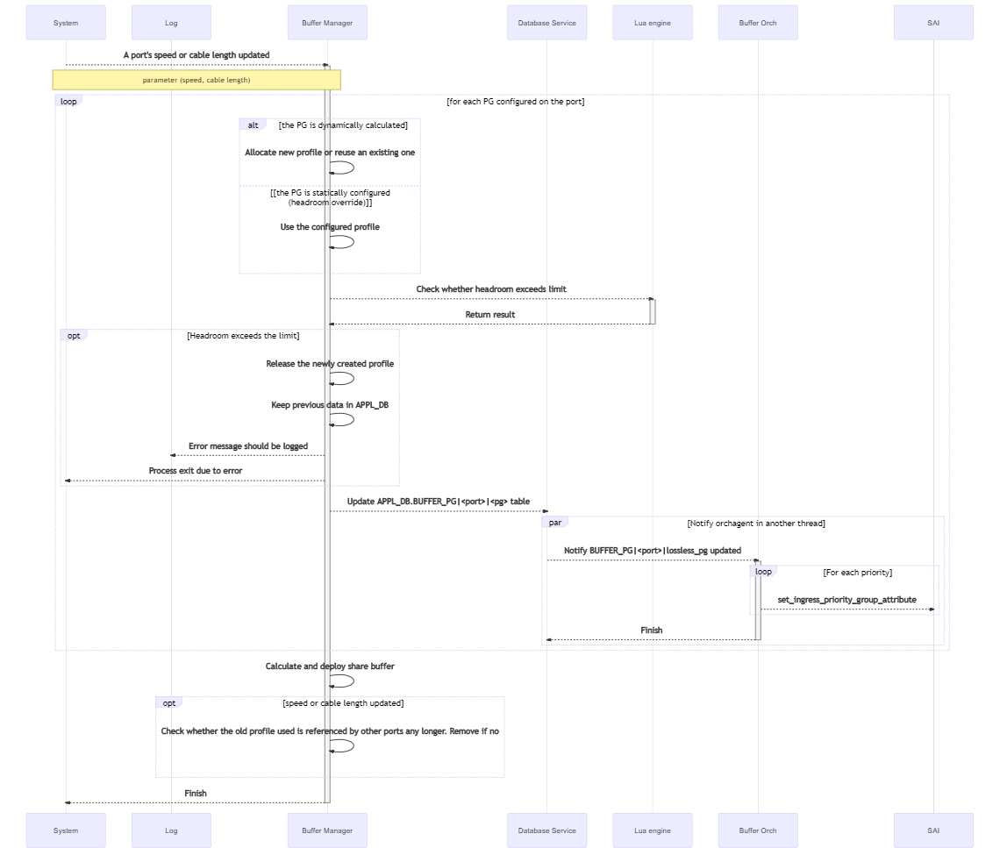
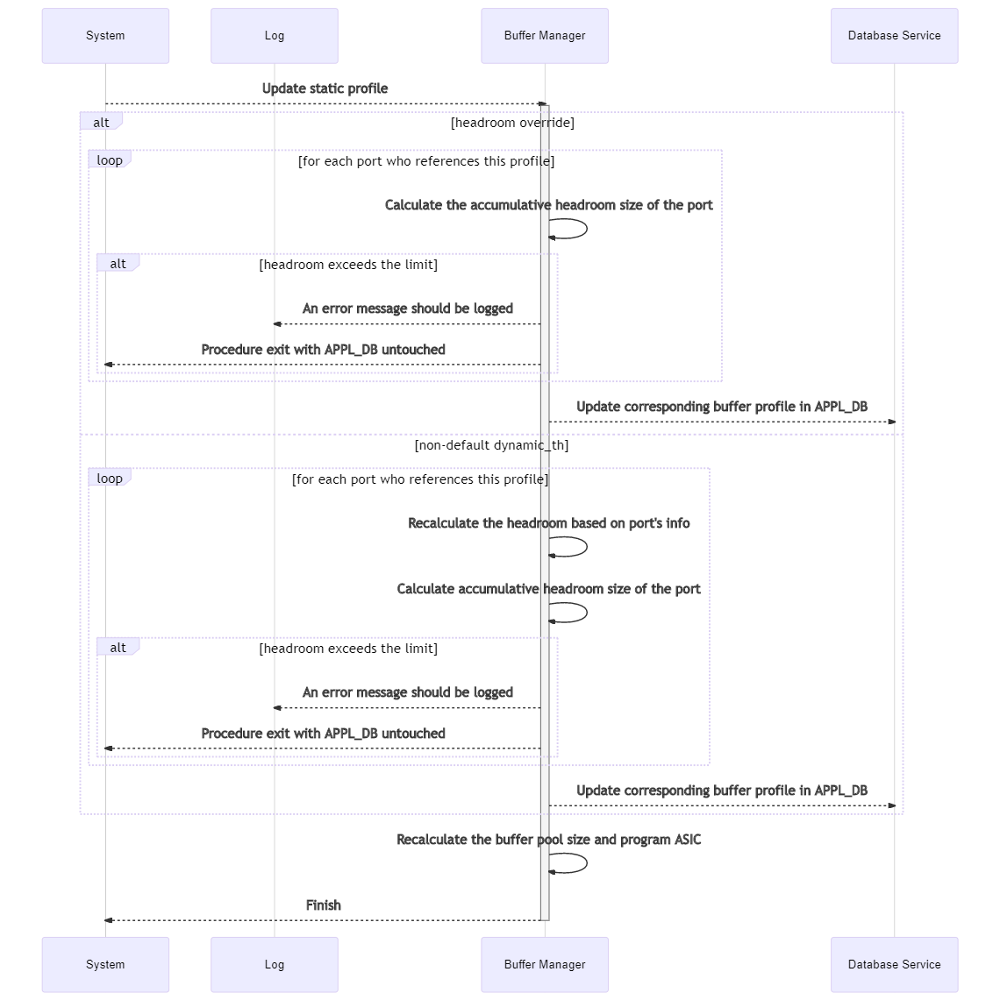

# Dynamically Headroom Calculation

## Abbreviations

| Term | Meaning |
|:--------:|:---------------------------------------------:|
| Statically headroom look-up | The current solution of headroom calculation. In this solution, the headroom is retrieved by looking up a pre-defined table with the port's cable length and speed as the key. Only a limited set of cable length is supported. Or `statically look-up` for short.|
| Dynamically headroom calculation | The solution of headroom calculation which will be introduced in this design. In this solution the headroom is calculated by the well known formula based with the cable length and speed as input. Arbitrary cable length will be supported. Or `dynamically calculation` for short.|

## Introduction

As we all knew, headroom size is the key to ensure lossless traffic which is the key of many important features in data center network, like RoCE.
Currently, the headroom size is generated by looking up the port's cable length and speed in the pre-defined pg_profile_lookup.ini, which has some drawbacks.

### Current Solution

Currently the headroom buffer calculation is done by looking up the `pg_profile_lookup.ini` table with the ports' cable length and speed as the key.

- When system starts, it reads the pg_profile_lookup.ini and generates an internal lookup table indexed by speed and cable length, and containing size, xon, xoff and threshold.
- When a port's cable length updated, it records the cable length of the port. But it doesn't update relavent tables accordingly.
- When a port's speed updated,
    1. It looks up the (speed, cable length) tuple in the BUFFER_PROFILE table or generate a new profile according to the internal lookup table.
    2. And then update the port's BUFFER_PG table for the lossless priority group.

There are some limitations:

- The `pg_profile_lookup.ini` is predefined for each SKU. When a new system supports SONiC the file should be provided accordingly.
- Only a fixed set of cable lengths are supproted.
- Static headroom isn't supported.

In general, we would like to:

1. have the headroom calculated in the code so that the users won't need to be familiar with that.
2. support headroom override, which means we will have fixed headroom size on some ports regardless of the ports' speed and cable length.
3. have more shared buffer and less headroom.

The headroom size calculation discussed in this design will be implemented in the `BufferManager` which is a daemon running in the swss docker.

### The Requirement

We will have the following groups of parameters

- List of SONiC configuration, such as speed and cable length.
- List of ASIC related configuration, such as cell size, MAC/PHY delay, peer response time, IPG.
- List of PERIPHERIAL related configuration, such as gearbox delay.
- List of lossless traffic related configuration, such as MTU, small packet size percentage.

Based on the parameters and a well-known formula the code in buffer manager will do the calculation and not take it from a pre-defined values as we have today.
On top of that, we need to support the ability to override headroom and not to calculate it in the code.

Meanwhile, the backward compatibility for the vendors who haven't provided the tables required for dynamically headroom calculation is also provided.

### Some assumptions regarding the buffer model

In this section, we are going to introduce some assumptions which affect the way in which the headroom and shared buffer are calculated.

Basically, the buffer model defined in SAI is adopted, including the [SAI buffer proposal](https://github.com/opencomputeproject/SAI/blob/master/doc/QOS/SAI-Proposal-buffers-Ver4.docx) and corresponding [headers](https://github.com/opencomputeproject/SAI/blob/master/inc/saibuffer.h). It includes the following concepts:

- A buffer pool is statically allocated buffer region. There are two types of buffer pool, ingress buffer pool and egress buffer pool which are mapped the same switch buffer.
- Since in most case switch ports share the same buffer configuration, SAI supports creating `buffer profiles` and attaching those profiles to a port ingress PG, port egress queue.

Even though the shared buffer concept is defined by the SAI which is generic, each vendor can have its unique way to manage shared buffer, including:

- different headroom models:
  - `independent headroom model`: Every port, PG tuple has dedicated headroom buffer which is reserved for that port, PG tuple and can not be shared with other port, PG tuples. In this model:
    - headroom buffers are reserved and not part of ingress buffer pool;
    - there isn't an `xoff` attribute in `BUFFER_POOL` table for the ingress buffer pool;
    - in the `BUFFER_PROFILE` table, the `size` shouldn't be less than the sum of `xon` and `xoff`
    - when a port's headroom is updated, the size of ingress buffer pool should be updated accordingly.
  - `shared headroom pool model`: Buffer isn't reserved for `xoff` threshold on per port, PG basis but shared among different port, PGs. In this model:
    - headroom buffers are part of shared headroom pool;
    - the `xoff` of `BUFFER_POOL` is the maximum available memory that all headroom of PGs can share, AKA. the size of shared headroom pool;
    - the `xoff` of `BUFFER_PROFILE` is only a threshold for generating `XOFF` packet but memory isn't reserved;
    - when a port's headroom is updated, the size of ingress buffer pool doesn't need to be updated.
- different ways in which xon/xoff packet is triggered:
  - When the available (headroom) buffer of a PG becomes less than `xoff` threshold, the xoff packet will be generated. `xoff` threshold will be calculated by the well-known formula.
  - If `xon_offset` of `BUFFER_PROFILE` is defined, the xon packet will be generated if the availabe buffer of a PG becomes greater than `BUFFER_POOL.size` - `BUFFER_PROFILE.xon_offset` or `BUFFER_PROFILE.xon` which is larger. Otherwise, only `BUFFER_PROFILE.xon` is taken into consideration when triggering xon packet.

All the above difference will be reflected to the parameters dynamically calculated. As a result, the following things can be vendor-specific:

- The well-known formula via which headroom buffer size is calculated.
- The algorithm via which shared buffer pool is updated after headroom updated.
- What parameters will be calculated and updated:
  - `xoff` in `BUFFER_POOL`
  - `xon_offset` in `BUFFER_PROFILE`
  - `xon`, `xoff` and `size` in `BUFFER_PROFILE`
  - `xoff` in `BUFFER_PROFILE`

To tolerance that difference, we will introduce lua plugins. The idea is:

- Lua plugins should be provided by each ASIC vendor for calculating the headroom and buffer pool size.
- There are 3 plugins that should be provided by each vendor:
  - Calculate headroom info: when a port's speed, cable length or admin state is changed,
    - `buffer manager` will execute the lua plugin;
    - the updated headroom information will be returned to `buffer manager`;
    - `buffer manager` will then check whether the headroom information is legal, if yes it will push them into `APPL_DB`;
    - `buffer orchagent` will be notified regarding updated parameters and then call SAI API, thus the update parameters being applied into ASIC.
  - Check whether the headroom info is legal.
  - Calculate pool info.

### The behavior of the dynamically headroom calculation solution

- The dynamic headroom calculation will be enabled when SONiC switch is upgraded from the old image to the image supporting dynamic calculation if all the buffer configuration aligns the default value. In this case, a port's headroom size of all the lossless priority groups will be calculated. The shared buffer pool will be adjusted according to the headroom size if they're the default value in the old image.
- The dynamic headroom calculation will be disabled when SONiC switch is configured via executing `config load_minigraph`. In this case, the traditional look-up model will be applied.
- When a port's cable length, speed or MTU is updated, headroom of all lossless priority groups will be updated according to the well-known formula and then programed to ASIC.
- When a port is shut down/started up or its headroom size is updated, the size of shared buffer pool will be adjusted accordingly. The less the headroom, the more the shared buffer and vice versa. By doing so, we are able to have as much shared buffer as possible.
- Pre-defined `pg_profile_lookup.ini` isn't required any more. When a new platform supports SONiC only a few parameters are required.
- Support arbitrary cable length.
- Support headroom override, which means user can configure static headroom on certain ports.
- Priority groups on which lossless traffic runs on is configurable. By default they're 3, 4.
- Ports' speed and cable length need to be statically configured.
- All the statically configured data will be stored in `CONFIG_DB` and all dynamically data in `APPL_DB`. CLI or other management plane entity is responsible for updating `CONFIG_DB` while `Buffer Manager` is responsible for updating `APPL_DB`. Some dynamically data will also be exposed to `STATE_DB` so that other components in the system, like CLI, are able to read and represent the dynamically data to user.
- Support the shared headroom pool. The user can enable the shared headroom pool by configuring the over subscribe ratio or the shared headroom pool size. The shared headroom pool size will take effect if both have been configured.

### Backward compatibility

Backward compatibility is supported in the following ways:

- For vendors supporting dynamic buffer mode:
  - when the system is upgraded from an old image to an image supporting dynamic buffer
    - the traditional mode will be applied if the buffer configuration isn't the default value
    - the dynamic mode will be applied otherwise
  - when the system is installed from scratch, the dynamic mode will be applied.
  - when the `config load_minigraph` command is executed, the traditional mode will be applied
  - when the `config qos reload` command is executed:
    - with `--no-dynamic-mode` command provided, the traditional mode will be applied.
    - otherwise, the dynamic mode will be applied.
- For vendors not supporting dynamic buffer mode:
  - traditional mode will always be applied.

In this section we will introduce the ways it is achieved.

Currently, the SONiC system starts buffer manager from swss docker by the `supervisor` according to the following settings in [`/etc/supervisor/conf.d/supervisord.conf.j2`](https://github.com/sonic-net/sonic-buildimage/blob/master/dockers/docker-orchagent/supervisord.conf.j2) in `swss` docker. For the traditional mode, the argument is `-l /usr/share/sonic/hwsku/pg_profile_lookup.ini` which means to load the pg lookup file.

```shell
[program:buffermgrd]
command=/usr/bin/buffermgrd -l /usr/share/sonic/hwsku/pg_profile_lookup.ini
priority=11
autostart=false
autorestart=false
stdout_logfile=syslog
stderr_logfile=syslog
```

For the vendors who implement dynamically buffer calculating, new command line options are provided along with json files containing hardware info required.

- `-a` followed by full path name of asic_table.json which contains the ASIC related parameters;
- `-p` followed by full path name of peripheral_table.json which contains the peripheral related parameters like gearbox.

The parameters for `buffermgrd` will be `-a <asic_table.json> -p <peripheral_table.json>`.

We need to tolerance the difference between parameters of traditional and dynamic mode.

Meanwhile, both mode can be applied on the platforms which support dynamic mode.

To satisfy all the above requirement,

- A new filed `buffer_model` in `DEVICE_METADATA|localhost` need to be introduced to represent which mode is currently applied.
- A new class is introduced to implement the dynamically buffer calculating while the class for statically look-up solution is remained.

When buffer manager starts it will test the command line options, loading the corresponding class according to the command line option.

The database schema for the dynamically buffer calculation is added on top of that of the current solution without any field renamed or removed, which means it won't hurt the current solution.

In the rest part of this document, we will focus on the dynamically headroom calculation and the SONiC-to-SONiC upgrade process from the current solution to the new one.

## SAI interface

In this design, we need to add a new SAI port attribute:

SAI_PORT_ATTR_MAXIMUM_HEADROOM_SIZE, which returns the maximum accumulative headroom a port can have.

## Data schema design

The data schema design will be introduced in this section. Redis database tables releated to dynamically calculation will be introduced in this section. Hardware related parameters which are not saved in the database will also be introduced as they have a table-like organization which is similiar as database.

1. The following tables contain hardware related information and will be initialized by loading json files and stored in `STATE_DB`:
   - `ASIC_TABLE` where the ASIC related parameters are stored.
   - `PERIPHERAL_TABLE` where the peripheral model parameters are stored, like gearbox.
   - `PORT_PERIPHERAL_TABLE` where the per-port peripheral model are stored.
   - `BUFFER_MAX_PARAM` where the maxinum of some parameters regarding buffer are stored.
2. The following tables are newly introduced and stored in `CONFIG_DB`, including:
   - `LOSSLESS_TRAFFIC_PATTERN` where the traffic pattern related parameters are stored.
   - `LOSSLESS_BUFFER_PARAM` where the default parameters used to generate `BUFFER_PROFILE` for lossless traffic is stored.
3. The static buffer configuration is stored in tables `BUFFER_POOL`, `BUFFER_PROFILE` and `BUFFER_PG` in `CONFIG_DB`.
4. The dynamically generated headroom information is stored in tables in `APPL_DB`, including `BUFFER_POOL`, `BUFFER_PROFILE` and `BUFFER_PG`. They are the equivalent of the tables with the same names in configuration database in current solution.
5. In this design, the tables `BUFFER_QUEUE`, `BUFFER_PORT_INGRESS_PROFILE_LIST` and `BUFFER_PORT_EGRESS_PROFILE_LIST` are not touched. However, as the following reasons, they should be also in `APPL_DB`.

   - They references entries in `BUFFER_PROFILE` which is in `APPL_DB`.
   - `buffer orch` consumes `BUFFER_PROFILE` entries only. To have a `CONFIG_DB` table item referencing an `APPL_DB` entry is not correct.
6. All the dynamically calculated data will be exposed to `STATE_DB`.

`Buffer Manager` will consume the tables in `CONFIG_DB` and generate corresponding tables in `APPL_DB`. `Buffer Orchagent` will consume the tables in `APPL_DB` and propagate the data to `ASIC_DB`.

7. A new field `buffer_model` will be introduced in `DEVICE_METADATA|localhost`. It can be `dynamic` or `traditional`, representing dynamic buffer calculation or traditional look-up model respectively. It is `traditional` by default.

### STATE_DB

Hardware parameter is stored in some json files and loaded and exposed to `STATE_DB` when `Buffer Manager` is starting.

#### ASIC_TABLE

This table is introduced to store the switch ASIC related parameters required for calculating the headroom buffer size.

##### Schema

The key should be switch chip model name in captical letters.

```schema
    ; The following fields are introduced to calculate the headroom sizes
    key                 = ASIC_TABLE|<vendor name>  ; Vendor name should be in captical letters.
                                                    ; For Mellanox, "MELLANOX"
    cell_size           = 1*4DIGIT                  ; Mandatory. The cell size of the switch chip.
    ipg                 = 1*2DIGIT                  ; Optional. Inter-packet gap.
    pipeline_latency    = 1*6DIGIT                  ; Mandatory. Pipeline latency, in unit of kBytes.
    mac_phy_delay       = 1*6DIGIT                  ; Mandatory. Max/phy delay, in unit of Bytes.
    peer_response_time  = 1*6DIGIT                  ; Mandatory. The maximum of peer switch response time
                                                    ; in unit of kBytes.
```

##### Initialization

Every vendor should provide the ASIC_TABLE for all switch chips it supports in SONiC. It should be stored in `files/build_templates` in the [sonic-buildimage](https://github.com/azure/sonic-buildimage) repo.

This template is rendered when the switch starts for the first time.

There should be a map from platform to switch chip model in the template. When the template is being rendered, the group of parameters in the `ASIC_TABLE` is chozen by mapping from switch chip model which is mapped from the platform. The resultant parameters are saved as `/etc/sonic/asic_table.json` on the switch.

After that, when the `Buffer Manager` is starting it loads the json file containing the `ASIC_TABLE` through a CLI option exposes the parameters to `STATE_DB`.

***Example***

The below is an example for Mellanox switches based on Spectrum-1 switch chip. (Concrete numbers omitted)

Example of pre-defined json.j2 file:

```json
{ % if sonic_asic_platform == 'mellanox' % }
    { % set platform2asic = {
            'x86_64-mlnx_lssn2700-r0':'MELLANOX-SPECTRUM'
            'x86_64-mlnx_msn2010-r0':'MELLANOX-SPECTRUM'
            'x86_64-mlnx_msn2100-r0':'MELLANOX-SPECTRUM'
            'x86_64-mlnx_msn2410-r0':'MELLANOX-SPECTRUM'
            'x86_64-mlnx_msn2700-r0':'MELLANOX-SPECTRUM'
            'x86_64-mlnx_msn2700_simx-r0':'MELLANOX-SPECTRUM'
            'x86_64-mlnx_msn2740-r0':'MELLANOX-SPECTRUM'
            'x86_64-mlnx_msn3700c-r0':'MELLANOX-SPECTRUM-2'
            'x86_64-mlnx_msn3700-r0':'MELLANOX-SPECTRUM-2'
            'x86_64-mlnx_msn3700_simx-r0':'MELLANOX-SPECTRUM-2'
            'x86_64-mlnx_msn3800-r0':'MELLANOX-SPECTRUM-2'
            'x86_64-mlnx_msn4700_simx-r0':'MELLANOX-SPECTRUM-3'
            'x86_64-mlnx_msn4700-r0':'MELLANOX-SPECTRUM-3'
        }
    % }
    { % set asic_type = platform2asic[platform] % }
    "ASIC_TABLE": {
        { % if asic_type == 'MELLANOX-SPECTRUM' % }
        "MELLANOX-SPECTRUM": {
            "cell_size": "...",
            "pipeline_latency": "...",
            "mac_phy_delay": "...",
            "peer_response_time": "..."
        }
        { % endif % }

        { % if asic_type == 'MELLANOX-SPECTRUM-2' % }
        "MELLANOX-SPECTRUM-2": {
            "cell_size": "...",
            "pipeline_latency": "...",
            "mac_phy_delay": "...",
            "peer_response_time": "..."
        }
        { % endif % }

        { % if asic_type == 'MELLANOX-SPECTRUM-3' % }
        "MELLANOX-SPECTRUM-3": {
            "cell_size": "...",
            "pipeline_latency": "...",
            "mac_phy_delay": "...",
            "peer_response_time": "..."
        }
        { % endif % }
    }
{ % endif % }
```

Example of a rendered json snippet (which will be loaded into config database) on a Mellanox Spectrum switch:

```json
    "ASIC_TABLE": {
        "MELLANOX-SPECTRUM": {
            "cell_size": "...",
            "pipeline_latency": "...",
            "mac_phy_delay": "...",
            "peer_response_time": "..."
        }
    }
```

#### Table PERIPHERAL_TABLE

##### Schema

This table contains the peripheral parameters, like gearbox. The key can be gearbox model name.

```schema
    key                     = PERIPHERAL_TABLE|<gearbox model name>   ; Model name should be in captical letters.
    gearbox_delay           = 1*4DIGIT      ; Optional. Latency introduced by gearbox, in unit of ns.
```

##### Initialization

Every vendor should provide the `PERIPHERAL_TABLE` for all peripheral devices it supports in SONiC, like gearbox models. It should be stored in `files/build_templates/peripheral_config.json.j2` in the [sonic-buildimage](https://github.com/azure/sonic-buildimage) repo and `/usr/shared/sonic/template/peripheral_table.json.j2` on the switch.

When the template is being rendered, all entries in `PERIPHERAL_TABLE` will be loaded into the state database.

The below is an example for Mellanox switches.

***Example***

```json
{ % if sonic_asic_platform == 'mellanox' % }
    { % set platform_with_gearbox = ['x86_64-mlnx_msn3800-r0'] % }
    { % set platform2gearbox = {
            'x86_64-mlnx_msn3800-r0':'MELLANOX-PERIPHERAL-1'
        }
    % }
    { % if platform in platform_with_gearbox % }
    { % set gearbox_type = platform2gearbox[platform] % }
    "PERIPHERAL_TABLE": {
        "MELLANOX-PERIPHERAL-1": {
            "gearbox_delay": "..."
        }
    }
    { % endif % }
{ % endif % }
```

#### Table PORT_PERIPHERAL_TABLE

##### Schema

This table contains the gearbox info of each port.

```schema
    key                     = PORT_PERIPHERAL_TABLE|<port-index|global>
                                        ; "global" for system with all ports euqipped with the identical gearbox
                                        ; <port-index> for system with different gearbox model for different ports
    gearbox_model           = reference to PERIPHERAL_TABLE
```

##### Initialization

Every vendor should provide the `PORT_PERIPHERAL_TABLE` for platforms with gearbox installed. It should be stored in `device/<vendor>/<platform>/port_peripheral_config.json.j2` in the [sonic-buildimage](https://github.com/azure/sonic-buildimage) repo and `/usr/shared/sonic/device/<platform>/port_peripheral_config.json` on the switch.

For the platforms that have an identical gearbox model for all the ports, to provide a global gearbox is enough. In this case, the key should be "global" and there is only one such items in the table.

For the platforms that have different gearbox models for different ports, the gearbox model should be provided on a per-port basis. In this case, the key should be port index. On this kind of systems, the buffer profile name convention has to be updated to reflect the gearbox installed for that port.

For chassis systems the gearbox in variant line-cards can differ, which means a mapping from port/line-card to gearbox model is required to get the correct gearbox model for a port. As this part is still under discussion in community, we will not discuss this case for now.

#### BUFFER_MAX_PARAM

This table is introduced to store the maximum value of parameters regarding buffer settings.

##### Schema

The key should be switch chip model name in captical letters.

```schema
    key                 = BUFFER_MAX_PARAM|<global|port>    ; when key is global, it should contain mmu_size.
                                                            ; when key is port name, it should contain max_headroom_size.
    mmu_size            = 1*9DIGIT                  ; Total avaiable memory a buffer pool can occupy
    max_headroom_size   = 1*6DIGIT                  ; Optional. The maxinum value of headroom size a physical port can have.
                                                    ; The accumulative headroom size of a port should be less than this threshold.
                                                    ; Not providing this field means no such limitation for the ASIC.
```

##### Initialization

These maximum values are read from SAI interface by orchagent and then exposed to `STATE_DB`.

The following SAI attributes are required:

- SAI_SWITCH_ATTR_TOTAL_BUFFER_SIZE for mmu_size
- SAI_PORT_ATTR_MAXIMUM_HEADROOM_SIZE for max_headroom_size. This is newly introduced.

#### Tables for current buffer state

Tables which contain current buffer state will also be provided, including `BUFFER_POOL`, `BUFFER_PROFILE` and `BUFFER_PG`. All these tables share the same schema of their counter tables in `APPL_DB` which will be detailed below.

### CONFIG_DB

#### Table DEFAULT_LOSSLESS_BUFFER_PARAMETER

This table contains the default parameters when generating a ingress buffer profile for ingress lossless traffic.

##### schema

```schema
    default_dynamic_th      = 1*2DIGIT              ; Default dynamic_th for dynamically generated buffer profiles
    default_hysteresis      = 1*7DIGIT              ; Default hysteresis for dynamically generated buffer profiles
                                                    ; Optional. If it isn't provided the size will be xon + xoff
    over_subscribe_ratio    = 1*3DIGIT              ; Optional. The over subscribe ratio for shared headroom pool.
```

##### initialization

It should be stored in `files/build_templates/buffers_config.j2` in `sonic-buildimage` repo and `/usr/share/sonic/templates/buffers_config.j2` in the switch. It will be rendered when `config qos reload` is executed.

#### Table LOSSLESS_TRAFFIC_PATTERN

This table contains the parameters related to RoCE configuration.

##### schema

```schema
    key                     = LOSSLESS_TRAFFIC_PATTERN|<name>   ; Name should be in captical letters. For example, "AZURE"
    mtu                     = 1*4DIGIT      ; Mandatory. Max transmit unit of packet of lossless traffic, like RDMA packet, in unit of kBytes.
    small_packet_percentage = 1*3DIGIT      ; Mandatory. The percentage of small packets against all packets.
```

##### Initialization

Typically all vendors share the identical default RoCE parameters. It should be stored in `/usr/share/sonic/templates/buffers_config.j2` which will be used to render the buffer configuration by `config qos reload`.

***Example***

```json
    "LOSSLESS_TRAFFIC_PATTERN": {
        "AZURE": {
            "mtu": "1500",
            "small_packet_percentage": "100"
        }
    }
```

#### BUFFER_POOL

Table `BUFFER_POOL` contains the information of a buffer pool.

##### Schema

Currently, there already are some fields in `BUFFER_POOL` table. In this design, the field `size` will exist only if the pool doesn't need to be updated according to accumulative headroom change.

```schema
    key         = BUFFER_POOL|<name>
    type        = "ingress" / "egress"  ; for ingress or egress traffic
    mode        = "static" / "dynamic"  ; indicating the pool's threshold mode
    size        = 1*9DIGIT              ; the size of the pool. It exists only when the pool size is static.
                                        ; For a pool whose size needs to be updated dynamically, the size should be omitted in this table
                                        ; and its real size will be calculated by substracting accumulative headroom and reserved size
                                        ; from total available memory which stored ASIC_TABLE.
    xoff        = 1*9DIGIT              ; the shared headroom pool size. Available for ingress_lossless_pool only.
    percentage  = 1*3DIGIT              ; the percentage of the buffer pool size compared with the whole available memory size
                                        ; available in dynamic buffer model only
                                        ; the buffer pool size in APPL_DB.BUFFER_POOL_TABE is available_memory_size * percentage / 100 if it is configured
```

##### Initialization

Typically there are the following entries defined in `/usr/shared/sonic/device/<platfrom>/<SKU>/buffers.json.j2` by all vendors.

- ingress_lossless_pool
- ingress_lossy_pool
- egress_lossless_pool
- egress_lossy_pool

When the system starts for the first time or `config qos reload` is executed, the buffer pools will be initialized by rendering the template.

In other cases, the buffer pools will be loaded from configure database.

#### BUFFER_PROFILE

Table `BUFFER_PROFILE` contains the profiles of headroom parameters and the proportion of free shared buffers can be utilized by a `port`, `PG` tuple on ingress side or a `port`, `queue` tuple on egress side.

##### Schema

Currently, there already are some fields in `BUFFER_PROFILE` table. In this design, the field `headroom_type` is newly introduced, indicating whether the headroom information, including `xon`, `xoff` and `size`, are dynamically calculated based on the `speed` and `cable length` of the port. Accordingly, the fileds `xon`, `xoff` and `size` only exist when the `headroom_type` is `static`.

```schema
    key             = BUFFER_PROFILE|<name>
    pool            = reference to BUFFER_POOL object
    xon             = 1*6DIGIT      ; xon threshold
    xon_offset      = 1*6DIGIT      ; xon offset
                                    ; With this field provided, the XON packet for a PG will be generated when the memory consumed
                                    ; by the PG drops to pool size - xon_offset or xon, which is larger.
    xoff            = 1*6DIGIT      ; xoff threshold
    size            = 1*6DIGIT      ; size of reserved buffer for ingress lossless
    dynamic_th      = 1*2DIGIT      ; for dynamic pools, representing the proportion of currently available memory in the pool which the PG or queue can occupy
    static_th       = 1*10DIGIT     ; for static pools, representing the threshold in bytes the PG or queue can occupy
    headroom_type   = "static" / "dynamic"
                                    ; Optional. Whether the profile is dynamically calculated or user configured.
                                    ; Default value is "static"
```

The profile is configured by CLI.

##### Initialization

Typically there are the following entries defined in `/usr/shared/sonic/device/<platfrom>/<SKU>/buffers.json.j2` by all vendors.

- ingress_lossless_profile
- ingress_lossy_profile
- egress_lossless_profile
- egress_lossy_profile
- q_lossy_profile

The initialization of the above entries is the same as that of `BUFFER_PROFILE` table.

Besides the above entries, there are the following ones which will be generated on-the-fly:

1. Headroom override entries for lossless traffic, which will be configured by user.
2. Entries for ingress loessless traffic with specific cable length, speed and MTU. They will be referenced by `BUFFER_PG` table and created if there is no such entry corresponding to a newly occuring `speed` and `cable length` tuple. The name convention should be `pg_lossless_<speed>_<length>[_mtu<mtu>][_th<dynamic_th>]_profile`.
    - The `[_mtu<mtu>]` part only exists when the port's MTU isn't the default value.
    - The `[_th<dynamic_th>]` part only exists when the dynamic_th isn't the default value.
3. On top of 2, on platforms who have different gearbox models among ports, the gearbox model should also be reflected in the profile. In this case, even though two ports share the same speed and cable length, they need to adopt different profile if their gearbox model isn't same. The name convention should be `pg_lossless_<speed>_<length>_[mtu<mtu>]_<gearbox-model>_profile`.

***Example***

An example of mandatory entries on Mellanox platform:

```json
    "BUFFER_PROFILE": {
        "ingress_lossless_profile": {
            "pool":"[BUFFER_POOL|ingress_lossless_pool]",
            "size":"0",
            "dynamic_th":"7"
        },
        "ingress_lossy_profile": {
            "pool":"[BUFFER_POOL|ingress_lossy_pool]",
            "size":"0",
            "dynamic_th":"3"
        },
        "egress_lossless_profile": {
            "pool":"[BUFFER_POOL|egress_lossless_pool]",
            "size":"0",
            "dynamic_th":"7"
        },
        "egress_lossy_profile": {
            "pool":"[BUFFER_POOL|egress_lossy_pool]",
            "size":"9216",
            "dynamic_th":"7"
        },
        "q_lossy_profile": {
            "pool":"[BUFFER_POOL|egress_lossy_pool]",
            "size":"0",
            "dynamic_th":"3"
        }
    }
```

#### BUFFER_PG

Table BUFFER_PG contains the maps from the `port, priority group` tuple to the `buffer profile` object.

Currently, there already are some fields in `BUFFER_PG` table. In this design, the field `profile` can be optional or `NULL`. Not providing this field or being `NULL` means the `profile` needs to be dynamically calculated.

##### Schema

```schema
    key             = BUFFER_PG|<name>
    profile         = reference to BUFFER_PROFILE object
                ; When headroom_type of the profile is "static", the profile should contains all headroom information.
                ; When it's "dynamic", the profile should only contain dynamic_th and all other headroom information should be dynamically calculated.
```

##### Initialization

The entry `BUFFER_PG|<port>|0` is for ingress lossy traffic and will be generated when system starts for the first time or minigraph is loaded.

The headroom override entries are configured via CLI.

Other entries are for ingress lossless traffic and will be generated when the ports' `speed` or `cable length` or `MTU` updated.

#### Other tables referenced

The port speed and MTU need to be fetched from `PORT` table.
The cable length needs to be fetched from `CABLE_LENGTH` table.

### APPL_DB

Table `BUFFER_POOL`, `BUFFER_PROFILE` and `BUFFER_PG` are introduced in `APPL_DB`. They are the equivalent of tables with the same name in `CONFIG_DB`. The `APPL_DB` tables share the similar fields with that in `CONFIG_DB` tables except some minor differences which will be elaborated below.

The ways in which the `APPL_DB` tables are initializd are similar:

- When system starts, `Buffer Manager` consumes entries of the equivalent tables in `CONFIG_DB` and creates corresponding entries in `APPL_DB` tables for `static` entries.
- When a new `speed`, `cable length`, `MTU` tuple occurs in the system, the `Buffer Manager` will create a new entry in `APPL_DB` tables.

#### BUFFER_POOL

The only difference between this table and `CONFIG_DB.BUFFER_POOL` is that field `size` is optional in former while mandatory in latter.

##### Schema

```schema
    key                 = BUFFER_PROFILE|<name>
    type                = "ingress" / "egress"      ; for ingress or egress traffic
    mode                = "static" / "dynamic"      ; indicating the pool's threshold mode
    size                = 1*9DIGIT                  ; the size of of the pool
    xoff                = 1*9DIGIT                  ; the shared headroom pool size. Available for ingress_lossless_pool only.
```

#### BUFFER_PROFILE

Difference between `APPL_DB.BUFFER_PROFILE` and `CONFIG_DB.BUFFER_PROFILE` including:

1. `headroom_type` exists only in CONFIG_DB.
2. In APPL_DB the `xon`, `xoff` and `size` always exist while in CONFIG_DB these fields exist only if `headroom_type` isn't `dynamic`.

##### Schema

```schema
    key             = BUFFER_PROFILE|<name>
    pool            = reference to BUFFER_POOL object
    xon             = 1*6DIGIT      ; xon threshold
    xon_offset      = 1*6DIGIT      ; xon offset
    xoff            = 1*6DIGIT      ; xoff threshold
    size            = 1*6DIGIT      ; size of headroom for ingress lossless
    dynamic_th      = 1*2DIGIT      ; for dynamic pools, representing the proportion of currently available memory in the pool which the PG or queue can occupy
    static_th       = 1*10DIGIT     ; for static pools, representing the threshold in bytes which the PG or queue can occupy
```

#### BUFFER_PG

The same as that in `CONFIG_DB`.

##### Schema

```schema
    key             = BUFFER_PG|<name>
    profile         = reference to BUFFER_PROFILE object
```

#### Other buffer related tables

Other buffer related tables includes `BUFFER_QUEUE`, `BUFFER_PORT_INGRESS_PROFILE_LIST` and `BUFFER_PORT_EGRESS_PROFILE_LIST` will be in `APPL_DB`. They have the same schema as in `CONFIG_DB` so we won't detail that.

## Flows

The following flows will be described in this section.

- When a port's speed, cable length or MTU is updated, the `BUFFER_PG`, `BUFFER_PROFILE` will be updated to reflect the headroom size regarding the new speed and cable length. As the headroom size updated, `BUFFER_POOL` will be also updated accordingly.
- When a port's admin status is updated, the `BUFFER_PG` should be removed from the `APPL_DB` and the `BUFFER_POOL` should be updated by adding the buffer that has been released by the admin down port.
- When additional lossless PGs have been configured on the switch, `BUFFER_PG` table need to be updated as well as the `BUFFER_POOL`.
- When a static profile is configured on or removed from a port, the `BUFFER_PROFILE` and/or `BUFFER_PG` table will be updated accordingly.
- When the over subscribe ratio is toggled, all buffer profiles for lossless traffic should be updated. The buffer pool size and the shared headroom pool size should be updated as well.
- When the system starts, how the tables are loaded.
- Warm reboot flow.

This section will be split to two parts. In `meta flows` we will describe some flows which are building blocks of other flows. In `main flows` we will describe the flows listed in the above list.

### Meta Flows

Meta flows are the flows that will be called in other flows.

#### the logic of handling CONFIG_DB update

##### Handle BUFFER_POOL table update

1. if the `buffer pool` has the `size` field, it will be treated as a fixed-size pool and pushed into `APPL_DB` directly.
2. if the `buffer pool` is `ingress_lossless_pool` and its `xoff` field has been updated, all lossless buffer profiles will be updated.
3. otherwise it's a dynamic size pool, its size will be updated by lua plugin.

##### Handle BUFFER_PROFILE table update

On insert new entry:

1. ingress = `buffer pool`.ingress
2. if there is `xoff`, lossless = true
3. by default, dynamically_calculated = false. if `headroom_type` is `dynamic`, dynamically_calculated = true, lossless = true
4. if the profile isn't ingress lossless, insert into APPL_DB directly.
5. otherwise it will be handled according to the flow detailed below.

On remove existing entry:

1. if profile is referenced by PGs, return `need retry`
2. remove it from `APPL_DB`

##### Handle BUFFER_PG table update

1. If there isn't a profile referenced in this `BUFFER_PG` entry, it's a dynamically calculate entry.
2. Otherwise, if the profile is ingress lossless
   - headroom_type = `dynamic`, dynamically calculated profile with static configured alpha. In this case only `dynamic_th` is available in the profile. The dynamic profile will be generated according to the port's speed, cable length and MTU.
   - otherwise, headroom override.
3. Otherwise, lossy profile or egress profile, insert into/remove from APPL_DB directly.

##### BUFFER_QUEUE, BUFFER_PORT_INGRESS_PROFILE_LIST and BUFFER_PORT_EGRESS_PROFILE_LIST

Items in these tables are copied to `APPL_DB` with referenced transformed into format of `APPL_DB`.

#### The lua plugin interface

In this design, some lua plugins are introduced to hide differences among vendors.

To call a lua plugin, the caller needs to pass a set of keys and a set of arguments.

##### Calculate headroom

This plugin is introduced to calculate headroom size according to a set of parameters, including speed, cable length and gearbox delay.

The key is the name of newly generated profile.

The parameters are:

1. Port speed, in unit of kb. It should have the same format of that in `CONFIG_DB|PORT` table.

   For example, 100000 for 100G.
2. Cable length, in unit of meters and suffixed with "m". It should have the same format of that in `CONFIG_DB|CABLE_LENGTH` table.

   For example, 300m stands for 300 meters.
3. MTU, in unit of bytes.
4. Gearbox delay, in unit of nano second.

The return value of the plugin includes a sequence of strings with each standing for one parameter and having convention of `<field>:<value>`. For example:

```text
xon:18432
xoff:163746
headroom:182178
```

##### Calculate shared buffer pool

This plugin is introduced to calculate shared buffer pool size according to the current status of headroom.

There is no key and argument required for this plugin.

The return value of the plugin includes a sequence of strings with each standing for the size of one pool. For example:

```text
BUFFER_POOL|ingress_lossy_pool:2519040
BUFFER_POOL|ingress_lossless_pool:2519040
BUFFER_POOL|egress_lossy_pool:2519040
```

If the `over-subscribe-ratio` is configured, this plugin is also responsible for calculating the shared headroom pool size. The format should be `pool_name`:`pool_size`:`shared headroom pool size`
For example:

```text
BUFFER_POOL|ingress_lossless_pool:2519040:102400
```

#### The well-known formula

Let's imagine what will happen after a XOFF frame has been sent for a priority. Assume the port works on the configured speed and all of the traffic is of the priority. In this case, the amount of packets includes the following segments:

1. MAC/PHY delay, which is the bytes held in the SWITCH CHIP's egress pipeline and PHY when XOFF has been generated.
2. Gearbox delay, which is the latency caused by the Gearbox, if there is one.
3. KB on cable, which is the bytes held in the cable, which is equals the time required for packet to travel from one end of the cable to the other multiplies the port's speed. Obviously, the time is equal to cable length divided by speed of the light in the media.
4. Peer response time. When a switch receives a pause frame, it will not stop the packet transmission immediately, because it needs to drain the frames which already been submitted to the MAC layer. So extra buffer shall be considered to handle the peer delay response. IEEE 802.3 31B.3.7 defines how many pause_quanta shall wait upon an XOFF. A pause_quanta is equal to the time required to transmit 512 bits of a frame at the data rate of the MAC.  At different operating speeds, the number of pause_quanta shall be taken are also different. Following table shows the number of pause_quanta that shall be taken for each speed.


      | Operating speed | Number of pause_quanta |
      |:--------:|:-----------------------------:|
      | 100 Mb/s |  1 |
      | 1 Gb/s | 2 |
      | 10 Gb/s | 67 |
      | 25 Gb/s | 80 |
      | 40 Gb/s | 118 |
      | 50 Gb/s | 147 |
      | 100 Gb/s | 394 |
      | 200 Gb/s | 453 |
      | 400 Gb/s | 905 |

Let's consider the flow of XOFF packet generating and handling:

1. When the XOFF is generated by the ASIC, packets held in the following components:

   - ASIC ingress side which covered by MAC/PHY delay;
   - Gearbox on the ingress side;
   - Cable.

2. When the XOFF packet is received by peer switch, all the packets described in 1 have been received by ASIC and stored in headroom. At the same time, there are the same amount of packets which have been sent from the peer switch during the time XOFF packet travelling to the peer switch and will be received by ASIC and stored in headroom.
3. Packets will be sent by peer switch during the time from receiving the XOFF to stopping sending, which will covered by peer response time.
4. A corner condition: if peer switch has just sent the first bit of a packet when it decides stopping sending, the whole packet has to be sent otherwise the lossless semantics is broken. An extra MTU is required in this case.


__Figure 1: Headroom calculation__

Therefore, headroom is calculated as the following:

- `worst case factor`
  - `minimal_packet_size` = 64
  - if `cell` > 2 * `minimal_packet_size`: `cell` / `minimal_packet_size`
  - else: (2 * `cell`) / (1 + `cell`)
- `cell occupancy` = (100 - `small packet percentage` + `small packet percentage` * `worst case factor`) / 100
- `kb on cable` = `cable length` / `speed of light in media` * `port speed`
- `kb on gearbox` = `port speed` * `gearbox delay` / 8 / 1024
- `peer response` = 
  - if can get a valid pause quanta, `peer response` = (`number of pause_quanta` * 512) / 8
  - otherwise, use the default value, `peer response`: ASIC_TABLE|\<asic name\>|peer_response_time
- `propagation delay` = `port mtu` + 2 * (`kb on cable` + `kb on gearbox`) + `mac/phy delay` + `peer response`
- `Xon` = `pipeline latency`
- `Xoff` = `lossless mtu` + `propagation delay` * `cell occupancy`
- `size` =
  - if shared headroom pool is disabled, `Xoff` + `Xon`
  - otherwise, `Xon`

The values used in the above procedure are fetched from the following table:

- `cable length`: CABLE_LENGTH|\<name\>|\<port\>
- `port speed`: PORT|\<port name\>|speed
- `port mtu`: PORT|\<port name\>|mtu, default value is `9100`
- `gearbox delay`: PERIPHERIAL_TABLE|\<gearbox name\>|gearbox_delay
- `mac/phy delay`: ASIC_TABLE|\<asic name\>|mac_phy_delay
- `peer response`: ASIC_TABLE|\<asic name\>|peer_response_time
- `cell`: ASIC_TABLE|\<asic name\>|cell_size
- `small packet percentage`: LOSSLESS_TRAFFIC_PATTERN|\<name\>|small_packet_percentage
- `lossless mtu`: LOSSLESS_TRAFFIC_PATTERN|\<name\>|mtu

#### Allocate a new profile

When a port's `cable length`, `speed` or `MTU` updated, a profile corresponding to the new `cable length`, `speed` and `MTU` tuple should be looked up from the database. If there isn't one, a new one should be created.

The flow is like the following:

1. Look up in `APPL_DB`, check whether there has already been a profile corresponding to the new `cable length`, `speed` and `MTU` tuple. If yes, return the profile.
2. Call lua plugin to calculate the headroom information based on the parameters and the well-known formula.
3. Create a profile based on the calculated headroom information and insert it to the `APPL_DB.BUFFER_PROFILE` table.
4. The `BufferOrch` will consume the update in `APPL_DB.BUFFER_PROFILE` table and call SAI to create a new profile.


__Figure 2: Allocate a New Profile__

#### Release a no-longer-referenced profile

This is for dynamic profile only. Static profile won't be removed even it isn't referenced any more.

When a port's `cable length`, `speed` or `MTU` updated, the profile related to the old tuple probably won't be referenced any longer. In this case, the profile should be removed.


__Figure 3: Release a No-Longer-Referenced Profile__

#### Calculate the Buffer Pool Size

When any port's `cable length`, `speed` or `MTU` updated or `admin state` changed, the buffer pool size should be recalculated.

An exception is warm reboot. During warm reboot the headroom is updated for each ports, which causes the buffer pool be updated for many times. However, the correct buffer pool data that it will eventually be has already been in switch chip. In this sense, to update buffer pool frequently is unnecessary and should be avoided.

To achieve that, the buffer pool shouldn't be updated during warm reboot and will be updated once warm reboot finished.

The avaliable buffer pool size euqals to the maxinum avaliable buffer pool size minus the accumulative size of buffer reserved for port and (port, PG) in ingress and (port, queue) in egress. The algorithm is as below:

1. Accumulate all headroom by iterating all `port`, `priority group` tuple and `port`, `queue` tuple and putting their `size` together.
2. Accumulate all reserved buffer for egress traffic for all ports.


__Figure 4: Calculate the Pool Size__

### Main Flows

#### Port's speed, cable length or MTU updated

There are admin speed and operational speed in the system, which represents the speed configured by user and negotiated with peer device respectively. In the buffer design, we are talking about the admin speed.

Each lossless PG configured in the system is handled in the following steps:
1. Calculate the headroom information based on the `speed`, `cable length` and `MTU` of the port
2. Check whether the headroom size calculated based on the `speed`, `cable length` and `MTU` tuple is legal, which means it doesn't exceed the maximum value.

   If anyone of the above condition failed, neither the `APPL_DB` nor `Buffer Manager`'s internal data will be changed. However, the `CONFIG_DB` will remain the new value (which cause headroom size exceed the maximum value).

   This will result in inconsistency among the entities. A piece of error message will be logged for the purpose of promoting user to revert the configuration. It's user's responsibility to revert the content in `CONFIG_DB` to make it align.
3. Update the new profile to `APPL_DB`.
4. If the old profiles aren't referenced by other ports any longer, remove it.
After the above steps done for all PGs, the buffer pool size will be updated accordingly.



__Figure 5: Cable length or speed updated__

#### Port is administratively up/down

When a port's administratively status is changed, the `BUFFER_PG` of administratively down port will be removed and the sum of effective headroom size will be udpated accordingly, hense the `BUFFER_POOL` should be updated.

#### Configure additional lossless PGs on a port

This flow handles the case that additional lossless PGs are configured on a port on which there have already been some lossless PGs.

1. Check whether the headroom will be legal after the additional lossless PGs configured. Exit if no.
2. Push the additional lossless PGs on the port.
3. Recalculate and apply the buffer pool size.

#### Remove lossless PGs on a port

This flow handles the case that additional lossless PGs are configured on a port on which there have already been some lossless PGs.

1. Remove the lossless PGs on the port from the `APPL_DB`.
2. Recalculate and apply the buffer pool size.

#### Apply static headroom configure

When a static headroom is configured on a port

1. Update the port's buffer pg according to the configuration.
2. Recalculate the buffer pool size.
3. Check whether the profile referenced by this port is still referenced by other ports, if no remove it.

#### Remove static headroom configure

When a static headroom is removed on a port:

1. Remove the entry from the `APPL_DB`.
2. Recalculate the buffer pool size.

#### Update static buffer profile

A statically configured buffer profile can be used for headroom override. When this kind of buffer profile is updated, it will be propagated to `Buffer Orch` and then `SAI`. The buffer pgs that reference this buffer profile don't need to be updated. However, as the total number of headroom buffer updated, we need to check whether the headroom is legal and the buffer pool size should also be recalculated.

A statically configured buffer profile can also be used as dynamic headroom with non-default dynamic_th. In this case, all PGs that reference this profile need to be updated.



__Figure 6: Static Buffer Profile Updated__

#### Change shared headroom pool configuration

The shared headroom pool is disabled by default. The user can enable it by configuring the over subscribe ratio or size of shared headroom pool. In case both configured, the size will take effect.

##### Configure the over subscribe ratio

If the over subscribe ratio is changed, the switch will recalculate the shared headroom pool in the following steps:

1. Put the size of headrooms of all the lossless PGs together.
2. Divide the sum by the over subscribe ratio.

The shared buffer pool size should be updated accordingly.

##### Configure the shared headroom pool size

If the shared headroom pool size is changed, the switch will take the configured size as shared headroom pool size and adjust the shared buffer pool size accordingly.

##### Toggle shared headroom pool

When the switch shared headroom pool is toggled by configuring the `over-subscribe-ratio` or `size`, all of the lossless profiles and the shared headroom pool will be be updated according to the following table.

| Current configuration | New configuration | Action |
|:--------:|:--------:|:---------------------------------------------:|
| SHP enabled by size | over-subscribe-ratio configured | no action |
|| over-subscribe-ratio removed | no action |
|| shared headroom pool size removed | shared headroom pool disabled, all lossless buffer profiles refreshed |
| SHP enabled by over-subscribe-ratio | SHP size configured | shared headroom pool size programmed to APPL_DB |
|| SHP size removed | won't happen |
|| over-subscribe-ratio removed | shared headroom pool disabled, all lossless buffer profiles refreshed |
| SHP disabled | over-subscribe-ratio configured | shared headroom pool enabled with dynamically calculated size. all lossless profiles refreshed |
|| SHP size configured | shared headroom pool enabled with configured size. all lossless profiles refreshed |

### Start and SONiC-to-SONiC upgrade flows

In this section we will discuss the start flow and the flows of SONiC-to-SONiC upgrade from statically headroom look-up to dynamically calculation by:

- Cold reboot
- Warm reboot

#### Upgrade by cold reboot

When system cold reboot from current implementation to new one, `db_migrator` will take care of generating new table and converting old data.

1. Initialize `ASIC_TABLE`, `PERIPHERAL_TABLE` and `LOSSLESS_TRAFFIC_PATTERN` from predefined templates into config database, just like what is done when the system starts for the first time or `config load_minigraph`
2. Convert the current data in `BUFFER_PROFILE` and `BUFFER_PG` into new format with `headroom_type` inserted via the following logic:

    - If a `BUFFER_PROFILE` entry has name convention of `pg_lossless_<speed>_<length>_profile` and the same `dynamic_th` value as `DEFAULT_LOSSLESS_BUFFER_PARAMETER.default_dynamic_th`, it will be treated as a dynamically generated profile based on the port's speed and cable length. In this case it will be removed from the `CONFIG_DB`.
    - If a `BUFFER_PROFILE` item doesn't meet any of the above conditions, it will be treated as a `static` profile.

After that, `Buffer Manager` will start as normal flow which will be described in the section "Daemon starts".

#### Upgrade by warm reboot

The flow of upgrading by warm reboot is the same as that by cold reboot except that the buffer tables need to be copied from `CONFIG_DB` to `APPL_DB`. This is because when system is warm rebooted from old image to new image:

- There is no buffer tables stored in APPL_DB
- Buffermgrd isnt able to generate the buffer tables in APPL_DB in time even if it is started at a very early stage
As a result, buffer configuration wont be ready when orchagent is starting from warm start from the old image, causing all the depending tables fail from being drained and the warm reboot fails.

To copy buffer tables from `CONFIG_DB` to `APPL_DB` effectively avoid the failure in the above scenario.

#### Daemon starts

When the daemon starts, it will:

1. Test whether `DEVICE_METADATA|localhost.buffer_model` is `dynamic`.
   - If yes, starts the daemon with options `-a`, which means the class for dynamically buffer calculation will be instantiated.
   - Otherwise it should be the current solution of calculating headroom buffers, which is out of the scope of this design.
2. Load table `ASIC_TABLE`, `PERIPHERAL_TABLE` from json files fed by CLI options into internal data structures.
3. Load table `LOSSLESS_TRAFFIC_PATTERN` from `CONFIG_DB` into internal data structures.
4. Load table `CABLE_LENGTH` and `PORT` from `CONFIG_DB` into internal data structures.
5. After that it will:
   - handle items in `CALBLE_LENGTH` and `PORT` tables
   - handle items in `BUFFER_POOL`, `BUFFER_PROFILE` and `BUFFER_PG` in `CONFIG_DB` via calculating the headroom size for the ports and then pushing result into `BUFFER_PROFILE` and `BUFFER_PG` tables in `APPL_DB` except the `port` and `priority group` tuples configured headroom override.

#### Warm reboot

When system starts, the port's headroom will always be recalculated according to its speed and cable length. As a result, when system warm restarts between images who calculate headroom size in different ways, the `Buffer Manager` will eventually regenerate items for each `port`, `priority group` according to the ports' `speed` and `cable length` and items in `CONFIG_DB` and then push the item into `APPL_DB`.

In this sense, no specific steps is required regarding configuration migration for the above tables.

For the table `BUFFER_POOL`, each time the headroom size updated the buffer pool size should be updated accordingly. When the system warm reboots, the headroom size of each port will be updated as well, which means the buffer pool size will be updated for many times even though the value they eventually should be have already been in the switch chip. This should be avoided as the correct value has already been in the switch chip. It can be achieved by updating buffer pool only once before or after headroom size updating if the accumulative headroom size increased or decreased respectively.

This can be achieved by checking whether the warm reboot is finished ahead of calling SAI api.

## Command line interface

### To configure a static profile

A static profile can be used to override the headroom size and/or dynamic_th of a port, PG.

The command `configure buffer profile` is designed to create or destroy a static buffer profile which will be used for headroom override.

```cli
sonic#config buffer profile add <name> --xon <xon> --xoff <xoff> --size <size> --dynamic_th <dynamic_th>
sonic#config buffer profile set <name> --xon <xon> --xoff <xoff> --size <size> --dynamic_th <dynamic_th>
sonic#config buffer profile remove <name>
```

All the parameters are devided to two groups, one for headroom and one for dynamic_th. For any command at lease one group of parameters should be provided.
For headroom parameters:

- `xon` is madantory.
- If shared headroom pool is disabled:
  - At lease one of `xoff` and `size` should be provided and the other will be optional and deduced via the formula `xon + xoff = size`.
All other parameters are mandatory.
  - `xon` + `xoff` <= `size`; For Mellanox platform xon + xoff == size
- else:
  - `xoff` is mandatory
  - `size` is optional. If `size` is omitted, it will take `xon`.

If only headroom parameters are provided, the `dynamic_th` will be taken from `CONFIG_DB.DEFAULT_LOSSLESS_BUFFER_PARAMETER.default_dynamic_th`.

If only dynamic_th parameter is provided, the `headroom_type` will be set as `dynamic` and `xon`, `xoff` and `size` won't be set. This is only used for non default dynamic_th. In this case, the profile won't be deployed to ASIC directly. It can be configured to a lossless PG and then a dynamic profile will be generated based on the port's speed, cable length, and MTU and deployed to the ASIC.

The subcommand `add` is designed for adding a new buffer profile to the system.

The subcommand `set` is designed for modifying an existing buffer profile in the system.
For a profile with dynamically calculated headroom information, only `dynamic_th` can be modified. 

The subcommand `remove` is designed for removing an existing buffer profile from the system. When removing a profile, it shouldn't be referenced by any entry in `CONFIG_DB.BUFFER_PG`.

### To configure shared headroom pool

The command `configure buffer shared-headroom-pool` is designed to configure the parameters for the shared headroom pool.

```cli
sonic#config buffer shared-headroom-pool size <size>
sonic#config buffer shared-headroom-pool over-subscribe-ratio <ratio>
```

If a non-zero size of shared headroom pool is configured, the shared headroom pool will be enabled by using the configured size.

Otherwise, if a non-zero over-subscribe-ratio is configured, the shared headroom pool will be enabled by using dynamically calculated size.

Otherwise, the shared headroom pool will be disabled.

The over subscribe ratio should be in range of [0, the number of ports in the system].

The size should be less than the maximum available memory.

### To configure lossless traffic with dynamic buffer or headroom override on certain priority

The command `configure interface buffer priority-group lossless <add|remove>` is designed to configure the priorities used for lossless traffic with dynamic buffer calculation or headroom override.

```cli
sonic#config interface buffer priority-group lossless add <port> <pg-map> [override-profile]
sonic#config interface buffer priority-group lossless set <port> <pg-map> [override-profile]
sonic#config interface buffer priority-group lossless remove <port> [pg-map]
```

The `pg-map` represents the map of priorities for lossless traffic. It should be a string and in form of a bit map like `3-4`. The `-` connects the lower bound and upper bound of a range of priorities.

The subcommand `add` is designed for adding a new lossless PG on top of current PGs. The new PG range must be disjoint with all existing PGs.

For example, currently the PG range 3-4 exist on port Ethernet4, to add PG range 4-5 will fail because it isn't disjoint with 3-4. To add PG range 5-6 will succeed. After that both range 3-4 and 5-6 will work as lossless PG.

The `override-profile` parameter is optional. When provided, it represents the predefined buffer profile for headroom override.

The subcommand `set` is designed for modifying an existing PG from dynamic calculation to headroom override or vice versa. The `pg-map` must be an existing PG.

The subcommand `remove` is designed for removing an existing PG. The option `pg-map` must be an existing PG. All lossless PGs will be removed in case no `pg-map` provided.

Note:

This command provides the ability of configuring the PG as lossless. However, to make lossless traffic run on a PG other than `3-4`, the maps in `PORT_QOS_MAP`, like `tc_to_pg_map`, `dscp_to_tc_map`, should also be configured properly. This can be done only manually because:

- By default most of the maps global and shared by multiple ports. We can not set the global port because doing so means the map of all ports will be affected.
- In theory, to change a port's map needs to create a new map in `TC_TO_PRIORITY_GROUP_MAP` or `DSCP_TO_TC_MAP` table and then to point the port's `tc_to_pg_map` or `dscp_to_tc_map` to the newly created map.

Meanwhile, the egress queue should also be configure properly.

### To configure cable length

The command `configure interface cable_length` is designed to configure the cable length of a port.

```cli
sonic#config interface cable_length <port> <length>
```

All the parameters are mandatory.

The `length` stands for the length of the cable connected to the port. It should be integer and in the unit of meter.

The following command is used to configure the cable length of Ethernet0 as 10 meters.

```cli
sonic#config interface cable_length Ethernet0 10m
```

### To display the current buffer information

The command `show buffer configuration` is designed to display the current buffer configuration which is stored in config database. It displays all the content of `BUFFER_POOL` and `BUFFER_PROFILE` table in the `CONFIG_DB`.

The command `show buffer information` is designed to display the current buffer information which has already deployed to ASIC. It displays all the content of `BUFFER_POOL` and `BUFFER_PROFILE` table in the `STATE_DB`.

```cli
sonic#show buffer configuration
sonic#show buffer information
```

Both commands share the similar format except in the output of command `show buffer configuration`:

- there isn't pool size field for dynamic calculated pools
- there isn't dynamically generated buffer profiles

For buffer pools, the following fields are available:

- `type` represents the type of the buffer pool, including `egress` and `ingress`.
- `mode` represents the type of the buffer pool threshold, including `dynamic` and `static`.
- `size` represents the configured size of a pool. For a dynamically calculated pool, no `size` configured.

For example,

```cli
Pool: ingress_lossless_pool
----  -------
type  ingress
mode  dynamic
----  -------

Pool: egress_lossless_pool
----  --------
type  egress
mode  dynamic
size  14024640
----  --------

Pool: ingress_lossy_pool
----  -------
type  ingress
mode  dynamic
----  -------

Pool: egress_lossy_pool
----  -------
type  egress
mode  dynamic
----  -------
```

For buffer profiles, the following fields are available:

- `xon` and `xoff`, represents the `xon` and `xoff` threshold respectively.
- `dynamic_th`, represents the dynamic threshold.
- `size`, represents the reserved size of the profile.
- `pool`, represents the buffer pool.
- `headroom_type`, represents whether the headroom information in the profile is dynamically calculated.

For example,

```cli
Profile: pg_lossless_100000_5m_profile
----------  -----------------------------------
xon         18432
dynamic_th  0
xoff        30720
pool        [BUFFER_POOL:ingress_lossless_pool]
size        49152
----------  -----------------------------------

Profile: q_lossy_profile
----------  -------------------------------
dynamic_th  3
pool        [BUFFER_POOL:egress_lossy_pool]
size        0
----------  -------------------------------

Profile: egress_lossy_profile
----------  -------------------------------
dynamic_th  7
pool        [BUFFER_POOL:egress_lossy_pool]
size        9216
----------  -------------------------------

Profile: egress_lossless_profile
----------  ----------------------------------
dynamic_th  7
pool        [BUFFER_POOL:egress_lossless_pool]
size        0
----------  ----------------------------------

Profile: ingress_lossless_profile
----------  -----------------------------------
dynamic_th  7
pool        [BUFFER_POOL:ingress_lossless_pool]
size        0
----------  -----------------------------------

Profile: ingress_lossy_profile
----------  --------------------------------
dynamic_th  3
pool        [BUFFER_POOL:ingress_lossy_pool]
size        0
----------  --------------------------------

Profile: nondef
-------------  -----------------------------------
dynamic_th     1
headroom_type  dynamic
pool           [BUFFER_POOL|ingress_lossless_pool]
-------------  -----------------------------------
```

### To clear all QoS related configuration from database

The command `config qos clear` is provided to all the QoS configurations from database, including the all the above mentioned configurations.

### Examples of typical configuration

#### Dynamic calculation with default alpha

Configure commands:

```cli
config interface lossless_pg set Ethernet0 3-5
```

In configure database there should be:

```json
    {
        "BUFFER_PG" : {
            "Ethernet0|3-5" : {"profile": "NULL"}
        }
    }
```

In APPL_DB there should be:

```json
    {
        "BUFFER_PROFILE" : {
            "pg_lossless_100000_5m_profile" : {
                "pool" : "[BUFFER_POOL:ingress_lossless_pool]",
                "xon" : "18432",
                "xoff" : "20480",
                "size" : "38912",
                "dynamic_th" : "0"
            }
        },
        "BUFFER_PG" : {
            "Ethernet0:3-4" : {
                "profile" : "[BUFFER_PROFILE:pg_lossless_100000_5m_profile]"
            }
        }
    }
```

#### Dynamic calculation with non-default alpha

Configure commands:

```cli
config buffer_profile add customize_profile_nondef_dynamic_th -dynamic_th 3
config interface buffer priority_group lossless add Ethernet0 pg_lossless_100000_5m_customize_profile
```

In configure database there should be:

```json
    {
        "BUFFER_PROFILE" : {
            "customize_profile_nondef_dynamic_th" : {
                "pool" : "[BUFFER_POOL|ingress_lossless_pool]",
                "dynamic_th" : "3",
                "headroom_type" : "dynamic"
            }
        },
        "BUFFER_PG" : {
            "Ethernet0:3-4" : {
                "profile" : "[BUFFER_PROFILE|customize_profile_nondef_dynamic_th]",
            }
        }
    }
```

In APPL_DB there should be:

```json
    {
        "BUFFER_PROFILE" : {
            "pg_lossless_100000_5m_th3_profile" : {
                "pool" : "[BUFFER_POOL:ingress_lossless_pool]",
                "xon" : "18432",
                "xoff" : "20480",
                "size" : "38912",
                "dynamic_th" : "3"
            }
        },
        "BUFFER_PG" : {
            "Ethernet0:3-4" : {
                "profile" : "[BUFFER_PROFILE:pg_lossless_100000_5m_th3_profile]"
            }
        }
    }
```

#### Static calculation

Configure commands:

```cli
config buffer_profile add pg_lossless_custom_profile -dynamic_th 3 -xon 18432 -headroom 36864
config interface buffer priority_group lossless set Ethernet0 3-4 pg_lossless_custom_profile
config interface buffer priority_group lossless add Ethernet0 6
```

In configure database there should be:

```json
    {
        "BUFFER_PROFILE" : {
            "pg_lossless_custom_profile" : {
                "pool" : "[BUFFER_POOL|ingress_lossless_pool]",
                "dynamic_th" : "3",
                "xon" : "18432",
                "xoff" : "18432",
                "size" : "36864"
            }
        },
        "BUFFER_PG" : {
            "Ethernet0|3-4" : {
                "profile" : "[BUFFER_PROFILE|pg_lossless_custom_profile]",
            },
            "Ethernet0|6" : {"profile": "NULL"}
        }
    }
```

In APPL_DB there should be:

```json
    {
        "BUFFER_PROFILE" : {
            "pg_lossless_custom_profile" : {
                "pool" : "[BUFFER_POOL:ingress_lossless_pool]",
                "xon" : "18432",
                "xoff" : "18432",
                "size" : "36864",
                "dynamic_th" : "3"
            },
            "pg_lossless_100000_5m_profile" : {
                "pool" : "[BUFFER_POOL:ingress_lossless_pool]",
                "xon" : "18432",
                "xoff" : "20480",
                "size" : "38912",
                "dynamic_th" : "0"
            }
        },
        "BUFFER_PG" : {
            "Ethernet0:3-4" : {
                "profile" : "[BUFFER_PROFILE:pg_lossless_custom_profile]"
            },
            "Ethernet0:6" : {
                "profile" : "[BUFFER_PROFILE:pg_lossless_100000_5m_profile]"
            }
        }
    }
```

## Test cases

### Positive test cases

1. Increase a port's speed.
2. Increase a port's cable length.
3. Decrease a port's speed.
4. Decrease a port's cable length.
5. Update a port's speed and cable length at the same time.
6. A speed, cable length tuple occurs for the first time.
7. A speed, cable length tuple is referenced by only one port, PG tuple and then is no longer referenced.
8. Shutdown a port.
9. Startup a port.
10. Configure static buffer profile with headroom dynamically calculated and non-default alpha value. The buffer is referenced by a port, PG and then is no longer referenced.
11. Configure non default lossless PG on a port.
12. Configure headroom override on a port.
13. Configure lossless PGs with both dynamically calculation and headroom override on the same port. (eg: 3-4 dynamic and 6 headroom override).
14. Remove headroom override on a port.
15. Remove headroom override on a port, PG.
16. System start for the first time (with an empty configure database).
17. System start with a legal configure database.
18. System start from old image (SONiC-to-SONiC upgrade).
19. System warm reboot from old image (SONiC-to-SONiC upgrade).

### Negative test cases

1. Configure a headroom override with an unexist profile.
2. Try to remove a referenced profile.
3. Configure large cable length which makes calculated headroom exceed the max legal value.

## Appendix - Open questions

### General topic

1. Should we still use the fixed set of cable length? Or should we support arbitrary cable length?
    - If arbitrary cable length is legal, should a no-longer-used buffer profile be removed from the database?
        - If no, the database probably will be stuffed with those items?
        - If yes, need to maintain a reference number for the profiles, which introduces unnecessary complexity.

    Status: Closed.

    Decision: We're going to support arbitrary cable length.
2. After port cable length updated, should the BUFFER_PG table be updated as well?
    - Current implementation don't do that. Why?

    Status: Closed.

    Decision: Yes. After port cable length pudated the BUFFER_PG table should be updated accordingly.
3. With headroom size dynamically configured, is it necessary to recalculate the buffer pool size?
    - For the egress_lossy_pool, ingress_lossless_pool and ingress_lossy pool their size is the total size minus the total of headroom of all ports.
4. Lossless is supported on priority 3-4 only. Is this by design or standard or any historical reason?
5. Can shared buffer pool be updated on-the-fly? Can buffer profile be updated on-the-fly? Only the dynamic_th.

    Status: Open.

    Decision: Should be. But there is issues in SONiC ["dynamic_th" parameter for lossless buffer profile can't be change on the fly.](https://github.com/sonic-net/sonic-buildimage/issues/3971)
6. There are default headrooms for lossy traffic which are determined by SDK and SONiC isn't aware. Do they affect shared buffer calculation?

    Status: Closed.

    Decision: Yes. They should be taken into consideration.
7. There is limitations from SDK/FW that there is a cap of the total number of headroom sizes of all priority groups belong to a port. For 2700 split port, this cap prevent the headroom size from being programed if the speed is 50G and cable length is 300m.

    Status: Closed.

    Decision: There should be a maxinum value of the accumulate PGs for port. This can be fetched from ASIC_DB.
8. Originally buffer configuration had been stored in APPL_DB but were moved to CONFIG_DB later. Why? [doc](https://github.com/sonic-net/SONiC/wiki/Converting-old-or-creating-new-buffers-config) for reference.
9. In theory, when system starts, as `BUFFER_PROFILE` and `BUFFER_PG` tables are stored in config database which survives system reboot, the `Buffer Orch` can receive items of the tables ahead of they being recalculated by `Buffer Manager` based on the current algorithm and `cable length` and `speed`. If the headroom size calculated differs before and after reboot, it can cause the items in the tables be deployed twice in which the first deployment will be overwritten quickly by the second one.
10. For chassis systems the gearbox in variant line-cards can differ, which means a mapping from port/line-card to gearbox model is required to get the correct gearbox model for a port. This requires additional field defined in `PORT` table or some newly introduced table. As this part hasn't been defined in community, we will not discuss this case for now.

### To do

1. No need to recalculate buffer pool size every time a port's `speed` or `cable length` or `lossless PG` is updated. A counter example: system starts, the buffer pool need to be calculated only once.
2. Need to define when the parameters should be saved into the internal data structure. I suggest do that in the meta flows.
3. Need to make sure the way the `BUFFER_PG` linked to the old `lossless PG` is removed.
4. Need to make sure SONiC-to-SONiC upgrade flow and db_migrate.
5. Support variant kinds of headroom sharing:

    - headroom_mode: independent, pool-shared, port-shared
    - independent: headroom is for PG/port only and isn't shared among PGs or ports.
    - shared in port level: headroom is for PG/port and shared among PGs belonging the same port:
      - which `xoff` indicates the memory reservation and which for threshold?
      - threshold is for trigerring the PFC frames
      - memory reservation indicates pool calculation
      - How to generate the profile on a port level? oversubscribe ratio?
    - shared in system level: headroom is for PG/port and shared among PGs in the system:
      - Buffer pool's `xoff` indicates the memory usage
      - Buffer profile's `xoff` is the threshold of triggerring the PFC frames
      - over subscribe ratio = pool's `xoff` / accumulative PG's `xoff`

6. Support variant way to trigger XON packet
    - whether to generate xon_offset for buffer profile?
