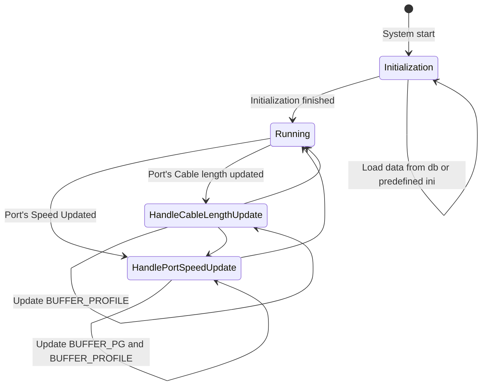

# Flow charts

```mermaid
%Allocate a New Profile
% allocate-profile.png
sequenceDiagram
  participant System
  participant Buffer Manager
  participant Lua engine
  participant Database Service
  participant Buffer Orch
  participant SAI

  System -->>+ Buffer Manager: Allocate a profile
  Note over System, Buffer Manager: parameter: (speed, length, gearbox-model)
  Buffer Manager -->> Database Service: Check whether there has already been a profile for the (speed, length, gearbox-model) tuple
  alt if there is one existing
  Buffer Manager -->> System: Return the existing profile
  else it's the first time this speed and cable length tuple occurs in the system
  Buffer Manager -->>+ Lua engine: Calculate new headroom size via the well-known formula
  Lua engine -->>- Buffer Manager: Return headroom info
  Buffer Manager -->> Database Service: Insert the profile into APPL_DB.BUFFER_PROFILE
  par Notify orchagent in another thread
  Database Service -->>+ Buffer Orch: Create a profile
  Buffer Orch -->>+ SAI: create_buffer_profile
  Buffer Orch -->>- Database Service: Finish
  end
  end
  Buffer Manager -->>- System: Finish
```

```mermaid
%Release a profile
%release-profile.png
sequenceDiagram
  participant System
  participant Buffer Manager
  participant Database Service
  participant Buffer Orch
  participant SAI

  System -->>+ Buffer Manager: Release a profile
  Note over System, Buffer Manager: parameter: (speed, length, gearbox-model)
  Buffer Manager ->> Buffer Manager: Check whether the profile is derived from CONFIG_DB.BUFFER_PROFILE
  Buffer Manager ->> Buffer Manager: Check whether the profile is referenced any longer
  opt the profile isn't derived from CONFIG_DB nor referenced any longer
  Buffer Manager -->> Database Service: Destroy an entry in BUFFER_PROFILE table
  par Notify orchagent in another thread
  Database Service -->>+ Buffer Orch: Remove a profile
  Buffer Orch -->>+ SAI: remove_buffer_profile
  Buffer Orch -->>- Database Service: Finish
  end
  end
  Buffer Manager -->>- System: Finish
```

```meimaid
%Calculate shared buffer pool size
sequenceDiagram
  participant System
  participant Buffer Manager
  participant Database Service
  participant Buffer Orch
  participant SAI
  participant Log

  System -->>+ Buffer Manager: Recalculate shared buffer pool size
  loop Iterate all port
  opt Port is admin up
  Buffer Manager ->> Buffer Manager: Accumulate the headroom size of all lossless PGs
  Buffer Manager ->> Buffer Manager: Accumulate the reserved size of all lossy PGs
  Buffer Manager ->> Buffer Manager: Accumulate the reserved size for egress traffic
  end
  end
  loop for each buffer pool
  opt buffer pool needs to be update size dynamically
  Buffer Manager -->> Database Service: Update BUFFER_POOL
  par Notify orchagent in another thread
  Database Service -->>+ Buffer Orch: Notify BUFFER_POOL updated
  Buffer Orch -->>+ SAI: set_buffer_pool_attribute
  Buffer Orch -->>- Database Service: Finish
  end
  Buffer Manager -->> Log: Log the old and new size of the pool in INFO level
  end
  end
  Buffer Manager -->>- System: Finish
```

```meimaid
%Calculate the headroom for a port, PG tuple
%recalculate.png
sequenceDiagram
  participant System
  participant Buffer Manager
  participant Database Service
  participant Buffer Orch
  participant SAI

  System -->>+ Buffer Manager: Recalculate a port's headroom with new parameters
  Note over System, SAI: parameter: (speed, length, lossless_pg, profile), current value: (speed_old, length_old, lossless_pg_old, profile_old)
  alt speed or length updated
  Buffer Manager ->> Buffer Manager: Allocate a profile for (speed, length)
  else Configure headroom override
  Buffer Manager ->> Buffer Manager: Use the profile passed-in
  else headroom override configured AND passed-in profile is NULL
  Buffer Manager ->> Buffer Manager: This means to remove headroom override
  end
  opt lossless_pg != lossless_pg_old or remove headroom override
  Buffer Manager ->> Buffer Manager: Remove the port's BUFFER_PG table entry indexed by (port, lossless_pg_old)
  Buffer Manager -->> Database Service: Notify BUFFER_PG|<port>|lossless_pg_old removed
  par Notify orchagent in another thread
  Database Service -->>+ Buffer Orch: Notify BUFFER_PG|<port>|lossless_pg_old removed
  loop For each priority
  Buffer Orch -->> SAI: set_ingress_priority_group_attribute(attribute = null oid)
  end
  Buffer Orch -->>- Database Service: Finish
  end
  end
  opt lossless_pg != empty set
  Buffer Manager ->> Buffer Manager: Update the port's BUFFER_PG table entry indexed by (port, lossless_pg)
  Buffer Manager -->> Database Service: Update BUFFER_PG
  par Notify orchagent in another thread
  Database Service -->>+ Buffer Orch: Notify BUFFER_PG|<port>|lossless_pg updated
  loop For each priority
  Buffer Orch -->> SAI: set_ingress_priority_group_attribute
  end
  Buffer Orch -->>- Database Service: Finish
  end
  end
  opt speed or length updated
  Buffer Manager ->> Buffer Manager: Release profile for (speed_old, length_old)
  end
  Buffer Manager -->>- System: Finish
```

```mermaid
%cable-length-speed-update.png
sequenceDiagram
  participant System
  participant Log
  participant Buffer Manager
  participant Database Service
  participant Lua engine
  participant Buffer Orch
  participant SAI

  System -->>+ Buffer Manager: A port's speed or cable length updated
  Note over System, Buffer Manager: parameter (speed, cable length)
  loop for each PG configured on the port
  opt the PG is dynamically calculated
  opt first PG
  Buffer Manager ->> Buffer Manager: Allocate new profile or reuse an existing one
  Buffer Manager -->>+ Lua engine: Check whether headroom exceeds limit
  Lua engine -->>- Buffer Manager: Return result
  opt Headroom exceeds the limit
  Buffer Manager ->> Buffer Manager: Release the newly created profile
  Buffer Manager ->> Buffer Manager: Keep previous data in APPL_DB
  Buffer Manager -->> Log: Error message should be logged
  Buffer Manager -->> System: Process exit due to error
  end
  end
  Buffer Manager -->> Database Service: Update APPL_DB.BUFFER_PG|<port>|<pg> table
  par Notify orchagent in another thread
  Database Service -->>+ Buffer Orch: Notify BUFFER_PG|<port>|lossless_pg updated
  loop For each priority
  Buffer Orch -->> SAI: set_ingress_priority_group_attribute
  end
  Buffer Orch -->>- Database Service: Finish
  end
  end
  end
  Buffer Manager ->> Buffer Manager: Calculate and deploy share buffer
  opt speed or cable length updated
  Buffer Manager ->> Buffer Manager: Check whether the old profile used is referenced by other ports any longer. Remove if no
  end
  Buffer Manager -->>- System: Finish
```

```mermaid
%Admin Up/Down: 1. calculate or static, 2. deploy
sequenceDiagram
  participant System
  participant Buffer Manager

  System -->>+ Buffer Manager: A port's admin status is updated
  Buffer Manager ->> Buffer Manager: Recalculate the pool size
  Buffer Manager -->>- System: Finish
```

```mermaid
%Update buffer PG of a port
%update-dynamic-pg
sequenceDiagram
  participant System
  participant Log
  participant Buffer Manager
  participant Database Service
  participant Buffer Orch
  participant SAI

  System -->>+ Buffer Manager: Notify BUFFER_PG updated
  alt There have already been lossless PGs configured on the port
  Buffer Manager ->> Buffer Manager: Check whether headroom exceeds limit
  opt Headroom exceeds the limit
  Buffer Manager ->> Buffer Manager: new BUFFER_PG won't be applied
  Buffer Manager -->> Log: Error message should be logged
  Buffer Manager -->> System: Process exit due to error
  end
  Buffer Manager -->> Database Service: Update APPL_DB.BUFFER_PG|<port>|<pg> table
  par Notify orchagent in another thread
  Database Service -->>+ Buffer Orch: Notify BUFFER_PG|<port>|lossless_pg updated
  loop For each priority
  Buffer Orch -->> SAI: set_ingress_priority_group_attribute
  end
  Buffer Orch -->>- Database Service: Finish
  end
  Buffer Manager ->> Buffer Manager: Recalculate buffer pool size
  else this is the first PG configured on the port
  opt both speed and cable length have been configured on the port
  Buffer Manager ->> Buffer Manager: Trigger the port speed and cable length update flow in order to apply propor profile
  end
  end
  Buffer Manager -->>- System: Finish
```

```mermaid
%Remove a dynamic PG
%remove-dynamic-pg
sequenceDiagram
  participant System
  participant Buffer Manager
  participant Database Service
  participant Buffer Orch
  participant SAI

  System -->>+ Buffer Manager: 
  Buffer Manager -->> Database Service: Remove item APPL_DB.BUFFER_PG|<port>|<pg>
  par Notify orchagent in another thread
  Database Service -->>+ Buffer Orch: Notify BUFFER_PG|<port>|lossless_pg updated
  loop For each priority
  Buffer Orch -->> SAI: set_ingress_priority_group_attribute
  end
  Buffer Orch -->>- Database Service: Finish
  end
  Buffer Manager ->> Buffer Manager: Recalculate buffer pool size
  Buffer Manager -->>- System: Finish
```

```mermaid
%Configure static headroom: 1. remove the profile current used 2. deploy the static profile
%add-headroom-override.png
sequenceDiagram
  participant System
  participant Log
  participant Buffer Manager
  participant Database Service
  participant Buffer Orch
  participant SAI

  System -->>+ Buffer Manager: Configure static headroom on a port (profile)
  alt profile existed
  Buffer Manager ->> Buffer Manager: Check whether headroom exceeds limit
  opt Headroom exceeds the limit or dynamic profile configured
  Buffer Manager ->> Buffer Manager: new BUFFER_PG won't be applied
  Buffer Manager -->> Log: Error message should be logged
  Buffer Manager -->> System: Process exit due to error
  end
  Buffer Manager -->> Database Service: Update BUFFER_PG table
  par Notify orchagent in another thread
  Database Service -->>+ Buffer Orch: Notify BUFFER_PG updated
  Buffer Orch -->> SAI: set_ingress_priority_group_attribute
  Buffer Orch -->>- Database Service: Finish
  and
  Buffer Manager ->> Buffer Manager: Release the current applied profile for the port
  Buffer Manager ->> Buffer Manager: Recalculate buffer pool size and populate to ASIC
  end
  else profile doesn't exist (it's possible that database service notify profile creating later than buffer pg)
  Buffer Manager -->> Log: Error message should be logged
  Buffer Manager ->> Buffer Manager: The update item should remain in m_toSync
  end
  Buffer Manager -->>- System: Finish
```

```mermaid
%De-configure static headroom:
%remove-headroom-override.png
sequenceDiagram
  participant System
  participant Log
  participant Buffer Manager
  participant Database Service
  participant Buffer Orch
  participant SAI

  System -->>+ Buffer Manager: DeConfigure static headroom on a port (profile)
  alt currently it's headroom override on this port
  Buffer Manager -->> Database Service: Notify BUFFER_PG removed
  par Notify orchagent in another thread
  Database Service -->>+ Buffer Orch: Notify BUFFER_PG removed
  Buffer Orch -->> SAI: set_ingress_priority_group_attribute
  Buffer Orch -->>- Database Service: Finish
  end
  Buffer Manager ->> Buffer Manager: Recalculate buffer pool size and populate to ASIC
  else it isn't headroom override on this port
  Buffer Manager -->> Log: Error message should be logged
  end
  Buffer Manager -->>- System: Finish
```

```mermaid
%Update static profile:
%static-profile-updated.png
sequenceDiagram
  participant System
  participant Log
  participant Buffer Manager
  participant Database Service
  participant Buffer Orch

  System -->>+ Buffer Manager: Update static profile
  loop for each port who references this profile
  Buffer Manager ->> Buffer Manager: Calculate the accumulative headroom size of the port
  alt headroom exceeds the limit
  Buffer Manager -->> Log: An error message should be logged
  Buffer Manager -->> System: Procedure exit with APPL_DB untouched
  end
  end
  Buffer Manager -->> Database Service: Update corresponding buffer profile in APPL_DB
  par Notify orchagent in another thread
  Database Service -->>+ Buffer Orch: Buffer profile updated
  Buffer Orch -->>+ SAI: set_buffer_profile_attribute
  Buffer Orch -->>- Database Service: Finish
  end
  Buffer Manager ->> Buffer Manager: Recalculate the buffer pool size and program ASIC
  Buffer Manager -->>- System: Finish
```


