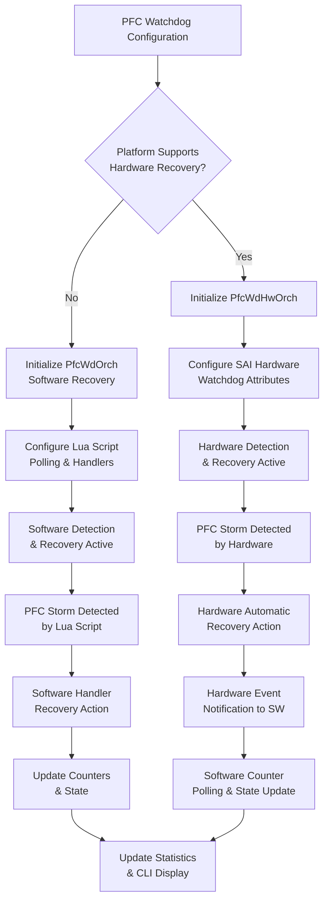
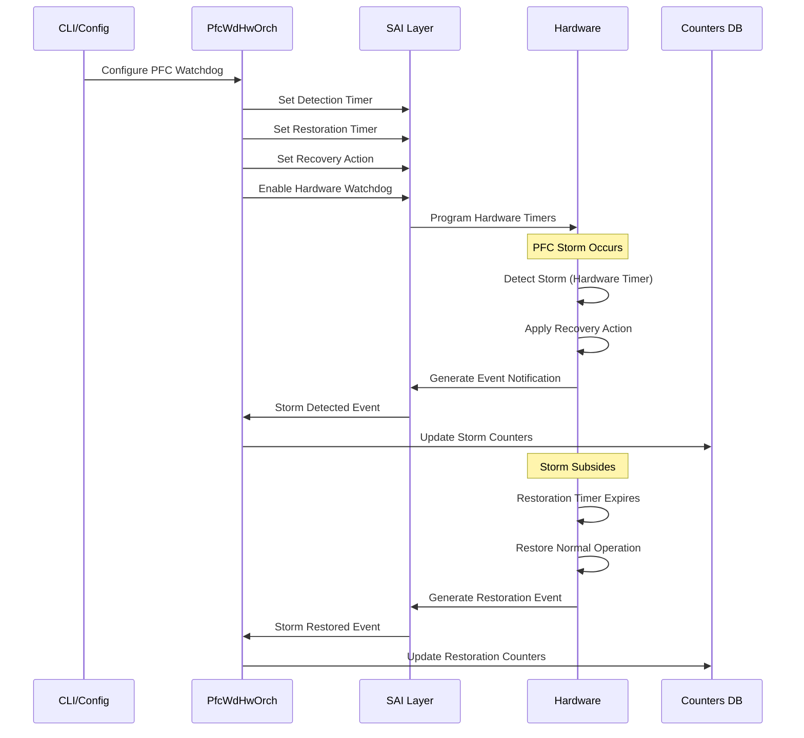

# PFC Watchdog Hardware Recovery

## Table of Contents

- [Revision](#revision)
- [Scope](#scope)
- [Abbreviations](#abbreviations)
- [1. Overview](#1-overview)
- [2. Requirements](#2-requirements)
- [3. Architecture Design](#3-architecture-design)
- [4. High-Level Design](#4-high-level-design)
  - [4.1 Hardware Recovery Mechanism](#41-hardware-recovery-mechanism)
  - [4.2 PFC Watchdog Orchagent Refactoring](#42-pfc-watchdog-orchagent-refactoring)
- [5. CLI Changes](#5-cli-changes)
  - [5.1 CLI Data Flow](#51-cli-data-flow)
- [6. SAI API](#6-sai-api)
  - [6.1 SAI Attributes](#61-sai-attributes)
  - [6.2 SAI Events](#62-sai-events)
  - [6.3 SAI Statistics](#63-sai-statistics)
- [7. Configuration and Management](#7-configuration-and-management)
- [8. Manifest](#8-manifest)
- [9. CLI-YANG Model Enhancements](#9-cli-yang-model-enhancements)
- [10. Warmboot and Fastboot Design Impact](#10-warmboot-and-fastboot-design-impact)
- [11. Restrictions/Limitations](#11-restrictionslimitations)
- [12. Testing Requirements/Design](#12-testing-requirementsdesign)
  - [12.1 Additional Test Cases for Hardware Recovery](#121-additional-test-cases-for-hardware-recovery)

## Revision

| Rev | Date       | Author        | Change Description |
|-----|------------|---------------|--------------------|
| 0.1 | 12/13/2024 | PFC Team      | Initial version    |

## Scope

This document describes the design for hardware-based PFC (Priority Flow Control) watchdog recovery mechanism in SONiC. It covers the extension of existing software-based PFC watchdog functionality to support hardware-accelerated detection and recovery.

## Abbreviations

| Abbreviation | Description |
|--------------|-------------|
| PFC | Priority Flow Control |
| HLD | High Level Design |
| SAI | Switch Abstraction Interface |
| CLI | Command Line Interface |
| ACL | Access Control List |
| TC | Traffic Class |
| DLR | Deadlock Recovery |
| DLD | Deadlock Detection |

## 1. Overview

This design document is an extension of the existing PFC watchdog functionality described in the [PFC Watchdog Design](https://github.com/sonic-net/SONiC/wiki/PFC-Watchdog-Design). Newer network chips are capable of PFC storm detection and mitigation in the hardware without software intervention. Current implementation of software based PFC watchdog detection depends on constant polling of the queue's pause state, mitigation requires installation of ACLs to take drop action and restoration requires constant polling of PFC frames received on the queue.

This document provides an overview of the programming requirements to enable hardware based recovery for PFC watchdog.

## 2. Requirements

The hardware-based PFC watchdog recovery feature shall provide:

1. **Hardware Detection**: Automatic PFC deadlock detection in hardware without software polling
2. **Hardware Recovery**: Automatic recovery actions (drop/forward) performed by hardware
3. **Backward Compatibility**: Existing software-based PFC watchdog functionality remains unchanged
4. **Runtime Selection**: Automatic selection between hardware and software implementations based on platform capabilities
5. **Enhanced CLI**: New `show pfcwd status` command to display recovery type, actual hardware timer values, and granularity information
6. **Error Handling**: Proper validation and error reporting for hardware timer granularity constraints

## 3. Architecture Design

The architecture maintains separation between hardware and software PFC watchdog implementations while sharing common CLI parsing and validation logic.

```
Current: Orch -> PfcWdOrch<Handler> -> PfcWdSwOrch<Handler>
Proposed: Orch -> PfcWdBaseOrch -> {PfcWdHwOrch | PfcWdSwOrch<Handler>}
```

## 4. High-Level Design

### 4.1 Hardware Recovery Mechanism

Hardware recovery mechanism requires the application to program certain SAI attributes to initiate hardware based PFC deadlock detection and recovery. The below table highlights the key differences between hardware and software recovery.
Each phase of hardware detection and recovery happens based on the programming of a corresponding SAI attribute.

| Phase | Software Recovery | Hardware Recovery |
| ----- | ----- | ----- |
| Deadlock detection requirement | Polling period for lua script configured in S/W | Enable h/w deadlock detection and recovery. Configure detection timer. Register callback for h/w events |
| Detection mechanism | Lua script polls the queue to check if queue received PFC frames continuously for detection time | H/w detects the deadlock and publishes an event to the s/w to take action, if required. |
| PFC pause frame handling | Software disables PFC by clearing the PFC mask bit for the affected queue (ignores incoming PFC pause frames) | Hardware sets the registers that ignores PFC pause frames for the affected queue during storm mitigation |
| Mitigation | Orchagent programs ACLS to take drop action or programs a zero-buffer profile | H/w takes the drop/forward action |
| Recovery requirement | Polling period for lua script configured in S/W | Configure recovery timer attribute |
| Recovery | Lua script polls if the queue remains unpaused for restoration-time amount of time to recover | H/w recovers the queue and publishes an event to the s/w to take action, if required. |

**Timer granularity constraints:**
- Hardware may have granularity limitations (e.g., 100ms granularity)
- Configured values may differ from actual hardware-programmed values
- Upper limits may apply based on platform (e.g., Broadcom: 1-15 × granularity)

**Hardware recovery advantages:**
- **Better accuracy in storm detection**: Hardware-based detection operates at line rate without software polling delays, providing more precise detection timing
- **Better accuracy in storm restoration**: Hardware-based restoration timing is more accurate as it doesn't depend on software polling intervals or system load
- **Reduced latency**: Hardware detection and recovery actions happen immediately without waiting for software polling cycles
- **Lower CPU overhead**: Eliminates continuous software polling, reducing CPU utilization and system load

#### 4.1.1 Hardware vs Software Recovery Flow

The following diagram illustrates the decision flow for selecting hardware vs software recovery:



#### 4.1.2 Hardware Recovery Workflow

The following diagram shows the detailed hardware recovery process:



### 4.2 PFC Watchdog Orchagent Refactoring

This document outlines a proposal to refactor the PFC watchdog orchestrator architecture to support both hardware-based and software-based PFC recovery mechanisms.

#### Design Goals

- **Clean separation**: Hardware-specific logic isolated from software watchdog logic  
- **Backward compatibility**: Existing software implementation remains unchanged  
- **Code reuse**: Common functionality (CLI parsing, validation) remains in one place for both.

#### Current Architecture

```
Orch (base class)
  └── PfcWdOrch<DropHandler, ForwardHandler> (template class)
      └── PfcWdSwOrch<DropHandler, ForwardHandler> (template class)
```

#### Proposed Architecture

```
Orch (base class)
  └── PfcWdBaseOrch (new base class)
      ├── PfcWdHwOrch (new hardware-based class - no handlers)
      └── PfcWdSwOrch<DropHandler, ForwardHandler> (existing template class)
```

#### Implementation Details

`PfcWdBaseOrch` is the new base class that will have the common logic of parsing the CLI and creating the tasks. This implementation exists in `PfcWdOrch` today and will be moved to this new class. `PfcWdOrch` will be removed and renamed to `PfcWdBaseOrch` without the template parameters.

`PfcWdHwOrch` is the new class that will handle hardware recovery mechanisms. There will be no handlers defined in hardware-based recovery unlike software recovery which defines drop and forward handlers. To update the counters periodically, `PfcWdHwOrch` itself will provide a function to read the required SAI attributes and get updated counters.

Runtime selection in `orchdaemon.cpp`:

```c
// Check hardware capability
bool pfcHwRecoverySupported = gSwitchOrch->checkPfcHwRecoverySupport();

if (pfcHwRecoverySupported)
{
    SWSS_LOG_NOTICE("Starting hardware-based PFC watchdog (no handlers)");
    m_orchList.push_back(new PfcWdHwOrch(
                    m_configDb,
                    pfc_wd_tables,
                    portStatIds,
                    queueStatIds,
                    queueAttrIds));
}
```


## 5. CLI Changes

All existing CLI commands for PFC watchdog will remain unchanged as documented in [section 2.7 of the PFC Watchdog Design](https://github.com/sonic-net/SONiC/wiki/PFC-Watchdog-Design#27-cli).

Hardware recovery might have some constraints as listed below:

**Timer granularity**
There may be a granularity associated with the timers, so it is possible that the value configured in h/w is different from the value configured through the cli.
For example: if the hardware granularity is 100 ms and configured detection time through cli is 250 ms, then hardware might program either 200/300 ms.

**Upper limit on the timer value**
Some platforms like broadcom only allow the timer value to be within the range <1-15> multiplied with the current granularity. So, it is possible that the value in the cli config cannot be programmed in the hardware. There is no mechanism to notify the config status today.

**New CLI command**
We propose to add a new CLI command `show pfcwd status` to display hardware-specific information including recovery type, hardware detection time, hardware restoration time, detection time granularity, and restoration time granularity.

#### 5.1 CLI Data Flow

The following diagram illustrates how the new `show pfcwd status` command retrieves and displays information:

```mermaid
flowchart LR
    A[show pfcwd status] --> B{Recovery Type?}

    B -->|Hardware| C[Query SAI Attributes]
    B -->|Software| D[Return N/A Values]

    C --> E[Get Actual HW Timer Values]
    C --> F[Get Platform Granularity]
    C --> G[Get Recovery Type]

    E --> H[Format Display Data]
    F --> H
    G --> H
    D --> H

    H --> I[Display Table:<br/>PORT | RECOVERY TYPE | HW DETECTION TIME |<br/>DETECTION GRANULARITY | HW RESTORATION TIME |<br/>RESTORATION GRANULARITY]
```

```shell
admin@sonic:~$ show pfcwd status
PORT        RECOVERY TYPE    HW DETECTION TIME    DETECTION GRANULARITY    HW RESTORATION TIME    RESTORATION GRANULARITY
----------  -------------    -------------------  ---------------------    ---------------------  -----------------------
Ethernet0   hardware         300                  100ms                    500                    100ms
Ethernet4   software         N/A                  N/A                      N/A                    N/A
Ethernet8   hardware         200                  50ms                     400                    100ms
```

## 6. SAI API

Following SAI statistics and attributes are used in this feature:

### 6.1 SAI Attributes

- `SAI_QUEUE_ATTR_ENABLE_PFC_DLDR` - Enable PFC deadlock detection and recovery
- `SAI_SWITCH_ATTR_QUEUE_PFC_DEADLOCK_NOTIFY` - Register callback for PFC deadlock events
- `SAI_PORT_ATTR_PFC_TC_DLD_INTERVAL` - Detection timer intervals per port/per TC
- `SAI_PORT_ATTR_PFC_TC_DLR_INTERVAL` - Recovery timer intervals per port/per TC
- `SAI_SWITCH_ATTR_PFC_DLR_PACKET_ACTION` - Configure drop/forward action
- `SAI_QUEUE_ATTR_PFC_DLR_INIT` - Manual recovery control

### 6.2 SAI Events

- `SAI_QUEUE_PFC_DEADLOCK_EVENT_TYPE_DETECTED` - PFC deadlock detected event
- `SAI_QUEUE_PFC_DEADLOCK_EVENT_TYPE_RECOVERED` - PFC deadlock recovered event

### 6.3 SAI Statistics

Hardware-based PFC watchdog will use existing SAI statistics for counter collection:

- `SAI_QUEUE_STAT_PACKETS` - Queue packet counters
- `SAI_QUEUE_STAT_BYTES` - Queue byte counters
- `SAI_QUEUE_STAT_DROPPED_PACKETS` - Queue dropped packet counters
- `SAI_QUEUE_STAT_DROPPED_BYTES` - Queue dropped byte counters

## 7. Configuration and Management

The hardware-based PFC watchdog uses the same configuration interface as the existing software implementation:

- Configuration is done through CONFIG_DB PFC_WD table
- Runtime selection between hardware and software is automatic based on platform capabilities
- No additional configuration parameters are required for hardware mode

## 8. Manifest

Not applicable - this is a core SONiC feature enhancement.

## 9. CLI-YANG Model Enhancements

No YANG model changes are required for this feature. The new `show pfcwd status` command displays operational state data, not configuration data.

**Rationale**: The new command displays runtime operational data (actual hardware values, granularity constraints, recovery type) rather than user configuration. This operational data is derived from:
- Platform hardware capabilities (granularity values)
- Runtime hardware programming (actual timer values)
- Platform detection logic (recovery type selection)

The existing PFC watchdog configuration YANG model remains unchanged as all user-configurable parameters (detection_time, restoration_time, action, etc.) are already supported.

## 10. Warmboot and Fastboot Design Impact

There are no impacts to warmboot or fastboot. The hardware PFC watchdog configuration will be restored during the warmboot process through the standard CONFIG_DB restoration mechanism.

## 11. Restrictions/Limitations

- Hardware timer granularity constraints may prevent exact timer value programming
- Platform-specific upper limits on timer values may apply
- Manual recovery control requires platform support for `SAI_QUEUE_ATTR_PFC_DLR_INIT`

## 12. Testing Requirements/Design

All existing PFC watchdog testing remains unchanged as documented in the [PFC Watchdog Test Plan](https://github.com/sonic-net/SONiC/wiki/PFC-Watchdog-Test-Plan).

### 12.1 Additional Test Cases for Hardware Recovery

#### New CLI Command Testing
- Verify `show pfcwd status` command displays all required fields correctly
- Test recovery type display (hardware vs software)
- Validate hardware timer values and granularity information display
- Test N/A display for software recovery ports
- Verify column alignment and formatting
- Test command behavior on mixed hardware/software port configurations

#### Hardware Recovery Functionality Testing
- Verify hardware capability detection and automatic selection between hardware/software implementations
- Test SAI attribute programming for hardware watchdog configuration
- Validate timer granularity constraints and hardware programming
- Test error handling for unsupported timer values and hardware programming failures