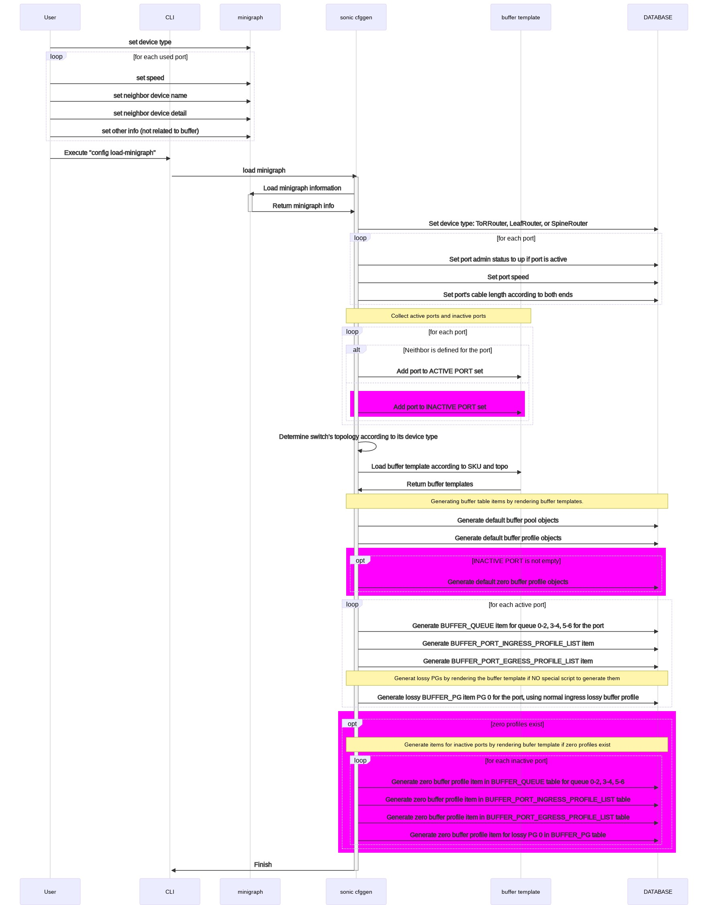
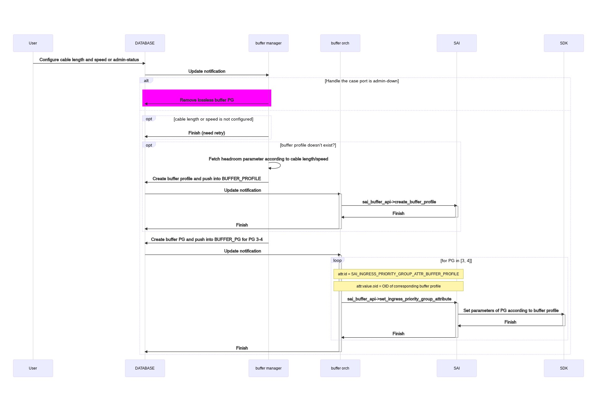
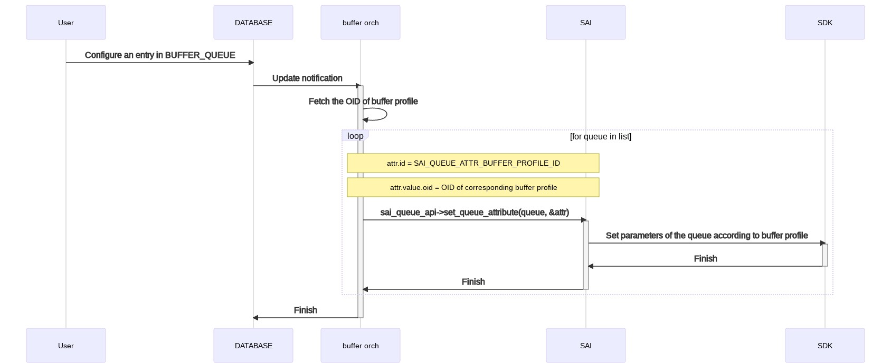
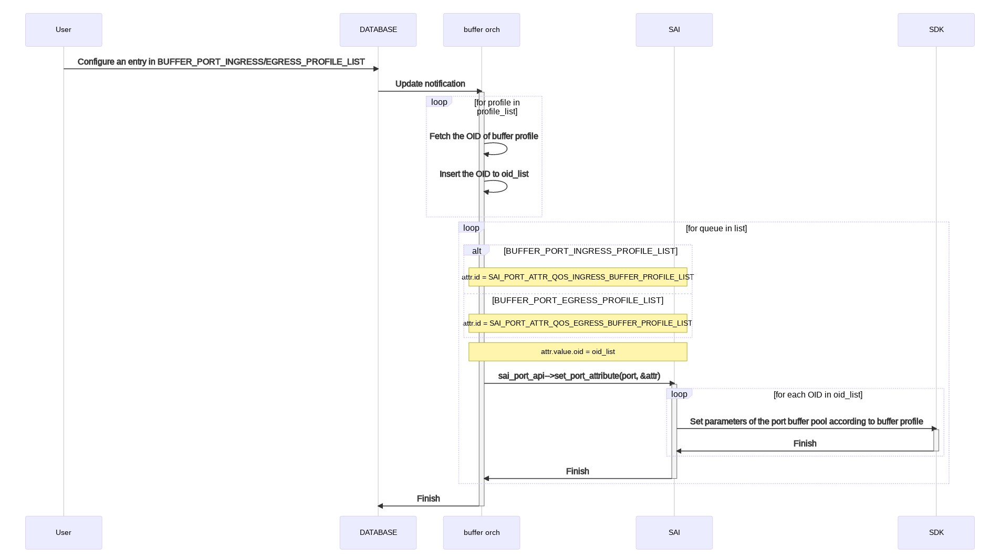
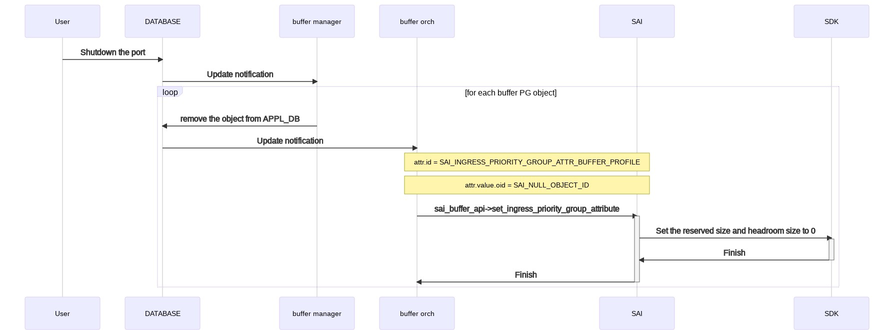
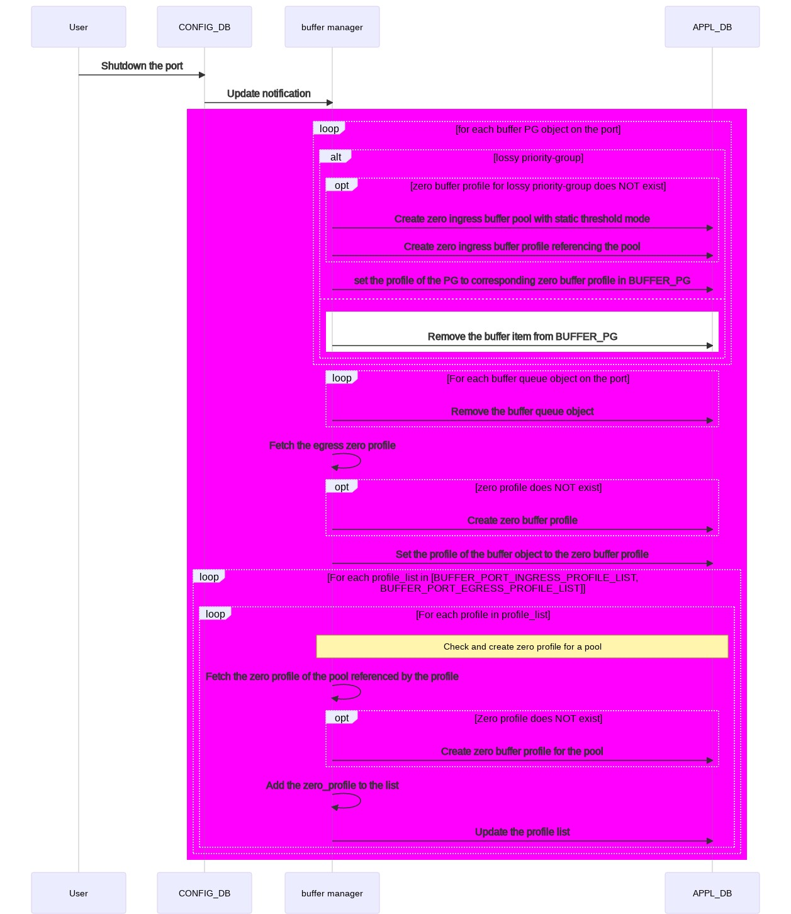

# Reclaim reserved buffer #

## 1 Table of Content ###

### 1.1 Revision ###

## 2 Scope ##

This section describes the scope of this high-level design document in SONiC.

## 3 Definitions/Abbreviations ##

This section covers the abbreviation if any, used in this high-level design document and its definitions.

| Term | Meaning |
|:--------:|:---------------------------------------------:|
| buffer object | The buffer configuration for priority groups, queues, ingress or egress profile lists |

## 4 Overview ##

Shared buffer is used to absorb traffic when a switch is under congestion. The larger the buffer, the better the performance in terms of congestion handling.

On Mellanox platforms, buffers are reserved for each port, PG and queue. The size of shared buffer pool is equal to the total memory minus the accumulative reserved buffers. So we would like to reduce the reserved buffer as many as possible. One way to do that is to reclaim the buffers reserved for admin down ports.

There are some admin down ports in user's scenario. There should not be any buffer reserved for admin down ports but currently there are by default.

The purpose of this document is to provide a way to reclaim the buffer reserved for admin down ports and then increase the shared buffer pool size.

## 5 Requirements ##

The requirement is to reclaim the reserved buffer for admin down ports, including:

- Buffer reserved SONiC configuration
  - BUFFER_PG
  - BUFFER_QUEUE
  - BUFFER_PORT_INGRESS_PROFILE_LIST / BUFFER_PORT_EGRESS_PROFILE_LIST

The reserved buffer is reclaimed when the port is admin down. The port can be admin down in the following two scenarios:

1. The port is not used by deployment. In other words, the port is an INACTIVE port.
2. The port is temporarily shut down for maintaince, for example, to replace a broken cable or module attached on the port.

The buffer reserved for the port is reclaimed in both scenario.

## 6 Architecture Design ##

### 6.1 The way to set reserved buffer to zero ###

Currently, the reserved size of a buffer object is set to zero when it is removed from `BUFFER_PG` or `BUFFER_QUEUE` table. A way to reclaim buffer is

- SONiC to remove objects of admin-down ports from `BUFFER_PG` and `BUFFER_QUEUE` tables
- SAI to set reserved size of buffer objects to zero on removing them.

However, this creates inconsistency. Consider the following scenarios:

1. System starting flow. SAI will not touch buffer objects if there is no buffer related configuration applied from SONiC, leaving them as the SDK default value. As a result, for any buffer object,
   - There is no buffer configuration in SONiC
   - The reserved buffer size in the ASIC is the SDK default value, some of which are not zero
2. System started, an existing buffer object is removed. SONiC notifies SAI by setting profile to `SAI_NULL_OBJECT_ID`. SAI will set the reserved size of corresponding buffer object to zero. As a result, for the buffer object,
   - There is no buffer configuration in SONiC
   - The reserved buffer size in the ASIC is zero

For some of the buffer objects, the SDK default reserved size is not zero. This is to make sure the system works correctly without any buffer configuration in SONiC.
Now we have same SONiC configuration in 1 and 2 but different reserved buffer size in the ASIC.

To make it clear and consistent, we need the following solution:

- For lossless buffer priority groups, SONiC should remove them from SAI when the port is admin down.
- For other buffer objects:
  - Introduce a new type of buffer profiles - `zero profile`.
  - Apply the `zero profile` to the buffer objects in order to reclaim reserved buffer.
- What do the `zero profile`s look like (on Mellanox platform):
  - For lossy priority groups:
    - Create a `zero pool` with static threshold mode and 0 as buffer pool size.
    - Create the `zero profile` with static threshold mode, and 0 for both `static_th` and `size`.
  - For queues and buffer port ingress/egress profile list:
    - Create a `zero profile` with dynamic threshold mode and 0 as `size`.
- When will the `zero profile`s be created:
  - In `traditional buffer model`:
    - `zero profile`s will be created if there are unused ports during deployment.
    - It's user's responsibility to create `zero profile` if he/she disables a port on-the-fly.
  - In `dynamic buffer model`:
    - `zero profile`s will be created once at least 1 unused port exists.
    - `zero profile`s will be pushed into `APPL_DB` only.
- SAI should configure buffer objects to:
  - SDK default value, if there is no buffer profile configured for the object in SONiC when SAI is starting.
  - SDK default value, if a buffer object is removed from SONiC
  - Zero, only if the object is configured with an `zero profile`

To achieve it the following steps will be taken:

1. A series of `zero_profile`s should be defined for ingress/egress and lossless/lossy traffic.
2. Currently, there is no buffer object configured on admin-down ports. The `zero_profile` should be configured explicitly on admin-down ports.
3. Database migrator is required to bridge the gap between the old and new system when a switch is upgraded.

This can be implemented on a per-vendor basis. For vendors with zero buffer profiles provided in buffer template, we will go this way. Otherwise, the reserved buffer will be reclaimed by removing corresponding buffer objects.

This is for both static and dynamic buffer model.

## 7 Static buffer model ##

In static buffer model, buffer manager is responsible for:

- Create a buffer profile entry in `CONFIG_DB.BUFFER_PROFILE` table when the `speed`, `cable length` tuple occurs for the first time

  The parameters, including `xon`, `xoff`, `size`, `threshold` are looked up from `pg_profile_lookup.ini` with `speed` and `cable length` as the key.
- Create a buffer priority-group entry in `CONFIG_DB.BUFFER_PG` table.

All other buffer related configuration will be provided by the user.

### 7.1 Deploy the buffer configuration for a switch ###

By default, the buffer configuration is applied during deployment of the switch. Buffer configuration will be applied on active ports only. A port with neighbor device defined in `minigraph` will be treated as an active port.

To deploy the switch, the related information should be provided by user in `minigraph`. The information related to buffer configuration includes:

- Device type which can be one of `ToRRouter`, `LeafRouter`, and `SpineRouter`.
- Speed of each active port
- Neighbor device of each active port
- Meta data of the neighbors of active ports, like `type`, which which can be one of `server`, `ToRRouter`, `LeafRouter`, and `SpineRouter`.

The system will generate necessary items and push them into `CONFIG_DB`, which effectively configures buffer for the active ports.

- `admin status` in `PORT` table
  - `up` for active ports
  - `down` for inactive ports
- `speed` in `PORT` table
- `cable length` in `CABLE_LENGTH` table
  - `40m` for ports connected between a `LeafRouter` and a `ToRRouter`
  - `300m` or `2000m` for ports connected between a `LeafRouter` and a `SpineRouter`
  - `5m` otherwise
- Determine switch's topology according to switch's device type:
  - `ToRRouter` - t0
  - `LeafRouter` - t1
- Create the following items by rendering `buffer template` according to `hwsku` and `topo`
  - Buffer pools in `BUFFER_POOL` table
    - `ingress_lossless_pool`
    - `ingress_lossy_pool`, only available in general SKU
    - `egress_lossless_pool`
    - `egress_lossy_pool`
  - Buffer profiles in `BUFFER_PROFILE` table
    - `ingress_lossless_profile`, for ingress lossless port buffer pool
    - `ingress_lossy_profile`, for ingress lossy port buffer pool and priority group
    - `egress_lossless_profile`, for egress lossless port buffer pool and queue
    - `egress_lossy_profile`, for egress lossy port buffer pool
    - `q_lossy_profile`, for egress lossy queue
  - Zero buffer profiles in `BUFFER_PROFILE` table
    - `ingress_lossless_zero_profile`, zero profile for ingress lossless traffic
    - `ingress_lossy_zero_profile`, zero profile for ingress lossy traffic
    - `egress_lossless_zero_profile`, zero profile for egress lossless traffic
    - `egress_lossy_zero_profile`, zero profile for egress lossy traffic
  - Buffer queue items in `BUFFER_QUEUE` table
  - Buffer priority group items in `BUFFER_PG` table
  - Buffer ingress and egress port profile list in `BUFFER_PORT_INGRESS_PROFILE_LIST` and `BUFFER_PORT_EGRESS_PROFILE_LIST` respectively.

#### 7.1.1 Buffer template update for zero buffer profiles ####

##### 7.1.1.1 Macro to generate inactive ports #####

The inactive ports list is generated by the following buffer template.

These macros are defined in generic buffer template file `buffer_template.j2`.

The following snippet of code is to generate `PORT_INACTIVE` which contains all the inactive ports. Only `PORT_INACTIVE` is none empty will the zero buffer profiles be generated in vendor specific template.

They need to be moved from the middle of `buffer_template.j2` to the place just before the vendor specific template is imported, so that the vendor specific template has access to `PORT_INACTIVE`.

```json
 # ignore this line please



     

    
        
    





    

    
        
            
        
            
        
    


{# Import default values from device HWSKU folder #}
{%- import 'buffers_defaults_%s.j2' % filename_postfix as defs with context %}
 # ignore this line please
```

The vairable `port_names_inactive` also need to be generated by the following snipped of code.

```json
 # ignore this line please


    


 # ignore this line please
```

##### 7.1.1.2 Macro to generate buffer pool and profiles #####

Zero buffer profiles should be defined for ingress/egress and lossless/lossy traffic in the buffer template. To achieve that the macro `generate_buffer_pool_and_profiles` needs to be updated.

This macro is defined in vendor specific buffer template files.

```json
 # ignore this line please

    "BUFFER_POOL": {

        "ingress_zero_pool" : {
          "mode": "static",
          "type": "ingress",
          "size": "0"
        },

        "ingress_lossless_pool": {
            
            "size": "{{ ingress_lossless_pool_size }}",
            
            "type": "ingress",
            "mode": "dynamic"
        },
        "ingress_lossy_pool": {
            
            "size": "{{ ingress_lossy_pool_size }}",
            
            "type": "ingress",
            "mode": "dynamic"
        },
        "egress_lossless_pool": {
            "size": "{{ egress_lossless_pool_size }}",
            "type": "egress",
            "mode": "dynamic"
        },
        "egress_lossy_pool": {
            
            "size": "{{ egress_lossy_pool_size }}",
            
            "type": "egress",
            "mode": "dynamic"
        }
    },
    "BUFFER_PROFILE": {

        "ingress_lossy_pg_zero_profile" : {
          "pool":"[BUFFER_POOL|ingress_zero_pool]",
          "size":"0",
          "static_th":"0"
        },
        "ingress_lossless_zero_profile" : {
          "pool":"[BUFFER_POOL|ingress_lossless_pool]",
          "size":"0",
          "dynamic_th":"-8"
        },
        "ingress_lossy_zero_profile" : {
          "pool":"[BUFFER_POOL|ingress_lossy_pool]",
          "size":"0",
          "dynamic_th":"-8"
        },
        "egress_lossless_zero_profile" : {
          "pool":"[BUFFER_POOL|egress_lossless_pool]",
          "size":"0",
          "dynamic_th":"-8"
        },
        "egress_lossy_zero_profile" : {
          "pool":"[BUFFER_POOL|egress_lossy_pool]",
          "size":"0",
          "dynamic_ty":"-8"
        },

        "ingress_lossless_profile": {
            "pool":"[BUFFER_POOL|ingress_lossless_pool]",
            "size":"0",
            "dynamic_th":"7"
        },
        "ingress_lossy_profile": {
            "pool":"[BUFFER_POOL|ingress_lossy_pool]",
            "size":"0",
            "dynamic_th":"3"
        },
        "egress_lossless_profile": {
            "pool":"[BUFFER_POOL|egress_lossless_pool]",
            "size":"0",
            "dynamic_th":"7"
        },
        "egress_lossy_profile": {
            "pool":"[BUFFER_POOL|egress_lossy_pool]",
            "size":"9216",
            "dynamic_th":"7"
        },
        "q_lossy_profile": {
            "pool":"[BUFFER_POOL|egress_lossy_pool]",
            "size":"0",
            "dynamic_th":"3"
        }
    },

 # ignore this line please
```

##### 7.1.1.3 Macro to apply zero buffer profiles to inactive ports #####

The zero profiles should be configured explicitly on admin-down ports by the following buffer template.

Originally, the macros to generate `BUFFER_QUEUE`, `BUFFER_PG`, `BUFFER_PORT_INGRESS_PROFILE_LIST` and `BUFFER_PORT_EGRESS_PROFILE_LIST` take only one argument which is `port_names_active`. Now that `zero profile`s also need to be applied on inactive ports, the macros need to be extended to support inactive ports as an argument.

To tolerance the vendors who do not support the additional argument, both the original version and the extended version should be supported in generic buffer template.

- `generate_profile_lists_with_inactive_ports` and `generate_profile_lists`
- `generate_pg_profiles_with_inactive_ports` and `generate_pg_profils`
- `generate_queue_buffers_with_inactive_ports` and `generate_queue_buffers`

These macros are defined in vendor specific buffer template files.

generate_profile_lists_with_inactive_ports:

```json
 # ignore this line please

    "BUFFER_PORT_INGRESS_PROFILE_LIST": {

        "{{ port }}": {
            "profile_list" : "[BUFFER_PROFILE|ingress_lossless_profile],[BUFFER_PROFILE|ingress_lossy_profile]"
        },



,

        "{{ port }}": {

            "profile_list" : "[BUFFER_PROFILE|ingress_lossless_profile],[BUFFER_PROFILE|ingress_lossy_profile]"

            "profile_list" : "[BUFFER_PROFILE|ingress_lossless_zero_profile],[BUFFER_PROFILE|ingress_lossy_zero_profile]"

        },



    },
    "BUFFER_PORT_EGRESS_PROFILE_LIST": {

        "{{ port }}": {
            "profile_list" : "[BUFFER_PROFILE|egress_lossless_profile],[BUFFER_PROFILE|egress_lossy_profile]"
        },



,

        "{{ port }}": {

            "profile_list" : "[BUFFER_PROFILE|egress_lossless_profile],[BUFFER_PROFILE|egress_lossy_profile]"

            "profile_list" : "[BUFFER_PROFILE|egress_lossless_zero_profile],[BUFFER_PROFILE|egress_lossy_zero_profile]"

        },



    }

 # ignore this line please
```

generate_pg_profiles_with_inactive_ports:

```json
 # ignore this line please

    "BUFFER_PG": {


        "{{ port }}|3-4": {
            "profile" : "NULL"
        },

        "{{ port }}|0": {
            "profile" : "[BUFFER_PROFILE|ingress_lossy_profile]"
        },




       ,

        "{{ port }}|3-4": {
            "profile" : "NULL"
        },

       "{{ port }}|0": {

            "profile" : "[BUFFER_PROFILE|ingress_lossy_profile]"

            "profile" : "[BUFFER_PROFILE|ingress_lossy_pg_zero_profile]"

        },



    }

 # ignore this line please
```

generate_queue_buffers_with_inactive_ports:

```json
 # ignore this line please

    "BUFFER_QUEUE": {

        "{{ port }}|3-4": {
            "profile" : "[BUFFER_PROFILE|egress_lossless_profile]"
        },


        "{{ port }}|0-2": {
            "profile" : "[BUFFER_PROFILE|q_lossy_profile]"
        },


        "{{ port }}|5-6": {
            "profile" : "[BUFFER_PROFILE|q_lossy_profile]"
        },



,


        "{{ port }}|3-4": {
            "profile" : "[BUFFER_PROFILE|egress_lossless_profile]"
        },


        "{{ port }}|0-2": {
            "profile" : "[BUFFER_PROFILE|q_lossy_profile]"
        },


        "{{ port }}|5-6": {
            "profile" : "[BUFFER_PROFILE|q_lossy_profile]"
        },




        "{{ port }}|3-4": {
            "profile" : "[BUFFER_PROFILE|egress_lossless_zero_profile]"
        },


        "{{ port }}|0-2": {
            "profile" : "[BUFFER_PROFILE|egress_lossy_zero_profile]"
        },


        "{{ port }}|5-6": {
            "profile" : "[BUFFER_PROFILE|egress_lossy_zero_profile]"
        },




    }

 # ignore this line please
```

Assume port `Ethernet0` is admin down, an example is:

```json
{
  "BUFFER_PG" : {
    "Ethernet0|0" : {
      "profile": "[BUFFER_PROFILE|ingress_lossy_pg_zero_profile]"
    }
  },
  "BUFFER_QUEUE" : {
    "Ethernet0|0-2" : {
      "profile": "[BUFFER_PROFILE|egress_lossy_zero_profile]"
    }
  },
  "BUFFER_QUEUE" : {
    "Ethernet0|3-4" : {
      "profile": "[BUFFER_PROFILE|egress_lossless_zero_profile]"
    }
  },
  "BUFFER_QUEUE" : {
    "Ethernet0|5-6" : {
      "profile": "[BUFFER_PROFILE|egress_lossy_zero_profile]"
    }
  },
  "BUFFER_PORT_INGRESS_PROFILE_LIST" : {
    "Ethernet0" : {
      "profile_list" : "[BUFFER_PROFILE|ingress_lossless_zero_profile],[BUFFER_PROFILE|ingress_lossy_zero_profile]"
    }
  },
  "BUFFER_PORT_EGRESS_PROFILE_LIST" : {
    "Ethernet0" : {
      "profile_list" : "[BUFFER_PROFILE|egress_lossless_zero_profile],[BUFFER_PROFILE|egress_lossy_zero_profile]"
    }
  }
}
```

#### 7.1.2 The flow to deploy a switch ####

In the flow, the steps in pink are needed to be implemented.

- INACTIVE_PORT set needs to be generated. Currently, only ACTIVE_PORT set is generated.
- Zero profiles need to be generated if the INACTIVE_PORT set is not empty.
- Zero profiles need to be applied to inactive ports.

All other steps exist.



#### 7.1.3 The flow to handle `speed`, `cable length` and `admin status` of the port ####

In the flow, buffer manager will test port's admin status. It will remove lossless priority groups or apply zero profile on it and then skip the rest part if it's admin-down. This is the pink area in the flow chart, which needs to be implemented.

All other steps exist.



#### 7.1.4 The flow to handle `BUFFER_QUEUE` table add entry ####

This is an existing flow. No code change is required.



#### 7.1.5 The flow to handle `BUFFER_PORT_INGRESS_PROFILE_LIST`, and `BUFFER_PORT_EGRESS_PROFILE_LIST` table add entry ####

This is an existing flow. No code change is required.



### 7.2 Enable a port and configure buffer for it ###

The following buffer profiles should be created before enabling a port and configuring buffer for it. By default, they are defined in `buffer template` and will be applied when the `minigraph` is reloaded.

- `ingress_lossless_profile`
- `ingress_lossy_profile`
- `egress_lossless_profile`
- `egress_lossy_profile`
- `q_lossy_profile`

The following items need to be configured to enable a port and configure buffer for it. By default, they are defined in `buffer template` or `minigraph` and will be applied when the the `minigraph` is reloaded.

In case the user wants to re-enable a disabled port, he needs to configure the following items manually.

- Set `admin status` to `up` for the port by executing command `config interface startup <port>`.
- Add following entries in the corresponding buffer table for the port.
  
  Currently there is not any commands or other UI that user can use to add the following items. So the only way for a user to configure them is to compose a json file containing all the items and then to execute `sonic-cfggen -j <json-file-name> --write-to-db`. We will give an example of each items.
  - PG 0 in `CONFIG_DB.BUFFER_PG` table as a lossy priority group with `BUFFER_PROFILE|ingress_lossy_profile` as the `profile`

    An example of PG items for port `Ethernet0`:

    ```json
    {
        "BUFFER_PG": {
            "Ethernet0|0": {
                "profile": "[BUFFER_PROFILE|ingress_lossy_profile]"
            }
        }
    }
    ```

  - Queues `0-2`, `5-6` in `CONFIG_DB.BUFFER_QUEUE` as lossy queues with `BUFFER_PROFILE|q_lossy_profile` as the `profile`
  - Queues `3-4` in `CONFIG_DB.BUFFER_QUEUE` as lossless queues with `BUFFER_PROFILE|egress_lossless_profile` as the `profile`

    An example of queue items for port `Ethernet0`:

    ```json
    {
        "BUFFER_QUEUE": {
            "Ethernet0|0-2": {
                "profile": "[BUFFER_PROFILE|q_lossy_profile]"
            },
            "Ethernet0|3-4": {
                "profile": "[BUFFER_PROFILE|egress_lossless_profile]"
            },
            "Ethernet0|5-6": {
                "profile": "[BUFFER_PROFILE|q_lossy_profile]"
            }
        }
    }
    ```

  - An item in `CONFIG_DB.BUFFER_PORT_INGRESS_PROFILE_LIST` table with the following profiles in the `profile_list`
    - `BUFFER_PROFILE|ingress_lossless_profile` for `ingress_lossless_pool`
    - `BUFFER_PROFILE|ingress_lossy_profile` for `ingress_lossy_pool` if the pool exists

    An example of ingress profile list item for port `Ethernet0` for single ingress pool mode:

    ```json
    {
        "BUFFER_PORT_INGRESS_PROFILE_LIST": {
            "Ethernet0": {
                "profile_list": "[BUFFER_PROFILE|ingress_lossless_profile]"
            }
        }
    }
    ```

  - An item in `CONFIG_DB.BUFFER_PORT_EGRESS_PROFILE_LIST` table with the following profiles in the `profile_list`
    - `BUFFER_PROFILE|egress_lossless_profile` for `egress_lossless_pool`
    - `BUFFER_PROFILE|egress_lossy_profile` for `egress_lossy_pool`

    An example of egress profile list item for port `Ethernet0`:

    ```json
    {
        "BUFFER_PORT_EGRESS_PROFILE_LIST": {
            "Ethernet0": {
                "profile_list": "[BUFFER_PROFILE|egress_lossless_profile],[BUFFER_PROFILE|egress_lossy_profile]"
            }
        }
    }
    ```

- Recalculate the sizes of shared buffer pool and shared headroom pool and configure them.

After the flow has been successfully executed:

- A lossless profile with name convention `pg_lossless_<speed>_<cable-length>_profile` will be created and inserted into `BUFFER_PROFILE` table.
- The priority group `3-4` will be created and inserted into `BUFFER_PG` table, referencing the buffer profile.
- Priority group `3` and `4` is enabled with corresponding headroom parameters (`headroom size`, `xon`, `xoff`) and alpha on the port.
- Priority group `0` is enabled with pipeline latency as `headroom size`.
- Reserved sizes and alpha of queue and port ingress/egress buffer pool are set according to the buffer profile referenced by the corresponding buffer tables.
- Sizes of shared buffer pool and shared headroom pool are set according to configuration.

The flows are the same as those of deploy a switch.

### 7.3 Disable a port and reclaim the buffer reserved for the port after a switch was deployed ###

The user needs to:

- Set the admin status of the port to `down` via executing command `config interface shutdown <port>`.
- Remove the lossless PG of the port from `CONFIG_DB` and set the following entries to `zero profile`. By default, they are enforced by `buffer template`.

  In case the user enabled a port and then decides to disable it, the following entries are in the system and the user has to remove them manually.

  There is no way for a user to remove items from the `CONFIG_DB` on the fly. So the only way for a user to do it is to remove the items from `config_db.json` and then to execute `config reload`. Examples of items in each of the following tables are provided in the previous chapter.

  Items need to be set to `zero profile`:
  - entries of admin-down ports in table `BUFFER_QUEUE`, `BUFFER_PORT_INGRESS_PROFILE_LIST` and `BUFFER_PORT_EGRESS_PROFILE_LIST`
  - lossy priority-groups of admin-down ports in table `BUFFER_PG`
- Calculate the sizes of shared buffer pool and shared headroom pool and then reconfigure them in `BUFFER_POOL` table in `CONFIG_DB`.

After the flow has been successfully executed:

- The entry of lossless priority-group `3-4` of the port is removed from `BUFFER_PG` table in `CONFIG_DB`
- Reserved size and headroom size of port's priority group `0`, `3` and `4` are zero.
- Reserved size of queues and port buffer pools of the port are zero.
- Sizes of shared buffer pool and shared headroom pool are updated accordingly.

The flows of this are the same as those of deploy a switch.

### 7.4 Summary: flows need to be implemented to support reclaiming reserved buffer of admin down ports ###

According to the flows described in above sections, the following flows need to be implemented:

1. Buffer template to generate zero buffer profiles and apply them if there are inactive ports.
2. Buffer manager to test port's admin status before creating lossless priority group for the port.
3. Buffer manager to remove port's lossless priority group once the port's admin status is changed to down.
4. Buffer orch to handle `BUFFER_PG` removing.

## 8 Dynamic buffer model ##

In dynamic buffer model

- Normal profiles will be configured on all ports in `CONFIG_DB`.

  Reserved buffer of admin down ports is reclaimed by applying zero profiles on PGs, queues and ingress/egress profile lists on the port in `APPL_DB`. `CONFIG_DB` will not be touched during the procedure.
- Zero profiles will be:
  - Provided as a json file on a per-vendor or per-platform basis.
  - Loaded to buffer manager via CLI option `-z`.
  - Applied to `APPL_DB` when all ports is admin up and one port is about to be shut down.

    All zero profiles and zero pools will be applied into `APPL_DB` in the same order as they are defined in the json file. So vendor should guarantee the order satisfies the dependency, which means the zero pools should be defined ahead of zero profiles.
  - Removed from `APPL_DB` when only one port is admin down and is about to be started up.
  - For each buffer pool, there should be and only be one zero profiles referencing the buffer pool.
- When a port is shut down/started up, buffer manager will apply zero/normal profiles on all its buffer objects in `APPL_DB` respectively.
- For queues and priority groups, zero profiles will be applied on:
  - Configured buffer items. For each queues and priority groups configured in `CONFIG_DB`, corresponding zero profiles will be applied on it.
  - Supported-but-not-configured buffer items. In case any queue or priority group is supported by the port but not configured in `CONFIG_DB`, zero profile will be applied on it, which is achieved by generating an extra buffer item in `APPL_DB`.

    This is to guarantee the buffer reserved for any supported-but-not-configured queue or priority group will be reclaimed correctly.

    For example,
    - A platform supports 16 queues.
    - Queues `0-2`, and `5-6` are configured as lossy.
    - Queues `3-4` are configured as lossless.

    The zero profiles will be applied on `0-2`, `3-4`, and `5-6`. As queues `7-15` are also supported but not configured, zero profiles will be applied on them by adding an `BUFFER_QUEUE_TABLE|<port>|7-15` item into `APPL_DB`.

    When the admin-down port is started up, such items will be removed from the system. In case removing queues is not supported on a platform, zero profiles will not be applied on `7-15`. After that, the reserved buffer size of these queues will be restored to the SDK default value. The reserved buffer can not be completely reclaimed if the SDK default value is not zero and removing items is not supported on the platform.
  - Specific items. A set of IDs of queues or priority groups should be specific in the json file.
    - The zero profiles will be applied on a specific set of IDs regardless of which queues/priority groups are configured.
    - Buffer items on queues/priority groups that are supported on the port but not configured will be removed.

    For example,
    - Priority group `0` is specified to apply zero profile on.
    - Priority group `0` is configured as lossy.
    - Priority group `3-4` is configured as lossless.

    The zero profile will be applied on `0` and the priority group `3-4` will be removed.
- The number of PGs and queues supported on the port is pushed to `STATE_DB` by ports orchagent and learned by buffer manager.
- In case the zero profiles are not provided, reserved buffer will be reclaimed by removing PGs and queues.

  If removing is not allowed, reserved buffer will not be reclaimed.

### 8.1 STATE_DB enhancement ###

The maximum number of queues and priority gourps of each port are pushed into `BUFFER_MAX_PARAM_TABLE` table in `STATE_DB` when `ports orchagent` starts.

Currently, there is only one field `max_headroom_size` in the table. The fields `max_priority_groups` and `max_queues` will be added to the table, representing maximum number of priority groups and queues on the port respectively.

```schema
    key                 = BUFFER_MAX_PARAM_TABLE|<global|port>  ; when key is global, it should contain mmu_size.
                                                                ; when key is port name, it should contain max_headroom_size, max_priority_groups, and max_queues.
    ; The following keys have been defined in the table currently.
    mmu_size            = 1*9DIGIT                              ; Total avaiable memory a buffer pool can occupy
    max_headroom_size   = 1*6DIGIT                              ; Optional. The maxinum value of headroom size a physical port can have.
                                                                ; The accumulative headroom size of a port should be less than this threshold.
                                                                ; Not providing this field means no such limitation for the ASIC.
    ; The following keys will be introduced in the table for reclaiming reserved buffer
    max_priority_groups = 2*6DIGIT                              ; The maxinum number of priority groups supported on the port.
    max_queues          = 2*6DIGIT                              ; The maxinum number of queues supported on the port.

```

### 8.2 Handle the buffer template of zero profiles ###

#### 8.2.1 How the zero profiles are loaded ####

The zero profiles are defined in buffer templates which is rendered to json when swss docker is created and loaded to `buffer manager` when the daemon is starting via CLI options.

Currently, the CLI options to start the dynamic buffer manager includes

```CLI
Usage: buffermgrd <-l pg_lookup.ini|-a asic_table.json [-p peripheral_table.json]>
       -l pg_lookup.ini: PG profile look up table file (mandatory for static mode)
           format: csv
           values: 'speed, cable, size, xon,  xoff, dynamic_threshold, xon_offset'
       -a asic_table.json: ASIC-specific parameters definition (mandatory for dynamic mode)
       -p peripheral_table.json: Peripheral (eg. gearbox) parameters definition (mandatory for dynamic mode)
```

We will extend CLI options by adding `-z` which represents the json file containing the zero profiles:

```CLI
       -z zero_profiles.json: Zero profiles definition for reclaiming unused buffers (optional for dynamic mode)
```

The zero profiles will always not be inserted into `CONFIG_DB`.

They will not be inserted into `APPL_DB` until at least one port is shut down. After that, if all ports are admin up, the zero profiles will be removed from `APPL_DB`.

#### 8.2.2 The json file for buffer template ####

##### 8.2.2.2 The structure of the json file #####

The json file contains a list of zero pools (if necessary) and profiles, which will be handled by buffer manager. Any zero pool should be defined ahead of zero profiles to make sure all the buffer pools have been parsed when any buffer profiles is being parsed. This is to meet the dependency.

There is also an item containing control fields, including:

- `pgs_to_apply_zero_profile`: In case zero profiles are not required to be applied on either all or configured priority groups, an ID map on which zero profiles should be applied can be specified on a per-platform basis in this field.
- `queues_to_apply_zero_profile`: Similar to `pgs_to_apply_zero_profile` but for queues.
- `ingress_zero_profile`: The ingress zero profile, in case the vendor need to specify it explicitly. By default, the zero profile of each buffer pool is the profile in the list and referencing the pool.
- `egress_zero_profile`: The egress zero profile. It's similar as the ingress one but on egress side.
- `support_removing_buffer_items`: By default, it is `yes`. In this case, the normal profiles will be removed from the admin down port before applying the zero profiles on all priority groups or queues.

  In case removing is not supported by vendor, this field should be specified as `no`. In this case, the zero profiles will be applied on all configured priority groups and queues.

##### 8.2.2.2 An example of buffer template of zero profiles #####

This is an example of buffer template of zero profiles.

In the example, the egress_zero_profile is not specified, so the buffer profile `egress_lossy_zero_profile` and `egress_lossless_zero_profile` will be used.

```json
[
    {
        "BUFFER_POOL_TABLE:ingress_zero_pool": {
            "mode": "static",
            "type": "ingress",
            "size": "0"
        },
        "OP": "SET"
    },
    {
        "BUFFER_PROFILE_TABLE:ingress_lossy_pg_zero_profile" : {
            "pool":"[BUFFER_POOL_TABLE:ingress_zero_pool]",
            "size":"0",
            "static_th":"0"
        },
        "OP": "SET"
    },
    {
        "BUFFER_PROFILE_TABLE:ingress_lossy_zero_profile" : {
            "pool":"[BUFFER_POOL_TABLE:ingress_lossy_pool]",
            "size":"0",
            "dynamic_th":"-8"
        },
        "OP": "SET"
    },
    {
        "BUFFER_PROFILE_TABLE:ingress_lossless_zero_profile" : {
            "pool":"[BUFFER_POOL_TABLE:ingress_lossless_pool]",
            "size":"0",
            "dynamic_th":"-8"
        },
        "OP": "SET"
    },
    {
        "BUFFER_PROFILE_TABLE:egress_lossy_zero_profile" : {
            "pool":"[BUFFER_POOL_TABLE:egress_lossy_pool]",
            "size":"0",
            "dynamic_th":"-8"
        },
        "OP": "SET"
    },
    {
        "BUFFER_PROFILE_TABLE:egress_lossless_zero_profile" : {
            "pool":"[BUFFER_POOL_TABLE:egress_lossless_pool]",
            "size":"0",
            "dynamic_th":"-8"
        },
        "OP": "SET"
    },
    {
        "control_fields" : {
            "pgs_to_apply_zero_profile":"0",
            "ingress_zero_profile":"[BUFFER_PROFILE_TABLE:ingress_lossy_pg_zero_profile]"
        },
        "OP": "SET"
    }
]
```

### 8.3 Generate maximum number of queues and priority groups for each port ###

The ports orchagent fetches the maximum numbers of queues and priority groups of a port via SAI interfaces when it is creating the port. After that, it will push the maximum numbers to `STATE_DB.BUFFER_MAX_PARAM_TABLE`.

The buffer manager listens to the tables. Once it has heard the maximum numbers, it will generage the IDs of all queues and priority groups and store them into its internal data structure. The IDs of all queues and priority groups can be used to apply zero profiles when a port is admin down. In case the buffer manager hasn't heard the maximum numbers of queues or priority groups when a port is shut down, it will mark the port as `pending apply zero profiles` and retry later.

The flow of handling maximum numbers is:

")

### 8.4 Handle the port admin up/down ###

Currently, when a port is shut down, the buffer reserved for admin-down ports is reclaimed by removing the objects from `APPL_DB` in dynamic buffer model:

1. `buffer manager` removes the item related to the port from buffer tables from `APPL_DB`
2. `buffer orch` notifies SAI to remove object
3. `SAI` set reserved sizes to zero.



Now that we have new way to do it, reserved buffer will be reclaimed by:

- Removing lossless PGs.
- Setting zero profile to corresponding buffer objects, including buffer PGs, buffer queues, and buffer profile lists.

The new flow for admin down handling is:



### 8.5 Add a priority group or queue to an admin-down port ###

Currently, only adding a priority group to an admin-down port is supported. It will be extended to support adding priority groups. This flow varies among different scenarios.

#### 8.5.1 Add a priority group or queue to an admin-down port during initialization ####

1. If `pgs_to_apply_zero_profile` or `queues_to_apply_zero_profile` is not empty:

   - Taking priority group as an example, if the items to be configured is not the same as `pgs_to_apply_zero_profile`, remove the item from `APPL_DB`. This is to notify `orchagent` to add the item to the ready list.

2. Otherwise:

   - If there is zero profile defined, apply the zero profile on the priority group in `APPL_DB`.
   - Otherwise, remove the item from `APPL_DB`. This is to notify `orchagent` to add the item to the ready list.

#### 8.5.2 Add a priority group or queue to an admin-down port after initialization ####

Otherwise, if the system has been initialized, and `pgs_to_apply_zero_profile` or `queues_to_apply_zero_profile` is not empty, which means zero profiles have been applied on all configured queues or priority groups and configured but not supported objects, extra steps should be taken.

Let's take queues as an example to explain the principle. Suppose the queues to be added/set is `N`, currently the configured queues is `M` and the supported but not configured queues is `S`, the idea is:

1. The union of `N`, `M` and `S` should be equal to the set of all supported queues and the intersection of any two set among `N`, `M` and `S` should be empty.

   Eg. currently, queues `3-4` is configured on port `Ethernet0`, queues `0-7` is supported and a user wants to configure queues `6` on top of them. In this case, the supported but not configured queues should be [`0-2`, `5-7`].

2. Iterate the list of supported but not configured queues, and find the slice which equals or contains the queues the user wants to configure.

   In the example, the slice is `5-7` because `5-7` contains `6`.

3. Remove the slice from the supported but not configured queues list.

   In the example, the slice will be split to `5-7` will be removed from the list.

4. If the slice equals the queues to be configured, procedure finished. In this case, no need to apply zero profile again given that it has been applied.

5. Otherwise, meaning the slice contains the queues to be configured, split the slice into 2 or 3 children,

   - One is exactly the queues to be configured, like `6` in the example
   - The rest are
     - The queues whose ID is less than queues to be configured, like `5`
     - And the queues whose ID is greater than queues to be configured, like `7`
     - Either of above can be empty if the slice shares the upper or lower bound with the queues to be configured. At lease one bound differs otherwise the slice will equal the queues to be configured.

   Remove the slice from the `APPL_DB` as zero profile has been applied on it and reapply zero profiles on all (both) children into `APPL_DB`.

   In the above example, and `BUFFER_QUEUE_TABLE:Ethernet0:5-7` will be removed from `APPL_DB`, and items `BUFFER_QUEUE_TABLE:Ethernet0:5`, `BUFFER_QUEUE_TABLE:Ethernet0:6` and `BUFFER_QUEUE_TABLE:Ethernet0:7` will be reapplied to `APPL_DB`.

Even from ASIC's perspective of view, there is no difference before step 5 and after it, this step must be done because if the system undergoes a warm reboot without step 5 done, it doesn't understand what items have been applied to `APPL_DB` and can introduce various items convering the same queues. In the above example, if there is no step 5, after warm reboot the buffer manager will apply `BUFFER_QUEUE_TABLE:Ethernet0:5`, `BUFFER_QUEUE_TABLE:Ethernet0:6` and `BUFFER_QUEUE_TABLE:Ethernet0:7` to `APPL_DB` with zero profiles. However, the item `BUFFER_QUEUE_TABLE:Ethernet0:5-7`, which was applied before warm reboot, is still there.

In all other scenarios, saving new priority group or queue suffices.

### 8.6 Remove a priority group or queue to an admin-down port ###

If the `pgs_to_apply_zero_profile` or `queues_to_apply_zero_profile` is not empty, no further actions except for removing the items a user wants to remove from the internal data structure. This is because the reclaiming is done by applying zero profiles on designated priority groups or queues and the items to be removed has never been applied to `APPL_DB`.

Otherwise, there are supported but not configured items on which zero profile has been applied. Now that some items which were configured are about to be removed, they should be added to supported but not configured items list and merged with an existing one it the list. There should always be one that is adjacent to the one to be removed and can be merged with.

For example, the configured items are `0` and `3-4` and the supported but not configured items list is [`1-2`, `5-7`]. If a user wants to remove item `0`, the item will be merged with `1-2` and item `0-2` will be generated.

## 9 SAI API ##

There is no new SAI API or attribute introduced in this design. The SAI APIs and attributes referenced in this design are list below.

### 9.1 Reclaim priority groups ###

The SAI API `sai_buffer_api->set_ingress_priority_group_attribute` is used for reclaiming reserved buffer for priority groups. The arguments should be the following:

```C
    attr.id = SAI_INGRESS_PRIORITY_GROUP_ATTR_BUFFER_PROFILE;
    attr.value.oid = OID of zero buffer profile on ingress;
    sai_buffer_api->set_ingress_priority_group_attribute(pg_id, &attr); // pg_id is the SAI object ID of the priority group
```

After this SAI API called, the reserved buffer of the priority group indicated by pg_id will be set to zero.

### 9.2 Reclaim queues ###

The SAI API `sai_queue_api->set_queue_attribute` is used for reclaiming reservied buffer for queues. The arguments should be the following:

```C
    attr.id = SAI_QUEUE_ATTR_BUFFER_PROFILE_ID;
    attr.value.oid = OID of zero buffer profile on egress;
    sai_queue_api->set_queue_attribute(queue_id, &attr); // queue_id is the SAI object ID of the queue
```

After this SAI API called, the reserved buffer of the queue indicated by pg_id will be set to zero.

### 9.3 Reclaim port reserved buffers ###

The SAI API `sai_port_api->set_port_attribute` is used for reclaiming reserved buffer for port buffer pools. The arguments should be the following:

```C
    // Reclaim reserved buffer on ingress side
    attr.id = SAI_PORT_ATTR_QOS_INGRESS_BUFFER_PROFILE_LIST
    attr.value.objlist.list = [OID of zero profile for each ingress pool]
    attr.value.objlist.count = 2;
    sai_port_api->set_port_attribute(port.m_port_id, &attr);

    // Reclaim reserved buffer on egress side
    attr.id = SAI_PORT_ATTR_QOS_EGRESS_BUFFER_PROFILE_LIST
    attr.value.objlist.list = [OID of zero profile for each egress pool]
    attr.value.objlist.count = 2;
    sai_port_api->set_port_attribute(port.m_port_id, &attr);
```

## 10 Configuration and management ##

N/A

### 10.1 CLI/YANG model Enhancements ###

N/A

### 10.2 Config DB Enhancements ###

N/A

### 10.3 Database migrator ###

For any admin down port, if the port's buffer configuration aligns with the default configuration which is:

- There is no lossless PG or a lossless PG according to the port's speed and cable length.
- There is no lossy PG, queues and buffer ingress/egress profile lists.

The buffer configuration will be configured on the port:

- For dynamic buffer model, default normal profiles will be configured on PGs, queues, and ingress/egress profile lists.
- For traditional buffer model, corresponding zero profiles will be configured on PGs, queues, and ingress/egress profile lists.

  The zero buffer pools and profiles will also be configured in this case.

## 11 Warmboot and Fastboot Design Impact ##

No impact on warm/fast boot.

## 12 Restrictions/Limitations ##

N/A

## 13 Testing Requirements/Design ##

### 13.1 Unit Test cases ###

#### 13.1.1 Shutdown / startup a port ####

Lossless PGs should be removed when a port is shutdown.

1. Choose an admin-up port to test
2. Shutdown the port
3. Check whether the zero profiles have been applied on PGs and queues in the `APPL_DB` and `ASIC_DB`
4. Startup the port
5. Check whether the normal profiles have been applied on PGs and queues in the `APPL_DB` and `ASIC_DB`

### 13.2 System Test cases ###

#### 13.2.1 Shutdown / startup a port ####

The zero profiles should be applied on PGs and queues when a port is shutdown. Sizes of shared headroom pool and shared buffer pool should be adjusted accordingly.

1. Choose a port which is admin up to test
2. Shutdown the port
3. Check whether the zero profiles have been applied on PGs and queues in the `APPL_DB` and `ASIC_DB`
4. Adjust the sizes of shared headroom pool and shared buffer pool
5. Check whether the adjusted sizes are correct
6. Startup the port
7. Check whether the normal profiles have been applied on PGs and queues in the `APPL_DB` and `ASIC_DB`
8. Adjust the sizes of shared headroom pool and shared buffer pool
9. Check whether the adjusted sizes are correct

## 14 Open/Action items - if any ##
