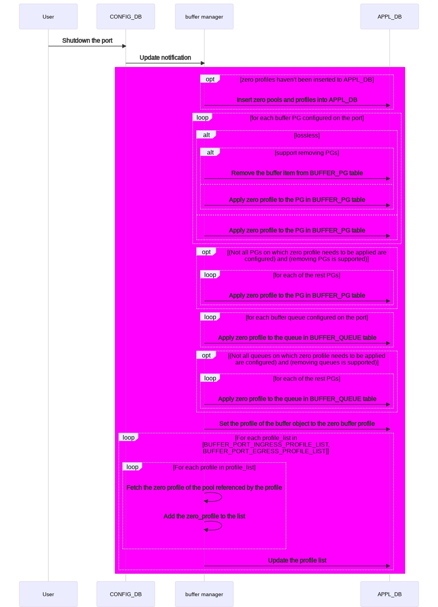

# Reclaim reserved buffer #

## 1 Table of Content ###

### 1.1 Revision ###

## 2 Scope ##

This section describes the scope of this high-level design document in SONiC.

## 3 Definitions/Abbreviations ##

This section covers the abbreviation if any, used in this high-level design document and its definitions.

## 4 Overview ##

Shared buffer is used to absorb traffic when a switch is under congestion. The larger the buffer, the better the performance in terms of congestion handling.

On Mellanox platforms, buffers are reserved for each port, PG and queue. The size of shared buffer pool is equal to the total memory minus the accumulative reserved buffers. So we would like to reduce the reserved buffer as many as possible. One way to do that is to reclaim the buffers reserved for admin down ports.

There are some admin down ports in user's scenario. There should not be any buffer reserved for admin down ports but currently there are by default.

The purpose of this document is to provide a way to reclaim the buffer reserved for admin down ports and then increase the shared buffer pool size.

## 5 Requirements ##

The requirement is to reclaim the reserved buffer for admin down ports, including:

- Buffer reserved SONiC configuration
  - BUFFER_PG
  - BUFFER_QUEUE
  - BUFFER_PORT_INGRESS_PROFILE_LIST / BUFFER_PORT_EGRESS_PROFILE_LIST

## 6 Architecture Design ##

### 6.1 The way to set reserved buffer to zero ###

Currently, the reserved size of a buffer object is set to zero when it is removed from `BUFFER_PG` or `BUFFER_QUEUE` table. A way to reclaim buffer is

- SONiC to remove objects of admin-down ports from `BUFFER_PG` and `BUFFER_QUEUE` tables
- SAI to set reserved size of buffer objects to zero on removing them.

However, this creates inconsistency. Consider the following scenarios:

1. System starting flow. SAI will not touch buffer objects if there is no buffer related configuration applied from SONiC, leaving them as the SDK default value. As a result, for any buffer object,
   - There is no buffer configuration in SONiC
   - The reserved buffer size in the ASIC is the SDK default value, some of which are not zero
2. System started, an existing buffer object is removed. SONiC notifies SAI by setting profile to `SAI_NULL_OBJECT_ID`. SAI will set the reserved size of corresponding buffer object to zero. As a result, for the buffer object,
   - There is no buffer configuration in SONiC
   - The reserved buffer size in the ASIC is zero

For some of the buffer objects, the SDK default reserved size is not zero. This is to make sure the system works correctly without any buffer configuration in SONiC.
Now we have same SONiC configuration in 1 and 2 but different reserved buffer size in the ASIC.

To make it clear and consistent, we need the following solution:

- For lossless buffer priority groups, SONiC should remove them from SAI when the port is admin down.
- For other buffer objects:
  - Introduce a new type of buffer profiles - `zero profile`.
  - Apply the `zero profile` to the buffer objects in order to reclaim reserved buffer.
- What do the `zero profile`s look like:
  - For lossy priority groups:
    - Create a `zero pool` with static threshold mode and 0 as buffer pool size.
    - Create the `zero profile` with static threshold mode, and 0 for both `static_th` and `size`.
  - For queues and buffer port ingress/egress profile list:
    - Create a `zero profile` with dynamic threshold mode and 0 as `size`.
- When will the `zero profile`s be created:
  - In `traditional buffer model`:
    - `zero profile`s will be created if there are unused ports during deployment.
    - It's user's responsibility to create `zero profile` if he/she disables a port on-the-fly.
  - In `dynamic buffer model`:
    - `zero profile`s will be created once at least 1 unused port exists.
- SAI should configure buffer objects to:
  - SDK default value, if there is no buffer profile configured for the object in SONiC when SAI is starting.
  - SDK default value, if a buffer object is removed from SONiC
  - Zero, only if the object is configured with an `zero profile`

To achieve it the following steps will be taken:

1. A series of `zero_profile`s should be defined for ingress/egress and lossless/lossy traffic.
2. Currently, there is no buffer object configured on admin-down ports. The `zero_profile` should be configured explicitly on admin-down ports.
3. Database migrator is required to bridge the gap between the old and new system when a switch is upgraded.

This can be implemented on a per-vendor basis. For vendors with zero buffer profiles provided in buffer template, we will go this way. Otherwise, the reserved buffer will be reclaimed by removing corresponding buffer objects.

This is for both static and dynamic buffer model.

## 7 Static buffer model ##

In static buffer model, buffer manager is responsible for:

- Create a buffer profile entry in `CONFIG_DB.BUFFER_PROFILE` table when the `speed`, `cable length` tuple occurs for the first time

  The parameters, including `xon`, `xoff`, `size`, `threshold` are looked up from `pg_profile_lookup.ini` with `speed` and `cable length` as the key.
- Create a buffer priority-group entry in `CONFIG_DB.BUFFER_PG` table.

All other buffer related configuration will be provided by the user.

### 7.1 Deploy the buffer configuration for a switch ###

By default, the buffer configuration is applied during deployment of the switch. Buffer configuration will be applied on active ports only. A port with neighbor device defined in `minigraph` will be treated as an active port.

To deploy the switch, the related information should be provided by user in `minigraph`. The information related to buffer configuration includes:

- Device type which can be one of `ToRRouter`, `LeafRouter`, and `SpineRouter`.
- Speed of each active port
- Neighbor device of each active port
- Meta data of the neighbors of active ports, like `type`, which which can be one of `server`, `ToRRouter`, `LeafRouter`, and `SpineRouter`.

The system will generate necessary items and push them into `CONFIG_DB`, which effectively configures buffer for the active ports.

- `admin status` in `PORT` table
  - `up` for active ports
  - `down` for inactive ports
- `speed` in `PORT` table
- `cable length` in `CABLE_LENGTH` table
  - `40m` for ports connected between a `LeafRouter` and a `ToRRouter`
  - `300m` or `2000m` for ports connected between a `LeafRouter` and a `SpineRouter`
  - `5m` otherwise
- Determine switch's topology according to switch's device type:
  - `ToRRouter` - t0
  - `LeafRouter` - t1
- Create the following items by rendering `buffer template` according to `hwsku` and `topo`
  - Buffer pools in `BUFFER_POOL` table
    - `ingress_lossless_pool`
    - `ingress_lossy_pool`, only available in general SKU
    - `egress_lossless_pool`
    - `egress_lossy_pool`
  - Buffer profiles in `BUFFER_PROFILE` table
    - `ingress_lossless_profile`, for ingress lossless port buffer pool
    - `ingress_lossy_profile`, for ingress lossy port buffer pool and priority group
    - `egress_lossless_profile`, for egress lossless port buffer pool and queue
    - `egress_lossy_profile`, for egress lossy port buffer pool
    - `q_lossy_profile`, for egress lossy queue
  - Zero buffer profiles in `BUFFER_PROFILE` table
    - `ingress_lossless_zero_profile`, zero profile for ingress lossless traffic
    - `ingress_lossy_zero_profile`, zero profile for ingress lossy traffic
    - `egress_lossless_zero_profile`, zero profile for egress lossless traffic
    - `egress_lossy_zero_profile`, zero profile for egress lossy traffic
  - Buffer queue items in `BUFFER_QUEUE` table
  - Buffer priority group items in `BUFFER_PG` table
  - Buffer ingress and egress port profile list in `BUFFER_PORT_INGRESS_PROFILE_LIST` and `BUFFER_PORT_EGRESS_PROFILE_LIST` respectively.

#### 7.1.1 Buffer template update for zero buffer profiles ####

##### 7.1.1.1 Macro in buffer template to generate inactive ports #####

The inactive ports list is generated by the following buffer template.

These macros are defined in generic buffer template file `buffer_template.j2`.

The following snippet of code is to generate `PORT_INACTIVE` which contains all the inactive ports. Only `PORT_INACTIVE` is none empty will the zero buffer profiles be generated in vendor specific template.

They need to be moved from the middle of `buffer_template.j2` to the place just before the vendor specific templated is imported.

```json



     

    
        
    





    

    
        
            
        
            
        
    


{# Import default values from device HWSKU folder #}
{%- import 'buffers_defaults_%s.j2' % filename_postfix as defs with context %}
```

```json


    


```

```json

{{ defs.generate_zero_buffer_objects_for_inactive_ports(port_names_inactive) }}

```

##### 7.1.1.2 Macro in buffer template to generate buffer pool and profiles #####

Zero buffer profiles should be defined for ingress/egress and lossless/lossy traffic in the buffer template. To achieve that the macro `generate_buffer_pool_and_profiles` needs to be updated.

This macro is defined in vendor specific buffer template files.

```json

    "BUFFER_POOL": {

        "ingress_zero_pool" : {
          "mode": "static",
          "type": "ingress",
          "size": "0"
        },

        "ingress_lossless_pool": {
            
            "size": "{{ ingress_lossless_pool_size }}",
            
            "type": "ingress",
            "mode": "dynamic"
        },
        "ingress_lossy_pool": {
            
            "size": "{{ ingress_lossy_pool_size }}",
            
            "type": "ingress",
            "mode": "dynamic"
        },
        "egress_lossless_pool": {
            "size": "{{ egress_lossless_pool_size }}",
            "type": "egress",
            "mode": "dynamic"
        },
        "egress_lossy_pool": {
            
            "size": "{{ egress_lossy_pool_size }}",
            
            "type": "egress",
            "mode": "dynamic"
        }
    },
    "BUFFER_PROFILE": {

        "ingress_lossy_pg_zero_profile" : {
          "pool":"[BUFFER_POOL|ingress_zero_pool]",
          "size":"0",
          "static_th":"0"
        },
        "ingress_lossless_zero_profile" : {
          "pool":"[BUFFER_POOL|ingress_lossless_pool]",
          "size":"0",
          "dynamic_th":"-8"
        },
        "ingress_lossy_zero_profile" : {
          "pool":"[BUFFER_POOL|ingress_lossy_pool]",
          "size":"0",
          "dynamic_th":"-8"
        },
        "egress_lossless_zero_profile" : {
          "pool":"[BUFFER_POOL|egress_lossless_pool]",
          "size":"0",
          "dynamic_th":"-8"
        },
        "egress_lossy_zero_profile" : {
          "pool":"[BUFFER_POOL|egress_lossy_pool]",
          "size":"0",
          "dynamic_ty":"-8"
        },

        "ingress_lossless_profile": {
            "pool":"[BUFFER_POOL|ingress_lossless_pool]",
            "size":"0",
            "dynamic_th":"7"
        },
        "ingress_lossy_profile": {
            "pool":"[BUFFER_POOL|ingress_lossy_pool]",
            "size":"0",
            "dynamic_th":"3"
        },
        "egress_lossless_profile": {
            "pool":"[BUFFER_POOL|egress_lossless_pool]",
            "size":"0",
            "dynamic_th":"7"
        },
        "egress_lossy_profile": {
            "pool":"[BUFFER_POOL|egress_lossy_pool]",
            "size":"9216",
            "dynamic_th":"7"
        },
        "q_lossy_profile": {
            "pool":"[BUFFER_POOL|egress_lossy_pool]",
            "size":"0",
            "dynamic_th":"3"
        }
    },

```

##### 7.1.1.3 Macro in buffer template to apply zero buffer profiles to inactive ports #####

The zero profiles should be configured explicitly on admin-down ports by the following buffer template. The `port_names` should be fed with the name list of all inactive ports.

These macros are defined in vendor specific buffer template files.

```json


    "BUFFER_PG": {

        "{{ port }}|0": {
            "profile" : "[BUFFER_PROFILE|ingress_lossy_pg_zero_profile]"
        },

    },

    "BUFFER_QUEUE": {

        "{{ port }}|3-4": {
            "profile" : "[BUFFER_PROFILE|egress_lossless_zero_profile]"
        },


        "{{ port }}|0-2": {
            "profile" : "[BUFFER_PROFILE|egress_lossy_zero_profile]"
        },


        "{{ port }}|5-6": {
            "profile" : "[BUFFER_PROFILE|egress_lossy_zero_profile]"
        },

    },

"BUFFER_PORT_INGRESS_PROFILE_LIST": {

        "{{ port }}": {
            "profile_list" : "[BUFFER_PROFILE|ingress_lossless_zero_profile],[BUFFER_PROFILE|ingress_lossy_zero_profile]"
        },


    },
    "BUFFER_PORT_EGRESS_PROFILE_LIST": {

        "{{ port }}": {
            "profile_list" : "[BUFFER_PROFILE|egress_lossless_zero_profile],[BUFFER_PROFILE|egress_lossy_zero_profile]"
        },


    }



```

Assume port `Ethernet0` is admin down, an example is:

```json
{
  "BUFFER_PG" : {
    "Ethernet0|0" : {
      "profile": "[BUFFER_PROFILE|ingress_lossy_zero_profile]"
    },
    "Ethernet0|3-4" : {
      "profile": "[BUFFER_PROFILE|ingress_lossless_zero_profile]"
    }
  },
  "BUFFER_QUEUE" : {
    "Ethernet0|0-2" : {
      "profile": "[BUFFER_PROFILE|egress_lossy_zero_profile]"
    },
    "Ethernet0|3-4" : {
      "profile": "[BUFFER_PROFILE|egress_lossless_zero_profile]"
    },
    "Ethernet0|5-6" : {
      "profile": "[BUFFER_PROFILE|egress_lossy_zero_profile]"
    }
  },
  "BUFFER_PORT_INGRESS_PROFILE_LIST" : {
    "Ethernet0" : {
      "profile_list" : "[BUFFER_PROFILE|ingress_lossless_zero_profile],[BUFFER_PROFILE|ingress_lossy_zero_profile]"
    }
  },
  "BUFFER_PORT_EGRESS_PROFILE_LIST" : {
    "Ethernet0" : {
      "profile_list" : "[BUFFER_PROFILE|egress_lossless_zero_profile],[BUFFER_PROFILE|egress_lossy_zero_profile]"
    }
  }
}
```

#### 7.1.2 The flow to deploy a switch ####

In the flow, the steps in pink are needed to be implemented.

- INACTIVE_PORT set needs to be generated. Currently, only ACTIVE_PORT set is generated.
- Zero profiles need to be generated if the INACTIVE_PORT set is not empty.
- Zero profiles need to be applied to inactive ports.

All other steps exist.


#### 7.1.3 The flow to handle `speed`, `cable length` and `admin status` of the port ####

In the flow, buffer manager testing port's admin status and skipping the rest part if it's admin-down, which is the green area in the flow chart, needs to be implemented.

All other steps exist.


#### 7.1.4 The flow to handle `BUFFER_QUEUE` table add entry ####

This is an existing flow. No code change is required.


#### 7.1.5 The flow to handle `BUFFER_PORT_INGRESS_PROFILE_LIST`, and `BUFFER_PORT_EGRESS_PROFILE_LIST` table add entry ####

This is an existing flow. No code change is required.


### 7.2 Enable a port and configure buffer for it ###

The following buffer profiles should be created before enabling a port and configuring buffer for it. By default, they are defined in `buffer template` and will be applied when the `minigraph` is reloaded.

- `ingress_lossless_profile`
- `ingress_lossy_profile`
- `egress_lossless_profile`
- `egress_lossy_profile`
- `q_lossy_profile`

The following items need to be configured to enable a port and configure buffer for it. By default, they are defined in `buffer template` or `minigraph` and will be applied when the the `minigraph` is reloaded.

In case the user wants to re-enable a disabled port, he needs to configure the following items manually.

- Set `admin status` to `up` for the port by executing command `config interface startup <port>`.
- Add following entries in the corresponding buffer table for the port.
  
  Currently there is not any commands or other UI that user can use to add the following items. So the only way for a user to configure them is to compose a json file containing all the items and then to execute `sonic-cfggen -j <json-file-name> --write-to-db`. We will give an example of each items.
  - PG 0 in `CONFIG_DB.BUFFER_PG` table as a lossy priority group with `BUFFER_PROFILE|ingress_lossy_profile` as the `profile`

    An example of PG items for port `Ethernet0`:

    ```json
    {
        "BUFFER_PG": {
            "Ethernet0|0": {
                "profile": "[BUFFER_PROFILE|ingress_lossy_profile]"
            }
        }
    }
    ```

  - Queues `0-2`, `5-6` in `CONFIG_DB.BUFFER_QUEUE` as lossy queues with `BUFFER_PROFILE|q_lossy_profile` as the `profile`
  - Queues `3-4` in `CONFIG_DB.BUFFER_QUEUE` as lossless queues with `BUFFER_PROFILE|egress_lossless_profile` as the `profile`

    An example of queue items for port `Ethernet0`:

    ```json
    {
        "BUFFER_QUEUE": {
            "Ethernet0|0-2": {
                "profile": "[BUFFER_PROFILE|q_lossy_profile]"
            },
            "Ethernet0|3-4": {
                "profile": "[BUFFER_PROFILE|egress_lossless_profile]"
            },
            "Ethernet0|5-6": {
                "profile": "[BUFFER_PROFILE|q_lossy_profile]"
            }
        }
    }
    ```

  - An item in `CONFIG_DB.BUFFER_PORT_INGRESS_PROFILE_LIST` table with the following profiles in the `profile_list`
    - `BUFFER_PROFILE|ingress_lossless_profile` for `ingress_lossless_pool`
    - `BUFFER_PROFILE|ingress_lossy_profile` for `ingress_lossy_pool` if the pool exists

    An example of ingress profile list item for port `Ethernet0` for single ingress pool mode:

    ```json
    {
        "BUFFER_PORT_INGRESS_PROFILE_LIST": {
            "Ethernet0": {
                "profile_list": "[BUFFER_PROFILE|ingress_lossless_profile]"
            }
        }
    }
    ```

  - An item in `CONFIG_DB.BUFFER_PORT_EGRESS_PROFILE_LIST` table with the following profiles in the `profile_list`
    - `BUFFER_PROFILE|egress_lossless_profile` for `egress_lossless_pool`
    - `BUFFER_PROFILE|egress_lossy_profile` for `egress_lossy_pool`

    An example of egress profile list item for port `Ethernet0`:

    ```json
    {
        "BUFFER_PORT_EGRESS_PROFILE_LIST": {
            "Ethernet0": {
                "profile_list": "[BUFFER_PROFILE|egress_lossless_profile],[BUFFER_PROFILE|egress_lossy_profile]"
            }
        }
    }
    ```

- Recalculate the sizes of shared buffer pool and shared headroom pool and configure them.

After the flow has been successfully executed:

- A lossless profile with name convention `pg_lossless_<speed>_<cable-length>_profile` will be created and inserted into `BUFFER_PROFILE` table.
- The priority group `3-4` will be created and inserted into `BUFFER_PG` table, referencing the buffer profile.
- Priority group `3` and `4` is enabled with corresponding headroom parameters (`headroom size`, `xon`, `xoff`) and alpha on the port.
- Priority group `0` is enabled with pipeline latency as `headroom size`.
- Reserved sizes and alpha of queue and port ingress/egress buffer pool are set according to the buffer profile referenced by the corresponding buffer tables.
- Sizes of shared buffer pool and shared headroom pool are set according to configuration.

The flows are the same as those of deploy a switch.

### 7.3 Disable a port and reclaim the buffer reserved for the port after a switch was deployed ###

The user needs to:

- Set the admin status of the port to `down` via executing command `config interface shutdown <port>`.
- Remove the lossless PG of the port from `CONFIG_DB` and set the following entries to `zero profile`. By default, they are enforced by `buffer template`.

  In case the user enabled a port and then decides to disable it, the following entries are in the system and the user has to remove them manually.

  There is no way for a user to remove items from the `CONFIG_DB` on the fly. So the only way for a user to do it is to remove the items from `config_db.json` and then to execute `config reload`. Examples of items in each of the following tables are provided in the previous chapter.

  Items need to be set to `zero profile`:
  - entries of admin-down ports in table `BUFFER_QUEUE`, `BUFFER_PORT_INGRESS_PROFILE_LIST` and `BUFFER_PORT_EGRESS_PROFILE_LIST`
  - lossy priority-groups of admin-down ports in table `BUFFER_PG`
- Calculate the sizes of shared buffer pool and shared headroom pool and then reconfigure them in `BUFFER_POOL` table in `CONFIG_DB`.

After the flow has been successfully executed:

- The entry of lossless priority-group `3-4` of the port is removed from `BUFFER_PG` table in `CONFIG_DB`
- Reserved size and headroom size of port's priority group `0`, `3` and `4` are zero.
- Reserved size of queues and port buffer pools of the port are zero.
- Sizes of shared buffer pool and shared headroom pool are updated accordingly.

The flows of this are the same as those of deploy a switch.

### 7.4 Summary: flows need to be implemented to support reclaiming reserved buffer of admin down ports ###

According to the flows described in above sections, the following flows need to be implemented:

1. Buffer template to generate zero buffer profiles and apply them if there are inactive ports.
2. Buffer manager to test port's admin status before creating lossless priority group for the port.
3. Buffer manager to remove port's lossless priority group once the port's admin status is changed to down.
4. Buffer orch to handle `BUFFER_PG` removing.
5. Buffer orch to configure zero buffer profile in `BUFFER_PORT_INGRESS_PROFILE_LIST` and `BUFFER_PORT_EGRESS_PROFILE_LIST`.

## 8 Dynamic buffer model ##

Currently, when a port is shut down, the buffer reserved for admin-down ports is reclaimed by removing the objects from `APPL_DB` in dynamic buffer model:

1. `buffer manager` removes the item related to the port from buffer tables from `APPL_DB`
2. `buffer orch` notifies SAI to remove object
3. `SAI` set reserved sizes to zero.


 Now that we have new way to do it, reserved buffer will be reclaimed by:

- removing lossless PG.
- setting zero profile to corresponding buffer objects.

The new flow is like this.



## 9 SAI API ##

### 9.1 Reclaim priority groups ###

The SAI API `sai_buffer_api->set_ingress_priority_group_attribute` is used for reclaiming reservied buffer for priority groups. The arguments should be the following:

```C
    attr.id = SAI_INGRESS_PRIORITY_GROUP_ATTR_BUFFER_PROFILE;
    attr.value.oid = OID of zero buffer profile on ingress;
    sai_buffer_api->set_ingress_priority_group_attribute(pg_id, &attr); // pg_id is the SAI object ID of the priority group
```

After this SAI API called, the reserved buffer of the priority group indicated by pg_id will be set to zero.

### 9.2 Reclaim queues ###

The SAI API `sai_queue_api->set_queue_attribute` is used for reclaiming reservied buffer for queues. The arguments should be the following:

```C
    attr.id = SAI_QUEUE_ATTR_BUFFER_PROFILE_ID;
    attr.value.oid = OID of zero buffer profile on egress;
    sai_queue_api->set_queue_attribute(queue_id, &attr); // queue_id is the SAI object ID of the queue
```

After this SAI API called, the reserved buffer of the queue indicated by pg_id will be set to zero.

### 9.3 Reclaim port reserved buffers ###

The SAI API `sai_port_api->set_port_attribute` is used for reclaiming reserved buffer for port buffer pools. The arguments should be the following:

```C
    // Reclaim reserved buffer on ingress side
    attr.id = SAI_PORT_ATTR_QOS_INGRESS_BUFFER_PROFILE_LIST
    attr.value.objlist.list = [OID of zero profile for each ingress pool]
    attr.value.objlist.count = 2;
    sai_port_api->set_port_attribute(port.m_port_id, &attr);

    // Reclaim reserved buffer on egress side
    attr.id = SAI_PORT_ATTR_QOS_EGRESS_BUFFER_PROFILE_LIST
    attr.value.objlist.list = [OID of zero profile for each egress pool]
    attr.value.objlist.count = 2;
    sai_port_api->set_port_attribute(port.m_port_id, &attr);
```

## 10 Configuration and management ##

N/A

### 10.1 CLI/YANG model Enhancements ###

N/A

### 10.2 Config DB Enhancements ###

N/A

## 11 Warmboot and Fastboot Design Impact ##

No impact on warm/fast boot.

## 12 Restrictions/Limitations ##

N/A

## 13 Testing Requirements/Design ##

### 13.1 Unit Test cases ###

#### 13.1.1 Shutdown / startup a port ####

Lossless PGs should be removed when a port is shutdown.

1. Choose an admin-up port to test
2. Shutdown the port
3. Check whether the lossless PGs have been removed from the `CONFIG_DB` and `ASIC_DB`
4. Startup the port
5. Check whether the lossless PGs have been readded to the `CONFIG_DB` and `ASIC_DB`

### 13.2 System Test cases ###

#### 13.2.1 Shutdown / startup a port ####

Lossless PGs should be removed when a port is shutdown. Sizes of shared headroom pool and shared buffer pool should be adjusted accordingly.

1. Choose a port which is admin up to test
2. Shutdown the port
3. Check whether the lossless PGs have been removed from the `CONFIG_DB` and `ASIC_DB`
4. Adjust the sizes of shared headroom pool and shared buffer pool
5. Check whether the adjusted sizes are correct
6. Startup the port
7. Check whether the lossless PGs have been readded to the `CONFIG_DB` and `ASIC_DB`
8. Adjust the sizes of shared headroom pool and shared buffer pool
9. Check whether the adjusted sizes are correct

## 14 Open/Action items - if any ##
