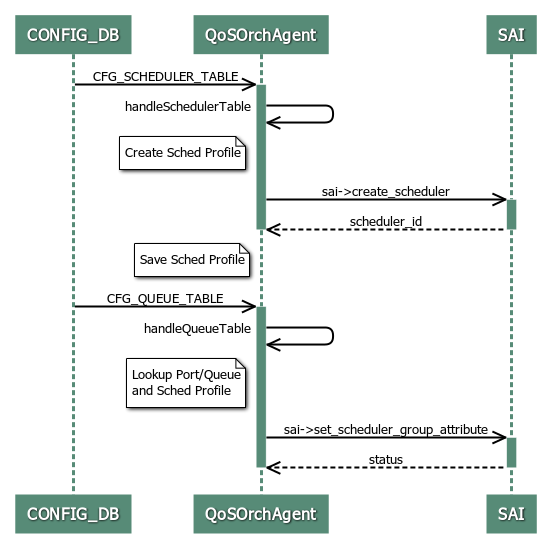
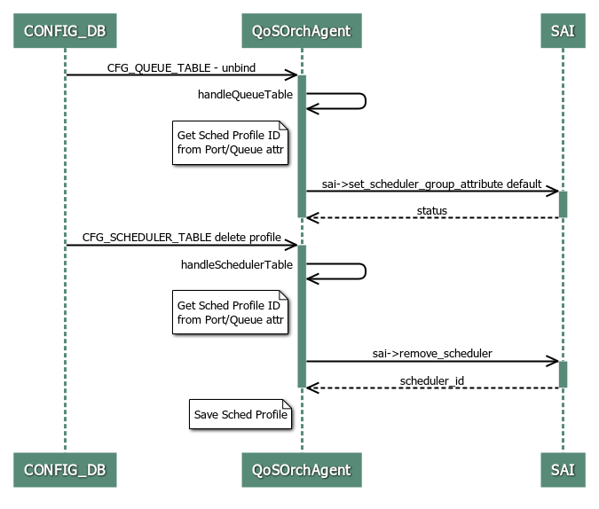

# SONiC QoS Scheduler and Shaping
# High Level Design Document
#### Rev 0.1


# Table of Contents
  * [List of Tables](#list-of-tables)
  * [Revision](#revision)
  * [About This Manual](#about-this-manual)
  * [Scope](#scope)
  * [Definition/Abbreviation](#definitionabbreviation)
  * [1 Feature Overview](#1-feature-overview)
     * [1.1 Requirements](#11-requirements)
        *  [1.1.1 Functional Requirements](#111-functional-requirements)
        *  [1.1.2 Configuration and Management Requirements](#112-configuration-and-management-requirements)
        *  [1.1.3 Scalability Requirements](#113-scalability-requirements)
        *  [1.1.4 Warm Boot Requirements](#114-warm-boot-requirements)
      *  [1.2 Design Overview](#12-design-overview)
          * [1.2.1 Basic Approach](#121-basic-approach)
          * [1.2.2 Container](#122-container)
          * [1.2.3 SAI Overview](#123-sai-overview)
  * [2 Functionality](#2-functionality)
      * [2.1 Target Deployment Use Cases](#21-target-deployment-use-cases)
      * [2.2 Functional Description](#22-functional-description)
      * [2.3 Limitations](#23-limitations)
  * [3 Design](#3-design)
      * [3.1 Overview](#31-overview)
      * [3.2 DB Changes](#32-db-changes)
          * [3.2.1 CONFIG_DB](#321-config_db)
          * [3.2.2 APP_DB](#322-app_db)
          * [3.2.3 STATE_DB](#323-state_db)
          * [3.2.4 ASIC_DB](#324-asic_db)
          * [3.2.5 COUNTER_DB](#325-counter_db)
      * [3.3 Switch State Service Design](#33-switch-state-service-design)
          * [3.3.1 QoSOrch changes](#331-qosorch-changes)
      * [3.4 SAI](#34-sai)
      * [3.5 CLI](#35-cli)
          * [3.5.1 Data Models](#351-data-models)
          * [3.5.2 Configuration Commands](#352-configuration-commands)
          * [3.5.3 Show Commands](#353-show-commands)
          * [3.5.4 Clear Commands](#354-clear-commands)
          * [3.5.5 Debug Commands](#355-debug-commands)
          * [3.5.6 Rest API Support](#356-rest-api-support)
          * [3.5.7 Example Configuration](#357-example-configuration)          
  * [4 Flow Diagrams](#4-flow-diagrams)
      * [4.1 Set Shaper on Queue](#41-set-shaper-on-queue)
      * [4.2 Remove Shaper from Queue](#42-remove-shaper-from-queue)
  * [5 Error Handling](#5-error-handling)
  * [6 Serviceability and Debug](#6-serviceability-and-debug)
  * [7 Warm Boot Support](#7-warm-boot-support)
  * [8 Scalability](#8-scalability)
  * [9 Unit Test](#9-unit-test) 
     * [9.1 Config Test Cases](#91-config-test-cases)
     * [9.2 Functional Test Cases](#92-functional-test-cases)
     * [9.3 Scaling Test Cases](#93-scaling-test-cases)
     * [9.4 Warm Boot Test Cases](#94-warm-boot-test-cases)
     * [9.5 Negative Test Cases](#95-negative-test-cases)


# List of Tables
[Table 1: Abbreviations](#table-1-abbreviations)

[Table 2: QoS Scheduling SAI attributes](#table-2-qos-scheduling-sai-attributes)

[Table 3: QoS Shaping SAI attributes](#table-3-qos-shaping-sai-attributes)

# Revision
| Rev |     Date    |          Authors             | Change Description                |
|:---:|:-----------:|:----------------------------:|-----------------------------------|
| 0.1 | 10/16/2019  |  Michael Li, Aravindu Maneti | Initial version                   |


# About this Manual
This document provides general information about QoS Scheduling and Shaping features implementation in SONiC.
# Scope
This document describes the functionality and high level design of the QoS Scheduling and Shaping features for front panel ports in SONiC.  Support for different scheduling disciplines already exists in SONiC. Adding port and queue shaping support to SONiC is the main scope of this document.

# Definition/Abbreviation
### Table 1: Abbreviations
| Term   | Meaning                                                |
|--------|--------------------------------------------------------|
| QoS    | Quality of Service                                     |
| SP     | Strict Priority                                        |
| WRR    | Weighted Round Robin                                   |
| DWRR   | Deficit Weighted Round Robin                           |


# 1 Feature Overview
Quality of Service (QoS) scheduling and shaping features enable better service to certain traffic flows. 

Queue scheduling provides preferential treatment of traffic classes mapped to specific egress queues. SONiC supports SP, WRR, and DWRR scheduling disciplines.
* SP - Higher priority egress queues get scheduled for transmission over lower priority queues.
* WRR - Egress queues receive bandwidth proportional to the configured weight. The scheduling granularity is per packet which causes large and small packets to be treated the same. Flows with large packets have an advantage over flows with smaller packets.
* DWRR - Similar to WRR but uses deficit counter scheduling granularity to account for packet size variations and provide a more accurate proportion of bandwidth.

Queue shaping provides control of minimum and maximum bandwidth requirements per egress queue for more effective bandwidth utilization. Egress queues that exceed an average transmission rate beyond the shaper max bandwidth will stop being serviced.  Additional ingress traffic will continue to be stored on the egress queue until the queue size is exceeded which results in tail drop. 

When port bandwidth is available (port bandwidth usage drops below configured max bandwidth limit), the queues will be serviced for transmission according to the scheduling scheme between queues in their respective bandwidth consumption group:

* MinNotMet - Queues that have not yet met their minimum bandwidth.  These queues will be serviced first according to the configured scheduling discipline.
* MaxNotMet – Queues that have satisfied the minimum bandwidth but have not yet met the maximum bandwidth.  After all MinNotMet queues are satisfied, these queues will be scheduled according to the configured scheduling discipline.
* MaxExceeded - Queues that have exceeded their max bandwidth.  These queues are not serviced.

Port shaping provides control of the maximum bandwidth allocated to the port. There is no minimum bandwidth guarantee for port shaping.

## 1.1 Requirements

### 1.1.1 Functional Requirements
 1. Support configuration of SP, WRR, or DWRR scheduling disciplines on each egress queue.
 2. Support configuration of min and max shaping rate and burst size on each egress queues.
 3. Support configuration of max shaping rate and burst size on each physical port.

### 1.1.2 Configuration and Management Requirements
This feature will only support configuration using SONiC CONFIG_DB in this release. The scheduler config can be applied incrementally to the CONFIG_DB using the "config load" CLI.

### 1.1.3 Scalability Requirements
Queue scheduling and shaping configuration can be applied to any front panel port egress queue.

Max shaping configuration can be applied to any front panel port.

### 1.1.4 Warm Boot Requirements
Scheduling and shaping functionalities continue to work across warm reboot. 

- To support planned system warm boot.
- To support SWSS docker warm boot.


## 1.2 Design Overview


### 1.2.1 Basic Approach
The QoS Orchestration agent is used for handling QoS scheduling and shaping configuration.  The scheduler object is defined as a profile to control several scheduling attributes such as:
- scheduling type (SP, WRR, DWRR)
- scheduling weight
- shaper min/max bandwidth rate

Scheduler APIs include create/remove scheduler profiles and set/get scheduler attributes.  A scheduler profile can be mapped to a queue or a port.

### 1.2.2 Container
No new containers are introduced. Functionality is added to the existing SWSS container. 

### 1.2.3 SAI Overview
The existing SAI scheduler, queue and port APIs shall be used to support this feature and they are available on SAI github:

https://github.com/opencomputeproject/SAI/blob/master/inc/saischeduler.h<br>
https://github.com/opencomputeproject/SAI/blob/master/inc/saiqueue.h<br>
https://github.com/opencomputeproject/SAI/blob/master/inc/saiport.h<br>


The details of the changes will be discussed in the design section below.


# 2 Functionality
Refer to section 1
## 2.1 Target Deployment Use Cases
Any network that requires differentiation of traffic types and services by managing bandwidth resources.  The typical use case is for protection of real-time and high priority data.

Data centers use traffic shaping to maintain service level agreements for the variety of applications and the many tenants hosted on a shared physical network.


## 2.2 Functional Description
Refer to section 1.1

## 2.3 Limitations
QoS scheduling and shaping 
- Configuration is only supported on physical interfaces and physical interface egress queues.
- Configuration is not supported on VLAN and port-channel interfaces.

# 3 Design
## 3.1 Overview
The design overview at a high level:

### 3.1.1 Creating a Scheduler Profile
1) QoS scheduler and shaper configuration profiles are parsed from the JSON file and stored in CFG_SCHEDULER_TABLE in the configuration database.
2) The QoS Orchestration Agent subscribes to notifications from the CFG_SCHEDULER_TABLE and parses the input parameters (scheduling type, weight, min/max bandwidth rate) of the scheduler profile.
3) create_scheduler SAI API is invoked to create a scheduler profile with the given input parameters. 
4) The scheduler ID returned from the SAI create_scheduler API is associated with the scheduler profile and the profile data.

### 3.1.2 Applying the Scheduler Profile to Queues

1) The QoS Scheduler can be applied to a queue (or set of queues) by setting the QoS scheduler profile name to the scheduler attribute of the queue (or queue range) of an interface in the CFG_QUEUE_TABLE.  
2) The scheduler ID is retrieved from the scheduler profile name and is passed to set_scheduler_group_attribute SAI API to set the scheduler attributes on the queues of a specific interface.


### 3.1.3 Applying the Scheduler Profile to Ports

1) The QoS Scheduler (shaper attributes) can be applied to a port by setting the QoS scheduler profile name to the scheduler attribute of an interface (or set of interfaces) in the CFG_PORT_QOS_MAP_TABLE.  
2) The scheduler ID is retrieved from the scheduler profile name and is passed to set_port_attribute SAI API to set the shaper max bandwidth and burst rate attributes on the interface.

## 3.2 DB Changes
This section describes the changes made to different DBs for supporting QoS scheduler and shaper feature.


### 3.2.1 CONFIG_DB
The CFG_SCHEDULER_TABLE holds the configuration database for the purpose of storing scheduling and shaping configuration parameters. This table is filled by the management framework. 
#### CFG_SCHEDULER_TABLE

    ; QOS scheduler profile attributes
    ; SAI mapping - saischeduler.h
    key       = "SCHEDULER":name

    ; field = value
    type       = "DWRR"/"WRR"/"STRICT"
    weight     = 2*DIGIT
    priority   = 1*DIGIT
    meter_type = "packets"/"bytes" 
    cir        = 1*11 DIGIT  ; guaranteed rate in pps or bytes/sec
    cbs        = 1*11 DIGIT  ; guaranteed burst size in packets or bytes
    pir        = 1*11 DIGIT  ; max rate in pps or bytes/sec
    pbs        = 1*11 DIGIT  ; max burst size in packets or bytes
         
#### CFG_QUEUE_TABLE

    ; QUEUE table. Defines port queue.
    ; SAI mapping - port queue.

    key             = "QUEUE_TABLE:"port_name":queue_index
    queue_index     = 1*DIGIT
    port_name       = ifName
    queue_reference = ref_hash_key_reference

    ;field          = value
    scheduler       = ref_hash_key_reference; reference to scheduler key
   
    Example:
    127.0.0.1:6379> hgetall QUEUE_TABLE:ETHERNET4:1
    1) "scheduler"
    2) "[SCHEDULER:scheduler.wrr]"

#### CFG_PORT_QOS_MAP_TABLE

    ; PORT_QOS_MAP table. Defines port qos mapping.
    ; SAI mapping - port queue.

    key             = PORT_TABLE:ifname

    ;field          = value
    scheduler       = ref_hash_key_reference; reference to scheduler key

    Example:
    127.0.0.1:6379> hgetall PORT_QOS_MAP:ETHERNET4
    1) "scheduler"
    2) "[SCHEDULER:scheduler.wrr]"

### 3.2.2 APP_DB
No tables are introduced in APP_DB
### 3.2.3 STATE_DB
No tables are introduced in STATE_DB. 

### 3.2.4 ASIC_DB
No changes are introduced in ASIC_DB. 
### 3.2.5 COUNTER_DB
No changes are introduced in COUNTER_DB. 

See the "show queue counter" in the CLI section on the usage of drop counters to monitor queue tail drops caused by scheduling and shaping.

## 3.3 Switch State Service Design
### 3.3.1 QoSOrch changes 
QoS Orchestration agent is responsible for the following activities:
   - Subscribes to notifications on CFG_SCHEDULER_TABLE, CFG_QUEUE_TABLE, and CFG_PORT_QOS_MAP_TABLE entries in the CONFIG_DB. 
   - Creates a scheduler profile based on CFG_SCHEDULER_TABLE parameters
   - Associates the scheduler profile to queues based on CFG_QUEUE_TABLE attributes or to ports based on CFG_PORT_QOS_MAP_TABLE attributes.
   - Populates the queue or port attributes SAI structures and pushes the entry to ASIC_DB. 


## 3.4 SAI
QoS Scheduling and Shaping SAI APIs are already defined. The table below represents the SAI attributes which shall be used for QoS Scheduling and Shaping.


###### Table 2: QoS Scheduling SAI attributes
| QoS component            | SAI attributes                                         |                 
|--------------------------|--------------------------------------------------------|
| Scheduler type           | SAI_SCHEDULER_ATTR_SCHEDULING_TYPE                     |
| Scheduler weight         | SAI_SCHEDULER_ATTR_SCHEDULING_WEIGHT                   |
| Scheduler meter type     | SAI_SCHEDULER_ATTR_METER_TYPE                          |
| Queue scheduler          | SAI_SCHEDULER_GROUP_ATTR_SCHEDULER_PROFILE_ID          |


###### Table 3: QoS Shaping SAI attributes
| QoS component              | SAI attributes                                         |                 
|----------------------------|--------------------------------------------------------|      
| Shaper min bandwidth       | SAI_SCHEDULER_ATTR_MIN_BANDWIDTH_RATE                  |
| Shaper min bandwidth burst | SAI_SCHEDULER_ATTR_MIN_BANDWIDTH_BURST_RATE            |
| Shaper max bandwidth       | SAI_SCHEDULER_ATTR_MAX_BANDWIDTH_RATE                  |
| Shaper max bandwidth burst | SAI_SCHEDULER_ATTR_MAX_BANDWIDTH_BURST_RATE            |
| Queue shaper               | SAI_SCHEDULER_GROUP_ATTR_SCHEDULER_PROFILE_ID          |
| Port Shaper                | SAI_PORT_ATTR_QOS_SCHEDULER_PROFILE_ID                 |

The QoS Scheduling feature can be enabled on a physical port egress queues.  The QoS Shaping feature can be enabled on physical port egress queues and on a physical port (max shaper only). 

The **create_scheduler** SAI API is used to create the scheduler profile based on the parameters listed in Table 2 and 3.
   - Scheduler type - Can be SP, WRR, or DWRR. Default is WRR. (Broadcom platforms set queue 7 as SP by default).
   - Scheduler weight - Ranges from 1-100.  Default weight is 1.
   - Scheduler meter type - Can be packets or bytes. Default is bytes since shaper rates are typically expressed as a bitrate.
   - Shaper min/max bandwidth - can be bytes/sec or PPS.  Bytes/sec will be used when configuring using CONFIG_DB objects.  Future CLI/manageability will use kbps unit that is converted to bytes/sec for the SAI attribute. Defaults are 0 for min bandwidth and port speed formax bandwidth.
   - Shaper min/max bandwidth burst - can be bytes or packets. Default is 0 bytes min burst, 0 bytes max burst (no burst limit).

The **set_scheduler_group_attribute** SAI API is used to apply the scheduler profile on a physical port egress queue.
   - Queue sched/shaper - Applies the shaper profile created by create_scheduler to the physical port egress queue.  The min bandwidth attribute is optional and is set to 0 by default.  The min/max burst attributes are optional.

The **set_port_attribute** SAI API is used to apply the QoS shaper max bandwidth on a physical port. 
   - Port shaper - Applies the shaper profile created by create_scheduler to the physical port. The max burst attribute is optional.  min bandwidth and burst attributes will be ignored per SAI spec.


## 3.5 CLI
No CLI will be introduced for this feature for this release. Existing queue counter CLIs can be used to monitor shaping function.
### 3.5.1 Data Models
Future manageability enhancements can make use of the existing QoS OpenConfig yang model here:

https://github.com/openconfig/public/blob/master/release/models/qos/openconfig-qos-elements.yang

### 3.5.2 Configuration Commands
"config load" CLI is used to load a JSON file with scheduler objects into CONFIG_DB.
### 3.5.3 Show Commands
No new show commands will be introduced. Existing queue counter CLIs below can be used for monitoring shaping function.

**show queue counters**

This command can be used to monitor queue scheduling, average shape rate (get stats multiple times between some time interval), and tail drops when sending traffic above the max shape rate.

- Usage:
  show queue counters [-c or --clear] [interface \<interface_name\>]

- Example:
```
admin@sonic:~$ show queue counters Ethernet0
         Port    TxQ    Counter/pkts    Counter/bytes    Drop/pkts    Drop/bytes
    ---------  -----  --------------  ---------------  -----------  ------------
    Ethernet0    UC0               0                0            0             0
    Ethernet0    UC1               0                0            0             0
    Ethernet0    UC2               0                0            0             0
    Ethernet0    UC3               0                0            0             0
    Ethernet0    UC4               0                0            0             0
    Ethernet0    UC5               0                0            0             0
    Ethernet0    UC6               0                0            0             0
    Ethernet0    UC7               0                0            0             0
    Ethernet0    UC8               0                0            0             0
    Ethernet0    UC9               0                0            0             0
    Ethernet0    MC0               0                0            0             0
    Ethernet0    MC1               0                0            0             0
    Ethernet0    MC2               0                0            0             0
    Ethernet0    MC3               0                0            0             0
    Ethernet0    MC4               0                0            0             0
    Ethernet0    MC5               0                0            0             0
    Ethernet0    MC6               0                0            0             0
    Ethernet0    MC7               0                0            0             0
    Ethernet0    MC8               0                0            0             0
    Ethernet0    MC9               0                0            0             0
```  

###  3.5.4 Clear Commands
"config qos clear" CLI is used to clear all QoS configurations including QoS scheduler and shaper configs
### 3.5.5 Debug Commands
Not applicable
### 3.5.6 REST API Support
Not applicable
### 3.5.7 Example Configuration 

#### CONFIG_DB objects for Queue shaper:
Port "Ethernet52" egress queues 0 through 5 will be limited to 10Gbps each (1.25 GB/sec) 
```
{
    "SCHEDULER": {
        "scheduler.queue": {
            "meter_type": "bytes",
            "pir": "1250000000",
            "pbs": "8192"
        }
    },
    "QUEUE": {
        "Ethernet52|0-5": {
            "scheduler": "[SCHEDULER|scheduler.queue]"
        }
    }
}
```
#### CONFIG_DB objects for Port shaper:
Port "Ethernet52"  will be limited to 8Gbps (1 GB/sec) 
```
{
    "SCHEDULER": {
        "scheduler.port": {
            "meter_type": "bytes",
            "pir": "1000000000",
            "pbs": "8192"
        }
    },
    "PORT_QOS_MAP": {
        "Ethernet52": {
            "scheduler": "[SCHEDULER|scheduler.port]"
        }
    }
}
```

# 4 Flow Diagrams
## 4.1 Set Shaper on Queue
__Figure 1: Set Queue Shaper__


## 4.2 Remove shaper from Queue
__Figure 2: Remove Shaper from Queue__


# 5 Error Handling
- Invalid config errors will be displayed via console and configuration will be rejected
- Internal processing errors within SwSS will be logged in syslog with ERROR level
- SAI interaction errors will be logged in syslog

# 6 Serviceability and Debug
Debug output will be captured as part of tech support.
- Internal processing errors within SwSS will be logged in syslog with ERROR level
- SAI interaction errors will be logged in syslog


# 7 Warm Boot Support
The QoS scheduler and shaper settings on queues and ports are retained across warmboot.


# 8 Scalability
QoS scheduling and shaping are applied on queues and ports. Testing would be done by setting scheduling and shaping parameters on all physical ports and all physical port egress queues.

The maximum number of QoS scheduling and shaping profiles is specific to the switch vendor's SAI support.

###### Table 3: Scaling limits
|Name                      |   Scaling value    |
|--------------------------|--------------------|
| Number of interfaces     | max physical ports |
| Number of queues         | max egress queues  |
| Number of sched profiles | 128                |

# 9 Unit Test
## 9.1 Config Test Cases

    1. Configure the creation of a scheduler profile with shaper parameters and check that it is updated in CONFIG_DB.
    2. Delete the scheduler profile with shaper parameters and check that it is updated in CONFIG_DB.
    3. Configure the application of a scheduler profile on a physical interface egress queue and check that it is updated in CONFIG_DB.
    4. Remove the application of a scheduler profile from a physical interface egress queue and check that it is updated in CONFIG_DB.
    5. Configure the application of a scheduler profile on a range of 8 physical interface egress queues and check that it is updated in CONFIG_DB.
    6. Remove the application of a scheduler profile from a range of 8 physical interface egress queues and check that it is updated in CONFIG_DB.
    7. Configure the application of a scheduler profile on a physical interface and check that it is updated in CONFIG_DB.
    8. Remove the application of the scheduler profile from a physical interface and check that it is updated in CONFIG_DB.
    9. Verify that the QoS scheduler and shaper configurations are correctly re-applied after cold reboot.

## 9.2 Functional Test Cases
    10. Verify that physical port traffic gets rate limited as per the shaping parameters.
    11. Verify that traffic enqueued on a specific queue gets rate limited as per the queue shaping parameters.
    12. Verify that other traffic streams are unaffected by the QoS shaping configuration.
    13. Verify that after removing the QoS scheduler profile configuration on an interface/queue, the traffic rate is no longer rate limited.
    14. Verify that traffic is rate-limited as per the updated value when user updates (remove/add) the existing QoS shaper configuration.
    15. With strict priority scheduling and 2 line rate streams at Prio 7 and Prio 0 congesting an egress port, verify the minimum shaper rate on queue 0 allows minimum bandwidth rate on the low priority queue.


## 9.3 Scaling Test Cases
    16. Configure max number of QoS scheduler profiles and check the failure on max+1
    17. Configure QoS shaper on all the physical interfaces egress queues on the system and check that shaping is performed on all queues.
    18. Configure QoS shaper on all the physical interfaces on the system and check that rate-limiting is performed on all interfaces. 

## 9.4 Warm Boot Test Cases
    19. Verify that QoS Shaping configurations are restored after warm boot. 
    20. Verify that QoS Shaping continues to work at the specific rate across warm boot. 
    21. Verify that QoS Shaping is only active on interfaces and queues that previously had QoS Shaping configurations before warm boot. 


## 9.5 Negative Test Cases
    22. Verify that QoS Shaping configuration errors out when applied on port-channel or VLAN interfaces. 
    23. Configure QoS shaping on interface without providing mandatory attributes and check that configuration is not accepted. 
    24. Verify that invalid parameter error is displayed when attribute values are out of range.


