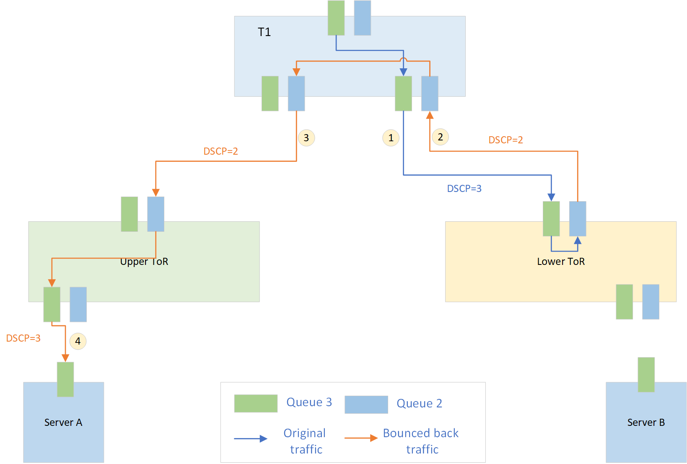

# DSCP remapping for tunnel traffic

## 1 Table of Content ###

- [Revision](#11-revision)
- [Scope](#2-scope)
- [Definitions/Abbreviations](#3-definitionsabbreviations)
- [Overview](#4-overview)
- [Design](#5-design)
    - [SWSS Schema](#51-swss-schema)
        - [Define new table for mapping](#511-define-new-table-for-mapping)
        - [Update existing TUNNEL table](#512-update-existing-tunnel-table)
        - [Define new field for extra lossless queues](#513-define-new-field-for-extra-lossless-queues)
    - [SAI attribute](#52-sai-attribute)
    - [orchagent](#53-orchagent)
- [Test requirement](#6-test-requirement)
- [Open Questions](#7-open-questions)

### 1.1 Revision ###
| Rev |     Date    |       Author       | Change Description                |
|:---:|:-----------:|:------------------:|-----------------------------------|
| 0.1 | 4/14, 2022            | Bing Wang   | Initial version                   |
| 0.2 | 5/26, 2022 | Bing Wang  | Update port level TC_TO_PRIORITY qos map|


## 2 Scope ##

This document covers high level design of DSCP and TC remapping for tunnel traffic in SONiC.

## 3 Definitions/Abbreviations ##


| Term | Meaning |
|:--------:|:---------------------------------------------:|
| PFC | Priority-based Flow Control  |
| TC | Traffic class|
| DSCP| Differentiated Services Code Point |

## 4 Overview

In Dual-ToR scenario, PFC deadlock can happen if two servers are congested at same time and start sending PFC pause frames to both upper ToR and lower ToR. It is because the south bound traffic from T1 to standby ToR is bounced back to T1 via the same queue. Even when the block condition is resolved, the pause condition among T1 and both ToRs can stay forever and no traffic will go through.
<p align=center>

</p>

To avoid this scenario, the bounced-back traffic from standby ToR to T1 will be remapped into another queue. For example, the traffic flow is as below if we are going to remap traffic in queue 3 to queue 2.

<p align=center>

</p>

When congestion happens on server, the traffic flow of PFC pause frames is as below diagram.

<p align=center>

</p>
The current QoS map architecture allows for port-based selection of each QoS map. However, we are not able to override the port-based QoS map for tunnel traffic. 
This design proposes a method to remapping DSCP and TC for tunnel traffic. 


## 5 Design ##

### 5.1 SWSS Schema
#### 5.1.1 Define new table for mapping
Update [qos_config.j2](https://github.com/sonic-net/sonic-buildimage/blob/master/files/build_templates/qos_config.j2) to generate 4 tables for remapping. Currently, the remapping is required in `dual-tor` scenario. So the tables are rendered into `config_db` only when `DEVICE_METADATA['localhost']['subtype'] = 'DualToR`. 

Please be noted that below config is to remap traffic in queue 3 to queue 2, and traffic in queue 4 to queue 6.
Before remapping to queue 2 and 6, both queues are required to be cleared. Hence the current `DSCP_TO_TC_MAP|AZURE` in [qos_config.j2](https://github.com/sonic-net/sonic-buildimage/blob/master/files/build_templates/qos_config.j2) is required to be updated.
* Table for decap

    DSCP_TO_TC_MAP for mapping DSCP to TC

    ```json
    "DSCP_TO_TC_MAP": {
        "AZURE_TUNNEL": {
            "0" : "1",
            "1" : "1",
            "2" : "1",
            "3" : "3",
            "4" : "4",
            "5" : "1", // Original map "5" : "2"
            "6" : "1",
            "7" : "1",
            "8" : "0",
            "9" : "1",
            "10": "1",
            "11": "1",
            "12": "1",
            "13": "1",
            "14": "1",
            "15": "1",
            "16": "1",
            "17": "1",
            "18": "1",
            "19": "1",
            "20": "1",
            "21": "1",
            "22": "1",
            "23": "1",
            "24": "1",
            "25": "1",
            "26": "1",
            "27": "1",
            "28": "1",
            "29": "1",
            "30": "1",
            "31": "1",
            "32": "1",
            "33": "8", // Original map "33" : "1" 
            "34": "1",
            "35": "1",
            "36": "1",
            "37": "1",
            "38": "1",
            "39": "1",
            "40": "1",
            "41": "1",
            "42": "1",
            "43": "1",
            "44": "1",
            "45": "1",
            "46": "5",
            "47": "1",
            "48": "7", // Original map "48" : "6".
            "49": "1",
            "50": "1",
            "51": "1",
            "52": "1",
            "53": "1",
            "54": "1",
            "55": "1",
            "56": "1",
            "57": "1",
            "58": "1",
            "59": "1",
            "60": "1",
            "61": "1",
            "62": "1",
            "63": "1"
    }
    ```

    TC_TO_PRIORITY_GROUP_MAP for mappping TC to PG

    ```json
    "TC_TO_PRIORITY_GROUP_MAP": {
        "AZURE_TUNNEL": {
            "0": "0",
            "1": "0",
            "2": "0",
            "3": "2", // Original map "3" : "3"
            "4": "6", // Original map "4" : "4"
            "5": "0",
            "6": "0",
            "7": "0",  // Original map "7" : "7"
            "8": "0"   // TC 8 is mapped to PG 0
    }
    ```

    As the tunnel level `TC_TO_PRIORITY_GROUP_MAP` depends on the port level `TC_TO_PRIORITY_GROUP_MAP`, therefore, the `TC_TO_PRIORITY_GROUP_MAP` at port level is also updated.

    ```json
    "TC_TO_PRIORITY_GROUP_MAP": {
        "AZURE": {
            "0": "0",
            "1": "0",
            "2": "2", // Original map "2": "2"
            "3": "3", 
            "4": "4",
            "5": "0",
            "6": "6", // Original map "6": "0"
            "7": "7",
            "8": "0" // TC 8 is mapped to PG 0
        },
    }
    ```
    Since two lossy PGs (2 and 6) are added, the `qos_config.j2` template need to be improved to add lossy pg profile for `PG2` and `PG6`.
* Table for encap

    TC_TO_QUEUE_MAP for remapping queue

    ```json
    "TC_TO_QUEUE_MAP": {
        "AZURE_TUNNEL": {
            "0": "0",
            "1": "1",
            "2": "1", // Original map "2" : "2"
            "3": "2", // Original map "3" : "3"
            "4": "6", // Original map "4" : "4"
            "5": "5",
            "6": "1", // Original map "6" : "6"
            "7": "7",
            "8": "1", // TC 8 is mapped to Queue 1
    }
    ``` 

    TC_TO_DSCP_MAP for rewriting DSCP. This map is newly added.

    ```json
    "TC_TO_DSCP_MAP": {
        "AZURE_TUNNEL": {
            "0": "8",
            "1": "0",
            "2": "0",
            "3": "2",
            "4": "6",
            "5": "46",
            "6": "0",
            "7": "48",
            "8": "33" // Map TC 8 to 33 to preserve the DSCP value
    }
    ```

    To support the new table, a new YANG model `sonic-tc-dscp.yang` is required 
#### 5.1.2 Update existing TUNNEL table
1. Change `dscp_mode` from `uniform` to `pipe` for TC remapping
2. Add TC remapping config if TC remapping is enabled

```json
    "TUNNEL": {
        "MuxTunnel0": {
            "dscp_mode": "pipe",
            "dst_ip": "10.1.0.32",
            "ecn_mode": "copy_from_outer",
            "encap_ecn_mode": "standard",
            "ttl_mode": "pipe",
            "tunnel_type": "IPINIP",
            "decap_dscp_to_tc_map": "[DSCP_TO_TC_MAP|AZURE_TUNNEL]",
            "decap_tc_to_pg_map": "[TC_TO_PRIORITY_GROUP_MAP|AZURE_TUNNEL]",
            "encap_tc_to_queue_map": "[TC_TO_QUEUE_MAP|AZURE_TUNNEL]",
            "encap_tc_color_to_dscp_map": "[TC_TO_DSCP_MAP|AZURE_TUNNEL]"
        }
    }
```

#### 5.1.3 Define new field for extra lossless queues
Since we are going to have two extra lossless queues, while we are not going to enable watchdog on these two new queues, we need a new field to specify on which queue to enable PFC watchdog.

* `pfc_enable` Specify on which queue to enable PFC
* `pfc_wd_sw_enable` Specify the queue(s) to enable PFC watchdog

In current version, PFC watchdog will read `pfc_enable` to determine PFCWD is enabled on which queue(s). To maintain compatible with current logic, `db_migrator` script is required to be updated.

```json
"PORT_QOS_MAP": {
        "Ethernet0": {
            "dscp_to_tc_map": "[DSCP_TO_TC_MAP|AZURE]",
            "pfc_enable": "3,4,2,6",
            "pfc_wd_sw_enable": "3,4",
            "pfc_to_queue_map": "[MAP_PFC_PRIORITY_TO_QUEUE|AZURE]",
            "tc_to_pg_map": "[TC_TO_PRIORITY_GROUP_MAP|AZURE]",
            "tc_to_queue_map": "[TC_TO_QUEUE_MAP|AZURE]"
        }
}
```

To support new field `pfc_wd_sw_enable`, [sonic-port-qos-map.yang](https://github.com/sonic-net/sonic-buildimage/blob/master/src/sonic-yang-models/yang-models/sonic-port-qos-map.yang) is required to be updated.

 
### 5.2 SAI attribute
TC remapping requires below SAI attributes change.
```cpp
    /**
     * @brief Enable TC AND COLOR -> DSCP MAP on tunnel at encapsulation (access-to-network) node to remark the DSCP in tunnel header
     */
    SAI_TUNNEL_ATTR_ENCAP_QOS_TC_AND_COLOR_TO_DSCP_MAP,

    /**
     * @brief Enable TC -> Queue MAP on tunnel encap
     */
    SAI_TUNNEL_ATTR_ENCAP_QOS_TC_TO_QUEUE_MAP,

    /**
     * @brief Enable DSCP -> TC MAP on tunnel at termination (Network-to-access) node. This map if configured overrides the port MAP
     */
    SAI_TUNNEL_ATTR_DECAP_QOS_DSCP_TO_TC_MAP,

    /**
     * @brief Enable TC -> Priority Group MAP. TC is derived from the tunnel MAP
     */
    SAI_TUNNEL_ATTR_DECAP_QOS_TC_TO_PRIORITY_GROUP_MAP,
```
For instance, when we get a traffic flow with DSCP = 3 on T1, the traffic and bounced back traffic is delivered and remapped as below:

1. Traffic from `T1` to `Standby ToR`
    - Traffic mapped to `TC3` and `PG3`by port level QoS mapping  
2. Bounced back traffic from `Standby ToR` to `T1`
    - Traffic arrived at `Standby ToR` in `TC3` and `PG3` as per port level QoS mapping
    - Packet will be encapped and delivered back to `T1` by `MuxTunnel`
        - The outer `DSCP` is rewritten to `2` as specified in `TC_TO_DSCP_MAP|AZURE_TUNNEL` by SAI attribute `SAI_TUNNEL_ATTR_ENCAP_QOS_TC_AND_COLOR_TO_DSCP_MAP`.
        - Traffic is delivered in `Queue 2` as specified in `TC_TO_QUEUE_MAP|AZURE_TUNNEL` by SAI attribute `SAI_TUNNEL_ATTR_ENCAP_QOS_TC_TO_QUEUE_MAP`
3. Bounced back traffic from `T1` to `Active ToR`
    - Bounced back traffic arrive at `T1` and `PG2` by port level QoS mapping
    - Bounced back traffic will be routed to `Active ToR` 
4. Traffic from `Active ToR` to `Server`
    - Traffic arrived at `Active ToR` and will be decapped and delivered to server
        - The outer `DSCP` is ignored as the `dscp_mode` for `MuxTunnel` is `PIPE`. The inner `DSCP3` is unchanged.
        - Traffic is remapped to `TC 3` as specified in `DSCP_TO_TC_MAP|AZURE_TUNNEL` by SAI attribute `SAI_TUNNEL_ATTR_DECAP_QOS_DSCP_TO_TC_MAP`
        - Traffic is remapped to `PG 2` as specified in `TC_TO_PRIORITY_GROUP_MAP|AZURE_TUNNEL` by SAI attribute `SAI_TUNNEL_ATTR_DECAP_QOS_TC_TO_PRIORITY_GROUP_MAP`
        - Traffic is in `Queue 3` as per port level QoS mapping
        - Decapped traffic is delivered to target server

The new SAI attributes are to be target at branch `202012` and `202205`.
### 5.3 orchagent

Code change in orchagent

1. Update `tunneldecaporch` to read and set new tunnel attributes when creating decap tunnel.

    | Attribute |     Value    |  
    |---|-----------|
    | SAI_TUNNEL_ATTR_DECAP_QOS_DSCP_TO_TC_MAP | [DSCP_TO_TC_MAP\|AZURE_TUNNEL]|
    | SAI_TUNNEL_ATTR_DECAP_QOS_TC_TO_PRIORITY_GROUP_MAP | [TC_TO_PRIORITY_GROUP_MAP\|AZURE_TUNNEL |
    
2. Update `create_tunnel` defined in `muxorch.cpp` to read and set new tunnel attributes when creating tunnel.

    | Attribute |     Value    |  
    |---|-----------|
    | SAI_TUNNEL_ATTR_ENCAP_QOS_TC_AND_COLOR_TO_DSCP_MAP | [TC_TO_DSCP_MAP\|AZURE_TUNNEL]|
    | SAI_TUNNEL_ATTR_ENCAP_QOS_TC_TO_QUEUE_MAP | [TC_TO_QUEUE_MAP\|AZURE_TUNNEL] |

3. Update code for handling decap terminator
Since both the `MuxTunnel` and regular IPinIP tunnel use Loopback address `10.1.0.32` as the `dst_ip`, they will share the same decap terminator. It may pose a conflict when we are going to apply extra attributes to `MuxTunnel`.
To avoid the potential conflict, we have to create two separate tunnel terminators, one for MuxTunnel and one for regular IPinIP tunnel
- For `MuxTunnel`, the type of terminator would be `P2P` as we have a specific `src_ip`, which is the peer's Loopback address.
- For regular IPinIP tunnel, the type of terminator is unchanged, which is `P2MP`.

## 6 Test requirement
All changes are to be covered by system test.
* Encap at standby side
    
    * Test case 1 Verify DSCP re-writing
    * test case 2 Verify traffic is egressed at expected queue
    * Test case 3 Verify PFC frame generation at expected queue

* Decap at active side

    * Test case 1 Verify packets egressed to server at expected queue
    * Test case 2 Verify PFC pause frame block expected queue
    * Test case 3 Verify PFC frame generation at expected queue


## 7 Open Questions


 
