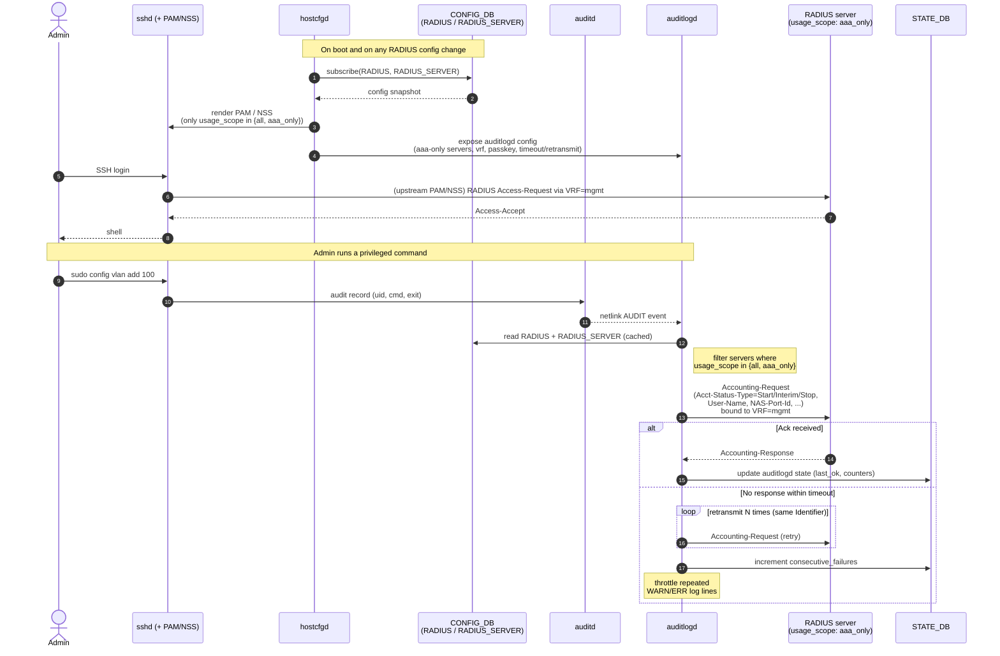

# High-Level Design: RADIUS Authentication & Accounting on SONiC

**Base assumptions**: This document describes the extensions layered on top of the existing upstream RADIUS user-authentication support in SONiC (PAM + NSS via `libnss-radius`, base `RADIUS` / `RADIUS_SERVER` CONFIG_DB tables rendered by `hostcfgd`). Upstream mechanics are not re-described here.

---

## 1. Motivation

Upstream SONiC supports RADIUS-based login authentication but has three gaps that this design closes:

1. **AAA vs. 802.1x server segregation** — no way to say "this RADIUS server is only for admin login, that one is only for host authentication."
2. **VRF binding for RADIUS accounting** — RADIUS traffic on the management network requires the daemon speaking RADIUS to bind its socket into the `mgmt` VRF.
3. **Command / audit accounting** — there is no daemon that streams a switch's audit trail (privileged commands, `auditd` records) to a central RADIUS server as Accounting-Requests.

This design adds the three capabilities above while reusing all of the upstream RADIUS scaffolding for user login.

---

## 2. Scope

**In-scope (this design)**:

- New per-server `usage_scope` field (`all` / `aaa_only` / `dot1x_only`) in `RADIUS_SERVER`, and its consumers in `hostcfgd` and `auditlogd`.
- New per-server `vrf` field in `RADIUS_SERVER`, plus a global RADIUS passkey, and their consumers in the accounting path.
- New `auditlogd` daemon in `sonic-host-services` that streams `auditd` events to RADIUS servers as Accounting-Requests.
- `hostcfgd` extensions for AAA authentication policy (order, fail-through, local fallback) so login and accounting share coherent policy.

**Out-of-scope (untouched or upstream)**:

- Base RADIUS login authentication via PAM / NSS (upstream behavior, reused as-is).
- Existing `RADIUS` global fields (`auth_type`, `passkey`, `timeout`, `retransmit`, `nas_ip`, `src_intf`) — described here only where new consumers reference them.
- 802.1x / PAC / hostapd / `wpa_supplicant` integration.
- TACACS+ integration.
- TLS transport for RADIUS (RADSEC / RADIUS-over-DTLS).

---

## 3. Feature Overview

Two new consumers read the shared RADIUS configuration model and speak to the RADIUS infrastructure:

```
                        +---------------------------+
   SSH / console  --->  |  hostcfgd renders PAM/NSS |  <---> RADIUS server(s)  (Auth)
   (admin login)        |  filtered by usage_scope  |        usage_scope in {all, aaa_only}
                        +---------------------------+

                        +---------------------------+
   audit events  --->   |  auditlogd (new daemon)   |  <---> RADIUS server(s)  (Acct)
   (auditd -> netlink)  |  RADIUS Accounting client |        usage_scope in {all, aaa_only}
                        +---------------------------+

                Configuration source: CONFIG_DB::RADIUS + RADIUS_SERVER
                (existing tables, extended with `usage_scope` and `vrf`)
```

`hostcfgd` is the sole renderer of RADIUS-related on-disk configuration. `auditlogd` is a new systemd service supplied by `sonic-host-services-data`.

---

## 4. Data Model (CONFIG_DB) — Additions Only

Only the newly added fields are documented here. The existing `RADIUS` and `RADIUS_SERVER` schemas remain as upstream.

### 4.1 `RADIUS` (global) — new consumers of the existing `passkey`

The upstream global `passkey` is now also consumed by `auditlogd` as the RADIUS shared secret when a server has not defined its own per-server passkey.

### 4.2 `RADIUS_SERVER|<host>` — new fields

| Field           | Type   | Notes                                                                                                                            |
|-----------------|--------|----------------------------------------------------------------------------------------------------------------------------------|
| **`vrf`**       | string | VRF name (typically `mgmt`) that RADIUS traffic is sourced from. Consumed by `auditlogd` to bind its accounting socket.          |
| **`usage_scope`** | enum | `all` / `aaa_only` / `dot1x_only`. Selects which subsystem(s) may use this server. Consumed by both `hostcfgd` and `auditlogd`. |

`usage_scope` semantics used by this design:

- Login AAA (via `hostcfgd`-rendered PAM/NSS) uses servers with `all` or `aaa_only`.
- Accounting (`auditlogd`) uses servers with `all` or `aaa_only` — dot1x-only servers are excluded so that administrator command audit trails are never sent to end-host RADIUS servers.
- `dot1x_only` servers are ignored by both consumers described in this design.

The upstream per-server `timeout` and `retransmit` fields, previously used only by the PAM login path, are now also honored by `auditlogd` (see §5.2).

---

## 5. Component Design

### 5.1 `hostcfgd` extensions

`hostcfgd` already renders `/etc/pam.d/*` and `/etc/nsswitch.conf` from `RADIUS` / `RADIUS_SERVER`. This design adds three new behaviors:

- **`usage_scope`-aware rendering** — when rendering the login (PAM/NSS) configuration, `hostcfgd` filters `RADIUS_SERVER` entries to those with `usage_scope ∈ {all, aaa_only}`.
- **VRF normalization** — when a server declares a `vrf`, that value is surfaced to downstream consumers (`auditlogd`) via the shared configuration surface.
- **AAA authentication policy** — a new authentication-policy configuration (order, fail-through, local fallback) is honored so that both the login path and `auditlogd` operate under coherent, explicit policy rather than implicit defaults.

### 5.2 `auditlogd` — new RADIUS Accounting daemon

`auditlogd` is a new daemon shipped by `sonic-host-services-data`. It subscribes to Linux `auditd` events over netlink, formats each event as a RADIUS Accounting-Request, and sends it to every enabled RADIUS server.

```
    auditd  --(netlink AUDIT)-->  auditlogd  --(RADIUS Acct-Request UDP)-->  radius_server
                                     |
                                     +-- reads RADIUS / RADIUS_SERVER from CONFIG_DB
                                     +-- filters by usage_scope in {all, aaa_only}
                                     +-- binds socket to `vrf` (e.g. mgmt)
                                     +-- retransmit / timeout / throttling
                                     +-- STATE_DB status
```

Packaging:

- A systemd unit `auditlogd.service` shipped by `sonic-host-services-data`.
- A Python daemon (`scripts/auditlogd`) with an internal `RadiusAccountingClient`.
- A pytest suite covering netlink handling, RADIUS packet formatting, mgmt-IP / patterns, throttle behavior, and VRF/passkey behavior.

Behaviors introduced by this design:

- **`usage_scope` filter** — an accounting log fans out only to servers with `usage_scope ∈ {all, aaa_only}`. Prevents administrator audit records from being sent to dot1x-only servers.
- **VRF binding + global passkey** — the RADIUS accounting socket is bound to the server's `vrf`; the global `RADIUS|global` `passkey` is used unless the server defines its own. A consecutive-failure threshold avoids false-positive server-down declarations.
- **RFC-correct retransmit** — retries reuse the **same** RADIUS Identifier and packet contents, waiting `timeout` seconds between attempts (e.g. `retransmit=2` produces 3 total sends). Per-server `timeout` and `retransmit` from CONFIG_DB are honored; settings are preserved across management-IP updates.
- **Log throttling** — de-duplicates and rate-limits repeat WARN/ERR log lines (e.g. "Failed to send audit log to RADIUS server X (N consecutive failures)", "Failed to bind to VRF mgmt: [Errno 19]…") so syslog does not flood under sustained failures.

---

## 6. Configuration Example

Only the fields relevant to this design are shown; the rest of the base RADIUS configuration is unchanged from upstream.

```json
{
  "RADIUS": {
    "global": {
      "passkey": "sonic-shared-secret",
      "timeout": "5",
      "retransmit": "2"
    }
  },
  "RADIUS_SERVER": {
    "10.29.157.71": {
      "auth_port": "1812",
      "acct_port": "1813",
      "priority": "1",
      "vrf": "mgmt",
      "usage_scope": "aaa_only",
      "timeout": "10",
      "retransmit": "2"
    },
    "10.29.157.72": {
      "auth_port": "1812",
      "acct_port": "1813",
      "priority": "2",
      "vrf": "mgmt",
      "usage_scope": "dot1x_only"
    }
  }
}
```

In this configuration, `auditlogd` will send Accounting-Requests only to `10.29.157.71`, binding the socket into VRF `mgmt`, using the global passkey, with a 10-second timeout and two retransmits per event.

---

## 7. Sequence Diagram — Command Audit via `auditlogd`

An operator logs into SONiC via SSH (authenticated by the upstream PAM/NSS RADIUS machinery, which `hostcfgd` renders with `usage_scope` filtering), executes a privileged command, and has that command streamed as a RADIUS Accounting-Request by `auditlogd`.



