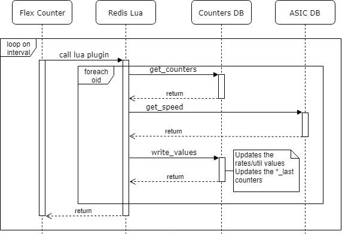

# Byte, packet rates, port utilization in SONiC
# High Level Design Document
### Rev 0.1

# Table of Contents
- [About this Manual](#about-this-manual)
- [Scope](#scope)
- [Definitions/Abbreviation](#definitionsabbreviation)
- [1 Subsystem Requirements Overview](#1-subsystem-requirements-overview)
  - [1.1 Functional requirements](#11-functional-requirements)
  - [1.2 CLI requirements](#12-cli-requirements)
- [2 Implementation details](#2-mimplementation-details)
  - [2.1 SAI counters used](#21-sai-counters-used)
  - [2.2 Calculation formulas](#22-calculation-formulas)
    - [2.2.1 Byte rate](#221-byte-rate)
    - [2.2.2 Packet rate](#222-packet-rate)
    - [2.2.3 Utilization](#223-utilization)
- [3 Modules Design](#3-modules-design)
  - [3.1 Modules that need to be updated](#31-modules-that-need-to-be-updated)
    - [3.1.1 Counter DB](#311-counter-db)
    - [3.1.2 Flex Counter](#312-flex-counter)
    - [3.1.3 Lua Plugins](#313-lua-plugins)
    - [3.1.4 CLI Scripts](#314-cli-scripts)
 - [3.2 Testing](#32-testing)
- [4 Open questions](#4-open-questions)

# List of Tables
* [Table 1: Revision](#revision)
* [Table 2: Abbreviations](#definitionsabbreviation)

###### Revision
| Rev |     Date    |       Author       | Change Description                |
|:---:|:-----------:|:------------------:|-----------------------------------|
| 0.1 |             | Mykola Faryma      | Initial version                   |

# About this Manual
This document provides general information about the new approach for getting byte, packet rates and port utilization in SONiC.
# Scope
This document describes the high level design of the feature.
# Definitions/Abbreviation
###### Table 2: Abbreviations
| Definitions/Abbreviation | Description                    |
|--------------------------|--------------------------------|
| PPS                      | Packets per second             |
| BPS                      | Bytes   per second             |
| UTIL                     | Port utilization               |
| FC                       | Flex counter                   |
| vid                      | Virtual Object Id - object identifier used in counters DB |

# 1 Subsystem Requirements Overview

## 1.1 Functional requirements

- Values of BPS, PPS and UTIL should be present in the output of respective show commands by default

- The values should be calculated over a static period of time

- User issued clear command should have no impact on the values (see old approach)

- There will be no conflicts with "counters per user approach" - all users see the same values(immediate rate&utilization)

- The default interval for rates and utilization is the same as for counters(1s) 

- Th interval for rates and utilization is configurable

## 1.2 CLI requirements

No changes in CLI show command output is required.
For interval configuration `counterpoll` utility will be extended:

```
counterpoll [port_rates|rif_rates] interval <seconds>

counterpoll [port_rates|rif_rates] [enable|disable]
```

To configure the smoothing interval of moving average new CLI will be intrduced:

```
config rate smoothing_interval [all|port|rif] <interval>
```

## 2 Implementation details

### 2.1 SAI counters used

| Definitions/Abbreviation | Description                        |
|----------------------------|------------------------------|
| SAI_PORT_STAT_IF_IN_UCAST_PKTS | SAI port stat if in ucast pkts |
| SAI_PORT_STAT_IF_IN_NON_UCAST_PKTS | SAI port stat if in non ucast pkts  |
| SAI_PORT_STAT_IF_OUT_UCAST_PKTS | SAI port stat if out ucast pkts |
| SAI_PORT_STAT_IF_OUT_NON_UCAST_PKTS | SAI port stat if out non ucast pkts  |
| SAI_PORT_STAT_IF_IN_OCTETS | SAI port stat if in octets |
| SAI_PORT_STAT_IF_OUT_OCTETS | SAI port stat if out octets                                   |
| SAI_ROUTER_INTERFACE_STAT_IN_OCTETS | SAI RIF Ingress byte stat count |
| SAI_ROUTER_INTERFACE_STAT_IN_PACKETS | SAI RIF Ingress packet stat count  |
| SAI_ROUTER_INTERFACE_STAT_OUT_OCTETS | SAI RIF Egress byte stat count |
| SAI_ROUTER_INTERFACE_STAT_OUT_PACKETS | SAI RIF Egress packet stat count  |

### 2.2 Calculation formulas

### 2.2.1 Byte rate


```
[RX|TX]_BPS = (SAI_[PORT|ROUTER_INTERFACE]_STAT_IF_[IN|OUT]_OCTETS - SAI_[PORT|ROUTER_INTERFACE]_STAT_IF_[IN|OUT]_OCTETS_last)/delta
```

`delta` = interval configured for the FC group

### 2.2.2 Packet rate


For port:

```
[RX|TX]_PPS = ((SAI_PORT_STAT_IF_[IN|OUT]_UCAST_PKTS +  SAI_PORT_STAT_IF_[IN|OUT]_NON_UCAST_PKTS) - (SAI_PORT_STAT_IF_[IN|OUT]_UCAST_PKTS_last +  SAI_PORT_STAT_IF_[IN|OUT]_NON_UCAST_PKTS_last))/delta
```

For RIF:

```
[RX|TX]_PPS = (SAI_ROUTER_INTERFACE_STAT_[IN|OUT]_PACKETS - SAI_ROUTER_INTERFACE_STAT_[IN|OUT]_PACKETS_last)/delta
```


### 2.2.3 Utilization


```
[RX|TX]_BPS = (SAI_[PORT|ROUTER_INTERFACE]_STAT_IF_[IN|OUT]_OCTETS - SAI_[PORT|ROUTER_INTERFACE]_STAT_IF_[IN|OUT]_OCTETS_last)/delta
[RX|TX]_UTIL = [RX|TX]_BPS/[PORT|RIF]_RATE
```

### 2.2.4 Exponential moving average

To make the rates and utilization values more smooth, exponential moving average will be calculated. EMA approximates moving average on a window siza that can be changed dynmically. More recent values are given more weight(imapct the average more, decreasing lag). EMA allows to calculate moving average without storing a set of values. Actually all the values in the series are impacting the EMA, but the weight of older values is infinitely decreasing.


ALPHA (precalculated):

```
N = [PORT|RIF]_SMOOTH_INTERVAL

ALPHA = 2/(N+1)

EMA = ALPHA * VALUE + (1 - ALPHA) * EMA_last
```


# 3 Modules Design
## 3.1 Modules that need to be updated

### 3.1.1 Counter DB

#### The following entries will store previous values of Port counters (for diff calculation):

- "RATES:port_vid"
  - SAI_PORT_STAT_IF_IN_UCAST_PKTS_last
  - SAI_PORT_STAT_IF_IN_NON_UCAST_PKTS_last
  - SAI_PORT_STAT_IF_OUT_UCAST_PKTS_last
  - SAI_PORT_STAT_IF_OUT_NON_UCAST_PKTS_last
  - SAI_PORT_STAT_IF_IN_OCTETS_last
  - SAI_PORT_STAT_IF_OUT_OCTETS_last

####  The following entries will store previous values of RIF counters (for diff calculation):

- "RATES:rif_vid"
  - SAI_ROUTER_INTERFACE_STAT_IN_OCTETS_last
  - SAI_ROUTER_INTERFACE_STAT_IN_PACKETS_last
  - SAI_ROUTER_INTERFACE_STAT_OUT_OCTETS_last
  - SAI_ROUTER_INTERFACE_STAT_OUT_PACKETS_last


#### The following entries will store rates & utilization values:

- "RATES:port_vid"
  - RX_BPS
  - RX_PPS
  - TX_BPS
  - TX_PPS
  - RX_UTIL
  - TX_UTIL


- "RATES:rif_vid"
  - RX_BPS
  - RX_PPS
  - TX_BPS
  - TX_PPS
  - RX_UTIL
  - TX_UTIL

### 3.1.2 Config DB

#### The following entries will store moving smoothing interval and precalculated alpha

- "RATES"
  - PORT_SMOOTH_INTERVAL
  - RIF_SMOOTH_INTERVAL
  - PORT_ALPHA
  - RIF_ALPHA


### 3.1.3 Flex Counter

Two new Flex Counter groups are introduced: PORT_RATES, RIF_RATES.
The calculations are performed by lua plugins. The plugins are registered to the new FC groups.
For ports it is done in portsorch, for RIFs in intfsorch. The interfaces list registered to FC is dynamic. It is handled by 
`addRifToFlexCounter` and `removeRifFromFlexCounter` methods. 
The new flex counter groups have own interval, allowing to calculate rate&util values on larger interval than the counters polling itself.
By default, the interval should be the same as for counter polling(1s). 

### 3.1.4 Lua Plugins 

The Lua plugin logic is simple: 

 - get the new & old counters from DB,
 - get port&interface speeds from DB,
 - perform calculations,
 - write the values to DB,
 - update the old counter value to current counter value



### 3.1.5 CLI Scripts

The `counterpoll` utility should return an error when user tries to enable rates when the corresponding counter polling is disabled.
The `counterpoll` utility should returnwarn the user who is trying to configure rates intervall less than the corresponding counter polling interval,
and configure the same interval as the counters interval.

The `portstat` and `intfstat` scripst will be updated to display the rates and utilization values from the DB. 
The show CLI commands support a `-p, --period` option, to display values calculated over a specified period of time. For this the approach of taking a snapshot of counters is more suitable. The script should use this approach when `-p` option is used. 

### 3.2 Testing

Lua plugin logic can be verified with vs tests.

| Testcase | Expected behaviour                        |
|----------------------------|------------------------------|
| Mock some Port RX, TX bytes and packet counters| Plugin to calculate correct rates and util values for port |
| Mock some RIF RX, TX bytes and packet counters| Plugin to calculate correct rates and util values for RIF |
| Change FC group interval | Plugin to calculate correct rates and util values |


### 4 Open questions
