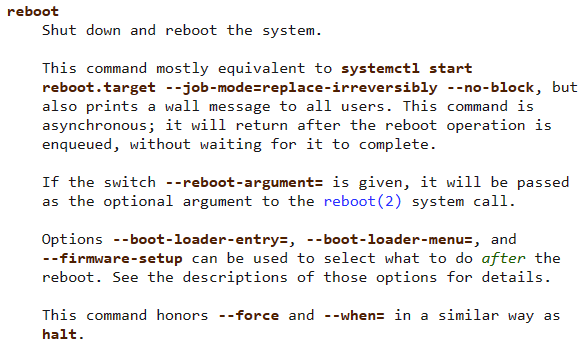
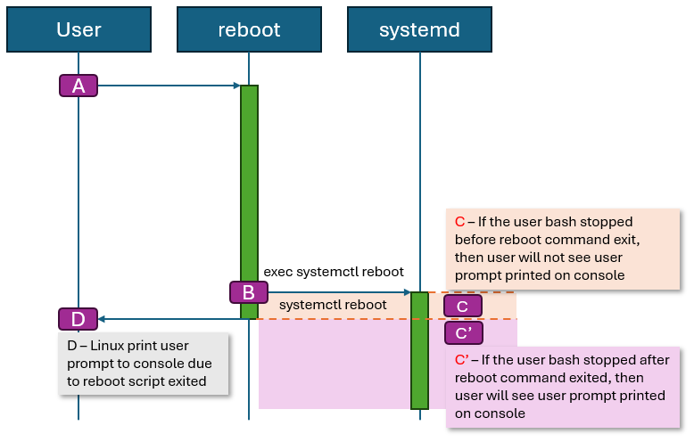

# Reboot support BlockingMode in SONiC

## Table of Content

- [Overview](#overview)
- [Background](#background)
- [Function Design](#function-design)
- [Test Plan](#functional-test)

## Revision

| Revision | Date       | Author     | Change Description |
| -------- | ---------- | ---------- | ------------------ |
| 1.0      | June 12 2025 | Litao Yu | Initial proposal   |

## Overview

We are trying to introduce blocking mode for reboot script, which currently is in non-blocking mode. This will make automation system easier to identify whether the reboot operation is success.

## Background

Currently the reboot script uses linux command `systemctl reboot` to reboot the SONIC system. And the linux command is asynchronous, refer to the below man page:  


As the result, the output from user batch side will be unpredictable:


And the output example for the 2 situations:
- [C] the user bash stopped by systemd before `systemctl reboot` returns and automation system will not see extra user prompt
```
admin@bjw-can-7215-11:~$ sudo reboot
Error response from daemon: Container e6a136aee372584ae6e64d1c55ae49352d842d76daff13a782a4ecfa0262d0e5 is not running
/var/log: 3.9 GiB (4138283008 bytes) trimmed on /dev/loop1
/host: 8 GiB (8547295232 bytes) trimmed on /dev/sda2
Fri 20 Oct 2023 06:03:33 AM UTC Issuing OS-level reboot ...
admin@bjw-can-7215-11:~$ Connection to 10.150.22.134 closed by remote host.
Connection to 10.150.22.134 closed.
```
- [C'] the user bash stopped by systemd after `systemctl reboot` returns and automation system will see extra user prompt
```
admin@bjw-can-7215-11:~$ sudo reboot
Error response from daemon: Container e6a136aee372584ae6e64d1c55ae49352d842d76daff13a782a4ecfa0262d0e5 is not running
/var/log: 3.9 GiB (4138283008 bytes) trimmed on /dev/loop1
/host: 8 GiB (8547295232 bytes) trimmed on /dev/sda2
Fri 20 Oct 2023 06:03:33 AM UTC Issuing OS-level reboot ...
Connection to 10.150.22.134 closed by remote host.
Connection to 10.150.22.134 closed.
```
We want to unify the behavior to `C'` to make sure the automation system always get the same result.

## Function Design

We don't want to make a break change to SONIC reboot command, so we introduce 3 types of inputs to identify we are trying to run on blocking-mode:

### Option 1: Paramter

The reboot command line will be as follow:
```
reboot [-b]
```

### Option 2: Config File
The reboot command will check the config file in `/etc/sonic/reboot_cfg`. If the file contains the follow config, SONIC reboot will default use blocking mode.
```
blocking-mode=true
```

### Option 3: Environment Variables
The reboot command will check the environment var `SONIC_REBOOT_BLOCKING_MODE`. If the var's value is `true`, SONIC reboot will default use blocking mode.

### Functional Test

Functional test plan will be published in [sonic-net/sonic-mgmt](https://github.com/sonic-net/sonic-mgmt).
