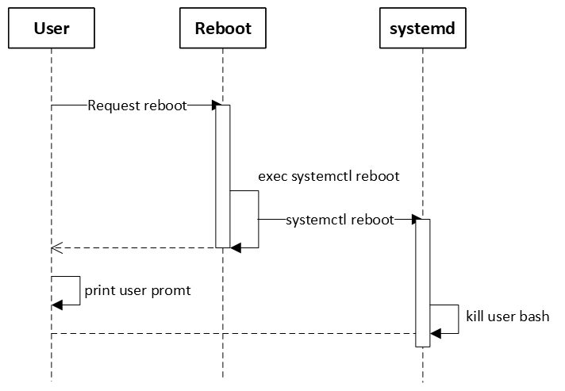
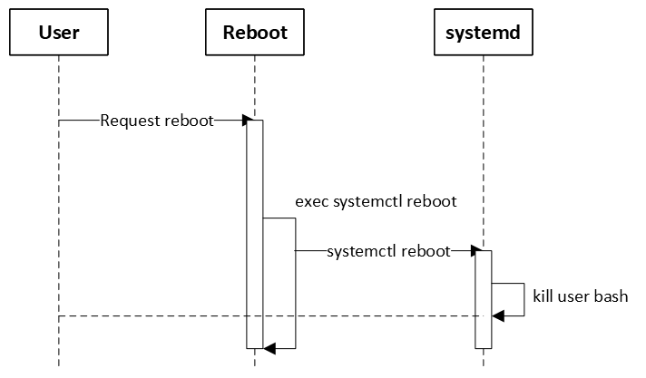

# Reboot support BlockingMode in SONiC

## Table of Content

- [Overview](#overview)
- [Background](#background)
- [Function Design](#function-design)
- [Test Plan](#functional-test)

## Revision

| Revision | Date       | Author     | Change Description |
| -------- | ---------- | ---------- | ------------------ |
| 1.0      | June 12 2025 | Litao Yu | Initial proposal   |

## Overview

We are trying to introduce blocking mode for reboot script, which currently is in non-blocking mode. This will make automation system easier to identify whether the reboot operation is success.

## Background

Currently the reboot script uses linux command `systemctl reboot` to reboot the SONIC system. And the linux command is asynchronous. For detail you can refer `reboot` section in [Linux Man Doc for systemctl](https://www.man7.org/linux/man-pages/man1/systemctl.1.html).

As the result, the output from user batch side will be unpredictable. It displays as 2 kinds of behavior randomly:

- [C] The user bash stopped by systemd before `systemctl reboot` returns. Then the automation system will see extra user prompt. The time sequence is as following:

The console output will like the following:
```
admin@sonic:~$ sudo reboot
Error response from daemon: Container e6a136aee372584ae6e64d1c55ae49352d842d76daff13a782a4ecfa0262d0e5 is not running
/var/log: 3.9 GiB (4138283008 bytes) trimmed on /dev/loop1
/host: 8 GiB (8547295232 bytes) trimmed on /dev/sda2
Fri 20 Oct 2023 06:03:33 AM UTC Issuing OS-level reboot ...
admin@sonic:~$ Connection to 10.150.22.134 closed by remote host.
Connection to 10.150.22.134 closed.
```

- [C'] The user bash stopped by systemd after `systemctl reboot` returns. Then the automation system will not see extra user prompt. The time sequence is as following:

The console output will like the following:
```
admin@sonic:~$ sudo reboot
Error response from daemon: Container e6a136aee372584ae6e64d1c55ae49352d842d76daff13a782a4ecfa0262d0e5 is not running
/var/log: 3.9 GiB (4138283008 bytes) trimmed on /dev/loop1
/host: 8 GiB (8547295232 bytes) trimmed on /dev/sda2
Fri 20 Oct 2023 06:03:33 AM UTC Issuing OS-level reboot ...
Connection to 10.150.22.134 closed by remote host.
Connection to 10.150.22.134 closed.
```

We want to unify the behavior to `C'` to make sure the automation system always get the same result instead of a random result.

## Function Design

We don't want to make a break change to SONIC reboot command, so we introduce 2 types of inputs to identify we are trying to run on blocking-mode:

- Paramter: Use command parameter `-b` to enable blocking mode for reboot script. The whole command will looks like `reboot -b`.

- Config File: The reboot script will check the config file in `/etc/sonic/reboot.conf`. If the file contains the follow config, SONIC reboot will default use blocking mode.

```
blocking_mode=true
```

And to identify the reboot script is still running, we will print dots every 10 seconds and change line every 50 dots. The console output will like the following:

```
admin@sonic:~$ sudo reboot
Error response from daemon: Container e6a136aee372584ae6e64d1c55ae49352d842d76daff13a782a4ecfa0262d0e5 is not running
/var/log: 3.9 GiB (4138283008 bytes) trimmed on /dev/loop1
/host: 8 GiB (8547295232 bytes) trimmed on /dev/sda2
Fri 20 Oct 2023 06:03:33 AM UTC Issuing OS-level reboot ...
..................................................
..................................................
..............................Connection to 10.150.22.134 closed by remote host.
Connection to 10.150.22.134 closed.
```

The first requirement to enable the dots printing is enable blocking mode. And the second requirement is one of the below options:
- Parameter: Use command parameter `-v` to enable Verbose mode for reboot script. The whole command will looks like `reboot -v -b`

- Config file: The reboot script will check the config file in `/etc/sonic/reboot.conf`. The file needs to contain the config `print_process_in_blocking_mode=true`. The whole config file will show as the following:

```
blocking_mode=true
print_process_in_blocking_mode=true
```

## Functional Test

Functional test plan will be published in [sonic-net/sonic-mgmt](https://github.com/sonic-net/sonic-mgmt).
