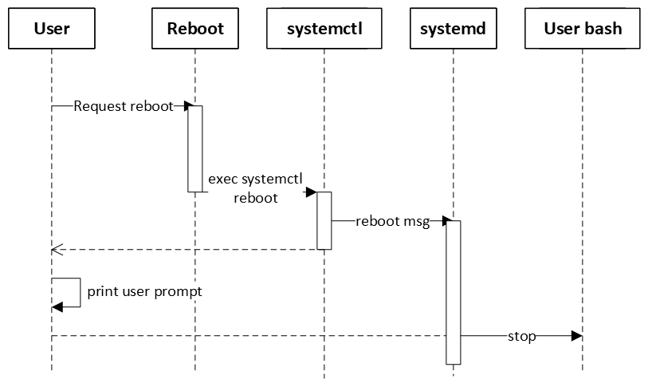

# Reboot support BlockingMode in SONiC

## Table of Content

- [Overview](#overview)
- [Background](#background)
- [Function Design](#function-design)
- [Test Plan](#functional-test)

## Revision

| Revision | Date       | Author     | Change Description |
| -------- | ---------- | ---------- | ------------------ |
| 1.0      | June 12 2025 | Litao Yu | Initial proposal   |

## Overview

We are trying to introduce blocking mode for reboot script, which currently is in non-blocking mode. This will make automation system easier to identify whether the reboot operation is success.

## Background

Currently the reboot script uses linux command `systemctl reboot` to reboot the SONIC system. And the linux command is asynchronous. For detail you can refer `reboot` section in [Linux Man Doc for systemctl](https://www.man7.org/linux/man-pages/man1/systemctl.1.html).

As the result, the output from user batch side will be unpredictable. It displays as 2 kinds of behavior randomly:

- [A] The user bash stopped by systemd after `systemctl reboot` returns. Then the automation system will see extra user prompt. The time sequence is as following:



The console output will like the following:
```
admin@sonic:~$ sudo reboot
Error response from daemon: Container e6a136aee372584ae6e64d1c55ae49352d842d76daff13a782a4ecfa0262d0e5 is not running
/var/log: 3.9 GiB (4138283008 bytes) trimmed on /dev/loop1
/host: 8 GiB (8547295232 bytes) trimmed on /dev/sda2
Fri 20 Oct 2023 06:03:33 AM UTC Issuing OS-level reboot ...
admin@sonic:~$ Connection to 10.150.22.134 closed by remote host.
Connection to 10.150.22.134 closed.
```

- [B] The user bash stopped by systemd before `systemctl reboot` returns. Then the automation system will not see extra user prompt. The time sequence is as following:


The console output will like the following:
```
admin@sonic:~$ sudo reboot
Error response from daemon: Container e6a136aee372584ae6e64d1c55ae49352d842d76daff13a782a4ecfa0262d0e5 is not running
/var/log: 3.9 GiB (4138283008 bytes) trimmed on /dev/loop1
/host: 8 GiB (8547295232 bytes) trimmed on /dev/sda2
Fri 20 Oct 2023 06:03:33 AM UTC Issuing OS-level reboot ...
Connection to 10.150.22.134 closed by remote host.
Connection to 10.150.22.134 closed.
```

We want to unify the behavior to `B` to make sure the automation system always get the same result instead of a random result.

## Design

It should be noted that when platform reboot is enabled, the blocking mode will not take effect. In this situation the script will follow the platform specific behavior.

### Blocking Mode

We don't want to make a break change to SONIC reboot command, so we introduce 2 options as the following for user to identify that we are trying to run on blocking-mode. Blocking-mode will be enable if any of the option is enabled.

- Parameter: Use command optional parameter `-b` to enable blocking mode for reboot script. The whole command will looks like `reboot -b`.

- Config file: The reboot script will check if the `blocking_mode` is enabled in `reboot.conf` config file. More details can be check in the [reboot.conf](#rebootconf) section.

If the systemctl reboot failed, the deadloop might block the console thread. So we introduce the timeout config to exit when reboot takes too long. The command line don't needs this because user can manual use `Ctrl + C` to interrupt the script.

- Config file: The reboot script will check the value of `blocking_mode_timeout` in `reboot.conf` config file. More details can be check in the [reboot.conf](#rebootconf) section.

### Running Output

And to identify the reboot script is still running, we will print dots every 10 seconds and change line every 50 dots. The console output will like the following:

```
admin@sonic:~$ sudo reboot
Error response from daemon: Container e6a136aee372584ae6e64d1c55ae49352d842d76daff13a782a4ecfa0262d0e5 is not running
/var/log: 3.9 GiB (4138283008 bytes) trimmed on /dev/loop1
/host: 8 GiB (8547295232 bytes) trimmed on /dev/sda2
Fri 20 Oct 2023 06:03:33 AM UTC Issuing OS-level reboot ...
..................................................
..................................................
..............................Connection to 10.150.22.134 closed by remote host.
Connection to 10.150.22.134 closed.
```

The first requirement to enable the dots printing is enable blocking mode. And the second requirement is any one of the below options enabled:
- Parameter: Use command parameter `-v` to enable Verbose mode for reboot script. The whole command will looks like `reboot -v -b`

- Config file: The reboot script will check if the `show_timer` is enabled in `reboot.conf` config file. More details can be check in the [reboot.conf](#rebootconf) section.

### reboot.conf

This config file is optional. If the file not exists, all configs will be considered as default.

The config file path is `/etc/sonic/reboot.conf`. Supported configs as following:

| Config | Value | Default | Description |
|-|-|-|-|
| blocking_mode | true/false | false | Enable Blocking Mode for reboot command  |
| blocking_mode_timeout | int (seconds) | 180 | The timeout for enable Blocking Mode. |
| show_timer | true/false | false | <li>Must enable `blocking_mode` first.</li><li>Enable Runing Output for blocking mode.</li> |


Example for `reboot.conf` content:
```
blocking_mode=true
blocking_mode_timeout=10
show_timer=true
```

## Functional Test

Functional test plan will be published in [sonic-net/sonic-mgmt](https://github.com/sonic-net/sonic-mgmt).
