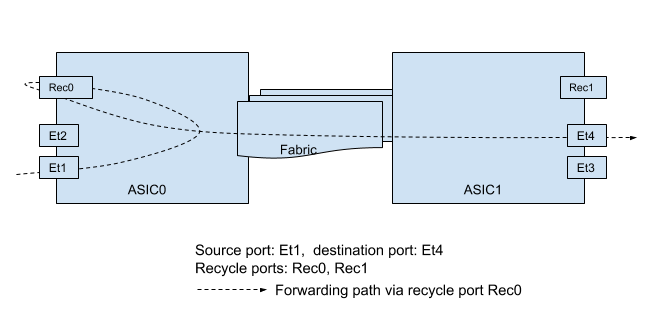

# Recirculation port support on VOQ chassis

# High Level Design Document
#### Rev 1

# Table of Contents
* [List of Tables](#list-of-tables)
* [List of Figures](#list-of-figures)
* [Revision](#revision)
* [About this Manual](#about-this-manual)
* [Scope](#scope)
* [Definitions/Abbreviations](#definitionsabbreviations)
* [1 Design](#1-design)

# List of Tables
* [Table 1: Abbreviations](#definitionsabbreviations)

# List of Figures

# Revision
| Rev |     Date    |       Author       | Change Description |      
|:---:|:-----------:|:------------------:|--------------------|
| 1 | Jan-25 2021 | Song Yuan, Eswaran Baskaran (Arista Networks) | Initial Version |

# About this manual

This document provides an overview of the SONiC support for recirculation ports in a VOQ-based chassis. In a VOQ-based chassis, the packet received by one chip (i.e., the ingress chip) can be forwarded out of another chip (i.e., the egress chip). This inter-chip forwarding generally requires co-ordinating the programming of the egress chip (with the correct rewrite data) and the ingress chip. The recirculation port, a special port for which the egress of the port is looped back to the ingress, makes it possible to achieve the inter-chip forwarding without co-ordinating the programming of the egress chip along with the ingress chip. Throughout the document, we will use the terms: recirculation and recycle interchangeably.

# Scope

The goal of this document is to describe the design of SONIC support for recirculation ports in a VOQ-based chassis. 

# Definitions/Abbreviations

|      |                    |                                |
|------|--------------------|--------------------------------|
| ASIC | Application Specific Integrated Circuit | Refers to the forwarding engine on a device that is responsible for packet forwarding. |


# 1 Design
A packet sent to a recirculation port is looped back to the ingress pipeline of the ASIC where the recirculation port belongs to. Once the packet comes back to the ingress pipeline again, it will be forwarded to the egress ASIC where the packet gets switched out of the destination port. 

The figure below shows an example of the forwarding path via recirculation port.



The packet sent to the recirculation port can either originate from the network, e.g., as shown in the above figure, or received from a local kernel interface. The packet sent to a recirculation port needs to be correctly crafted or rewritten, e.g., having the correct DMAC or destination IP. Otherwise, it won’t be forwarded correctly when it comes into the ingress pipeline again. 

## 1.1 Recycle-to-bridged vs. Recycle-to-routed

Depending on the DMAC of the recycled packet and the configuration of the recycle port, the packet coming out from recycle port can either bridged (i.e., recycle-to-bridged) or routed (i.e., recycle-to-routed) in the ingress ASIC. If the DMAC is not the router MAC of the ingress ASIC, the packet is bridged according to its DMAC. If the DMAC is router MAC and the recycle port is configured as a routed port, the packet will be routed based on the destination IP of the rewritten packet.

To ensure the recycled packet is bridged/routed correctly, the corresponding FDB or route entry must be programmed in the ingress ASIC. 

In general, recycle-to-routed is more preferred to reccyle-to-bridged because the former can take the advantages of L3 forwarding features like ECMP. However, recycle-to-routed is also having its own limitation/issue. For example, the TTL of the egress packet may be decremented twice because the packet is routed twice.

## 1.2 Explict recycle ports

Since the traffic is forwarded via recycle ports, it’s ideal to have statistics, like counters or errors, collected for recycle ports as well just like for front panel ports. This makes it easier to debug forwarding issue in which recycle ports are involved. To this end recycle ports need to be made visible to SONiC.

The support of explicit recycle ports requires the minimal changes to SAI as long as recycle ports can be created. SONiC discovers the recycle ports just like front panel ports and explicitly passes the recycle ports (precisely their SAI port Ids) in SAI calls if needed.

## 1.3 Configuration of recirculation ports

Recirculation ports are configured in port_config.ini or platform.json just like front panel ports. In order to distinguish recirculation from front panel ports, the appropriate port role must be set for recirculation ports. The port role must indicate the intended use of a recirculation port. SONiC can discover all configured recirculation ports, based on their port roles, and use them appropriately.

As of now, there are two use cases of recirculation ports: inband port [here](https://github.com/sonic-net/SONiC/blob/master/doc/voq/architecture.md), or features like Everflow that needs to recycle encapsulated packets to be routed to the egress ASIC [here](https://github.com/sonic-net/SONiC/pull/716/files). In order to ensure the right recirculation ports are used, we introduce two port roles, Inb and Rec, for the two use cases respectively.

Two recirculation ports, Ethernet-Rec0 and Ethernet-IB0, are configured in the example port_config.ini below. Ethernet-Rec0 is used by Everflow, which has port role Rec. Ethernet-IB0 is used as an inband port and thus its port role is set to Inb. The recirculation port's lanes, used to discover the corresponding SAI ports, must be provided in port_config.ini as well.

```
#name               lanes                     alias        index  role       speed
Ethernet0           48,49,50,51,52,53,54,55   Ethernet1/1  1      Ext        400000
Ethernet8           56,57,58,59,60,61,62,63   Ethernet2/1  2      Ext        400000
Ethernet16          64,65,66,67,68,69,70,71   Ethernet3/1  3      Ext        400000
Ethernet24          72,73,74,75,76,77,78,79   Ethernet4/1  4      Ext        400000
Ethernet-Rec0       221                       Recirc0/0    5      Rec        400000
Ethernet-IB0        222                       Recirc0/1    6      Inb        400000
```
Similarly, if recirculation ports are configued in platform.json, their port role must be provided too. For example, the above recirculation ports are defined in platform.json as shown below:
```
    "Ethernet-Rec0": {
        "index": "5",
        "lanes": "221",
        "breakout_modes": {
            "1x400G": ["Recirc0/0"]
        },
        "role":  "Rec"
    },
    "Ethernet-IB0": {
        "index": "6",
        "lanes": "222",
        "breakout_modes": {
            "1x400G": ["Recirc0/1"]
        },
        "role":  "Inb"
    }
```

The following is the example output of the above ports from "show interfaces status" CLI command:

```
  Interface                    Lanes    Speed    MTU    FEC         Alias    Vlan    Oper    Admin                           Type    Asym PFC
-----------    -----------------------  -------  -----  -----  ------------  ------  ------  -------  -----------------------------  ----------
  Ethernet0    48,49,50,51,52,53,54,55     400G   9100   none   Ethernet1/1  routed      up       up  OSFP 8X Pluggable Transceiver         off
  Ethernet8    56,57,58,59,60,61,62,63     400G   9100   none   Ethernet2/1  routed      up       up  OSFP 8X Pluggable Transceiver         off
 Ethernet16    64,65,66,67,68,69,70,71     400G   9100   none   Ethernet3/1  routed      up       up  OSFP 8X Pluggable Transceiver         off
 Ethernet24    72,73,74,75,76,77,78,79     400G   9100   none   Ethernet4/1  routed      up       up  OSFP 8X Pluggable Transceiver         off
 Ethernet-Rec0                     221     400G   9100    N/A     Recirc0/0  routed      up       up                            N/A         off
 Ethernet-IB0                      222     400G   9100    N/A     Recirc0/1  routed      up       up                            N/A         off
```
The process of recirculation ports in SWSS container is similar to front panel ports: portsyncd populates recirculation ports into APPL_DB PORT_TABLE; portsorch discovers, initializes recirculation ports, and adds host interfaces for them; and intfsorch adds router interfaces for recirculation ports.

## 1.4 SAI

ASIC vendoers may implement recirculation ports in different ways. If recirculation ports are implemented just like front panel ports, then no SAI change is required because recirculation ports can be initialized and configured by using existing SAI port API.
