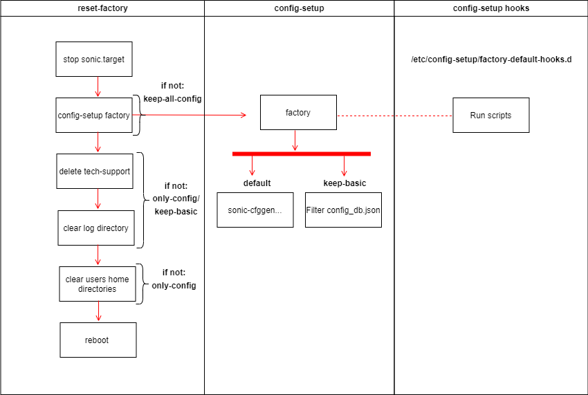

# Reset Factory design #

##  1. Table of Content


* 1. [Table of Content](#TableofContent)
	* 1.1. [Revision](#Revision)
	* 1.2. [Scope](#Scope)
	* 1.3. [Definitions/Abbreviations](#DefinitionsAbbreviations)
	* 1.4. [Overview](#Overview)
	* 1.5. [Requirements](#Requirements)
		* 1.5.1. [Functional requirements](#FunctionalRequirements)
		* 1.5.2. [Configuration and Management Requirements](#ConfigurationManagementRequirements) 
* 2. [Design](#Design)
	* 2.1. [High-Level Design](#High-LevelDesign)
  * 2.2. [Users Defaults](#UsersDefaults)
* 3. [Functionality](#Functionality)
		* 3.1. [Reset-Factory](#Reset-Factory)
		* 3.2. [Config-setup Factory](#Config-setup-Factory) 
* 4. [CLI](#CLI)
* 5. [Error flow](#ErrorFlow)
* 6. [Test Plan](#TestPlan)
		* 6.1. [Cases](#Cases)


###  1.1. Revision
|  Rev  |  Date   |      Author      | Change Description |
| :---: | :-----: | :--------------: | ------------------ |
|  0.1  | 01/2023 | Mohammed Zayadna | Phase 1 Design     |

###  1.2. <a name='Scope'></a>Scope

This HLD document described the requirements, architecture details of Reset factory feature in switches Sonic OS based.

###  1.3. <a name='DefinitionsAbbreviations'></a>Definitions/Abbreviations
N/A


###  1.4. <a name='Overview'></a>Overview

A factory reset is a process that restores the switch to its original manufacturer settings. This can be useful if the device's configuration has become corrupt or if the user wishes to erase all personalized configurations.


###  1.5. <a name='Requirements'></a>Requirements
####  1.5.1. <a name='FunctionalRequirements'></a>Functional requirements
1. It should support resetting configuration to factory default settings.

2. It should clear logs, tech-support, reboot-cause files, warmboot files, 
users history files and home directories.

3. It should delete all non-default users and restore default passwords of default users.

4. It should restore "/etc/sonic" directory to factory folder (Clear the directory in overlayfs upperdir).
except SONiC immutable variables file "sonic-environment"

5. It should reboot the system to load and apply the new configuration.

6. It should stop sonic.target to ensure that files are not deleted while other daemons are utilizing them.

7. it should allow users/application to create their own factory default configurations or
extend the reset factory functionality.


####  1.5.2. <a name='ConfigurationManagementRequirements'></a>Configuration and Management Requirements
We will create a command line tool /usr/bin/reset-factory which should provide following functionality:

1. default: reset configurations to factory default, clear all system logs and files.

2. keep-basic: preserves basic configurations only after boot. Logs and files will be deleted except users history files and home directories.

3. keep-all-config: preserves all configurations after boot. Logs and files will be deleted.

4. only-config: reset configurations to factory default. Logs and files will be preserved.

    
##  2 <a name='Design'></a>Design
	
###  2.1 <a name='High-LevelDesign'></a>High-Level Design


(flow description in the chapter below)

"reset-factory" script will create new config_db.json if needed using "config-setup factory" command.<br/>
In addition, it will clear logs, tech-support and reboot-cause files, users history files and home directories.<br/>

Steps:

1. Stops sonic.target: 
* monit unmonitor container_checker
* systemctl stop sonic.target

2. If not "keep-all-config":

config-setup factory <None/keep-basic/only-config>

3. If not ("only-config" or “keep-basic”):

* Delete all non-default users and restore default passwords of default users.
* Delete bash, vim and python history files under "/home".
* Delete any non-dotfiles in the home directories.

4. If not "only-config":
* Remove all docker containers
* Restore "/etc/sonic" directory to factory folder (Clear the directory in overlayfs upperdir)
* Delete all files under "/host/warmboot"
* Delete tech-support files under "/var/dump/"
* Delete all files under "/var/log"
* Delete all files and symlinks under "/host/reboot-cause/"

5. Print to /var/log/systemlog:
New log file that won't be cleared in reset-factory.
It will allow user to track operations such as "reset-factory".

6. Reboot

###  2.2 <a name='UsersDefaults'></a>Users Defaults

During build, we will create a new file "/etc/sonic/default_users.json" that will store
default user accounts names and default hashed passwords.
The file will have same permissions as /etc/shadow "-rw-------" (600).
```
{
    "admin": {
        "password": "$y$j9T$qGjjyhXSHtuHwowV3DE44.$wrDK6/vecdYIE8ujXyVPkGHvlDHP.ySCsBTLvOdg.31"
    }
}
```
We will remove all non-default user accounts (e.g. 1000 < UID <= 6000),
and we will set the default password for default users.

## 3 <a name='Functionality'></a>Functionality
###  3.1 <a name='Reset-Factory'></a>Reset-Factory

##### Default
It will generate the default config_db.json file by running command:<br/>
config-setup factory<br/>
It will clear system logs and files.

##### Keep-basic

It will generate the default config_db.json and merge it with basic configurations from the current “config_db.json”.<br/>
Command: config-setup factory keep-basic<br/>
It will clear system logs and files.<br/>

##### Keep-all-config
It will keep the same configuration but will clear system logs and files.

##### Only-config
It will generate the default config_db.json file by running command:<br/>
config-setup factory only-config<br/>
It won't clear system logs and files.

###  3.2 <a name='Config-Setup-Factory'></a>Config-setup Factory

config-setup script provides the functionality of creating factory default configuration on demand.<br/>
Currently it generates new config_db.json file using:<br/>
```
sonic-cfggen -H -k ${HW_KEY} --preset ${DEFAULT_PRESET}
```

Also, it allows the user to extend/replace the functionality by adding hooks to the config-setup directory.

We will extend config-setup factory to support new factory type parameter (keep-basic).
This parameter will be passed to the hook scripts so user can extend/replace those flows also.

We will add a new conf file for config-setup: /etc/config-setup/config-setup.conf.
The file will be imported in the script and it will store variables and configurations of the script.

##### Keep-basic

It will generate the default config_db.json merged with basic configurations from the current “config_db.json”<br/>
The list of tables we will be stored in config-setup.conf:<br/>
```
KEEP_BASIC_TABLES=MGMT_PORT,MGMT_INTERFACE,PASSW_HARDENING
```

We will extend this list with the following tables after the merge of features:
```
SSH_SERVER,USER_TABLE,ROLE_TABLE
```


## 4 <a name='CLI'></a>CLI

#### reset-factory
```
==============================================================================
root@host:~$ sudo reset-factory --help
 Usage:  reset-factory < keep-all-config | only-config | keep-basic >

        Create factory default configuration and save it to
        to /etc/sonic/config_db.json.
        Clears logs, system files and reboot the system.

        Default          - Reset configurations to factory default. Logs and files will be deleted.
        keep-all-config  - Preserves all configurations after boot. Logs and files will be deleted.
        only-config      - Reset configurations to factory default. Logs and files will be preserved.
        keep-basic       - Preserves basic configurations only after boot. Logs and files will be deleted.
==============================================================================
```

#### config-setup factory
```
==============================================================================
root@host:~$ sudo config-setup factory --help
 Usage:  config-setup factory < keep-basic >

         Create factory default configuration and save it to
         to ${CONFIG_DB_JSON}.

         keep-basic  - Preserves basic configurations only.
==============================================================================
```

###  5 <a name='ErrorFlow'></a>Error flow
  The script will keep a temporary copy of "config_db.json".<br/>
  In the event that the script has been interrupted or terminated:<br/>
    - it will restore "config_db.json".<br/>
    - it will reboot the system if "sonic.target" already stopped.

###  6 <a name='TestPlan'></a>Test Plan
####  6.1 <a name='Cases'></a>Cases
###### Good flow
  - Run reset-factory without parameters
  - Run reset-factory with keep-all-config/only-config/keep-basic
  - Run config-setup factory without parameters
  - Run config-setup factory with keep-basic

###### Negative flow
  - reset-factory failure
  - config-setup factory failure


 

