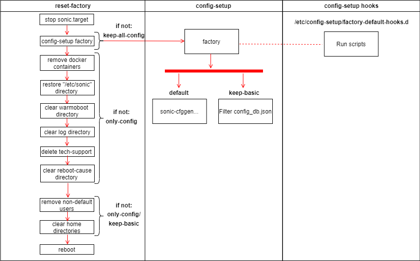

# Reset Factory design #

##  1. Table of Content


* 1. [Table of Content](#TableofContent)
	* 1.1. [Revision](#Revision)
	* 1.2. [Scope](#Scope)
	* 1.3. [Definitions/Abbreviations](#DefinitionsAbbreviations)
	* 1.4. [Overview](#Overview)
	* 1.5. [Requirements](#Requirements)
		* 1.5.1. [Functional requirements](#FunctionalRequirements)
		* 1.5.2. [Configuration and Management Requirements](#ConfigurationManagementRequirements) 
* 2. [Design](#Design)
	* 2.1. [High-Level Design](#High-LevelDesign)
* 3. [Functionality](#Functionality)
		* 3.1. [Reset-Factory](#Reset-Factory)
		* 3.2. [Config-setup Factory](#Config-setup-Factory) 
* 4. [CLI](#CLI)
* 5. [Restrictions/Limitations](#RestrictionsLimitations)
* 6. [Test Plan](#TestPlan)
		* 6.1. [Unit Test cases](#UnitTestcases)


###  1.1. Revision
|  Rev  |  Date   |      Author      | Change Description |
| :---: | :-----: | :--------------: | ------------------ |
|  0.1  | 01/2023 | Mohammed Zayadna | Phase 1 Design     |

###  1.2. <a name='Scope'></a>Scope

This HLD document described the requirements, architecture details of Reset factory feature in switches Sonic OS based.

###  1.3. <a name='DefinitionsAbbreviations'></a>Definitions/Abbreviations
N/A


###  1.4. <a name='Overview'></a>Overview

A factory reset is a process that restores the switch to its original manufacturer settings. This can be useful if the device's configuration has become corrupt or if the user wishes to erase all personalized configurations.


###  1.5. <a name='Requirements'></a>Requirements
####  1.5.1. <a name='FunctionalRequirements'></a>Functional requirements
1. It should support resetting configuration to factory default settings.

2. It should clear logs and tech-support files, users history files and home directories.

3. It should reboot the system to load and apply the new configuration.

4. It should stop sonic.target to ensure that files are not deleted while other daemons are utilizing them.

5. it should allow users/application to create their own factory default configurations or
extend the reset factory functionality.


####  1.5.2. <a name='ConfigurationManagementRequirements'></a>Configuration and Management Requirements
We will create a command line tool /usr/bin/reset-factory which should provide following functionality:

1. default: reset configurations to factory default, clear all system logs and files.

2. keep-basic: preserves basic configurations only after boot. Logs and files will be deleted.

3. keep-all-config: preserves all configurations after boot. Logs and files will be deleted.

4. only-config: reset configurations to factory default. Logs and files will be preserved.

    
##  2 <a name='Design'></a>Design
	
###  2.1 <a name='High-LevelDesign'></a>High-Level Design


(flow description in the chapter below)

"reset-factory" script will create new config_db.json if needed using "config-setup factory" command.<br/>
In addition, it will clear system logs and files.<br/>

Steps:

1. Stops sonic.target: 

systemctl stop sonic.target

2. If not "keep-all-config":

config-setup factory <None/keep-basic/only-config>

3. If not ("only-config" or “keep-basic”):

* Delete bash , vim and python history files under "/home".
* Delete any non-dotfiles in the home directories.

4. If not "only-config":
* Delete tech-support files under "/var/dump/"
* Delete all files under "/var/log"

5. Print to /var/log/systemlog:
New log file that won't be cleared in reset-factory.
It will allow user to track operations such as "reset-factory".

5. Reboot


## 3 <a name='Functionality'></a>Functionality
###  3.1 <a name='Reset-Factory'></a>Reset-Factory

##### Default
It will generate the default config_db.json file by running command:<br/>
config-setup factory<br/>
It will clear system logs and files.

##### Keep-basic

It will keep only basic configurations from the current “config_db.json”.<br/>
Command: config-setup factory keep-basic<br/>
It will clear system logs and files.<br/>

##### Keep-all-config
It will keep the same configuration but will clear system logs and files.

##### Only-config
It will generate the default config_db.json file by running command:<br/>
config-setup factory only-config<br/>
It won't clear system logs and files.

###  3.2 <a name='Config-SetupFactory'></a>Config-setup Factory

config-setup script provides the functionality of creating factory default configuration on demand.<br/>
Currently it generates new config_db.json file using:<br/>
```
sonic-cfggen -H -k ${HW_KEY} --preset ${DEFAULT_PRESET}
```

Also, it allows the user to extend/replace the functionality by adding hooks to the config-setup directory.

We will extend config-setup factory to support two new parameters (Keep-basic and Only-config).
We will pass the parameter to the hook script so user can extend/replace those flows also. 

##### Keep-basic

It will filter current “config_db.json” according to a predefined template file:<br/>
/usr/share/sonic/templates/keep-basic.json.j2<br/>
It will keep the following tables:<br/>
DEVICE_METADATA, SSH_SERVER, PASSH, USER_MGMT, ROLE_MGMT, MGMT_PORT, MGMT_INTERFACE<br/>


##### Only-config
it will use the same default flow.

## 4 <a name='CLI'></a>CLI

#### reset-factory
```
==============================================================================
root@host:~$ sudo reset-factory --help
 Usage:  reset-factory < keep-all-config | only-config | keep-basic >

        Create factory default configuration and save it to
        to /etc/sonic/config_db.json.
        Clears logs, system files and reboot the system.

        keep-all-config  - Preserves all configurations after boot. Logs and files will be deleted.
        only-config      - Reset configurations to factory default. Logs and files will be preserved.
        keep-basic       - Preserves basic configurations only after boot. Logs and files will be deleted.
==============================================================================
```

#### config-setup factory
```
==============================================================================
root@host:~$ sudo config-setup factory --help
 Usage:  config-setup factory < only-config | keep-basic >

        Create factory default configuration and save it to
        to /etc/sonic/config_db.json.

        only-config      - Reset configurations to factory default.
        keep-basic       - Preserves basic configurations.
==============================================================================
```

###  5 <a name='RestrictionsLimitations'></a>Restrictions/Limitations
TBD


###  6 <a name='TestPlan'></a>Test Plan
####  6.1 <a name='UnitTestcases'></a>Unit Test cases
###### Good flow
  - Run reset-factory without parameters
  - Run reset-factory with keep-all-config/only-config/keep-basic
  - Run config-setup factory without parameters
  - Run config-setup factory with only-config/keep-basic

###### Negative flow
  - reset-factory failure
  - config-setup factory failure


 

