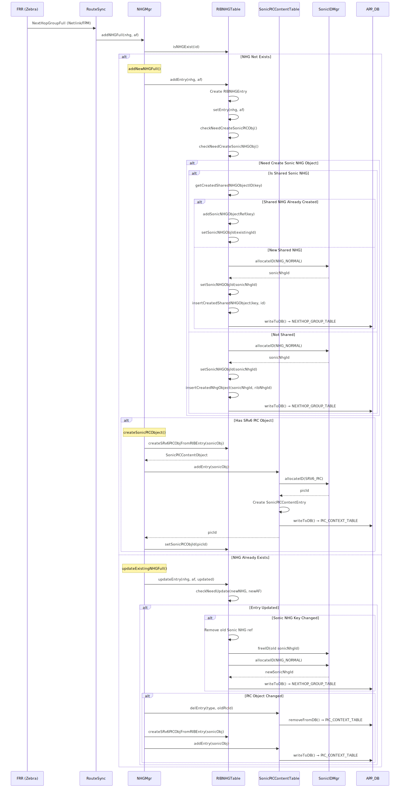
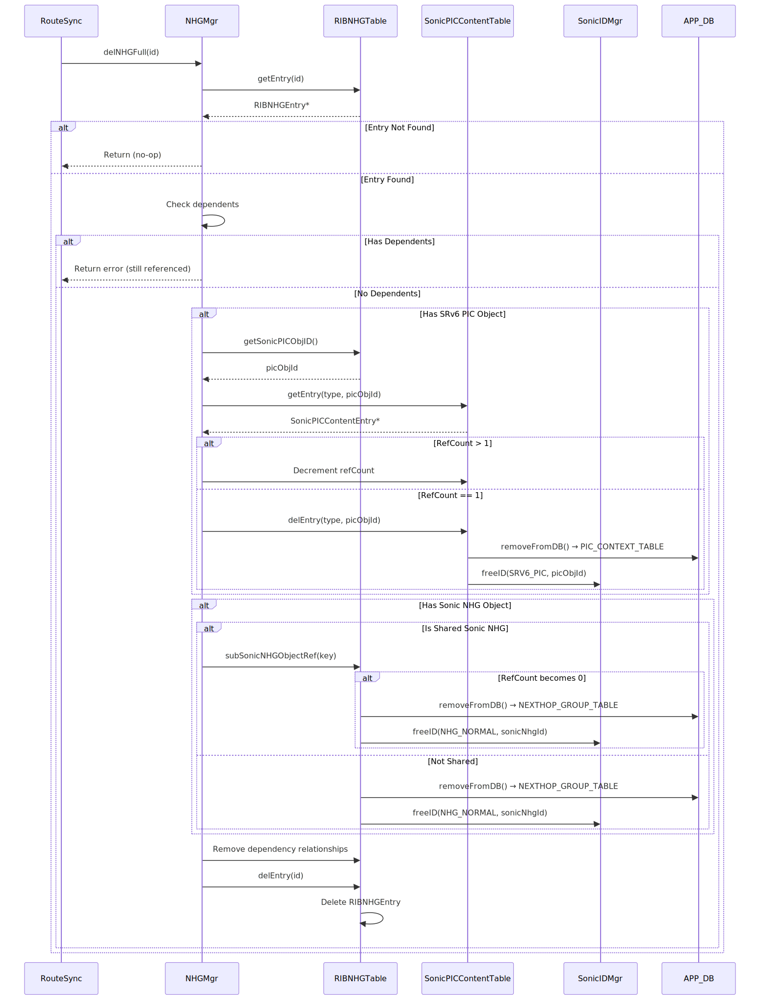

# NHG Mgr LLD

# Overview

In the design of RIB/FIB, there is an extra FIB block in fpmsyncd. The NHG (Next Hop Group) Manager is designed to manage the entire FIB block. It is responsible for managing the mapping between Zebra RIB (Routing Information Base) Next Hop Groups and SONiC NHG Objects. The NHG Manager handles the creation, update, deletion, and dependency tracking of next hop groups to support efficient route convergence.

# Architecture

# Data Structures

## Enumerations

### sonicNhgObjType

**Usages**

Defines the type of SONiC NHG objects

**Value**

| **Name** | **Value** | **Description** |
| --- | --- | --- |
| SONIC\_NHG\_OBJ\_TYPE\_NHG\_NORMAL | 0 | Standard next hop group |
| SONIC\_NHG\_OBJ\_TYPE\_NHG\_SRV6\_GATEWAY | 1 | SRv6 VPN PIC Context |

## Structures

### SonicNHGObjectKey

**Usages**

*   Used as a hash key for all kinds of SONiC NHG objects. 
    

**Fields**

| **Field Name** | **Description** |
| --- | --- |
| groupMember | Vector of pairs <member\_id, weight> |
| nexthop | Next hop IP address string |
| vpnSid | VPN SID for SRv6 (type-specific) |
| segSrc | Segment source address |
| ifName | Interface name |
| type | SONiC NHG object type |

### SonicGateWayNHGObject

**Usages**

*   Represents a SONiC Gateway NHG object. 
    

**Fields**

| Field Name | Type | Description |
| --- | --- | --- |
| type | sonicNhgObjType | Object type |
| groupMember | std::vector<<uint32\_t, uint32\_t> >pairs | group members of NHG |
| nexthop | string | Next hop address |
| vpnSid | string | VPN SID for SRv6 |
| ifName | string | Interface name |
| segSrc | string | Segment source |
| ifIndex | string | Interface index |
| id | uint32\_t | Sonic-assigned object ID |

### SonicNHGObjectInfo

**Usages:**

*   Tracks created SONiC NHG objects for reference counting

**Fields:**

| Field Name | Type | Description |
| --- | --- | --- |
| id | uint32\_t | Sonic NHG object ID |
| refCount | uint32\_t | Reference count of object |

## Class Specifications

### NHGMgr

**Purpose**

Main coordinator for NHG operations, Including all the creation and deletion related to NHG in FIB block, such as sending it to APP DB operation, exposing the interface for adding, deleting NHG and obtaining the corresponding NHG information.

**Usages**

Used as a private member of RouteSync class. Call the functions of NHG mgr to add or delete a zebra NHG, and get the SONiC NHG object info by zebra NHG id.

**Main Functions**

| **Method** | **Input** | **Return** | **Description** |
| --- | --- | --- | --- |
| addNHGFull() | NextHopGroupFull nhg, uint8\_t af | int | Add or update NHG from FIB block, triggered in onNextgroupFullMsg |
| delNHGFull() | uint32\_t id | int | Delete NHG from FIB block, triggered in onNextgroupFullMsg |
| getRIBNHGEntryByRIBID() | uint32\_t id | RIBNHGEntry\* | Retrieve RIB NHG entry by RIB ID, used in onRouteMsg to get the corresponding sonic id |
| getSonicGatewayNHGByRIBID() | uint32\_t id | SonicGateWayNHGEntry\* | Get SONiC gateway NHG by rib NHG id, used in onRouteMsg to get the corresponding SONiC gateway NHG NHG object id |

**Main Members**

| **Name** | **Type** | **Description** |
| --- | --- | --- |
| m\_rib\_nhg\_table | RIBNHGTable | Store all NHG information sent by RIB and the corresponding Sonic NHG info |
| m\_sonic\_nhg\_table | SonicNHGTable | Store all SONiC gateway NHG NHG Object created in FIB block, such as PIC Context object in SRv6 scenario. |
| m\_sonic\_id\_manager | SonicIDMgr | Retrieve RIB NHG entry by RIB ID, used in onRouteMsg to get the corresponding sonic id |

### RIBNHGTable

**Purpose**

Used to store and manage NHG information received from Zebra. 

**Usages**

Used as a private member of NHGMgr class. Call the functions of RIBNHGTable to add or delete a zebra entry, and get the SONiC NHG info by zebra NHG id.

**Main Functions**

| **Method** | **Input** | **Return** | **Description** |
| --- | --- | --- | --- |
| addEntry() | NextHopGroupFull nhg, uint8\_t af | int | Add or update NHG from FIB block, triggered in onNextgroupFullMsg |
| delEntry() | uint32\_t id | int | Delete NHG from FIB block, triggered in onNextgroupFullMsg |
| updateEntry() | NextHopGroupFull nhg, uint8\_t af, bool &updated | int | Update existed RIB entry, return true if entry has updates. |
| getEntry() | uint32\_t id | RIBNHGEntry\* | Retrieve RIB NHG entry by RIB ID, used in onRouteMsg to get the corresponding SONiC NHG id or nexthop fields |
| writeToDB() | RIBNHGEntry \*entry | int | Persist entry to APP\_DB,NEXTHOP\_GROUP\_TABLE |
| removeFromDB() | uint32\_t id | None | Remove the NHG entry from APP\_DB,NEXTHOP\_GROUP\_TABLE |

**Main Members**

| **Name** | **Type** | **Description** |
| --- | --- | --- |
| m\_nhg\_map | map<uint32\_t, RIBNHGEntry\*> | RIB ID to entry mapping |
| m\_created\_nhg\_map | map<SonicNHGObjectKey, SonicNHGObjectInfo> | Tracking all Sonic NHG Object created in FIB block |
| m\_nexthop\_groupTable | ProducerStateTable | APP\_DB NEXTHOP\_GROUP\_TABLE interface |

### RIBNHGEntry

**Purpose**

Represents a single RIB NHG entry.

**Usages**

After receiving zebra message, create the corresponding entry and store it in RIBEntryTable. When processing route message, get the RIBNHGEntry through zebra id and get the converted SONiC id or NHG fields through the RIBNHGEntry.

**Main Functions**

| **Method** | **Input** | **Return** | **Description** |
| --- | --- | --- | --- |
| getFvVector() | None | vector<FieldValueTuple> | Get the fv vector of the entry. Used when create SONiC NHG object. |
| getSonicObjID() | None | uint32\_t | Get the SONiC NHG obj id. Used to get the SONiC NHG id in route message process. |
| getSonicGatewayObjID() | None | uint32\_t | Get the SONiC gateway NHG obj id. Used to get the SONiC gateway NHG obj id in route message process. |
| getNextHopStr() ... getInterfaceNameStr() | None | string | Getters of NHG fields. Used to get the SONiC gateway NHG obj id in route message process. |

**Main Members**

| **Attribute** | **Type** | **Description** |
| --- | --- | --- |
| m\_rib\_id | uint32\_t | Zebra-assigned RIB NHG ID. |
| m\_sonic\_obj\_id | uint32\_t | SONiC-assigned NHG ID, 0 indicates no corresponding SONiC NHG object created. |
| m\_sonic\_gateway\_nhg\_id | uint32\_t | Gateway NHG ID (SRv6, Vxlan etc), 0 indicates no corresponding SONiC NHG object created. |
| m\_sonic\_obj\_type | sonicNhgObjType | Type of SONiC NHG object |
| m\_group | unordered\_map<uint32\_t, uint32\_t> | Full group <ribID, weight>. |
| m\_resolvedGroup | unordered\_map<uint32\_t, uint32\_t> | Resolved group for. |
| m\_depends | set<uint32\_t> | RIB IDs this entry depends on. |
| m\_dependents | set<uint32\_t> | RIB IDs depending on this entry. |
| m\_nhg | NextHopGroupFull | Full NHG data from Zebra. |
| m\_ifName | string | Interface string of the NHG. |
| m\_nexthop | string | Nexthop string of the NHG. |
| m\_weight | string | Weight string of the NHG. |

### SonicGateWayNHGTable

**Purpose**

Store all kinds of SONiC gateway NHG in the FIB block

**Usages**

Used as a private member of NHGMgr class. Call the functions of SonicGateWayNHGTable to add or delete a object in addNHGFull or delNHGFull.

**Main Methods**

| **Method** | **Input** | **Return** | **Description** |
| --- | --- | --- | --- |
| addEntry() | NextHopGroupFull nhg, uint8\_t af | int | Add or update SONiC gateway NHG. |
| delEntry() | uint32\_t id | int | Delete SONiC gateway NHG from FIB block. |
| getEntry() | uint32\_t id | RIBNHGEntry\* | Get SONiC gateway NHG by rib NHG id, used in onRouteMsg to get the corresponding SONiC gateway NHG object id or fields of SONiC gateway NHG. |
| writeToDB() | SonicGateWayNHGEntry \*entry | int | Persist entry to APP\_DB |
| removeFromDB() | uint32\_t id | None | Remove the SONiC gateway object from APP\_DB |

**Main Functions**

| **Attribute** | **Type** | **Description** |
| --- | --- | --- |
| m\_pic\_map | map<uint32\_t, SonicGateWayNHGEntry \*> | Store created SONiC gateway NHG object for SRv6 VPN NHG, key is id in PIC\_CONTEXT\_TABLE. |
| m\_sonic\_nhg\_map | map<SonicNHGObjectKey, SonicGateWayNHGEntry \*> | Store all kinds of created SONiC gateway NHG, key is SonicNHGObjectKey. |
| m\_pic\_contextTable | ProducerStateTable | Interface of APP\_DB PIC\_CONTEXT\_TABLE. |

### SonicGateWayNHGEntry

**Purpose**

Represents a single SONiC gateway NHG.

**Usages**

Created in special scenarios, such SRv6 VPN.

**Main Functions**

| **Method** | **Input** | **Return** | **Description** |
| --- | --- | --- | --- |
| getFvVector() | None | vector<FieldValueTuple> | Get the fv vector of the entry. Used when create SONiC gateway NHG into APP DB. |
| getSonicGateWayObjKey() | None | SonicNHGObjectKey | Get the SonicNHGObjectKey. |
| getSonicGatewayObjID() | None | uint32\_t | Get the SONiC gateway NHG obj id. Used to get the SONiC gateway NHG obj id in route message process. |

**Main Members**

| **Attribute** | **Type** | **Description** |
| --- | --- | --- |
| m\_sonic\_obj\_key | SonicNHGObjectKey | SonicNHGObjectKey of this entry. |
| m\_sonic\_gateway\_nhg\_id | uint32\_t | SONiC gateway NHG object ID (SRv6, Vxlan etc), 0 indicates no corresponding sonic NHG object created |
| m\_sonic\_obj\_type | sonicNhgObjType | Type of Sonic NHG object |
| m\_group | set<pair<uint32\_t, uint32\_t>> | <id, weight> pairs of group member. |

### SonicIDMgr

**Purpose:** It may be necessary to create multiple types of SONiC NHG object in FIB block, and assign an ID to each type of object. We want to manage all types of ID assignment through one class. Adding a new SONiC NHG object only needs to add a new type of allocator in SonicIDMgr.

**Usages:** 

*   The SonicIDMgr class manages ID allocation across different SONiC NHG object types. Every type of SonicIDAllocator works for the ID assignment of one table in APP DB.

*   IDs start from 1 (0 is reserved for invalid).

*   Used as a private member of NHG mgr and initialized the supported type allocator.

*   Currently contains two types of SonicIDAllocator, one is m\_nhg\_id\_allocator indicated by type SONIC\_NHG\_OBJ\_TYPE\_NHG\_NORMAL, another is m\_pic\_id\_allocator indicated by type SONIC\_NHG\_OBJ\_TYPE\_NHG\_SRV6\_GATEWAY.

**Main Functions**

| **Method** | **Input** | **Return** | **Description** |
| --- | --- | --- | --- |
| init() | vector supportObj | int | Create the allocator according to the input types. |
| allocateID() | sonicNhgObjType type | uint32\_t | Assign the ID according to the type, return value of 0 means failed. |
| freeID(sonicNhgObjType type, uint32\_t id) | sonicNhgObjType type, uint32\_t id |  | Free the ID according to the type. |

**Main Members**

| **Object Type** | **Allocator** |
| --- | --- |
| SONIC\_NHG\_OBJ\_TYPE\_NHG\_NORMAL | m\_nhg\_id\_allocator (APP\_NEXTHOP\_GROUP\_TABLE\_NAME) |
| SONIC\_NHG\_OBJ\_TYPE\_NHG\_SRV6\_GATEWAY | m\_pic\_id\_allocator (APP\_PIC\_CONTEXT\_TABLE\_NAME) |

# SRv6 VPN Support

This section describes the additional features added to the gateway object to support SRv6 scenarios.

## sonicNhgObjType

Add SONIC\_NHG\_OBJ\_TYPE\_NHG\_SRV6\_GATEWAY type to indicate the SRv6 VPN RIB NHG.

## RIBEntry

**Members**

| **Attribute** | **Type** | **Description** |
| --- | --- | --- |
| m\_vpnSid | string | Vpn sid string of the NHG. |
| m\_segSrc | string | Seg src string of the NHG |

**Functions**

| **Name** | **Description** |
| --- | --- |
| checkNeedCreateSonicGatewayNHGObj() | Add the judgment of whether the received NHG is SRv6 NHG. |
| syncFvVector() | Add the srv6 vpn fields sync for SRv6 NHG. |
| checkNeedCreateSonicNHGObj() | Add the judgment of whether create shared SONiC NHG for SRv6 NHG. |

## SonicGateWayNHGTable

**Members**

| **Attribute** | **Type** | **Description** |
| --- | --- | --- |
| m\_pic\_map | map<uint32\_t, SonicGateWayNHGEntry \*> | Map used to store the created SRv6 gateway object. The key is pic context id. |
| m\_pic\_contextTable | ProducerStateTable | APP\_DB PIC\_CONTEXT\_TABLE interface |

**Functions**

| **Name** | **Description** |
| --- | --- |
| addEntry() | Support the SONIC\_NHG\_OBJ\_TYPE\_NHG\_SRV6\_GATEWAY type SONiC gateway NHG creation. |
| delEntry() | Support the SONIC\_NHG\_OBJ\_TYPE\_NHG\_SRV6\_GATEWAY type SONiC gateway NHG deletion. |
| writeToDB() | Support the SONIC\_NHG\_OBJ\_TYPE\_NHG\_SRV6\_GATEWAY type object write into PIC\_CONTEXT\_TABLE. |
| removeFromDB() | Support the SONIC\_NHG\_OBJ\_TYPE\_NHG\_SRV6\_GATEWAY type object remove from PIC\_CONTEXT\_TABLE. |

## SonicIDMgr

**Members**

| **Attribute** | **Type** | **Description** |
| --- | --- | --- |
| m\_pic\_id\_allocator | SonicIDAllocator\* | ID allocator for PIC\_CONTEXT\_TABLE. |

**Functions**

| **Name** | **Description** |
| --- | --- |
| allocateID() | Support the type of SONIC\_NHG\_OBJ\_TYPE\_NHG\_SRV6\_GATEWAY. |
| freeID() | Support the type of SONIC\_NHG\_OBJ\_TYPE\_NHG\_SRV6\_GATEWAY. |
| init() | Create the SonicIDAllocator for type of SONIC\_NHG\_OBJ\_TYPE\_NHG\_SRV6\_GATEWAY |

# Processing Flows

## addNHGFull Flow

1.   FIB block receives NextHopGroupFull from Zebra via addNHGFull()

2.  Check if NHG already exists in RIBNHGTable

3.   If new: call addNewNHGFull()

    1.  Create RIBNHGEntry and populate from NextHopGroupFull

    2.   Check if Sonic NHG object needs to be created in the APP DB

        1.    If needed: allocate Sonic ID via SonicIDMgr

        2.  Write to APP\_DB NEXTHOP\_GROUP\_TABLE

    3.    Check if SONiC gateway NHG needed (SRv6)

        1.  If needed: create SonicGateWayNHGObject and write to PIC\_CONTEXT\_TABLE

4.  If exists: call updateExistingNHGFull()

    1.  Compare old and new NextHopGroupFull

    2.  Update RIBNHGEntry fields if changed

    3.  Handle dependency changes (add/remove dependents)

    4.  Update Sonic NHG object if key changed

    5.  Update SONiC gateway NHG if SRv6 fields changed

## delNHGFull Flow

1.  Receive delete request via delNHGFull(id)

2.  Verify entry exists and has no dependents

3.  Delete SONiC gateway NHG if exists (handle ref count)

4.  Remove SONiC NHG ref from created map

5.  Free SONiC NHG ID via SonicIDMgr

6.  Remove dependency relationships

7.  Delete RIBNHGEntry from RIBNHGTable

# How to support future features

## Warm reboot

*   Store the info in Nhg mgr before reboot.

*   Recover the Nhg mgr tables after reboot.

*   Map the zebra NHG and SONiC Object by zebra hash key and NHG fields

##  convergence

*   Support back walk and forward walk by depends and dependencies in RIBNHGEntry.

*   Add fields to enable or disable NHG in RIBNHGEntry.

## vxlan

*   Add new type of SONiC gateway NHG type for vxlan in Sonic