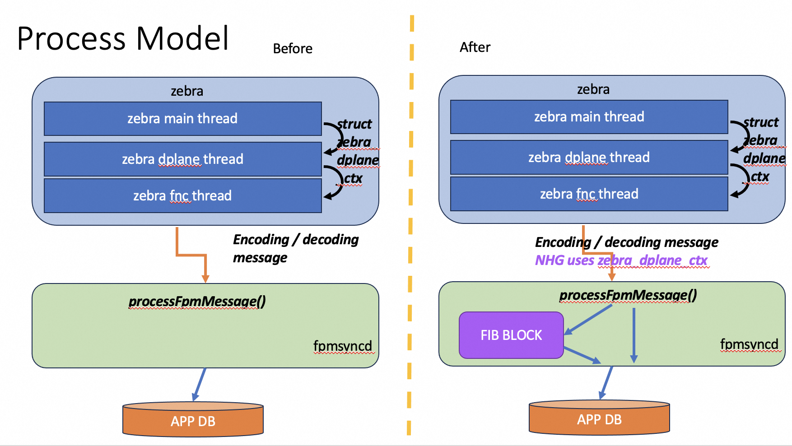
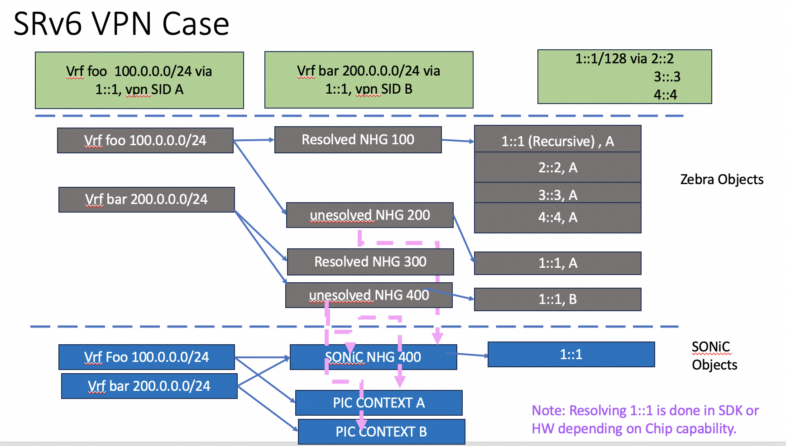
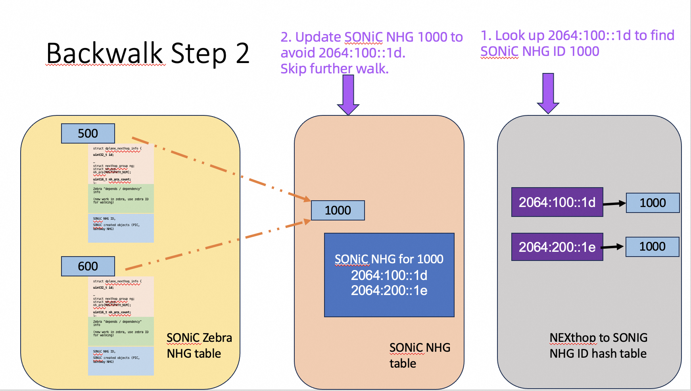

# RIB FIB HLD

# Table of Contents
- [RIB FIB HLD](#rib-fib-hld)
- [Table of Contents](#table-of-contents)
- [Revision](#revision)
- [Definition/Abbreviation](#definitionabbreviation)
    - [Table 1: Abbreviations](#table-1-abbreviations)
- [Problem Statements](#problem-statements)
  - [Summary of Problems to be solved](#summary-of-problems-to-be-solved)
    - [Enable NHG ID handling for improving route convergence](#enable-nhg-id-handling-for-improving-route-convergence)
    - [Introduce PIC (Prefix independent Convergence) for improving route convergence](#introduce-pic-prefix-independent-convergence-for-improving-route-convergence)
    - [Handling SRv6 VPN forwarding chain different from Linux](#handling-srv6-vpn-forwarding-chain-different-from-linux)
- [Introduction of RIB / FIB in SONiC](#introduction-of-rib--fib-in-sonic)
  - [FIB's location](#fibs-location)
- [FIB High Level Design](#fib-high-level-design)
  - [Process Model](#process-model)
  - [NHG Block](#nhg-block)
    - [Tables in NHG Block](#tables-in-nhg-block)
    - [SONiC zebra NHG table](#sonic-zebra-nhg-table)
      - [NEXTHOP KEY to Zebra NHG ID mapping](#nexthop-key-to-zebra-nhg-id-mapping)
    - [SONiC NHG table](#sonic-nhg-table)
      - [NEXTHOP-\>SONIC NHG ID  table](#nexthop-sonic-nhg-id-table)
    - [SONIC NHG ID Manager](#sonic-nhg-id-manager)
  - [NHG forwarding chain graph](#nhg-forwarding-chain-graph)
  - [Resolved NHG and Unresolved NHG](#resolved-nhg-and-unresolved-nhg)
  - [Route handling](#route-handling)
- [FIB work flows](#fib-work-flows)
  - [Handle Global table routing information](#handle-global-table-routing-information)
  - [Handle SRv6 VPN routing information](#handle-srv6-vpn-routing-information)
- [Route Congernce Handling](#route-congernce-handling)
  - [NHT Trigger](#nht-trigger)
  - [Backwalk infra](#backwalk-infra)
  - [Walk Context](#walk-context)
  - [Walk Procedure](#walk-procedure)
  - [Example of backwalk](#example-of-backwalk)
    - [Backwalk Step 1](#backwalk-step-1)
    - [Backwalk Step 2](#backwalk-step-2)
- [CLI](#cli)
- [Developing Tasks and Milestones](#developing-tasks-and-milestones)
  - [Tasks in FRR](#tasks-in-frr)
  - [Tasks in SONiC](#tasks-in-sonic)
  - [Testing Strategy](#testing-strategy)
  - [Developing Milestones](#developing-milestones)

# Revision

| Rev  |   Date    |           Author           | Change Description      |
| :--: | :-------: | :------------------------: | :---------------------: |
| 0.1  | 08/20/2025  | Eddie Ruan, Lingyu Zhang, Songnan Lin, Yuqing Zhao |  Initial version        |

# Definition/Abbreviation

### Table 1: Abbreviations

| ****Term**** | ****Meaning**** |
| -------- | ----------------------------------------- |
| RIB | Routing Information Base  |
| FIB | Forwarding Information Base  |

# Problem Statements
With the increasing deployment of SONiC-based white-box devices, the demand for new features has grown significantly. This evolution has introduced the need for a RIB/FIB design within SONiC, which is driven by the following two factors.

The first factor is the requirement to enhance routing convergence in SONiC. This challenge has been extensively discussed within the SONiC Routing Working Group. Two major initiatives have emerged from these discussions: the introduction of NHG ID handling in SONiC and the adoption of PIC (Prefix Independent Convergence).

The second factor relates to use cases such as SRv6 VPN, where the forwarding chain of the Linux kernel diverges from that of SONiC. In such cases, it becomes necessary to translate routing information into distinct forwarding chains, depending on the underlying data plane implementation.

## Summary of Problems to be solved

### Enable NHG ID handling for improving route convergence
NTT's NHGID HLD could be found at  https://github.com/sonic-net/SONiC/blob/master/doc/pic/hld_fpmsyncd.md. The discussion meeting minutes could be found from 1107 meeting minutes https://lists.sonicfoundation.dev/g/sonic-wg-routing/wiki/38030 NHG enhancements.

Current challenge to complete this work is in how to persist zebra NHG ID mapping to SONiC NHG ID mapping. This topic has been discussed multiple times in routing working group. Here are a list of meeting minutes related to this topic.
* 03/07 https://lists.sonicfoundation.dev/g/sonic-wg-routing/wiki/36235 NHD_ID handling approach during warm reboot.
* 03/14 https://lists.sonicfoundation.dev/g/sonic-wg-routing/wiki/36288 NHD_ID handling approach during warm reboot.
* 01/16 https://lists.sonicfoundation.dev/g/sonic-wg-routing/wiki/38418 NHG ID persistence discussion for warm reboot.
* 02/13 https://lists.sonicfoundation.dev/g/sonic-wg-routing/wiki/38640 Fengsheng went over the proposal to use kernel to recover NHG ID  during warm reboot
* 02/20 https://lists.sonicfoundation.dev/g/sonic-wg-routing/wiki/38673 Venket and Sudharsan led discussion on NHG ID handling during warm reboot.
* 02/27 https://lists.sonicfoundation.dev/g/sonic-wg-routing/wiki/38722 Finalize NHG ID handling in warm reboot. Bug scrub.
* 03/20  https://lists.sonicfoundation.dev/g/sonic-wg-routing/wiki/39064 NHG ID handling for warm reboot, Broadcom and Alibaba

The current conclusion is to manage the persistence of this mapping table within fpmsyncd, so that unnecessary route events do not trigger redundant hardware programming.


### Introduce PIC (Prefix independent Convergence) for improving route convergence
The PIC architecture document could be found at https://github.com/sonic-net/SONiC/blob/master/doc/pic/bgp_pic_arch_doc.md. PIC was considered as a part of phoenixwing initiative. The discussion notes could be found at
* 01/18 meeting minutes https://lists.sonicfoundation.dev/g/sonic-wg-routing/wiki/35760 PIC plan is included.
* BGP PIC HLD could be found at https://github.com/sonic-net/SONiC/pull/1493.

The FRR changes were initially merged via https://github.com/FRRouting/frr/pull/16879, but later reverted due to differing opinions among FRR maintainers. This rollback prompted the need for this HLD. The current challenge is determining how to maintain the PIC forwarding chain.

### Handling SRv6 VPN forwarding chain different from Linux
This issue was discussed in routing working group. The meeting minutes could be found at
* 0522 https://lists.sonicfoundation.dev/g/sonic-wg-routing/wiki/39744 Yuqing from Alibaba discussed the design to handle two different NHG requirements to dplane

The challenge is how to handle forwarding chain differently among different data planes.

To address these two main issues and provide future flexibility in managing forwarding chains within SONiC, we propose introducing the RIB/FIB concept.

# Introduction of RIB / FIB in SONiC
The Routing Information Base (RIB) manages routing information, while the Forwarding Information Base (FIB) translates that information into forwarding entries used by the data plane.

In the current SONiC architecture, the forwarding chain is relatively simple, aligning directly with both the Linux kernel and SONiC’s forwarding chains. As a result, there is no explicit FIB component. Instead, FRR Zebra acts as both the RIB and an implicit FIB. Routing information is converted into SONiC objects within the Zebra thread, while fpmsyncd merely writes these objects into the APPDB.

This model becomes insufficient in more complex scenarios such as SRv6 VPN, where the Linux kernel and SONiC handle forwarding differently. The Linux kernel collapses all forwarding information into a single object, similar to MPLS VPN, optimizing data plane performance. SONiC, however, follows a VXLAN EVPN-like model by introducing a tunnel nexthop, whose resolution occurs at the SDK level.

The introduction of PIC (Prefix Independent Convergence) further complicates matters, requiring forwarding chains that may differ from routing chains. The FRR community reverted PR #16879 due to concerns that adding this complexity to Zebra would make it harder to serve different data planes.

Given these challenges, the FRR community recommends redefining Zebra to function solely as the RIB, delegating FIB management to each data plane. This allows forwarding chains to be derived and optimized according to the specific requirements of each data plane implementation.

## FIB's location
The FIB functionality in SONiC can be introduced at two possible points: before APPDB, within fpmsyncd, or after APPDB, within orchagent. Following discussions in the Routing Working Group, the current consensus is to implement FIB functionality in fpmsyncd.

This approach provides several advantages:

* Minimized hardware updates – unnecessary hardware programming can be avoided.
* Improved performance – eliminates redundant APPDB writes that could otherwise degrade system performance.
* Consistency of APPDB objects – APPDB continues to store SONiC objects, preserving the current architectural behavior.

# FIB High Level Design
## Process Model
Currently, Zebra leverages struct zebra_dplane_ctx to transfer information from the main thread to the FNC thread. The FNC thread then converts Zebra information into SONiC object representations and forwards them to fpmsyncd.



Going forward, NHG-related events will be updated so that struct zebra_dplane_ctx is passed directly to fpmsyncd, while the handling of other Zebra object events remains unchanged. Upon receiving such a message, fpmsyncd will invoke functions from the NHG module to translate struct zebra_dplane_ctx into the corresponding SONiC objects. Processing for all other events will continue to follow the existing workflow.

In general, the FIB is responsible for handling both NHG and route events. However, since SONiC’s slow path relies on the Linux kernel and does not process route information in fpmsyncd, the SONiC FIB primarily handles NHG events. The code in fpmsyncd responsible for processing Zebra NHG events is referred to as the NHG block.

## NHG Block


### Tables in NHG Block
| Table Names  |   Descriptions    |           Usages           |
| :--: | :-------: | :------------------------: |
| SONiC zebra NHG table | Map zebra NHG id to received zebra_dplane_ctx + SONIC Context (a.k.a SONIC ZEBRA NHG) | Rely on “dependency” information in zebra_dplane_ctx to build walking chain.|
| NEXTHOP KEY to Zebra NHG ID mapping |  Map nexthops in zebra_dplane_ctx to zebra NHG ID | It is used in warm reboot |
| SONiC NHG table | Map SONiC NHG id to SONiC created NHG | Store Gateway NHG, a.k.a PIC NHG|
| NEXTHOP->SONIC NHG ID  table | NEXTHOP Address to SONiC NHG ID list mapping | Used to trigger back walk for PIC edge. |

### SONiC zebra NHG table
The following three NHG events will be handled within the NHG block:

* DPLANE_OP_NH_INSTALL
* DPLANE_OP_NH_UPDATE
* DPLANE_OP_NH_DELETE

When any of these events are received, the SONiC Zebra NHG table will be updated accordingly within this block.

* This table is indexed by the Zebra NHG ID and acts as a slave table to Zebra’s NHG hash table.
* Each entry in the SONiC Zebra NHG table must correspond to an entry in Zebra’s NHG hash table.
* The entry stores the struct zebra_dplane_ctx as the Zebra context, which is the yellow and green parts in the following diagram.
* In addition, it maintains SONiC-specific metadata, such as the SONiC NHG ID, which is the blue part in the following diagram.


This design allows the SONiC Zebra NHG table to serve as a mapping table between Zebra NHG IDs and SONiC NHG IDs.

#### NEXTHOP KEY to Zebra NHG ID mapping
This mapping table is used during warm reboot to mapping new zebra NHG ID to existing SONiC NHG ID.

### SONiC NHG table
In certain scenarios, it is necessary to create a new SONIC Next Hop Group (NHG) upon receiving a zebra NHG event. In such cases, the corresponding SONiC NHG will be maintained in the SONiC NHG table.

For the SRv6 VPN use case, NHG messages from Zebra carry not only forwarding information but also additional context, such as the VPN SID or a policy SID list. To handle this, SONiC will create a gateway NHG that contains the forwarding information only. This gateway NHG is also referred to as the PIC NHG. The accompanying context information will be used to construct a PIC Context object in SONiC.

#### NEXTHOP->SONIC NHG ID  table
It serves as a helper table for quickly referencing SONiC NHG entries within the SONiC NHG Table.

### SONIC NHG ID Manager
This piece would manage SONiC NHG ID's allocation and free.

## NHG forwarding chain graph
We use the following example to show how NHG forwarding chain graph is built. Assume we have 2064:100::1d/128 and 2064:200::1e/128 learnt via eBGP. Each route has two paths via fc06::2 and fc08::2

```
B>* 2064:100::1d/128 [20/0] (243) (pic_nh 0) via fc06::2, Ethernet12, weight 1, 3d02h57m
*                                            via fc08::2, Ethernet4, weight 1, 3d02h57m
B>* 2064:200::1e/128 [20/0] (243) (pic_nh 0) via fc06::2, Ethernet12, weight 1, 3d02h57m
*                                            via fc08::2, Ethernet4, weight 1, 3d02h57m
```
Then we add the following static configurations
```
ipv6 route 1::1/128 2064:100::1d
ipv6 route 1::1/128 2064:200::1e
ipv6 route 2::2/128 2064:100::1d
ipv6 route 2::2/128 2064:200::1e
ipv6 route 3::3/128 1::1
ipv6 route 3::3/128 2::2
ipv6 route 4::4/128 1::1
```

The overall routing table would be the following
```
S> 1::1/128 [1/0] (264) (pic_nh 0) via 2064:100::1d (recursive), weight 1, 3d01h49m
                                    via fc06::2, Ethernet12, weight 1, 3d01h49m
                                    via fc08::2, Ethernet4, weight 1, 3d01h49m
                                via 2064:200::1e (recursive), weight 1, 3d01h49m
                                    via fc06::2, Ethernet12, weight 1, 3d01h49m
                                    via fc08::2, Ethernet4, weight 1, 3d01h49m
S> 2::2/128 [1/0] (264) (pic_nh 0) via 2064:100::1d (recursive), weight 1, 2d17h08m
                                    via fc06::2, Ethernet12, weight 1, 2d17h08m
                                    via fc08::2, Ethernet4, weight 1, 2d17h08m
                                via 2064:200::1e (recursive), weight 1, 2d17h08m
                                    via fc06::2, Ethernet12, weight 1, 2d17h08m
                                    via fc08::2, Ethernet4, weight 1, 2d17h08m
S> 3::3/128 [1/0] (275) (pic_nh 0)  via 1::1 (recursive), weight 1, 2d17h07m
                                        via fc06::2, Ethernet12, weight 1, 2d17h07m
                                        via fc08::2, Ethernet4, weight 1, 2d17h07m
                                    via 2::2 (recursive), weight 1, 2d17h07m
                                        via fc06::2, Ethernet12, weight 1, 2d17h07m
                                        via fc08::2, Ethernet4, weight 1, 2d17h07m
S> 4::4/128 [1/0] (267) (pic_nh 0) via 1::1 (recursive), weight 1, 1d00h09m
                                        via fc06::2, Ethernet12, weight 1, 1d00h09m
                                        via fc08::2, Ethernet4, weight 1, 1d00h09m

B>* 2064:100::1d/128 [20/0] (243) (pic_nh 0) via fc06::2, Ethernet12, weight 1, 3d02h57m
                                             via fc08::2, Ethernet4, weight 1, 3d02h57m
B>* 2064:200::1e/128 [20/0] (243) (pic_nh 0) via fc06::2, Ethernet12, weight 1, 3d02h57m
                                             via fc08::2, Ethernet4, weight 1, 3d02h57m
```

The Zebra chain can be represented as the following graph. NHG 239 and NHG 244 (highlighted in yellow) are the final next-hops for fc06::2 and fc08::2. NHG 243 (in light green) is used by the routes 2064:100::1d/128 and 2064:200::1e/128. The four NHGs shown in light brown are dependents of NHG 243, while the NHGs in light blue are dependents of the light brown NHGs.

Note that the current NHG structure only contains top-level next-hops and final resolved next-hops. For instance, NHG 275 does not include intermediate “via” path information. After discussions with the FRR team, they proposed adding “resolve through” and “resolve via” mechanisms to better maintain these dependencies.


Once the resolve-through and resolve-via information is available, the SONiC forwarding chain can be represented as shown in the following graph.


Note that we use dotted lines to represent dependencies because we plan to use ID lookups to identify dependent NHGs rather than pointers. This approach makes the code more robust.

## Resolved NHG and Unresolved NHG
Unresolved NHG is also known as original NHG. FRR team plans to keep these NHG to provide information coming from protocol clients. In most cases, we use resolved NHG in SONiC. But in SRv6 VPN case, we use unresolved NHG due to SONiC expects tunnel NH to be provided, a.k.a unresolved NHG here.

* Global Table case:
    * zebra resolved NHG (flatting one) : SONiC NHG
    * Zebra unresolved NHG  (original one): not in use
* VXLAN case
    * zebra resolved NHG (flatting one) :  SONiC NHG, (terminating at tunnel interfaces)
    * Zebra unresolved NHG  (original one): not in use
* SRv6 VPN case
    * Zebra resolved NHG (flatting one) : not in use
    * Zebra unresolved NHG (original one, terminating at tunnel interface):
        * SONiC PIC CONTEXT OBJ
        * Create gateway NHG in SONiC as PIC NHG for forwarding.


## Route handling
For each route event, we need to use SONiC zebra NHG table to convert zebra NHG ID to SONiC NHG ID.

# FIB work flows
## Handle Global table routing information
We use the following example to show how routing information gets converted to SONiC information via RIB/FIB.

Assume  100.0.0.0/24 via 1.1.1.1 and 200.0.0.0/24 via 1.1.1.1. 1.1.1.1/32 via final nexthop 2.2.2.2, 3.3.3.3 and 4.4.4.4

The green section represents the configurations described above.

The grey section shows the Zebra forwarding chain within the RIB. Each prefix points to the unresolved NHG 200, which contains 1.1.1.1 learned from a protocol client. It also points to a resolved NHG, where 1.1.1.1 is marked as a recursive nexthop resolved via 2.2.2.2, 3.3.3.3, and 4.4.4.4.

The blue section illustrates the SONiC chain created by the FIB (fpmsyncd) based on information received from the RIB. When NHG 100 is received from Zebra, fpmsyncd creates SONiC NHG 400, which contains the three final nexthops 2.2.2.2, 3.3.3.3, and 4.4.4.4. The NHG 200 event is ignored because unresolved NHGs are not used in the global table.

When handling the routes 100.0.0.0/24 and 200.0.0.0/24, fpmsyncd maps the Zebra NHG ID 100 to SONiC NHG ID 400 using the SONiC Zebra NHG table. As a result, orchagent only sees SONiC NHG ID 400.

## Handle SRv6 VPN routing information
We use the following example to show how routing information gets converted to SONiC information via RIB/FIB for SRv6 VPN cases.

Similar to the above example, except we use v6 address as next hop. Assume vrf foo 100.0.0.0/24 via 1::1 with vpn SID A and vrf bar 100.0.0.0/24 via 1::1 with vpn SID B. 1::1/128 via final nexthop 2::2, 3::3 and 4::4



Similar to the previous example, the green section represents the logical configuration, while the grey section shows the RIB chain. In the SRv6 VPN case, the unresolved NHG 200 is used to create a PIC NHG 400 with 1::1 as the nexthop. A PIC CONTEXT object is also created for VPN SID A. The unresolved NHG 400 then references PIC NHG 400 and creates an additional PIC CONTEXT object for VPN SID B.

# Route Congernce Handling
A key objective of introducing the RIB/FIB model is to enhance route convergence. The design principle is to perform rapid updates on affected NHGs by removing failed paths based on existing NHG information. This mechanism mitigates traffic loss and provides sufficient time for routing protocols to complete reconvergence.

## NHT Trigger
The Nexthop Tracker (NHT) is created by Zebra upon receiving information from a protocol client. At present, it only notifies registered protocol clients when a nexthop becomes unreachable. Following discussions with the FRR community, we propose extending NHT to inform the data plane on this event, enabling SONiC to perform rapid fixups that prevent traffic loss.

```
PE3# show ipv6 nht
VRF default:
Resolve via default: on

2064:100::1d
resolved via bgp, prefix 2064:100::1d/128
via fc06::2, Ethernet12 (vrf default), weight 1
via fc08::2, Ethernet4 (vrf default), weight 1
Client list: bgp(fd 71)

2064:200::1e
resolved via bgp, prefix 2064:200::1e/128
via fc06::2, Ethernet12 (vrf default), weight 1
via fc08::2, Ethernet4 (vrf default), weight 1
Client list: bgp(fd 71)
```
The following information would be sent to SONiC via dplane

* Nexthop address : used in walk spec or for SONiC NHG table walk, a.k.a PIC edge case.
* Its current resolved NHG ID : this NHG id is used to trigger backwalk update , a.k.a PIC core case.

## Backwalk infra
Upon receiving an NHT trigger, the NHG block initiates a backwalk to update the affected NHGs, applying quick fixups based on current NHG information to minimize traffic loss. FRR will subsequently recalculate the routes and apply the appropriate updates, but the immediate fixups help prevent traffic disruption.

The purpose of the backwalk infrastructure is to provide a generalized mechanism for traversing the NHG database and applying the necessary actions to targeted NHGs.

## Walk Context
* Walk spec: indicate what we need to do at a given node. Example: Walk from zebra NHG ID 243, update NHGs contains or recursively contains 2064:100::1d as next hop. A forward walk would be used to collect remaining paths from its children.
* Prune spec : indicate if we need to stop the walk at a given node. Example: Stop further walk after gateway NHGs are updated.

## Walk Procedure
* Step1: Start from a given zebra NHG ID inSONiC zebra NHG chain, trigger backwalk via its ”dependents list”
    * When visiting each NHG node, use walk spec to determine if we need to update this node and use prune spec to decide if we need to stop further walk.
    * PIC core is handled in this walk.
* Step2: Start from  ”Nexthop to SONIC NHG hash table” to find out a list of SONIC NHGs, trigger backwalk from each SONiC NHG.
    * PIC edge is handled in this walk.
    * Gateway NHG is a bridge between global table NHGs and the NHGs with contexts.

## Example of backwalk
Assume we use the example described before. Once 2064:100::1d's reachability is gone, NHT would inform dplane with 2064:100::1d as impacted nexthop and NHG 243 is resolved NHG for impacted nexthop. Once fpmsyncd receives this information, it would set walk context as the following

* Walk spec : Walk from zebra NHG ID 243, update NHGs contains 2064:100::1d as nexthop
* Prune spec  : Stop further walk after gateway NHGs are updated for SRv6 use cases.

### Backwalk Step 1
Once fpmsyncd starts to trigger a backwalk with above walk context.

The process works as follows:

* Step 1: Use NHG ID 243 to retrieve NHG 243 from the SONiC Zebra NHG table. This serves as the starting point for the backwalk.
* Step 2: From NHG 243, obtain its dependents, NHG 260 and NHG 265, and walk through them one by one. For NHG 260, which involves 2064:100::1d as a single path, no update is needed, but the walk continues.
* Step 3: For NHG 265, which does not involve 2064:100::1d, the walk can stop at this node.
* Step 4: From NHG 260, continue the walk to NHG 264. Since NHG 264 has two paths and one of them involves 2064:100::1d, an update is triggered in APPDB by rewriting its NHG with the remaining valid paths from the forward walk.
* Further steps: The walk then proceeds from NHG 260 onward, and the process continues recursively.

PIC core cases would be handled in this walk.

### Backwalk Step 2
Fpmsyncd uses 2064:100::1d to trigger a lookup in NEXTHOP to SONIG NHG ID hash table. This lookup returns a list of SONiC NHGs which contains 2064:100::1d as its nexthop.



Fpmsyncd then traverses the SONiC NHG list and updates the corresponding NHGs. If an NHG is of type SRv6, the walk terminates according to the prune specification. If an NHG is of type VXLAN EVPN, the walk continues, triggering updates for each NHG with its associated context.

PIC edge cases are addressed during this traversal.

# CLI
We need CLI to display zebra NHG table, SONiC NHG table, and other in memory information.

TODO: what is the better approach here? Extend vtysh? or create a new one?

# Developing Tasks and Milestones
## Tasks in FRR
Phase 1: The goal is to enable FIB basic functionalities
* Add unresolved NHG in zebra_dplane_ctx (For requirement 2)
* Add “resolve through and resolve via” in zebra_dplane_ctx (For requirement 3)
* Add NHT trigger to dplane ctx (For requirement 3)

Phase 2: Avoid unnecessary routes update.
* Preserve zebra NHG ID in some deterministic cases. (To keep NHG ID unchanged, to avoid routes updates.)

## Tasks in SONiC
Main Changes in SWSS
* (N1) Zebra_dplane_ctx encoding / decoding
* (N2) SONiC Zebra NHG table handling
* (N2, N3) SONIC NHG ID manager
* (N3) SRv6 NHG handling (PIC CONTEXT and gateway NHG)
* (N5)Convert zebra_dplane_ctx information to SONiC objects and write to APP DB.
* (N4) Backwalk Infra
* (N4) NHT event handling to trigger backwalk and update APPDB.
* (R1) Convert zebra ID to sonic IDs including SRv6 VPN case
* CLI

## Testing Strategy
Use model based testing infra to generate UT test cases. Test cases would be committed in SWSS for passing 80% UT coverage in SWSS.

* Collecting developing efforts for writing functions in C++
* Collecting developing efforts for writing corresponding model codes in python
* Collecting the time and issues found during integrating C functions with model codes generated test cases.
    * Issues in C++ functions
    * Issues in model codes
    * Issues in test infra.

## Developing Milestones
