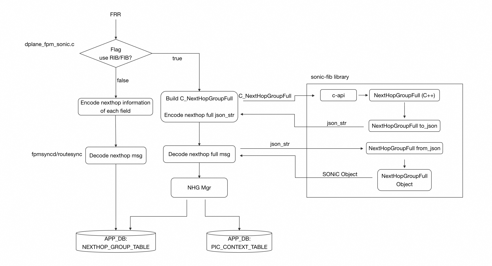
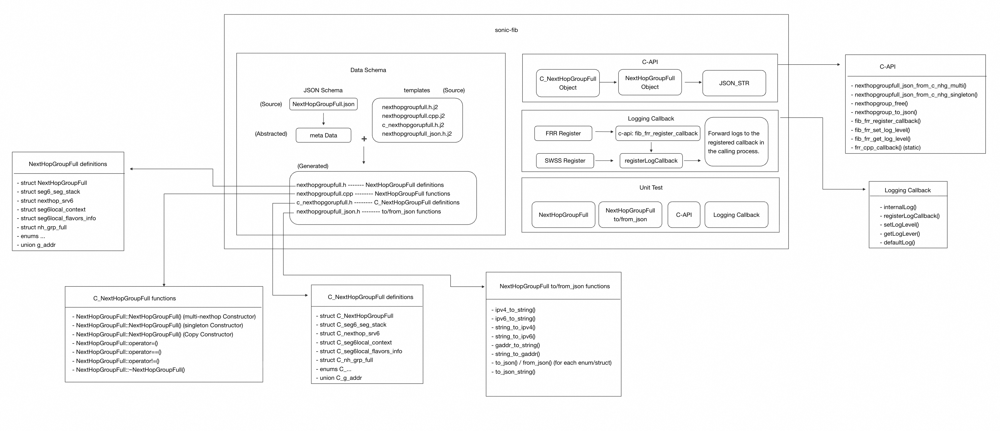

<h1 align="center">RIB FIB  Low Level Design Doc Phase 1 </h1>

<!-- TOC -->

- [Revision](#revision)
- [Document Purpose](#document-purpose)
  - [Phase 1 Objectives](#phase-1-objectives)
  - [Phase 2 Roadmap](#phase-2-roadmap)
  - [Out of Scope / Community Contributions Needed](#out-of-scope--community-contributions-needed)
- [Data Flow Details](#data-flow-details)
- [Base Components](#base-components)
  - [sonic-fib](#sonic-fib)
  - [NHG MGR](#nhg-mgr)
- [Module Changes](#module-changes)
  - [FRR Changes](#frr-changes)
  - [sonic-buildimage Changes](#sonic-buildimage-changes)
  - [SONiC FPM Changes](#sonic-fpm-changes)
  - [Store received JSON STR in app-state-db](#store-received-json-str-in-app-state-db)

<!-- /TOC -->
# Revision

| Rev  |   Date    |           Author           | Change Description      |
| :-- | :------- | :------------------------ | :--------------------- |
| 0.1  | 03/20/2026  | [Songnan Lin](https://github.com/LARLSN) <br>[Yuqing Zhao](https://github.com/GaladrielZhao) |  Initial version        |
| 0.2  | 03/28/2026  | [Yuqing Zhao](https://github.com/GaladrielZhao) | Update description for each chapter. <br> Add link for _SONIC-FIB_ _Low_ _Level_ _Design_ <br> and _NHG_ _MGR_ _LLD_ documents.


# Document Purpose
This document outlines the low-level design decisions for the Phase 1 implementation of RIB and FIB code.

## Phase 1 Objectives
1. Feature Gating: Enable RIB/FIB functionality via a compilation flag. By default, this code will remain disabled.
2. Routing Support: Support global tables, as well as SRv6 VPN routes and next-hop handling.

## Phase 2 Roadmap
1. Convergence Optimization: Implementation of forward/back walk infrastructure to handle PIC (Prefix Independent Convergence) use cases.
2. Reliability: Support for warm reboot capabilities.

## Out of Scope / Community Contributions Needed
The following features are not currently targeted and require community assistance:
1. VXLAN support.
2. FRR "resolve through" and "resolve via" functionality.
3. SONiC Recursive NHG supprot in hardware.

# Data Flow Details


# Base Components
## sonic-fib
#### NOTE: More details of sonic-fib can be found in the document: [___SONIC-FIB___ ___Low___ ___Level___ ___Design___](https://github.com/sonic-net/SONiC/pull/2274)
This library provides encoding and decoding capabilities for NHG FULL objects. The workflow is as follows:
* FRR: Uses the encoding function to generate a JSON string embedded in messages sent to fpmsyncd.
* fpmsyncd: Uses the decoding function to reconstruct the NHG object from the incoming JSON string.

To minimize human error, the library employs a JSON Schema to define the data format and utilizes Jinja2 templates to auto-generate the needed codes.

Following discussions within the Routing Working Group, it was decided to host this library under src/libraries/sonic-fib/ within the sonic-buildimage repository.




## NHG MGR
#### NOTE: More details of NHG Manager can be found in the document: [___NHG___ ___MGR___ ___LLD___](https://github.com/sonic-net/SONiC/pull/2270)
The NHG (Next Hop Group) Manager is designed to manage the entire FIB block.It is responsible for managing the mapping between Zebra RIB (Routing Information Base) Next Hop Groups and SONiC NHG Objects.

The NHG Manager handles the creation, update, deletion operations and dependency tracking of next hop groups to support efficient route convergence.




# Module Changes
## FRR Changes
- Add fields for zebra dplane context to keep richer nexthop group information.
- Support processing METADATA config to enable RIB/FIB (--nhg-fib).
- Pass enough NHGs down to FPM.
## sonic-buildimage Changes
- Add sonic-fib in sonic-buildimage/src/libraries/.
- Support METADATA config to enable RIB/FIB mode(--nhg-fib).
- [FRR] Convert nexthop group information to encoded message (JSON string), encode and it as message, then send to fpmsyncd when RIB/FIB is enabled.
## SONiC FPM Changes
- Add libnexthopgroup as dependency (compiled from sonic-fib).
- NHG MGR implementation.
- Support processing --nhg-fib to enable RIB/FIB mode.
- Adapt the NextHop and Route processing for both two mode: enable/disable RIB/FIB.
## Store received JSON STR in app-state-db
For facilitate debugging, we intend to persist the JSON string of received NHGFULL object in the app-state-db. Given that the number of NHGs is constrained, the performance overhead is negligible, while the improvement in debuggability is significant.

```
admin@PE3:~$ redis-appstatedb --raw HGET NHG_FULL_STATE_TABLE:116 json
{
    "id": 116,
    "key": 663477209,
    "weight": 1,
    "flags": 3,
    "nhg_flags": 513,
    "ifname": "",
    "nh_grp_full_list": [],
    "depends": [],
    "dependents": [],
    "type": "NEXTHOP_TYPE_IFINDEX",
    "vrf_id": 0,
    "ifindex": 42,
    "nh_label_type": "ZEBRA_LSP_NONE",
    "gate": "::",
    "src": "::",
    "rmap_src": "::",
    "nh_srv6": null
}
```