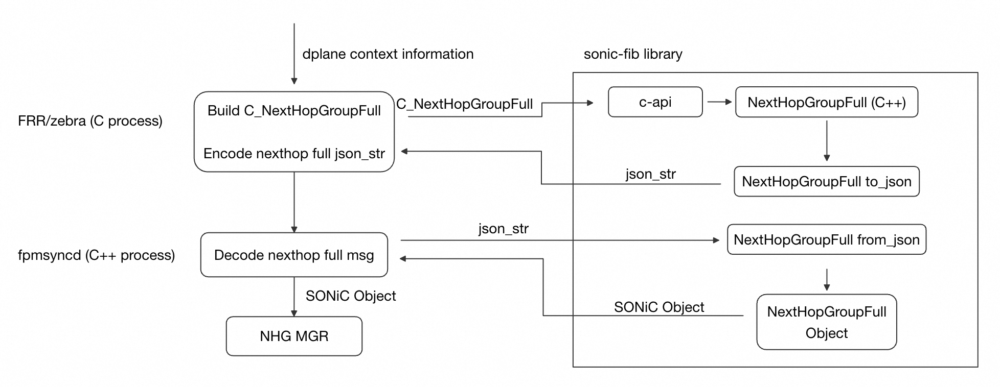
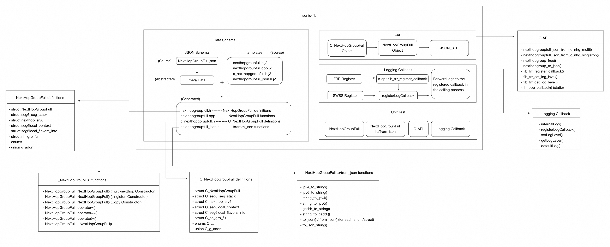

# sonic-fib Low Level Design

## 1 Overview

### 1.1 Purpose
The sonic-fib library provides encoding and decoding capabilities for NextHopGroupFull (NHGFULL) objects. The library serves as a serialization layer between FRR (Free Range Routing) and fpmsyncd components.

### 1.2 Workflow
- **FRR**: Uses encoding functions to generate JSON strings embedded in messages sent to fpmsyncd
- **fpmsyncd**: Uses decoding functions to reconstruct NHG objects from incoming JSON strings

### 1.3 Key Design Principles
- **Single Source of Truth**: JSON Schema defines all data structures
- **Code Generation**: Jinja2 templates auto-generate code to minimize human error
- **C/C++ Interoperability**: C-API layer enables seamless integration with C-based projects like FRR
- **Pluggable Logging**: Callback-based logging system adapts to different host processes

<br>

## 2 Architecture
### 2.1 Data Flow

### 2.2 Architecture



- __Data__ __Schema__: Defines all data structures in NextHopGroupFull.json as the single source of truth. render_schema.py parses this schema and drives Jinja2 templates to auto-generate C++ classes, JSON codecs, and C struct wrappers.
- __C-API__: Exposes C-callable functions for FRR to encode NHG objects into JSON. Internally converts C arrays to C++ vectors, constructs NextHopGroupFull objects, and invokes JSON serialization.
- __Logging__ __Callback__: Provides FIB_LOG macro with pluggable output. Processes register callbacks at startup—FRR via fib_frr_register_callback, SWSS via registerLogCallback—routing logs into each process's native logging system.
- __Unit__ __Test__: Validates C++ class behavior, JSON round-trip serialization, C-API conversion integrity, and logging callback functionality using Google Test framework.

<br>

## 3 Key Data Structures

### 3.1 C++ Data Structures

**NextHopGroupFull Class:**
```cpp
struct NextHopGroupFull {
        std::uint32_t id  = 0;
        std::uint32_t key  = 0;
        std::uint8_t weight  = 0;
        std::uint8_t flags  = 0;
        std::uint32_t nhg_flags  = 0;

    #define NEXTHOP_FLAG_ONLINK (1 << 3)
        std::string ifname  = "";
        std::vector<struct nh_grp_full> nh_grp_full_list ;
        std::vector<std::uint32_t> depends ;
        std::vector<std::uint32_t> dependents ;

        char _hash_begin[0];
        enum nexthop_types_t type  = NEXTHOP_TYPE_INVALID;
        std::uint32_t vrf_id  = 0;
        std::uint32_t ifindex  = 0;
        enum lsp_types_t nh_label_type  = ZEBRA_LSP_NONE;
        union {
            union g_addr gate;
            enum blackhole_type bh_type;
        };
        union g_addr src ;
        union g_addr rmap_src ;
        char _hash_end[0];
        struct nexthop_srv6 *nh_srv6 = nullptr;

        // Functions ...
}
```

### 3.2 C Data Structures

**C_NextHopGroupFull:**
```c
struct C_NextHopGroupFull {
    uint32_t id;
    uint32_t key;
    uint8_t weight;
    uint8_t flags;
    uint32_t nhg_flags;

#define NEXTHOP_FLAG_ONLINK (1 << 3)
    struct C_nh_grp_full nh_grp_full_list[(MULTIPATH_NUM * MAX_NHG_RECURSION) + 1];
    uint32_t depends[MULTIPATH_NUM + 1];
    uint32_t dependents[MULTIPATH_NUM + 1];

    char _hash_begin[0];
    enum C_nexthop_types_t type;
    uint32_t vrf_id;
    uint32_t ifindex;
    enum C_lsp_types_t nh_label_type;
    union {
        union C_g_addr gate;
        enum C_blackhole_type bh_type;
    };
    union C_g_addr src;
    union C_g_addr rmap_src;
    char _hash_end[0];
    struct C_nexthop_srv6 *nh_srv6;
};
```

---

## 4 Key Methods

### 4.1 C++ Methods
**Purpose**: Support NextHopGroupFull handling

**Key Functions:**
- `NextHopGroupFull()`: Constructors
- `~NextHopGroupFull()`: Destructor with resource cleanup
- `NextHopGroupFull& operator = ();`: Copy assignment operator
- `bool operator==() const`: Operator ==
- `bool operator!=() const`: Operator !=

### 4.2 JSON Handling
**Purpose**: JSON serialization/deserialization handlers

**Key Functions:**
- `to_json(nlohmann::json&, const NextHopGroupFull&)`: Serialize to JSON
- `from_json(const nlohmann::json&, NextHopGroupFull&)`: Deserialize from JSON

### 4.3 C-API
**Purpose**: Support C process to convert C_NextHopGroupFull to NextHopGroupFull(C++), then to JSON STR

**Key Functions:**
- `nexthopgroupfull_json_from_c_nhg_singleton/multi()`: Convert C Object to JSON string
- `nexthopgroup_free()`: Free memory after use
- `nexthopgroup_to_json()`: Conver C++ Object to JSON string

### 4.4 Logging Callback
**Purpose**: Provide pluggable logging callback mechanism

**Key Types:**
```cpp
enum class LogLevel {
    DEBUG,
    INFO,
    WARN,
    ERROR
};

using LogCallback = std::function<void(LogLevel, const std::string&)>;
```

**Key Functions:**
- `defaultLog()`: Default fallback: print to stderr
- `registerLogCallback()`: Public API implementations
- `setLogLevel()`: Set the log level
- `getLogLevel()`: Get the log level
- `internalLog()`: Internal logging implementation
- `fib_frr_register_callback()`: Register FRR-specific logging callback

### 4.5 Unit Test
**Purpose**: Verify the code

**Key Methods:**
- `tests/main.cpp`: Google Test initialization
- `tests/c_api_ut.cpp`: C-API tests
- `tests/nexthopgroupfull_ut.cpp`: C++ class tests
- `tests/nexthopgroupfull_json_ut.cpp`: JSON serialization tests
- `tests/nexthopgroup_debug_ut.cpp`: Logging callback tests

<br>

## 5 Directory Structure

```
sonic-fib/
├── configure.ac                    # Autoconf configuration
├── Makefile.am                     # Top-level Automake file
├── README.md                       # Project documentation
├── use_json_schema.md              # JSON Schema usage guide
│
├── schema/
│   └── NextHopGroupFull.json       # JSON Schema (single source of truth)
│
├── scripts/
│   └── render_schema.py            # Schema parser and template renderer
│
├── templates/
│   ├── nexthopgroupfull.h.j2       # Jinja2 template: C++ header
│   ├── nexthopgroupfull.cpp.j2     # Jinja2 template: C++ implementation
│   ├── nexthopgroupfull_json.h.j2  # Jinja2 template: JSON bindings
│   └── c_nexthopgroupfull.h.j2     # Jinja2 template: C struct wrappers
│
├── src/
│   ├── Makefile.am                 # Source directory build rules
│   ├── nexthopgroupfull.h          # [Generated] C++ class definitions
│   ├── nexthopgroupfull.cpp        # [Generated] C++ implementation
│   ├── nexthopgroupfull_json.h     # [Generated] JSON serialization
│   ├── c_nexthopgroupfull.h        # [Generated] C struct wrappers
│   ├── nexthopgroup_debug.h        # Logging callback declarations
│   ├── nexthopgroup_debug.cpp      # Logging callback implementation
│   │
│   └── c-api/
│       ├── nexthopgroup_capi.h     # C-API public header
│       └── nexthopgroup_capi.cpp   # C-API implementation
│
└── tests/
    ├── Makefile.am                 # Test build rules
    ├── main.cpp                    # Google Test initialization
    ├── c_api_ut.cpp                # C-API unit tests
    ├── nexthopgroupfull_ut.cpp     # C++ class unit tests
    ├── nexthopgroupfull_json_ut.cpp # JSON serialization tests
    └── nexthopgroup_debug_ut.cpp   # Logging callback tests
```

### 5.1 Build Artifacts

**Generated Files (by `make`):**
- src/nexthopgroupfull.h
- src/nexthopgroupfull.cpp
- src/nexthopgroupfull_json.h
- src/c_nexthopgroupfull.h

### 5.2 File Dependencies

**Template Dependencies:**
```
NextHopGroupFull.json ─┬─► nexthopgroupfull.h.j2 ──► nexthopgroupfull.h
                       ├─► nexthopgroupfull.cpp.j2 ──► nexthopgroupfull.cpp
                       ├─► nexthopgroupfull_json.h.j2 ──► nexthopgroupfull_json.h
                       └─► c_nexthopgroupfull.h.j2 ──► c_nexthopgroupfull.h
```

**Library Dependencies:**
```
libnexthopgroup.la depends on:
├── libpthread
├── libzmq (ZeroMQ messaging)
├── libuuid (UUID generation)
├── libboost_serialization
└── libgtest / libgtest_main (tests only)
```
<br>
