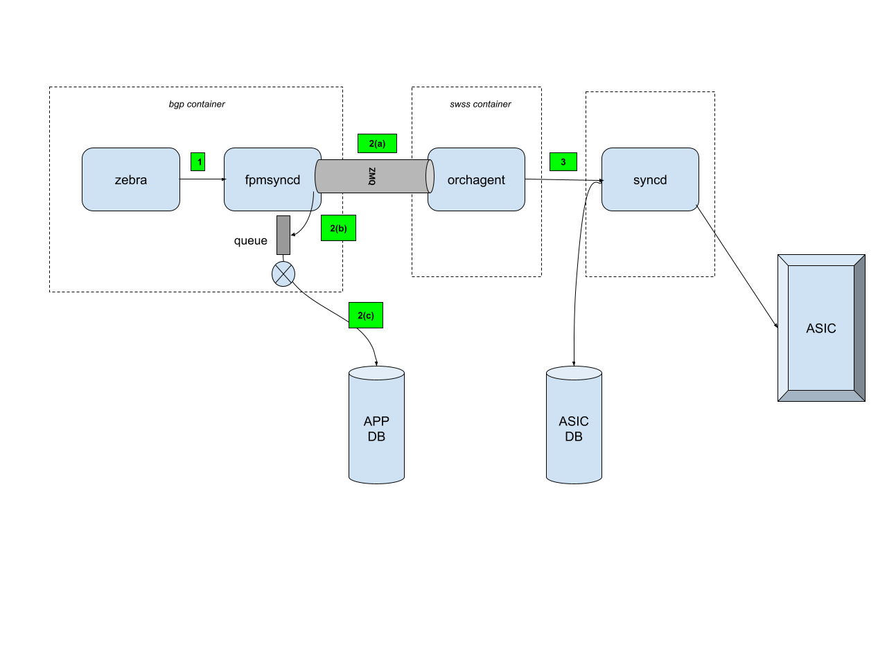

# HLD Northbound ZMQ Enablement

## Table of Contents

* [Introduction](#introduction)  
* [How Things Work Without ZMQ](#how-things-work-without-zmq)  
* [How It Works With ZMQ (Northbound)](#how-it-works-with-zmq-northbound)  
* [How to Configure It](#how-to-configure-it)  
* [The Restart Issue](#the-restart-issue)  
* [What about Warm Boot](#what-about-warm-boot)  
* [Download Speed Results](#download-speed-results)

## Introduction

The ZMQ improvement is described in this earlier HLD

[https://github.com/sonic-net/SONiC/blob/b578f6c1a5135d60c087427d8c421df9dc670e05/doc/orchagent\_zmq/Improve\_route\_performance\_with\_zmq.md](https://github.com/sonic-net/SONiC/blob/b578f6c1a5135d60c087427d8c421df9dc670e05/doc/orchagent_zmq/Improve_route_performance_with_zmq.md)

In SONiC, route programming follows a multi-stage pipeline: FRR's zebra daemon computes routes and pushes them to the switch's ASIC through a chain of components. The critical segment of this pipeline, the "northbound" path from `fpmsyncd` to `orchagent`, traditionally flows through Redis (APPL\_DB). This model uses a mechanism called ProducerStateTable and ConsumerStateTable for IPC between the two processes. In this mechanism a lua script is added for each route and the consumer executes the script to create the route in APPL\_DB.  
ZMQ provides a high-performance alternative that bypasses the Redis pub/sub overhead by sending route updates directly to `orchagent` over a local TCP socket while maintaining an asynchronous Redis write for persistence.

## How Things Work Without ZMQ

Without ZMQ, route updates follow this path:

```
FRR/zebra
    │
    │  FPM (Forwarding Plane Manager) protocol over TCP (port 2620)
    │  Sends netlink-encoded route messages
    ▼
fpmsyncd
    │
    │  ProducerStateTable::set() / del()
    │  Writes route entries synchronously to Redis
    ▼
Redis APPL_DB (ROUTE_TABLE / LABEL_ROUTE_TABLE)
    │
    │  ConsumerStateTable notification (Redis keyspace pub/sub)
    │  orchagent's Select loop picks up the notification
    ▼
orchagent (RouteOrch::doTask)
    │
    │  SAI API calls
    ▼
ASIC SDK / Hardware
```

### Key characteristics

- **fpmsyncd** receives netlink route messages from FRR's zebra over the FPM TCP connection. It parses these messages in `RouteSync::onMsg()` and writes them into Redis APPL\_DB using `ProducerStateTable`.  
    
- **orchagent** reads from Redis APPL\_DB using `ConsumerStateTable`. The Redis notification mechanism (keyspace events) wakes orchagent's event loop when new route entries arrive.  
    
- Every route update involves two Redis round-trips: the producer writes the entry, then Redis notifies the consumer. At scale (hundreds of thousands of routes), this pub/sub overhead becomes a bottleneck for route convergence time.

## How It Works With ZMQ (Northbound)

When ZMQ is enabled, fpmsyncd sends route updates directly to orchagent over a ZMQ PUSH/PULL socket, bypassing the Redis notification path. Redis is still written to asynchronously for persistence and warm restart support.

Zebra writes route updates to fpmsyncd using a netlink format. The fpmsyncd does the following Write routes to orchagent via ZMQ Then separately write the routes to a local queue and signals another db updater thread The db updater thread asynchronously updates the routes to APP\_DB The orchagent meanwhile does some processing/bulking of the routes to pass them on to the subsequent stages towards the ASIC.



## How to Configure It

### CONFIG\_DB setting

ZMQ northbound for routes is controlled by a single boolean field in CONFIG\_DB:

```
CONFIG_DB > DEVICE_METADATA|localhost > orch_northbond_route_zmq_enabled
```

To enable:

```shell
sonic-db-cli CONFIG_DB hset "DEVICE_METADATA|localhost" "orch_northbond_route_zmq_enabled" "true"
```

To disable (default):

```shell
sonic-db-cli CONFIG_DB hset "DEVICE_METADATA|localhost" "orch_northbond_route_zmq_enabled" "false"
```

A restart of the `swss` container is required after changing this setting, since both `fpmsyncd` and `orchagent` read the flag at startup.

### YANG model

The setting is defined in the SONiC YANG model at `sonic-yang-models/yang-models/sonic-device_metadata.yang`:

```
leaf orch_northbond_route_zmq_enabled {
    type boolean;
    description "Enable ZMQ feature on APPL_DB ROUTE tables.";
    default "false";
}
```

## The Restart Issue

The fpmsyncd could crash/restart at any time. Normally this is not a problem because the restart of the fpmsyncd also causes the entire bgp container to restart. This would typically result in the control plane protocols relearning the routes and re-inserting them towards fpmsyncd. This will result in fpmsyncd writing the same routes into APP\_DB and towards orchagent.

But it is possible that when the control plane protocols relearn the routes, one or more of the previously existing routes are no longer present. This will result in an inconsistent state for APP\_DB and potentially the ASIC, where the route exists (created by the previous incarnation of fpmsyncd). 

This is where the ***warm\_restart*** feature comes into play. When enabled, a process restart is handled correctly, where the fpmsyncd, upon restart, would hold any route updates coming from zebra for some configurable period of time. In the meantime it also builds previous state from the APP\_DB. Once the configurable period of time elapses, it would reconcile between the current state (received from zebra) and the previous state (built from APP\_DB). It would add new routes that have been learnt in the interim and delete any routes that existed previously, but are not present any more.

```shell
Warm_restart is enabled on fpmsyncd using:

sudo config warm_restart enable bgp [OR]
sudo config warm_restart bgp_timer 60

There is also:

sudo config warm_restart bgp_eoiu true


To look at the status:

admin@vlab-01:~$ show warm_restart config
name    enable    timer_name    timer_duration    eoiu_enable
------  --------  ------------  ----------------  -------------
bgp     true      bgp_timer     60                true
swss    false     NULL          NULL              NULL
```

The above works well most of the time. But, there is a scenario where this breaks. In the above flow, 2(a), 2(b) and 2(c) are non-atomic operations and there is a likelihood that the fpmsyncd could restart/crash in the middle of any two operations. Or it could crash before the db updater thread has a chance to post the routes into APP\_DB. This would mean that the ASIC could potentially be updated with a route, while the APP\_DB does not have it yet. 

In the above scenario when the control plane protocol re-establish and relearn routes and some routes are not present any more, the warm\_restart feature does not help. This is because it attempts to reconcile between the current state (received from zebra) and the previous state (built from APP\_DB) and both of them don't have the route. But the ASIC would have it. This would cause the routes to stay on and route\_checker would flag it.

# What about Warm Boot

Warm Boot is a feature added in SONiC as an improvement to a previously added Fast Boot mechanism. The idea in Fast Boot was to keep the ASIC state intact (and forwarding), while booting a new software image. The control plane downtime was kept to \< 90secs to satisfy control plane protocols like BGP and LLDP. This required the software to boot up and come back up in less than 90secs. Once up, it would reprogram the ASIC in less than 30 secs.  
The Warm Boot feature improved on this by checkpointing the state of the application and ASIC and restoring it back when the new software took over. This was achieved by persisting the APP\_DB and ASIC\_DB state into a file and reading it back into REDIS when the new image came up again. After control plane reconciliation (as described in the previous section), the orchagent builds a new version of ASIC\_DB from the reconciled APP\_DB. The syncd process then compares the old and new version of ASIC\_DB and compiles a diff of the routes. It then applies this diff into the ASIC. This minimizes the ASIC downtime to less than a second. In most cases where the routes don't change at all, there may be no data plane interruptions. The Warm Boot feature would only incur the control plane down time.

If the scenario described in the earlier section (i.e fpmsyncd restarts between 2(b) and 2(c)) happens around a warm boot, the new version of ASIC\_DB would not have the route, while the old version (and the actual ASIC itself) would have the route. The syncd process would then find a “diff” between the old and new version and would appropriately remove the route from the ASIC. 

So in a nutshell this scenario is not an issue for Warm Boot. It is only a problem for a process crash/restart.

## Download Speed Results

Route programming speed with and without ZMQ for various route table sizes:

| Build | Route Count | Without ZMQ | With ZMQ | Improvement |
| :---- | :---- | :---- | :---- | :---- |
| 202505 | 100K | 45.626s | 13.401s | 3.40x |
| 202505 | 250K | 162.503s | 49.563s | 3.28x |
| 202505 | 500K | 491.928s | 92.719s | 5.31x |
| master | 100K | 55.070s | 25.295s | 2.18x |
| master | 250K | 166.396s | 97.712s | 1.70x |
| master | 500K | 337.576s | 292.593s | 1.15x |

The route programming performance data in this document was collected using an internal benchmarking script. To ensure these measurements are reproducible and to make the tooling available to the community, we have opened a PR to upstream this script to sonic-mgmt ([PR \#22418](https://github.com/sonic-net/sonic-mgmt/pull/22418)).  
