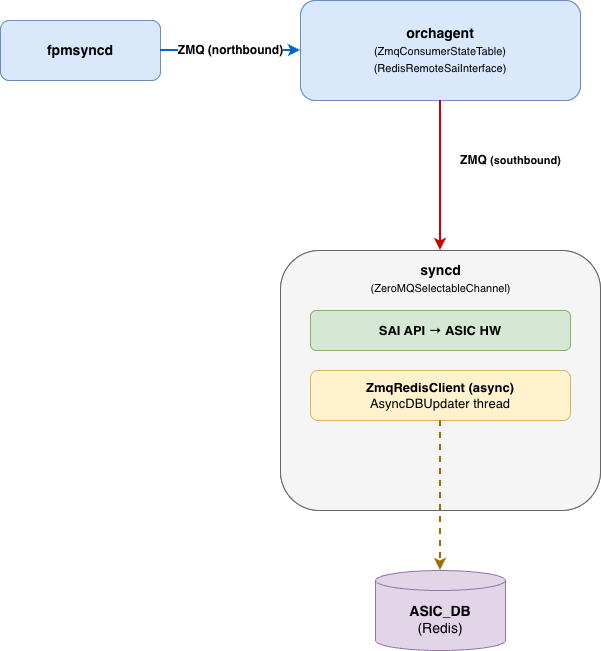

# HLD: Southbound ZMQ Between Orchagent and Syncd

## Table of Contents

1. [Overview](#overview)  
2. [Background and Motivation](#background-and-motivation)  
3. [Architecture](#architecture)  
4. [Design Details](#design-details)  
   - [Orchagent: Context GUID and ZMQ Activation](#orchagent-context-guid-and-zmq-activation)  
   - [SAI Redis: Per-Context ZMQ Selection](#sai-redis-per-context-zmq-selection)  
   - [Syncd: Async ASIC_DB Writes](#syncd-async-asic_db-writes)  
5. [End-to-End Data Flow](#end-to-end-data-flow)  
6. [Configuration](#configuration)  
7. [Backward Compatibility](#backward-compatibility)  
8. [Warm Restart](#warm-restart)  
9. [Testing](#testing)

## Overview

This document describes the design for enabling ZeroMQ communication on the **southbound path** between `orchagent` and `syncd`. When enabled, SAI API calls from orchagent bypass Redis and travel directly over a ZMQ TCP socket to syncd. To maintain ASIC state consistency in Redis while decoupling it from the critical programming path, syncd writes back to `ASIC_STATE_TABLE` asynchronously using a background thread.

## Background and Motivation

### Legacy southbound path (Redis-based)

In the standard SONiC architecture, orchagent communicates with syncd through `ASIC_DB` in Redis:

1. Orchagent serializes SAI API calls as Redis hash-set operations into `ASIC_STATE_TABLE`.
2. Syncd polls `ASIC_STATE_TABLE` via a `ConsumerStateTable`, deserializes each operation, and calls the actual SAI API.

### ZMQ southbound path

SONiC upstream introduced ZMQ-based communication to reduce route programming latency. With ZMQ:

- Orchagent sends SAI operations directly over a TCP socket to syncd (no Redis round-trip on the programming path).  
- Syncd receives operations over a `ZeroMQSelectableChannel` and calls SAI immediately.  
- ASIC_DB state is maintained **asynchronously** by syncd in the background, preserving observability tooling that reads `ASIC_STATE_TABLE`.

## Architecture



## Design Details

### Orchagent: Context GUID and ZMQ Activation

**File:** `orchagent/main.cpp`, `orchagent/saihelper.cpp`

ZMQ communication in sairedis is per-context (each context has a GUID from `context_config.json`). To allow selective enablement, activating ZMQ for one switch context while leaving others on Redis, a new `-g <guid>` CLI flag is introduced.

#### New CLI flag

```
-g guid    context guid (default: all contexts)
```

Internally, this sets a global `uint32_t gContextGuid`. The sentinel value `UINT32_MAX` means "apply to all contexts" (backwards-compatible default).

```c
// orchagent/main.cpp
uint32_t gContextGuid = UINT32_MAX;

case 'g':
    gContextGuid = (uint32_t)std::stoul(optarg);
    break;
```

#### SAI attribute: `SAI_REDIS_SWITCH_ATTR_ZMQ_ENABLED_GUID`

During `initSaiRedis()`, if ZMQ sync mode (`-z` flag) **and** a specific GUID are both set, the SAI Redis layer is told which context should use ZMQ:

```c
// orchagent/saihelper.cpp
if (gContextGuid != UINT32_MAX &&
    gRedisCommunicationMode == SAI_REDIS_COMMUNICATION_MODE_ZMQ_SYNC)
{
    attr.id = SAI_REDIS_SWITCH_ATTR_ZMQ_ENABLED_GUID;
    attr.value.u32 = gContextGuid;
    sai_switch_api->set_switch_attribute(gSwitchId, &attr);
}
```

### SAI Redis: Per-Context ZMQ Selection

**File:** `lib/RedisRemoteSaiInterface.cpp`

When `SAI_REDIS_SWITCH_ATTR_ZMQ_ENABLED_GUID` is received, `RedisRemoteSaiInterface` stores the GUID:

```c
case SAI_REDIS_SWITCH_ATTR_ZMQ_ENABLED_GUID:
    m_zmqEnabledGuid = attr->value.u32;
```

When a communication channel is created for a context, the GUID is checked:

- If `m_zmqEnabledGuid == UINT32_MAX` → ZMQ for **all** contexts.  
- If `m_zmqEnabledGuid == m_contextConfig->m_guid` → ZMQ for **this** context only.  
- Otherwise → fall back to Redis sync for this context.

This allows a multi-ASIC system to run ZMQ on one context while others continue using Redis, with no disruption.

### Syncd: Async ASIC_DB Writes

**File:** `syncd/Syncd.cpp`, `syncd/ZmqRedisClient.cpp`, `syncd/ZmqRedisClient.h`

#### Problem

When ZMQ is enabled, syncd receives SAI operations at high throughput via the ZMQ channel. If syncd writes each ASIC state change synchronously to Redis (blocking `hset`/`del` calls), the Redis I/O latency delays ZMQ message processing, becoming a bottleneck.

#### Solution: ZmqRedisClient

A new `ZmqRedisClient` class extends `RedisClient` and overrides all ASIC state write methods to dispatch through a `swss::AsyncDBUpdater` instead of making synchronous Redis calls. On construction, it creates an `AsyncDBUpdater` backed by `ASIC_STATE_TABLE`:

```cpp
// syncd/ZmqRedisClient.cpp
ZmqRedisClient::ZmqRedisClient(std::shared_ptr<swss::DBConnector> dbAsic)
    : RedisClient(dbAsic),
      m_asyncDbUpdater(std::make_shared<swss::AsyncDBUpdater>(dbAsic.get(), ASIC_STATE_TABLE))
{
}
```

`AsyncDBUpdater` (from `sonic-swss-common`) owns a background thread that drains a mutex-protected queue and writes updates to Redis. The ZMQ processing thread enqueues each ASIC state change and returns immediately, keeping ZMQ throughput high.

The following write operations are overridden in `ZmqRedisClient` to use the async path. The base `RedisClient` retains the synchronous implementations as before:

| Method | ZmqRedisClient (async) | RedisClient (sync) |
| :---- | :---- | :---- |
| `createAsicObject` | `asyncDbUpdater->update(SET kco)` | `m_dbAsic->hset(...)` |
| `createAsicObjects` | `asyncDbUpdater->update(SET kco)` | `m_dbAsic->hmset(...)` |
| `setAsicObject` | `asyncDbUpdater->update(SET kco)` | `m_dbAsic->hset(...)` |
| `removeAsicObject` | `asyncDbUpdater->update(DEL kco)` | `m_dbAsic->del(...)` |
| `removeAsicObjects` | `asyncDbUpdater->update(DEL kco)` | `m_dbAsic->del([...])` |

In `ZmqRedisClient` the key passed to `AsyncDBUpdater` is the bare object key (without the `ASIC_STATE_TABLE:` prefix); `AsyncDBUpdater` handles the table prefix internally.

An important correctness property: ASIC_DB writes are only triggered from `syncUpdateRedisQuadEvent`, which checks `status != SAI_STATUS_SUCCESS` and returns early on failure. This means ASIC_DB only contains state that was actually programmed into hardware.

#### Syncd client selection logic

`Syncd::Syncd()` determines which `RedisClient` variant to instantiate based on three conditions: whether ZMQ is enabled, whether the platform is a virtual switch (VS), and whether the switch type is `dpu` (read from `CONFIG_DB:DEVICE_METADATA|localhost:switch_type`).

```
ZMQ enabled && !isVirtualSwitch?
├── YES, switch_type == "dpu"  → DisabledRedisClient  (no ASIC_DB writes)
├── YES, switch_type != "dpu"  → ZmqRedisClient       (async writes)
└── NO                         → RedisClient           (synchronous, default)
```

- DPU switches retain `DisabledRedisClient` for backwards compatibility with PR #1694, which disabled Redis writes on that platform to prevent memory exhaustion from large ASIC_DB state.
- Virtual Switch (VS) platforms always use synchronous `RedisClient` regardless of ZMQ configuration, to maintain compatibility with the existing VS unit test suite.

## End-to-End Data Flow

### Route programming (ZMQ enabled)

```
1. FRR/zebra → fpmsyncd
2. fpmsyncd → orchagent (ZMQ, northbound)
3. orchagent: route processing → SAI API call
4. RedisRemoteSaiInterface: serialize SAI op → ZMQ socket (southbound)
5. syncd: ZeroMQSelectableChannel receives message
6. syncd: deserialize → call SAI library → ASIC hardware programmed  ← hot path ends
7. syncd: RedisClient::createAsicObject/setAsicObject/removeAsicObject
        → AsyncDBUpdater::update() enqueues kco  ← non-blocking
8. AsyncDBUpdater background thread: dequeue → Redis hset/del → ASIC_DB updated
```

## Configuration

### Runtime knob

Southbound ZMQ is enabled via CONFIG_DB:

```bash
sonic-db-cli CONFIG_DB hset "DEVICE_METADATA|localhost" "orch_southbound_route_zmq_enabled" "true"
```

When set to `"true"`, `orchagent.sh` adds `-z zmq_sync -g 0 -k 10000` to the orchagent startup arguments. A swss restart is required to pick up the change:

```bash
sudo systemctl restart swss
```

To disable, set the field to `"false"` (or remove it) and restart swss.

### Orchagent startup flags

| Flag | Description |
| :---- | :---- |
| `-z zmq_sync` | Enable ZMQ sync communication mode |
| `-g <guid>` | Restrict ZMQ to the context with this GUID; omit to apply to all contexts |

Example (single-ASIC, ZMQ for context 0):

```
orchagent -z zmq_sync -g 0
```

Example (multi-ASIC, ZMQ for context 1 only):

```
orchagent -z zmq_sync -g 1
```

### ZMQ endpoint

The ZMQ endpoint is defined in `context_config.json` per context (field `zmq_endpoint`, default `ipc:///tmp/zmq_ep`). Syncd and orchagent must be configured with matching endpoints.

## Backward Compatibility

| Scenario | Behavior |
| :---- | :---- |
| `-z` not set | Synchronous Redis path, unchanged |
| `-z` set, no `-g` | ZMQ for all contexts, ASIC_DB written asynchronously |
| `-z` set, `-g <guid>` | ZMQ for specified context, Redis sync for others |
| DPU switch, `-z` set | `DisabledRedisClient` (no ASIC_DB writes) — unchanged |
| Existing consumers of `ASIC_STATE_TABLE` | Unaffected; async writes provide eventual consistency |

## Warm Restart

### Overview

SONiC's warm restart allows syncd and orchagent to restart without resetting the ASIC or dropping traffic. The restart sequence requires that `ASIC_DB` accurately reflects the current hardware state when syncd comes back up, since syncd reads `ASIC_STATE_TABLE` during warm boot to reconcile its in-memory view with what was programmed before the restart.

With ZMQ enabled, ASIC state writes go through `AsyncDBUpdater`'s background thread. This introduces a consideration: at the moment a warm restart is triggered, there may be writes queued in `AsyncDBUpdater` that have not yet been committed to Redis. If syncd shuts down before those writes land, `ASIC_DB` will be stale and warm restart reconciliation will diverge from the actual ASIC state.

### Shutdown sequence

The warm restart shutdown path in syncd is:

- Syncd receives a warm restart request via `m_restartQuery`.  
- It drains the ZMQ/Redis channel (`m_selectableChannel`) to ensure all in-flight SAI operations are processed before shutdown.  
- It calls `setRestartWarmOnAllSwitches(true)` to notify the SAI library to preserve ASIC state across the restart.  
- It calls `setPreShutdownOnAllSwitches()` so the vendor SAI can prepare for warm boot.  
- It waits for the final shutdown notification, then calls `removeAllSwitches()` and `apiUninitialize()`.

### AsyncDBUpdater drain on shutdown

`AsyncDBUpdater`'s destructor sets `m_runThread = false`, signals the background thread's condition variable, and then calls `join()`. Critically, the background thread does **not** exit immediately when `m_runThread` is set, it only exits after draining all remaining items from the queue:

```c
// asyncdbupdater.cpp
if (count == 0)
{
    if (!m_runThread)
        break;  // only exit when queue is empty
}
```

This means when `ZmqRedisClient` is destroyed as part of syncd shutdown, `AsyncDBUpdater` will flush all pending writes to Redis before the thread exits. The queue is guaranteed to be empty by the time `join()` returns.

### Correctness

The warm restart sequence is correct for the following reason: syncd drains all pending SAI operations from the ZMQ channel before initiating shutdown (step 2 above). Once the channel is drained, no new writes will be enqueued to `AsyncDBUpdater`. The destructor then flushes whatever remains in the queue before syncd exits. By the time syncd fully shuts down, `ASIC_DB` reflects the complete ASIC state.

On warm boot startup, `performWarmRestart()` reads switch entries from `ASIC_STATE_TABLE` via `m_client->getAsicStateSwitchesKeys()`. Since all async writes have been flushed, this read sees a consistent view and warm reconciliation proceeds correctly.

## Testing

**Hardware Specs:**

- CPU: 8-core AMD V3000  
- RAM: 32 GB  
- ASIC: Broadcom TH5

	  
**Route benchmark test:** sonic-mgmt/tests/scripts/route_programming_benchmark.py. Link to upstream PR: [https://github.com/sonic-net/sonic-mgmt/pull/22418](https://github.com/sonic-net/sonic-mgmt/pull/22418)

**Test Policies**:

- Policy 1: Northbound ZMQ enabled
- Policy 2: Northbound ZMQ + Ring Buffer + Multi-DB enabled
- Policy 3: Southbound ZMQ enabled
- Policy 4: Southbound ZMQ + Multi-DB enabled

**Note: All tests are running with a SAI bulk size of 10k in Orchagent (-k 10000)**

| Route Scale | Policy 1 | Policy 2 | Policy 3 | Policy 4 |
| :---- | :---- | :---- | :---- | :---- |
| 100k | 13.713s | 14.649s | 14.633s | 12.962s |
| 250k | 54.563s | 46.197s | 50.120s | 41.602s |
| 500k | 187.923s | 131.901s | 129.681s | 102.961s |

