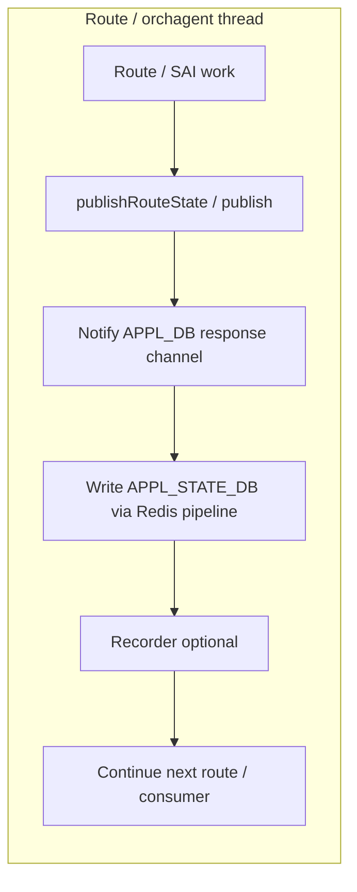
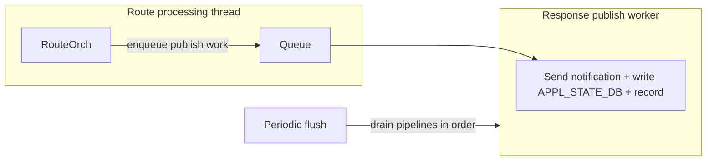

# HLD: Asynchronous route state publish (orchagent)

## Table of contents

1. [Problem Context](#1-problem-context)
2. [Requirements](#2-requirements)
3. [Architecture](#3-architecture)
   - [Existing execution flow (synch publish) — where latency is added](#31-existing-execution-flow-synch-publish--where-latency-is-added)
   - [Target execution flow (async publish)](#32-target-execution-flow-async-publish)
4. [Design](#4-design)
   - [Asynchronous publishing](#41-asynchronous-publishing)
   - [Dedicated publisher (shadowing `Orch::m_publisher`)](#42-dedicated-publisher-shadowing-orchm_publisher)
   - [Flush ordering relative to other orchs](#43-flush-ordering-relative-to-other-orchs)
   - [Enable / disable knob (orchagent CLI)](#44-enable--disable-knob-orchagent-cli)
   - [Responsepublisher recording — timestamp parity](#45-responsepublisher-recording--timestamp-parity)
5. [Implementation references](#5-implementation-references)

---

## 1. Problem Context

After route programming, orchagent publishes route programming result to **APPL_STATE_DB** (`ROUTE_TABLE`), response notifications, and responsepublisher recording, if enabled. Today this sequence of functions can run on the same thread (main orch thread) that drives route and sairedis processing, which impacts scalability under high route incoming rate

## 2. Requirements

- To address this issue and improve route convergence performance, run the route state publishing on a separate thread inside orchagent so the main route programming path spends less time blocked on Redis and file i/o accesses. 
- The consumers of route state publication such as fpmsyncd and buffer managemet should see the same information as before without lot of compromise on the timing; 
- Delivery may be slightly deferred until the thread worker function runs and existing flushing sequence is maintained.

## 3. Architecture

### 3.1 Existing execution flow (synch publish) — where latency is added

Route programming and route state publishing run on the same orchagent execution thread. After route handling and sairedis calls, `publishRouteState` → `publish` performs notification, **APPL_STATE_DB** updates, and optional recorder work before the thread can move on to the next route or other orch work in the same loop.

**How latency stacks:** each processing in the `publish` is on the critical path (route processing and sairedis call path) of that thread. Redis client work (notification + state table) and disk I/O (recorder) add serial latency on top of route processing. Under bulk route churn, many such publishes run back-to-back, so small per-publish latencies accumulate and compete with the same thread that must also drive high-throughput southbound activity.

### 3.2 Target execution flow (async publish)

The same logical steps route state publish run, but the route thread only enqueues work and moves on to next route; a dedicated worker performs notification, **APPL_STATE_DB** db write, and recording in separate thread. Flush drains redis pipelines in a defined order.

- **Dedicated publisher in db write thread:** `RouteOrch` owns a separate `ResponsePublisher` instance (member `m_publisher`) that shadows the base `Orch::m_publisher`. Route state and notifications for `ROUTE_TABLE` use this dedicated object; other orch behavior still uses the inherited orch publisher (same name member `m_publisher`).
- **Main thread:** after route processing, just enqueue only and return quickly; the latencies added by notification, state db write, recordng no longer block this thread for each publish.
- **Worker thread:** drains the queue and performs the same logical publish as the existing synchronous path.
- **Flush:** orchestration ensures Redis pipelines used for notifications vs state DB are flushed in a safe order so two threads do not share a pipeline concurrently.

## 4. Design

### 4.1 Asynchronous publishing

Route state publish handling is treated as one logical unit: response notification, **APPL_STATE_DB** (`ROUTE_TABLE`) update, and responsepublisher recording when enabled. All three are moved together off the route thread so the main path does not block on notification redis pipeline, state-table pipeline, or recorder I/O in sequence.

Splitting “only state DB async” while leaving notifications and recording on the main thread does not reduce latency much for this feature because both paths use redis pipelines from the same publisher object; doing part async and part sync would still leave significant work on the hot path and would complicate flush ordering. The chosen design marks “full publish” work as a single queued item processed by one worker.

**Scope:** only **`ROUTE_TABLE`** / `RouteOrch::publishRouteState`. Other APPL tables and orchs keep using the existing synchronous or pre-existing async writeToDB() behavior on the shared `Orch` publisher without this queue.

### 4.2 Dedicated publisher (shadowing `Orch::m_publisher`)

RouteOrch holds its own `ResponsePublisher m_publisher`, which shadows the base class `Orch::m_publisher` (same name, different instance). Route outcomes call `publishAsync` on the dedicated object only.

This is similar to the same structural model as P4Orch: `P4Orch` already defines a dedicated `ResponsePublisher m_publisher` that shadows `Orch::m_publisher` and uses it for P4RT application responses (see `p4orch.h` / `p4orch.cpp`). RouteOrch reuses that pattern—separate publisher instance, separate flush—while targeting `ROUTE_TABLE` / **APPL_STATE_DB** and the async full-publish path described here.

Other orchs continue to use the inherited publisher for their tables; they are unaffected unless extended similarly in a future change.

### 4.3 Flush ordering relative to other orchs

Orchdaemon still drives flush per orch through `flushResponses()`. RouteOrch overrides `flushResponses()` so it first flushes the dedicated route publisher (draining its queued work and pipelines in a defined order), then calls `Orch::flushResponses()`, which flushes the inherited publisher used by the rest of the orch.

Other consumers of route state publication that rely on batched flush see route-related notifications and state updates committed before the generic orch response batch for the same flush cycle, which keeps cross-table behavior predictable and avoids route state lagging behind other flushed responses from the same orch instance.

### 4.4 Enable / disable knob (orchagent CLI)

**Default:** Async route state publish is **on** (global flag true before orch construction).

**Disable:** orchagent is started with **`-a`**, which clears that flag. RouteOrch then constructs `ResponsePublisher` without a DB-update thread; `publishAsync` chooses back to immediate `publish`, matching the synchronous path.

This knob is process-lifetime only: it is read at orchagent startup when building orchs and publishers. There is no CONFIG_DB run-time toggle; changing behavior requires restarting the orchagent (and ensuring the deployment script or container entrypoint passes or omits `-a`).

### 4.5 Responsepublisher recording — timestamp parity

**responsepublisher.rec** logs two lines per full publish when recording is enabled: one for the response notification and one for the **APPL_STATE_DB** write.

**Synchronous `publish`:** each helper calls `RecWriter::record(val)`, which prepends the current time via `getTimestamp()` at the moment the line is written. The two lines are emitted back-to-back on the same thread, so they typically share the same (or adjacent) clock tick and read as one logical event.

**Asynchronous `publishAsync`:** the worker runs later. If it called `record(val)` twice, the timestamps would reflect worker time, not the instant the route thread decided to publish—breaking comparison with sync logs and confusing post-mortems.

**Parity approach:**

1. On enqueue (route thread), `publishAsync` captures one `getTimestamp()` string and stores it on the queued entry (`record_ts`).
2. When the worker runs `publishFullFromThread`, it passes that same string into `RecordResponse` and `RecordDBWrite`, which call `RecWriter::record(timestamp, val)` (two-argument overload in `lib/recorder`).
3. That overload writes `timestamp|val` and does not call `getTimestamp()` again, so both recorder lines for that publish use the identical leading timestamp—aligned with “event time” on the route thread, analogous to the synchronous case.

If `record_ts` is empty, helpers fall back to `record(val)` (timestamp taken at write time), same as other code paths.

## 5. Implementation references

File names are under the **orchagent** tree unless noted.

| File | Symbols | Implementation (short) |
| :--- | :--- | :--- |
| `response_publisher.h`, `response_publisher.cpp` | `ResponsePublisher`, `publishAsync`, `setAsyncFullPublish`, `publishFullFromThread`, `dbUpdateThread`, `flush`, `publish`, `writeToDBInternal` | thread worker + queue. `publishAsync` enqueues; worker performs notification, **APPL_STATE_DB** write, and recorder (same outcome as sync `publish`). `setAsyncFullPublish` keeps notification Redis pipeline use and flush on the worker. `flush` posts a marker so pipelines drain in a safe order. |
| `routeorch.h`, `routeorch.cpp` | `RouteOrch` (constructor), `publishRouteState`, `flushResponses` | Member `ResponsePublisher m_publisher` shadows base `Orch::m_publisher`—route state/notifications use this instance only. Constructor enables buffered/direct-db and async full publish; `publishRouteState` → `publishAsync`; `flushResponses` flushes the dedicated publisher then `Orch::flushResponses()` for the inherited publisher. |
| `orch.h`, `orch.cpp` | `Orch::flushResponses` | Base flush for the shared publisher; made overridable so `RouteOrch` can flush its own publisher first. |
| `main.cpp` | `main`, `gRouteStateAsyncPublish`, CLI `-a` | Global flag default-on for async route publisher thread; `-a` clears the flag so `publishAsync` falls back to synchronous `publish`. |
| `lib/recorder.h`, `lib/recorder.cpp` | `RecWriter::record` | Optional two-argument overload so async path can log responsepublisher lines with the enqueue-time stamp (parity with sync timing). |
