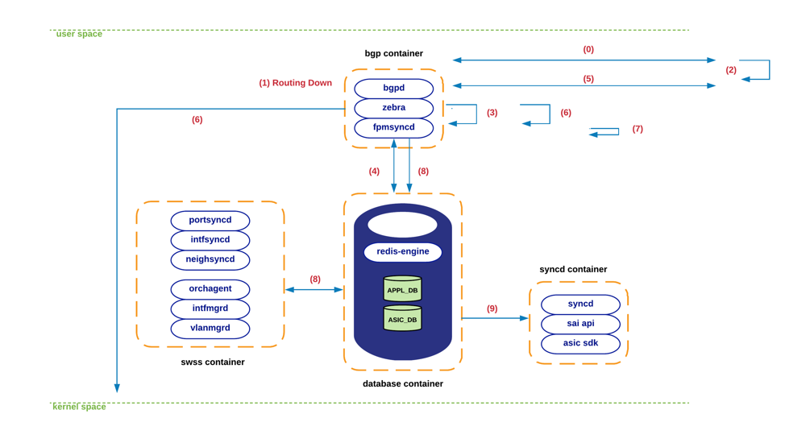
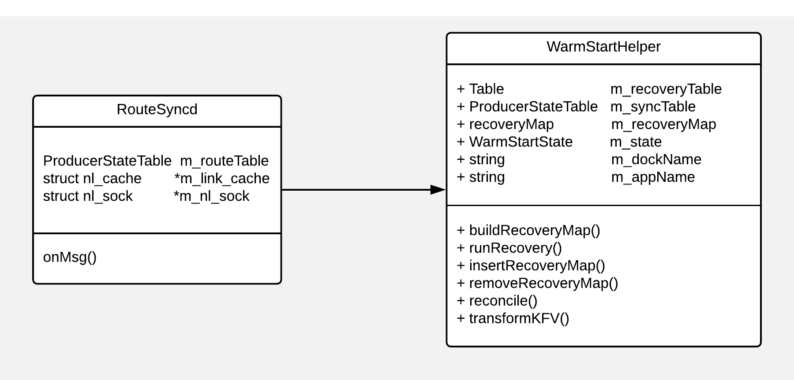
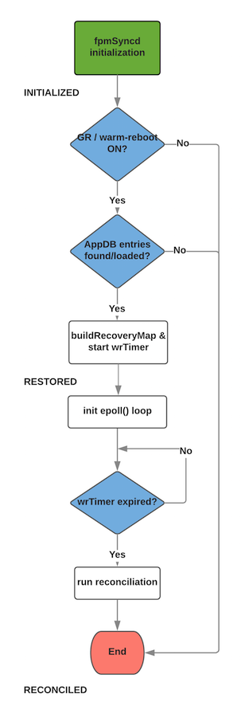
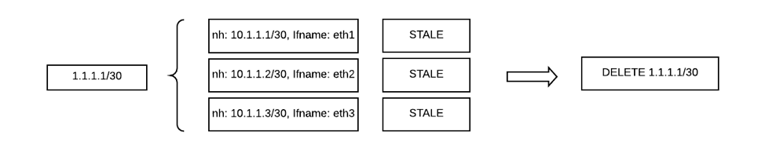
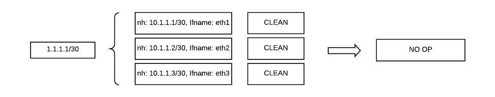
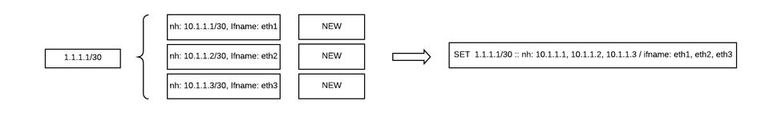
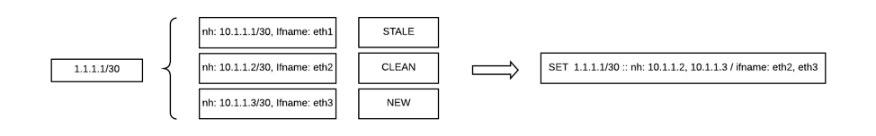
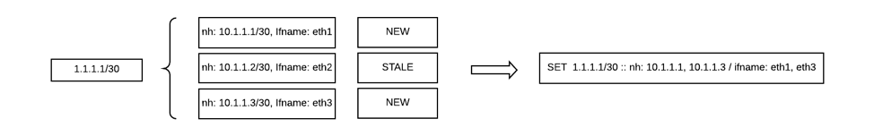
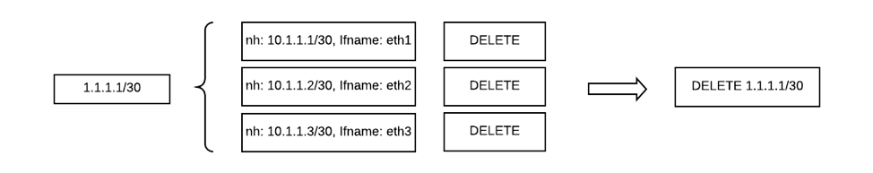

# SONiC Routing-Stack Warm-Reboot

<br>

## Table of Contents

1. [Introduction](#1.\ Introduction)
2. [Problem Statement](#2.\ Problem\ Statement)
3. [Scope](#3.\ Scope)
4. [BGP Graceful-Restart Overview](#4.\ BGP\ Graceful\-Restart\ Overview)
5. [High-level Design](#5.\ High-level\ Design)
6. [Low-level Design](#6.\ Low\-level\ Design)  
6.1. [WarmStartHelper Class Overview](#6.1.\ WarmStartHelper\ Class\ Overview)  
6.2. [Route Reconciliation Logic](#6.2.\ Route\ Reconciliation\ Logic)  
6.3. [Configuration / CLI additions](#6.3.\ Configuration\ /\ CLI\ additions)
7. [Known limitations / Next steps](#7.\ Known\ limitations\ /\ Next\ steps)
8. [Unit Testing](#8.\ Unit\ Testing)


<br>

## 1. Introduction

This document tackles the routing-stack restartability problem in SONiC NOS and proposes a solution to address this issue.

Within the context of this document we make use of *graceful-restart* and *warm-reboot* terms interchangibly to refer to the routing-stack restartability item being discussed. 

<br>

## 2. Problem Statement

Network elements with fully decoupled control and forwarding planes are potentially capable of preventing traffic disruption during routing-restarting events. In these scenarios, the desired behavior is to minimize the negative effects that a routing process can inflict in the rest of the network while being restarted (e.g. docker bgp restart).

There are two main goals expected out of any graceful-restart implementation:

- No forwarding-plane update: Transient state should not be exposed to forwarding components.
- No control-plane update: Transient state should not be advertised to adjacent-peers&#39; neighbors (second-degree neighbors).

The first goal is accomplished within the boundaries of the device whose control-plane is being impacted (**restarting** node), whereas the second one is mainly tackled on the adjacent-nodes (**receiving** or **gr-helper** end).


<br>

## 3. Scope

Even though this document attempts to provide a solution to the warm-restartability problem of SONiC&#39;s routing-stack as a whole, in reality, there are various limitations that reduce the scope of this exercise as indicated below:

- Today, SONiC only supports BGP routing-protocol, so the solution being presented here will be limited to this protocol.

- Graceful-restart (GR) functionality requires interaction with neighbor-peers, so these ones are expected to support the &#39;gr-helper&#39; feature associated to the routing-protocol being utilized. In our specific case, our assumption is that these peers are fully supporting BGP&#39;s gr-helper functionality for both IPv4 and IPv6 AFIs.

- Neither FRR nor Quagga fully support the &#39;restarting&#39; features mentioned in [rfc4724][1]. The Forwarding-bit (F-bit) is generated, but no warranties are really offered by neither bgpd nor zebra of being able to hold the routing-state during GR&#39;s restart-interval. At this point we will not attempt to fix this issue by extending any of the routing-stacks. For now, the scope of the present work will be contained within the SONiC layers. Please refer to **next-steps** section for more details.

<br>

## 4. BGP Graceful-Restart Overview

As described in [rfc4724][1], BGP implementations rely on Graceful-Restart capability to allow BGP speakers to express their ability to preserve forwarding state during BGP restart events. Rfc4724 makes use of the main following elements to accomplish this goal:

- Restart flags: Within this field the most-significant bit (R-bit) serves to indicate that a BGP speaker has been restarted.
- Restart time:  The estimate time, in seconds, that it will take for a restarting BGP peer to re-establish its session.
- Address-family flags: The most-significant bit of this field (F-bit) serves to indicate whether the forwarding state for routes that were advertised with the given AFI and SAFI, has indeed been preserved during the previous BGP restart.

Whenever a GR-capable speaker detects the termination of a TCP session associated to a restarting BGP peer, this one is expected to iterate through all the prefixes previously received from the affected peer, and mark those entries as **stale**. Right after, a timer must be initiated to give the restarting peer a chance to re-establish its session. The amount of time to wait should match the &#39;restart-time&#39; previously advertised by the affected speaker.

Should the restarting peer re-establish its session within the allotted window, the receiving speaker should just clear the stale flags. No bgp-update is required in this case as no modification has been produced to the routing state. This action should be only possible if all these conditions are met:

- The graceful-restart-capability is sent by the restarting peer.
- The graceful-restart-capability sent by the restarting end includes the AFI/SAFI associated to the routing-state to be exchanged by both peers.
- The F-bit for the associated AFI/SAFI is properly set by the restarting peer.

On the other hand, if the remote-peer is unable to re-establish its session within the restart-timer interval, or if any of the above requirements is not fully satisfied, the receiving speaker should then eliminate all the prefixes previously marked as stale, and proceed to send bgp-updates to its other peers to withdraw these routes.

Another important aspect to highlight is that a receiving speaker will only execute the above logic (i.e. act as &#39;gr-helper&#39;) if the TCP pipeline is perceived as broken. In other words, if the TCP session is gracefully terminated as a consequence of a BGP notification-message, the regular BGP/TCP session-termination procedures will be followed. This imply that the state previously advertised by the restarting peer will be right away eliminated from the receiving peer.

<br>

## 5. High-level Design

In a nutshell, the design presented in this document relies on two main building-blocks: 1) a GR-capable BGP implementation with full support of gr-helper feature and (at least) partial support of gr-restart functionality, and 2) a SONiC-specific logic in charge of reconciliating the &#39;old&#39; and the &#39;new&#39; state collected during routing-stack rebooting incidents.

Even though there are some subtleties that are yet to be mentioned (see **known-limitations** section further below), the BGP-GR main requirements are those that have been already exposed in the previous section. In regards to the reconciliation requirement, we will make use of **fpmSyncd** daemon to host this logic. In our opinion, this is the most natural component (after the routing-stack) to carry out this task as it seats right between bgpd/zebra and SONiC&#39;s SwSS entry points, and as such, it&#39;s capable of detecting fpm-client&#39;s restarting events.

Upon establishment of an fpm-client (re)connection, fpmsyncd will initiate a sequence of steps to ensure that the forwarding-plane is updated on a timely, controllable and deterministic fashion.

The following diagram provides a high-level description of the typical sequence of steps involved in the graceful-restart cycle:


  1. A BGP session is initially established with GR-capabilities turned on.

  2. zebra & bgpd processes are restarted. It is important to highlight that right when this happens the routing-state previously pushed to the kernel (by zebra) will be eliminated. See more on this point further below when we discuss the known-limitations of this solution. On the other hand, the AppDB routing-state is kept untouched.

  3. The receiver side detects the broken TCP-session and proceeds to initiate the gr-helper logic described above. Neither control nor forwarding planes are updated on the receiver side.

  4. Upon zebra coming up it will attempt to establish a TCP connection with fpmSyncd socket.

  5. Once zebra connectivity is up, a new fpmSyncd-specific restart-timer (wrTimer) is initiated in fpmSyncd. This new timer has a strict correlation with the BGP restart-timer previously discussed, however, this one is configured through a different interface and carries slightly different semantics (more on this later). Syncd will now request a dump of all the routing-state previously pushed to AppDB. Upon arrival, all these route/next-hop tuples will be marked as **stale** within fpmSyncd&#39;s data-structures.

  6. In parallel with the above, bgpd will establish connectivity with all its remote peers. The R-bit and F-bit will be advertised to request gr-helper functionality from its bgp neighbors.

  7. Eventually, the routing-state advertised by its peers will reach zebra, which will proceed to disseminate this information to both kernel and fpmSyncd. Notice that till this time there won&#39;t be any BGP routing-state in kernel (see point 1. above).

  8. Assuming that the fpmsyncd&#39;s restart-timer has not expired yet, fpmsyncd will push this state into the same data-structures where all AppDB state previously went in. The route/next-hop tuples that fully match the existing entries are marked as **clean**. This process will continue till fpmsyncd&#39;s restart-timer expires, at which point the route-state-reconciliation process will take place to update the routes in AppDB that require it (see more details on route-reconciliation process in low-level design section).

  9. Any routing-state change detected during reconciliation process will be pushed down to AppDB, and from here it will follow the usual path towards orchAgent.

  10. Once in orchAgent this new state will make its way into sairedis and AsicDB to update the forwarding-plane.

<br>




<br>

## 6. Low-level Design

As discussed in the previous section, most of the logic that will be implemented as part of this proposal will be invoked from within fpmsyncd. However, the actual logic will reside within an external class named **WarmStartHelper**. What follows is a detailed description of some of the changes that will be required to meet the high-level-design elements presented above.

Upon returning from the accept() blocking call, and before transitioning to the usual epoll() event-loop, fpmsyncd will make a brief pause to collect all the routing state held in AppDB. This state will be dumped to a temporary data-structure that is fundamental to the operation of the routing warm-reboot functionality. We will be covering these data-structs and their peculiarities further below.

Once this state-collection phase is completed, fpmsyncd will proceed to execute its event-loop. The difference though, is that right before doing so, we will introduce a new file-descriptor associated to a timer (making use of timerfd() libc routines/syscalls through SelectableTimer class), which will be utilized to track the time elapsed since the fpm-client (zebra) established its connection.

This timer that we are eluding to will run on an asynchronous fashion, meaning that it will not block fpmsyncd&#39;s event-loop, which will be needed to handle any message coming from the routing-stack.

At certain point in time, once bgpd commences to establish sessions with its remote peers, new routing-state will start to arrive to fpmsyncd. Even though rfc4724 dictates that the restarting router should defer the route-selection process (and forwarding-plane updates) till it receives an EoR from all the peers that have advertised GR-capabilities, in reality, today, neither FRR nor Quagga fully provide that functionality. In Quagga's case there is no even a possibility of relying on "update-delay" knob, which could potentially help us to reduce the complexity of the reconciliation logic presented in this document (refer to **known-limitations** sections for more details).

That&#39;s all to say that the present solution must be capable of dealing with routing-state received in a disaggregated fashion. For example, the refreshed state for an ecmp-prefix &quot;1.1.1.1/32&quot; and nhs &quot;10.1.1.1, 10.1.1.2&quot;, could arrive to fmpsyncd in different messages such as: 1) prefix &quot;1.1.1.1/32&quot; nh &quot;10.1.1.1/32&quot;, and 2) prefix &quot;1.1.1.1/32&quot; nh &quot;10.1.1.1, 10.1.1.2&quot;.

Another very likely possibility is to receive ecmp-paths in a random sequence attending to the order in which bgp sessions have been re-established.  Let&#39;s look at an example of what we mean by that:

  - At time T0, the following prefixes are stored in AppDB:

		1.1.1.0/24 – nh: 10.1.1.1, 10.1.1.2 – if: eth1, eth2
		2.2.2.0/24 – nh: 10.1.1.1, 10.1.1.2, 10.1.1.3 – if: eth1, eth2, eth3
		3.3.3.0/24 – nh: 10.1.1.1 – if: eth1

  - At T1 bgpd/zebra restarts

  - At T2 fpmsyncd receives the refreshed state from zebra, but this time zebra pushes the routing-state down in a slightly different manner – notice the different ordering in the **nh** and **if** elements:

		1.1.1.0/24 – nh: 10.1.1.2, 10.1.1.1 – if: eth2, eth1
		2.2.2.0/24 – nh: 10.1.1.2, 10.1.1.1 – if: eth2, eth1
		3.3.3.0/24 – nh: 10.1.1.1 – if: eth1

In the above scenarios we want the equivalent state obtained from AppDB and the one coming from Zebra to fully match; otherwise we would end up inserting duplicated entries into the reconciliation buffer, which would traslate into unnecesary updates to forwarding components.


<br>


## 6.1. WarmStartHelper Class Overview

To cope with the potential problem just described, the data-structures elected to represent this interim state, should be flexible enough to identify all the possible combinations in which the routing-state may arrive. In consequence, the elected data-structure must be capable of imposing a strict ordering of the elements being stored, so that a deterministic comparison can be performed at reconciliation time between the &#39;old&#39; state obtained from AppDB and the &#39;new/refreshed&#39; one received from north-bound applications.

These are the proposed data-structures:

```
    /*
     * RecoveryMap types serve as the buffer data-struct where to hold the state
     * over which to run the reconciliation logic.
     */
    using fvRecoveryMap = std::map<std::vector<FieldValueTuple>, fvState_t, fvComparator>;
    using recoveryMap = std::unordered_map<std::string, fvRecoveryMap>;
```


Notice that the information being stored in each **fvRecoveryMap** record is a regular **FieldValueTuple** vector, which fully matches the common format utilized by all SONiC applications to represent state. In other words, there is no application-specific object to represent routing state, so the functionality being proposed in this document can serve any other north-bound application -- fpmsyncd is just a first example.

Within the context of an fvRecoveryMap entry, each FieldValueTuple vector will have an associated state: **fvState\_t**. We will touch upon these states later on when we describe our reconciliation logic.

```
    /* State of collected fieldValue tuples */
    enum fvState_t
    {
        INVALID = 0,
        STALE   = 1,
        CLEAN   = 2,
        NEW     = 3,
        DELETE  = 4
    };
```


The above data-structures and types will be contained within a class that will be offered to those north-bound applications interested in graceful-restart/warm-reboot capabilities. For the specific case of fpmsyncd application, the following UML diagram describes the simple &#39;association&#39; relationship to be utilized by north-bound applications, as well as the main components of this new class:




We will make use of the existing Table class capabilities to collect all the state from AppDB. This is precisely the purpose of **m\_recoveryTable** data-member. The 'ProducerState' structure associated to this table is being tracked by **m\_syncTable** member, which will allows us to push state back to AppDB.

The **m\_recoveryMap** member will serve as a temporary buffer where to store all the routing-state; both the &#39;old&#39; (existing) state as well as the &#39;new&#39; (refreshed) one will be held here till reconciliation process is launched, which will only happen upon expiration of the fpmsynd restart-timer (wrTimer). This buffer is expected to be depleted by the time the reconciliation process concludes.

As their names imply, the **m_dockName** and **m_appName** members hold the docker and the specific application requesting warm-reboot capabilities. This state is requested when interacting with the more abstracted WarmStart class. For more details about the general WarmStart class please refer to this [doc][2].

The **m\_state** member keeps track of the warm-reboot FSM states exposed by the WarmStart class. We are caching this state in this variable to prevent unnecesary I/O towards our data-stores. What follows is a brief description of the semantics that each of these FSM states holds when applied to fpmSyncd's case. There are only three states currently utilized:

  - INITIALIZED: State to which WR-FSM transitions to right after fpmsyncd initializes or whenever fpm-client (zebra) connection is re-established. If WR feature were to be disabled at both system-level and at FPM docker-level, then WR logic will not kick in and FSM will be kept in INITIALIZED state. <br>

  - RESTORED: FSM transitions to this state right after all AppDB entries are loaded from the redis-engine. If no entry were to be found (system boot-up scenario), the FSM will transition directly to RECONCILED state.<br>

  - RECONCILED: FSM transitions to this state in two possible scenarios:
    - During loading phase if no entries were to be found in AppDB (i.e. system boot-up scenario).
    - Upon termination of the reconciliation process, which is initiated right after fpmsyncd&#39;s restart-timer expires.


The following diagram describes how FpmSyncd's main-loop is adjusted to accomodate these new warm-reboot states:

<br>



<br>

## 6.2. Route Reconciliation Logic

As previously mentioned, the data-structures elected to execute the reconciliation logic are application-agnostic, so even though we are making use of routing-information to describe this process, actually this same logic would apply to any other north-bound application.

Most of the route-reconciliation logic will revolve around the recoveryMap data-structure seen in the previous section. This data-structure will be originally populated with a dump of all the AppDB pre-existing state, which at **RESTORED** WR-FSM stage, will be marked as **stale** entries.

As the refreshed state is gradually received from bgp peers, this one will replace the matching entries in the recoveryMap, which in this case will be marked as **clean**. If a new route-entry were to be received from any of the peers, this one will be also dumped to the recoveryMap; however, in this case the route will be marked as **new**.

Upon expiration of fpmsyncd&#39;s restart-timer, a reconciliation process will be initiated to ensure that all the routing-state in the system is fully consistent. This reconciliation process will start by iterating through every single entry in the recoveryMap, and for each of this, the following logic will be executed:

<br>

  1. An element in the recoveryMap with all its entries in the fvRecMap showing as STALE, will be eliminated from AppDB.




  2. An element in the recoveryMap with all its entries in the fvRecMap showing as CLEAN, will have a NO-OP associated with it -- no changes in AppDB.




  3. An element in the recoveryMap with all its entries in the fvRecMap showing as NEW, will correspond to a brand-new prefix, and as such, will be pushed to AppDB.




  4. An element in the recoveryMap with some of its entries in the fvRecMap showing as CLEAN, will have these CLEAN entries, along with any NEW one, being pushed down to AppDB.




  5. An element in the recoveryMap with some of its entries in the fvRecMap showing as NEW, will have these new entries, along with any CLEAN one, being pushed to AppDB.




  6. An element in the recoveryMap with all of its entries in the fvRecMap showing as DELETE, will have these entries being eliminated from AppDB. Notice that entries marked as DELETE are a clear indication of a prefix-deletion message being generated by Zebra. This could only happen if bgpd were to receive bgp-withdrawals for all the paths associated to a given prefix. In all other occasions (i.e. individual bgp-path removals, bgp-path-updates, new bgp-prefix), zebra would encode the netlink-message as a &#39;set&#39; operation so the associated state would show up with a value different than DELETE.




Upon conclusion of the reconciliation process, no fvRecMap elements nor recoveryMap entries should be left in the grHelper object. At this point the restarting north-bound application and SwSS components should be fully in-sync in regards to routing-state.

<br>

## 6.3. Configuration / CLI additions

FRR currently exposes a CLI to configure BGP graceful-restart timer, but that does not apply to Quagga which will need to be extended to provide this functionality.


```sonic# (config-router)# bgp graceful-restart restart-time <min> <seconds>```


As previously mentioned, this is a BGP-specific timer utilized to signal bgp&#39;s restart-interval to the remote bgp peers. This timer has no bearing beyond the scope of FRR/Quagga stack.

User should keep in mind IETF&#39;s best-practices in this regard: graceful-restart timer should be set to a value less than or equal to the hold-time carried in the Open message. By default, FRR stack sets a default value of 120 seconds.

As described in previous sections, there is a secondary timer utilized to initiate the reconciliation process (wrTimer). It is important to highlight the need to set this timer to a value equal to, or slightly higher, than the above bgp timer, as ideally, we want to run the reconciliation phase once that all the refreshed-state has been received/processed by the routing stack. If we were to run the reconciliation logic before bgp is fully done re-learning state, we would be partially defeating the purpose of our warm-reboot feature as we could potentially push unnecessary/transient state down to SwSS layers.

The interval denoted by this second timer can be explicitly configured for each warm-reboot-capable application. If no value is defined in configuration, our implementation will make use of a default value (e.g. 120 seconds for routing applications). This timer will be configurable though a CLI and its state will be held in configDB as described in the [SwSS schema][3] documentation.

**TODO: provide CLI command for wrTimer**

<br>

## 7. Known limitations / Next steps

<br>

**Kernel&#39;s routing state**

As previously discussed, one of the known-issues with the solution presented above is the lack of graceful-restart functionality for the kernel state. The routing-state present in the kernel is wiped out the moment that zebra process is restarted, and this one is not re-populated till routing state is refreshed from remote peers. During this short interval, traffic originated from the host system towards destinations that rely on just-eliminated-routes, will be dropped (i.e. ping, traceroute, etc).

Even though FRR/Quagga offer certain degree of functionality to conserve kernel&#39;s routing-state (zebra&#39;s -k -r flags), and this state is properly consumed by zebra upon reboot, in reality, there is not much that zebra can do today with this recovered state.

Ideally, we would like to see some logic within bgpd or zebra to prevent the first one from re-pushing prefixes that are already existing in zebra and kernel. Today, in this scenario, the kernel ends up displaying duplicated entries reflecting both the &#39;old&#39; and the &#39;new&#39; state. In other words: zebra is not doing any reconciliation.

Some further scoping work is currently required to assess the effort needed to provide this functionality.

<br>

**Deferred best-path selection**

As stated in rfc4724, the &#39;restarting&#39; node must defer the route-selection process for an address-family till it receives an EoR message from all its GR-capable peers. Only after the route-selection process concludes is that the forwarding state should be updated, and the rib-out getting advertised to remote-peers.

Today, neither FRR nor Quagga fuly provide this functionality – route-selection process is carried out as soon as refreshed state arrives to the &#39;restarting&#39; node, which translates into unnecessary updates to Zebra and FPM.

The solution proposed in this document has been designed taking these &#39;extra&#39; updates into account – fpmSyncd will classify and aggregate all this state before pushing it down to SwSS. However, this approach cannot prevent transient suboptimal-routing problems derived from the fact that bgpd and fpmsyncd are running at different paces: bgpd in the &#39;restarting&#39; node could advertise a prefix that fpmsyncd hasn&#39;t pushed to the forwarding-plane yet. This could only happen for a short period of time till fpmsyncd timer expires and the reconciliation process is completed.

This timing issue can be solved with a relatively-small effort as latest FRR releases already offer an **update-delay** knob that could be easily applied to mitigate this problem. Quagga on the other hand does not offer any of this, so all the existing FRR logic would need to be ported first.

<br>

**Lack of end-to-end EoR functionality**

As previously discussed, FRR implementation properly generates EoR messages in bgp protocol exchanges. However, this EoR message dies in the bgpd process that receives it; meaning that EoR semantics are not passed down to Zebra.

By allowing the EoR message to reach Zebra and FPM, we would make use of this signal to kick off the reconciliation process, instead of exclusively relying on an fpmsyncd timer for this purpose.

In order for this strategy to succeed we would need to extend current routing-stacks to ensure that 1) an EoR message (per AFI/SAFI) is physical generated and properly parsed in both zebra and fpmsyncd, and 2) that no EoR signal is passed down to zebra till all gr-capable peers have advertised their corresponding EoR message. This last requirement has a clear correlation with the deferred best-path-selection item described above.

<br>

**Notification Message support for BGP-GR**

As mentioned above, as well as in [bgp-gr-notif draft][2], BGP graceful-restart procedures do not apply to sessions that are gracefully-terminated. That is typically the case when BGP Notification messages are involved, which takes place when a hold-time expires or when the user explicitly clears a BGP session.

In SONiC devices running FRR routing-stack, the execution of &quot;service bgp restart&quot; command triggers the expected GR-helper logic on the remote-ends, but any other (more graceful) termination of bgp/zebra processes would have bgp-helper devices discarding the previously-learned state and spreading transient state across the routing domain.

In consequence, we believe that this small extension should be implemented as it provides a high-return on a relatively-minor investment.

<br>

## 8. Unit Testing

The following scenarios should be fully covered during unit-testing phase for both IPv4/unicast and IPv6/unicast AFIs/SAFIs.

  - Basic scenarios – no inconsistencies:
   - Single bgp peer
   - Various bgp peers (no ECMP)
   - Various bgp peers (ECMP)
   - Various bgp peers (non-ECMP + ECMP)

  - Moderate scenarios – adding inconsistencies:
    - Various bgp peers (no ECMP): Remove entries from a few of the peers right after restarting bgpd/zebra.
    - Various bgp peers (ECMP): Remove entries for a few of the ECMP routes right after restarting bgpd/zebra.
    - Various bgp peers (non-ECMP + ECMP): Repeat above test-cases for both non-ECMP and ECMP paths.
    - Various bgp peers (non-ECMP + ECMP + new paths): Repeat the above test-cases but adding new paths (both non-ECMP and ECMP prefixes).


- Scaling scenarios:

  - Repeat all the above test-cases making use 5K routes and up to 20K bgp-paths.


- Routing restarting scenarios:

  - Test scaling scenarios by restarting bgpd and zebra.
  - Test scaling scenarios by restarting bgpd, zebra and fpmsyncd.
  - Test scaling scenarios by restarting fpmsyncd.
  - Test scaling scenarios by restarting the entire BGP docker.


[1]:https://tools.ietf.org/html/rfc4724

[2]:https://github.com/Azure/SONiC/blob/gh-pages/doc/warm-reboot/SONiC_Warmboot.md

[3]:https://tools.ietf.org/html/draft-ietf-idr-bgp-gr-notification-15

[4]:https://github.com/Azure/sonic-swss/blob/master/doc/swss-schema.md


