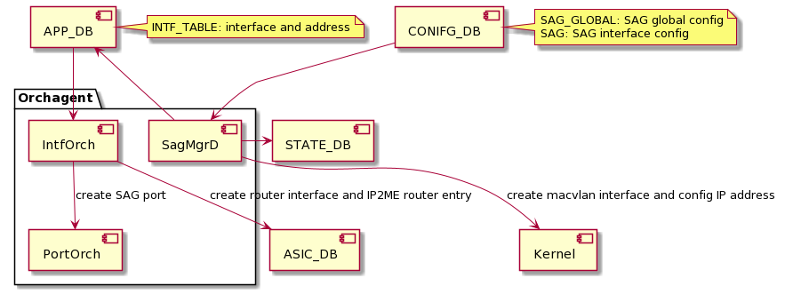
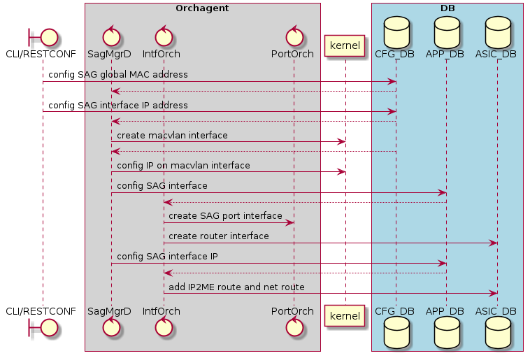

# SAG high level design for SONiC

# Table of Contents
- [SAG high level design for SONiC](#sag-high-level-design-for-sonic)
- [Table of Contents](#table-of-contents)
- [Revision History](#revision-history)
- [Abbreviations](#abbreviations)
- [Requirements Overview](#requirements-overview)
- [Modules Design](#modules-design)
  - [Config DB](#config-db)
    - [SAG Global Table](#sag-global-table)
    - [SAG Interface Table](#sag-interface-table)
    - [Config DB Schemas](#config-db-schemas)
  - [APP DB](#config-db)
    - [Interface Table](#interface-table)
    - [APP DB Schemas](#app-db-schemas)
  - [Orchestration Agent](#orchestration-agent)
    - [SagOrch](#sagorch)
    - [SagMgrD](#sagmgrd)
    - [IntfsOrch](#intfsorch)
  - [SAI](#sai)
- [Flows](#flows)  
- [CLI](#cli)
- [Test](#test)
  - [Functional Test Cases](#functional-test-cases)

# Revision History
|  Rev  | Date       |   Author    | Change Description                |
| :---: | :--------- | :---------: | --------------------------------- |
|  0.1  | 08/13/2021 |  Jimi Chen  | Initial version                   |

# Abbreviations
| Abbreviations | Description            |
|---------------|------------------------|
| SAG           | Static Anycast Gateway |

# Requirements Overview
Anycast gateway feature for EVPN/VXLAN is a default gateway addressing mechanism that enables the use of the same gateway IP address across all the leaf switches that are part of a VXLAN network.  
This ensures that every leaf switch can function as the default gateway for the workloads directly connected to it.  
The feature failitates flexible workload placement, host mobility and optimal traffic forwarding across the VXLAN fabric.  

This feature should be used together with VxLAN EVPN.  
It should always to configure VxLAN to make SAG work.  
SAG announces its IP and MAC only towards the host facing Ethernet ports but not towards the fabric (Overlay).  
As a result, the IP/MAC for the SAG is only seen and reachable from the host facing side and never from the fabric (Overlay) facing side.

The following is the requirements:  
* Support one global virtual MAC address on SAG interface
* Support multiple IPv4/IPv6 address on SAG interface
* Support global IPv4/IPv6 enable knob for SAG address

# Modules Design
## Config DB
### SAG Global Table
```
SAG_GLOBAL|IP 
  "gwmac": {{mac_address}} 
  "IPv4": {{enable}}
  "IPv6": {{enable}}
```
### SAG Interface Table
```
SAG|{{vlan_intf_name}}|IPv4
  "gwip@": {{ipv4_list}}
SAG|{{vlan_intf_name}}|IPv6
  "gwip@": {{ipv6_ilst}}
```

### Config DB Schemas
```
; Defines schema for SAG configuration attributes
key                                   = SAG_GLOBAL|IP                 ; SAG global configuration
; field                               = value
gwmac                                 = mac_address                   ; global anycast gateway MAC address
IPv4                                  = enable/disable                ; enable anycast gateway IPv4 address or not
IPv6                                  = enable/disable                ; enable anycast gateway IPv6 address or not
	  
```
## APP DB
### Interface Table
```
INTF_TABLE:{{intf_name}}
  "mac_addr": {{mac_address}}

INTF_TABLE:{{intf_name}}:{{ip_prefix}}
  "scope": {{addr_scope}
  "family": {{ip_family}}
```
### APP DB Schemas
```
; Defines schema for SAG configuration attributes
key                                   = INTF_TABLE:sag_name           ; SAG interface 
; field                               = value
mac_addr                              = mac_address                   ; global anycast mac MAC address

key                                   = INTF_TABLE:sag_name:ip_prefix ; SAG IP address
; field                               = value
scope                                 = global/local/host             ; IP address scope
family                                = IPv4/IPv6                     ; IP address family
```

## Orchestration Agent
Following orchagents shall be modified. Flow diagrams are captured in a later section. 



### SagMgrD
SagMgrD creates the macvlan kernel interfaces on top of the vlan interface.  
SagMgrD waits for macvlan interface creation update in STATE_DB and updates the APP_DB INTF_TABLE with the macvlan interface name.
SagMgrD creates IP address on the SAG interface. 
SagMgrD gets the INTERFACE Table config to create route entry in SAI from APP_DB updates

### IntfsOrch
Add SagOrch as a member of IntfsOrch. IntfsOrch creates Router Interfaces based on interface table (INTF_TABLE). For SAG usecase, IntfOrch calls SagOrch API to handle router interface creation.

### PortOrch
Add SAG related port interface and corresponding attributes.
Also handle the port referenece count for the SAG port interface.

# SAI
There are no changes to SAI headers/implementation to support this feature. Existing SAI router interface APIs are used to handle creating SAG interface. SAG needs to configure SAI_ROUTER_INTERFACE_ATTR_IS_VIRTUAL to true when creating router interface.

# Flows
The overall data flow diagram is captured below for all TABLE updates. 
 
 

# CLI
Commands summary

  - config sag mac_address add <mac_address>
      - Add global mac address for sag
  - config sag mac_address del <mac_address>
      - Remove global mac address for sag
  - config sag ipv4 enable
      - Enable the ipv4 knob for sag
  - config sag ipv4 disable
      - Disable the ipv4 knob for sag
  - config sag ipv6 enable
      - Enable the ipv6 knob for sag
  - config sag ipv6 disable
      - Disable the ipv6 knob for sag
  - config interface sag ip add <vlan_name> <ip_addr>
      - Create an sag interface and set ip on vlan interface
  - config interface sag ip del <vlan_name> <ip_addr>
      - Delete the ip on sag interface
  - show sag
      - Show global mac for sag
```
Static Anycast Gateway Information

MacAddress         IPv4    IPv6
-----------------  ------  ------
00:11:22:33:44:55  enable  enable
```
  - show sag ip
    - Show ipv4 on sag interface

```
Vlan Interface Name    IPv4 address/mask
---------------------  -------------------
Vlan100                1.1.1.254/24
```
  - show sag ipv6
    - Show ipv6 on sag interface

```
Vlan Interface Name    IPv6 address/mask
---------------------  -------------------
Vlan100                2001:1000::FE/64
```

# Test
## Functional Test Cases
1. Verify that SAG interface can be created with virtual MAC address in kernel.
2. Verify that SAG router interface is programmed to switch ASIC.
3. Verify that IPv4 address can be created on SAG interface in kernel.
4. Verify that IPv4 IP2ME route is programmed to switch ASIC.
5. Verify that packets destined to SAG IPv4 address are trapped to CPU - using ping utility.
6. Verify that IPv6 address can be created on SAG interface in kernel.
7. Verify that IPv6 IP2ME route is programmed to switch ASIC.
8. Verify that packets destined to SAG IPv6 address are trapeed to CPU - using ping utility.
10. Verify that neighbor learns the SAG virutial MAC address - using ping/ARP/ND utility.
11. Verify that SAG global IPv4/IPv6 enable/disable command can create/destroy all SAG IP address -using ping utility.
12. Verify that change SAG virtual MAC address when IP is configured first - using ping/ARP/ND utility.