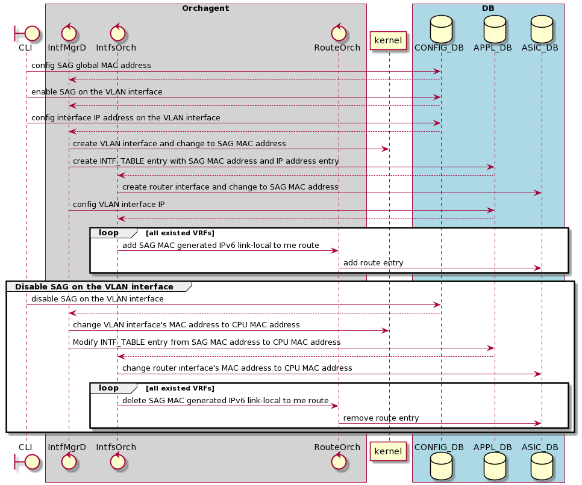

# SAG high level design for SONiC

# Table of Contents
- [SAG high level design for SONiC](#sag-high-level-design-for-sonic)
- [Table of Contents](#table-of-contents)
- [Revision History](#revision-history)
- [Scope](#scope)
- [Abbreviations](#abbreviations)
- [Overview](#overview)
- [Requirements](#requirements)
- [Architecture Design](#architecture-design)
- [High-Level Design](#high-level-design)
  - [sonic-swss-common](#sonic-swss-common)
  - [sonic-swss](#sonic-swss)
  - [sonic-utilities](#sonic-utilities)
  - [DB](#db)
  - [SAI API](#sai-api)
- [Configuration and management](#configuration-and-management)
- [CLI/YANG model Enhancements](#cliyang-model-enhancements)
  - [CLI](#cli)
  - [Yang model](#yang-model)
  - [Config DB Enhancements](#config-db-enhancements)
- [Warmboot and Fastboot Design Impact](#warmboot-and-fastboot-design-impact)
- [Restrictions/Limitations](#restrictionslimitations)
- [Testing Requirements/Design](#testing-requirementsdesign)
  - [System Test Cases](#system-test-cases)

# Revision History
|  Rev  | Date       |   Author    | Change Description                |
| :---: | :--------- | :---------: | --------------------------------- |
|  0.1  | 08/13/2021 |  Jimi Chen  | Initial version                   |
|  0.2  | 08/30/2021 |  Jimi Chen  | Update community review comments  |
|  0.3  | 10/20/2021 |  Jimi Chen  | Revise after implementation       |

# Scope 
This HLD extends SONiC to support static anycast gateway

# Abbreviations
| Abbreviations | Description            |
|---------------|------------------------|
| SAG           | Static Anycast Gateway |

# Overview
Anycast gateway feature for EVPN/VXLAN is a default gateway addressing mechanism that enables the use of the same gateway IP address across all the leaf switches that are part of a VXLAN network.  
This ensures that every leaf switch can function as the default gateway for the workloads directly connected to it.  
The feature failitates flexible workload placement, host mobility and optimal traffic forwarding across the VXLAN fabric.  

This feature is used together with VxLAN EVPN usually, it can also be used individually.  
In common use case, SAG announces its IP and MAC towards the host facing Ethernet ports but not towards the fabric.  
As a result, the IP/MAC for the SAG is only seen and reachable from the host facing side and never from the fabric facing side.

# Requirements
User can configure global virtual MAC address to apply on VLAN interfaces.   
Also provides a per VLAN interface's knob to determine if VLAN interface use this global virtual MAC address or system CPU MAC address.


# Architecture Design
The overall SONiC architecture will not be changed and no new sub-modules will be introduced.

# High-Level Design
## sonic-swss-common
sonic-swss-common's schema will be updated to include **SAG** define for the new table name.

## sonic-swss
sonic-swss's Intfs Orch and Intf Mgr will be updated to include a new handler for static anycast gateway configuration, and also handles new enable/disable field for VLAN interface in original handler.

The IP address configured on the VLAN interface is not changed.  
The VLAN interface will use static anycast gateway MAC address to replace CPU MAC address if static anycast gateway MAC address is specified and it's enabled on the VLAN interface.  
The enable/disable knob on the VLAN interface can let user to determine to use CPU MAC or static anycast gateway MAC address.

In IPv6 link-local address management, the system MAC generated IPv6 link-local to me route is added by RouteOrch in its initialization.  
If the MAC address is changed between system and SAG, we need to call RouteOrch's API to delete old MAC gerenated IPv6 link-local to me route and then add new MAC generated IPv6 link-local to me route.
The static anycast gateway on the VLAN interface will be disabled by default.

The following diagram describes the sequence between DBs and modules.

## sonic-utilities
sonic-utilities will be updated to offer the following CLI commands for the user
* Configure global static anycast gateway MAC address
* Enable/Disable to use static anycast gateway MAC address on the VLAN interface

## DB 
The CONFIG_DB will be updated to include a new **SAG**.  
This will have the following format:
```
### SAG
    ; SAG global configuration
    key    = "SAG|GLOBAL"
    ; field = value
    gwmac  = mac_address 

Example:
127.0.0.1:6379[4]> hgetall "SAG|GLOBAL"
1) "gwmac"
2) "00:11:22:33:44:0f"
```

It also add new field **static_anycast_gateway** to include in existing **VLAN_INTERFACE** table
This will have the following format:

```
Example:
127.0.0.1:6379[4]> hgetall "VLAN_INTERFACE|Vlan201"
1) "vrf_name"
2) "Vrf1"
3) "static_anycast_gateway"
4) "false"
```
# SAI API
There are no changes to SAI headers/implementation to support this feature.

# Configuration and management
# CLI/YANG model Enhancements

## CLI
**Add static anycast gateway MAC address**
```
config static-anycast-gateway mac_address add <mac_address>
```
* mac_address: mandatory, the virtual MAC address of static anycast gateway 

The format is in the following

```
admin@edgecore:~$ sudo config static-anycast-gateway mac_address add -h
Usage: config static-anycast-gateway mac_address add [OPTIONS] <mac_address>

  Add global static-anycast-gateway mac address

Options:
  -?, -h, --help  Show this message and exit.

Example:
admin@edgecore:~$ sudo config static-anycast-gateway mac_address add 00:11:22:33:44:0f
```

It doesn't allow to change SAG MAC via this command, the SAG MAC needs to be removed first.

**Delete static anycast gateway MAC address**

```
config static-anycast-gateway mac_address del <mac_address>
```
* mac_address: mandatory, the virtual MAC address of static anycast gateway

The format is in the following

```
admin@edgecore:~$ sudo config static-anycast-gateway mac_address del -h
Usage: config static-anycast-gateway mac_address del [OPTIONS] <mac_address>

  Delete global static-anycast-gateway mac address

Options:
  -?, -h, --help  Show this message and exit.

Example:
admin@edgecore:~$ sudo config static-anycast-gateway mac_address del 00:11:22:33:44:0f
```

**Enable static anycast gateway on VLAN interface**
```
config vlan static-anycast-gateway add <vlan_id>
```
* vlan_id: mandatory, the VLAN ID of the interface

The format is in the following

```
admin@edgecore:~$ sudo config vlan static-anycast-gateway add -h
Usage: config vlan static-anycast-gateway add [OPTIONS] <vlan_id>

  Enable static-anycast-gateway on VLAN interface

Options:
  -?, -h, --help  Show this message and exit.

Example:
admin@edgecore:~$ sudo config vlan static-anycast-gateway add 100
```

**Disable static anycast gateway on VLAN interface**
```
config vlan static-anycast-gateway del <vlan_id>
```
* vlan_id: mandatory, the VLAN ID of the interface

The format is in the following

```
admin@edgecore:~$ sudo config vlan static-anycast-gateway del -h
Usage: config vlan static-anycast-gateway del [OPTIONS] <vlan_id>

  Disable static-anycast-gateway on VLAN interface

Options:
  -?, -h, --help  Show this message and exit.

Example:
admin@edgecore:~$ sudo config vlan static-anycast-gateway del 100
```
**Display static anycast gateway configuration**
```
show static-anycast-gateway
```

The display format is in the following
```
admin@edgecore:~$ show sag
Static Anycast Gateway Information

MacAddress         
-----------------
00:11:22:33:44:55 
```

**Display enable/disable on the VLAN interface**
Add extra column to display the SAG enable/disable status 
```
show vlan brief
```

The display format is in the following
```
admin@edgecore:~$ show vlan brief
+-----------+----------------+---------------+----------------+-----------------------+-------------+------------------------+
|   VLAN ID | IP Address     | Ports         | Port Tagging   | DHCP Helper Address   | Proxy ARP   | Static Anycast Gateway |
+===========+================+===============+================+=======================+=============+========================+
|        10 | 192.10.10.1/24 | PortChannel02 | tagged         |                       | disabled    | enabled                |
+-----------+----------------+---------------+----------------+-----------------------+-------------+------------------------+
|       200 |                | Ethernet60    | untagged       |                       | disabled    | disabled               |
|           |                | PortChannel01 | tagged         |                       |             |                        |
|           |                | PortChannel02 | tagged         |                       |             |                        |
+-----------+----------------+---------------+----------------+-----------------------+-------------+------------------------+
```


**IP address configuration**
Use the the following existed IPv4/IPv6 command to configure and display on the VLAN interface, no new arguments or commands added. 
* config interface ip add <interface_name> <ip_addr> <default_gateway_ip_address>
* config interface ip del <interface_name> <ip_addr> <default_gateway_ip_address>
* show ip interfaces
* show ipv6 interfaces

## Yang model 
**sonic-static-anycast-gateway.yang**
Add new yang model to describe static anycast gateway configuration
```
container sonic-static-anycast-gateway {
    container SAG {
        container GLOBAL {
            description "static anycast gateway configuration";

            leaf gwmac {
                type yang:mac-address;
            }
        }        
    }
}

```
**sonic-vlan.yang**
Add **static-anycast-gateway** field under **VLAN_INTERFACE_LIST**, this field controls enable static-anycast-gateway on the VLAN interface or not.
```
...
list VLAN_INTERFACE_LIST {

    description "VLAN INTERFACE part of config_db.json with vrf";

    key "name";

    leaf name {
        type leafref {
            path /vlan:sonic-vlan/vlan:VLAN/vlan:VLAN_LIST/vlan:name;
        }
    }

    leaf vrf_name {
        type leafref{
            path "/vrf:sonic-vrf/vrf:VRF/vrf:VRF_LIST/vrf:name";
        }
    }

    leaf nat_zone {
        description "NAT Zone for the vlan interface";
        type uint8 {
            range "0..3" {
                error-message "Invalid nat zone for the vlan interface.";
                error-app-tag nat-zone-invalid;
            }
        }
        default "0";
    }

    leaf staic-anycast-gateway {
        description "Enable/disable static anycast gateway for the vlan interface";
        type boolean;
        default false;
    }
}
...

```

## Config DB Enhancements
The relevant changes have been described in HLD's DB sub-section.

# Warmboot and Fastboot Design Impact
No impacted by the changes.
# Restrictions/Limitations
For the router interfaces resources, it's the same as other IP address configure on the interface, and it can be monitored by CRM.  
Due to lack of router interfaces monitoring in current CRM implementation.  
It should be supported in other enhancement.

# Testing Requirements/Design
## System Test Cases
1. When global SAG MAC is configured and SAG is enabled on the VLAN interface
    * Verify that VLAN interface can be created with SAG MAC address in kernel.
    * Verify that VLAN router interface with SAG MAC address is programmed to switch ASIC.
    * Verify that IPv4 address can be created on the VLAN interface in kernel.
    * Verify that IPv4 IP2ME route is programmed to switch ASIC.
    * Verify that packets destined to SAG IPv4 address are trapped to CPU
    * Verify that IPv6 address can be created on the VLAN interface in kernel.
    * Verify that IPv6 IP2ME route is programmed to switch ASIC.
    * Verify that packets destined to SAG IPv6 address are trapped to CPU
    * Verify that host learns the SAG virutial MAC address
    * Verify that switch learns neighbor on the VLAN interface
2. When global SAG MAC is configured and SAG is enabled on the VLAN interface, disable SAG on the VLAN interface
    * Verify the VLAN interface's MAC change to CPU MAC address in kernel
    * Verify the VLAN router interface with CPU MAC address is programmed to switch ASIC
    * Verify that neighbor learns the CPU MAC address