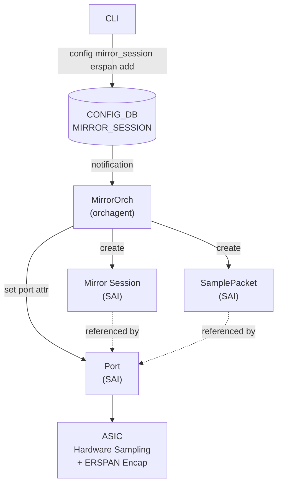
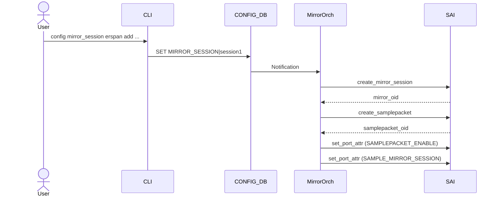
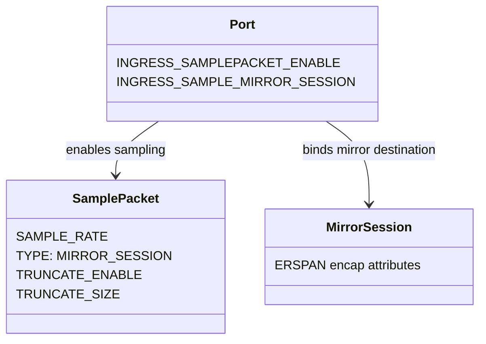

# Sampled Port Mirroring with Truncation High Level Design

### Rev 0.1

## Table of Contents

- [1. Revision](#1-revision)
- [2. Scope](#2-scope)
- [3. Definitions/Abbreviations](#3-definitionsabbreviations)
- [4. Overview](#4-overview)
  - [4.1 Problem Statement](#41-problem-statement)
  - [4.2 Current State](#42-current-state)
  - [4.3 Proposed Solution](#43-proposed-solution)
- [5. Requirements](#5-requirements)
- [6. Architecture Design](#6-architecture-design)
- [7. High-Level Design](#7-high-level-design)
  - [7.1 DB Schema Changes](#71-db-schema-changes)
  - [7.2 Orchagent Changes](#72-orchagent-changes)
  - [7.3 YANG Model Changes](#73-yang-model-changes)
- [8. SAI API](#8-sai-api)
- [9. Configuration and Management](#9-configuration-and-management)
  - [9.1 CLI](#91-cli)
  - [9.2 Show Command](#92-show-command)
- [10. Warmboot and Fastboot Design Impact](#10-warmboot-and-fastboot-design-impact)
- [11. Testing Requirements](#11-testing-requirements)

## 1. Revision

| Rev  | Date       | Author    | Change Description |
|:----:|:----------:|:---------:|:------------------:|
| 0.1  | 04/2026    | Janet Cui | Initial version    |

## 2. Scope

This document describes the high-level design for adding **per-port sampled mirroring** and **packet truncation** support to the existing ERSPAN (Enhanced Remote Switched Port Analyzer) port mirroring feature in SONiC.

The design enables users to configure a sampling rate on port mirror sessions so that only a statistical subset of packets is mirrored, reducing bandwidth consumption on the monitor port and the collector. Packet truncation further reduces bandwidth by mirroring only the first N bytes of each sampled packet.

## 3. Definitions/Abbreviations

| Term | Description |
|------|-------------|
| ERSPAN | Enhanced Remote Switched Port Analyzer — mirroring encapsulated in a GRE tunnel |
| SAI | Switch Abstraction Interface |
| ASIC | Application-Specific Integrated Circuit |
| SamplePacket | SAI object that defines packet sampling parameters (rate, type, truncation) |
| MirrorOrch | Orchagent module that manages mirror sessions |
| CoPP | Control Plane Policing |

## 4. Overview

### 4.1 Problem Statement

Current SONiC ERSPAN port mirroring mirrors **every packet in full** on the monitored port(s). At high line rates, this can:

- Exceed monitor port bandwidth: Mirroring every packet at full size with ERSPAN encapsulation overhead may cause mirror packet loss
- Overwhelm the collector: The collector may not have the capacity to process full line-rate mirrored traffic
- Waste bandwidth: Full-size copies of every packet are unnecessary when statistical sampling and packet headers are sufficient for monitoring purposes

Sampled mirroring solves this by only mirroring 1 out of every N packets (e.g., 1:50k), providing statistical visibility while keeping bandwidth consumption manageable. Packet truncation further reduces bandwidth by only sending the first K bytes (e.g., 128 bytes) of each mirrored packet, which is typically sufficient for header analysis.

### 4.2 Current State

| Feature | Supported | Notes |
|---------|:---------:|-------|
| ERSPAN mirror session | Yes | Full packet mirror with GRE encapsulation |
| Mirror policer | Yes | Rate-limit mirror traffic (bytes/sec) |
| **Sampled port mirroring** | **No** | **This HLD** |
| **Packet truncation** | **No** | **This HLD** Planned - SAI support June 2026 GA |

Currently, MirrorOrch creates a mirror session and binds it to a port using `SAI_PORT_ATTR_INGRESS_MIRROR_SESSION`, which mirrors **all** packets. There is no sampling or truncation capability.

### 4.3 Proposed Solution

Leverage the SAI `SamplePacket` object with `SAI_SAMPLEPACKET_ATTR_TYPE=SAI_SAMPLEPACKET_TYPE_MIRROR_SESSION` to enable per-port sampled mirroring. 

When `sample_rate` is configured, MirrorOrch will:

1. Create the mirror session 
2. **NEW**: Create a `SAI_OBJECT_TYPE_SAMPLEPACKET` with `SAI_SAMPLEPACKET_ATTR_TYPE=SAI_SAMPLEPACKET_TYPE_MIRROR_SESSION` and the specified sample rate
3. **CHANGED**: Bind to port using `SAI_PORT_ATTR_INGRESS_SAMPLEPACKET_ENABLE` and `SAI_PORT_ATTR_INGRESS_SAMPLE_MIRROR_SESSION` instead of the current `SAI_PORT_ATTR_INGRESS_MIRROR_SESSION`

When `sample_rate` is not configured (or 0), existing full-mirror behavior is preserved - the port is bound using `SAI_PORT_ATTR_INGRESS_MIRROR_SESSION` as before.

## 5. Requirements

| # | Requirement |
|---|-------------|
| R1 | Support configuring `sample_rate` on ERSPAN mirror sessions |
| R2 | When `sample_rate > 0`, mirror 1-in-N packets using hardware sampling |
| R3 | Support configuring `truncate_size` on ERSPAN mirror sessions |
| R4 | When `truncate_size > 0`, mirror only the first N bytes of each packet. Default truncation size is 128 bytes |
| R5 | Support per-port ingress sampled mirroring |
| R6 | When `sample_rate` and `truncate_size` are not configured, mirror session behaves the same as current full-packet mirroring |

## 6. Architecture Design

The following diagram shows the end-to-end control flow for sampled port mirroring with truncation:



The key change from existing mirror session flow is that MirrorOrch now creates an additional `SamplePacket` SAI object and uses different port attributes (`INGRESS_SAMPLEPACKET_ENABLE` + `INGRESS_SAMPLE_MIRROR_SESSION`) to bind sampling and mirroring to the port.

#### Sequence: Create Sampled Mirror Session



#### SAI Object Model



## 7. High-Level Design

### 7.1 DB Schema Changes

#### CONFIG_DB: `MIRROR_SESSION`

New optional fields:

| Field | Type | Default | Description |
|-------|------|---------|-------------|
| `sample_rate` | uint32 | 0 | Sampling rate. 0 = full mirror, N = mirror 1-in-N packets |
| `truncate_size` | uint32 | 0 | Truncation size in bytes. 0 = no truncation |

#### APP_DB: `MIRROR_SESSION_TABLE`

Same new fields propagated from CONFIG_DB.

#### ASIC_DB

When `sample_rate > 0`, a new `SAI_OBJECT_TYPE_SAMPLEPACKET` entry is created. Port attributes change from `INGRESS_MIRROR_SESSION` to `INGRESS_SAMPLEPACKET_ENABLE` + `INGRESS_SAMPLE_MIRROR_SESSION`.

#### STATE_DB

`sample_rate` and `truncate_size` persisted for warm reboot reconciliation.

### 7.2 Orchagent Changes

MirrorOrch is extended to manage the lifecycle of `SamplePacket` objects alongside mirror sessions:

- **Session activation** — When `sample_rate > 0`, create a `SamplePacket` object and bind to port via sampled mirror path. When `sample_rate == 0`, use existing full-mirror path (no change).
- **Session deactivation** — Unbind port attributes and remove `SamplePacket` object if it exists.
- **Session update** — Detect changes to `sample_rate` / `truncate_size` and update the `SamplePacket` object accordingly.
- **MirrorEntry** — Extended to track the `SamplePacket` OID and sampling configuration.

### 7.3 YANG Model Changes

Add two optional leaves to `sonic-mirror-session.yang`:

| Leaf | Type | Default | Description |
|------|------|---------|-------------|
| `sample_rate` | uint32 | 0 | Sampling rate (0 = full mirror) |
| `truncate_size` | uint32 | 0 | Truncation size in bytes (0 = no truncation) |

## 8. SAI API

The following SAI attributes are used for sampled port mirroring:

| SAI Attribute | Platform Support |
|---------------|-----------------|
| `SAI_SAMPLEPACKET_ATTR_SAMPLE_RATE` | ✅ Nvidia SPC5 |
| `SAI_SAMPLEPACKET_ATTR_TYPE = MIRROR_SESSION` | ✅ Nvidia SPC5 |
| `SAI_PORT_ATTR_INGRESS_SAMPLEPACKET_ENABLE` | ✅ Nvidia SPC5 |
| `SAI_PORT_ATTR_INGRESS_SAMPLE_MIRROR_SESSION` | ✅ Nvidia SPC5 |
| `SAI_SAMPLEPACKET_ATTR_TRUNCATE_ENABLE` | ✅ Nvidia SPC5 (June 2026 GA) |
| `SAI_SAMPLEPACKET_ATTR_TRUNCATE_SIZE` | ✅ Nvidia SPC5 (June 2026 GA) |

## 9. Configuration and Management

### 9.1 CLI

```bash
# Create ERSPAN session with sampling
config mirror_session erspan add <session_name> \
    <src_ip> <dst_ip> <dscp> <ttl> <gre_type> \
    [queue] [src_port] [direction] \
    [--policer <name>] \
    [--sample_rate <rate>] \
    [--truncate_size <bytes>]

# Example
config mirror_session erspan add session1 \
    10.0.0.1 10.0.0.2 8 64 0x6558 \
    0 Ethernet0 rx --sample_rate 50000
```

### 9.2 Show Command

```
admin@sonic:~$ show mirror_session

ERSPAN Sessions
Name       Status  SRC IP    DST IP    GRE     DSCP TTL SRC Port   Dir  Sample Rate  Truncate Size
---------  ------  --------  --------  ------  ---- --- ---------  ---  -----------  -------------
session1   active  10.0.0.1  10.0.0.2  0x6558  8    64  Ethernet0  rx   50000        0
session2   active  10.0.0.1  10.0.0.2  0x6558  8    64  Ethernet4  rx   0            0
```

## 10. Warmboot and Fastboot Design Impact

- `sample_rate` and `truncate_size` must be persisted in STATE_DB for warm reboot reconciliation
- The `SamplePacket` OID must be reconciled via ASIC_DB comparison during warm reboot

## 11. Testing Requirements

| Category | Test Case | Description |
|----------|-----------|-------------|
| Functional | Sampled mirror | Configure `sample_rate`, verify ~1/N packets mirrored |
| Functional | Truncation | Configure `truncate_size`, verify packets truncated |
| Functional | Full mirror | No `sample_rate` configured — verify all packets mirrored (backward compat) |
| Lifecycle | Create/Delete | Verify SAI objects created and cleaned up correctly |
| Lifecycle | Update rate | Change `sample_rate` on active session, verify update |
| Resilience | Warm reboot | Verify sampled session survives warm reboot |
| Resilience | Config reload | Verify sampled session restored after config reload |
