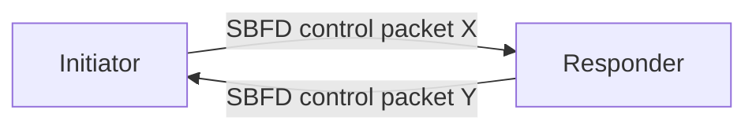
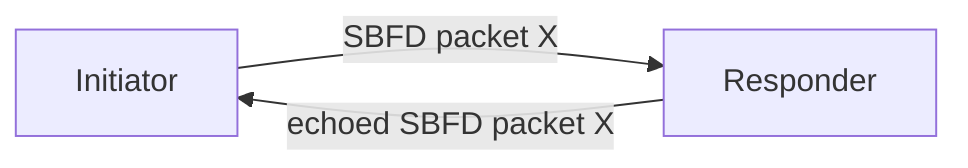
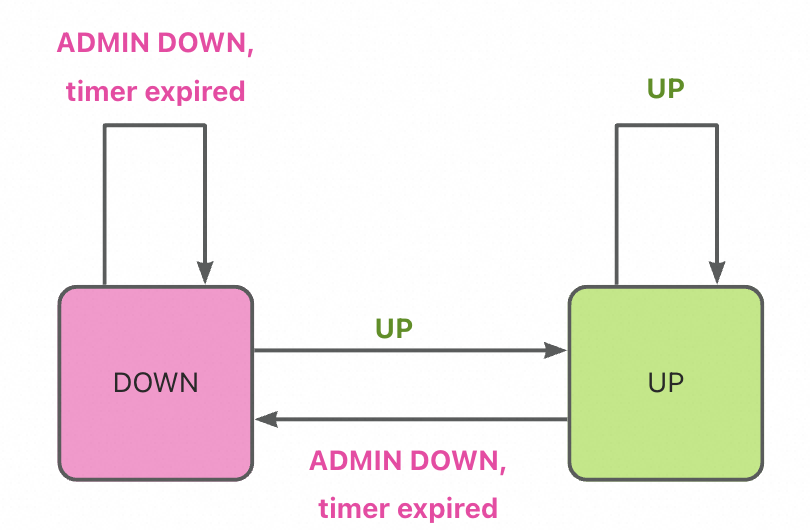
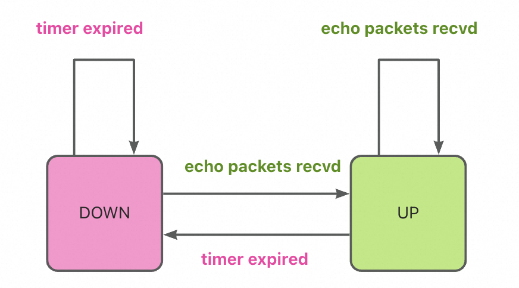
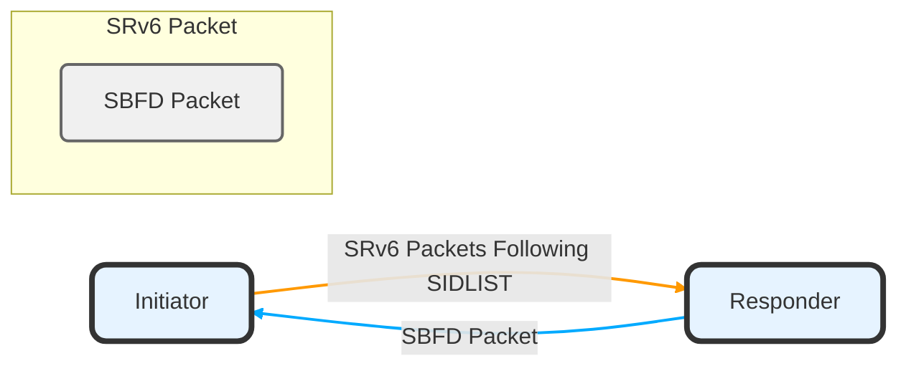
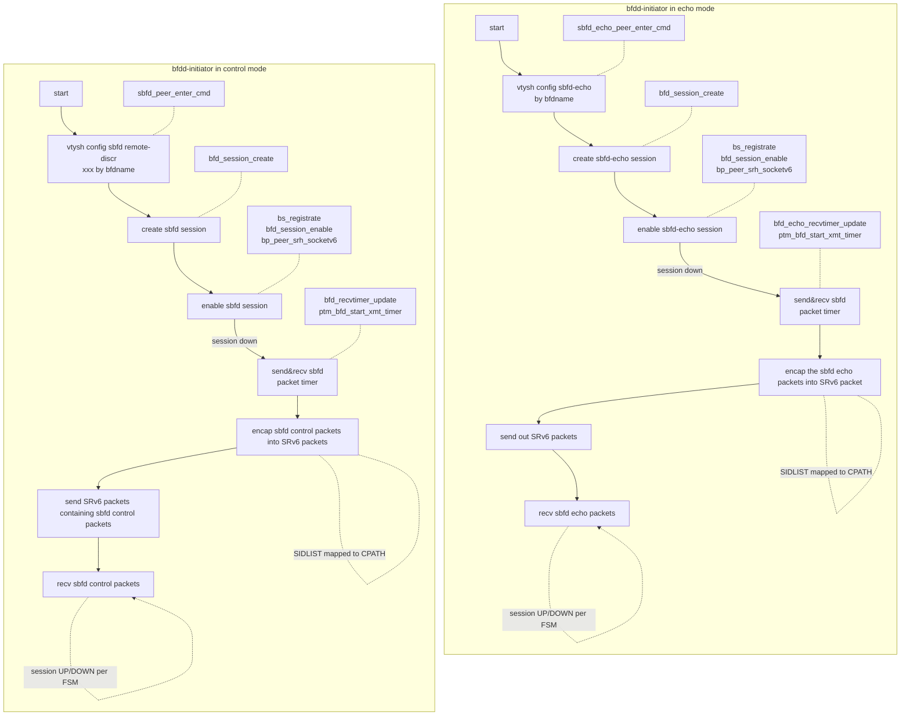
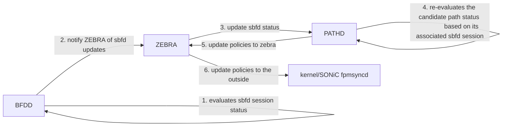
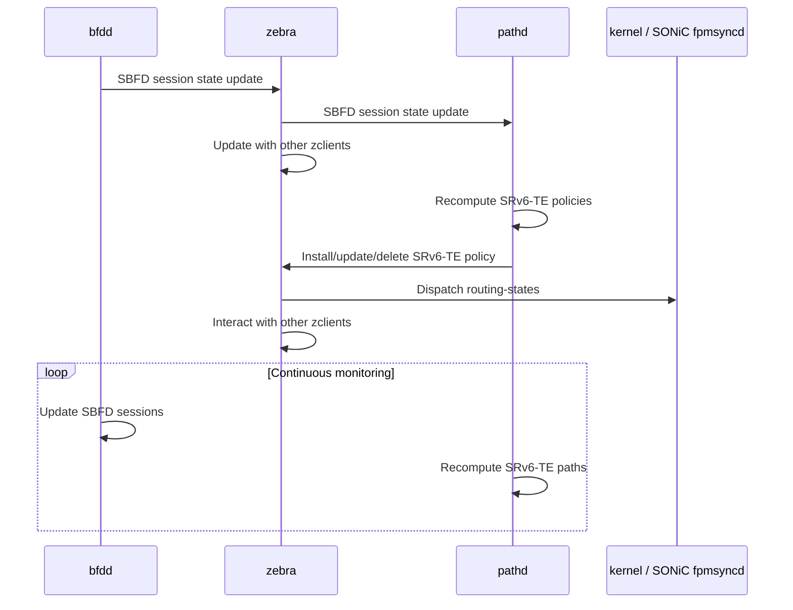

<!-- omit in toc -->
# SBFD and SRv6-Encapsulated SBFD in SONiC SR-TE

<!-- omit in toc -->
## Revision

| Rev |     Date    |       Author       | Change Description                |
|:---:|:-----------:|:------------------:|-----------------------------------|
| 1.0 | July  31 2024 |   Yijiao Qin     |  Base Version                    |

<!-- omit in toc -->
## Table of Contents

- [Overview](#overview)
  - [Scope](#scope)
  - [Requirements](#requirements)
- [Terminology](#terminology)
- [SBFD Basics](#sbfd-basics)
  - [Session Types and Operation Modes](#session-types-and-operation-modes)
  - [SBFD Session State Machines](#sbfd-session-state-machines)
    - [Control Packet Mode](#control-packet-mode)
    - [Echo Packet Mode](#echo-packet-mode)
- [SBFD Extension - SRv6 Encapsulation](#sbfd-extension---srv6-encapsulation)
  - [Extend Node Connectivity to Path Scope](#extend-node-connectivity-to-path-scope)
    - [Initiator sends out SRv6-encapsulated SBFD packets](#initiator-sends-out-srv6-encapsulated-sbfd-packets)
      - [Transmission socket with `IPv6_HDRINCL` option](#transmission-socket-with-ipv6_hdrincl-option)
      - [Store Path Information in SRv6 Header](#store-path-information-in-srv6-header)
      - [Both SRH and uSID supported](#both-srh-and-usid-supported)
    - [Responder SID configured to decapsulate the incoming SRv6 packets](#responder-sid-configured-to-decapsulate-the-incoming-srv6-packets)
- [\[BFDD\] SRv6-Encapsulated SBFD Configuration](#bfdd-srv6-encapsulated-sbfd-configuration)
  - [Configuration in Control Packet Mode](#configuration-in-control-packet-mode)
    - [Configure SBFDReflector](#configure-sbfdreflector)
    - [Configure SBFDInitiator with its pairing SBFDReflector](#configure-sbfdinitiator-with-its-pairing-sbfdreflector)
    - [DB Schema for tables of SBFD session in control packet mode](#db-schema-for-tables-of-sbfd-session-in-control-packet-mode)
  - [Configuration in echo packet mode](#configuration-in-echo-packet-mode)
    - [Only configure SBFDInitiator](#only-configure-sbfdinitiator)
    - [DB Schema for tables of SBFD session in echo packet mode](#db-schema-for-tables-of-sbfd-session-in-echo-packet-mode)
- [\[PATHD\] SBFD-Verified CPath Configuration](#pathd-sbfd-verified-cpath-configuration)
  - [1. Create an SR TE policy](#1-create-an-sr-te-policy)
  - [2. Create a candidate path in the policy](#2-create-a-candidate-path-in-the-policy)
    - [Specify the associated sbfd session by its name](#specify-the-associated-sbfd-session-by-its-name)
    - [SRv6 Policy DB Schema](#srv6-policy-db-schema)
- [Policy Verification Workflow](#policy-verification-workflow)
  - [Participating modules](#participating-modules)
  - [1. BFDD notifies ZEBRA of SBFD session changes via ZAPI](#1-bfdd-notifies-zebra-of-sbfd-session-changes-via-zapi)
  - [2. ZEBRA notifies PATHD of SBFD updates via ZAPI](#2-zebra-notifies-pathd-of-sbfd-updates-via-zapi)
  - [3. PATHD recomputes TE policies based on SBFD updates](#3-pathd-recomputes-te-policies-based-on-sbfd-updates)
    - [Timeline Illustration](#timeline-illustration)
- [Test](#test)

## Overview

This doc introduces SBFD features into SONiC and extends SBFD with SRv6 features to perform SRv6-TE policy verification.

An SRv6-TE policy consists of various candidate paths, in the form of SRv6 segment lists. However, the policy itself is unaware of the real-time path status. To help determine the best candidate path in the policy, we propose to integrate SBFD features into SONiC, and utilize SBFD sessions to verify the candidate paths in SRv6-TE policies.

### Scope

- Hardware offload of SBFD sessions not discussed here

### Requirements

- Decouple SBFD and SRv6-TE configuration
  - sbfd sessions could be configured without associated with a candidate path
  - a candidate path could be configured without an SBFD session
- Support verification of a color-only SRv6-TE policy without endpoint configuration
  - decouples the policy endpoint and the sbfd session peer address

## Terminology

|  Abbreviation       |          Description                    |
| ------------------------ | --------------------------------------- |
| HW                       | Hardware                                |
| SBFD                     | Seamless BFD                            |
| BFDD                     | Daemon for BFD Protocol  in sonic-frr   |
| SID                      | Segment ID                              |
| uSID                     | micro-segment identifier (compressed SID)|
| SRv6                     | Segment Routing over IPv6 Dataplane     |
| Cpath                    | Candidate Path                          |
| PATHD                    | Daemon for the installation and deletion of SR Policies|
| TE                       | Traffic Engineering                      |
| DIP                      | Destination IP Address                  |
| PTM                      | Portable Transport Module (abstraction layer for various transport protocols) |

## SBFD Basics

### Session Types and Operation Modes

SBFD peers, according to [rfc7880](https://datatracker.ietf.org/doc/rfc7880/), have two types: `SBFDInitiator` and `SBFDReflector`.

|  Terms                   |               Description                       |
| ------------------------ | ----------------------------------------------- |
| Initiator                | a network node hosting an SBFDInitiator         |
| Responder                | a network node hosting an SBFDReflector          |

SBFD peers set up a connection between them in either

- `Control Packet Mode`
  - `Initiator` sends out a control packet to `Responder`, with DIP referring to `Responder`.
  - `Responder` receives, constructs a response sbfd control packet, and send it back to `Initiator`.
    - The response packet carries a state value : `ADMINDOWN` or `UP`
      - based on whether `Responder` wants to shutdown the connection or keep it on



- or `Echo Packet Mode`
  - Initiator sends out an echo packet to Responder, but DIP refers to its own address.
  - Responder receives the packet but it would not process the packet in control plane
    - since packet DIP doesn't belong to it
    - it routes the received echo packet out, via its data plane



### SBFD Session State Machines

We implement a statelss `SBFDReflector` and a stateful  `SBFDInitiator` with a very simple state machine as below.

Negotiation overhead to set up a connection is quite light-weight, which makes SBFD sessions very scalable.

Initial state is `DOWN`.

#### Control Packet Mode

- If SBFDInitiator doesn't receive the response packet in time, session is `DOWN`.
- If SBFDInitiator receives the response packet in time
  - reponse state is `ADMINDOWN`, session goes `DOWN`.
  - reponse state is `UP`, session goes `UP`.

<figure align=center>
  
</figure>

#### Echo Packet Mode

- If SBFDInitiator doesn't receive the echoed packet in time, session is `DOWN`.
- If SBFDInitiator receives the echoed packet in time
  - reponse state is `ADMINDOWN`, session goes `DOWN`.
  - reponse state is `UP`, session goes `UP`.

<figure align=center>
  
</figure>

## SBFD Extension - SRv6 Encapsulation

### Extend Node Connectivity to Path Scope

SBFD peers periodically exchange packets to monitor their connections.

We set up an SBFD connection between the source and the destination node of a path, with the source node serving as `Initiator` and the destination node as `Responder`.

The communicated SBFD packets should also follow every exact hop in the path, from the source to the destination, which could be achieved by segment routing.

This requirement extends the node verification to the path verification.

#### Initiator sends out SRv6-encapsulated SBFD packets

`Initiator` encapsulates the outgoing SBFD packet into an SRv6 packet with a designated `SIDLIST`.



##### Transmission socket with `IPv6_HDRINCL` option

The transmission socket has `IPv6_HDRINCL` option set to enable the customization of ip header. Instead of using the header created by kernel by default, a designated `SIDLIST` is coded into the packet to instruct the packet `SR`.

##### Store Path Information in SRv6 Header

Set the SRv6 packet header SIDLIST to be the candidate path's SIDLIST, so that those packets would exactly be routed following the candidate path to be verified.

##### Both SRH and uSID supported

Either the SRH section or uSID in DIP section could be used to program the SIDLIST of a candidate path.

Below illustrated the operation flow of BFDD module running on the Initiator node in two modes:



#### Responder SID configured to decapsulate the incoming SRv6 packets

In this use case, `Responder` receives SRv6 packets, instead of SBFD packets.

Its locally configured SID corresponds to the last SID of the packet SIDLIST.

Hence, once SRv6 packets received, it would be triggered to look up its local SID table and invoke the corresponding SID behavior, which should be configured as - SRv6 packet decapsulation.

So that `SBFDReflector` eventually gets the encapsulated SBFD packet inside, and follow the basics mentioned previously.

## [BFDD] SRv6-Encapsulated SBFD Configuration

|  CLI Field |                    Description                   |
| ---------- | ------------------------------------------------ |
| local-addr | source ip address of the inner sbfd packets      |
| remote-addr| destination ip address of the inner sbfd packets |
| encap-mode | currently we only support srv6 encapsulation     |
| encap-data | such as SRH, encap outer SRC/DST field pair, etc..|

### Configuration in Control Packet Mode

#### Configure SBFDReflector

Configure an SBFDReflector session with a local ip address and a unique discriminator.

```bash
bfd reflector local-addr <reflector-ip-address> local-discr <reflector-discriminator>
```

#### Configure SBFDInitiator with its pairing SBFDReflector

```bash
bfd session <bfd-session-name> mode sbfd-control local-addr <initiator-ip-address> remote-addr <reflector-ip-address> remote-discr <reflector-discriminator> encap-mode srv6 encap-data <srv6-sipv6> <cpath-sidlist>
```

#### DB Schema for tables of SBFD session in control packet mode

```json
"BFD_REFLECTOR": {
  "<reflector-discriminator>":{
    "local_addr":"<reflector-ip-address>"
  }
},

"BFD_INITIATOR": {
  "<bfd-session-name>": {
      "encap_mode": "srv6",
      "encap_data": "<srv6-sipv6>|<cpath-sidlist>",
      "local_addr": "<initiator-ip-address>",
      "remote_addr": "<reflector-ip-address>",
      "remote_discr": "<reflector-discriminator>",
      "session_mode": "sbfd-control",
  }
},
```

### Configuration in echo packet mode

In echo mode, we don't need to configure a SBFDReflector session since the Responder only needs to echo back the packets via the data plane as normal.

#### Only configure SBFDInitiator

```bash
bfd session <bfd-session-name> mode sbfd-echo local-addr <initiator-ip-address> encap-mode srv6 encap-data <srv6-sipv6> <cpath-sidlist>
```

#### DB Schema for tables of SBFD session in echo packet mode

```json
"BFD_INITIATOR": {                                             
  "<bfd-session-name>": {
    "encap_mode": "srv6",
    "encap_data": "<srv6-sipv6>|<cpath-sidlist>",
    "local_addr": "<initiator-ip-address>",
    "session_mode": "sbfd-echo",
  }
},
```

Note: we take the echo packet mode in our actual deployment although configuration in control packet mode is also supported. 

## [PATHD] SBFD-Verified CPath Configuration

### 1. Create an SR TE policy

- A policy is distinguished by the pair of its color and endpoint.
- Color only policies are supported here, by specifying `endpoint` field as `::`

```sh
(config)# segment routing
(config-sr)# traffic-eng
(config-sr-te)# policy color <color> endpoint <endpoint>
```

### 2. Create a candidate path in the policy

#### Specify the associated sbfd session by its name

```bash
(config-sr-te-policy)# candidate-path name <path-name> preference <preference> seg-name <sisdlist-name> weight <weight> bfd-session <bfd-session-name>
```

#### SRv6 Policy DB Schema

`SRV6_POLICY` supports keys in two kinds of format:

- 2-tuples : `<endpoint>|<color>`
- 4-tuples : `<endpoint>|<color>|<preference>|<cpath_name>`

`<bfd-session-name>` is null if a candidate path is not protected by a sbfd session.

```json
"SRV6_POLICY": {
  "<endpoint>|<color>|<preference>|<cpath_name>": {
    "seg_name": "<sidlist-list-name>",
    "weight": "<weight>",
    "bfd_session": "<bfd-session-name>"
  }
},
```

## Policy Verification Workflow

### Participating modules



### 1. BFDD notifies ZEBRA of SBFD session changes via ZAPI

`SBFDReflector` is stateless. We only discuss from the perspective of `SBFDInitiator`. BFDD is the daemon running the `SBFDInitiator` session, it evaluates the SBFD sessions status according to the state machine mentioned above and notifies zebra of changes by invoking `zclient_send_message`.

### 2. ZEBRA notifies PATHD of SBFD updates via ZAPI

ZEBRA notifies all zclients subscribed to the event to invoke their registed handlers for this event.

`ZEBRA_INTERFACE_BFD_DEST_UPDATE`, which refers to the bfd session update event, is registered with ZEBRA by PATHD, and is mapped to a common handler `zclient_bfd_session_update`. Hence ZEBRA would notify PATHD to invoke this handler to process the bfd session updates.

### 3. PATHD recomputes TE policies based on SBFD updates

`zclient_bfd_session_update` API invokes `sbfd_state_change_hook` defined by PATHD, which implements the policy recomputation logic:

- if NOT protected by a SBFD session, a candidate path is `UP` by default
- if protected by a SBFD session, the status of a candidate path is determined by its SBFD session status
- PATHD reevaluates candidate path status based on SBFD session updates, and send SRv6TE POLICY with its UP cpaths to ZEBRA.
- if there is no UP cpath in POLICY, PATHD will notify Zebra to delete this POLICY.

#### Timeline Illustration



## Test

- We share the test suite with [PhoenixWing SRv6 Policy Feature](https://github.com/eddieruan-alibaba/SONiC/blob/eruan-srv6p/doc/srv6/srv6_policy.md#color-only-policy-use-case)