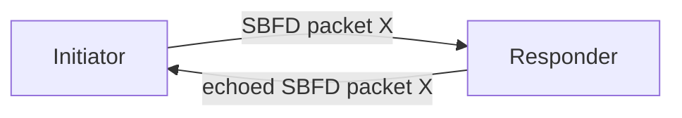
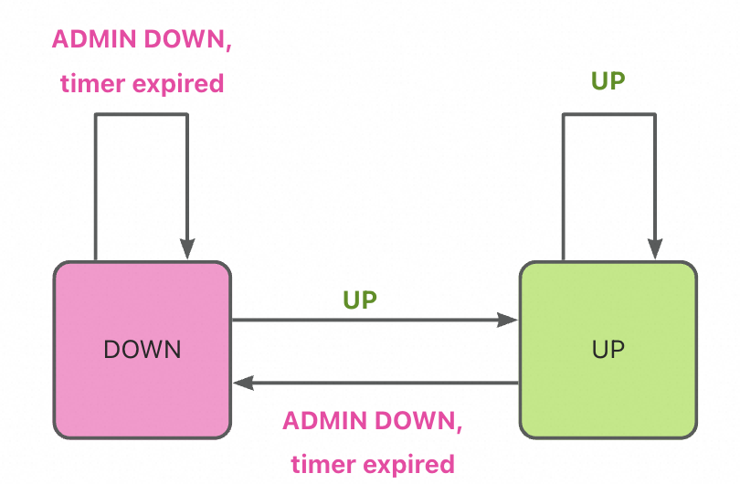
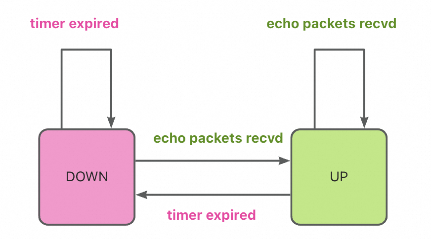
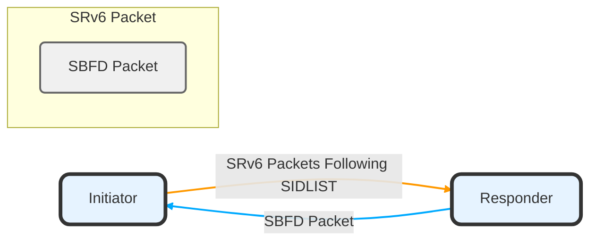
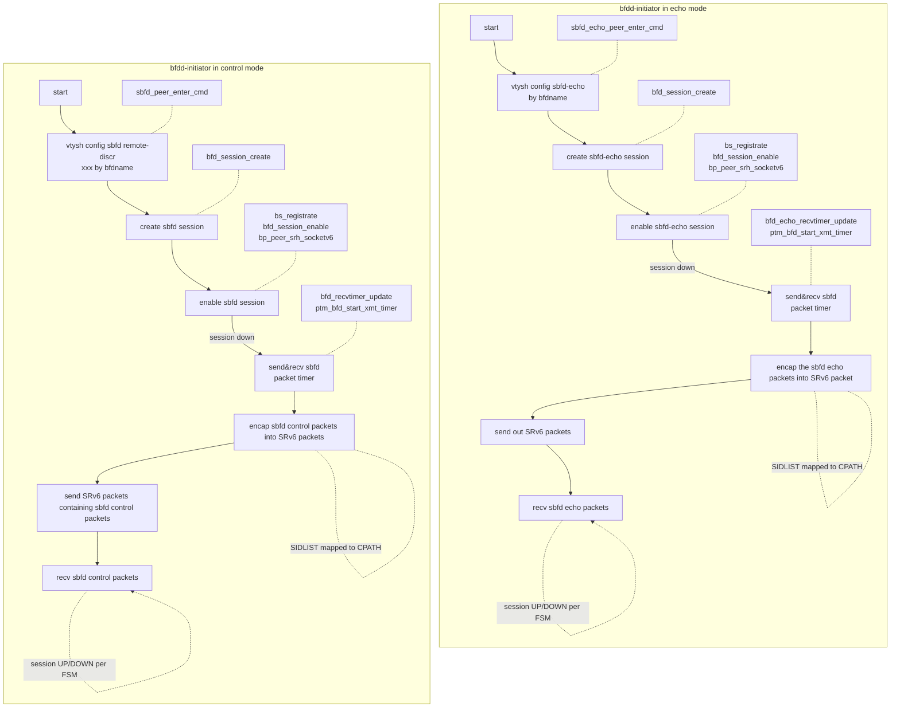
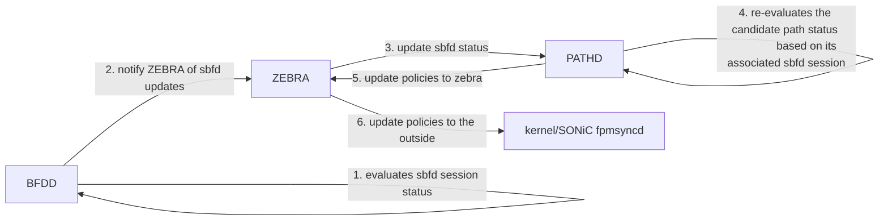
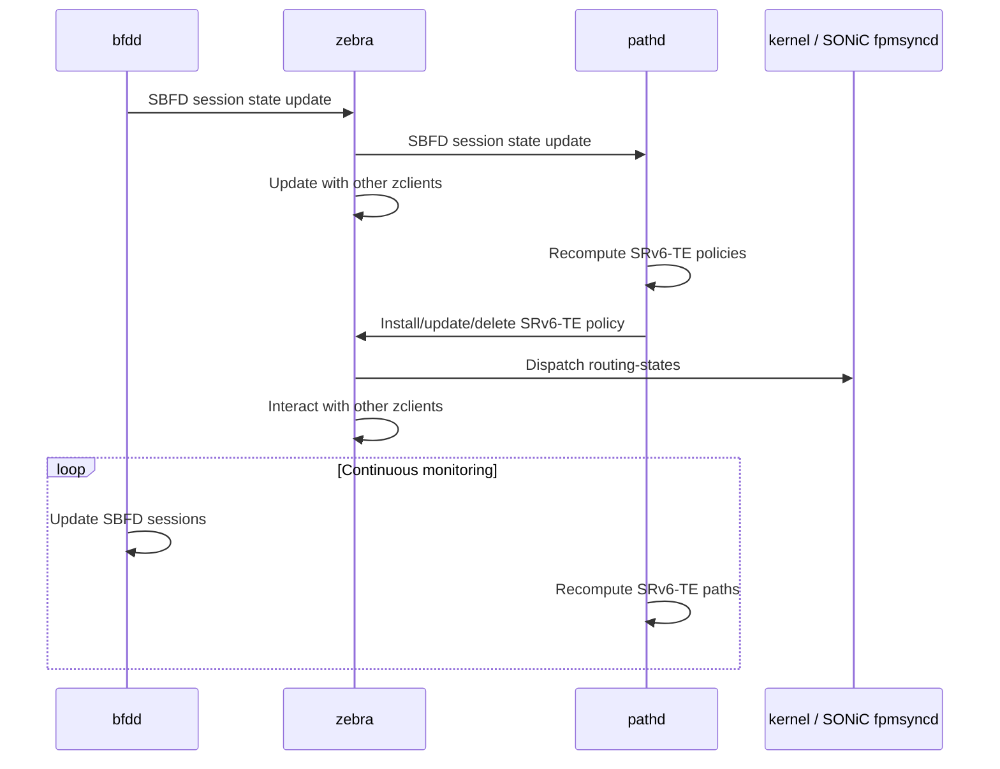

<!-- omit in toc -->
# SBFD and SRv6-Encapsulated SBFD in SONiC SR-TE

<!-- omit in toc -->
## Revision

| Rev |     Date    |       Author       | Change Description                |
|:---:|:-----------:|:------------------:|-----------------------------------|
| 1.0 | July  31 2024 |   Yijiao Qin     |  Base Version                    |

<!-- omit in toc -->
## Table of Contents

- [Overview](#overview)
  - [Scope](#scope)
  - [Requirements](#requirements)
- [Terminology](#terminology)
- [SBFD Baseline](#sbfd-baseline)
  - [Session Types and Operation Modes](#session-types-and-operation-modes)
  - [SBFD Session State Machines](#sbfd-session-state-machines)
    - [Control Packet Mode](#control-packet-mode)
    - [Echo Packet Mode](#echo-packet-mode)
- [SBFD Extension: Encapsulation into SRv6](#sbfd-extension-encapsulation-into-srv6)
  - [Extend Node Connectivity to Path Scope](#extend-node-connectivity-to-path-scope)
    - [Initiator sends out SRv6-encapsulated SBFD packets](#initiator-sends-out-srv6-encapsulated-sbfd-packets)
      - [Transmission socket with `IPv6_HDRINCL` option](#transmission-socket-with-ipv6_hdrincl-option)
      - [Store Path Information in SRv6 Header](#store-path-information-in-srv6-header)
      - [Both SRH and uSID supported](#both-srh-and-usid-supported)
    - [Responder SID configured to decapsulate the incoming SRv6 packets](#responder-sid-configured-to-decapsulate-the-incoming-srv6-packets)
- [\[BFDD\] SRv6-Encapsulated SBFD Configuration](#bfdd-srv6-encapsulated-sbfd-configuration)
  - [Configuration in control packet mode](#configuration-in-control-packet-mode)
    - [Configure SBFDReflector with a discriminator and the Responder's IP](#configure-sbfdreflector-with-a-discriminator-and-the-responders-ip)
    - [Configure SBFDInitiator with its peering SBFDReflector's discriminator](#configure-sbfdinitiator-with-its-peering-sbfdreflectors-discriminator)
    - [DB Schema for tables of SBFD session in control packet mode](#db-schema-for-tables-of-sbfd-session-in-control-packet-mode)
  - [Configuration in echo packet mode](#configuration-in-echo-packet-mode)
    - [Only configure SBFDInitiator](#only-configure-sbfdinitiator)
    - [DB Schema for tables of SBFD session in echo packet mode](#db-schema-for-tables-of-sbfd-session-in-echo-packet-mode)
- [\[PATHD\] SBFD-Verified CPath Configuration](#pathd-sbfd-verified-cpath-configuration)
  - [1. Create an SR TE policy](#1-create-an-sr-te-policy)
  - [2. Create a candidate path in the policy](#2-create-a-candidate-path-in-the-policy)
    - [Specify the associated sbfd session by its name](#specify-the-associated-sbfd-session-by-its-name)
    - [SRv6 Policy DB Schema](#srv6-policy-db-schema)
- [Policy Verification Workflow](#policy-verification-workflow)
  - [Participating modules](#participating-modules)
  - [1. BFDD notifies ZEBRA of SBFD session changes via ZAPI](#1-bfdd-notifies-zebra-of-sbfd-session-changes-via-zapi)
  - [2. ZEBRA notifies PATHD of SBFD updates via ZAPI](#2-zebra-notifies-pathd-of-sbfd-updates-via-zapi)
  - [3. PATHD recomputes TE policies based on SBFD updates](#3-pathd-recomputes-te-policies-based-on-sbfd-updates)
    - [Timeline Illustration](#timeline-illustration)
- [Test](#test)

## Overview

This doc introduces SBFD features into SONiC and talks about how we extend the SBFD protocol with SRv6 features to perform SRv6-TE policy verification.

An SRv6-TE policy consists of various candidate paths, which are represented by SRv6 segment lists, but the policy itself is unaware of the real-time path status. To help select the best candidate path, we propose to integrate SBFD features into SONiC to verify the candidate paths in SRv6-TE policies.

### Scope

- Hardware offload of SBFD sessions not discussed here

### Requirements

- Verify node connectivity of hops along a policy candidate path, per its associated SBFD session
- Decouple SBFD and SRv6-TE configuration
  - Support color-only SRv6-TE policy verification

## Terminology

|  Abbreviation       |          Description                    |
| ------------------------ | --------------------------------------- |
| HW                       | Hardware                                |
| SBFD                     | Seamless Bi-directional Forwarding Detection|
| SRv6                     | Segment Routing over IPv6 Dataplane     |
| SID                      | Segment ID                              |
| uSID                     | micro-segment identifier (compressed SID)|
| TE                       | Traffic Engineering                      |
| BFDD                     | Daemon for BFD Protocol                 |
| PATHD                    | Daemon for the installation and deletion of SR Policies|
| Cpath                    | Candidate Path                           |
| PTM                      | Portable Transport Module (abstraction layer for various transport protocols) |

## SBFD Baseline

### Session Types and Operation Modes

SBFD peers, according to [rfc7880](https://datatracker.ietf.org/doc/rfc7880/), have two kinds of session types: `SBFDInitiator` and `SBFDReflector`.

|  Terms                   |               Description                       |
| ------------------------ | ----------------------------------------------- |
| Initiator                | a network node hosting an SBFDInitiator         |
| Responder                | a network node hosting an SBFDReflector          |

There are two operation mode for SBFD peers to set up a connection between them :

- `Control Packet Mode`
  - Initiator sends out a control packet to Responder, DIP is Responder's IP address.
  - Responder receives the packet, then sends a response packet back.
    - The response packet carries a state value : `ADMINDOWN` or `UP`.


```mermaid
  graph LR
      A[Initiator] -->|SBFD packet X| B[ Responder]
      B -->|SBFD packet Y| A
```

- `Echo Packet Mode`
  - Initiator sends out an echo packet to Responder, but DIP is its own address.
  - Responder routes the echo packet out via the data plane, since DIP doesn't belong to it.
    - Responder control plane is not involved.


```mermaid
  graph LR
      A[Initiator] -->|SBFD packet X| B[ Responder]
      B -->|echoed SBFD packet X| A
```

### SBFD Session State Machines

We implement a statelss `SBFDReflector` and a stateful  `SBFDInitiator`, so that only the Initiator node needs to maintain the per-session states. And the `SBFDInitiator` state machine is very simple as below, hence the negotiation overhead to set up a connection is quite light-weight, which makes SBFD sessions very scalable.

Initial state is `DOWN`.

#### Control Packet Mode

- If SBFDInitiator doesn't receive the response packet in time, session is `DOWN`.
- If SBFDInitiator receives the response packet in time
  - reponse state is `ADMINDOWN`, session goes `DOWN`.
  - reponse state is `UP`, session goes `UP`.

<figure align=center>
  
</figure>

#### Echo Packet Mode

- If SBFDInitiator doesn't receive the echoed packet in time, session is `DOWN`.
- If SBFDInitiator receives the echoed packet in time
  - reponse state is `ADMINDOWN`, session goes `DOWN`.
  - reponse state is `UP`, session goes `UP`.

<figure align=center>
  
</figure>

## SBFD Extension: Encapsulation into SRv6

### Extend Node Connectivity to Path Scope

SBFD peers periodically exchange SBFD packets to monitor the connection between them. To verify the connection between the source node and the destination node of a specific path, we could set up an SBFD connection between the two nodes, with the source node serving as the Initiator node and the destination node as the Responder node.

However, to further verify the whole path, this SBFD packet should follow each hop in the path exactly from the source to the destination. This requirement extends the node connectivity verification to the path verification.

#### Initiator sends out SRv6-encapsulated SBFD packets

To achieve this, the Initiator node should wrap up the outgoing SBFD packet into an SRv6 packet, and specify the SIDLIST to do guide the packet SR.


```mermaid
graph LR

    A[Initiator] -->|SRv6 Packets Following SIDLIST| B[ Responder]
    B -->|SBFD Packet| A

    subgraph "SRv6 Packet"
    CP[SBFD Packet]
    end

    classDef nodeStyle fill:#e6f3ff,stroke:#333,stroke-width:4px,rx:10,ry:10
    class A,B nodeStyle

    classDef packetStyle fill:#f0f0f0,stroke:#666,stroke-width:2px,rx:5,ry:5
    class CP packetStyle

    linkStyle 0 stroke:#ff9900,stroke-width:2px
    linkStyle 1 stroke:#00aaff,stroke-width:2px
```

##### Transmission socket with `IPv6_HDRINCL` option

The initiator should create the transmission socket with `IPv6_HDRINCL` option set, so that the IP header could be customized by the designated SIDLIST, instead of using the header created by kernel by default.

##### Store Path Information in SRv6 Header

Set the SRv6 packet header SIDLIST to be the candidate path's SIDLIST.

##### Both SRH and uSID supported

Either the SRH section or uSID in DIP section could be used to program the SIDLIST of a candidate path.

Below illustrated the operation flow of BFDD module running on the Initiator node in two modes:


```mermaid
graph TD
    subgraph "bfdd-initiator in echo mode"
        A1[start]
        B1[vtysh config sbfd-echo<br>by bfdname]
        C1[create sbfd-echo session]
        D1[enable sbfd-echo session]
        E1[send&recv sbfd<br>packet timer]
        F1[encap the sbfd echo packets into SRv6 packet]
        G1[send out SRv6 packets] 
        H1[recv sbfd echo packets]
        A1 --> B1 --> C1 --> D1
        D1 -->|session down| E1
        E1 --> F1
        F1 --> G1
        F1 -.- |SIDLIST mapped to CPATH|F1
        G1 --> H1
        H1 -.-> |session UP/DOWN per FSM|H1
        
        N1[sbfd_echo_peer_enter_cmd]
        N2[bfd_session_create]
        N3[bs_registrate<br>bfd_session_enable<br>bp_peer_srh_socketv6]
        N4[bfd_echo_recvtimer_update<br>ptm_bfd_start_xmt_timer]
        
        N1 -.- B1
        N2 -.- C1
        N3 -.- D1
        N4 -.- E1
    end
    
    subgraph "bfdd-initiator in control mode"
        A2[start]
        B2[vtysh config sbfd remote-discr<br>xxx by bfdname]
        C2[create sbfd session]
        D2[enable sbfd session]
        E2[send&recv sbfd <br>packet timer]
        F2[encap sbfd control packets into SRv6 packets]
        G2[send SRv6 packets containing sbfd control packets]
        H2[recv sbfd control packets]
        
        A2 --> B2 --> C2 --> D2
        D2 -->|session down| E2
        E2 --> F2
        F2 --> G2
        G2 --> H2
        H2 -.-> |session UP/DOWN per FSM|H2
        F2 -.- |SIDLIST mapped to CPATH|F2
        
        M1[sbfd_peer_enter_cmd]
        M2[bfd_session_create]
        M3[bs_registrate<br>bfd_session_enable<br>bp_peer_srh_socketv6]
        M4[bfd_recvtimer_update<br>ptm_bfd_start_xmt_timer]
        
        M1 -.- B2
        M2 -.- C2
        M3 -.- D2
        M4 -.- E2
    end

    %% Force subgraphs to be side by side and same size
    A1 ~~~ A2
    G1 ~~~ G2
```

#### Responder SID configured to decapsulate the incoming SRv6 packets

Now the Responder node receives SRv6 packets. Since it's the destination of the SRv6 packet, the Responder's locally configured SID must be the last SID of the packet SIDLIST. Hence, it would be triggered to look up its local SID table and invoke the corresponding SID behavior, which should be configured as - SRv6 packet decapsulation.

So that SBFDReflector could obtain the encapsulated SBFD packet and follow the baseline workflow as mentioned above.

## [BFDD] SRv6-Encapsulated SBFD Configuration

|  CLI Field   |               Description                    |
| ------------ | -------------------------------------------- |
| bfd-sname    |           name of the sbfd session           |
| bfd-mode     |            sbfd / sbfd-echo                  |
| peer         | dip of the outgoing sbfd packets |
| local-ip     | sip of the outgoing sbfd packets |
| encap-dip    | dip of the outgoing SRv6 packets|
| encap-sip    | sip of the outgoing SRv6 packets|

### Configuration in control packet mode

#### Configure SBFDReflector with a discriminator and the Responder's IP

In the configure terminal, allocate a discriminator for SBFDReflector and map it to its IP with this command:

```bash
sbfd reflector local-ip <reflector-ip-address> discr <reflector-discriminator>
```

#### Configure SBFDInitiator with its peering SBFDReflector's discriminator

```bash
bfd peer <reflector-ip-address> bfd-sname <bfd-session-name> bfd-mode sbfd status enable local-ip <initiator-ip-address> encap-dip <cpath-sidlist> encap-sip <srv6-sipv6> remote-discr <reflector-discriminator>
```

#### DB Schema for tables of SBFD session in control packet mode

```json
"SBFD_REFLECTOR": {
  "<reflector-discriminator>":{
    "local-ip":"<reflector-ip-address>"
  }
},

"BFD_PEER": {
  "<bfd-session-name>": {
      "enabled": "true",
      "encap": "srv6",
      "encap-sip": "<srv6-sipv6>",
      "encap-dip": "<cpath-sidlist>",
      "local-ip": "<initiator-ip-address>",
      "mode": "sbfd",
      "peer": "<reflector-ip-address>",
      "remote-discr": "<reflector-discriminator>"
  }
},
```

### Configuration in echo packet mode

In echo mode, we don't need to configure a SBFDReflector session since the Responder only needs to echo back the packets via the data plane as normal.

#### Only configure SBFDInitiator

```bash
bfd peer <initiator-ip-address> bfd-sname <bfd-session-name> bfd-mode sbfd-echo status enable local-ip <initiator-ip-address> encap-dip <cpath-sidlist> encap-sip <srv6-sipv6>
```

#### DB Schema for tables of SBFD session in echo packet mode

```json
"BFD_PEER": {                                             
  "<bfd-session-name>": {
    "enabled": "true",
    "encap": "srv6",
    "encap-sip": "<srv6-sipv6>",
    "encap-dip": "<cpath-sidlist>",
    "local-ip": "<initiator-ip-address>",
    "mode": "sbfd-echo",
    "peer": "<local-ip>",
  }
},
```

Note: we take the echo packet mode in our actual deployment although configuration in control packet mode is also supported. 

## [PATHD] SBFD-Verified CPath Configuration

### 1. Create an SR TE policy

- A policy is distinguished by the pair of its color and endpoint.
- Color only policies are supported here, by specifying `endpoint` field as `::`

```sh
(config)# segment routing
(config-sr)# traffic-eng
(config-sr-te)# policy color <color> endpoint <endpoint>
```

### 2. Create a candidate path in the policy

#### Specify the associated sbfd session by its name

```bash
(config-sr-te-policy)# candidate-path preference <preference> name <cpath_name> explicit segment-list <sid_list_name> weight <weight> bfd-sname <bfd-session-name>
```

#### SRv6 Policy DB Schema

`SRV6_POLICY` supports keys in two kinds of format:

- 2-tuples : `<endpoint>|<color>`
- 4-tuples : `<endpoint>|<color>|<preference>|<cpath_name>`

`<bfd-session-name>` is null if a candidate path is not protected by a sbfd session.

```json
"SRV6_POLICY": {
  "<endpoint>|<color>|<preference>|<cpath_name>": {
    "seg_name": "<sid-list-name>",
    "weight": "<weight>",
    "bfd_sname": "<bfd-session-name>"
  }
},
```

## Policy Verification Workflow

### Participating modules


```mermaid
graph LR
    A[ BFDD ] -->| 2. notify ZEBRA of sbfd updates | B[ZEBRA]
    A -->| 1. evaluates sbfd session status| A
    B -->| 3. update sbfd status | C[PATHD]
    C -->| 4. re-evaluates the candidate path status 
              based on its associated sbfd session| C
    C -->| 5. update policies to zebra | B
    B -->| 6. update policies to the outside| D[kernel/SONiC fpmsyncd]
```

### 1. BFDD notifies ZEBRA of SBFD session changes via ZAPI

`SBFDReflector` is stateless. We only discuss from the perspective of `SBFDInitiator`. BFDD is the daemon running the `SBFDInitiator` session, it evaluates the SBFD sessions status according to the state machine mentioned above and notifies zebra of changes by invoking `zclient_send_message`.

### 2. ZEBRA notifies PATHD of SBFD updates via ZAPI

ZEBRA notifies all zclients subscribed to the event to invoke their registed handlers for this event.

`ZEBRA_INTERFACE_BFD_DEST_UPDATE`, which refers to the bfd session update event, is registered with ZEBRA by PATHD, and is mapped to a common handler `zclient_bfd_session_update`. Hence ZEBRA would notify PATHD to invoke this handler to process the bfd session updates.

### 3. PATHD recomputes TE policies based on SBFD updates

`zclient_bfd_session_update` API invokes `sbfd_state_change_hook` defined by PATHD, which implements the policy recomputation logic:

- if NOT protected by a SBFD session, a candidate path is `UP` by default
- if protected by a SBFD session, the status of a candidate path is determined by its SBFD session status
- PATHD reevaluates candidate path status based on SBFD session updates, and send SRv6TE POLICY with its UP cpaths to ZEBRA.
- if there is no UP cpath in POLICY, PATHD will notify Zebra to delete this POLICY.

#### Timeline Illustration


```mermaid
sequenceDiagram
    participant B as bfdd
    participant Z as zebra
    participant P as pathd
    participant K as kernel / SONiC fpmsyncd

    B->>Z: SBFD session state update
    Z->>P: SBFD session state update
    Z->>Z: Update with other zclients
    P->>P: Recompute SRv6-TE policies
    P->>Z: Install/update/delete SRv6-TE policy
    Z->>K: Dispatch routing-states
    Z->>Z: Interact with other zclients

    loop Continuous monitoring
        B->>B: Update SBFD sessions
        P->>P: Recompute SRv6-TE paths
    end
```

## Test

- We share the test suite with [PhoenixWing SRv6 Policy Feature](https://github.com/eddieruan-alibaba/SONiC/blob/eruan-srv6p/doc/srv6/srv6_policy.md#color-only-policy-use-case)