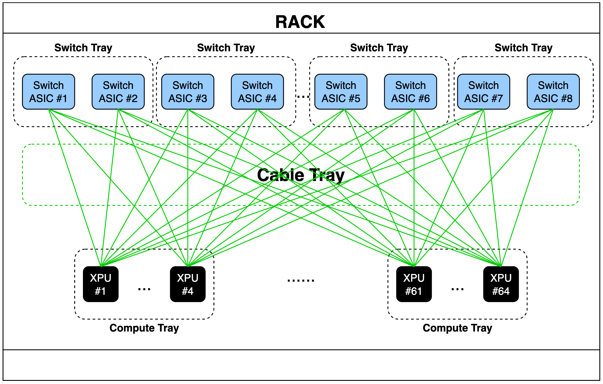
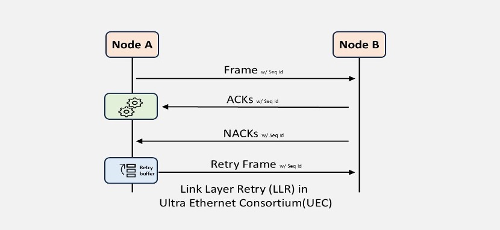
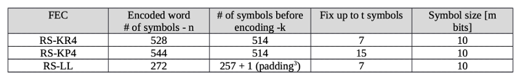
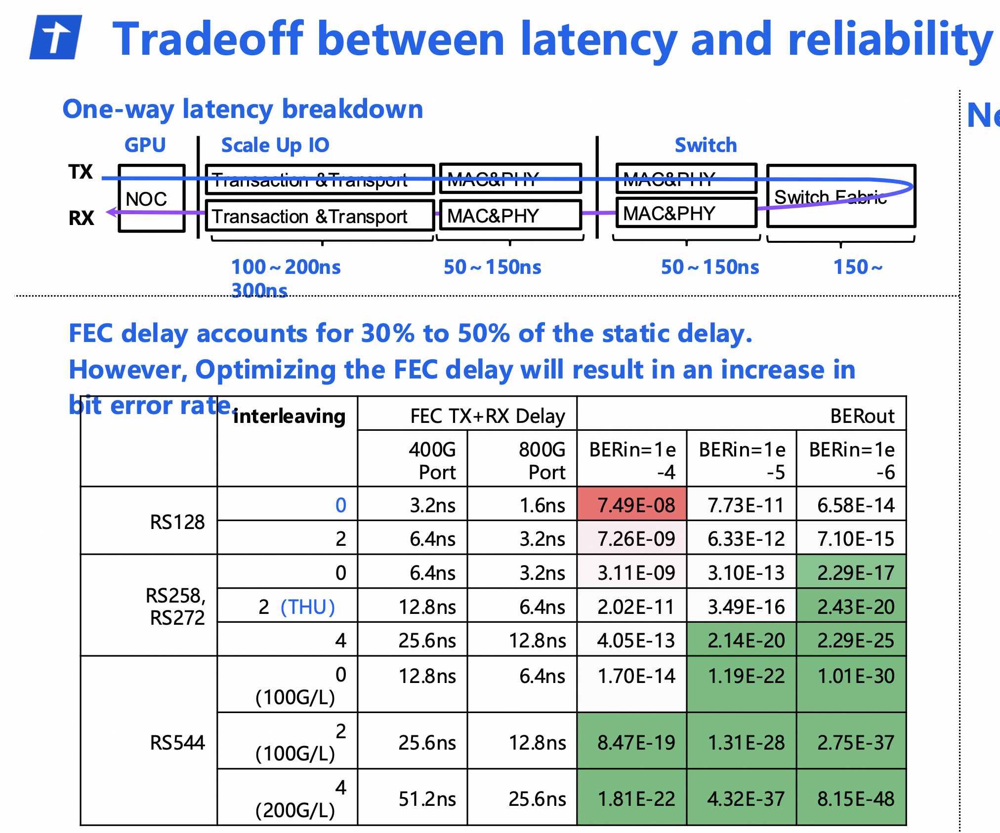
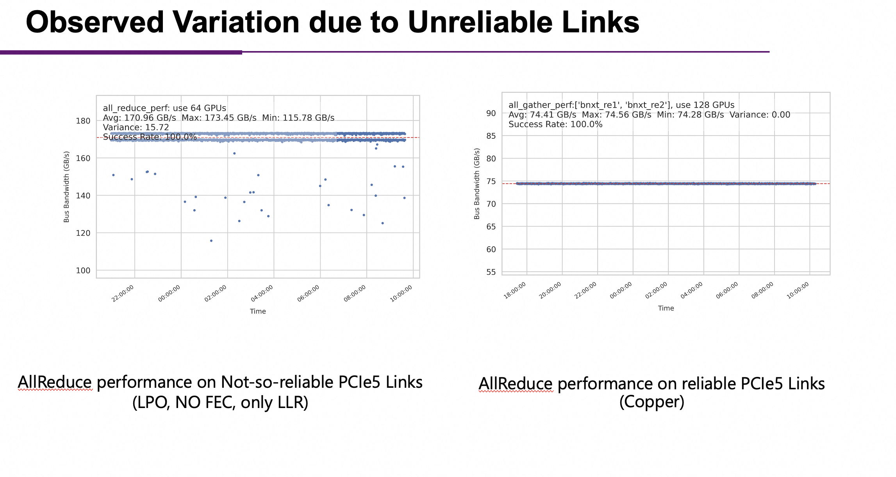
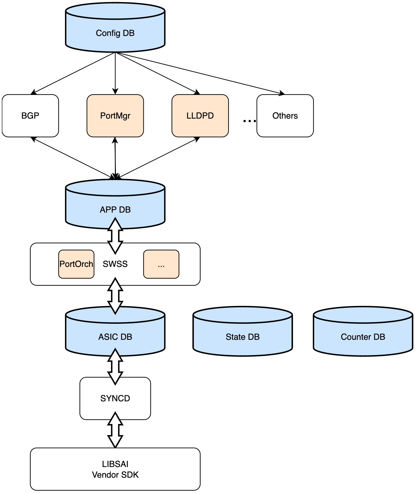

<!-- omit from toc -->
# Ethernet Scale Up AI Cluster Architecture

<!-- omit from toc -->
## Table of Contents
- [Revisions](#revisions)
- [Terminologyies](#terminologyies)
- [Scope of SONiC Scale Up](#scope-of-sonic-scale-up)
  - [Overview](#overview)
- [Scale-Up Fabrics](#scale-up-fabrics)
  - [Primary scale-up fabric requirements](#primary-scale-up-fabric-requirements)
  - [Industry Requirements Comparison](#industry-requirements-comparison)
- [Reference System Model](#reference-system-model)
  - [Rack (Integrated Rack System)](#rackintegratedracksystem)
  - [Switch Tray (Ultra-Performance Network Switching)](#switchtrayultra-performancenetworkswitching)
  - [Compute Tray (Heterogeneous Compute Acceleration)](#computetrayheterogeneouscomputeacceleration)
  - [Cable Tray (Integrated Interconnect Infrastructure)](#cabletrayintegratedinterconnectinfrastructure)
  - [XPU and Station Architecture](#xpu-and-station-architecture)
  - [Deployment Variations](#deployment-variations)
- [Multi-ASIC Architecture](#multi-asic-architecture)
  - [Background](#background)
  - [Multi-ASIC Switch Design](#multi-asic-switch-design)
- [Protocol Stack](#protocol-stack)
  - [Physical Layer](#physical-layer)
  - [Link Layer](#link-layer)
  - [Ethernet MAC](#ethernet-mac)
  - [Network Layer](#network-layer)
    - [L2-Based Scale-Up Network](#l2-based-scale-up-network)
    - [L3-Based Scale-Up Network](#l3-based-scale-up-network)
  - [Adaptation Layer](#adaptation-layer)
  - [Transport Layer](#transport-layer)
  - [Transaction Layer](#transaction-layer)
- [GPU-to-GPU Packet Flow](#gpu-to-gpu-packet-flow)
  - [GPU to Station](#gpu-to-station)
  - [Station to Switch](#station-to-switch)
  - [Switch to Station](#switch-to-station)
  - [Station to GPU](#station-to-gpu)
- [Resiliency and Fault Tolerance](#resiliency-and-fault-tolerance)
  - [GPU Failures](#gpu-failures)
  - [Switch Failures](#switch-failures)
  - [Link Failures](#link-failures)
    - [Redundant Links](#redundant-links)
    - [Tracking Per-Target Reachability](#tracking-per-target-reachability)
- [Cluster Provisioning](#cluster-provisioning)
  - [Option 1 Fabric mananger](#option-1-fabric-mananger)
  - [Option 2 SDN style](#option-2-sdn-style)
  - [Option 3 Hybrid mode](#option-3-hybrid-mode)
- [Some Ethernet Based Scale up systems](#some-ethernet-based-scale-up-systems)
  - [ESUN](#esun)
  - [Maia 200 Scale Up system](#maia-200-scale-up-system)
  - [Byte Dance's Scale up system](#byte-dances-scale-up-system)
- [Software Architecture](#software-architecture)
  - [ID Lookup](#id-lookup)
  - [PFC/CBFC](#pfccbfc)
  - [LLR](#llr)
    - [How UEC-LLR Works](#how-uec-llr-works)
  - [LL-FEC](#ll-fec)
    - [The impact from unreliable links](#the-impact-from-unreliable-links)
  - [SONiC Software Module Changes](#sonicsoftwaremodulechanges)

## Revisions

| Rev |     Date    |       Author       | Change Description                |
|:---:|:-----------:|:------------------:|-----------------------------------|
| 0.1 | 07/27/2025  |     Niranjan Vaidyam, Joy Qin, Eddie Ruan  | Initial version                   |
| 0.2 | 11/17/2025  |     Haiyang Zheng  | Update rack system model and related software module changes                  |
| 0.3 | 01/25/2026  |     Eddie Ruan | Update based on WG discussions |


## Terminologyies

|   Abbreviation | Full Term |
|:--------------:|:-----------:|
|       UFH       | Unified Forwarding Header |
| XPU             | Generic term for GPU or ML accelerator |
| CBFC            | Credit-Based Flow Control |
| LLR             | Link-Level Retry |
| UAL             | Ultra Accelerator Link |
| UEC             | Ultra Ethernet Consortium |
| PP              | Pipeline Parallelism |
| TP              | Tensor Parallelism |
| DP              | Data Parallelism |


## Scope of SONiC Scale Up

This document serves as an architectural guide, which outlines the fundamental building blocks and design principles of SONiC scale-up working group to construct Ethernet-based scale-up AI fabrics. Upon completion of this blueprint, we will collaborate with the SAI community to define API specifications and develop the necessary SONiC modules.

While Ethernet fabrics can support various transport protocols including PCIe over Ethernet, AXI over Ethernet, and other standards-based or proprietary methods, this work focuses on considerations and best practices for deploying these technologies optimally over all-Ethernet infrastructure rather than defining specific transport technologies.

### Overview

SONiC is widely deployed in front-end datacenter networks and scale-out infrastructures. The SONiC Scale-Up Working Group aims to extend its capabilities to the scale-up domain, providing unified operational frameworks across all network types. Our primary focus centers on the operational and management aspects of building efficient, low-latency, scalable, and fault-tolerant Ethernet-based scale-up networks for AI workloads. We also share feedbacks with industry initiatives such as Ultra Ethernet Consortium (UEC) to foster synergy across all efforts.

As AI and machine learning workloads grow in complexity, the demand for parallel processing power increases exponentially. Scaling GPU clusters to rack and multi-rack levels is essential for processing larger datasets, training deeper neural networks, handling concurrent tasks.

Ethernet provides compelling advantages for fabric design: industry-leading high-speed links, high-capacity switches, a mature ecosystem, and well-established operational practices. Multiple industry groups are actively developing networking technologies for AI-based networks that extend Ethernet or leverage its components as building blocks.


The Ultra Ethernet Consortium defines a reference model encompassing three network types:

- **Front-end cloud-scale DC network**
- **Scale-out backend network** for connecting GPU systems (one or more racks)
- **High-capacity scale-up fabric** for intra-system connectivity

UEC currently focuses on defining high-performance transport protocols for scale-out fabrics, physical and link-level technologies for enhanced reliability, in-network compute capabilities, and management practices. Many of these link-level technologies directly apply to scale-up networks, and UEC is actively developing Ethernet solutions for scale-up fabrics.


The Ultra Accelerator Link Consortium (UAL) defines an approach leveraging Ethernet high-speed SerDes while maintaining PCIe-style transport and transaction layers. This methodology requires specialized PCIe-style switches that interpret UPLI packets and modify them in transit. However, the PCIe-style approach presents challenges for using existing Ethernet equipment and incorporating network resilience—a critical consideration for fault-tolerant scale-up fabrics. While UAL specifications serve as valuable references for use cases and requirements, they cannot be directly adopted as complete solutions.

UAL over Ethernet is a variation from original UAL spec, which only keeps sematic and transport layer from UAL, and use Ethernet as data link layer which is align with what SONiC Scale Up Working Group's mission.

ESUN (Ethernet Scale Up Network) is a workstream under the OCP Networking Project, introduced at the OCP 2025 conference (https://www.opencompute.org/wiki/Networking/ESUN). It advocates for Ethernet as an open interconnect solution for scale-up architectures, capitalizing on the robust Ethernet ecosystem which includes network operating systems (NOS), operational practices, and performance tools. While ESUN emphasizes a holistic solution approach, SONiC is positioned as one of the NOS options within this framework.

## Scale-Up Fabrics

Scale-out networks connect numerous nodes to distribute training workloads across a cluster. In contrast, scale-up fabrics interconnect tightly coupled GPUs/XPUs within a cluster, functioning essentially as "memory fabrics" that enable memory load-store operations between GPUs. GPUs typically provide orders of magnitude higher bandwidth on scale-up interfaces compared to scale-out connections. These fabrics are typically single-tier to minimize latency and optimize performance, though this is not a strict requirement.

| Characteristic | Scale-Up AI Cluster | Scale-Out AI Fabric |
|:---------------|:-------------------|:--------------------|
| **Number of machines** | Multiple interconnected nodes | Independent nodes with distributed resources |
| **Examples** | NVL72, PCIe clusters | Ethernet-based AI clusters |
| **Communication** | Low latency, high bandwidth, memory load-store-atomics, smaller transfers | Higher latency, lower bandwidth, message transfers, large transfers |
| **Scalability** | Limited by GPU and cluster design | Horizontal scaling |
| **Network Performance** | < 2μs RTT | < 20μs RTT |
| **Workload Types** | Tightly coupled tasks with high inter-node communication | Loosely coupled tasks (e.g., data parallelism) |
| **Model Size** | Very large models requiring significant memory | Models divisible across nodes |
| **Memory Architecture** | Shared memory | Distributed memory, no global shared memory |
| **Parallelism** | Required for PP and TP | Optimal for DP |

### Primary scale-up fabric requirements

- **Low-latency connectivity** for time-sensitive operations
- **Lossless connectivity** to eliminate timeouts and retransmissions
- **High throughput for small packets** to support GPU memory semantics
- **Reduced communication and framing overheads** for efficiency
- **Cluster scalability** to at least 1,024 GPUs
- **Comprehensive resiliency and fault tolerance** mechanisms

### Industry Requirements Comparison

During the scale-up working group weekly meetings, four major industry players， Alibaba, Microsoft, Tencent, and Bytedance，presented and discussed their respective requirements for Ethernet-based scale-up AI fabrics. These discussions provided valuable insights into the diverse needs and priorities across different organizations, helping to shape the architectural decisions outlined in this document. The following table summarizes the key requirements gathered from these collaborative sessions:

| Requirement | Alibaba | Microsoft | Tencent | Bytedance |
|:------------|:--------|:----------|:---------|:----------|
| **Packet Size** | 1KB (matches HBM access granularity) | 1-8KB (no small packet requirement) | 4KB for network semantics, <512B for memory semantics | <2KB for both memory and message semantics |
| **Cluster Size** | 256 → 512 GPUs | 128 → 256 GPUs | Up to 512 GPUs with single-layer ETH-X Ultra network | 128 → 1K GPUs |
| **Latency** | <1μs (no need for extremely low latency) | <1μs (preferably <600ns L3 SAF latency) | <1μs (smaller is better) | <1μs |
| **Traffic Rate** | ≈ Memory bandwidth | ≈ HBM bandwidth | — | — |
| **Multi-tenancy** | Yes | GPU level | Yes | Yes |
| **Hardware** | Liquid & air cooling, no optical modules | Liquid cooling, no optical modules, all copper cables, N-1 SerDes speed compatibility | — | Liquid cooling, copper for I/O |
| **Forwarding** | Ethernet | L2 & L3 routing solutions | Standard IP (optional) compressed header | Standard IP or Ethlink |
| **Data Traffic Features** | DSCP, ECN, LLR, CBFC | PFC, DSCP, ECN, ECMP | DSCP, ECN, CBFC, ECMP | DSCP, ECN, LLR, CBFC |
| **Operational** | Performance monitoring + high precision telemetry | Traffic/buffer/PG/queue monitoring + high frequency telemetry (100ms to 1ms granularity) | Server operation (no network operation) + adaptive configuration—plug & play + buffer statistics tracking + mirror-on-drop | <1ms monitoring |


## Reference System Model


### Rack (Integrated Rack System)

The Rack is a high-density, standards-compliant infrastructure unit that serves as the physical and logical foundation for hyperscale AI workloads. It integrates modular **Switch Tray**, **Compute Tray** and **Cable Tray**, along with shared power, cooling, and management systems, enabling a scalable architecture within a single rack footprint.

### Switch Tray (Ultra-Performance Network Switching)

A modular, standards-compliant switching platform that serves as the intra-rack network backbone, delivering ultra-low-latency, high-bandwidth connectivity for AI clusters via Ethernet-based protocol stacks.

### Compute Tray (Heterogeneous Compute Acceleration)

A modular compute node housing custom AI accelerators (XPUs), optimized for rack-scale integration with high-bandwidth memory and ultra-fast interconnects to maximize performance-per-watt.

### Cable Tray (Integrated Interconnect Infrastructure)

The **Cable Tray** is a standardized, modular cabling subsystem integrated within the **Rack** to provide high-density, serviceable, and airflow-optimized interconnects between **Switch Tray** and **Compute Tray**. It supports both copper and optical media, enabling flexible topology deployment while maintaining thermal efficiency and operational simplicity in a scalable architecture.

**Interconnect Options**

| Medium | Pros | Cons |
| --- | --- | --- |
| **Copper (DAC/AEC)** | Low cost, high reliability, no external power | Limited reach (<5m at 400G), lower density |
| **Optical** | Long reach, high density, lightweight | Higher cost, greater power, lower historical reliability |

_Intra-rack links (<3m) primarily use copper; optical is reserved for high-density or future 1.6T+ deployments._

**Optical Technology Comparison**

| Type | Description | Cost vs. FRO | Reliability | Field Replaceable |
| --- | --- | --- | --- | --- |
| **FRO** | Retimed pluggables (QSFP-DD/OSFP) | Baseline (highest) | Moderate | Yes |
| **LPO** | Linear-drive pluggables (no retimers) | –30% | High | Yes |
| **NPO** | On-board (soldered) optics | –40% (vs. FRO) | Very high | No |

### XPU and Station Architecture

We use XPU as a generic term for GPU or any ML accelerator, and define a station as a device conforming to IEEE 802.11 protocol. Each station has a unique address for identification and provides network connectivity with other devices. Stations can be configured with single or multiple ports to differentiate traffic arriving at the same address. These stations are also referred to as IO dies, which are interconnected with XPU dies.


A scale-up cluster comprises identical GPUs and switches. While fabric topology is commonly single-tier, it can extend to multiple tiers without losing generality. Initially, we expect single-hop switch topology configurations.


GPU memory bandwidth drives scale-up bandwidth requirements. This bandwidth is distributed across multiple stations, with the station count calculated as:


In Ethernet implementations, a station can support up to 8 lanes of 100G or 200G speeds. Multiple lanes can be grouped to create ports of various capacities:
- **100G lanes**: 100G/200G/400G/800G ports
- **200G lanes**: 200G/400G/800G/1.6T ports

Stations can support 1-8 ports depending on lane grouping configuration. Station configuration and lane speeds remain identical across all GPUs and switches. The figure above demonstrates stations with 2 ports, requiring 2N switches and independent planes.

Lower-speed ports are commonly used in scale-up fabrics to maximize switch radix and cluster size. The trade-off involves higher latency due to slower port speeds, and designs must find suitable balance points matching GPU memory bandwidth and physical cluster constraints.

Each Ethernet port operates independently. Ethernet stations may implement resiliency and load-balancing functions to map upper-layer transactions to specific ports, effectively decoupling transactions from rigid port mappings.

Scale-up clusters typically require a minimum of 4 traffic classes for read/write requests and responses, with atomics sharing a class or using a dedicated one. These traffic classes will be lossless, while additional best-effort classes may serve management functions.

Given the static nature of clusters and the ability to prescribe exact component configurations, scale-up clusters are commonly managed using SDN controller frameworks. No protocols are needed for active node discovery, device address resolution, or network path computation. GPUs and switches use static configurations. Link-level protocols such as LLDP may still be required for negotiating features like LLR, and clusters may rely on mechanisms like BFD for detecting link and node failures. GPU station logic must be capable of injecting such packets and filtering them upon arrival, with specifics varying between GPU implementations.

### Deployment Variations

**Single Uplink Configuration:**

- XPU stations connect to Ethernet switches via single copper cable uplinks
- **Drawbacks**: Single point of failure, potential memory remapping required upon link failure

**Multiple Uplink Configuration:**

- XPU stations connect using dual or multiple uplinks bundled into a single logical link
- **Benefits**: Guaranteed redundancy, traffic load-balancing across all active links

For large-scale scenarios, high-speed optical fiber replaces copper connections.


## Multi-ASIC Architecture

### Background

As scale-up AI clusters grow in size and bandwidth requirements, the single ASIC-based switch may not provide sufficient port density or aggregate throughput. To address these demands, modern scale-up network switches often employ the multi-ASIC architecture, where multiple switching ASICs are integrated within a single switch.
Take GB200 NVL72 reference rack design as an example, each GPU requires 1.8TB/s bandwidth. In order to support interconnecting 72 GPUs with 800G network, 1328x 800G ports are required in total. Even with 64 ports switches today, we will need 21 switches in total.
Because of this, this approach enables the switch to support a larger number of high-speed ports and scale to meet the needs of large GPU clusters.

### Multi-ASIC Switch Design

Multi-ASIC is already well supported in current SONiC stack and we can reuse the design for the scale up network: <https://github.com/sonic-net/SONiC/blob/master/doc/multi_asic/SONiC_multi_asic_hld.md>.
Each ASIC will have its down control plane stack, which includes:
• database
• swss/syncd/SAI
• bgp/teamd/lldp


Unlike regular multi-ASIC switches where ASICs interconnect to form internal fabrics, scale-up network switches don't require these interconnections. This is because AI traffic is rail-optimized—ports across different rails don't communicate with each other. This reduces the maximum required port connections to total GPUs × N rails. With 512-port switches, this can support 7 rails connecting 72 GPUs.

Since ASICs lack interconnections, iBGP sessions and cross-connect VLANs are unnecessary, significantly simplifying multi-ASIC support.

## Protocol Stack

In Ethernet-based scale-up fabrics, the protocol stack appears as shown below. It's instructive to compare this with alternate approaches such as UA Link, as the functionality partition differs significantly.


### Physical Layer

This layer uses standard Ethernet physical specifications as defined in various IEEE standards. To ensure link quality, the following features are recommended:

1. **Forward Error Correction (FEC)** to reduce bit error probability
2. **Auto-negotiation and link training** for optimal link establishment

### Link Layer

Standard Ethernet link layer can be used without modifications for scale-up fabrics. Lossless connectivity is enabled through established features such as Priority Flow Control (PFC) or emerging UEC standards like Credit-Based Flow Control (CBFC). Lossless traffic classes can utilize CBFC, PFC, or combinations of both. Buffer capacity and credits can be reserved per traffic class or shared among multiple classes through common pools. CBFC doesn't tie credit usage to transport or transaction-level semantics, unlike technologies such as PCIe or UA Link.

Link-Level Retry (LLR) implements check-and-retry mechanisms between link partners, reducing bit error rates visible to upper layers at destinations, thereby reducing errors and retransmissions. LLR may be combined with weaker but lower-latency FEC such as RS 272/528/544 to further improve latency performance.

### Ethernet MAC

The standard Ethernet MAC sub-layer can be retained as-is for scale-up fabrics, which is desirable for leveraging broad ecosystem support and Ethernet tooling. VLAN tags will be required if no alternative mechanism (another header field) exists to describe packet-associated traffic classes. They may also provide tenant isolation if large clusters are shared across tenants, with tenant allocation at the GPU level.

The Ethernet MAC and VLAN headers collectively add 18 bytes per packet, creating non-optimal overhead for small packets. Deployments can use approaches such as UEC's Unified Forwarding Header (UFH) to improve wire efficiency while maintaining Ethernet compatibility and coexistence.


Scale-up fabrics predominantly use unicast forwarding. Features such as MAC learning, broadcast, and multicast are not mandatory in clusters where device inventory and connectivity are known upfront.

Scale-up fabrics may use LLDP to negotiate link capabilities such as LLR or CBFC. Protocols like ARP or DHCP for GPU bootstrapping are optional and vary by deployment.

For small transactions (64B-256B), standard Ethernet headers plus VLAN tags introduce noticeable overhead. Compressed header formats can be used, but should follow standard Ethernet header formats:


However, compressed header formats disable standard Ethernet features such as MAC learning and LLDP. LLDP would use normal port Ethernet MAC address in scale up cluster.

In summary, packets on Ethernet-based scale-up fabrics continue to resemble standard Ethernet, but encodings and forwarding behavior may deviate from standard Ethernet practices.

### Network Layer

Single-tier scale-up fabrics are expected to scale to 1,024 GPUs in the near future, requiring 1-2 billion addresses for the cluster. Depending on GPU and switch capabilities, multiple options exist for encoding these addresses in packet headers and forwarding methodologies.

#### L2-Based Scale-Up Network

Deployments can use Ethernet MAC headers, encoding source and destination addresses in MAC SA and DA fields. In the simplest case, source and destination GPU addresses utilize the full 6-byte addressing space.

Deployments can optimize this overhead using only 1-2 bytes for address overlays, leaving remaining bits for other useful fields or end-to-end data. This approach, followed by UFH, requires support from GPU stations and switches. Stations must pack and unpack fields from different protocol layers into Ethernet MAC addresses, while switches must forward using only the 1-2 byte address overlays.

#### L3-Based Scale-Up Network

With AI traffic, packet sizes can be large enough (4KB-8KB) to ignore overhead from L3/L4 headers (42 bytes). Therefore, deployments can choose to directly use RDMA-similar protocols for data transfer.

This working group expects different deployments to take varying approaches in this space and should support APIs that abstract addressing and forwarding capabilities from underlying header structure and encoding details.

### Adaptation Layer

The protocol stack diagram shows a non-standard "adaptation" layer between network and transport layers. This layer decouples the relationship between transport and network layers to improve resiliency and fault tolerance. When packets are prepared and queued to TX buffers, they enter the adaptation layer, which serves several major purposes:

1. **Rail/Plane Selection**: Load-balance packets across all available planes
2. **Path Management**: Based on selection logic, this layer may probe and track per-destination, per-path reachability and trigger recovery actions upon receiving path failure indications


The adaptation layer could also be viewed as a transport layer sub-function. This document calls it out explicitly to highlight its distinct purpose and optional nature. Different deployments may implement these functions differently.

### Transport Layer

The transport layer accepts transaction PDUs from the upper transaction layer, packs them into larger packets for improved wire efficiency, and delivers them to destination GPUs where they are unpacked and delivered to the transaction layer. Packing and unpacking occur on a per-destination basis.

It offers reliable service over the scale-up fabric to handle non-recoverable transit drops. While the probability of such drops is low, it is not zero.

Additionally, this layer may provide encryption support for transmitted data. Typically, packet headers remain unencrypted while only payloads are encrypted.

The transport layer may implement fine-grained GPU-to-GPU flow control, which remains invisible to the switch fabric.

This group does not intend to define one specific transport layer. GPUs will implement proprietary transaction layers and corresponding transport and adaptation layer functions. The goal is enabling seamless transport of these over scale-up fabrics.

### Transaction Layer

The transaction layer corresponds to traditional PCIe transaction layers or equivalents. It accepts read/write transaction requests from applications (GPU DMA subsystems or kernel operations) and delivers them to destination GPUs.

Several differences from other approaches such as PCIe should be noted:

- **End-to-end operation**: The transaction layer operates end-to-end from GPU to GPU, not per-hop. Transactions are opaque to switches and not interpreted in transit, allowing standard Ethernet switches to work with different transaction layers without requiring special design.
- **Credit management**: Credit grants are managed hop-by-hop at the link layer, not as part of the transport layer.

## GPU-to-GPU Packet Flow

### GPU to Station

The GPU selects a station based on the remote destination memory address. From the GPU's perspective, this remote memory address appears accessible through a local DMA engine, with the GPU unaware that data is remote. By mapping address ranges to stations and potentially specific ports within stations, the design ensures in-order delivery of transactions to specific memory locations.

Each local CPU is responsible for monitoring local station liveness within its OS domain. Station failure constitutes a fatal error.

### Station to Switch

Station processing follows the protocol stack shown earlier. Suitable transport headers are added to data received by the transport layer, processed by the adaptation layer, optionally batched for efficiency, then updated with appropriate network and link layer headers and transmitted over Ethernet MAC.

### Switch to Station

Deployments can choose to forward packets based on full MAC DA or selected bytes in headers as defined by deployment forwarding models. Forwarding tables are statically configured, and switches may load-balance on outgoing links when multiple ports connect to the same GPU. An entropy field is required in packet headers to support load balancing, typically derived from target addresses to maintain in-order delivery of updates to the same memory area.

The switch NOS is responsible for monitoring outgoing port liveness and updating load-balancing structures accordingly.

### Station to GPU

The receiving station decodes payloads from incoming Ethernet frames and transmits transactions to GPUs through device interface channels.

## Resiliency and Fault Tolerance

Any failure in a scale-up cluster affects entire cluster performance, making comprehensive resiliency solutions critical for addressing common failure modes.

### GPU Failures

Empirical results from large-scale deployments indicate that GPU or associated HBM errors are most common. Some deployments may provision spare GPUs, while others refactor jobs when GPUs fail and fall back to checkpoints. Handling such errors lies outside switch NOS scope and hence outside this working group's scope.

### Switch Failures

Hard failures can result in complete switch failure, disabling forwarding on all ports. This typically appears to each connected station as a link failure, requiring each station to update its forwarding and load-balancing policies. Stations may rely on additional ports if available, or declare themselves down if none exist.

Switches can also suffer silent failures where some ports fail or stop forwarding. Such failures must be detected through probing mechanisms.

### Link Failures

Smaller clusters may use Direct Attach Copper (DAC) cables, but they become impractical for larger clusters due to GPU density and reachability limitations. Optical links are required but are more susceptible to failures.

Link failures can be categorized as hard or soft:

- **Hard failures**: Detectable by Ethernet PHY on GPUs or switches
- **Soft or gray failures**: Harder to detect, requiring periodic probing mechanisms such as BFD or background monitoring functions that track link error rates and flaps

Path probing mechanisms implemented in fabrics can be hop-by-hop (between GPU and switch) or end-to-end (between GPU and GPU), depending on cluster design. The figure below shows hop-by-hop probing with probes initiated at switches and reflected back by GPU stations.


Single link failures create capacity mismatches in scale-up clusters. Affected planes lose reachability to affected GPUs but remain usable for other destinations. Removing entire planes from service is undesirable. Recovery actions can vary between deployments.

#### Redundant Links

One option involves provisioning multiple links between GPUs and switches, ensuring that single link failures don't cause total connectivity loss. The representative topology shows 2 links per station to support this model. Capacity loss on particular planes can be handled by effective load balancing in GPU station adaptation layers.

#### Tracking Per-Target Reachability

If GPUs track reachability on a per (target GPU, plane) basis, they can avoid planes with no target reachability. This function can also be implemented in adaptation layers.

We have dropped the exceptional path approach due to
1. Additional latency would be added due to extra switch hops would be added. These extra latency may lead to end to end transport timeout.
2. In some cases, all ports are used, we may not have physical ports for extra exceptional paths.


## Cluster Provisioning
There are several approaches to provisioning all devices within the cluster.

### Option 1 Fabric mananger
Similar to the NVL72 architecture, fabric-related provisioning is handled by a dedicated fabric manager.

### Option 2 SDN style
Given that all device interconnections are static, both compute trays and switching trays can be managed directly by an external controller. From the perspective of each device, it operates as an independently managed entity.

### Option 3 Hybrid mode
Configuration data is delivered directly to each switch tray. The switch trays then use a customized LLDP implementation to provision the connected GPU devices.

Operators can select the provisioning model that best fits their operational requirements. SONiC does not mandate or enforce any specific option.


## Some Ethernet Based Scale up systems
### ESUN
### Maia 200 Scale Up system
### Byte Dance's Scale up system

## Software Architecture

### ID Lookup

(This feature is only needed if we use UFH or AFH as forwarding model.)

In AI computing cluster scale-up scenarios, traditional L2 MAC lookup faces scalability bottlenecks. This document proposes an ID Lookup architecture based on Unified Flexible Header (UFH), replacing standard MAC addresses with 12-byte extended headers to achieve high-performance, multi-path, and fine-grained QoS forwarding mechanisms that meet core requirements for low latency and high throughput AI training traffic.


The following table shows differences between L2 MAC Lookup and ID Lookup:

| Feature | L2 MAC Lookup | ID Lookup (UFH) |
|:--------|:--------------|:----------------|
| **Multi-Path** | Not supported | ECMP supported |
| **QoS** | 3-bit CoS in VLAN tag | 6-bit ToS |
| **ECN** | Not supported | Supported |
| **Flexibility** | Requires new EtherType definition, standard MAC address | UFH extended header, 6B/12B ID lookup, follows SLAP |

In the forwarding plane, VRF provides tenant isolation. Simultaneously, chips maintain forwarding tables for each VRF and find destinations by looking up Dest ID + VRF.


The configuration delivery channel can reuse traditional route delivery APIs and is compatible with both local static route delivery and SDN remote configuration.


### PFC/CBFC

Credit-Based Flow Control (CBFC) manages traffic at the Virtual Channel (VC) level, supporting up to 32 VCs for finer-grained control compared to PFC. Credits represent available buffer space on the receiver side. When senders transmit packets, they consume corresponding credits. Once receivers release buffer space, they generate new credits and grant them to senders. Credits and buffer space maintain one-to-one mapping—every lossless packet sent by senders consumes buffer space pre-allocated by receivers.


CBFC has several important parameters:

- **CreditSize**: Defines each credit's size, typically corresponding to receiver buffer cell size
- **TotalCredits**: Represents total credits allocated across all lossless virtual channels (VCs)
- **Counters**: Track credit usage through Credit Consumed (CC), Credit Freed (CF), Credit Limit (CL), and Credit In Use (CU)

Receivers can choose to configure only TotalCredits, allowing senders to determine credit distribution among lossless VCs, or directly specify credit limits for each VC. Senders and receivers synchronize counters using CC update and CF update messages, triggered periodically by timers. This mechanism also prevents credit leaks caused by packet loss. Each VC's parameters are configured through management software or LLDP.

The following table compares PFC and CBFC:

| Aspect | PFC | CBFC |
|:-------|:----|:-----|
| **Implementation** | Simpler | More complex |
| **Overhead** | Low, no messages when no control events occur | Requires periodic synchronization via update messages |
| **Multiple Resources** | Can manage multiple resources within a priority class | Manages main input buffer only; CBFC and PFC together can manage multiple switch resources |
| **Managed Object** | Priority class, up to 8 | Can enable more lossless VCs, up to 32 |
| **Sender Knowledge** | Sender knows nothing beyond congestion | Sender knows credit usage by each VC, enabling improved SCH/LB/AR |
| **Delay Sensitivity** | Buffer overflows and packet drops possible if cable delay is underestimated | Less sensitive to cable length, frame size, or sender response time; buffer may be underutilized |
| **Buffer Usage** | 1. Enables more sharing and efficient burst absorption buffer usage across ports<br>2. Requires headroom buffer for in-flight packets | 1. Cannot share buffer across ports<br>2. For VCs not requiring full throughput, CBFC can allocate fewer credits, requiring less buffer space than PFC<br>3. No headroom buffer needed |

Generally, PFC is simpler, has lower overhead, and may enable more efficient buffer usage. Conversely, CBFC provides finer-grained flow control with better performance, guarantees no packet drops when used with LLR, and is less sensitive to delay.

When implementing and deploying CBFC in scale-up networks, the following mechanisms must be specified:

- Traffic-to-virtual-channel (VC) mapping
- Credit distribution among VCs to ensure full bandwidth utilization
- VC-to-output-queue mapping

### LLR
In traditional Ethernet, packet loss is usually handled at higher layers like TCP, and it leads to high latency. There are some alternate solutions available, like RDMA, which is used in InfiniBand or RoCE, but they are complex and vendor-specific.

LLR offers a middle ground by providing reliable loss recovery without RDMA and using existing Ethernet, providing a simpler solution. In LLR, instead of involving the whole protocol stack, including CPU, Packet loss is detected and retried at the local link layer, resulting in better throughput and low latency.

#### How UEC-LLR Works
Terms:
•	Frame transmission with sequence numbering: Every frame between nodes is tagged with a local sequence number, and these sequence numbers/IDs are not visible to the upper layer.
•	Frame Buffering: The sender buffers the sent frames in a local retry queue and holds them in a local buffer until the receiver acknowledges them.
•	Acknowledgment: The receiver will send the ACKs back to the sender once each frame is received successfully.
•	Loss detection: If a frame is dropped or corrupted, the receiver will notice a gap in the sequence number and send the Negative Acknowledgement (NACK) back to the sender. In other cases, if the sender does not receive an ACK or NACK within a time frame, it will initiate a timeout-based retry.



The sender retransmits only lost/corrupted frames from the local retry buffer, avoiding transport-level retransmission. Once the Sender receives the ACKs, it will remove the entries from the local retry buffer.
UEC outlines a layered Ethernet stack consisting of:
•	Standard Ethernet PHYs (100G/200G/400G/800G)
•	LLR Layer – Link-level recovery from transient packet loss
•	UET (Ultra Ethernet Transport) – Manages ordering, congestion control, and flow control
•	Application Layer – AI frameworks and HPC workloads.
LLR sits above the PHY and below the UET layer, ensuring the loss resilience before the higher layers get involved.

More details in UE spec: (5.1)
https://ultraethernet.org/wp-content/uploads/sites/20/2025/06/UE-Specification-6.11.25.pdf

### LL-FEC
To improve end to end latency, a low-latency shortened codeword variant of the 802.3 FEC (LL-FEC) may optionally be used in place of the IEEE 802.3bs and 802.3cd standard RS-544.

Based on the RS-FEC decoding algorithm, the receiver needs to collect all FEC frames of a whole FEC codeword before starting FEC decoding and error correction. Obviously, the overall latency is associated with the FEC codeword length.

The LL-FEC code used is RS-272, which is half the codeword length of RS-544. This can bring two advantages:
- Reduced 50% of latency to collect the whole FEC codeword.
- Hardware FEC decoding runs faster, as the algorithm complexity is also reduced.



Regarding the FEC error correction capability, LL-FEC is similar with KR4-FEC, which can fix up to 7 incorrect symbols.

Regarding the FEC codeword latency, taking 100G port as example:
- KP4-FEC: 5440b/(100G*68/64) = 52ns
- LL-FEC: 2720b/(100G*68/64) = 26ns

Apparently, LL-FEC has a lower latency, especially when the network transaction is less than 320B, which means an LL-FEC codeword can carry one or several transactions, and the transactions can be recovered and be sent to system level much earlier at receiving side.
In the low-latency scenarios, reducing latency by more than 20ns really counts.


Borrow test results from Tencent's presentation, this slide shows that FEC delay accounts for 30% to 50% of the static delay. However, Optimizing the FEC delay will result in an increase in bit error rate.


#### The impact from unreliable links

The Meta-X team conducted an insightful test to evaluate the differences between unreliable and reliable links. As shown in the graph above, bandwidth fluctuates significantly more on unreliable links compared to stable ones. These fluctuations can lead to increased queuing delays, which is an undesirable outcome in AI cluster environments.

### SONiC Software Module Changes

From SONiC point of view, the following features would be developped for supporting Scale Up:
* LLR
* CBFC
* LL-FEC
* ID lookup.

The following sections descrbes the rough changes needed. Each of these features would have its own feature HLD which would not be in this architecture document.




1. **Config DB**

    Introduce a dedicated configuration schema to support FEC (Forward Error Correction), LLR (Link Layer Redundancy), and CBFC (Congestion-Based Flow Control).


    ```plain
    ; Defines information for port configuration
    key                     = PORT|port_name     ; configuration of the port
    ; field                 = value
    ...
    FEC                     = STRING             ; FEC configuration(RS-272/RS-544/autoneg)
    LLR                     = STRING             ; LLR configuration(on/off/autoneg)
    LLR_PROFILE             = STRING             ; LLR profile
    CFBC                    = STRING             ; CFBC configuration(on/off/autoneg)
    CBFC_PROFILE            = STRING             ; CBFC profile
    ```

2. **PortMgr**

    Implement monitoring and processing of Config DB changes for port configurations related to FEC, LLR, and CBFC.

3. **LLDP**

    Leverage LLDP protocol with custom TLV to support auto-negotiation, configuration check, status and counter synchronization between two endpoints within the link layer.

    *   **lldmgrd Enhancement**:

        *   Add functionality to handle Config DB events for LLR and CBFC configuration updates, to enable or disable UE link negotiation.

    *   **lldpd Enhancement**:

        *   Implement dynamic LLR/CBFC configuration negotiation using custom TLV (Type-Length-Value) extensions.

    *   **lldp-syncd Enhancement**:

        *   Update Application DB with LLR/CBFC enable/disable status based on Config DB settings and negotiation outcomes.

4. **APP DB**

    define new schema for LLR/CBFC/PFC


    ```plain
    ; Defines information for port configuration
    key                     = PORT_TABLE:port_name           ; configuration of the port
    ; field                 = value
    ...
    FEC                     = STRING             ; FEC configuration(RS-272/RS-544/autoneg)
    LLR                     = STRING             ; LLR configuration(on/off)
    CFBC                    = STRING             ; CFBC configuration(on/off)
    ```

5. **SWSS** 

     *   Either develop a new OrchAgent or extend PortOrch to program LLR profile and CBFC VC (Virtual Channel) settings into SAI port objects.

      *   Get port LLR/CBFC status/counters from SAI, and update State DB and Counter DB correspondingly

6.  **State DB**

    ```plain
    ; Defines information for port state
    key                     = PORT_TABLE:port_name      ; state of the port
    ; field                 = value
    ...
    FEC                     = STRING         ; operational fec mode
    LLR_TX                  = STRING         ; operational LLR TX status
    LLR_RX                  = STRING         ; operational LLR RX status
    LLR_FRAME_ACTION        = STRING         ; operational LLR frame action
    CFBC                    = STRING         ; operational CFBC status
    ```

    Here is the table to map the LLR fields and SAI attributes:

    | **Parameter** | **sai\_port\_attr\_t** |
    | --- | --- |
    | tx\_off | SAI\_PORT\_LLR\_TX\_STATUS\_OFF |
    | tx\_init | SAI\_PORT\_LLR\_TX\_STATUS\_INIT |
    | tx\_adv | SAI\_PORT\_LLR\_TX\_STATUS\_ADVANCE |
    | tx\_replay | SAI\_PORT\_LLR\_TX\_STATUS\_REPLAY |
    | tx\_flush | SAI\_PORT\_LLR\_TX\_STATUS\_FLUSH |
    | ... | ... |

    Here is the table to map the CBFC fields and SAI attributes:

    | **Parameter** | **sai\_port\_attr\_t** |
    | --- | --- |
    | credit\_used | SAI\_PORT\_STAT\_CBFC\_SENDER\_CREDITS\_USED |
    | credit\_watermark | SAI\_PORT\_STAT\_CBFC\_SENDER\_CREDITS\_USED\_WATERMARK |
    | cc\_msg\_tx | SAI\_PORT\_STAT\_CBFC\_NUM\_CC\_UPDATE\_MESSAGES\_TX |
    | cf\_msg\_tx | SAI\_PORT\_STAT\_CBFC\_NUM\_CF\_UPDATE\_MESSAGES\_TX |
    | cc\_msg\_rx | SAI\_PORT\_STAT\_CBFC\_NUM\_CC\_UPDATE\_MESSAGES\_RX |
    | cf\_msg\_rx | SAI\_PORT\_STAT\_CBFC\_NUM\_CF\_UPDATE\_MESSAGES\_RX |

7.  **SAI**

  *   **LLR Implementation**:

        *   [GitHub Pull Request #1](https://github.com/opencomputeproject/SAI/pull/2225)

  *   **CBFC Implementation**:

      *   [GitHub Pull Request #2](https://github.com/rck-innovium/SAI/pull/2)


