# Ethernet Scale Up AI Cluster Architecture

## Table of Content

1. [Scope](#scope)
2. [Overview](#overview)
3. [Scale-Up Fabrics](#scale-up-fabrics)
4. [Reference System Model](#reference-system-model)
5. [Multi-ASIC Architecture](#multi-asic-architecture)
6. [Protocol Stack](#protocol-stack)
7. [GPU to GPU Packet Flow](#gpu-to-gpu-packet-flow)
8. [Software Architecture](#software-architecture)
9. [Resiliency and Fault Tolerance](#resiliency-and-fault-tolerance)

A Reference for SONiC Implementation [DRAFT]
Version (Draft 0.6. July 27, 2025)

## Scope

SONiC is commonly used within the front-end DC network and the Scale-Out network. The goal of this WG is to extend its usage to the Scale-Up domain and provide commonality across all networks. The focus will be on the operational and management aspects of developing an efficient, low-latency, scalable, fault-tolerant Ethernet-based scale-up network.

This document will aim to serve as an architectural guide. It will outline all necessary building blocks and document the design considerations for constructing an Ethernet-based scale-up AI fabric. Once the blueprint for building this system is fully defined, this working group will work with SAI community to define its SAI API specifications and design the required SONiC modules. Additionally, feedback will be shared with other industry activities like UAL and UEC to build synergy across all efforts.

An Ethernet fabric can support different transport protocols such as PCIe over Ethernet, AXI over Ethernet, or an alternate standards-based or proprietary method. This working group will not define such transport technologies but will focus on the considerations and best practices for deploying them in a performance-optimal manner over an all-Ethernet infrastructure.  

## Overview

As workloads continue to expand in complexity in areas such as machine learning and AI inference, the need for parallel processing power increases significantly. Scaling up a GPU (or more generically an XPU, to include various custom ML accelerators) cluster to a rack or multi-rack level is needed to enhance its ability to process larger datasets, train deeper neural networks, handle more simultaneous tasks, and reduce execution time and improve overall system efficiency.

Ethernet offers many advantages for designing such a fabric, from industry leading high-speed links and high-capacity switches to a well-developed ecosystem, and well-understood operational methods. Multiple industry groups are currently involved in developing networking technologies for AI based networks that extend Ethernet or use some of its components as a building block.

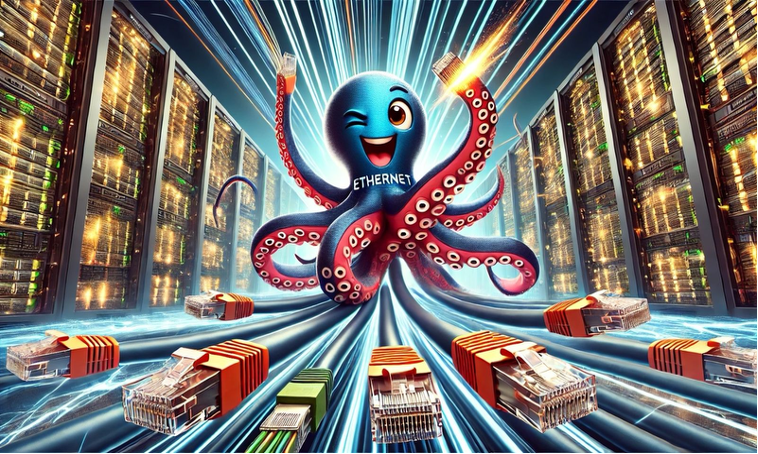

The Ultra Ethernet Consortium defines a reference model with 3 types of networks, a front-end cloud scale DC network, a scale-out backend network for connecting GPU systems (consisting of one or more racks) and a high-capacity scale-up fabric for connectivity within a system. The current focus within UEC is on defining a high-performance transport protocol for the needs of a scale-out fabric, various physical and link level technologies for improving reliability, in-network compute, and management practices. Many of these link level technologies are directly applicable to Scale-Up networks as well, and the UEC is developing the use of Ethernet as a scale-up fabric.

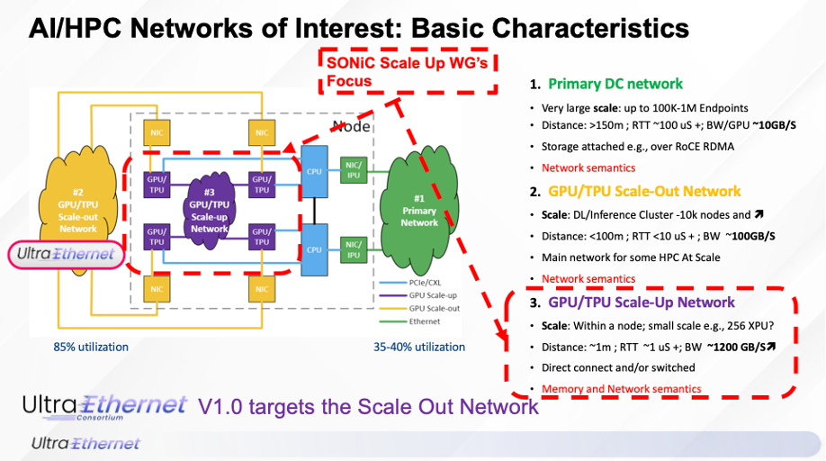

The Ultra Accelerator Link Consortium (UAL) defines an approach that leverages Ethernet high-speed SerDes but maintains a PCIe-style transport and transaction layer. This method requires new PCIe style switches that interpret UPLI packets and updates them in transit. The PCIe style approach makes it challenging to use existing Ethernet equipment or to incorporate network resilience, a key consideration for fault-tolerant scale-up fabrics. The current UAL specification can therefore serve as a reference for use cases and requirements, but not as a direct solution.

## Scale-Up Fabrics

Scale-out networks connect a large number of nodes to distribute training workload(s). Scale-up fabrics connect closely coupled GPUs/GPUs in a cluster and can be described as “memory fabrics” as the intent is to enable memory load-store operations between the GPUs. GPUs have many orders of higher bandwidth on their scale-up interfaces vs scale-out. The fabric is typically single tier to reduce latency and manage performance, but this is not a strict restriction.

||Scale Up AI Cluster |Scale Out AI Fabric|
|:---:|:-----------:|-----------------------------|
|Number of machines| Multiple interconnected nodes |Independent nodes with distributed resources|
|Examples| NVL72, PCIe | Ethernet based AI clusters |
| Communication Characteristics | Low latency, High bandwidth, Memory load-store-atomics, Smaller transfers | Higher latency, Lower bandwidth, Message transfer, Large size transfers |
| Scalability | Limited by GPU and cluster design | Horizontal Scaling|
| Job scheduling | Almost the same | ..|
| Network Performance | < 2us RTT | < 20us RTT |
| Workload types | Tightly coupled tasks with high inter-node communication | Loosely coupled tasks (e.g., data parallelism) |
| Model size | Very large models that require significant memory | Models that can be split across nodes |
| Memory Architecture | Shared memory | Distributed memory, No shared global memory |
| Parallelism | Required for PP and TP | Best for DP |

The primary scale-up fabric requirements are:

- Low latency connectivity
- Lossless connectivity to reduce the need for timeouts and retransmissions
- High throughput for smaller packets for GPU architectures using memory semantics
- Reduced communication and framing overheads
- Cluster scaling to at least 1024 GPUs
- Support for resiliency and fault tolerance.

## Reference System Model

### XPU and STATION

Here we refer to a GPU or any other ML accelerator as a generic XPU, and refer to a device that conforms to IEEE 802.11 protocol as a station.
Each station has a unique address to identify and provides connectivity with other devices in the network. It can be configured as one, or multiple ports, which could differentiate traffic arrived at the same address.

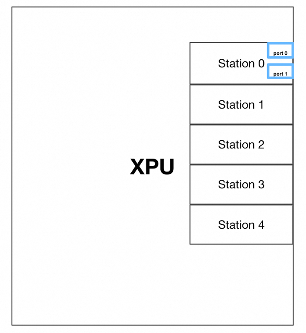

A scale-up cluster consists of identical GPUs and switches. The fabric topology is commonly single tier but can be extended to multiple tiers without loss of generality.  In the initial stage, the network configuration is expected to be a single-hop switch topology.

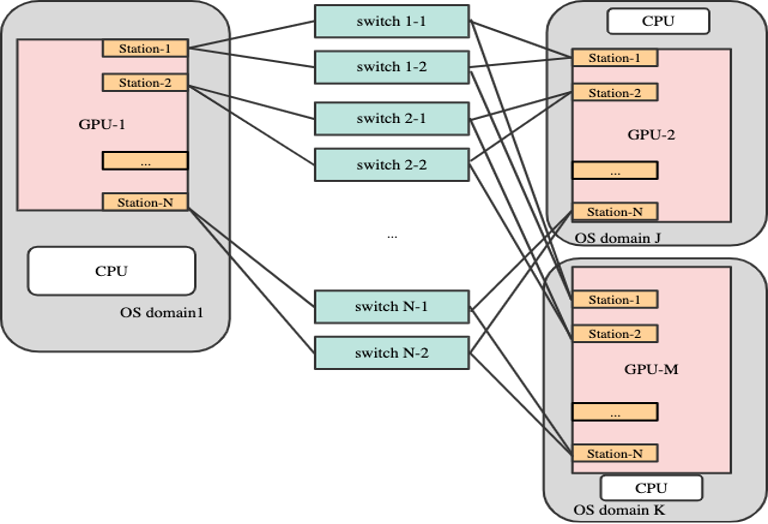

The memory bandwidth of an GPU drives its scale-up bandwidth requirements. This bandwidth is distributed across multiple “stations” with the number of stations computed as:

In the Ethernet world, a station can have up to 8 lanes of 100G or 200G.  Multiple lanes can be grouped to get ports of 100G/200G/400G/800G (100G lane) or 200G/400G/800G/1.6T (200G lane).
A station can support anywhere from 1-8 ports depending on how the lanes are grouped.
The station configuration and lane speeds are identical across all GPUs and switches. The figure above shows stations with 2 ports. The number of switches, and the number of independent planes, is 2N.
Lower speed ports will be commonly used in a scale-up fabric to maximize the radix of the switch and size of the cluster. The tradeoff is higher latency due to the use of slower speed ports, and a design may find a suitable mid-point that better matches GPU memory bandwidth and physical cluster design constraints.
Each Ethernet port operates independently of other ports. An Ethernet station may choose to implement a resiliency and load balancing function to map upper layer transactions to specific ports, in essence, decoupling the transactions from a rigid mapping to a specific port.
A scale-up cluster is likely to require a minimum of 4 traffic classes to carry read and write requests and responses, with atomics sharing a class or using a reserved one. These TCs will be lossless. Additional best-effort TCs may be used for other management functions.
Given the static nature of the cluster, and the ability to prescribe the exact component configuration, scale-up clusters will be commonly managed using a SDN controller framework. There are no protocols to actively discover nodes, device addresses or compute paths in the network. GPUs and switches will be configured statically. Some link level protocols such as LLDP may still be required to negotiate features such as LLR, and the cluster may rely on mechanisms like BFD to detect link and node failures. The station logic on the GPU needs the ability to inject such packets and to filter them on arrival, and the specifics will vary from GPU to GPU.

### Deployment Variations

1. XPU stations connect to Ethernet switches with a single uplink, using a copper cable
a. Single point of failure.
b. Memory may need to be remapped to a different lane if a link fails.
2. XPU stations connects to Ethernet switches using dual or multiple uplinks that are bundled together into a single logical link.
a. Redundancies guaranteed.
b. Traffic is load-balanced across all active links in the group.
For a large-scale scenario, high-speed the optical fiber is used instead of copper.

### High Bandwidth

The bandwidth of existing NICs is normally below 1Tbps, which leads to a very low TPOT (time per output token). For example, if a DeepSeek-V3 model is deployed with 400Gbps InfiniBand NICs, in terms of the EP all-to-all communication, it could generate 67 tokens per sec. However, if the fabrics are replaced with high-bandwidth interconnects like GB200 NVL72 (900 GB/s), the output speed increases to 1200 tokens per second.

It implies that, to achieve the same efficiency as high-bandwidth interconnects, many such regular NICs are required to collaborate for the same scale-up tasks. This is challenging from a space and power perspective.

### Low Latency

The throughput of a multi-XPU shared memory system is affected by the latency of the XPU communication. Hence, minimizing the latency is of great importance. But extreme LOW latency may not be a must.

Since the theoretical micro-batch overlap is hard to reach, and the upper bound on performance in practical inference workloads is mostly affected by computations. For example, the industry data shows that the expert computation time would converge to a lower bound when the batch size decreases. That means, at some point, no matter how you decrease the batch size, the computation time would not decrease. And even that lower bound computation time still dominates the theoretical optimistic communication latency.

## Multi-ASIC Architecture

### Background

As scale-up AI clusters grow in size and bandwidth requirements, the single ASIC-based switch may not provide sufficient port density or aggregate throughput. To address these demands, modern scale-up network switches often employ the multi-ASIC architecture, where multiple switching ASICs are integrated within a single switch.
Take GB200 NVL72 reference rack design as an example, each GPU requires 1.8TB/s bandwidth. In order to support interconnecting 72 GPUs with 800G network, 1328x 800G ports are required in total. Even with 64 ports switches today, we will need 21 switches in total.
Because of this, this approach enables the switch to support a larger number of high-speed ports and scale to meet the needs of large GPU clusters.

### Multi-ASIC Switch Design

Multi-ASIC is already well supported in current SONiC stack and we can reuse the design for the scale up network: <https://github.com/sonic-net/SONiC/blob/master/doc/multi_asic/SONiC_multi_asic_hld.md>.
Each ASIC will have its down control plane stack, which includes:
• database
• swss/syncd/SAI
• bgp/teamd/lldp

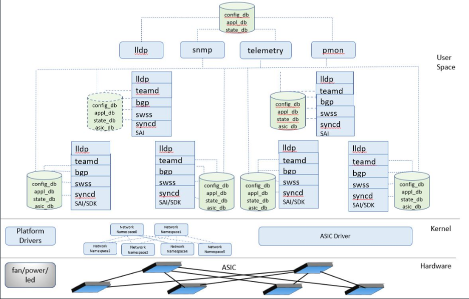

However, unlike the regular Multi-ASIC switches, where the ASICs within a single switch often interconnect to each other and form a fabric. The scale up network switches doesn’t have to support this interconnect. This is because the AI traffic is rail-optimized, where the ports across rails won’t talk to each other. This reduces the max number of ports that must be connected together to total number of GPUs * N rails. With 512 port switches, it can support 7 rails being connected among 72 GPUs.
Since the ASICs have no interconnects, iBGP sessions / Cross-connect VLAN don’t need to be established in the system, which simplifies the multi-ASIC support even more.

## Protocol Stack

In an Ethernet based scale-up fabric, the protocol stack appears as below. It is instructive to compare and contrast it with the protocol stack for alternate approaches such as UA Link as the functionality partition is different.

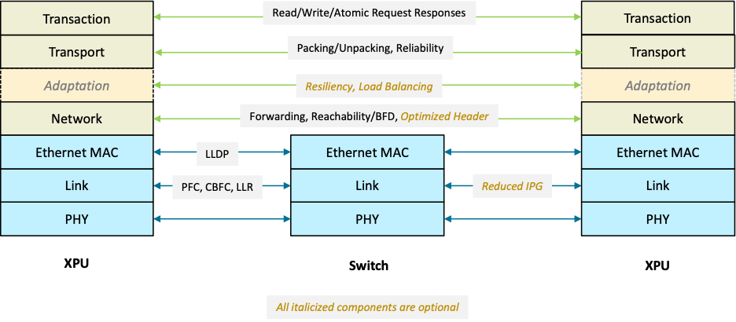

### Physical Layer

This is the standard Ethernet physical layer as defined in various standards.
In order to ensure the link quality, in physical layer, following features are recommended to be enabled:

1. Enable FEC to lower the chance of bit errors
2. Auto Negotiation and Link Training

### Link Layer

The standard Ethernet link layer can be used with no modifications for a scale-up fabric.
Lossless connectivity is enabled by known features such as PFC or emerging UEC standards such as CBFC. A lossless traffic class can choose to use CBFC or PFC, or even a combination of the two. Buffer capacity and credits can be reserved per-traffic class, or multiple traffic classes may share a common pool. CBFC does not tie the use of credits to transport or transaction level semantics, as is the case with other technologies such as PCIe or UA Link.
LLR implements a check-and-retry mechanism between link partners. This reduces the bit error rate more to the upper layers in destination, hence reducing the errors and retransmissions. LLR may be combined with a weaker but lower latency FEC such as RS 272/528/544 to further improve latency.

### Ethernet MAC

The standard Ethernet MAC sub-layer can be retained as-is for a scale-up fabric, and it is desirable to do so to leverage broad ecosystem support and use of Ethernet tools. VLAN tags will be required in a scale-up fabric if there is no alternative mechanism (another header field.) to describe the traffic class associated with a packet. They may also be used for tenant isolation if a large cluster is sharable across tenants. In such cases, tenant allocation is at an GPU level.
The Ethernet MAC and VLAN headers collectively add 18B to a packet, and this overhead is non-optimal for small packets. Deployments can choose to use approaches such as the UEC’s Unified Forwarding Header (UFH) to improve wire efficiency without giving up on Ethernet compatibility or coexistence.

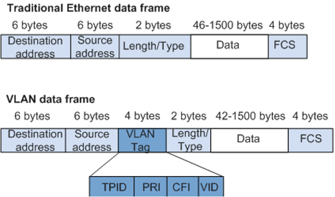

Scale-up fabrics will predominantly make use of unicast forwarding. Features such as MAC learning, broadcast and multicast are not mandatory in a cluster where the device inventory and connectivity are known upfront.
A scale-up fabric may make use of LLDP to negotiate link capabilities such as LLR or CBFC. Use of protocols such as ARP or DHCP to bootstrap GPUs is optional and will vary by deployment.
For small transactions (e.g. 64B - 256B), the standard Ethernet header + VLAN tag can introduce noticeable overheads. Compressed header format can be used, however it should follow the standard ethernet header format, for example:

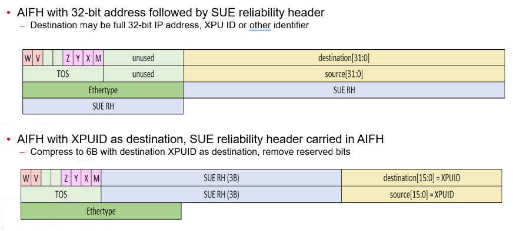

However, with the compressed header format, standard ethernet features will not work, such as MAC learning and LLDP.
In short, packets on an Ethernet based scale-up fabric will continue to look like Ethernet but the encodings and forwarding behavior may not be standard Ethernet.

### Network

It is expected that single tier scale-up fabrics will scale to 1024 GPUs in the near future, and a cluster will need 1B to 2B for addressing. Depending on GPU and Switch capabilities, there are multiple options on how to encode these addresses in a packet header and the forwarding methodology.

#### L2-based Scale Up Network

A deployment can use the Ethernet MAC header, and encode source and destination addresses in the MAC SA and DA. In the simplest case, the source and destination GPU addresses use the full 6B.
A deployment can choose to optimize this overhead and use only 1B or 2B for an address overlay, leaving other bits free to carry other useful fields or end-to-end data. This is the approach followed by UFH and it requires support from GPU stations and Switches. Stations need to pack and unpack fields from the different protocol layers into the Ethernet MAC, and switches need to forward using only the 1B-2B address overlays.

#### L3-based Scale up Network

With AI traffic, the packet size can be large enough (4K-8K) to ignore the overhead that coming from even L3/L4 headers (42B). Hence a deployment can also choose to directly use protocol similar to RDMA for data transfer.
This workgroup should expect different deployments to take different approaches in this space and should support APIs that abstract out addressing and forwarding capabilities from the underlying header structure and encoding details.

### Adaptation

The protocol stack picture shows a non-standard “adaptation” layer between the network and transport layers.
It decouples the relationship between the transport and network layers to improve resiliency and fault tolerance. When packets are ready and queued to TX buffer, it comes to adaptation layer. This layer has several major purposes:

1. Rail / Plane selection. Load balance the packet across all available planes.
2. Based of 1, this may require this layer to probe and track per-destination per-path reachability and trigger recovery actions when it gets path failure indications.

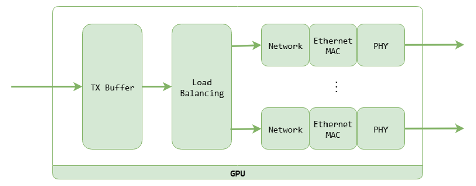

The adaptation layer could also be viewed as a sub-function of the transport layer, this document calls it out explicitly to highlight that it serves a distinct purpose and is optional. Different deployments may choose to implement these functions differently.

### Transport

The transport layer accepts transaction PDUs from the upper transaction layer, packs them into larger packets for improved wire efficiency, and delivers them to the destination GPU where they are unpacked and then delivered to the transaction layer. The packing and unpacking are on a per-destination basis.
It offers a reliable service over the scale-up fabric to cover non-recoverable drops in transit. The probability of these is low, but not completely zero.
Besides the above, this layer might also provide encryption support for the data being transmitted. Usually, the packet header will not be encrypted, only the payload are encrypted.
The transport layer may implement fine grained GPU to GPU flow control. This is also invisible to the switch fabric.
It is NOT the intent of this group to define one specific transport layer. GPUs will implement proprietary transaction layers and corresponding transport and adaptation layer functions. The goal is to enable transport of these over a scale-up fabric in a seamless manner.

### Transaction

The transaction layer corresponds to a traditional PCIe transaction layer or equivalent. It accepts read/write transaction requests from the application (in this case, the GPU’s DMA subsystem, or a kernel operation) and delivers them to the destination GPU.
A few differences versus other approaches such as PCIe should be noted.
• The transaction layer is end-to-end from GPU to GPU, and not per-hop. Transactions are opaque to switches and not interpreted in transit. This allows standard Ethernet switches to work with different transaction layers and not require special design.
• Credit grants are managed hop-by-hop at the link layer and not as part of the transport layer.

## GPU to GPU Packet Flow

### GPU to Station

The GPU selects a station based on the remote destination memory address. From the GPU's perspective, this remote memory address appears accessible through a local DMA engine, and it is unaware that the data is remote. By mapping an address range to a station and then possibly a port within a station, the design ensures in-order delivery of transactions to a specific memory location.
Each local CPU is responsible for monitoring the liveness of the local station within its OS domain. Station failure is a fatal error.

### Station to Switch

Station processing follows the protocol stack shown earlier. Suitable transport headers are added to data received by the transport layer. It is processed by the adaption layer and optionally batched for efficiency, then updated with suitable network and link layer headers and transmitted over the Ethernet MAC.

### Switch to Station

A deployment can choose to forward packets based on the full MAC DA or selected bytes in the header as defined by a deployment’s forwarding model. The forwarding table is statically configured, and the switch may load balance on outgoing links if there are multiple ports connecting to the same GPU. An entropy field is required in the packet header to support load balancing, and this will typically be derived from the target address to maintain in-order delivery of updates to the same memory area.
The switch NOS is responsible for monitoring the liveness of its outgoing ports and updating the load-balancing structure accordingly.
Station to GPU
The receiving station decodes the payloads from the incoming Ethernet frames and transmit the transactions to the GPU through the device interface channel.

## Software Architecture

### ID Lookup

In the scale-up scenario of AI computing clusters, traditional L2 MAC lookup faces scalability bottlenecks. This paper proposes an ID Lookup architecture based on the unified flexible header (UFH), which replaces the standard MAC address with a 12B extended header to achieve a high-performance, multi-path, and fine-grained QoS forwarding mechanism to meet the core requirements of low latency and high throughput for AI training traffic.

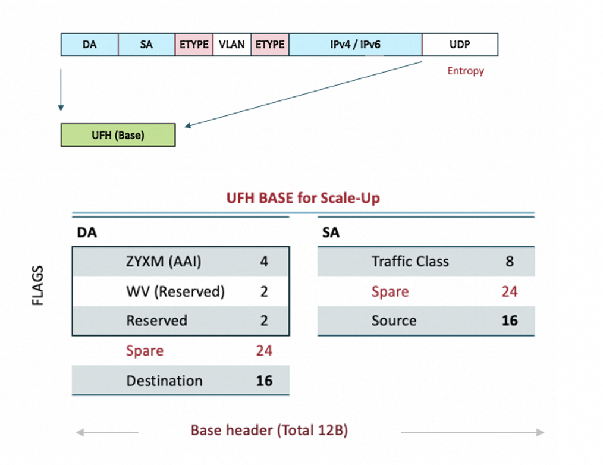

Here shows the difference between L2 Mac Lookup and ID Lookup

| Index | L2 MAC Lookup | ID Lookup (UFH)|
|:--:|:--:|:--:|
|Multi-Path | Not Support | ECMP |
| QoS | 3bit CoS in VLAN tag | ToS 6bit |
| ECN | Not support | Support |
| Flexibility | Need to defined new Ethertype, Standard Mac address | UFH extend header, 6B/12B ID lookup, Follow SLAP |

In the forwarding plane, vrf is used to isolate tenants. At the same time, the chip maintains a forwarding table for each vrf and finds the destination by looking up Dest ID + Vrf

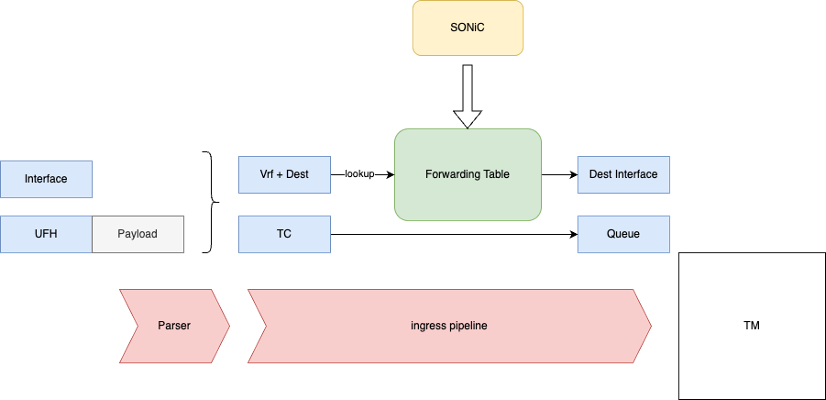

The configuration delivery channel can reuse the traditional route delivery API and is compatible with local static route delivery or SDN remote configuration.

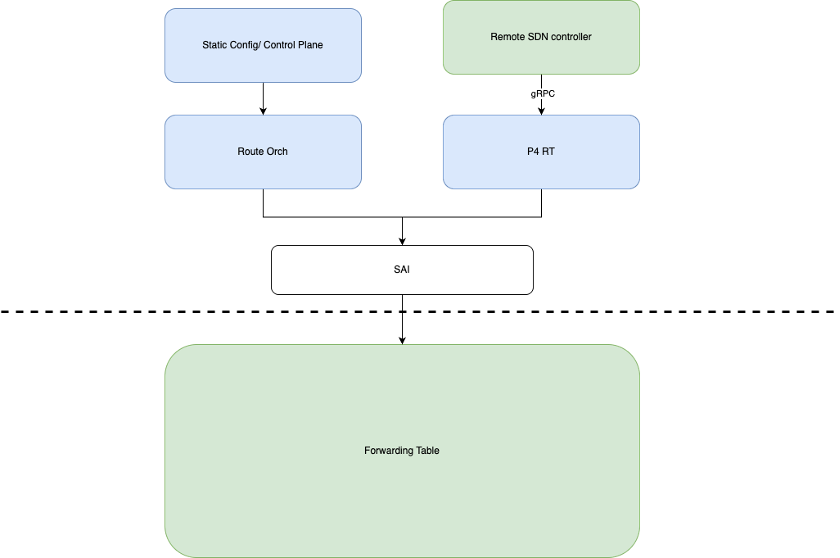

### PFC/CBFC

CBFC (Credit Based Flow Control) manages traffic at the level of Virtual Channels (VCs), supporting up to 32 VCs, which allows for finer-grained control compared to PFC. Credit represents the available buffer space on the receiver side. When the sender transmits a packet, it consumes the corresponding number of credits. Once the receiver releases buffer space, it generates new credits and grants them to the sender. Credits and buffer space are mapped one-to-one. In other words, every lossless packet sent by the sender will consume buffer space that has been pre-allocated by the receiver.

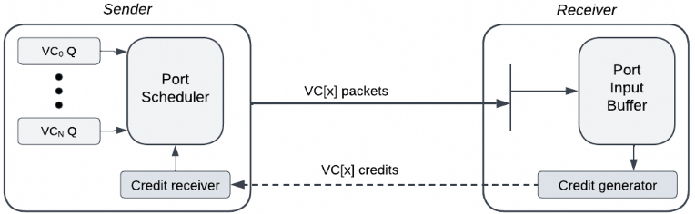

CBFC has several important parameters. CreditSize defines the size of each credit, which typically corresponds to receiver ‘s buffer cell size. TotalCredits represents the total number of credits allocated across all lossless virtual channels (VCs). In addition, several counters are used to track credit usage: credit consumed (CC), credit freed (CF), credit limit (CL), and credit in use (CU). Receiver can choose to configure only the TotalCredits, allowing the sender to determine how credits are distributed among the lossless VCs. Or, receiver can directly specify the credit limit for each VC. Sender and receiver synchronize their counters using CC update and CF update messages, which are triggered periodically by their timers. This mechanism also helps prevent credit leak caused by packet loss. The parameters of each VC are configured through management software or LLDP.
The following table shows the difference between PFC and CBFC.

| | PFC | CBFC|
|:-:|:-:|:-:|
| Implement | Simpler | More complicated |
| Overhead | Low, no message when no control event occurring. | Need synchronize periodically by sending update messages. |
| Multiple Resources | Can manage multiple resources within a priority class. | Manage main input buffer only. CBFC and PFC together can manage multiple switch resources. |
| Managed Object | Priority class, up to 8. | Can enable more lossless VCs, up to 32.|
| Sender | Sender knows nothing other than congestion. | Sender knows the credit usage by each VC, allowing for improved SCH/LB/AR.|
| Delay sensitive | If cable delay is underestimated, PFC can have buffer overflows and dropped packets. | CBFC is not as sensitive as PFC to cable length, frame size, or response time of the sender. Buffer may be underutilized. |
| Buffer usage | 1. Can enable more sharing and efficient usage of burst absorption buffer across ports. 2. Need headroom buffer to handle on fly packets. | 1. Can’t share buffer across ports. 2. For virtual channels that do not require full throughput, CBFC can simply allocate fewer credits and thus require less buffer space than PFC. 3. No need for headroom buffer.|

In general, PFC is simpler, has lower overhead, and may enable more efficient buffer usage. On the other hand, CBFC can provide finer-grained flow control with better performance, guarantees no packet drops when used with LLR, and is less sensitive to delay.
When implementing and deploying CBFC in a scale-up network, the following mechanisms need to be specified:

- The mapping of traffic to virtual channels (VCs).
- The distribution of credits among VCs to ensure full utilization of available bandwidth.
- The mapping of VCs to output queues.

### LLR

TBD

## Resiliency and Fault Tolerance

Any failure in a scale-up cluster affects the performance of the entire cluster. This makes it critical to develop resiliency solutions to address common failure modes.

### GPU Failures

Empirical results from large scale deployments indicate that GPU or associated HBM errors are most common in a large deployment. Some deployments may provision for spare GPUs, others may refactor a job when GPUs fail and fall back to a checkpoint. Handling such errors is outside the scope of a switch NOS, and hence outside the scope of this WG.

### Switch Failures

Hard failures can result in a switch going completely down and disabling forwarding on all its ports. This is typically visible to each connected station as a link failure. It requires each station to update its forwarding and load balancing policies. The station may rely on any additional ports, or if none are available declare itself as down. Switches can also suffer from silent failures where some ports go down or stop forwarding. Such failures must be detected through probing.

### Link Failures

Smaller clusters may choose to use DAC cables, but they are impractical for larger clusters due to GPU density and reachability limits. Optical links are required, but also more susceptible to failures.
Link failures can be categorized as hard or soft. Hard failures can be detected by the Ethernet PHY on a GPU or Switch. Soft or Gray failures are harder to detect and require the use of a periodic probing mechanism such as BFD or a background monitoring function that tracks link error rates and flaps. Any path probing mechanisms implemented in a fabric can be hop-by-hop, between GPU and Switch or end to end between GPU and GPU. The choice depends on cluster design. The figure below shows hop by hop probing with probes initiated at a switch and reflected back by the GPU station.

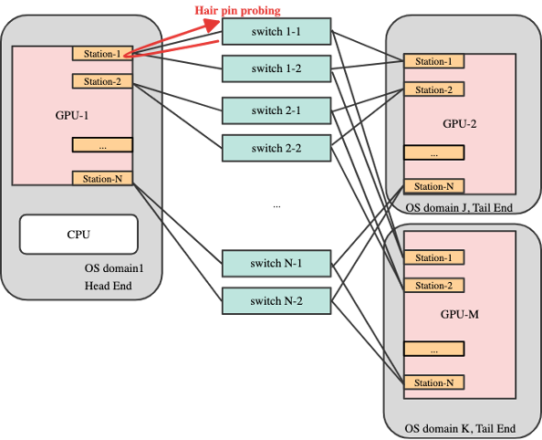

The failure of one link creates a capacity mismatch in the scale-up cluster. An affected plane has no reachability to the affected GPU but remains usable for other destinations. Removing the entire plane from service is undesirable. The recovery actions can vary from deployment to deployment.

#### Redundant Links

One option is to provision multiple links between a GPU and a switch, ensuring that the failure of a link does not cause total loss of connectivity. The representative topology shows 2 links per station to support this model. Loss of capacity on a particular plane can be handled by effective load balancing in the GPU station’s adaptation layer.

#### Tracking per target reachability

If GPUs track reachability on a per (target GPU, plane) basis, they can avoid planes with no reachability to a target. This function can also be implemented in the adaptation layer.

#### Fabric enables alternate paths

If a GPU does not track reachability as above, the fabric may need to be designed to support inter-plane connectivity as shown below. SONiC can update routing tables to select the exception path.
Consider the example topology below with an exception path connecting the different planes, and the associated route table at different nodes.

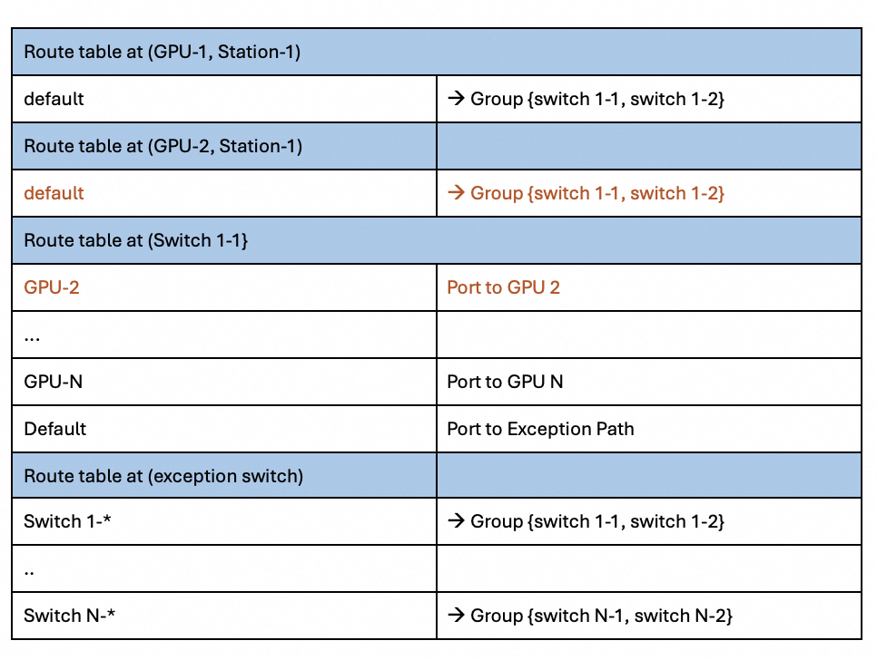

Now imagine a failure of a link between GPU-2 and Switch 1-1. The affected configuration is shown in red in the above table. GPU-2 and Switch 1-1 update their route table to remove each other. Other GPUs are unaware of this failure and will continue to send to switch 1-1. Removal of the direct route at switch 1-1 causes traffic to take the exception path. The exception path now redirects it to any of the alternate paths/planes to get to GPU 2.
Reconfiguration will typically take milli-seconds and traffic will be black holed in this interval. It is now up to the GPU adaptation layer to recover from this error by either retransmitting stored transactions, or if that is not possible then to initiate fallback to a prior checkpoint.

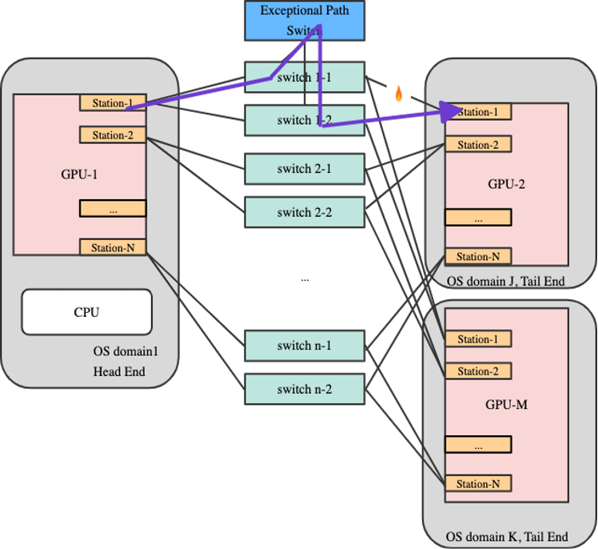

## SONiC

- Do we want to make any assumptions about the software stack?
- What changes do we need for SONiC?
- Which parts are optional?
- Any new features required?
-
