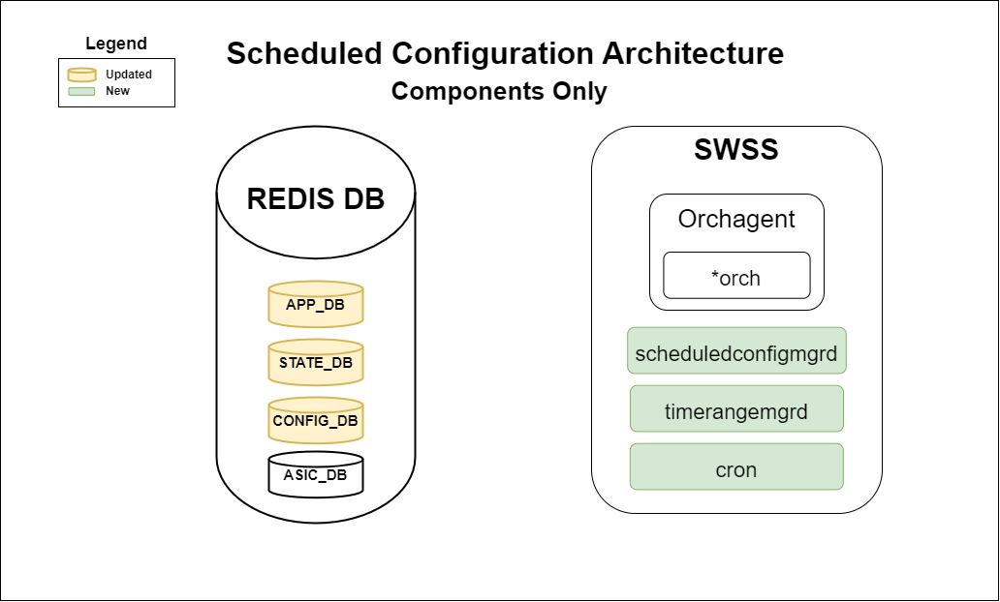
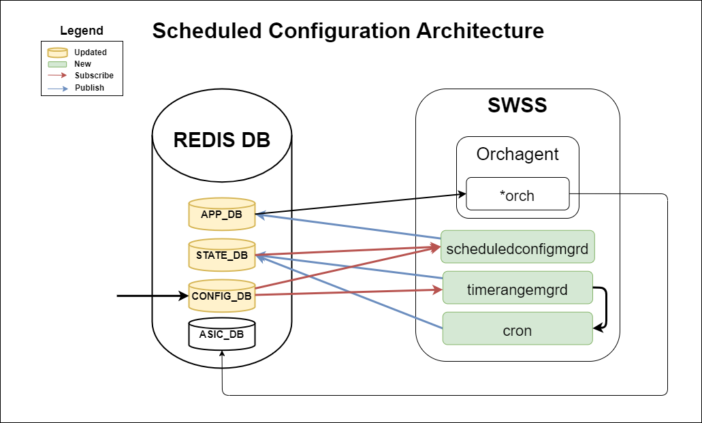
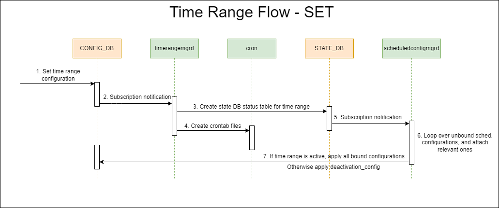
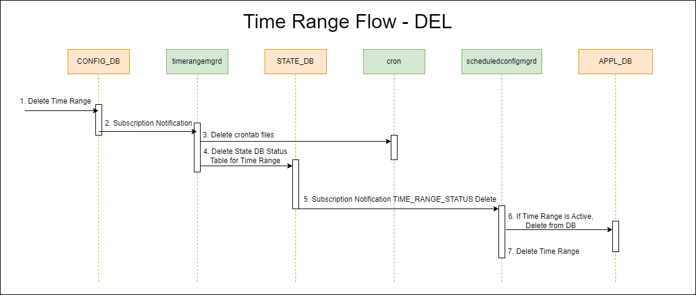
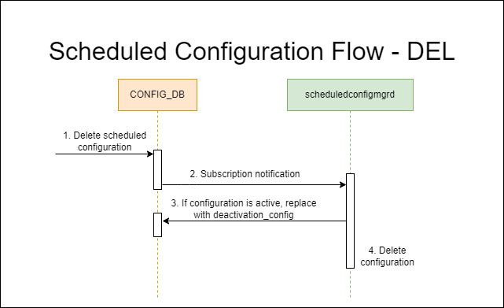

# Scheduled Configurations HLD

## Table of Content

- [Scheduled Configurations HLD](#scheduled-configurations-hld)
  - [Table of Content](#table-of-content)
  - [Revision](#revision)
  - [Scope](#scope)
  - [Definitions/Abbreviations](#definitionsabbreviations)
  - [Overview](#overview)
  - [Requirements](#requirements)
    - [Design Requirements](#design-requirements)
    - [Functional Requirements](#functional-requirements)
  - [Architecture Design](#architecture-design)
    - [New Components](#new-components)
      - [REDIS DB](#redis-db)
        - [CONFIG\_DB](#config_db)
        - [STATE\_DB](#state_db)
      - [SWSS](#swss)
    - [Subscription APPL\_DB](#subscription-appl_db)
    - [Flow Diagrams](#flow-diagrams)
      - [Set](#set)
      - [Delete](#delete)
      - [Events](#events)
  - [High-Level Design](#high-level-design)
  - [Configuration and Management](#configuration-and-management)
    - [Redis DB Enhancements](#redis-db-enhancements)
      - [CONFIG\_DB](#config_db-1)
        - [TIME\_RANGE Table](#time_range-table)
        - [SCHEDULED\_CONFIGURATION Table](#scheduled_configuration-table)
      - [STATE\_DB](#state_db-1)
    - [Config JSON Schema](#config-json-schema)
      - [TIME\_RANGE Table](#time_range-table-1)
        - [Example](#example)
      - [SCHEDULED\_CONFIGURATIONS Table](#scheduled_configurations-table)
        - [Example](#example-1)
    - [YANG Model Enhancements](#yang-model-enhancements)
      - [TIME\_RANGE Yang Model](#time_range-yang-model)
      - [SCHEDULED\_CONFIGURATIONS Yang Model](#scheduled_configurations-yang-model)
    - [CLI Commands](#cli-commands)
      - [Show Time Range](#show-time-range)
      - [Show Scheduled Configurations](#show-scheduled-configurations)
  - [SAI API](#sai-api)
  - [Warmboot and Fastboot Design Impact](#warmboot-and-fastboot-design-impact)
  - [Restrictions/Limitations](#restrictionslimitations)
  - [Testing Requirements/Design](#testing-requirementsdesign)
    - [Unit Test cases](#unit-test-cases)
    - [System Test cases](#system-test-cases)
  - [Open/Action items](#openaction-items)
  - [References](#references)

## Revision

Revision 1.1

## Scope

The scope of this document is to outline the High-Level Design (HLD) for the *Scheduled Configurations* feature in SONiC. This feature aims to enable and disable SONiC configurations based on a schedule defined by the user. It includes the ability to schedule configurations for absolute-time events as well as recurring time intervals.

## Definitions/Abbreviations

| **Term**    | **Definition**                                                                       |
| ----------- | ------------------------------------------------------------------------------------ |
| *CONFIG_DB* | Configuration Database used by SONiC to store the static configuration of the system |
| *STATE_DB*  | State Database in SONiC to store the runtime state of the system                     |
| *APPL_DB*   | Stores the state generated by all application containers                             |
| *SWSS*      | SONiC SWitch State service                                                           |
| *cron*      | time-based job scheduler linux application                                           |

## Overview

The *Scheduled Configurations* feature will allow administrators to schedule specific network configurations to be applied and later removed at predefined times without manual intervention. This capability is particularly useful for network scenarios where policies need to change dynamically at certain times of the day or week, such as different ACL rules that should be active only during business hours. The scheduled configuration feature easily integrates within the existing infrastructure of SONiC by following established practices and utilizing widely adopted tools like `cron`. `cron` is a time-based job scheduler in Unix-like operating systems, used to automate the execution of scripts and commands at specified times. This approach not only minimizes the learning curve associated with the adoption of new features but also leverages the proven reliability and efficiency of an open-source utility.

## Requirements

### Design Requirements

- **Configurability**: Administrators must be able to define time ranges for configuration activation and deactivation.
- **Extensibility**: The design should be flexible to support various configuration types like ACL, QoS, port shutdown, etc...

### Functional Requirements

- **Scheduling**: The system must be able to handle both absolute and recurring events.
- **State Tracking**: The system should keep track of active configurations and their current states.

## Architecture Design

In practice, the administrator will configure both a time range (a start and end time) and at least one scheduled configuration bound to that time range. When the beginning of the time range is reached, the system automatically activates the associated configurations. These configurations remain active until the end of the time range, at which point they are automatically deactivated.

For example, an administrator may create a time range to run every weekday from 8 AM to 5 PM. Then the administrator will create a configuration to apply an ACL in order to block (or allow) specific IP addresses and bind it to the time range. This ACL will be applied at the beginning of the time range (8 AM) and removed at the end of the time range (5 PM).

The Scheduled Configurations feature enhances the existing SONiC architecture by introducing two new managers within the swss container, alongside the established `cron` utility. This approach not only ensures seamless integration with the current system but also maintains flexibility for future adaptations, as `cron` can be substituted with other scheduling utilities if more advanced or different functionality is required.



### New Components

#### REDIS DB

##### CONFIG_DB

- **TIME_RANGE**: A table representing the time ranges that were configured by the user.
- **SCHEDULED_CONFIGURATIONS**: Represents a configuration that is will be applied when the associated time range is enabled. Contains a field that binds this configuration to a time range.

##### STATE_DB

- **TIME_RANGE_STATUS_TABLE**: Table representing whether this time range is currently active.

#### SWSS

- **timerangemgrd**: This application will monitor and manage `TIME_RANGE` table in the `CONFIG_DB`. It will parse, validate, and create a new entry under the `TIME_RANGE_STATUS_TABLE` in the `STATE_DB`, as well as create crontab files that manage the statuses of `TIME_RANGE_STATUS_TABLE`.
- **cron**: This application will manage the `TIME_RANGE_STATUS_TABLE` for each entry, and update the status based on the scheduled time.
- **scheduledconfigmgrd**: This application subscribes to `TIME_RANGE_STATUS_TABLE` in the `STATE_DB`, updated by the `cron` application. When the time range is becomed *active*, It will be responsible for applying configurations given by `SCHEDULED_CONFIGURATIONS` in `CONFIG_DB`, by publishing them to the `APPL_DB`, and also removing them when the time range becomes *inactive*.

### Subscription APPL_DB

In order to fully integrate with the new scheduled configurations feature, all switch components desiring to utilize this functionality must subscribe to the `APPL_DB`. The table schema will be the same as the schema used in `CONFIG_DB` to apply new configurations, all that is needed is to add the new subscription to the orchagent subcomponents. This is done in order to distinguish between administrator configurations, and configurations applied due to an application (ie. *Scheduled Configurations*).

The following diagram shows the connections between the different components:



### Flow Diagrams

The following diagrams illustrate the interactions between the databases and applications when setting the time range and scheduled configurations settings, as well as what happens when an event is triggered.

#### Set



1. Apply time range configuration to `TIME_RANGE` in `CONFIG_DB` through sonic-cfggen or other management tool
2. Changes to the `TIME_RANGE` table will cause a subscription notification to be sent to `timerangemgrd`
3. `timerangemgrd` will create a new entry in the `TIME_RANGE_STATUS_TABLE` table found in the `STATE_DB` defaulting to *active* or *inactive* status based on the current time
4. `timerangemgrd` will then create the crontab files used by the `cron` application to activate, or deactivate the status of the `TIME_RANGE_STATUS_TABLE`


1. Apply scheduled configurations to the `SCHEDULED_CONFIGURATIONS` table in `CONFIG_DB`
2. Changes to `SCHEDULED_CONFIGURATIONS` will cause a subscription notification to `scheduledconfigmgrd`
3. If the time range this configuration is already active, it will publish this new configuration to the `APPL_DB`
4. `scheduledconfigmgrd` saves the configuration internally

#### Delete



1. A time range is deleted from the `TIME_RANGE` table in `CONFIG_DB`
2. A subscription notification is sent to `timerangemgrd` with the op *delete*
3. `timerangemgrd` deletes the crontab files associated with this time range
4. `timerangemgrd` deletes the time range entry from the `TIME_RANGE_STATUS_TABLE` table found in the `STATE_DB`
5. A subscription notification is sent to `scheduledconfigmgrd` the op *delete*
6. `scheduledconfigmgrd` checks if the time range is active, if yes then it will deactivate the configurations bound to this time range by deleting the configurations from the `APPL_DB`
7. Finally, `scheduledconfigmgrd` deletes the time range internally, and the scheduled configurations will be unbound



1. A scheduled configuration is deleted form the `SCHEDULED_CONFIGURATIONS` table in `CONFIG_DB`
2. A subscription notification is sent to `scheduledconfigmgrd` with the op *delete*
3. `scheduledconfigmgrd` checks if the scheduled configuration is active, if yes then it will deactivate the configuration by deleting the configurations from the `APPL_DB`
4. Finally, `scheduledconfigmgrd` deletes the scheduled configuration internally

#### Events


1. During the scheduled activation time, `cron` updates the **status** field in the `TIME_RANGE_STATUS_TABLE` found in the `STATE_DB` to *active*
2. A subscription notification is sent to `scheduledconfigmgrd`
3. `scheduledconfigmgrd` applies all the configurations bound to the time range by publishing to the `APPL_DB`
4. During the scheduled deactivation time, `cron` updates the **status** field in the `TIME_RANGE_STATUS_TABLE` found in the `STATE_DB` to *inactive*
5. A subscription notification is sent to `scheduledconfigmgrd`
6. `scheduledconfigmgrd` deletes all the configurations bound to the time range by publishing to the `APPL_DB`

## High-Level Design

- This feature will be a built-in part of SONiC, specifically inside the SWSS container.
- The feature will impact `CONFIG_DB` and `STATE_DB`, and `APPL_DB`.
- No impact on warmboot and fastboot functionality.
- No hardware platform-specific dependencies are expected.
- Dependandant on cron open-source linux utility.
- The feature is designed to be managed through SONiC's existing management interfaces.
- New show commands will be added to see the current scheduled configurations.

## Configuration and Management

The configuration will be managed via a new table schema in `CONFIG_DB`. The scheduling component will ensure that time ranges are activated and deactivated in `STATE_DB` as per the given schedule.

### Redis DB Enhancements

#### CONFIG_DB

##### TIME_RANGE Table

```
key           = TIME_RANGE|name                       ; Unique identifier for each time range.
;field        = value
start         = cron-expr                             ; Start time in cron expression format.
end           = cron-expr                             ; End time in cron expression format.
start_year    = string                                ; Year to begin the time interval. Optional.
end_year      = string                                ; Year to end the time interval. Optional.

;value annotations
cron-expr     = 1*128VCHAR                            ; Cron compatible expression. Ex. "0 9 * * 1-5" -- Every weekday at 9AM
```

##### SCHEDULED_CONFIGURATION Table

```
key           = SCHEDULED_CONFIGURATIONS|name    ; Unique identifier for each scheduled configuration.
;field        = value
time_range    = name                              ; Reference to the name of the time range in TIME_RANGE table.
configuration = JSON_STRING                       ; The actual configuration data in JSON string format.

;value annotations
name          = 1*64VCHAR                         ; Unique time range name.
JSON_STRING   = 1*512M VCHAR                      ; String containing a JSON formatted configuration.
```

#### STATE_DB

The new `TIME_RANGE_STATUS_TABLE` table in `STATE_DB` will have a simplified schema focused on tracking the enablement status of scheduled configurations.

```
key     = TIME_RANGE_STATUS_TABLE|name    ; Unique identifier for each time range.
;field  = value
status  = status-str                      ; The current status of the configuration.

;value annotations
status-str     = "active"/"inactive"      ; String representing the current status of the configuration.
```

### Config JSON Schema

#### TIME_RANGE Table

```json
{
    "TIME_RANGE": {
        "<TIME_RANGE_NAME>": {
            "start": "<CRON_SCHEDULING_EXPRESSION>",
            "end": "<CRON_SCHEDULING_EXPRESSION>",
            "start_year": "<YEAR>", // optional field
            "end_year": "<YEAR>" // optional field
        }
    }
}
```

- `<TIME_RANGE_NAME>`: A unique identifier for the time range.
- `<CRON_SCHEDULING_EXPRESSION>`: Specifies recurring schedule for both the start and end of the time range.
- `<YEAR>`: An integer representing the year this time range should be enabled. This allows for absolute time configuration.


##### Example

```json
{
    "TIME_RANGE": {
        "NightlyBackup": {
             "start": "0 23 * * MON-FRI",
             "end": "0 0 * * MON-FRI"
        },
        "MaintenanceWindow": {
            "start": "30 6 25 DEC *",
            "end": "0 8 2 JAN *",
            "start_year": "2024",
            "end_year": "2025"
        }
    }
}
```

#### SCHEDULED_CONFIGURATIONS Table

```json
{
    "SCHEDULED_CONFIGURATIONS": {
        "<CONFIG_NAME>": {
            "time_range": "<TIME_RANGE_NAME>",
            "configuration": {
                // type-specific configuration goes here
            }
        }
    }
}
```

- `<CONFIG_NAME>`: A unique identifier for the scheduled configuration.
- `<TIME_RANGE_NAME>`: The reference to the time interval defined in the `TIME_RANGE` table.
- `configuration`: The actual configuration data to be applied during the specified time range.

##### Example

```json
{
    "SCHEDULED_CONFIGURATIONS": {
        "NightTime_ACL": {
            "time_range": "NightlyBackup",
            "configuration": {
                "ACL_TABLE": {
                    "ACL_TABLE_NAME": {
                    "policy_desc": "Night Time Access Control",
                    "type": "L3",
                    "ports": ["Ethernet0", "Ethernet4"]
                    }
                }
            }
        }
    }
}
```

***NOTE**: ACL tables are already supported in APPL_DB with the table name "ACL_TABLE_TABLE", but it is recommended to create a new subscription using the same table name as found in CONFIG_DB

### YANG Model Enhancements

#### TIME_RANGE Yang Model

```yang
module sonic-timerange {

    yang-version 1.1;

    namespace "http://github.com/sonic-net/sonic-timerange";
    prefix timerange;

    description "TIME_RANGE YANG Module for SONiC OS Used for Scheduled Configuration";

    revision 2024-05-09 {
        description "First Revision";
    }

    container sonic-timerange {

        container TIME_RANGE {

            description "TIME_RANGE part of config_db.json";

            list TIME_RANGE_LIST {
                description "List of time ranges, each identified by unique name";

                key "name";

                leaf name {
                    type string;
                    description "Unique name for the time range";
                }

                leaf start {
                    mandatory true;
                    type string {
                        length "1..255";
                    }
                    description "Start time for time range";
                }

                leaf end {
                    mandatory true;
                    type string {
                        length "1..255";
                    }
                    description "End time for time range";
                }

                leaf start_year {
                    type integer;
                    description "Indicates what year this time range will begin running";
                }

                leaf end_year {
                    type integer;
                    description "Indicates what year this time range will end";
                }
            } /* end of list TIME_RANGE_LIST */
            
        } /* end of container TIME_RANGE */
        
    } /* end of top level container */
    
} /* end of module sonic-timerange */
```

#### SCHEDULED_CONFIGURATIONS Yang Model

```yang
module sonic-scheduled-configurations {

    yang-version 1.1;

    namespace "http://github.com/sonic-net/sonic-scheduled-configurations";
    prefix scheduled-configurations;

    description "SCHEDULED_CONFIGURATIONS YANG Module for SONiC OS Used for Scheduled Configuration";

    revision 2024-05-09 {
        description "First Revision";
    }

    container sonic-scheduled-configurations {

        container SCHEDULED_CONFIGURATIONS {

            description "TIME_RANGE part of config_db.json";

            list SCHEDULED_CONFIGURATIONS_LIST {
                description "List of scheduled configurations, each identified by unique name";

                key "name";

                leaf name {
                    type string;
                    description "Unique name for the scheduled configuration";
                }

                leaf time_range {
                    mandatory true;
                    type string {
                        length "1..255";
                    }
                    description "Time range this configuration is bound to";
                }

                leaf configuration {
                    type string;
                    description "Configuration to be applied to APPL_DB in JSON format";
                }
            } /* end of list SCHEDULED_CONFIGURATIONS_LIST */
            
        } /* end of container SCHEDULED_CONFIGURATIONS */
        
    } /* end of top level container */
    
} /* end of module sonic-scheduled-configurations */
```

### CLI Commands

#### Show Time Range

A new CLI command `show time-range-configurations` will be implemented to show all the time range confiugrations currently managed by the **scheduledconfigmgrd**, grouped by time-ranges, and showing the status of each time range.

If you also include the name of a specific time range, only that time range's details will be shown.

The following is the syntax:

```bash
show time-range-configurations [time_range_name]
```

```bash
Time Range           Status  Start Schedule  End Schedule   Years      Configurations
-----------------  --------  --------------  -------------  ---------  ---------------
Nightly Backup     Active    "0 23 * * MON"  "0 0 * * MON"  N/A        NightTime_ACL
                                                                       DataBackup
                                                                       ServerMaintenance
Weekend Sync       Inactive  "0 0 * * SAT"   "0 0 * * MON"  N/A        WeekendRatesUpdate
MaintenanceWindow  Active    "30 6 * DEC *"  "0 8 * JAN *"  2024-2025  MaintenanceTasks
Holiday Hours      Active    "0 0 25 DEC *"  "0 0 26 DEC *" 2024-      HolidaySpecials
```

The following is an example of using a specific time range name:

```bash
Time Range: ActiveTimeRange
Status: active
Start Schedule: 0 6 * * *
End Schedule: 0 22 * * *
Years: N/A
Configurations:
    Second_ACL
```

#### Show Scheduled Configurations

A new CLI show command `show scheduled-configurations` will be implemented to show all the scheduled configurations currently managed by **scheduledconfigmgrd**. It will be listed in alphabetical order, showing if it is currently active and the time range that it is bound to.

Specifying a configuration by name will show only that configuration, but with the added detail of the full json configuration that is being applied.

```bash
show scheduled-configurations [scheduled_configuration_name]
```

```bash
Configuration Name        Status      Time Range
------------------        -------     --------------
DataBackup                Active      Nightly Backup
HolidaySpecials           Unbound     Holiday Hours
NightTime_ACL             Active      Nightly Backup
WeekendRatesUpdate        Inactive    Weekend Sync
```

The following is an example of using a specific configuration name:

```bash
Configuration Name: NightTime_ACL
Status: Active
Time Range: Nightly Backup
Configuration:
{
    "ACL_TABLE_TABLE": {
        "ACL_TABLE_NAME": {
            "policy_desc": "Night Time Access Control",
            "type": "L3",
            "ports": ["Ethernet0", "Ethernet4"]
        }
    }
}
```

## SAI API

There are no SAI API changes.

## Warmboot and Fastboot Design Impact

No impact to warmboot/fastboot.
Crontab files remain persistant, STATE_DB and other DB entries are restored, and the manager daemons continue their functionality post-boot.

## Restrictions/Limitations

- **Reliable System Clock**: Cron (and therefore *scheduled configurations*) relies heavily on the system clock to operate. Misconfiguration, or issues with time synchronization protocols (like NTP), can lead to configurations being applied at incorrect times, configurations not being removed, or not at being applied at all.
- **Valid Cron Ranges**: When configuring time ranges, ensure that the start and end expressions define a valid sequence. For example, a start time of "0 23 * * MON-WED" and an end time of "0 5 * * TUE-THU" is invalid. This configuration would result in multiple starts occurring before an end event, and multiple end events occurring in sequence, leading to undefined behavior. Users must ensure that each start is followed by a corresponding end before the next start occurs.

## Testing Requirements/Design

This feature will be tested with mock tests. We will schedule a set of configurations including ACL, QoS, and port shutdown. Any extended functionality that will be added in the future should also create a mock test in order to verify that scheduling the configuration from the `APPL_DB` is functional.

### Unit Test cases

- Verify when a time range is created, that the associated STATE_DB entry is created
- Verify TIME_RANGE_STATUS_TABLE entry of time range is updated to *active* when start of time range is reached
- Verify TIME_RANGE_STATUS_TABLE entry of time range is update to *inactive* when end of time range is reached
- Verify TIME_RANGE_STATUS_TABLE entry of time range defaults to *active* when creating time range in the middle of range
- Verify TIME_RANGE_STATUS_TABLE entry of time range defaults to *inactive* when creating outside of time range
- Verify scheduled configuration can be created without time range it is bound to being created first
- Verify time range can be created without a scheduled configuration bound to it

### System Test cases

- Test if the scheduled configuration of a specific feature (ACL, QoS, ...) is correctly being applied all the way down to the hardware level

## Open/Action items

**TODO**

## References

cronjob time syntax: <https://manpages.debian.org/jessie/cron/crontab.5.en.html>, <https://crontab.guru/>
