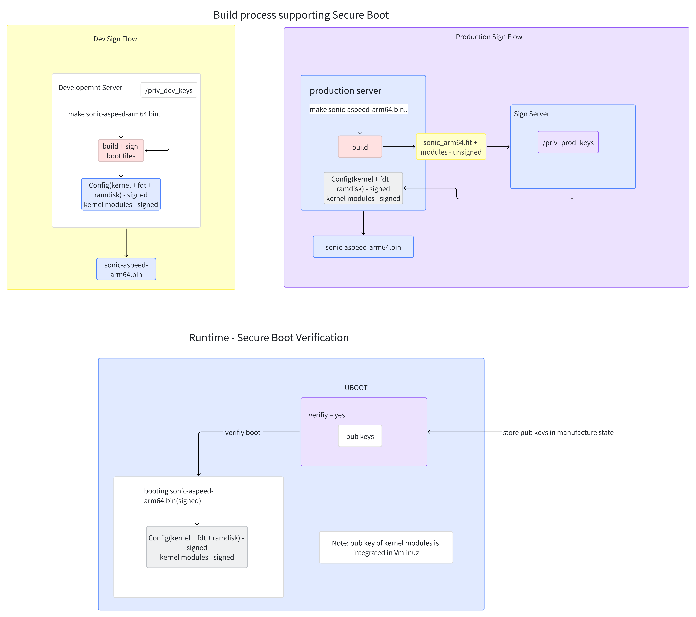
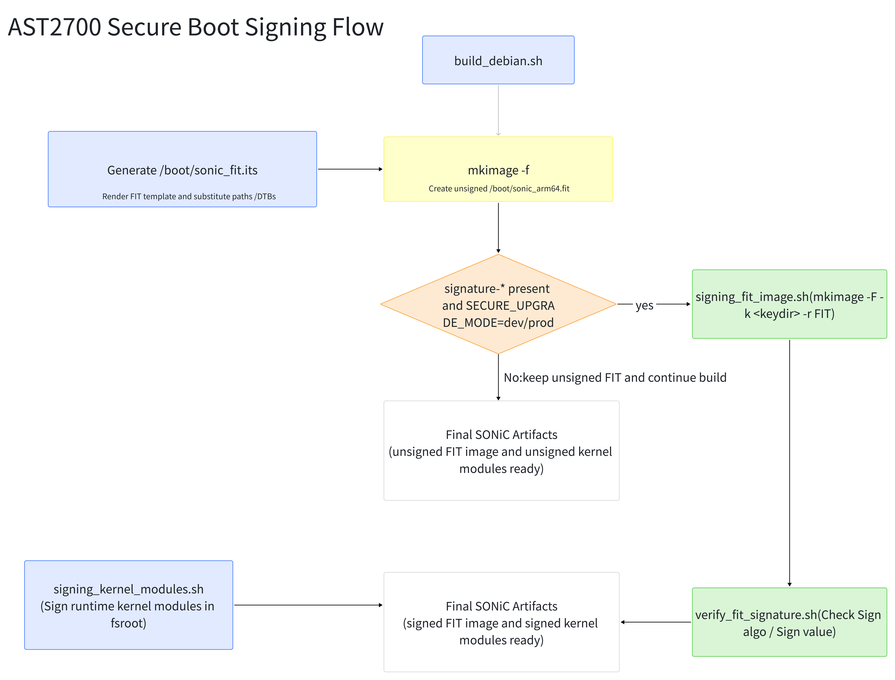
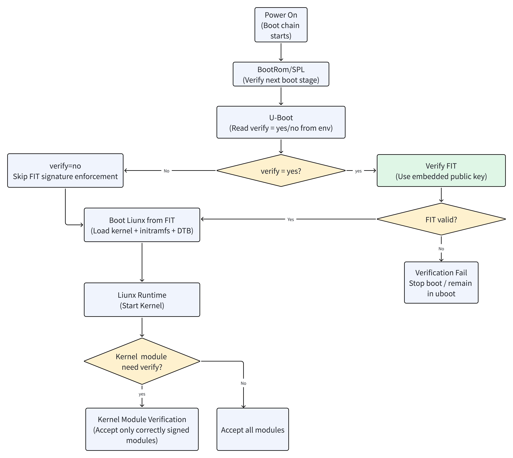

# HLD AST2700 U-Boot Secure Boot #

## 1. Table of Content
<!-- vscode-markdown-toc -->
* 1. [Table of Content](#TableofContent)
    * 1.1. [Revision](#Revision)
    * 1.2. [Scope](#Scope)
    * 1.3. [Definitions/Abbreviations](#DefinitionsAbbreviations)
    * 1.4. [Overview](#Overview)
    * 1.5. [Requirements](#Requirements)
    * 1.6. [Architecture Design](#ArchitectureDesign)
    * 1.7. [High-Level Design](#High-LevelDesign)
        * 1.7.1. [Flow diagram](#Flowdiagram)
        * 1.7.2. [Module Elements Breakdown](#ModuleElementsBreakdown)
        * 1.7.3. [Sign Flow diagram description](#SignFlowdiagramdescription)
        * 1.7.4. [Runtime SB Verification Flow](#RuntimeSBVerificationFlow)
    * 1.8. [Configuration and management](#Configurationandmanagement)
    * 1.9. [Restrictions/Limitations](#RestrictionsLimitations)
    * 1.10. [Testing Requirements/Design](#TestingRequirementsDesign)
        * 1.10.1. [Unit Test cases](#UnitTestcases)
        * 1.10.2. [System Test cases](#SystemTestcases)
    * 1.11. [Open/Action items - if any](#OpenActionitems-ifany)

<!-- vscode-markdown-toc-config
    numbering=true
    autoSave=true
    /vscode-markdown-toc-config -->
<!-- /vscode-markdown-toc -->

### 1.1. Revision
| Rev | Date | Author | Change Description |
| :--: | :--: | :----: | ------------------ |
| 0.1 | 06/2026 | John | Initial AST2700 / U-Boot secure boot HLD |

### 1.2. Scope

This document describes the requirements, architecture, build integration, and
runtime verification model for implementing secure boot on SONiC platforms that
boot through BootROM, SPL, and U-Boot on Aspeed AST2700.

Unlike the community `hld_secure_boot.md`, which focuses on BIOS/UEFI,
`shim`, and `grub`, this design targets a U-Boot verified-boot chain built
around a signed FIT image.

### 1.3. Definitions/Abbreviations

    SB   - Secure Boot
    FIT  - Flattened Image Tree
    SPL  - Secondary Program Loader
    RoT  - Root of Trust
    KO   - Kernel Object / kernel module
    OTP  - One-Time Programmable storage

### 1.4. Overview

Secure boot is a chain-of-trust mechanism that ensures each boot stage verifies
the integrity and authenticity of the next stage before transferring control.

For SONiC on x86, the current community design uses:

1. BIOS / UEFI as the first instance of trust
2. `shimx64.efi`
3. `grubx64.efi`
4. signed Linux kernel and signed kernel modules

AST2700 platforms do not follow that boot path. They boot through:

1. BootROM
2. SPL
3. U-Boot
4. signed SONiC FIT image
5. Linux kernel, initramfs, DTB, and runtime-signed kernel modules

Because of this, simply reusing the x86 `shim/grub` signing flow is not
sufficient. The secure boot enforcement point for AST2700 must be U-Boot FIT
verification.

### 1.5. Requirements

Secure boot flow and Linux kernel requirements for AST2700:

1. Support signing of the SONiC FIT image
2. Support signing of kernel modules
3. Support runtime verification of the FIT image in U-Boot
4. Preserve existing x86/UEFI secure boot behavior
5. Support both development signing flow and vendor production signing flow

The feature has two logical parts:

1. Signing flow during image build
2. Verification flow during boot

As with the community design, development flow is implemented in-tree, while
production flow remains vendor-controlled.

### 1.6. Architecture Design

Arc design diagram\

Architecture description:

There are two major verification layers in this design:

1. Boot-time verification layer
   - BootROM / SPL / U-Boot verify the next boot stage
   - U-Boot verifies the FIT image before Linux starts

2. Linux runtime verification layer
   - Linux verifies signed kernel modules after boot

### 1.7. High-Level Design

This section covers the high-level design of secure boot for AST2700.

#### 1.7.1. Flow diagram

##### Sign flow diagram

##### Run-time verification flow diagram

#### 1.7.2. Module Elements Breakdown

##### BootROM / HW RoT role

BootROM or an SoC-backed hardware root of trust is the first possible
verification point. This stage is platform-specific and usually vendor BSP
dependent.

##### SPL role

SPL initializes minimum hardware state and loads U-Boot. In a hardened secure
boot design, SPL should verify U-Boot before executing it.

##### U-Boot role

U-Boot is the enforcement point for SONiC boot integrity on AST2700. It loads
the FIT image and, when `verify=yes`, verifies the FIT signature against a
public key embedded in the U-Boot control DTB.

##### FIT role

The FIT image packages:

1. Linux kernel
2. initramfs
3. one or more DTBs
4. configuration nodes selecting which DTB to boot

The FIT `signature-*` node is where U-Boot expects the signing metadata.

##### Kernel and initramfs role

The kernel is booted from FIT. `initramfs` remains part of the FIT payload and
is protected by FIT verification when its hash is included in `sign-images`.

##### Kernel modules role

Kernel modules are verified by Linux runtime module-signing enforcement and are
not verified by U-Boot.

#### 1.7.3. Sign Flow diagram description

Sign flow occurs when building the SONiC image.

The AST2700 build flow keeps the existing community secure-upgrade variables and
adds U-Boot/FIT-specific inputs.

Compilation flags used:

- `SECURE_UPGRADE_MODE`
  - `no_sign` (default)
  - `dev`
  - `prod`
- `SECURE_UPGRADE_DEV_SIGNING_KEY`
- `SECURE_UPGRADE_SIGNING_CERT`
- `SECURE_BOOT_FIT_SIGNING_KEY`
- `SECURE_BOOT_FIT_SIGNING_CERT`
- `SECURE_BOOT_FIT_KEY_NAME`
- `SECURE_BOOT_FIT_ALGO`

Current default mapping:

- `SECURE_BOOT_FIT_SIGNING_KEY -> SECURE_UPGRADE_DEV_SIGNING_KEY`
- `SECURE_BOOT_FIT_SIGNING_CERT -> SECURE_UPGRADE_SIGNING_CERT`

##### Sign keys

The FIT signing algorithm is declared in `platform/aspeed/sonic_fit.its` inside
the `signature-*` node. In the current implementation the Micas AST2700
configuration uses:

- `algo = "sha256,rsa4096"`

The private key is used during build-time FIT signing. The matching public key
must be embedded in U-Boot for runtime FIT verification.

##### How to sign the components

| Component | Signing Tool | Key format | Description |
| :-------: | :----------: | :--------: | ----------- |
| FIT image | `mkimage -F -k -r` | RSA over SHA-256 | U-Boot verified boot image |
| Kernel modules | `sign-file` / `signing_kernel_modules.sh` | kernel module signature format | Linux runtime module verification |

##### SONiC modifications in build flow

The AST2700-specific SONiC modifications are:

1. Generate `sonic_fit.its`
2. Generate `sonic_arm64.fit`
3. If the FIT template contains `signature-*`, sign the FIT image
4. Verify FIT signature metadata after signing
5. Keep x86/grub secure boot flow unchanged

##### FIT signing template

`platform/aspeed/sonic_fit.its` defines the FIT structure. Only the intended
AST2700 configuration should carry `signature-*` nodes. In the current
implementation, signing is enabled only for the Micas configuration.

#### 1.7.4. Runtime SB Verification Flow

Runtime verification happens in two layers.

##### Layer 1: U-Boot FIT verification

When U-Boot environment variable `verify=yes`:

1. U-Boot loads the FIT image
2. U-Boot verifies FIT signature using the embedded public key
3. If verification fails, boot must stop
4. If verification passes, U-Boot boots kernel, initramfs, and DTB

When `verify=no`, FIT signature verification is not enforced.

##### Layer 2: Linux module verification

After Linux boots:

1. kernel module signature policy is enforced
2. signed kernel modules can be loaded
3. unsigned or incorrectly signed modules are rejected when secure module
   verification is enabled

### 1.8. Configuration and management

Relevant configuration and management points:

1. Build flags
   - `SECURE_UPGRADE_MODE`
   - `SECURE_BOOT_FIT_SIGNING_KEY`
   - `SECURE_BOOT_FIT_SIGNING_CERT`
   - `SECURE_BOOT_FIT_KEY_NAME`
   - `SECURE_BOOT_FIT_ALGO`

2. U-Boot environment
   - `verify`
   - `fit_key_name`
   - `bootconf`
   - `fit_name`

No Config DB, CLI, or YANG changes are introduced by this design.

### 1.9. Restrictions/Limitations

1. This design does not replace the x86 community secure boot HLD. It is an
   AST2700/U-Boot-specific adaptation.
2. U-Boot runtime verification depends on OTP/SPL support, not only SONiC
   build changes.
3. The current build flow signs only the intended AST2700 FIT configuration,
   not all Aspeed configurations.

### 1.10. Testing Requirements/Design

#### 1.10.1. Unit Test cases

1. Verify FIT key name selection from `SECURE_BOOT_FIT_KEY_NAME`
2. Verify FIT signing helper scripts fail on missing key/cert/image inputs
3. Verify FIT signature metadata detection succeeds on signed FIT images
4. Verify kernel module signing path remains enabled for secure builds

#### 1.10.2. System Test cases

1. Build unsigned AST2700 image with `SECURE_UPGRADE_MODE=no_sign`
2. Build signed FIT AST2700 image with `SECURE_UPGRADE_MODE=dev`
3. Boot signed FIT successfully with `verify=yes`
4. Confirm modified FIT payload is rejected by U-Boot with `verify=yes`
5. Confirm FIT signed by an unknown key is rejected
6. Confirm unsigned kernel module load fails when runtime module verification is enabled
7. Confirm x86/grub secure boot flow remains unchanged

### 1.11. Open/Action items - if any

NOTE: All the sections and sub-sections given above are mandatory in the design document. Users can add additional sections/sub-sections if required.
