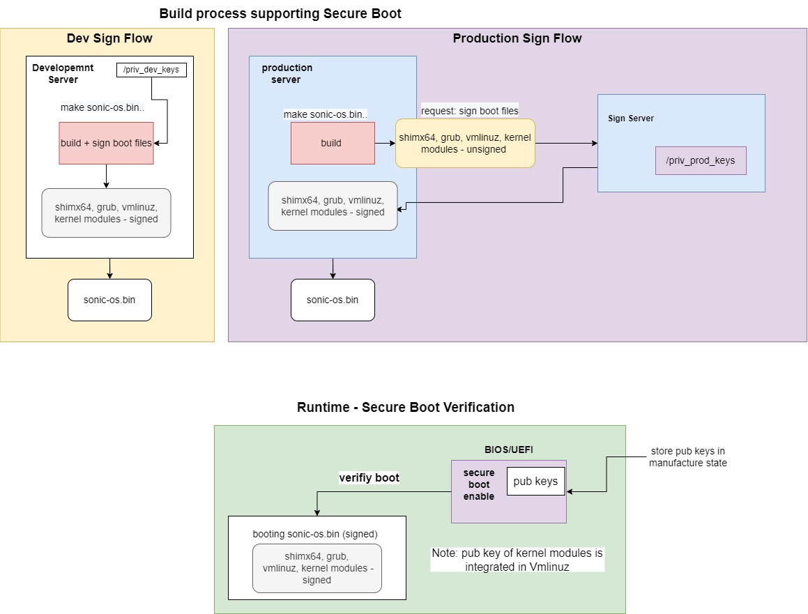
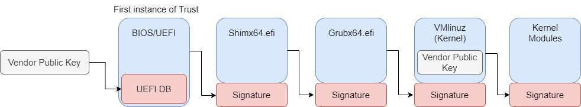

# HLD Secure Boot #

##  1. Table of Content
<!-- vscode-markdown-toc -->
* 1. [Table of Content](#TableofContent)
    * 1.1. [Revision](#Revision)
    * 1.2. [Scope](#Scope)
    * 1.3. [Definitions/Abbreviations](#DefinitionsAbbreviations)
    * 1.4. [Overview](#Overview)
    * 1.5. [Requirements](#Requirements)
    * 1.6. [Architecture Design](#ArchitectureDesign)
    * 1.7. [High-Level Design](#High-LevelDesign)
        * 1.7.1. [Flow diagram](#Flowdiagram)
        * 1.7.2. [Module Elements Breakdown](#ModuleElementsBreakdown)
        * 1.7.3. [Sign Flow diagram description:](#SignFlowdiagramdescription:)
        * 1.7.4. [Runtime SB Verification FLOW:](#RuntimeSBVerificationFLOW:)
    * 1.8. [SAI API](#SAIAPI)
    * 1.9. [Configuration and management](#Configurationandmanagement)
        * 1.9.1. [CLI/YANG model Enhancements](#CLIYANGmodelEnhancements)
        * 1.9.2. [Config DB Enhancements](#ConfigDBEnhancements)
    * 1.10. [Warmboot and Fastboot Design Impact](#WarmbootandFastbootDesignImpact)
    * 1.11. [Restrictions/Limitations](#RestrictionsLimitations)
    * 1.12. [Testing Requirements/Design](#TestingRequirementsDesign)
        * 1.12.1. [Unit Test cases](#UnitTestcases)
        * 1.12.2. [System Test cases](#SystemTestcases)
    * 1.13. [Open/Action items - if any](#OpenActionitems-ifany)

<!-- vscode-markdown-toc-config
    numbering=true
    autoSave=true
    /vscode-markdown-toc-config -->
<!-- /vscode-markdown-toc -->

###  1.1. Revision
|  Rev  |  Date   |      Author      | Change Description |
| :---: | :-----: | :--------------: | ------------------ |
|  0.1  | 06/2022 |   David Pilnik   | Phase 1 Design     |
###  1.2. Scope

This secure boot HLD doc described the requirements, architecture, and configuration details of the secure boot feature in switches SONiC OS based.

###  1.3. Definitions/Abbreviations
    SB - Secure Boot
    KO - Kernel Objects

###  1.4. Overview

Secure Boot is a feature found in the startup software for your computer that's designed to ensure your computer starts safely and securely by preventing unauthorized software like malware from taking control of your Device at boot-up.

The entire point is the "chain of trust" it creates. If I have a piece of software that I need to make sure that nothing malicious can intercept what I am doing and put their own code in I need to trust the program launching my program.

What Secure boot provides is an anchor for that first "trusted program". It allows the hardware on the computer to assert "No one has modified this bootloader and it will behave exactly as the original programmers programmed". The boot-loader can then check "No one has modified this OS and it will behave exactly like the original programmers programmed".(Chain of trust described below)

###  1.5. Requirements

Secure boot flow & Linux Kernel:
Sign Shim loader.
Sign Grub Loader.
Sign Linux Kernel (vmlinux).
Sign Kernel Modules.
Support runtime verification of Shim, Grub, Linux Kernel, and Kernel Modules.

The feature has a signing process and a verification process. Both processes are required to be supported by the scenarios such as development and production.
The feature will contain the relevant code to sign with development keys only.
Production flow code should be supplied by the Vendor.

###  1.6. Architecture Design

Arc design diagram\

Sign Arch Description:
There are 2 main signing build flows, the details and modifications required will be described in chapter 4.
The general difference of dev sign flow - In the build process the build will use a signing script with development keys to sign the boot components. As a result of that, the sonic-os.bin will contain the boot components signed.

The production sign flow, have some differences from the dev flow, the signing process of the boot components happens in the signing server for security reason.

So, the build process should send the components to the signing server and get back the component signed.
Similar to the dev flow, the production flow will have sonic-os.bin with boot components signed inside as well.

As a consequence that the signing happens in the signing server and every vendor can use a different signing server that could have different kinds of API to connect/send/sign the boot components, it is required to support a generic solution.

So, will be 2 signing scripts signing_secure_boot_dev.py and signing_secure_boot_production.py, signing_secure_boot_production.py is a custom script for production that vendors can code according to their requirements, and one for development that will be supplied with the feature.

signing_secure_boot_dev.py - development means that keys will be supplied by the user in compilation time

signing_secure_boot_production.py - the logic will be according to the vendor, in general, the keys will be not supplied and the secure boot component will be signed in an external sign server (illustration in the "production sign flow" above).

In the build flow will be a compilation flag named SB_BUILD, which will indicate in this case which script to choose, if the flag value is production, it will select the sign production script and vice versa.

Boot components = shim, grub, vmlinuz, and kernel modules

(runtime verification description in the chapter below)

###  1.7. High-Level Design

This section covers the high-level design of the Secure Boot feature.

####  1.7.1. Flow diagram

##### Sign flow diagram

##### Run-time verification flow diagram with BIOS as the first instance of trust

##### Run-time verification flow diagram with HW root of trust

####  1.7.2. Module Elements Breakdown

##### Shim Role
Shim is a simple software package that is designed to work as a first-stage bootloader on UEFI systems. Shim It was developed by a group of Linux developers, so, by using shim we can support secure boot using our custom keys, and not more enforcing to use Microsoft keys.

shim (Debian link)

##### Grub Role
Grub is a bootloader, that differs from Shim by having the ability to run the kernel and allow us to choose the kernel (i.e: Onie/SONiC) that will be used by using a menu.

##### Vmlinuz Role
vmlinuz is the name of the Linux kernel executable. vmlinuz is a compressed Linux kernel, and it is capable of loading the operating system into memory so that the computer becomes usable and application programs can be run.
##### Kernel modules Role
Kernel modules or KO are pieces of code that can be loaded and unloaded into the kernel upon demand. They extend the functionality of the kernel without the need to reboot the system.
##### Grub.cfg, initrd
Initrd - The initial RAM disk (initrd) is an initial root file system that is mounted prior to when the real rootfile system is available. The initrd is bound to the kernel and loaded as part of the kernel boot procedure. The kernel then mounts this initrd as part of the two-stage boot process to load the modules to make the real file systems available and get at the real root file system.

The initrd contains a minimal set of directories and executables to achieve this, such as the insmod tool to install kernel modules into the kernel.
Regarding SONiC:

In general, the system can boot also without using the initrd (required to build the kernel with some specifics modification), some users comment that in runtime the boot time will be better but others comment the opposite.

SONiC is using the initrd, so we will remain it as in the original repo unsigned. (In order to sign it is required to use a gpg key, but there is not really a use case for that. (Probably future work.)

Grub.cfg - The grub.cfg file is the GRUB configuration file. It is generated by the grub2-mkconfig program using a set of primary configuration files and the grub default file as a source for user configuration specifications. The /boot/grub2/grub.cfg file is first generated during Linux installation and regenerated when a new kernel is installed.

The grub.cfg file contains Bash-like code and a list of installed kernels in an array ordered by sequence of installation. For example, if you have four installed kernels, the most recent kernel will be at index 0, the previous kernel will be at index 1, and the oldest kernel will be at index 3.

(Not modification required)

##### First instance of trust
SB chain of trust has different options for this first instance of trust.
This HLD show 2 options:
1.  BIOS/UEFI as the first instance of trust, vendors can store their public keys in the UEFI DB, by doing that, they enforce to boot images that were only signed with a private key that matches the vendor's public key.
the diagram can be founded in the "Run-time verification flow diagram with BIOS as the first instance of trust".
This is a generic way that Linux support using the secure boot feature and we add support to it as well.
Linux Debian SB link: https://wiki.debian.org/SecureBoot

2. HW as a root of trust, full HW root of trust is reliant on the HW vendor and production flow since customers can add this by themselves depending on the HW platform they have.
So in this HLD, we showed the diagram "Run-time verification flow diagram with HW root of trust", but, this implementation should be decided by the vendor.

An example of HW root of trust can be the intel boot guard, pls see the info in the links below:

- https://www.intel.com/content/dam/www/central-libraries/us/en/documents/below-the-os-security-white-paper.pdf

- https://edk2-docs.gitbook.io/understanding-the-uefi-secure-boot-chain/secure_boot_chain_in_uefi/intel_boot_guard

####  1.7.3. Sign Flow diagram description:
Sign flow occurs when building the SONiC image.
In the Build process, we need to sign the components shown in the Design Diagram chapter (shim, grub, vmlinuz, kernel modules) and do some modifications in the Linux kernel, that in order to pass the runtime secure boot verification.

This chapter will be described which SONiC modification is required.

Compilation Flag added:
- SECURE_UPGRADE_MODE – have 3 options
  - no_sign  (default)

    Description:

    This means that the component will be not signed, in other words, the flow will be like the feature not exists.
  - dev

    Description:

    This means that the build will sign the boot components with a development key using the keys stored in the path from the build flags below.
  - prod

    Description:
  
    This means that the build will sign the components with a production key.
    
    production public key: should be set the path where the key is stored in the flag: SECURE_UPGRADE_DEV_SIGNING_CERT

    production private key: the key will be stored according to vendor flow and could be saved in an external sign server, and the connection and logic will be coded in file sonic-buildimage/scripts/signing_secure_boot_prod.sh that build_debian.sh will trigger when the mode is "prod".

- SECURE_UPGRADE_DEV_SIGNING_KEY – have the path where dev private efi key stored
- SECURE_UPGRADE_DEV_SIGNING_CERT - have the path where dev/prod certificate/public-key stored

These 4 flags will be saved in this file: SONiC/rules/config

##### Sign keys
The signing algorithm is RSA, which is an asymmetric algorithm, so the sign flow is signing with private keys, and the verification flow is verifying with public keys.
The are 2 kinds of keys, development keys and production keys.

The production keys will be stored according to the design of the signing server
The development keys will be not stored in Git, instead will be a variables named SECURE_BOOT_DEV_KEY_PATH, SECURE_BOOT_DEV_CERT_PATH in compilation time, and the developer will set the location of his private keys.

##### How to sign the components
Signing Script: we need to sign shim, grub, vmlinuz, and KO, to do that it will be added a signing script in the SONiC repo in the /script folder named "signing_secure_boot_dev.py".

This script will sign all the components described before by using the following tools and keys in the table below:

|  Component              |  Signing Tool               |  Key format                               | Description        |
| :---------------------: | :-------------------------: | :---------------------------------------: | ------------------ |
|  Platform Key (PK)      | openssl & sign-efi-sig-list |  RSA-4096 over SHA-256 digest (recommend)  | Public key in UEFI |
|  Key Exchange Key (KEK) | openssl & sign-efi-sig-list |  RSA-4096 over SHA-256 digest (recommend)  | Public key in UEFI |
|  DB key                 | openssl & sign-efi-sig-list |  RSA-4096 over SHA-256 digest (recommend)  | Public key in UEFI |
|  shimx64.efi            | sbsign                      |  RSA-4096 over SHA-256 digest (recommend)  | Boot loader        |
|  mmx64.efi              | sbsign                      |  RSA-4096 over SHA-256 digest (recommend)  | Mok Manager efi    |
|  grubx64.efi            | sbsign                      |  RSA-4096 over SHA-256 digest (recommend)  | Boot loader        |
|  vmlinuz                | sbsign                      |  RSA-4096 over SHA-256 digest (recommend)  | Linux Kernel       |
|  kernel modules         | sign-file                   |  sha512                                   | Kernel Modules     |

Note:
* In the table the Arch is x64, but arm is supported as well.
* all the boot components can be signed by using different keys format, they should be corresponding to the DB keys stored in UEFI. In the table above we described a recommendation only.

This script will be used in the development flow with dev keys.

Regarding production, the signing server will use a different signing script that will run from the signing server using the production keys.

This signing script logic and content depend on the vendor, the build flow will call the signing_secure_boot_production.py instead of the development script, but this script will be empty and the logic should be supplied by the vendor according to his requirements and flow.

In general, the build flow when it is used in production will send the shim, grub, vmlinuz and KO unsigned to the signing server and get in return the files signed back, by using the  signing_secure_boot_production.py script.

The build flow will know which sign script to choose by reading the SB_BUILD flag value as explained in chapter 2.

##### Shim SONiC modification
Currently, there is no Shim installed. So, it's required to get Shim from the external Debian repo & sign it with the development/production private key depending on the flow.

In the SONiC repo will be added a new /src folder named shim, in this folder will be a Makefile that will download & extract the unsigned Debian shim pkg, then, call the secure_boot_sign.py script and sign the file shimX64.efi or arm version as well.

The shimX64.efi signed file should be copied in the build process to the path: /boot/efi/EFI

Notes:
- The Makefile mentioned will check the SB_BUILD and if the value is “not sign”, the SB flow will not occur, and the original flow will be triggered, meaning no shim will be installed/used.
/boot/efi/EFI location: Basically when ONIE installed is creates a boot general partition.
So It is required to mount this created partition with this name /boot/efi/EFI and copy the shim file to this location.

- So, when the boot process starts, UEFI will look for the shim file in this location to verify it and then continue with the boot flow.
- There is a possibility to download shim already signed by Microsoft, but then, if we need to do some modifications, or choose another Shim version in the future we will depend on having a version that Microsoft supports as well.

##### GRUB SONiC modification
Currently, the Grub file is created when installing a SONiC image, the code is in the prefix of the SONiC image that contained the script install.sh and by using the tool:
    
    grub-install

The problem with this approach is that in SB we need the grub to be signed, so the grub EFI file should be created in build flow and signed instead of creating it in install.sh.

In order to have the grubx64.efi/grubarm.efi in the build flow we are going to install a Debian package name:

    grub-efi

The output of this installation is the file grubx64.efi, after the creation, it will be signed and copied to the path: /boot/.

Note: In case the build is without SB the grub flow will not be changed as the original.

##### Vmlinuz SONiC modification
In SONiC the submodule name sonic-linux-kernel contained the Linux kernel.

We need to do the following modification to support SB:
- We need to integrate the pub key that will be used to verify kernel modules, to do that, we need the following modification in the Linux kernel configuration:

- CONFIG_MODULE_SIG_FORCE=y

enforce to check the signature of KO.

- CONFIG_MODULE_SIG_KEY=""

 this is a configuration to enforce vmlinuz to sign kernel modules, but we will do that differently, so it will be empty (see explanation in Kernel Modules verification).

- CONFIG_SYSTEM_TRUSTED_KEYS=< custom_vendor_certificates_path > (Format file=pem)

this variable is saying where the public key is. This key will verify the kernel modules, this path should be custom chosen by the user.

So, we will add a build variable where the developer can set the key location in his environment.

- CONFIG_KEXEC_VERIFY_SIG=y
Details in Warmboot chapter.

Finally, after the configuration changes, we need to sign the file vmlinuz.efi (similar like we sign shim, grub with the sign script)

Note: Same as other modifications if the SB_BUILD flag is “no sign” those modifications will not happen and the kernel will remain the same as before the feature was implemented
##### Kernel Module SONiC modification
Most of the kernel modules are in sonic-linux-kernel repo, but there are more KO like Ofed & SDK.

The secure_boot_sign.py script wrapper the sign-file tool as well and will sign all the KO.

All the KO can be found in fsroot-vendor_name/ directory and will be signed at the end of the build.

####  1.7.4. Runtime SB Verification FLOW:
As appear in the verification chart, the first step is the storage of the pub keys in the BIOS/UEFI.
The public key type is DB in the UEFI DB to verify the shim, grub, and vmlinuz, regarding kernel modules they will be verified with the key that was saved inside vmlinuz in the signing process that was described before.

This saving key flow should happen in manufacture when we referred to production.

Regarding the verification of the chain of trust, the first step is that the shim will start and will be verified by UEFI API using the key from UEFI DB, then the shim will trigger and verify the Grub also by calling the UEFI API, then the grub will verify the vmlinuz (kernel) also with the same key from UEFI DB and by calling UEFI API as well.

The Vmlinuz contained the public key of the kernel modules that were saved in the build process when making the kernel, so the KO will be verified with this key.

Note: The verification flow is basically supported in the device that supports SB, and it’s not required to code the verification flow, the only things to do is:

set SB flag to enable in BIOS, save shim, grub in this location: /boot/efi/EFI, and sign all the components as was explained in the prev flow.

####  Enable/disable the feature in runtime:
Once you install a secure image in a secure device, is possible to disable the security verification of secure boot, but it's partially.
How to disable the secure boot flow, is by setting in the BIOS "secure boot" to disable.
As a result of that, the shim, and the grub will be not verified anymore, but still, the KO and warmboot(kexec) feature will remain secured, that because the modification to support KO and kexec was done in kernel in the build process and cannot be modified in runtime.
So, this is the reason why secure boot in runtime can be disabled, but just partially.
Technical details of the kernel build flag can be found in the building chapter.

##### the modules and sub-modules that are modified for this design

- Repo where the code will be added: https://github.com/Azure/sonic-buildimage
- Modules/Submodules that will be changed:
  - Sonic-linux-kernel submodule: https://github.com/Azure/sonic-linux-kernel
  - SONiC install module. https://github.com/Azure/sonic-buildimage/blob/master/installer/x86_64/install.sh

###  1.8. SAI API
N/A

###  1.9. Configuration and management
N/A

####  1.9.1. CLI/YANG model Enhancements
N/A

####  1.9.2. Config DB Enhancements
N/A

###  1.10. Warmboot and Fastboot Design Impact

Secure Boot feature support warmboot, but in order to save the system secured when doing warmboot is necessary to add a few additions.

Tech details: Warmboot is using a system call named kexec, this call can install a new kernel without doing cold boot, so in order to support the warmboot and maintain the system security is required to verify that the new kernel that will be installed is from the vendor.
In order to do that, this new kernel should be signed and be verify when triggering kexec.

In order to ensure that kexec will verify the new kernel, need to do the following additions:
 - When building the kernel is necessary to set this flag CONFIG_KEXEC_VERIFY_SIG to be “true”.

    This means that the new kernel that will be installed in warmboot will be verified.

 - Is necessary to add flag ‘-s’ to kexec.

    This is to ensure that kexec will be secure as well.

Note: key that will verify the signature will be embedded in build time in Vmlinuz similar than what we did for KO.

###  1.11. Restrictions/Limitations
The switch (device) should support UEFI and ONIE OS installed.

###  1.12. Testing Requirements/Design
Explain what kind of unit testing, system testing, regression testing, warmboot/fastboot testing, etc.,
Ensure that the existing warmboot/fastboot requirements are met. For example, if the current warmboot feature expects a maximum of 1 second or zero second data disruption, the same should be met even after the new feature/enhancement is implemented. Explain the same here.

Example sub-sections for unit test cases and system test cases are given below.

####  1.12.1. Unit Test cases

The test will verify the signed boot components with dev keys when building the SONiC image.

It is possible to verify the boot component one by one without the BIOS runtime verification, that by calling signs tools and using them to verify the signatures with the dev pub keys.
- Verify with public key the signed SHIM
- Verify with public key the signed Grub
- Verify with public key the signed Vmlinux
- Verify with public key the signed KO

In case any of the unitest will failed, the SONiC Image will be not created.

####  1.12.2. System Test cases
Positive test:
- Verify runtime secure boot with a signed SONiC image installed.
- warmboot: install a new sign kernel using warmboot.

Negative test:
- Test secure boot runtime verification of shim/grub/Vmlinuz/KO.

  Details: The test will modify the secure boot component and expect the verification to fail.
- Test signature matching (asymmetric key match)

  Details: The test will try to load a SONiC image with a pub and private key that does not match and expect to fail.

- Test that is not possible to add new Kernel modules in runtime.

- Test SB verification when SONiC image no signed.

- Test Warmboot: install a new unsign kernel with warmboot and expect to fail.

###  1.13. Open/Action items - if any

NOTE: All the sections and sub-sections given above are mandatory in the design document. Users can add additional sections/sub-sections if required.