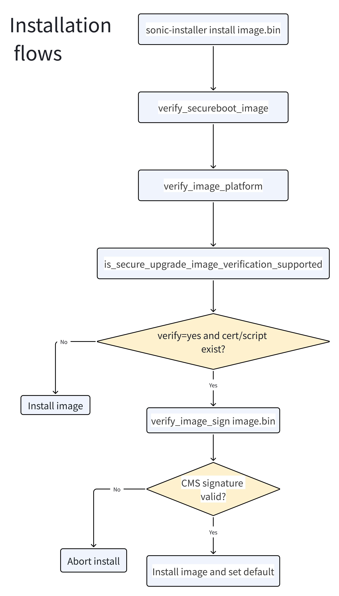
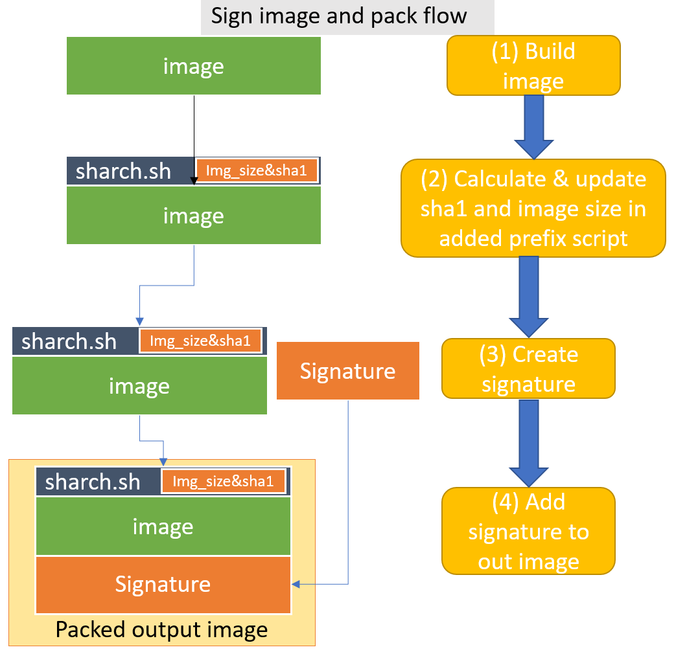
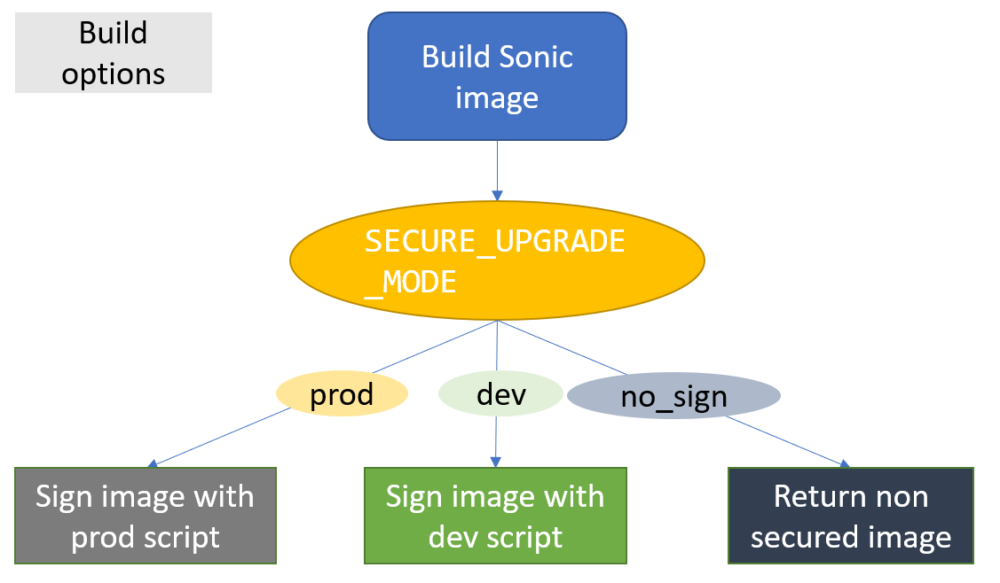
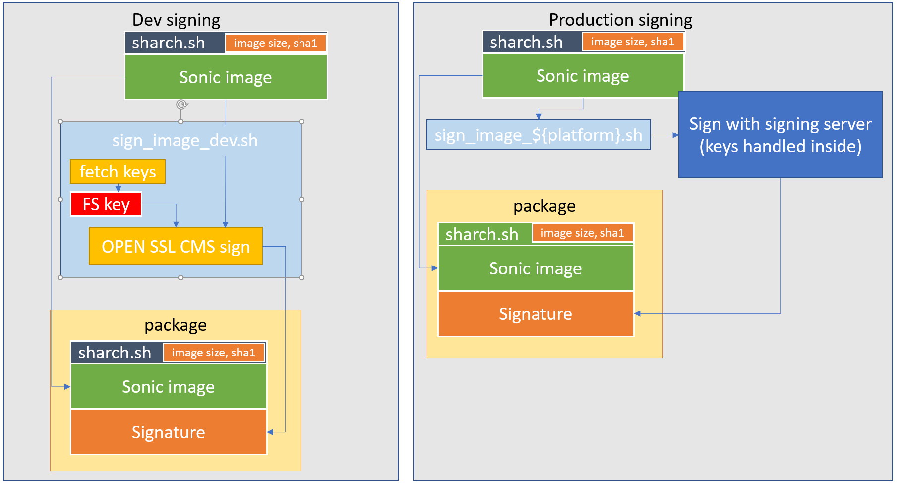

# AST2700 Secure Upgrade #

## 1. <a name='TableofContent'></a>Table of Content

<!-- vscode-markdown-toc -->
* 1. [Table of Content](#TableofContent)
    * 1.1. [Revision](#Revision)
    * 1.2. [Scope](#Scope)
    * 1.3. [Definitions/Abbreviations](#DefinitionsAbbreviations)
    * 1.4. [Overview](#Overview)
    * 1.5. [Requirements](#Requirements)
    * 1.6. [Architecture Design](#ArchitectureDesign)
        * 1.6.1. [Installation Flow](#InstallationFlow)
        * 1.6.2. [Signing](#Signing)
        * 1.6.3. [Verification](#Verification)
    * 1.7. [High-Level Design](#High-LevelDesign)
        * 1.7.1. [Signing process](#Signingprocess)
        * 1.7.2. [Verification process](#Verificationprocess)
    * 1.8. [SAI API](#SAIAPI)
    * 1.9. [Configuration and management](#Configurationandmanagement)
        * 1.9.1. [CLI/YANG model Enhancements](#CLIYANGmodelEnhancements)
        * 1.9.2. [Config DB Enhancements](#ConfigDBEnhancements)
    * 1.10. [Warmboot and Fastboot Design Impact](#WarmbootandFastbootDesignImpact)
    * 1.11. [Restrictions/Limitations](#RestrictionsLimitations)
    * 1.12. [Upgrade and downgrade flows](#Upgradeanddowngradeflows)
    * 1.13. [Testing Requirements/Design](#TestingRequirementsDesign)
        * 1.13.1. [Unit Test cases](#UnitTestcases)
        * 1.13.2. [System Test cases](#SystemTestcases)
    * 1.14. [Open/Action items - if any](#OpenActionitems-ifany)

<!-- vscode-markdown-toc-config
    numbering=true
    autoSave=true
    /vscode-markdown-toc-config -->
<!-- /vscode-markdown-toc -->

### 1.1. <a name='Revision'></a>Revision
| Rev | Date | Author | Change Description |
| :--: | :--: | :----: | ------------------ |
| 0.1 | 06/2026 | John | Initial AST2700 / U-Boot secure upgrade HLD |

### 1.2. <a name='Scope'></a>Scope

This secure upgrade HLD describes the requirements, architecture, and general
flow details of secure upgrade for SONiC on Aspeed AST2700 platforms that boot
through U-Boot instead of BIOS/EFI.

### 1.3. <a name='DefinitionsAbbreviations'></a>Definitions/Abbreviations

    SU  - Secure Upgrade
    SB  - Secure Boot
    CMS - Cryptographic Message Syntax
    FIT - Flattened Image Tree

### 1.4. <a name='Overview'></a>Overview

Secure installation and upgrade of SONiC must ensure that the installer image
has not been modified after it was produced by the vendor.

On x86/UEFI platforms, the community secure-upgrade design depends on:

1. EFI secure boot state
2. EFI `db` certificates
3. user-space verification of the SONiC `.bin` CMS signature

U-Boot platforms do not expose EFI `db`, so the secure-upgrade trust source
must differ while preserving the same `sonic-installer` control flow.

### 1.5. <a name='Requirements'></a>Requirements

We want to enable secure upgrade of SONiC on AST2700. This includes secure
upgrade from a running SONiC image on a U-Boot-based platform.

The feature requires:

1. a signing process for the SONiC installer `.bin`
2. a verification process for the `.bin` CMS signature during installation
3. a trusted public certificate available to user space for verification
4. compatibility with development and production signing flows
5. preservation of existing x86/UEFI secure-upgrade behavior

### 1.6. <a name='ArchitectureDesign'></a>Architecture Design

#### 1.6.1. <a name='InstallationFlow'></a>Installation Flow



#### 1.6.2. <a name='Signing'></a>Signing



#### 1.6.3. <a name='Verification'></a>Verification

Verification flow calls a verification script during image installation.

For AST2700/U-Boot, `verify_image_sign.sh` verifies the detached CMS signature
using a PEM certificate staged from the running rootfs instead of reading
certificates from EFI `db`.

### 1.7. <a name='High-LevelDesign'></a>High-Level Design

This feature has 2 flows to be supported:

#### 1.7.1. <a name='Signingprocess'></a>Signing process

The SONiC installer image is signed during the image build process.

The existing flags are reused:

- `SECURE_UPGRADE_MODE`
- `SECURE_UPGRADE_DEV_SIGNING_KEY`
- `SECURE_UPGRADE_SIGNING_CERT`



> The CMS signing process is the same as in the BIOS/UEFI architecture, please refer to:https://github.com/sonic-net/SONiC/blob/master/doc/secure_upgrade/secure_upgrade.md

For AST2700, the same certificate used for FIT signing may also be copied into
the rootfs and used as the trusted certificate for CMS verification.

The build flow installs:

```text
/usr/share/sonic/secure_upgrade/<fit-key-name>.pem
```

Current key name source:

- `SECURE_BOOT_FIT_KEY_NAME`
- default: `sonic-fit`

Development flow:

- build signs the installer image using development keys

Production flow:

- vendors can replace the signing mechanism with their own production signing
  implementation while preserving the same output format

#### 1.7.2. <a name='Verificationprocess'></a>Verification process

Secure upgrade verification for AST2700 is implemented in the SONiC installer
bootloader adapter for U-Boot.

The current behavior is:

1. `verify_secureboot_image(image_path)`
   - weak behavior, checks only that the candidate installer file exists
2. `verify_image_platform(image_path)`
   - weak behavior, checks only that the candidate installer file exists
3. `is_secure_upgrade_image_verification_supported()`
   - returns `True` only when:
     - U-Boot env `verify=yes`
     - `/usr/local/bin/verify_image_sign.sh` exists
     - `/usr/share/sonic/secure_upgrade/<fit-key-name>.pem` exists
4. `verify_image_sign(image_path)`
   - runs:
     ```text
     /usr/local/bin/verify_image_sign.sh <image> <trusted-cert>
     ```
   - verifies the `.bin` detached CMS signature using the trusted PEM

This preserves x86 behavior because the same public verification script still
supports the old form:

```text
/usr/local/bin/verify_image_sign.sh <image>
```

In that mode, it continues to use EFI `db`.

### 1.8. <a name='SAIAPI'></a>SAI API

NA

### 1.9. <a name='Configurationandmanagement'></a>Configuration and management

NA

#### 1.9.1. <a name='CLIYANGmodelEnhancements'></a>CLI/YANG model Enhancements

NA

#### 1.9.2. <a name='ConfigDBEnhancements'></a>Config DB Enhancements

NA

### 1.10. <a name='WarmbootandFastbootDesignImpact'></a>Warmboot and Fastboot Design Impact

NA

### 1.11. <a name='RestrictionsLimitations'></a>Restrictions/Limitations

1. U-Boot platforms do not use EFI `db`, so secure-upgrade verification cannot
   rely on EFI tools.
2. The trusted PEM stored in rootfs is a public verification artifact, not the
   primary boot root of trust.
3. `verify_secureboot_image()` is intentionally weak today and does not reject
   unsigned installer FIT payloads by itself.
4. Current enforcement is tied to U-Boot environment variable `verify=yes`.

### 1.12. <a name='Upgradeanddowngradeflows'></a>Upgrade and downgrade flows

The following flows are relevant:

1. secure upgrade from non-secure SONiC to secure-upgrade-enabled SONiC
   - installation can proceed, but secure-upgrade verification becomes
     meaningful only after the secure system is running with `verify=yes`
2. secure upgrade from secure SONiC to secure SONiC
   - main supported flow
   - image CMS signature is verified before installation
3. downgrade from secure SONiC to non-secure SONiC
   - policy-dependent
   - if U-Boot `verify=no`, secure-upgrade enforcement path is disabled

### 1.13. <a name='TestingRequirementsDesign'></a>Testing Requirements/Design

#### 1.13.1. <a name='UnitTestcases'></a>Unit Test cases
We can use the verification script as part of standalone test cases, without the need to run the whole installation process. 
In this test flow, we create a simple mock image, signing it with self-signing keys, and then checking each scenario in a different test case.
We use the verification script verify_image_sign_test.sh which calls the same common script verify_image_sign_common.sh as the image verification script.

- Good flows:
  
  -  Verify image - check the basic flow of signing and verification
- Bad flows - 
  Check if verification catches bad images:
  -  Verify an image that was modified after the build
  -  Verify an image with a wrong image size in sharch
  -  Verify an image with a wrong sha1 in sharch
  -  Verify an image with a modified signature
  -  Verify an image signed with one key and verified with a different key 

#### 1.13.2. <a name='SystemTestcases'></a>System Test cases

- Good flows
	- Install secure image from secure SONIC
	- Install secure image from non-secure SONIC
	- Install a non-secure image from non-secure SONIC (nothing should be changed in this flow)
- Bad flows
	- Try to install an unsigned image from SONIC, on secure boot enabled machine.
	- Try to install an unsigned image from ONIE, on secure boot enabled machine.
	- Try to install a signed image from SONIC, on secure boot enabled machine, while a specific certificate for this image is not available from File System.
	- Try to install a signed image that was modified after the build process from SONIC, on secure boot enabled machine.

### 1.14. <a name='OpenActionitems-ifany'></a>Open/Action items - if any

NOTE: All the sections and sub-sections given above are mandatory in the design document. Users can add additional sections/sub-sections if required.
