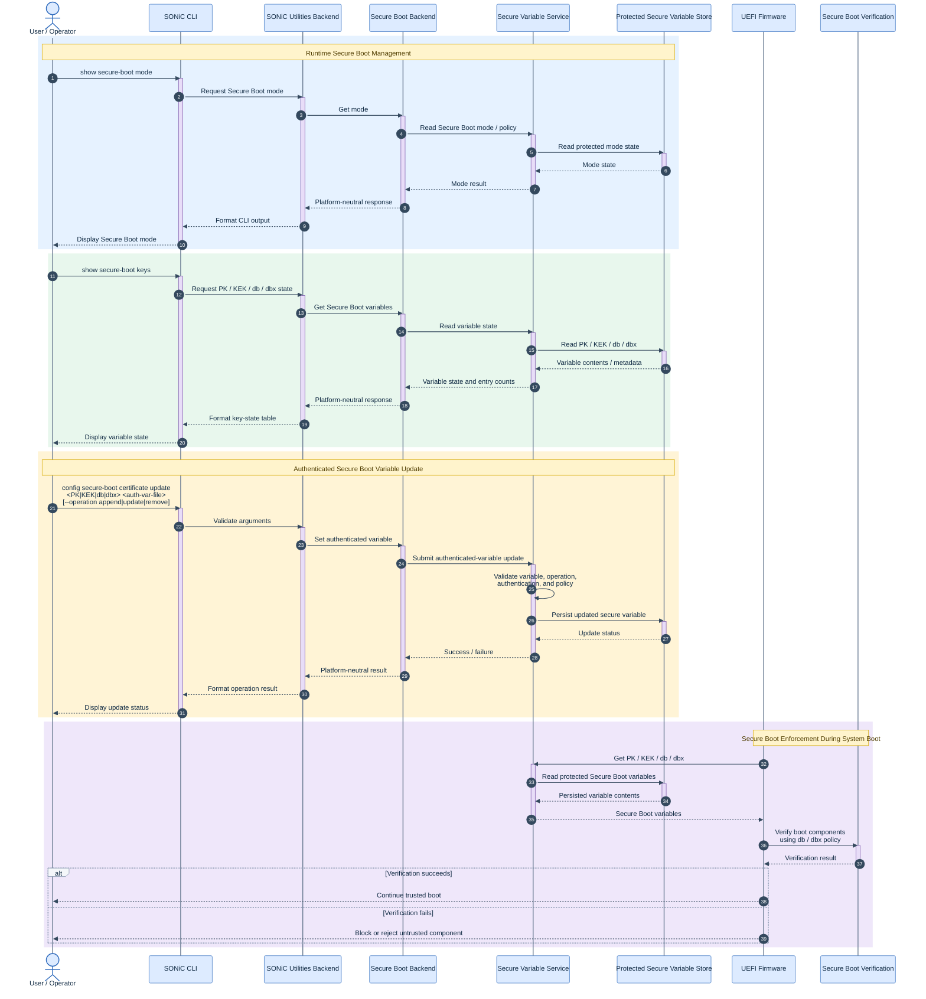

# Secure Boot Certificate Management CLI

## 1. <a name='TableofContent'></a>Table of Content

<!-- vscode-markdown-toc -->
* 1. [Table of Content](#TableofContent)
    * 1.1. [Revision](#Revision)
    * 1.2. [Scope](#Scope)
    * 1.3. [Definitions/Abbreviations](#DefinitionsAbbreviations)
    * 1.4. [Overview](#Overview)
    * 1.5. [Requirements](#Requirements)
    * 1.6. [Architecture Design](#ArchitectureDesign)
    * 1.7. [High-Level Design](#HighLevelDesign)
        * 1.7.1. [UEFI Flow](#UEFIFlow)
        * 1.7.2. [Module Elements Breakdown](#ModuleElementsBreakdown)
        * 1.7.3. [Security Model](#SecurityModel)
        * 1.7.4. [CLI Design](#CLIDesign)
        * 1.7.5. [Command Examples](#CommandExamples)
        * 1.7.6. [Backend Contract](#BackendContract)
    * 1.8. [SAI API](#SAIAPI)
    * 1.9. [Configuration and Management](#ConfigurationandManagement)
        * 1.9.1. [CLI/YANG Model Enhancements](#CLIYANGModelEnhancements)
        * 1.9.2. [Config DB Enhancements](#ConfigDBEnhancements)
    * 1.10. [Warmboot and Fastboot Design Impact](#WarmbootandFastbootDesignImpact)
    * 1.11. [Restrictions/Limitations](#RestrictionsLimitations)
    * 1.12. [Testing Requirements/Design](#TestingRequirementsDesign)
        * 1.12.1. [Unit Test Cases](#UnitTestCases)
        * 1.12.2. [System Test Cases](#SystemTestCases)
    * 1.13. [Open/Action Items](#OpenActionItems)
<!-- /vscode-markdown-toc -->

### 1.1. <a name='Revision'></a>Revision

| Rev | Date | Author | Change Description |
| :---: | :---: | :--- | :--- |
| 0.1 | 08/2026 | Ramesh Raghupathy | Initial HLD for Secure Boot certificate management CLI and backend contract |

### 1.2. <a name='Scope'></a>Scope

This HLD defines a platform-agnostic SONiC CLI and backend contract for managing Secure Boot certificate state and authenticated certificate update operations.

The scope is:

* Show Secure Boot backend status.
* Show Secure Boot mode/policy information when exposed by the platform.
* Show state for Platform Key (`PK`), Key Exchange Key (`KEK`), allowed signature database (`db`), and forbidden/revoked signature database (`dbx`).
* Submit authenticated-variable update files for `PK`, `KEK`, `db`, and `dbx`.
* Keep all platform-specific storage, client/service, hardware root-of-trust, and persistence details behind a backend abstraction.
* Keep private signing keys off the device.

The initial implementation uses a platform helper and native platform client/service APIs to access the secure-variable backend. The permanent architectural model remains UEFI compatible so that the same logical variables and authenticated-variable semantics are preserved independent of the underlying storage technology.

### 1.3. <a name='DefinitionsAbbreviations'></a>Definitions/Abbreviations

| Term | Description |
| :--- | :--- |
| Secure Boot | UEFI mechanism that verifies boot components before execution |
| PK | UEFI Platform Key |
| KEK | UEFI Key Exchange Key |
| db | UEFI allowed signature database |
| dbx | UEFI forbidden/revoked signature database |
| ESL | EFI Signature List |
| Authenticated Variable / AV | UEFI authenticated-variable update payload |
| Secure Variable Backend | Persistent implementation used to store and protect PK/KEK/db/dbx |
| Hardware Root of Trust / RoT | Optional platform security hardware that anchors trust and protects persistent security state |
| Secure Boot backend | Implementation of the SONiC Secure Boot backend contract; may be the SONiC generic UEFI backend or a platform-specific backend |
| Setup/provisioning mode | Initial enrollment state |
| Deployed mode | Normal field state where updates require authenticated authorization |

### 1.4. <a name='Overview'></a>Overview

SONiC Secure Boot and Secure Upgrade flows depend on trusted public certificates being available through the standard UEFI Secure Boot variables `PK`, `KEK`, `db`, and `dbx`.

The SONiC CLI provides a stable management interface while the platform-specific implementation remains below a backend contract. A platform may implement the secure-variable backend using firmware NVRAM, a protected hardware-backed store, a security service, or another persistent mechanism. Those implementation details are intentionally outside the SONiC CLI contract.

The CLI does not replace or weaken UEFI authenticated-variable semantics. It submits requests to the backend. The backend is responsible for authenticated update validation, ownership/policy enforcement, replay/timestamp checks where applicable, and protected persistence.

### 1.5. <a name='Requirements'></a>Requirements

#### Functional requirements

| ID | Requirement |
| :--- | :--- |
| SB-CERT-REQ-1 | SONiC shall provide show commands for Secure Boot backend state. |
| SB-CERT-REQ-2 | SONiC shall provide a show command for Secure Boot mode/policy when supported. |
| SB-CERT-REQ-3 | SONiC shall show state for `PK`, `KEK`, `db`, and `dbx`. |
| SB-CERT-REQ-4 | SONiC may distinguish vendor/platform and customer stores when the backend exposes that distinction. |
| SB-CERT-REQ-5 | SONiC shall provide a config command to submit authenticated-variable update files for `PK`, `KEK`, `db`, and `dbx`. |
| SB-CERT-REQ-6 | SONiC shall not accept, generate, or persist private signing keys. |
| SB-CERT-REQ-7 | SONiC shall not directly modify protected storage. |
| SB-CERT-REQ-8 | Platform-specific behavior shall be hidden behind the backend contract. |
| SB-CERT-REQ-9 | The backend shall provide structured output suitable for CLI formatting and automated testing. |
| SB-CERT-REQ-10 | Read and update operations shall use the same logical UEFI variable model regardless of the underlying storage implementation. |

#### Security requirements

| ID | Requirement |
| :--- | :--- |
| SB-CERT-SEC-1 | Local root access shall not bypass authenticated-variable authorization. |
| SB-CERT-SEC-2 | Deployed-mode updates shall use authenticated-variable payloads. |
| SB-CERT-SEC-3 | Setup/provisioning behavior shall remain distinct from normal field updates. |
| SB-CERT-SEC-4 | The generic CLI shall not expose zeroize, factory reset, or ownership transition operations. |
| SB-CERT-SEC-5 | The secure-variable backend shall enforce platform ownership and policy state. |
| SB-CERT-SEC-6 | Certificate payloads shall not be logged by default. |
| SB-CERT-SEC-7 | Error reporting shall not expose secret material. |

### 1.6. <a name='ArchitectureDesign'></a>Architecture Design

The design is split into three logical layers:

1. **SONiC Secure Boot CLI** — provides the platform-neutral user interface.
2. **Secure Boot backend contract** — defines stable operations and structured responses independent of platform implementation.
3. **Secure Boot backend implementation** — uses either the SONiC generic UEFI backend or a platform-specific backend to access Secure Boot variables.

If a platform-specific backend is explicitly registered, SONiC uses it. Otherwise, when standard UEFI variable services are available, SONiC uses the generic UEFI backend. If neither is available, Secure Boot management is reported as unsupported.

The specific hardware root of trust, security processor, daemon, transport, object identifiers, and storage technology are platform implementation details and are not part of the upstream SONiC interface.

### 1.7. <a name='HighLevelDesign'></a>High-Level Design

#### 1.7.1. <a name='UEFIFlow'></a>UEFI Flow

The following sequence shows the end-to-end Secure Boot variable-management flow starting from the SONiC CLI. The interface remains platform-independent while the platform-specific backend provides access to protected Secure Boot variable storage.



#### 1.7.2. <a name='ModuleElementsBreakdown'></a>Module Elements Breakdown

| Module | Location / Interface | Responsibility |
| :--- | :--- | :--- |
| `show secure-boot` CLI | `sonic-utilities` | Display backend status, mode, and key state |
| `config secure-boot` CLI | `sonic-utilities` | Submit authenticated-variable update files |
| Backend contract | Platform-neutral interface | Define stable request/response behavior for SONiC |
| Secure Boot backend | SONiC generic / platform package | Access Secure Boot variables using standard UEFI services or a platform-specific interface |
| UEFI variable interface | Platform/firmware interface | Represent `PK`, `KEK`, `db`, and `dbx` using standard UEFI semantics |
| Secure Variable Backend | Platform implementation | Validate policy and access protected storage |
| Protected Persistent Storage | Platform implementation | Persist Secure Boot variable state |

#### 1.7.3. <a name='SecurityModel'></a>Security Model

The SONiC CLI is an administrative submission interface, not the cryptographic authorization boundary.

| Layer | Responsibility |
| :--- | :--- |
| CLI authorization | Permission to submit a Secure Boot management request |
| Authenticated-variable authorization | Cryptographic validation of the requested update |
| Backend authorization | Ownership, mode, replay/timestamp, and storage-policy enforcement |

A privileged user may submit an authenticated-variable file, but an unauthorized or malformed update must still be rejected by the secure-variable backend.

Private signing keys remain outside the device. The device receives only the authenticated-variable payload and associated public certificate material.

#### 1.7.4. <a name='CLIDesign'></a>CLI Design

The generic upstream CLI has two command groups:

```text
show secure-boot ...
config secure-boot ...
```

##### Show commands

```text
show secure-boot status
show secure-boot mode
show secure-boot keys
show secure-boot key <PK|KEK|db|dbx> [--store vendor|customer|unified]
```

The optional `--store` argument selects the logical store exposed by the backend. `vendor` and `customer` represent platform-defined store views. `unified` represents the effective Secure Boot variable view exposed by the platform.

SONiC does not merge or synthesize these stores; store composition and policy are backend responsibilities.

##### Config command

```text
config secure-boot certificate update <PK|KEK|db|dbx> <auth-var-file> [--operation append|update|remove]
```

Supported operations:

| Operation | Meaning |
| :--- | :--- |
| `append` | Add entries using authenticated-variable append semantics |
| `update` | Replace/update the variable using authenticated-variable semantics |
| `remove` | Remove authorized entries using backend-supported authenticated semantics |

The generic CLI does not expose platform ownership transitions, zeroization, factory reset, or backend-specific provisioning commands.

#### 1.7.5. <a name='CommandExamples'></a>Command Examples

##### Show backend status

```bash
show secure-boot status
```

Example output:

```text
Secure Boot Backend: platform
UEFI Mode: 43 (0x002b, Generic Mode)

Variable    Vendor State    Vendor Entries    Customer State    Customer Entries
----------  --------------  ----------------  ----------------  ------------------
PK          present         1                 empty             0
KEK         present         1                 empty             0
db          present         23                empty             0
dbx         empty           0                 empty             0
```

The backend name, mode value, and per-store state and entry counts are backend-defined data.

##### Show mode

```bash
show secure-boot mode
```

Example output:

```text
Mode                  43 (Generic Mode)
Mode Hex              0x002b
Vendor store write    yes
Vendor store lock     yes
Customer store write  no
Customer store lock   yes
```

Mode values, names, and the write/lock policy are backend-defined data. The SONiC CLI displays them without depending on a particular security device implementation.

##### Show all key state

```bash
show secure-boot keys
```

Example output:

```text
Variable    Store     State    Entries
----------  --------  -------  -------
PK          vendor    present  1
PK          customer  empty    0
KEK         vendor    present  1
KEK         customer  empty    0
db          vendor    present  23
db          customer  empty    0
dbx         vendor    empty    0
dbx         customer  empty    0
```

The `show secure-boot keys` command displays the vendor and customer store views when exposed by the backend.

The effective or unified view may be queried for an individual variable using:

```text
show secure-boot key <PK|KEK|db|dbx> --store unified
```

##### Show one key

The optional `--store` argument selects the store to query and defaults to `customer`.

```bash
show secure-boot key db --store unified
```

Example output:

```text
Variable    db
Store       unified
State       present
Entries     23
```

##### Update `db`

```bash
config secure-boot certificate update db /host/secureboot/db-update.auth --operation append
```

Expected behavior:

* SONiC validates CLI arguments and verifies that the input file is accessible.
* SONiC does not sign the request and does not handle a private key.
* The backend receives the authenticated-variable payload.
* The backend validates the payload, ownership/policy state, and replay/timestamp requirements.
* Persistent storage is updated only when authorization succeeds.

##### Rotate KEK

```bash
config secure-boot certificate update KEK /host/secureboot/kek-rotation.auth --operation update
```

##### Update the revocation database

```bash
config secure-boot certificate update dbx /host/secureboot/dbx-update.auth --operation append
```

#### 1.7.6. <a name='BackendContract'></a>Backend Contract

The SONiC CLI communicates through the platform-neutral Secure Boot backend entry point:

```text
/usr/sbin/secure-boot-backend
```

SONiC provides a generic UEFI backend for platforms that expose standard UEFI variable services. A platform may explicitly register a platform-specific backend when specialized Secure Boot variable handling is required.

Backend selection follows this order:

1. If a platform-specific backend is explicitly registered, use the platform backend.
2. Otherwise, if standard UEFI variable services are available, use the SONiC generic UEFI backend.
3. Otherwise, report Secure Boot management as unsupported.

The backend selection is based on the available Secure Boot interface, not CPU architecture. The HLD does not mandate the underlying executable, daemon, transport, library, secure element, hardware root of trust, or storage implementation.

The backend shall support the following logical operations:

```text
status
mode
keys
key <PK|KEK|db|dbx> [--store <vendor|customer|unified>]
update <PK|KEK|db|dbx> --file <authenticated-variable-file> --operation <append|update|remove>
```

Structured JSON is used between the platform-neutral backend entry point and the SONiC CLI.

##### Mode response

Example:

```json
{
  "raw": 43,
  "hex": "0x002b",
  "name": "Generic Mode",
  "policy": {
    "vendor_store_write": true,
    "vendor_store_lock": true,
    "customer_store_write": false,
    "customer_store_lock": true
  }
}
```

##### Keys response

Each variable/store pair is keyed by `<variable><Store>` (for example `dbVendor`, `dbCustomer`).

Example:

```json
{
  "PKVendor":    { "state": "present", "entry_count": 1 },
  "PKCustomer":  { "state": "empty",   "entry_count": 0 },
  "KEKVendor":   { "state": "present", "entry_count": 1 },
  "KEKCustomer": { "state": "empty",   "entry_count": 0 },
  "dbVendor":    { "state": "present", "entry_count": 23 },
  "dbCustomer":  { "state": "empty",   "entry_count": 0 },
  "dbxVendor":   { "state": "empty",   "entry_count": 0 },
  "dbxCustomer": { "state": "empty",   "entry_count": 0 }
}
```

##### Status response

The `status` operation returns the combined mode and keys state.

Example:

```json
{
  "mode": {
    "raw": 43,
    "hex": "0x002b",
    "name": "Generic Mode",
    "policy": {
      "vendor_store_write": true,
      "vendor_store_lock": true,
      "customer_store_write": false,
      "customer_store_lock": true
    }
  },
  "keys": {
    "PKVendor":   { "state": "present", "entry_count": 1 },
    "PKCustomer": { "state": "empty",   "entry_count": 0 }
  }
}
```

##### Key response

The `key` operation returns a single variable/store entry keyed by `<variable><Store>`.

Example:

```json
{
  "dbCustomer": {
    "state": "present",
    "entry_count": 2
  }
}
```

##### Update response

Example:

```json
{
  "result": "success",
  "variable": "db",
  "operation": "append"
}
```

Backend-specific object names, secure-store identifiers, socket names, service names, hardware identifiers, and internal policy bits shall not be exposed through the upstream SONiC CLI contract.

### 1.8. <a name='SAIAPI'></a>SAI API

NA.

### 1.9. <a name='ConfigurationandManagement'></a>Configuration and Management

#### 1.9.1. <a name='CLIYANGModelEnhancements'></a>CLI/YANG Model Enhancements

The initial implementation is CLI-based and does not introduce persistent configuration in ConfigDB; therefore, it does not introduce a new YANG configuration model.

A future northbound model may reuse the same logical Secure Boot backend contract.

#### 1.9.2. <a name='ConfigDBEnhancements'></a>Config DB Enhancements

No persistent Config DB schema is required.

Certificate payloads, authenticated-variable files, private keys, and backend credentials shall not be persisted in Config DB.

### 1.10. <a name='WarmbootandFastbootDesignImpact'></a>Warmboot and Fastboot Design Impact

No direct impact is expected.

Secure Boot variable state is persistent and shall not be modified by warmboot or fastboot.

An accepted certificate update may require a reboot or power cycle before it affects boot-time verification, depending on firmware behavior.

### 1.11. <a name='RestrictionsLimitations'></a>Restrictions/Limitations

* The generic SONiC interface supports Secure Boot status, mode, key-state display, and authenticated-variable update submission.
* Private keys are not accepted, generated, or stored by the SONiC CLI.
* The CLI does not generate authenticated-variable payloads.
* Setup/provisioning and ownership-transition operations are outside the generic CLI.
* Zeroization and factory-reset operations are outside the generic CLI.
* Certificate payloads are not displayed or logged by default.
* Platform-specific client/service and protected-storage implementations remain below the backend contract.
* Standard UEFI Runtime Services integration depends on platform firmware support.

### 1.12. <a name='TestingRequirementsDesign'></a>Testing Requirements/Design

#### 1.12.1. <a name='UnitTestCases'></a>Unit Test Cases

| Test | Description |
| :--- | :--- |
| show-mode-success | Mock backend mode response and verify CLI output |
| show-status-success | Mock backend status response and verify CLI output |
| show-keys-success | Mock backend keys response and verify CLI table |
| show-key-success | Mock a single variable/store response and verify CLI output |
| show-key-unified | Verify `--store unified` is passed to the backend and displayed correctly |
| backend-unavailable | Verify Secure Boot management is reported unsupported when neither a platform backend nor standard UEFI variable services are available |
| backend-timeout | Verify backend timeout is reported cleanly |
| backend-invalid-json | Verify malformed backend output is rejected |
| backend-error | Verify structured backend errors are handled |
| invalid-variable | Reject unsupported Secure Boot variable |
| invalid-operation | Reject unsupported update operation |
| missing-file | Reject missing authenticated-variable input file |
| config-update-success | Verify successful authenticated-variable update response |
| config-update-failure | Verify rejected backend update is reported correctly |

#### 1.12.2. <a name='SystemTestCases'></a>System Test Cases

| Test | Description |
| :--- | :--- |
| backend-selected | Verify the platform backend is selected when registered, otherwise the generic UEFI backend is used when standard UEFI variable services are available |
| show-cli-status | Verify `show secure-boot status` |
| show-cli-mode | Verify `show secure-boot mode` matches backend state |
| show-cli-keys | Verify `show secure-boot keys` matches backend state |
| read-only-no-change | Verify show commands do not modify state |
| update-invalid-auth | Submit invalid authenticated-variable payload and verify rejection |
| update-valid-auth | Submit valid authenticated-variable payload and verify acceptance |
| persistence | Verify accepted state persists across reboot/power cycle |
| uefi-read | Verify standard UEFI variable reads expose the same logical state when firmware integration is present |
| uefi-write | Verify standard UEFI authenticated writes follow the same authorization semantics when firmware integration is present |

### 1.13. <a name='OpenActionItems'></a>Open/Action Items

| Item | Owner | Notes |
| :--- | :--- | :--- |
| UEFI `GetVariable()` integration | Platform firmware | Required for the permanent standard read path |
| UEFI `SetVariable()` integration | Platform firmware | Required for the permanent standard write path |
| Authenticated update file generation | Security/release workflow | Signing and private-key handling remain off-device |
| YANG/northbound model | SONiC community | Future enhancement |
