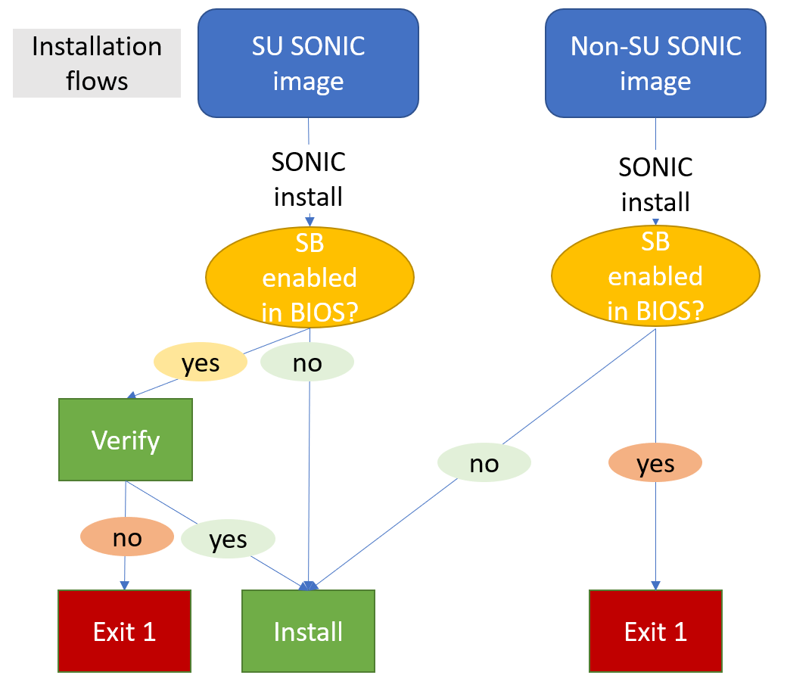
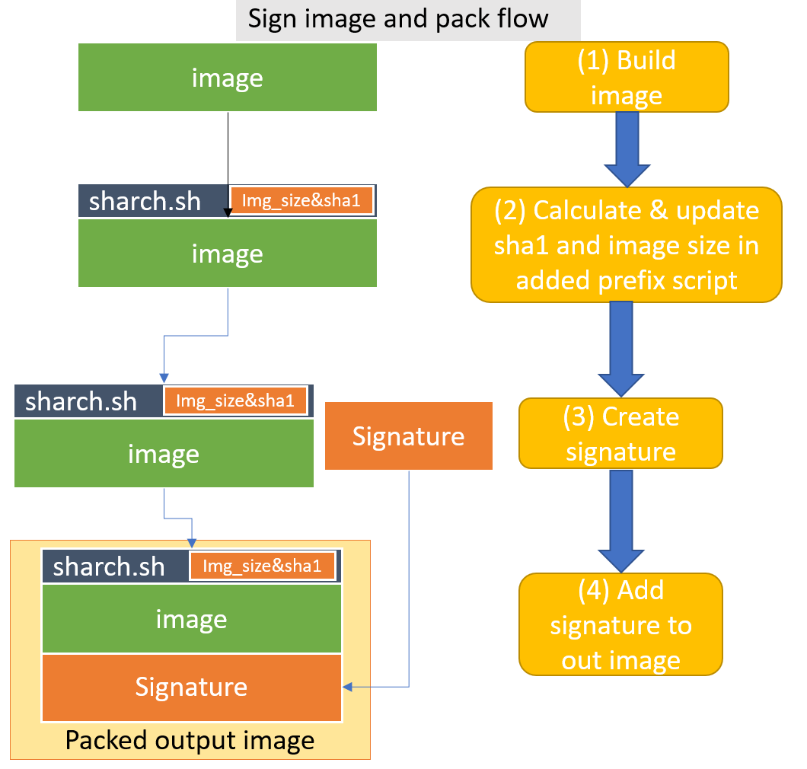
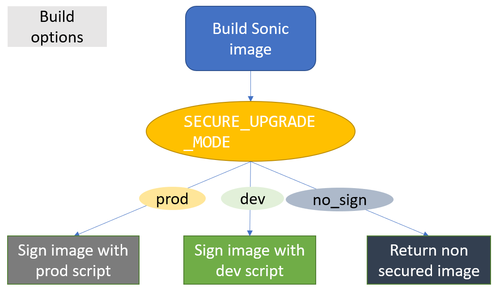
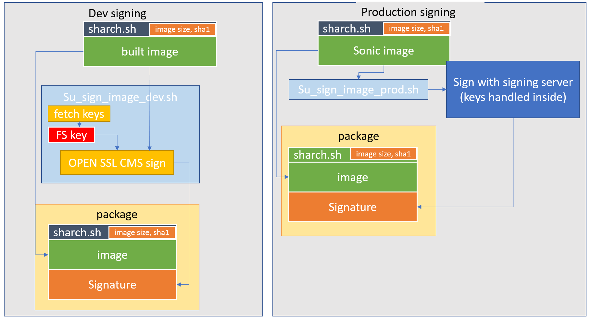
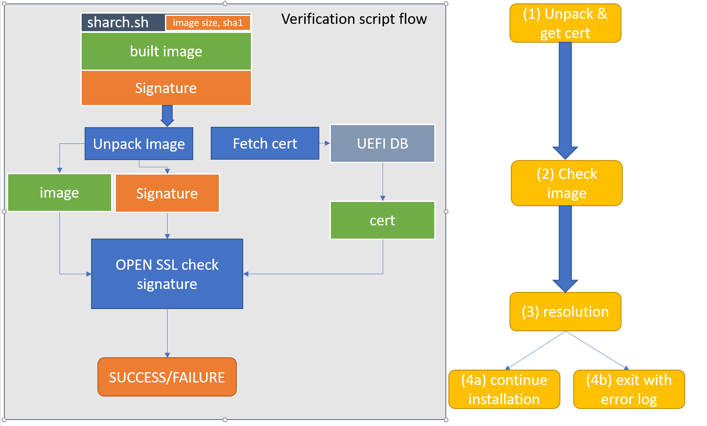

# Secure upgrade #

##  1. Table of Content

<!-- vscode-markdown-toc -->
* 1. [Table of Content](#TableofContent)
	* 1.1. [Revision](#Revision)
	* 1.2. [Scope](#Scope)
	* 1.3. [Definitions/Abbreviations](#DefinitionsAbbreviations)
	* 1.4. [Overview](#Overview)
	* 1.5. [Requirements](#Requirements)
	* 1.6. [Architecture Design](#ArchitectureDesign)
		* 1.6.1. [Installation Flow](#InstallationFlow)
		* 1.6.2. [signing](#signing)
		* 1.6.3. [verification](#verification)
	* 1.7. [High-Level Design](#High-LevelDesign)
		* 1.7.1. [Signing process](#Signingprocess)
		* 1.7.2. [Verification process](#Verificationprocess)
	* 1.8. [SAI API](#SAIAPI)
	* 1.9. [Configuration and management](#Configurationandmanagement)
		* 1.9.1. [CLI/YANG model Enhancements](#CLIYANGmodelEnhancements)
		* 1.9.2. [Config DB Enhancements](#ConfigDBEnhancements)
	* 1.10. [Warmboot and Fastboot Design Impact](#WarmbootandFastbootDesignImpact)
	* 1.11. [ Restrictions/Limitations](#RestrictionsLimitations)
		* 1.11.1. [ uefi tools and secure boot enabled](#uefitoolsandsecurebootenabled)
		* 1.11.2. [ ONIE secure upgrade verification code](#ONIEsecureupgradeverificationcode)
	* 1.12. [ Upgrade and downgrade flows](#Upgradeanddowngradeflows)
		* 1.12.1. [ secure upgrade from non secured SONIC/ONIE to secured SONIC](#secureupgradefromnonsecuredSONICONIEtosecuredSONIC)
		* 1.12.2. [ secure upgrade from secured SONIC to secured SONIC](#secureupgradefromsecuredSONICtosecuredSONIC)
		* 1.12.3. [ downgrade from secured SONIC to non-secured SONIC](#downgradefromsecuredSONICtonon-securedSONIC)
		* 1.12.4. [secure upgrade from secure upgrade enabled ONIE to secured SONIC](#secureupgradefromsecureupgradeenabledONIEtosecuredSONIC)
	* 1.13. [ Testing Requirements/Design](#TestingRequirementsDesign)
		* 1.13.1. [Unit Test cases](#UnitTestcases)
		* 1.13.2. [System Test cases](#SystemTestcases)
	* 1.14. [Open/Action items - if any](#OpenActionitems-ifany)

<!-- vscode-markdown-toc-config
	numbering=true
	autoSave=true
	/vscode-markdown-toc-config -->
<!-- /vscode-markdown-toc -->

###  1.1. Revision
  Rev  |  Date   |      Author      | Change Description |
| :---: | :-----: | :--------------: | ------------------ |
|  0.1  | 6/2022 |   Yona Cohen   | Phase 1 Design     |

###  1.2. Scope

This secure upgrade hld doc described the requirements, architecture, and general flow details of secure upgrade feature in switches SONIC OS based.

###  1.3. Definitions/Abbreviations

	SU - secure upgrade
	SB - secure boot	
	CMS - Cryptographic Message Syntax

###  1.4. Overview

Secure installation and upgrade of OS are setting a requirement to ensure the image was not modified since it was built by the vendor. This is a basic requirement as part of general OS security. In order to help the credibility of the OS image, secure upgrade mechanism guarantees the image was not modified by any unauthorized entity since its original creation.

###  1.5. Requirements

We want to enable secure upgrade of SONIC. This will include secure upgrade of SONIC while installing SONIC via ONIE or SONIC. The feature requires a signing process which will include a private key and certificate. The verification process on the other end requires a public key certificate for validation. Both processes are required to be supported by various scenarios such as development and release.
In order to do secure installation of SONIC from ONIE, it has to include the following secure upgrade verification code (links): https://github.com/sonic-net/sonic-buildimage/pull/11862, https://github.com/sonic-net/sonic-utilities/pull/2337
Device arch should support secure boot including UEFI tools.

###  1.6. Architecture Design
####  1.6.1. Installation Flow

####  1.6.2. signing

(flow description in the chapter below)
####  1.6.3. verification
Verification flow calls a verification script during image installation, in (1.7.3.) verification process below.

###  1.7. High-Level Design

This feature has 2 flows to be supported:
	
####  1.7.1. Signing process  

Sign sonic image during build process in build_image.sh script, right after generation.
We want to add the flag SECURE_UPGRADE_MODE to allow several modes of secure upgrade. When SECURE_UPGRADE_MODE == 'no_sign' no change will be made to the current build process. In case of SECURE_UPGRADE_MODE == 'dev', image will be signed by development script and when SECURE_UPGRADE_MODE == 'prod' - image will be signed by production script. In addition, we want to add the flags SECURE_UPGRADE_DEV_SIGNING_KEY and SECURE_UPGRADE_DEV_SIGNING_CERT, to provide the option to give path for development keys during the build.

- After image creation, during onie-mk-demo.sh script, we create a new output file with the prefix sharch.sh script and the image. We calculate sha1 and original image size and update them in the prefix for verification during image install.
- We will call a dedicated script to create an image signature:
We will allow the use of 2 script types in this flow -

	a.  development script - sign_image_dev.sh, which will use simple cms OpenSSL signing (enable with flag set to SECURE_UPGRADE_MODE == 'dev') with development keys (path provided in SECURE_UPGRADE_DEV_SIGNING_KEY and SECURE_UPGRADE_DEV_SIGNING_CERT).

	b.  production script - sign_image_${platform}.sh (enable with the flag set to SECURE_UPGRADE_MODE == 'prod') that each vendor will be able to provide for themselves. When implementing this script, it is required to implement the method sign_image_prod(){} which is being called with arguments $output_image and $out_signature during the build process and is supposed to create a signature in $out_signature that will be concatenated to the image in the calling build script, afterward.

####  1.7.2. Verification process
- SONIC install – changes will be mainly done in sonic-installer main.py where bootloader methods are being called and will only affect 'sonic-installer install' command (other sonic-installer commands will not be affected). The installation process is triggered by install.sh script, which is different for every platform.
In our opinion, python modifications will be easier to add and maintain than install.sh changes, as changing install.sh (for each platform) will require much more sources to maintain and test (different HW to check on, test cases for each HW, etc.).
- A signed image will go through a verification process before installation, as main.py will call a dedicated bash script to split the signature from the image and check it with a public key certificate.
Verification script called verify_image_sign.sh will verify using OpenSSL cms. Verification is enabled only if efi tools are enabled, and "Secure Boot" flag is enabled in BIOS. Accordingly, the certificate will be fetched from BIOS using EFI tools.
In order to see if secure boot flag is enabled, user can use the linux command 'bootctl status' and look for "Secure Boot: enabled/disabled" line, or use the command:

        bootctl status 2>/dev/null | grep "Secure Boot:"

###  1.8. SAI API 

NA

###  1.9. Configuration and management 

NA

####  1.9.1. CLI/YANG model Enhancements 

NA

####  1.9.2. Config DB Enhancements  

NA
		
###  1.10. Warmboot and Fastboot Design Impact  
NA

###  1.11.  Restrictions/Limitations  
####  1.11.1.  uefi tools and secure boot enabled
Device arch should support secure boot including UEFI tools.
UEFI tools pkg named efitools, link: https://packages.debian.org/buster/amd64/efitools/filelist
Secure Upgrade feature is using: efi-readvar, sig-list-to-certs tools.
This feature is dependent on BIOS secure boot flag being enabled.
####  1.11.2.  ONIE secure upgrade verification code
Secure installation of SONIC from ONIE requires a specific verification code, which can be picked from the following ONIE pull request TBD (waiting for it to be created)

###  1.12.  Upgrade and downgrade flows
we want to discuss the following flows:
####  1.12.1.  secure upgrade from non secured SONIC/ONIE to secured SONIC
In this flow, the signature is not verified as no verification code is available at this stage. If we assume secure upgrade SONIC image is credible, then the upgraded OS will support secure upgrade flow.
####  1.12.2.  secure upgrade from secured SONIC to secured SONIC
This is the main flow supported by the feature - each signed image will be verified before its installation.
####  1.12.3.  downgrade from secured SONIC to non-secured SONIC
This flow will only be enabled if secure boot BIOS flag is disabled, as we assume users with access to BIOS should have the ability to downgrade the OS version.
####  1.12.4. secure upgrade from secure upgrade enabled ONIE to secured SONIC
As mentioned in 1.5 and 1.11.2, this flow requires secure upgrade enabled ONIE, with code available in link TBD.
###  1.13.  Testing Requirements/Design 
####  1.13.1. Unit Test cases  
We can use the verification script as part of standalone test cases, without the need to run the whole installation process. 
In this test flow, we create a simple mock image, signing it with self-signing keys, and then checking each scenario in a different test case.
We use the verification script verify_image_sign_test.sh which calls the same common script verify_image_sign_common.sh as the image verification script.

- Good flows:
  
  -  Verify image - check the basic flow of signing and verification
- Bad flows - 
  Check if verification catches bad images:
  -  Verify an image that was modified after the build
  -  Verify an image with a wrong image size in sharch
  -  Verify an image with a wrong sha1 in sharch
  -  Verify an image with a modified signature
  -  Verify an image signed with one key and verified with a different key 

####  1.13.2. System Test cases
- Good flows
	- Install secure image from secure SONIC
	- Install secure image from non-secure SONIC
	- Install secure image from secure ONIE
	- Install secure image from non-secure ONIE
	- Install non-secure image from secure SONIC (SB flag is off in BIOS)
	- Install a non-secure image from secure ONIE (SB flag is off in BIOS)
	- Install a non-secure image from non-secure SONIC (nothing should be changed in this flow)
- Bad flows
	- Try to install an unsigned image from SONIC, on secure boot enabled machine.
	- Try to install an unsigned image from ONIE, on secure boot enabled machine.
	- Try to install a signed image from SONIC, on secure boot enabled machine, while a specific certificate for this image is not available from UEFI.
	- Try to install a signed image that was modified after the build process from SONIC, on secure boot enabled machine.

###  1.14. Open/Action items - if any 

NOTE: All the sections and sub-sections given above are mandatory in the design document. Users can add additional sections/sub-sections if required.
