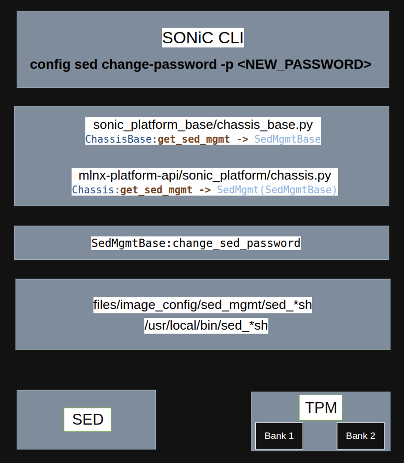

# SED Password Management HLD

## 1. Revision

| Rev | Date | Author | Change Description |
|:---:|:----:|:------:|:-------------------|
| 0.1 | 01/2026 | | Initial version |

## 2. Scope

This document describes the high-level design for "Change SED (Self-Encrypting Drive) password" in SONiC.
It covers the ability to change and reset SED passwords through SONiC CLI commands using the platform API.

## 3. Definitions/Abbreviations

| Definitions/Abbreviation | Description |
|--------------------------|-------------|
| SED | Self-Encrypting Drive |

## 4. Overview

Self-Encrypting Drives (SEDs) provide hardware-based encryption for storage devices, protecting all data on the drive.
SEDs are typically enabled at the factory, and come with a default password. Without the correct password, the drive remains locked and data is inaccessible.
There is a dedicated software which responsible for unlocking the disk before the boot (PBA - Pre-boot Authentication) - It doesn't part of the NOS.

A key use case is replacing the default password to improve security.
While it is technically possible to change the SED password using external tools such as sedutil-cli, it is safer and more consistent to provide a SONiC CLI that wraps this functionality.

SONiC's responsibility is to provide the CLI infrastructure to change and reset the SED password using a new SONiC CLI.
This feature introduces vendor-agnostic CLI commands.
The CLI provides a consistent interface, while the underlying implementation is platform-specific,
allowing each vendor to integrate with its own tooling, secure storage mechanisms, and boot-time unlock flows according to the platform capabilities.

## 5. Requirements

| Requirement | Description |
|-------------|-------------|
| SSD | SSD with an activated SED support (LockingEnabled = Y LockingSupported = Y) |
| Platform Support | Platform must implement chassis APIs for SED management (`change_sed_password`, `reset_sed_password`) |

## 6. Architecture Design

The SED password management feature integrates with SONiC's existing platform API architecture. The CLI commands interact with the platform's chassis object to perform SED password operations.

## 7. High-Level Design

This feature is generic at the CLI and API level, but necessarily platform-specific at the execution layer.
This is because SED enablement, tooling, cryptography, secret storage, and boot-time unlock flows are all vendor-defined and highly platform-dependent.
This design follows the standard SONiC model:
Common user interface + Abstract platform API + Vendor-owned implementation.



### Module Elements Breakdown

1. SONiC CLI creates a chassis object of the current platform (platform API).
2. If the chassis object of the current platform has implementation for `change_sed_password`, it will be called.
   Otherwise: "Error: SED management not supported on this platform"
3. The same applies for `reset_sed_password`.

**Change SED Password:**
```python
chassis = platform.Platform().get_chassis()
chassis.change_sed_password(password)
```

**Reset SED Password:**
```python
chassis = platform.Platform().get_chassis()
chassis.reset_sed_password()
```

### Change Password Flow

The change password CLI command allows the user to set a new SED password.

**CLI Command:**
```
config sed change-password -p <NEW_PASSWORD>
```

### Reset Password Flow

The reset password CLI command allows the user to reset the SED password to default.

**CLI Command:**
```
config sed reset-password
```

## 8. CLI Enhancements

### Change Password CLI

Change the SED password to a new value:

```
admin@sonic:~$ config sed change-password --help
Usage: config sed change-password [OPTIONS]

  Change SED password

Options:
  -p, --password TEXT  New password for SED [required]
  -?, -h, --help       Show this message and exit.
```

Example:
```
admin@sonic:~$ config sed change-password -p <NEW_PASSWORD>
SED password change process completed successfully
```

### Reset Password CLI

Reset the SED password to a default value

```
admin@sonic:~$ config sed reset-password --help
Usage: config sed reset-password [OPTIONS]

  Reset SED password to default

Options:
  -?, -h, --help  Show this message and exit.
```

Example:
```
admin@sonic:~$ config sed reset-password
SED password reset process completed successfully
```
