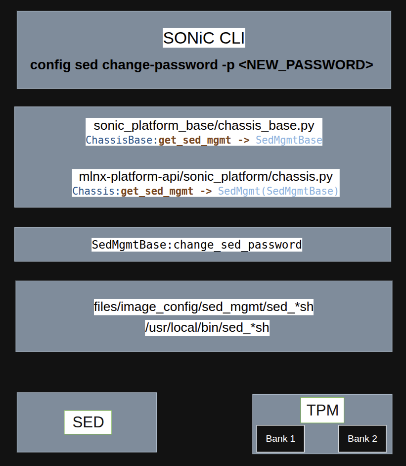
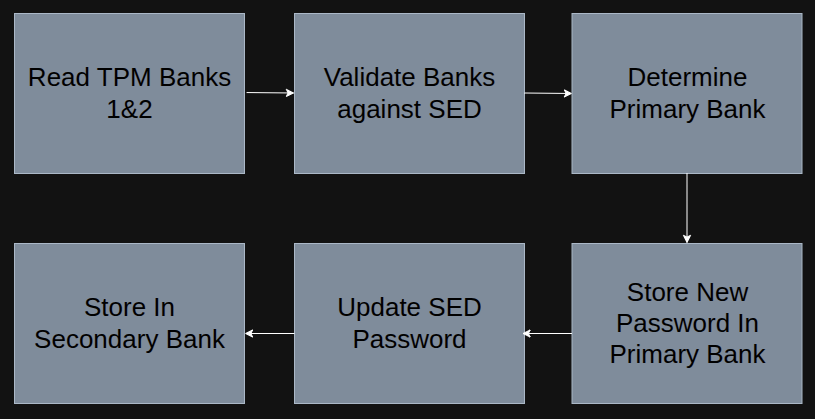
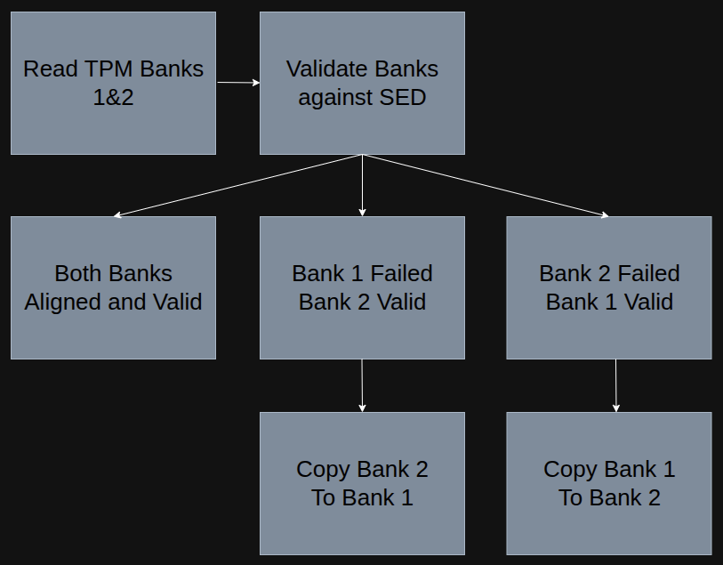

# SED Password Management HLD

## 1. Revision

| Rev | Date | Author | Change Description |
|:---:|:----:|:------:|:-------------------|
| 0.1 | 03/2026 | | Initial version |

## 2. Scope

This document describes the high-level design for SED (Self-Encrypting Drive) password management in SONiC.
It covers changing and resetting SED passwords via SONiC CLI using the platform API.

## 3. Definitions/Abbreviations

| Definitions/Abbreviation | Description |
|--------------------------|-------------|
| SED | Self-Encrypting Drive |
| TPM | Trusted Platform Module |
| PBA | Pre-boot Authentication |

## 4. Overview

Self-Encrypting Drives (SEDs) provide hardware-based encryption for storage devices.
SEDs are typically enabled at the factory with a default password. Without the correct password, the drive remains locked and data is inaccessible.
A dedicated pre-boot component (PBA) is responsible for unlocking the disk before the OS boots; that component is outside SONiC.

A key use case is replacing the default password for security. SONiC provides a CLI that wraps SED password change and reset.
The design is largely common across platforms:
shared scripts and a recovery service use TPM banks to store and recover the SED password, with platform-specific values supplied via configuration and a small platform layer.

- **Common:** CLI, `SedMgmtBase` API, `sedutil` package, scripts (`sed_pw_change.sh`, `sed_pw_reset.sh`, `sed_pw_utils.sh`, `sed_pw_tpm_recovery.sh`),
recovery systemd service, and config file format (`/etc/sonic/sed_config.conf` for TPM bank addresses).
- **Platform-specific:** Chassis returns a `SedMgmt` instance (or `None`), implementation of abstract getters (password length bounds, default password), and any platform-only scripts.

## 5. Requirements

| Requirement | Description |
|-------------|-------------|
| SSD | SSD with SED support enabled (e.g. LockingEnabled = Y, LockingSupported = Y) |
| Platform support | Platform that supports SED management provides a `SedMgmt` implementation and exposes it via `chassis.get_sed_mgmt()`. |
| TPM / config | For TPM-based platforms: TPM banks for current SED password (A/B). Config file `/etc/sonic/sed_config.conf` supplies `tpm_bank_a` and `tpm_bank_b` where applicable. |

## 6. Architecture Design

The feature integrates with SONiC's platform API:

- **CLI** (`config sed change-password`, `config sed reset-password`) obtains the chassis and calls `chassis.get_sed_mgmt()`.
If the result is `None`, the CLI reports that SED management is not supported. Otherwise it calls `sed_mgmt.change_sed_password(password)` or `sed_mgmt.reset_sed_password()`.
- **SedMgmtBase** (common) implements `change_sed_password` and `reset_sed_password` by validating input, gathering parameters from abstract getters, and invoking the common shell scripts.
- **Platform** provides a concrete `SedMgmt` that implements the abstract getters (min/max password length, default password).
- **Scripts** are common and parameterized: they receive TPM bank addresses and passwords as arguments or from the config file.
- **Recovery service** It runs a common script to align the TPM banks in case one of them is corrupted.



## 7. High-Level Design

### 7.1 API and Class Hierarchy

- **ChassisBase** defines `get_sed_mgmt()` returning `self._sed_mgmt` (default `None`). Platforms that support SED override it to return a `SedMgmt` instance.
- **SedMgmtBase** (common) defines the behavior of change and reset and relies on the following abstract getters implemented by the platform:
  - `get_min_sed_password_len()` → int
  - `get_max_sed_password_len()` → int
  - `get_default_sed_password()` → str
- **SedMgmt** extends `SedMgmtBase`, implements the abstract getters.

### 7.2 Common Components

| Component | Description |
|-----------|-------------|
| sed_pw_change.sh | Common script to change SED password. Invoked with `-a <tpm_bank_a> -b <tpm_bank_b> -p <new_password>`. |
| sed_pw_reset.sh | Common script to reset SED password to a given value. Invoked with `-a -b -p <default_password>`; |
| sed_pw_tpm_recovery.sh | Common recovery script: reads `tpm_bank_a` and `tpm_bank_b` from `/etc/sonic/sed_config.conf`; It runs TPM bank validation and recovery. |
| sed-pw-tpm-recovery.service | Systemd oneshot service; runs `sed_pw_tpm_recovery.sh`. |

### 7.3 Change Password Flow

1. User runs `config sed change-password` (with interactive prompt for the new password).
2. CLI gets chassis, then `chassis.get_sed_mgmt()`.
3. CLI calls `sed_mgmt.change_sed_password(new_password)`.
4. `SedMgmtBase.change_sed_password` validates length using `get_min_sed_password_len()` and `get_max_sed_password_len()`, then gets `get_tpm_bank_a_address()` and `get_tpm_bank_b_address()`.
5. Base runs: `sed_pw_change.sh -a <bank_a> -b <bank_b> -p <new_password>`.



### 7.4 Reset Password Flow

1. User runs `config sed reset-password`.
2. CLI gets chassis, then `chassis.get_sed_mgmt()`.
3. CLI calls `sed_mgmt.reset_sed_password()`.
4. `SedMgmtBase.reset_sed_password` gets default password via `get_default_sed_password()` and TPM bank addresses;
5. Base runs: `sed_pw_reset.sh -a <bank_a> -b <bank_b> -p <default_password>`.

### 7.5 TPM Recovery Service Flow

1. At boot, `sed-pw-tpm-recovery.service` runs `sed_pw_tpm_recovery.sh`.



**Change SED Password:**
```python
chassis = platform.Platform().get_chassis()
sed_mgmt = chassis.get_sed_mgmt()
if sed_mgmt is None:
    return
sed_mgmt.change_sed_password(password)
```

**Reset SED Password:**
```python
chassis = platform.Platform().get_chassis()
sed_mgmt = chassis.get_sed_mgmt()
if sed_mgmt is None:
    return
sed_mgmt.reset_sed_password()
```

## 8. CLI Reference

### 8.1 Change Password CLI

Change the SED password to a new value:

```
admin@sonic:~$ config sed change-password --help
Usage: config sed change-password [OPTIONS]

  Change SED password

Options:
  -p, --password TEXT  New password for SED [required]
  -?, -h, --help       Show this message and exit.
```

Example:
```
admin@sonic:~$ config sed change-password
New SED password:
SED password change process completed successfully
```

### 8.2 Reset Password CLI

Reset the SED password to the platform default:

```
admin@sonic:~$ config sed reset-password --help
Usage: config sed reset-password [OPTIONS]

  Reset SED password to default

Options:
  -?, -h, --help  Show this message and exit.
```

Example:
```
admin@sonic:~$ config sed reset-password
SED password reset process completed successfully
```
