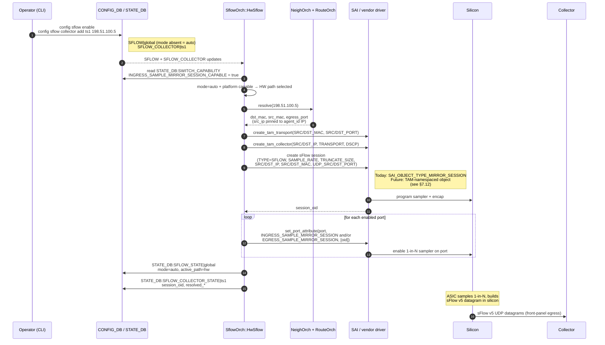
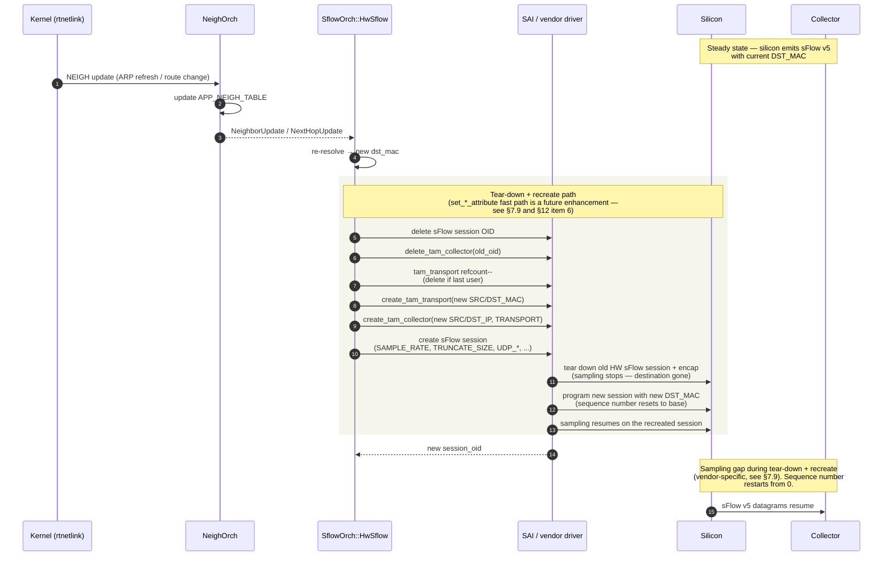

# Hardware Accelerated sFlow High Level Design

## Table of Content

- [1. Revision](#1-revision)
- [2. Scope](#2-scope)
- [3. Definitions/Abbreviations](#3-definitionsabbreviations)
- [4. Overview](#4-overview)
- [5. Requirements](#5-requirements)
- [6. Architecture Design](#6-architecture-design)
- [7. High-Level Design](#7-high-level-design)
  - [7.1 Built-in vs Application Extension](#71-built-in-vs-application-extension)
  - [7.2 Modified modules / repositories](#72-modified-modules--repositories)
  - [7.3 Module interfaces and dependencies](#73-module-interfaces-and-dependencies)
  - [7.4 SWSS changes](#74-swss-changes)
  - [7.5 SWSS and Syncd changes in detail](#75-swss-and-syncd-changes-in-detail)
  - [7.6 DB and Schema changes](#76-db-and-schema-changes)
  - [7.7 Sequence diagrams](#77-sequence-diagrams)
  - [7.8 Linux dependencies and interface](#78-linux-dependencies-and-interface)
  - [7.9 Scalability and performance](#79-scalability-and-performance)
  - [7.10 Management interfaces](#710-management-interfaces)
  - [7.11 Serviceability and Debug](#711-serviceability-and-debug)
  - [7.12 Platform-specific considerations](#712-platform-specific-considerations)
- [8. SAI API](#8-sai-api)
- [9. Configuration and management](#9-configuration-and-management)
  - [9.1 Manifest (if the feature is an Application Extension)](#91-manifest-if-the-feature-is-an-application-extension)
  - [9.2 CLI / YANG model Enhancements](#92-cli--yang-model-enhancements)
  - [9.3 Config DB Enhancements](#93-config-db-enhancements)
  - [9.4 End-to-end CONFIG_DB walkthrough](#94-end-to-end-config_db-walkthrough)
- [10. Warmboot and Fastboot Design Impact](#10-warmboot-and-fastboot-design-impact)
- [11. Memory Consumption](#11-memory-consumption)
- [12. Restrictions / Limitations](#12-restrictions--limitations)
- [13. Testing Requirements / Design](#13-testing-requirements--design)
  - [13.1 Unit test cases](#131-unit-test-cases)
  - [13.2 System test cases](#132-system-test-cases)
- [14. Open / Action items](#14-open--action-items)

### 1\. Revision

| Revision | Date | Author | Change Description |
| ----- | ----- | ----- | ----- |
| 0.1 | 2026-06-01 | Darius Grassi | Initial Proposal |

### 2\. Scope

This document describes the addition of an optional sFlow feature in
SONiC - hardware accelerated sFlow. In ASICs that support hardware accelerated sflow, 
the sflow packets will be sent directly from the ASIC to the collector. This design 
document explains how SflowOrch will be modified to support this sflow mode.

### 3\. Definitions/Abbreviations

| Term | Definition |
| :---- | :---- |
| sFlow | Sampled flow, RFC 3176 / sflow.org v5 |
| HW sFlow | Hardware accelerated sFlow, packets sent from ASIC to collector directly |
| CPU sFlow | The existing sample-and-punt sFlow path documented in SONiC’s [`sflow_hld.md`](https://github.com/sonic-net/SONiC/blob/master/doc/sflow/sflow_hld.md) |
| SAI | Switch Abstraction Interface |
| MOD | Mirror-on-Drop |
| COPP | Control Plane Policing (host-interface trap rate limiter) |
| `MIRROR_SESSION_TYPE_SFLOW` | SAI mirror session type that builds sFlow v5 datagrams in silicon ([`saimirror.h:51`](https://github.com/opencomputeproject/SAI/blob/master/inc/saimirror.h)). |
| TAM | Telemetry and Monitoring, a SAI namespace for telemetry-related objects and attributes |
| TamOrch | Orchagent in `sonic-swss` that programs TAM features like Mirror-on-drop. Proposed in unmerged [sonic-swss#4370](https://github.com/sonic-net/sonic-swss/pull/4370); not present on `master`. |
| hsflowd | InMon's host-sflow agent (`https://github.com/sflow/host-sflow`) |

### 4\. Overview

In the existing SONiC sFlow architecture, all sampled packets are punted
to the CPU over a generic-netlink channel and `hsflowd` performs sFlow
datagram construction in userspace. This works well at moderate sampling
rates and link speeds, but is rate-limited on higher speed
platforms.

With hardware acceleration, the forwarding ASIC:

1. Performs the 1-in-N sampling decision in the pipeline (ingress or egress).
2. Truncates the sampled packet to the configured header size.
3. Prepends sFlow flow-record fields (using preserved system metadata to
   recover ingress / egress port info).
4. Prepends the sFlow datagram header, with an HW-maintained sequence
   number.
5. Prepends an Ethernet/IP/UDP encapsulation toward the configured
   collector, stamping the UDP checksum.
6. Emits the resulting sFlow v5 UDP datagram out a normal egress port.

In this model, the host CPU is involved only at session-create time (to
load the sample rate, the encap template, and the datagram-header layout
into silicon) and at re-program time (to refresh the encap when the
next-hop or source IP changes). Steady-state sample throughput is
decoupled from CPU and COPP capacity.

### 5\. Requirements

1. Detect platform capability for HW sFlow via SAI capability query, and
   reflect it in `STATE_DB:SWITCH_CAPABILITY`.
2. Support configuring HW sFlow on physical interfaces in ingress
   direction only, reusing the existing per-port
`sample_direction: rx ` setting on `SFLOW_SESSION` rows.
3. Support IPv4 and IPv6 collectors.
4. Select the sFlow datapath based on configuration. Default mode is
`cpu-path` and hardware acceleration can be enabled if `mode` is set 
to `hw-accelerated`.
5. Resolve the destination MAC, source MAC, source IP, and other
   encapsulation parameters automatically from kernel routing/neighbor
state.
6. Automatically refresh the silicon encap when the resolved next-hop
   MAC, source IP, or routing changes.
7. Portchannel (LAG) interface support, including LAG-egress sampling.

#### Not planned to be supported

1. HW-accelerated counter samples (out of scope).
2. ACL-driven HW sFlow sessions (support is be port-level only).
3. Egress sampling.

### 6\. Architecture Design

This change extends `SflowOrch` in `sonic-swss` with a new `HwSflow`
sibling class and adds CLI / YANG / CONFIG_DB fields. SAI TAM APIs are
called directly from `SflowOrch::HwSflow`. This design is
similar to `SflowDropMonitor` in the
[`sonic-net/sonic-swss#3970`](https://github.com/sonic-net/sonic-swss/pull/3970).

HW sFlow is the same operator-facing feature as CPU sFlow with a
different datapath, so it stays under the `sflow` CLI/CONFIG_DB namespace
and `SflowOrch` owns both paths. 

### 7\. High-Level Design

`HwSflow` owns the HW sFlow lifecycle: collector/encap
resolution against `NeighOrch` / `RouteOrch`, SAI TAM object create /
update / delete, the sFlow session SAI object, and per-port binding via
`INGRESS_SAMPLE_MIRROR_SESSION`.

### 7.1 Built-in vs Application Extension

Built-in feature modification.

### 7.2 Modified modules / repositories

| Repository | Component | Change |
| :---- | :---- | :---- |
| `sonic-swss` | `SflowOrch` | Added `HwSflow`; consumes `SFLOW_COLLECTOR`, attaches `Observer`s to `NeighOrch` and `RouteOrch`, resolves `(dst_mac, src_mac, egress_port)` against kernel routing/neighbor state and pins encap `src_ip` to `SFLOW|global:agent_id`'s IP (see §7.5) on session create and on observer-callback refresh, calls SAI TAM APIs directly to create `TAM_TRANSPORT` / `TAM_COLLECTOR` / sFlow session, and binds the result via `INGRESS_SAMPLE_MIRROR_SESSION`. |
| `sonic-swss` | `SflowOrch::HwSflow` resolver | New. |
| `sonic-swss` | `SwitchOrch` | Expose `INGRESS_SAMPLE_MIRROR_SESSION_CAPABLE`from `sai_query_attribute_capability()` in `STATE_DB:SWITCH_CAPABILITY`. |
| `sonic-utilities` | `config sflow` / `show sflow` | New `mode` override knob (debug; default `cpu-path`) and diagnostic output. |
| `sonic-yang-models` | `sonic-sflow.yang` | Add `mode` field. |
| `sonic-buildimage` | sflow container | hsflowd config template: optional `sub_agent_id` field (open issue, see §14). |
| `sonic-buildimage` | `db_migrator.py` | Migrate existing config to new schema (additive, absent `mode` = `auto`). |
| `sonic-mgmt` | tests | New PTF tests for HW path (see §13). |

### 7.3 Module interfaces and dependencies

* `SflowOrch::HwSflow` consumes
`STATE_DB:SWITCH_CAPABILITY:INGRESS_SAMPLE_MIRROR_SESSION_CAPABLE` 
to gate the capability. The selected path applies to the entire system.
* `SflowOrch::HwSflow` consumes `APP_DB:SFLOW_SESSION_TABLE` and
`CONFIG_DB:SFLOW_COLLECTOR`. It performs collector resolution using a
new resolver attached to `NeighOrch` and `RouteOrch`, modeled on
resolvers from `MirrorOrch` and `TamOrch`.
It then calls SAI TAM APIs directly to create one
`SAI_OBJECT_TYPE_TAM_TRANSPORT` (refcounted across collectors) and one
`SAI_OBJECT_TYPE_TAM_COLLECTOR` per collector, plus the sFlow session
SAI object.
* `SflowOrch::HwSflow` binds the resulting session OID via
`SAI_PORT_ATTR_INGRESS_SAMPLE_MIRROR_SESSION` on each enabled port.

### 7.5 SWSS and Syncd changes in detail

#### Object graph diagram

The diagram below shows the SAI object graph that `SflowOrch::HwSflow`
creates per configured collector.

```mermaid
flowchart TB
    subgraph SFO["SflowOrch (sonic-swss)"]
        HwSflow["HwSflow sibling class<br/>(includes NeighOrch/RouteOrch resolver)"]
        SP["SAI_OBJECT_TYPE_SAMPLEPACKET<br/>(CPU path only — idle when HW active)"]
    end

    HwSflow -->|creates| TT["SAI_OBJECT_TYPE_TAM_TRANSPORT<br/>SRC/DST_MAC, SRC/DST_PORT<br/>refcounted across collectors"]
    HwSflow -->|creates| TC["SAI_OBJECT_TYPE_TAM_COLLECTOR<br/>SRC/DST_IP, DSCP"]
    TC -.->|references| TT
    HwSflow -->|creates| SES["sFlow session SAI object<br/>today: SAI_OBJECT_TYPE_MIRROR_SESSION<br/>TYPE=SFLOW<br/>future: TAM-namespaced object"]
    SES -.->|carries SAMPLE_RATE,<br/>TRUNCATE_SIZE, UDP_*,<br/>encap fields| TC

    HwSflow -->|binds OID| PORT["Port:<br/>SAI_PORT_ATTR_INGRESS_SAMPLE_MIRROR_SESSION<br/>]
    SES -.->|bound to| PORT
```

On session create, `HwSflow` walks `NeighOrch` / `RouteOrch` to populate `(dst_mac, src_mac,
egress_port)` and pins `src_ip` to `agent_id`'s IP and registers as a neighbor / next-hop observer to
refresh on kernel state changes. The resolver picks the first nexthop and
the first LAG member if the resolution is over a ECMP or LAG. 

When hw-acceleration is enabled and supported, `SflowOrch` creates one `TAM_TRANSPORT` + one
`TAM_COLLECTOR` per configured collector, plus the sFlow session SAI
object, then binds the session OID to the port. Mode transitions from `cpu-mode` 
to `hw-acceleration` or vice versa tear down the old path's SAI state before 
standing up the new path's; a brief sampling outage is expected.

When the configured collector count exceeds the supported maximum (the platform's advertised limit),
`SflowOrch::HwSflow` programs the first N collectors (sorted by name, so the 
set is stable across restarts and reconciles) and leaves the rest unprogrammed —
`SFLOW_COLLECTOR_STATE.PROGRAMMED=false,
LAST_ERROR=hw_session_limit_exceeded`, plus a WARN syslog naming them. The
system stays `active_path=hw` rather than failing wholesale for one excess
row.

#### Lifecycle implications

`HwSflow` must handle next-hop / encap changes and operator-driven
sample-rate changes. The current plan is **tear-down + recreate**: delete
the `TAM_COLLECTOR`, decrement the `TAM_TRANSPORT` refcount, recreate — so
the vendor driver sees a delete-then-create on every attribute change,
costing a sampling gap and a sequence-number reset. An in-place
`set_*_attribute()` fast path is not uniformly available (not all
attributes support it on every platform — see §7.12) and is tracked as a
§14 enhancement.

#### Partial-create failure handling

`HwSflow` must handle partial-create failure. The failed collector is
flagged `SFLOW_COLLECTOR_STATE.PROGRAMMED=false` with the SAI error in
`LAST_ERROR`; others are unaffected. 

#### Agent address coupling

Every sFlow v5 datagram carries an *Agent Address*: the IP the collector
uses a primary key to group a switch's samples (distinct from the
arbitrary-integer `sub_agent_id` — §14 item 2). In the CPU path, `hsflowd`
sets it from `SFLOW|global:agent_id`, decoupled from transport. On the HW
path the silicon reuses the encap source IP and exposes no separate Agent
Address field, so identity and transport source are *coupled by
construction* (per the §7.12 item 1 contract, the Agent Address is the
session source-IP attribute `SAI_MIRROR_SESSION_ATTR_SRC_IP_ADDRESS`).

`SflowOrch::HwSflow` resolves this in the operator's favor: the encap
source IP is **pinned to `agent_id`'s resolved IP for every collector**
(only `dst_mac`, `src_mac`, `egress_port` come from the route lookup).
With the §7.12 item 1 vendor contract that the v5 Agent Address *is* the
session source IP, the Agent Address equals `agent_id`'s IP by
construction — nothing to detect or fail on, and a loopback source still
routes to any collector normally. The cost is a documented limitation
(§12 item 4): unlike the CPU path, HW cannot decouple advertised identity
from transport source; such a config still works, it just emits with both
equal to `agent_id`'s IP.


### 7.6 DB and Schema changes

**Existing tables (unchanged in Phase I):**

* `CONFIG_DB:SFLOW_COLLECTOR`: unchanged in Phase I. (Phase II MAY add
optional manual-override fields for encap.)
* `APP_DB:SFLOW_SESSION_TABLE`: unchanged. The per-port
`sample_direction: rx | tx | both` field is honored on the HW path in
both directions.
* `APP_DB`: no new tables.

**New / extended tables:**

* `STATE_DB:SWITCH_CAPABILITY`: NEW
`INGRESS_SAMPLE_MIRROR_SESSION_CAPABLE` (and the egress equivalent).
Attribute names preserved across the SAI-namespace question; if the
capability query migrates, the bits are renamed in lockstep.
* `CONFIG_DB:SFLOW`: add optional `mode` field (`auto` |
`hw-accelerated` | `cpu-path`; default `auto`). Absent in the normal
workflow — explicit values are a debug/override facility.
* `STATE_DB:SFLOW_STATE`: NEW single `|global` row exposing configured
`mode`, resolved system-wide `active_path` (`hw` / `cpu` / `failed`),
`path_reason`, and last update timestamp. Populated by `SflowOrch`.
* `STATE_DB:SFLOW_COLLECTOR_STATE`: NEW per-collector view: resolved
encap fields, SAI session OID, last error, last update timestamp.
Populated by `SflowOrch::HwSflow` only when the system is in HW mode.

`SflowOrch::HwSflow` calls SAI TAM APIs directly; no `CFG_TAM_*` rows
are introduced. The HW sFlow session is implicit in the `SFLOW` /
`SFLOW_COLLECTOR` configuration plus the `mode` knob.

### 7.7 Sequence diagrams

#### Initial enablement, HW path



#### Next-hop change

The HW-side outcome is a sampling gap with a sequence-number reset. The
diagram below traces the tear-down + recreate path.



### 7.8 Linux dependencies and interface

* Collector resolution consumes the same kernel interfaces SONiC already
uses for routing/neighbor state (rtnetlink via `NeighOrch` /
`RouteOrch`). No new kernel modules and no new subscriptions specific
to sFlow.
* `psample` and `NET_DM` genetlink remain in use for counter samples and
MOD respectively.
* Outbound sFlow datagrams on the HW path do not pass through any Linux
netdev. Standard packet-capture tools on the management / front-panel
netdevs WILL NOT see HW sFlow traffic; vendor-specific debug tools are
required. (Egress-port TX counters do count HW-emitted datagrams.)

### 7.9 Scalability and performance

* HW path supports flow-sample rates limited by silicon (typically full
line-rate at the configured 1-in-N divisor).
* Sample-rate or encap changes on the HW path trigger a tear-down +
recreate of the SAI session (lifecycle detail in §7.5), costing a
sampling gap and sequence-number reset per change.

Because each change costs a gap, `HwSflow` owns a short coalescing window
(debounce) over config-driven changes: rapid successive writes to
`sample_rate` or encap-affecting fields for a given collector collapse
into a single tear-down + recreate once the window settles, rather than
one recreate per write. The default window is a small fixed interval
(~100 ms, tunable), well under operator-perceptible latency while
absorbing bursts of CLI or route churn. A `set_*_attribute()` fast path,
where the silicon supports it, would shrink the per-change cost further
(tracked in §14).

### 7.10 Management interfaces

* CLI: see [Section 9.2](#92-cli--yang-model-enhancements) (`config
sflow` / `show sflow`).
* gNMI / REST: derived from the YANG model, additive.

### 7.11 Serviceability and Debug

* `STATE_DB:SFLOW_STATE|global` exposes the configured `mode`, the
resolved system-wide active path, and the `path_reason` on forced-mode
failure or when `auto` resolves to CPU.
* Per-collector resolution (encap fields, SAI session OID, last error)
is exposed via `STATE_DB:SFLOW_COLLECTOR_STATE`.
* `show sflow` CLI reports the system active path, the configured
`mode`, and per-collector resolved encap. See §9.2.
* `SflowOrch` emits syslog at INFO on mode transitions and at
WARN/ERROR on capability mismatches and resolution failures.
* **Egress port TX counters MAY include HW-emitted sFlow datagrams**
(vendor-specific, not HLD-mandated). Operators
troubleshooting "collector sees nothing" should not expect a missing-TX
symptom on the egress port (§7.8).
* **Per-session HW emit counter**: neither SAI's `MIRROR_SESSION`
surface nor the `TAM_COLLECTOR` / `TAM_TRANSPORT` surface standardizes a
`samples_generated` counter. Vendor-specific counters MAY be exposed via
debug CLI. Capture as §14 open item for the SAI community.

### 7.12 Platform-specific considerations

This feature is **only effective on platforms whose SAI advertises**
`SAI_PORT_ATTR_INGRESS_SAMPLE_MIRROR_SESSION` capability (and the egress
equivalent for §5 requirement 2) AND maps
`SAI_MIRROR_SESSION_TYPE_SFLOW` (or its forthcoming TAM-namespace
successor — see SAI surface caveat below) to in-silicon sFlow datagram
construction. Under the default `mode=auto`, platforms without this
capability resolve to the existing CPU path unchanged — no breakage, no
behavioral change, and nothing for the operator to configure
(`STATE_DB:SFLOW_STATE.path_reason` records why HW was not selected).
Capability drives selection at path-selection time only; there is no
error-driven runtime fall-through after a path is selected (§7.5). If
an operator forces `mode=hw-accelerated` on a platform that does not
advertise the capability, sFlow fails closed
(`STATE_DB:SFLOW_STATE.active_path=failed,
path_reason=platform_not_capable`, WARN syslog) rather than silently
reverting to CPU — the forced value is an explicit debug/override
choice. To recover, the operator returns `mode` to `auto` (or
`cpu-path`).

**SAI surface caveat.** Today's SAI hosts the in-silicon sFlow primitive
under `SAI_OBJECT_TYPE_MIRROR_SESSION`. The 2025-03 SAI TAM enhancements
([PR #2141](https://github.com/opencomputeproject/SAI/pull/2141)) added
sampling primitives in the TAM namespace but did **not** migrate
`MIRROR_SESSION_TYPE_SFLOW`, so its long-term namespace is unsettled. This
HLD is forward-compatible with either landing; the vendor-contract items
below apply to whichever SAI object type currently hosts the sFlow
primitive on a given platform/version.

The community SHOULD be informed in advance of merge. Silicon vendors
who want their platforms to use the HW path MUST:

1. Implement the sFlow-builder SAI primitive (today:
   `SAI_MIRROR_SESSION_TYPE_SFLOW`; future: the TAM-namespace successor)
such that the silicon emits wire-format sFlow v5 UDP datagrams. The Agent
Address field **MUST** equal the session source-IP attribute (today:
`SAI_MIRROR_SESSION_ATTR_SRC_IP_ADDRESS`); SONiC pins that IP to
`SFLOW|global:agent_id`, so any other derivation silently breaks operator
identity (§7.5 "Agent address coupling").
2. Advertise capability via `sai_query_attribute_capability()` on
   `SAI_PORT_ATTR_INGRESS_SAMPLE_MIRROR_SESSION` and the egress
equivalent (or their successor port-binding attributes).
3. Ideally, apply attribute changes via `set_*_attribute()` on the
   relevant session SAI object without requiring the application to tear
down and recreate it. **This is a desired vendor behavior, not a SAI spec
guarantee, and is not uniformly available across attributes or
platforms.** `HwSflow` plans a tear-down + recreate lifecycle that
sidesteps this gap; a per-field fast path is tracked in §14.
4. **Sequence-number behavior on attribute updates**: vendors MAY reset
   the sFlow datagram sequence number on attribute updates. SONiC's HLD
does not require preservation. Collectors are expected to
tolerate sequence-number resets, which most modern sFlow collectors do.
With tear-down + recreate, sequence-number resets are the norm (a
recreated session always starts at 0); collectors that depend on
continuous sequencing across topology change will need to tolerate this.
5. **Egress port programming.** `HwSflow` does not currently pass the
   resolved egress port into a SAI attribute, relying on silicon IP route
lookup at emit time. Vendors whose HW sFlow path requires explicit
egress-port pinning MUST advertise that requirement (tracked in §14).

## 8\. SAI API

No new SAI APIs are introduced. All referenced enums and attributes
exist in standard SAI today (verified against
[`saimirror.h`](https://github.com/opencomputeproject/SAI/blob/master/inc/saimirror.h),
[`saiport.h`](https://github.com/opencomputeproject/SAI/blob/master/inc/saiport.h),
[`saitam.h`](https://github.com/opencomputeproject/SAI/blob/master/inc/saitam.h),
and a shipping vendor SAI implementation).

**SAI surface note.** The table reflects today's surface, where the
in-silicon sFlow datagram-builder lives under
`SAI_OBJECT_TYPE_MIRROR_SESSION`; its long-term namespace is unsettled
(see §7.12 "SAI surface caveat"). Where the table cites
`SAI_MIRROR_SESSION_ATTR_*`, the equivalent TAM-namespaced attribute (if
it lands) is the substitute; the *semantics* in the "Use" column don't
change. The `SAI_TAM_*` rows reflect the objects `SflowOrch::HwSflow`
creates per configured collector.

| API / Object / Attribute | Use | Reference |
| :---- | :---- | :---- |
| `SAI_OBJECT_TYPE_TAM_TRANSPORT` | Per-collector L2 encap container (SRC/DST_MAC, SRC/DST_PORT). Refcounted across collectors. | [`saitam.h`](https://github.com/opencomputeproject/SAI/blob/master/inc/saitam.h) |
| `SAI_OBJECT_TYPE_TAM_COLLECTOR` | Per-collector L3 encap container (SRC/DST_IP, TRANSPORT ref, DSCP). | [`saitam.h`](https://github.com/opencomputeproject/SAI/blob/master/inc/saitam.h) |
| `SAI_OBJECT_TYPE_MIRROR_SESSION` | Per-collector sFlow session container (today's SAI surface; may migrate to TAM namespace) | standard |
| `SAI_MIRROR_SESSION_ATTR_TYPE = SAI_MIRROR_SESSION_TYPE_SFLOW` | Selects the HW sFlow datagram-builder path | [`saimirror.h`](https://github.com/opencomputeproject/SAI/blob/master/inc/saimirror.h) |
| `SAI_MIRROR_SESSION_ATTR_MONITOR_PORT` | Vendor-specified internal/monitor port | [`saimirror.h`](https://github.com/opencomputeproject/SAI/blob/master/inc/saimirror.h) |
| `SAI_MIRROR_SESSION_ATTR_TRUNCATE_SIZE` | Sample truncation size (default 128) | [`saimirror.h`](https://github.com/opencomputeproject/SAI/blob/master/inc/saimirror.h) |
| `SAI_MIRROR_SESSION_ATTR_SAMPLE_RATE` | 1-in-N divisor on the mirror session | [`saimirror.h`](https://github.com/opencomputeproject/SAI/blob/master/inc/saimirror.h) |
| `SAI_MIRROR_SESSION_ATTR_SRC_MAC_ADDRESS` | Encap source MAC (resolved by the orchagent's collector resolver) | [`saimirror.h`](https://github.com/opencomputeproject/SAI/blob/master/inc/saimirror.h) |
| `SAI_MIRROR_SESSION_ATTR_DST_MAC_ADDRESS` | Encap destination MAC (resolved next-hop) | [`saimirror.h`](https://github.com/opencomputeproject/SAI/blob/master/inc/saimirror.h) |
| `SAI_MIRROR_SESSION_ATTR_SRC_IP_ADDRESS` | Encap source IP — **also embedded as v5 Agent Address** (see §7.5) | [`saimirror.h`](https://github.com/opencomputeproject/SAI/blob/master/inc/saimirror.h) |
| `SAI_MIRROR_SESSION_ATTR_DST_IP_ADDRESS` | Encap destination IP (collector) | [`saimirror.h`](https://github.com/opencomputeproject/SAI/blob/master/inc/saimirror.h) |
| `SAI_MIRROR_SESSION_ATTR_IPHDR_VERSION` | IPv4 / IPv6 | [`saimirror.h`](https://github.com/opencomputeproject/SAI/blob/master/inc/saimirror.h) |
| `SAI_MIRROR_SESSION_ATTR_TOS`, `_TTL` | IP header fields | [`saimirror.h`](https://github.com/opencomputeproject/SAI/blob/master/inc/saimirror.h) |
| `SAI_MIRROR_SESSION_ATTR_UDP_SRC_PORT`, `_UDP_DST_PORT` | UDP header fields | [`saimirror.h`](https://github.com/opencomputeproject/SAI/blob/master/inc/saimirror.h) |
| `SAI_PORT_ATTR_INGRESS_SAMPLE_MIRROR_SESSION` | Bind session(s) to ingress port | [`saiport.h`](https://github.com/opencomputeproject/SAI/blob/master/inc/saiport.h) |
| `SAI_PORT_ATTR_EGRESS_SAMPLE_MIRROR_SESSION` | Bind session(s) to egress port (Phase I, §5 requirement 2) | [`saiport.h`](https://github.com/opencomputeproject/SAI/blob/master/inc/saiport.h) |

Capability discovery uses the standard
`sai_query_attribute_capability()` against `SAI_OBJECT_TYPE_PORT` for
`SAI_PORT_ATTR_INGRESS_SAMPLE_MIRROR_SESSION` (and the egress
equivalent). If the SAI port-binding attribute migrates to the TAM
namespace, the capability query target migrates with it; SwitchOrch's
exposed `STATE_DB:SWITCH_CAPABILITY` bit name is preserved for backward
compatibility.

The existing `SAI_OBJECT_TYPE_SAMPLEPACKET` API continues to be used
unchanged whenever the system resolves to the CPU path (`auto` on a
platform without HW sFlow capability, or forced `cpu-path`), and for
counter-sample / MOD paths.

## 9\. Configuration and management

### 9.1 Manifest (if the feature is an Application Extension)

Not applicable — this is a built-in feature modification to swss and
configuration tooling (see §7.1).

### 9.2 CLI / YANG model Enhancements

The CPU-path CLI (`config sflow enable/disable`, `config sflow
collector ...`, `config sflow agent-id ...`, per-port `config sflow
interface sample-rate/sample-direction`) is unchanged.

#### CLI additions

1. `config sflow mode <auto|hw-accelerated|cpu-path>`
   - Debug/override knob only; the normal workflow never sets it.
   - Default `auto`: the datapath is selected from platform capability
   (§7.5) — HW where advertised, CPU otherwise. Zero configuration.
   - `cpu-path`: force the CPU path (e.g. to isolate a suspected HW
   sampling problem, or to preserve exact pre-existing behavior).
   - `hw-accelerated`: force the HW path. If unavailable on the
   platform, sFlow is administratively failed with a syslog error and
   `STATE_DB` reflects the failure (fail-closed, not silent CPU
   fallback).

2. `show sflow` is extended to display:
   - Platform capability (`hw_sflow_capable: true|false`)
   - Configured mode (`mode: auto|hw-accelerated|cpu-path`)
   - System active path (`active_path: hw|cpu|failed`) and `path_reason`
   on failure
   - When `active_path=hw`, per-collector resolved encap summary
   (`resolved_dst_mac`, `resolved_src_ip`, `egress_port`) and SAI
   session OID
   - Last resolution timestamp and last error

No existing CLI is removed or changed in incompatible ways.

#### YANG model

`sonic-sflow.yang` gains:

```
leaf mode {
    type enumeration {
        enum auto;
        enum hw-accelerated;
        enum cpu-path;
    }

    default "auto";
    description "sFlow datapath override. Default 'auto' selects
                 hardware-accelerated sFlow when the platform is capable,
                 CPU-based sFlow otherwise. Explicit values force a path
                 for debug.";
}
```

The enum literals (`auto`, `hw-accelerated`, `cpu-path`) are identical across
the CLI token, the YANG enum, and the value stored in
`CONFIG_DB:SFLOW|global:mode` — there is no underscore variant and no
CLI-to-DB translation. `show sflow` and `STATE_DB` echo the same
spelling. (YANG validation rejects config whose stored value does not
match an enum literal, so the three must agree exactly.)

### 9.3 Config DB Enhancements

#### `CONFIG_DB:SFLOW` (modified, additive)

```
"SFLOW": {
    "global": {
        "admin_state": "up",
        "polling_interval": "20",
        "agent_id": "Loopback0",
        "sample_direction": "rx",
        "drop_monitor_limit": "0",

        "mode": "auto"                  // NEW, optional, default "auto";
                                        // values: auto | hw-accelerated | cpu-path
                                        // debug/override only — absent in the
                                        // normal workflow
    }
}
```

#### `CONFIG_DB:SFLOW_COLLECTOR` (unchanged in Phase I)

Phase I uses orchagent-driven encap resolution. Phase II MAY add
optional overrides (`override_dst_mac`, `override_src_ip`,
`override_tos`, `override_ttl`, `override_udp_src_port`); these MUST
default to "unset" so existing config remains valid.

#### `STATE_DB:SWITCH_CAPABILITY` (modified, additive)

```
"SWITCH_CAPABILITY|switch": {
    "value": {
        "PORT_EGRESS_SAMPLE_CAPABLE": "true",
        "MIRROR_ON_DROP_CAPABLE": "true",
        "INGRESS_SAMPLE_MIRROR_SESSION_CAPABLE": "true",  // NEW
        "EGRESS_SAMPLE_MIRROR_SESSION_CAPABLE": "true"    // NEW (Phase I, §5 req 2)
    }
}
```

#### `STATE_DB:SFLOW_STATE` (new)

System-wide path observability. One row, key `SFLOW_STATE|global`.
Populated by `SflowOrch`.

```
key             = SFLOW_STATE|global
MODE            = "auto" / "hw-accelerated" / "cpu-path"   ; mirrors CONFIG_DB (default "auto")
ACTIVE_PATH     = "hw" / "cpu" / "failed"                  ; resolved system path
                                                           ; ("failed" only under forced
                                                           ;  mode=hw-accelerated — auto never fails)
PATH_REASON     = string                                   ; why HW is not active: e.g.
                                                           ; "platform_not_capable",
                                                           ; "egress_sample_not_capable", ""
                                                           ; (set both on forced-mode failure and
                                                           ;  when auto resolves to CPU;
                                                           ;  collector over-subscription is NOT a
                                                           ;  global failure — see SFLOW_COLLECTOR_STATE)
LAST_UPDATED    = timestamp
```

#### `STATE_DB:SFLOW_COLLECTOR_STATE` (new)

Per-collector resolution detail. Populated by `SflowOrch::HwSflow` only
when `SFLOW_STATE.ACTIVE_PATH = hw`; absent in CPU mode.

```
key             = SFLOW_COLLECTOR_STATE|<collector_name>
TAM_SESSION_OID = OID                         ; SAI OID of the sFlow session
                                              ; (today: SAI_OBJECT_TYPE_MIRROR_SESSION; future: TAM-namespace successor)
                                              ; empty when PROGRAMMED=false
PROGRAMMED      = "true" / "false"            ; false when the collector exceeds the
                                              ; hardware concurrent-session limit (see §12 item 12)
RESOLVED_DST_MAC  = MACaddress
RESOLVED_SRC_IP   = IPaddress
RESOLVED_SRC_MAC  = MACaddress
EGRESS_PORT       = ifname
LAST_ERROR      = string                      ; empty if healthy; e.g. "hw_session_limit_exceeded"
LAST_UPDATED    = timestamp
```

#### DB Migration

All new fields are additive with documented defaults. Existing config
without `mode` is treated as `auto` (the YANG default); `db_migrator.py`
adds no field. Platforms that do not advertise the new capability bits
remain on the CPU path with no behavioral change. **Deliberate upgrade
behavior:** a capable platform with pre-existing sFlow config moves
from the CPU path to the HW path on first boot of an image with this
feature — the operator-visible sample stream is equivalent, but the
datapath changes (flow samples no longer transit the CPU path, §7.8;
sequence numbers reset). An operator who wants the old datapath
pins `mode=cpu-path` before upgrading.

### 9.4 End-to-end CONFIG_DB walkthrough

Walkthrough of the path from operator CLI to silicon for a single
collector `ts1` at `198.51.100.5` with sample rate 1-in-2048.

1. **Operator** (no datapath configuration — `mode` stays at its
   default `auto`):
   ```
   config sflow enable
   config sflow collector add ts1 198.51.100.5
   config sflow interface enable Ethernet0
   ```
2. **CONFIG_DB writes:**
   ```
   SFLOW|global:        admin_state=up, agent_id=Loopback0,
                        sample_direction=rx
   SFLOW_COLLECTOR|ts1: collector_ip=198.51.100.5, collector_port=6343
   SFLOW_SESSION|Ethernet0: admin_state=up, sample_rate=2048
   ```
3. **SflowOrch read + resolve:** `SflowOrch` reads
   `STATE_DB:SWITCH_CAPABILITY:INGRESS_SAMPLE_MIRROR_SESSION_CAPABLE=true`;
`mode=auto` + capable → effective path = HW. `HwSflow` resolves
`198.51.100.5` against `NeighOrch` / `RouteOrch` → `dst_mac`, `src_mac`,
`egress_port`; encap `src_ip` is pinned to `agent_id` (Loopback0)'s IP.
4. **SAI calls (from SflowOrch):** `create_tam_transport(SRC/DST_MAC,
   SRC/DST_PORT)` → `create_tam_collector(SRC/DST_IP, TRANSPORT, DSCP)`
→ `create_mirror_session(TYPE=SFLOW, SAMPLE_RATE=2048, TRUNCATE_SIZE,
SRC/DST_IP, SRC/DST_MAC, UDP_*)` → returns `session_oid`.
5. **Port binding:** `set_port_attribute(Ethernet0,
   INGRESS_SAMPLE_MIRROR_SESSION, [session_oid])` for each enabled port
(honoring `sample_direction`).
6. **STATE_DB writes:** `SFLOW_STATE|global active_path=hw`,
   `SFLOW_COLLECTOR_STATE|ts1` populated with resolved encap and OID.

## 10\. Warmboot and Fastboot Design Impact

Warmboot preserves the HW sFlow silicon state (sampling session, encap,
sample-rate divisor) on capable platforms; the orchagent reconciles
in-memory state against the ASIC without tearing sessions down when
CONFIG_DB attributes match. Fastboot tears sampling down on shutdown and
resumes once collector encap is resolved and ports are operationally up
— typically bounded by ARP/ND resolution to the configured collector(s).
No new boot-critical-path stalls are introduced. Vendor-specific
behavior on session recreate (e.g., sequence-number reset) is documented
in §7.12.

## 11\. Memory Consumption

- When the feature is **disabled at compile time**: zero impact.
- When the system **resolves to the CPU path** (`auto` on an incapable
platform, or forced `mode=cpu-path`): zero additional resident memory
in the orchagent.
- When the feature is **active**: per-collector memory in CONFIG_DB
scales linearly with the configured collector count (§5 requirement 3
caps this at 4, further bounded by the hardware-advertised maximum
concurrent HW sFlow sessions). One `TAM_COLLECTOR` and one
(refcount-shared) `TAM_TRANSPORT` per active HW collector, plus the per-session SAI sFlow object — roughly
equivalent in cost to one additional MOD session per collector.
`SflowOrch` adds bookkeeping for port→collector bindings and STATE_DB
entries (bounded by port count × collector count).

## 12\. Restrictions / Limitations

| # | Limitation | Detail |
| :---- | :---- | :---- |
| 1 | LAG (PortChannel) support is Phase I; the session-programming model (per-member sessions vs. one LAG-bound session) is vendor-specific and unresolved. | §5 req 9, §14 items 5, 11 |
| 2 | HW path emits flow samples only; counter samples and MOD stay on the `hsflowd` CPU path. | |
| 3 | HW-path `sample_direction=tx`/`both` requires the platform to advertise `EGRESS_SAMPLE_MIRROR_SESSION_CAPABLE`. The path is system-wide, not per-port: under `auto`, *any* tx/both port on a platform lacking the egress bit resolves the whole system to CPU (`path_reason=egress_sample_not_capable`) — one egress-sampling port keeps every port off HW. Under forced `hw-accelerated` the same config fails instead (`active_path=failed`, admin-down, WARN). Ingress-only configs run on HW normally. | §7.3, §7.5 |
| 4 | HW has one silicon field for both encap source IP and the v5 Agent Address, so it can't reproduce a CPU-path config that decoupled `agent_id` from transport source; both are pinned to `agent_id`'s IP. Usually both `Loopback0`, so invisible. | §7.5 |
| 5 | ERSPAN and HW sFlow coexist on a port — distinct SAI port attributes (`INGRESS_MIRROR_SESSION` vs `INGRESS_SAMPLE_MIRROR_SESSION`), no exclusivity. MirrorOrch unmodified. | |
| 6 | Sample-rate or encap change = tear-down + recreate: sampling outage (vendor-specific, typically ms to tens of ms) plus a per-collector sequence-number reset. Collectors must tolerate resets. | §7.5, §14 |
| 7 | Encap is refreshed on next-hop / source-IP change; rapidly flapping reachability causes repeated gaps and sequence resets. | |
| 8 | Linux packet-capture WILL NOT see HW-emitted datagrams — debug via collector-side SPAN or vendor tools. Egress-port TX counters *do* count them, so "missing samples" is not a TX-counter symptom. | §7.8 |
| 9 | `hsflowd` keeps running for counter/MOD; the `psample` flow stream is naturally idle (no port binds `INGRESS_SAMPLEPACKET_ENABLE`). No config change needed. | |
| 10 | `sub_agent_id` disambiguation between silicon- and hsflowd-emitted streams is unresolved (`mod_sonic.c` exposes no `sub_agent_id`); collectors keying on `(agent_address, sub_agent_id)` may see two streams with the same sub-agent. | §14 item 2 |
| 11 | `/etc/hsflowd.conf` MUST NOT be edited manually; SONiC owns it. | |
| 12 | Collector over-subscription is partial, not fatal: first N (by name) programmed, the rest flagged `hw_session_limit_exceeded`; system stays `active_path=hw`. | §7.5 |

## 13\. Testing Requirements / Design

### 13.1 Unit test cases

| \# | Test |
| :---- | :---- |
| 1 | Capability bits `INGRESS_SAMPLE_MIRROR_SESSION_CAPABLE` and `EGRESS_SAMPLE_MIRROR_SESSION_CAPABLE` correctly populated from SAI |
| 2 | Under default `mode=auto`, `SflowOrch` selects HW path on capable platform, CPU path otherwise (with `path_reason` recording why); `auto` never yields `active_path=failed` |
| 3 | `SflowOrch` honors forced `mode=cpu-path` and uses CPU path even when capable |
| 4 | `SflowOrch` honors forced `mode=hw-accelerated` and reports failure on incapable platform |
| 5 | `SflowOrch::HwSflow` resolves the HW sFlow session from `SFLOW` / `SFLOW_COLLECTOR` + `mode` and produces the correct SAI attribute list (`TAM_TRANSPORT`, `TAM_COLLECTOR`, and the sFlow session object) |
| 6 | `HwSflow`'s resolver re-resolves on `NEIGH_TABLE` change; observer callbacks fire and the session refreshes |
| 7 | `SflowOrch` binds OID via `INGRESS_SAMPLE_MIRROR_SESSION` / `EGRESS_SAMPLE_MIRROR_SESSION` after the session becomes active |
| 8 | `SflowOrch` skips `create_samplepacket()` for ports on the HW path |
| 9 | Encap `src_ip` is pinned to `agent_id`'s resolved IP for every collector regardless of the per-collector route; the resolver derives only `dst_mac`/`src_mac`/`egress_port` from routing, and no `agent_id`/source-IP failure path is taken |
| 10 | Config without `mode` treated as `auto` (YANG default); no migrator rewrite |
| 11 | `STATE_DB:SFLOW_STATE` exposes a single system-wide `active_path`; `SFLOW_COLLECTOR_STATE` populated only in HW mode |
| 12 | Any `mode` change that flips the resolved path (incl. `auto` ↔ forced values) tears down the old path's SAI state before standing up the new path's state; no overlap of `INGRESS_SAMPLE_MIRROR_SESSION` and `INGRESS_SAMPLEPACKET_ENABLE` is ever observed on any port |
| 13 | `show sflow` output reflects new fields |
| 14 | YANG validation accepts new `sonic-sflow.yang` fields and rejects malformed values |
| 15 | With a port configured `sample_direction=tx`/`both` on a platform lacking `EGRESS_SAMPLE_MIRROR_SESSION_CAPABLE`: under `mode=auto` the system resolves to CPU with `path_reason=egress_sample_not_capable`; under forced `mode=hw-accelerated` it fails (`SFLOW_STATE.active_path=failed`, same reason); an ingress-only config on the same platform resolves to HW in both modes |
| 16 | Collector over-subscription: with collectors > hardware max, the first N (by name order) get `PROGRAMMED=true` with a `TAM_SESSION_OID`; the rest get `PROGRAMMED=false, LAST_ERROR=hw_session_limit_exceeded`; `active_path` stays `hw`; ordering is stable across reconcile |
| 17 | LAG: `SFLOW_SESSION` on a PortChannel programs HW sFlow per the chosen model (§14 item 5); member add/remove updates the session binding accordingly |

### 13.2 System test cases

| \# | Test |
| :---- | :---- |
| 1 | End-to-end: configure sFlow with no `mode` set on a capable platform; system auto-selects the HW path and the collector receives sFlow v5 datagrams |
| 2 | Sequence numbers are monotonic within a steady-state HW-emitted stream (resets only on attribute updates) |
| 3 | Sample rate matches configured 1-in-N within ±5% over a 60-second 100 Gbps sustained line-rate ingress test |
| 4 | Egress sampling (`sample_direction=tx`) on HW path produces wire-format sFlow v5 datagrams; rate matches configured 1-in-N |
| 5 | Counter samples and MOD continue to arrive via the CPU stream |
| 6 | Agent Address field in HW-emitted datagrams equals resolved IP of `SFLOW|global:agent_id` interface |
| 7 | Next-hop change (induced via static route flap) triggers tear-down + recreate; sampling resumes; sequence-number reset observed (honesty test); measured outage logged for regression tracking |
| 8 | Source-IP change (loopback edit) triggers encap refresh |
| 9 | ERSPAN coexistence: configure a `MIRROR_SESSION_TYPE_ENHANCED_REMOTE` (MirrorOrch) and HW sFlow on the same port; both work simultaneously; removing one does not disturb the other |
| 10 | Fast warmboot preserves sampling on unchanged sessions; sequence number preserved for unchanged sessions |
| 11 | Fastboot resumes sampling after collector reachability is restored |
| 12 | Sample-rate change applied while sampling is active; brief outage observed; sequence-number reset observed; stream resumes |
| 13 | On an incapable platform: default `mode=auto` resolves to CPU (sampling works, `path_reason=platform_not_capable`); forced `mode=hw-accelerated` surfaces `SFLOW_STATE.active_path=failed`, same reason, sFlow admin-down system-wide |
| 14 | Stress: ~580K samples/sec from a single 800G ingress port at line rate with 1-in-2048 sampling, no CPU saturation (motivation validation per §4) |
| 15 | Collector over-subscription end-to-end: configure more collectors than the hardware maximum; the programmed collectors receive sFlow v5 datagrams while the over-limit collectors receive none and are flagged in `SFLOW_COLLECTOR_STATE`; the system as a whole stays up |
| 16 | LAG end-to-end: HW sFlow on a PortChannel samples ingress and egress traffic across all members at the configured 1-in-N; sampling survives member add/remove and link flap |

## 14\. Open / Action items

1. **Resolver consolidation across orchagents.** `MirrorOrch` and now
   `SflowOrch::HwSflow` each carry their own `NeighOrch` / `RouteOrch`
resolver for next-hop / encap fields. A follow-up should extract this
resolver into a shared helper that both orchagents call. Worth
discussing with the `MirrorOrch` maintainers.
2. **`sub_agent_id` configurability in `hsflowd`.** The SONiC `hsflowd`
   integration
([`mod_sonic.c:50-65`](https://github.com/sflow/host-sflow/blob/master/src/Linux/mod_sonic.c))
exposes `agent_id` but **not** `sub_agent_id`. To let collectors
disambiguate the silicon-emitted flow-sample stream from the
hsflowd-emitted counter/MOD stream, either: (a) add `sub_agent_id` to
the SONiC hsflowd config and the CONFIG_DB schema; or (b) define a
different disambiguation mechanism. Needs vendor input on whether the
silicon's emitted `sub_agent_id` is configurable on a per-sFlow-session
basis.
3. **UDP source port stability.** See item 10 below.
4. **Capability granularity.** SAI's
   `sai_query_attribute_capability(SAI_OBJECT_TYPE_PORT, ...)` is
per-port by signature, but this HLD consumes a single switch-wide
capability bit (uniform support is expected). The implementation should
treat capability as switch-wide: any per-port disagreement on a capable
platform is a vendor bug. Worth raising with vendors that expose
per-port-variable capability.
5. **LAG support.** Multiple member ports → multiple HW sFlow sessions
   vs. one LAG-bound session, vendor-specific. Must be resolved for
Phase I (§5 requirement 9). (The resolver inherits a "first member only"
pattern for LAG egress today — see item 11.)
6. **Per-session HW emit counter.** SAI does not standardize a
   `samples_generated` counter on either the existing `MIRROR_SESSION`
surface or the TAM family. Raise in SAI community; out of scope here.
7. **SAI namespace alignment.** Monitor SAI TAM WG direction; the
   in-silicon sFlow primitive's long-term namespace is unsettled (detail
in §7.12 "SAI surface caveat"). If a future migration of
`MIRROR_SESSION_TYPE_SFLOW` lands, re-validate the §7.12 vendor contract.
8. **`set_*_attribute()` fast path for hw-sflow.** `HwSflow` plans a
   tear-down + recreate lifecycle on next-hop / encap / sample-rate
change. A future enhancement should add an in-place fast path where the
silicon supports it, avoiding the per-change recreate cost (§7.9, §12
item 6). Scope is platform-dependent — on current silicon the in-place
path covers only `sample_rate`; encap fields need a vendor-side change
(detail in §7.5, §7.12).
9. **Egress port programming.** Confirm with each vendor whether HW sFlow
    needs explicit egress-port pinning (resolver doesn't pass it today —
§7.5, §7.12 item 5). If yes: add the egress-port SAI attribute
(vendor-specific) to `HwSflow`'s SAI calls.
10. **L4 source port stability.** Phase I accepts random-ephemeral per
    session. Stable-port (collector-side 5-tuple stability) is a
follow-up enhancement.
11. **LAG distribution.** The resolver's "first member only" pattern for
    LAG egress is incompatible with the Phase I portchannel goal (§5
requirement 9).
Phase I must either teach the resolver to distribute across members,
or constrain HW sFlow to single-link egress.
12. **Orchagent-maintainer alignment.** Confirm direction with the
    `SflowOrch` maintainers and the sonic-swss#3970 author (Edge-core),
since `HwSflow` lives alongside `SflowDropMonitor` as a sibling class
under `SflowOrch`.
13. **Community alignment.** Schedule a SONiC sFlow / Datapath / TAM WG
    discussion before merge. Identify silicon vendors interested in
implementing the SAI side beyond the initial integrator.
14. **Single-platform validation risk.** Initial development and
    validation is on a single platform family. The
vendor-contract section (§7.12) documents the SAI contract precisely so
second-platform integration surfaces gaps in the abstraction rather
than gaps in the implementation.
