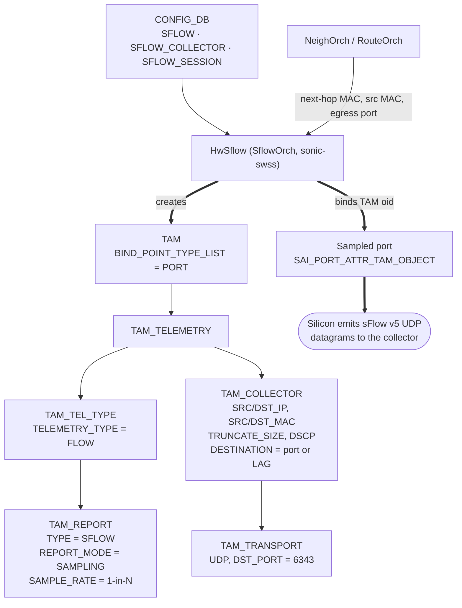

# Hardware Accelerated sFlow High Level Design

## Table of Content

- [1. Revision](#1-revision)
- [2. Scope](#2-scope)
- [3. Definitions/Abbreviations](#3-definitionsabbreviations)
- [4. Overview](#4-overview)
- [5. Requirements](#5-requirements)
- [6. Architecture Design](#6-architecture-design)
- [7. High-Level Design](#7-high-level-design)
  - [7.1 SAI object flow](#71-sai-object-flow)
  - [7.2 Collector resolution](#72-collector-resolution)
  - [7.3 Serviceability and debug](#73-serviceability-and-debug)
- [8. SAI API](#8-sai-api)
- [9. Configuration and management](#9-configuration-and-management)
  - [9.1 Manifest](#91-manifest)
  - [9.2 CLI and YANG model enhancements](#92-cli-and-yang-model-enhancements)
  - [9.3 Config DB enhancements](#93-config-db-enhancements)
- [10. Warmboot and Fastboot Design Impact](#10-warmboot-and-fastboot-design-impact)
- [11. Memory Consumption](#11-memory-consumption)
- [12. Restrictions/Limitations](#12-restrictionslimitations)
- [13. Testing Requirements/Design](#13-testing-requirementsdesign)
  - [13.1 Unit test cases](#131-unit-test-cases)
  - [13.2 System test cases](#132-system-test-cases)
- [14. Open/Action items](#14-openaction-items---if-any)

### 1. Revision

| Revision | Date | Author | Change Description |
| ----- | ----- | ----- | ----- |
| 0.1 | 2026-06-01 | darius-nexthop | Initial Proposal |

### 2. Scope

This document describes an optional sFlow datapath for SONiC: hardware
accelerated sFlow. On ASICs that support it, the switch builds sFlow v5
datagrams in silicon and sends them straight to the collector rather than
punting every sampled packet to the CPU.

Hardware acceleration applies to **flow samples only**. Counter samples, the
hsflowd agent, and every other part of the sFlow subsystem continue to operate
unchanged on the CPU path regardless of the selected mode.

### 3. Definitions/Abbreviations

| Term | Definition |
| :---- | :---- |
| sFlow | Sampled flow, sFlow v5 (sflow.org) |
| HW sFlow | Hardware accelerated sFlow: the ASIC builds and sends the datagram |
| CPU sFlow | The existing sample-and-punt datapath described in [`sflow_hld.md`](https://github.com/sonic-net/SONiC/blob/master/doc/sflow/sflow_hld.md) |
| SAI | Switch Abstraction Interface |
| TAM | Telemetry and Monitoring, the SAI namespace for telemetry objects |
| hsflowd | [InMon host-sflow](https://github.com/sflow/host-sflow) agent, SONiC's userspace sFlow agent |

### 4. Overview

This document proposes a hardware accelerated sFlow datapath for SONiC.
`SflowOrch` now programs a SAI TAM telemetry graph, rather than a samplepacket
object. Also, because a datagram built in silicon needs its encapsulation
supplied up front, it takes a dependency on `NeighOrch` and `RouteOrch` to
provide automatic next-hop resolution. The path also verifies the platform is
capable.

### 5. Requirements

Supported:

- Opt-in through a new `mode` field via CLI, reflected in `CONFIG_DB:SFLOW|global`.
- Gated on platform capability, published in `STATE_DB:SWITCH_CAPABILITY`.
- Ingress sampling on physical ports and PortChannels.
- IPv4 and IPv6 collectors.
- Per-port sample rate and header truncation size.
- Encapsulation (destination MAC, source MAC, source IP, egress port) resolved
  automatically from routing and neighbor state, refreshed on change.
- Selected mode and per-collector resolution visible in `show sflow`.

Not supported:

- Egress sampling (`tx`, `both`).
- Hardware counter samples (still egress via CPU path).

### 6. Architecture Design

This design does not change the SONiC architecture. `SflowOrch` gains a
`HwSflow` class that owns the SAI TAM objects and the per-port binding for the
hardware datapath. The existing CPU path is untouched and remains the default.
Other sFlow features, such as counter samples and MOD, will remain unimpacted on
the CPU path regardless of `mode` configuration.

### 7. High-Level Design

#### 7.1 SAI object flow

For each collector, `HwSflow` creates the TAM objects below and binds the
resulting `SAI_OBJECT_TYPE_TAM` object to every sampled port.



Creation order:

1. `create_tam_transport()`: UDP transport, destination port from
   `SFLOW_COLLECTOR` (6343 by default).
2. `create_tam_collector()`: source and destination IP and MAC, egress
   destination, truncation size and DSCP, referencing the transport.
3. `create_tam_report()`: `TYPE = SAI_TAM_REPORT_TYPE_SFLOW`,
   `REPORT_MODE = SAI_TAM_REPORT_MODE_SAMPLING` and the configured 1-in-N
   `SAMPLE_RATE`.
4. `create_tam_tel_type()`: `TAM_TELEMETRY_TYPE = SAI_TAM_TELEMETRY_TYPE_FLOW`,
   referencing the report.
5. `create_tam_telemetry()`: joins the telemetry type to the collector.
6. `create_tam()`: references the telemetry object and declares a port bind
   point.
7. `set_port_attribute(port, SAI_PORT_ATTR_TAM_OBJECT, [tam])` for every port
   whose `SFLOW_SESSION` row is enabled.

Teardown reverses that order. Two consequences:

- SONiC configures the sample rate per port but the rate lives on `TAM_REPORT`,
  so one graph is created per (collector, sample rate) pair and shared by the
  ports using it.
- For a PortChannel the graph is bound to each member port, with
  `SAI_TAM_COLLECTOR_ATTR_DESTINATION` set to the resolved port or LAG object;
  member changes rebind.

#### 7.2 Collector resolution

`HwSflow` resolves each collector address against `NeighOrch` and `RouteOrch`
for the next-hop MAC, source MAC and egress port, and observes both so a
neighbor or route change re-resolves it. The encapsulation source IP is the
address of the interface named by `SFLOW|global:agent_id`, which is also the
Agent Address carried in every emitted datagram.

Encapsulation and sample-rate changes recreate the affected TAM objects rather
than editing them in place, since in-place attribute updates are not uniformly
supported. Recreation costs a short sampling gap and restarts the datagram
sequence number, so `HwSflow` coalesces changes over a short window (about
100 ms) and reprograms once.

#### 7.3 Serviceability and debug

- `STATE_DB:SFLOW_COLLECTOR_STATE|<name>`: resolved encapsulation, last error
  and last update time.
- `show sflow` reports the selected mode and the above. Syslog records mode
  transitions at INFO, and a rejected mode selection or a resolution failure at
  WARN.

### 8. SAI API

No new SAI API is required. Every object and attribute in section 7.1 exists in
SAI today; they are defined in
[`inc/saitam.h`](https://github.com/opencomputeproject/SAI/blob/master/inc/saitam.h)
and described in
[SAI-Proposal-TAM2.0](https://github.com/opencomputeproject/SAI/blob/master/doc/TAM/SAI-Proposal-TAM2.0-v2.0.docx).

### 9. Configuration and management

#### 9.1 Manifest

Not applicable. This is a built-in feature, not an Application Extension.

#### 9.2 CLI and YANG model enhancements

One new command selects the datapath; every existing sFlow command is unchanged.

```text
config sflow mode <cpu-path|hw-accelerated>
```

`show sflow` gains the selected mode, and per collector the resolved
encapsulation. Existing fields and layout are unchanged:

```text
sFlow Global Information:
  sFlow Admin State:          up
  sFlow Sample Direction:     rx
  sFlow Polling Interval:     default
  sFlow AgentID:              Loopback0
  sFlow Sampling Mode:        hw-accelerated
  sFlow Sampling Status:      operational

  1 Collectors configured:
    Name: collector0          IP addr: 10.0.0.1       UDP port: 6343   VRF: default
      Programmed: true        Dst MAC: 0c:42:a1:5e:3b:07   Src IP: 10.1.0.32   Egress: Ethernet48
```

On a platform that cannot support the configured mode:

```text
  sFlow Sampling Mode:        hw-accelerated
  sFlow Sampling Status:      non-operational (platform not capable)
```

`sonic-sflow.yang`:

```yang
leaf mode {
    type enumeration {
        enum cpu-path;
        enum hw-accelerated;
    }
    default "cpu-path";
    description "Where sFlow datagrams are built. 'cpu-path' builds them
                 in hsflowd in userspace; 'hw-accelerated' builds them
                 in the ASIC.";
}
```

#### 9.3 Config DB enhancements

`CONFIG_DB:SFLOW` gains `mode`:

```json
"SFLOW": {
    "global": {
        "admin_state": "up",
        "agent_id": "Loopback0",
        "sample_direction": "rx",
        "mode": "hw-accelerated"
    }
}
```

`STATE_DB:SWITCH_CAPABILITY` gains one bit:

```json
"SWITCH_CAPABILITY|switch": {
    "TAM_SFLOW_CAPABLE": "true"
}
```

Two new STATE_DB tables, written by `SflowOrch`:

```text
key           = SFLOW_COLLECTOR_STATE|<collector_name>
programmed    = "true" / "false"
resolved_dst_mac, resolved_src_mac, resolved_src_ip, egress_port
last_error    = string
last_updated  = timestamp
```

```text
key          = SFLOW_STATE|global
operational  = "true" / "false"
reason       = string (empty when operational)
```

Configuration without `mode` behaves as `cpu-path`, so nothing is migrated and
an upgrade does not change an existing deployment's datapath.
`SFLOW_COLLECTOR_STATE` exists only while the hardware path is active.

### 10. Warmboot and Fastboot Design Impact

HW sFlow packet sampling should not be affected after a warm reboot.

### 11. Memory Consumption

One TAM object graph of six objects per (collector, sample rate) pair, plus
port-to-graph bookkeeping in `SflowOrch` and one STATE_DB row per collector.
Nothing is allocated while `mode` is `cpu-path`.

### 12. Restrictions/Limitations

1. An encapsulation or sample-rate change recreates the TAM objects, costing a
   brief sampling gap and a sequence-number reset, so collectors must tolerate
   resets. Bursts coalesce into one reprogram.
2. Concurrent collectors are bounded by platform TAM resources; those beyond
   the limit are flagged in `SFLOW_COLLECTOR_STATE` while the rest keep running.
3. PortChannel support binds each member port, since SAI has no LAG attribute
   for TAM objects (section 14).
4. Ports configured `sample_direction tx` or `both` are not programmed on the
   hardware path and are logged at WARN.

### 13. Testing Requirements/Design

#### 13.1 Unit test cases

| # | Test |
| :---- | :---- |
| 1 | `TAM_SFLOW_CAPABLE` is published from the SAI capability query |
| 2 | Default `mode=cpu-path` uses the CPU path and creates no TAM objects |
| 3 | `mode=hw-accelerated` on a capable platform creates the six-object graph with expected attributes and binds it to enabled ports |
| 4 | `mode=hw-accelerated` on an incapable platform: config is retained, flow sampling stops (no CPU fallback), `SFLOW_STATE|global` reports non-operational with a reason, and a WARN is logged |
| 5 | A neighbor or route change re-resolves and reprograms the collector; a burst collapses into one reprogram |
| 6 | Two ports at the same sample rate share one graph; different rates get distinct graphs |
| 7 | Bindings are removed on session delete; a mode change tears down one path before standing up the other |

#### 13.2 System test cases

`test_sflow.py` already exists in sonic-mgmt and we will modify that test-case to
also evaluate HW sFlow on supported platforms.

We will evaluate:
- End to end: with `mode=hw-accelerated`, a collector receives and decodes sFlow v5 datagrams
- IPv4/6 collectors function properly
- Nexthop-flap reprograms the encapsulation and sampling resumes
- PortChannel ingress is sampled across LAG members
- Counter samples arrive while hardware path is active
- Warmboot continues sampling on unchanged

### 14. Open/Action items - if any

- SAI has no LAG bind point or LAG destination attribute for TAM objects, so
  PortChannel support binds each member port (section 12). A SAI enhancement
  request to add one is worth raising.
