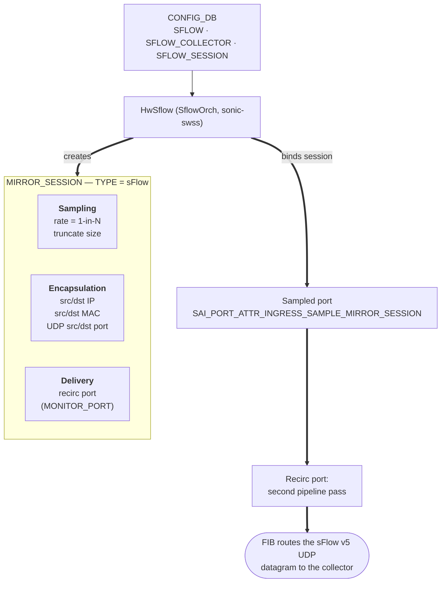

# Hardware Accelerated sFlow High Level Design

## Table of Content

- [1. Revision](#1-revision)
- [2. Scope](#2-scope)
- [3. Definitions/Abbreviations](#3-definitionsabbreviations)
- [4. Overview](#4-overview)
- [5. Requirements](#5-requirements)
- [6. Architecture Design](#6-architecture-design)
- [7. High-Level Design](#7-high-level-design)
  - [7.1 SAI object flow](#71-sai-object-flow)
  - [7.2 Datagram delivery through the recirc port](#72-datagram-delivery-through-the-recirc-port)
  - [7.3 PortChannel handling and member churn](#73-portchannel-handling-and-member-churn)
  - [7.4 Future extension: non-recirc-port platforms](#74-future-extension-non-recirc-port-platforms)
  - [7.5 Serviceability and debug](#75-serviceability-and-debug)
- [8. SAI API](#8-sai-api)
- [9. Configuration and management](#9-configuration-and-management)
  - [9.1 Manifest](#91-manifest)
  - [9.2 CLI and YANG model enhancements](#92-cli-and-yang-model-enhancements)
  - [9.3 Config DB enhancements](#93-config-db-enhancements)
  - [9.4 Generic Config Updater](#94-generic-config-updater)
- [10. Warmboot and Fastboot Design Impact](#10-warmboot-and-fastboot-design-impact)
- [11. Memory Consumption](#11-memory-consumption)
- [12. Restrictions/Limitations](#12-restrictionslimitations)
- [13. Testing Requirements/Design](#13-testing-requirementsdesign)
  - [13.1 Unit test cases](#131-unit-test-cases)
  - [13.2 System test cases](#132-system-test-cases)

### 1. Revision

| Revision | Date | Author | Change Description |
| ----- | ----- | ----- | ----- |
| 0.1 | 2026-08-17 | darius-nexthop | Initial Proposal |

### 2. Scope

This document describes an optional sFlow datapath for SONiC: hardware
accelerated sFlow. On ASICs that support it, the switch builds sFlow v5
datagrams in silicon and sends them straight to the collector rather than
punting every sampled packet to the CPU.

Hardware acceleration applies to **flow samples only**. The existing CPU path
remains responsible for interface counter samples and the other CPU-based
sFlow functions that hsflowd provides, regardless of the selected mode.

### 3. Definitions/Abbreviations

| Term | Definition |
| :---- | :---- |
| sFlow | Sampled flow, sFlow v5 (sflow.org) |
| HW sFlow | Hardware accelerated sFlow: the ASIC builds and sends the datagram |
| CPU sFlow | The existing sample-and-punt datapath described in [`sflow_hld.md`](https://github.com/sonic-net/SONiC/blob/master/doc/sflow/sflow_hld.md) |
| SAI | Switch Abstraction Interface |
| hsflowd | [InMon host-sflow](https://github.com/sflow/host-sflow) agent, SONiC's userspace sFlow agent |
| GCU | Generic Config Updater |

### 4. Overview

This document proposes an alternative flow-sampling datapath for SONiC:
hardware accelerated sFlow. When it is selected, `SflowOrch` creates a SAI
mirror session of type sFlow and binds it to sampled ports; the ASIC then
samples, aggregates, and emits sFlow v5 datagrams without CPU involvement.

### 5. Requirements

Supported:

- Opt-in through a new `mode` field via CLI, reflected in `CONFIG_DB:SFLOW|global`.
- Gated on platform capability, published in `STATE_DB:SWITCH_CAPABILITY`.
- Ingress sampling on physical ports and PortChannels.
- A single IPv4 or IPv6 collector in the default VRF, reachable through the
  ASIC FIB.
- Per-port sample rate and header truncation size.
- Selected mode and operational status visible in `show sflow`.
- All new configuration is modeled in YANG and manageable through GCU.

Required by the design:

- An L3-enabled recirc port. The hardware path emits datagrams through it;
  a platform without one cannot enable `hw-accelerated` mode.

Not supported:

- Egress sampling (`tx`, `both`).
- Hardware counter samples (still egress via CPU path).
- More than one collector while `mode` is `hw-accelerated`.
- A collector in the `mgmt` VRF while `mode` is `hw-accelerated`.

### 6. Architecture Design

`HwSflow` is a new implementation branch within `SflowOrch`: it owns the
sFlow mirror session and the per-port sample bindings for the hardware
datapath. It does not introduce a new daemon and does not replace the
existing CPU path, which remains the default. Counter samples stay on the
CPU path regardless of the `mode` configuration.

### 7. High-Level Design

#### 7.1 SAI object flow

`HwSflow` creates one mirror session of type sFlow for the configured
collector and binds it to every sampled port.



Creation order:

1. `create_mirror_session()`: `TYPE = SAI_MIRROR_SESSION_TYPE_SFLOW`, the
   recirc port as `MONITOR_PORT`, source and destination IP, source and
   destination MAC, UDP source and destination port (6343 by default, from
   `SFLOW_COLLECTOR`), the configured 1-in-N `SAMPLE_RATE` and
   `TRUNCATE_SIZE`.
2. `set_port_attribute(port, SAI_PORT_ATTR_INGRESS_SAMPLE_MIRROR_SESSION,
   [session])` for every port whose `SFLOW_SESSION` row is enabled. Passing an
   empty list unbinds the port.

SAI puts the sample rate on the session, but SONiC configures it per port:
ports with the same rate share one session; a port with a different rate needs
its own session.

Every encapsulation attribute is static:

- Destination IP: the collector address.
- Source IP: the address of the interface named by `SFLOW|global:agent_id`
  (also the Agent Address carried in every datagram).
- Source and destination MAC: both the switch MAC, since the second pipeline
  pass routes the datagram by its destination IP and rewrites the Ethernet
  header.
- UDP destination port: from `SFLOW_COLLECTOR` (6343 by default); UDP source
  port likewise.

#### 7.2 Datagram delivery through the recirc port

The design delivers datagrams exclusively through the recirc port; a
front-panel `MONITOR_PORT` is not supported. The recirc port is therefore a
platform requirement for the hardware path, the same approach the
[Everflow for VOQ chassis HLD](https://github.com/sonic-net/SONiC/blob/master/doc/voq/everflow.md)
takes for mirrored packets.

Trade-offs of delivering through the recirc port:

Positives:

- Route and neighbor changes toward the collector are followed automatically
  by the FIB, with no orchagent involvement.
- ECMP toward the collector is load-balanced by the FIB.
- Encapsulation is static and programmed once.
- Orchagent stays simple: no resolution state machine, fewer failure states.

Negatives:

- Every datagram takes a second pipeline pass, consuming internal bandwidth
  and adding latency.
- An L3-enabled recirc port must exist on the platform.

The collector must be in the default VRF, since the ASIC FIB routes the
datagram. A `vrf mgmt` collector is not programmed: it is logged at WARN and
reported non-operational (`collector_vrf_unsupported`).

#### 7.3 PortChannel handling and member churn

`SAI_PORT_ATTR_INGRESS_SAMPLE_MIRROR_SESSION` has no LAG-level equivalent, so
`HwSflow` performs member expansion: sFlow is still configured at PortChannel
granularity, and the session is bound to every member port. `HwSflow`
subscribes to LAG membership updates and rebinds on churn: a joining member
is bound to the session, a leaving member is unbound.

#### 7.4 Future extension: non-recirc-port platforms

Platforms without a recirc port could be supported by a future extension:
point `MONITOR_PORT` at the front-panel port facing the collector. `HwSflow`
would resolve the collector address against `NeighOrch` and `RouteOrch` to
obtain the egress port, next-hop MAC, and source MAC, program them into the
session, and re-resolve on every route or neighbor change with
`set_mirror_session_attribute()`. This avoids the second pipeline pass, but
imports a resolution state machine into `SflowOrch`, adds a collector-pending
state during convergence, and pins delivery to a single next hop. It is out
of scope for this design but composes with it cleanly if demand appears.

#### 7.5 Serviceability and debug

- `STATE_DB:SFLOW_STATE|global` reports whether the hardware path is
  operational: `mode=hw-accelerated`, a capable platform, and a default-VRF
  collector. Non-operational states record the reason. Delivery itself needs
  no tracked state; the FIB handles it.
- `show sflow` reports the selected mode and operational status. Syslog
  records mode transitions at INFO, and a rejected mode selection at WARN.
- An unreachable collector is not reported: datagrams drop on the second
  pass while the path reads operational. Diagnose by verifying the route and
  neighbor toward the collector and comparing recirc-port TX counters against
  routing drop counters (`show dropcounters`).

### 8. SAI API

No new SAI API is required. Every object and attribute used here exists in
SAI today: `SAI_MIRROR_SESSION_TYPE_SFLOW` and the sFlow-conditional
`UDP_SRC_PORT`/`UDP_DST_PORT` attributes are defined in
[`inc/saimirror.h`](https://github.com/opencomputeproject/SAI/blob/master/inc/saimirror.h),
and the per-port binding attribute
`SAI_PORT_ATTR_INGRESS_SAMPLE_MIRROR_SESSION` in
[`inc/saiport.h`](https://github.com/opencomputeproject/SAI/blob/master/inc/saiport.h).

Platform capability is detected with
`sai_query_attribute_enum_values_capability()` on
`SAI_MIRROR_SESSION_ATTR_TYPE`: the platform is capable when the returned
list contains `SAI_MIRROR_SESSION_TYPE_SFLOW`. The result is published to
`STATE_DB:SWITCH_CAPABILITY|switch` as `HW_SFLOW_CAPABLE`.

### 9. Configuration and management

#### 9.1 Manifest

Not applicable. This is a built-in feature, not an Application Extension.

#### 9.2 CLI and YANG model enhancements

One new command selects the datapath; every existing sFlow command is unchanged.

```text
config sflow mode <cpu-path|hw-accelerated>
```

The knob defaults to `cpu-path`: when `mode` is absent from the
configuration, sFlow behaves exactly as it does today.

Switching the mode tears down the active datapath before standing up the
other: leaving `hw-accelerated` unbinds every sampled port and removes the
mirror session, then flow sampling reverts to the CPU path. Whether sampling
actually resumes there depends on the platform's support for CPU-based sFlow;
on hardware without it, flow samples stop until `hw-accelerated` is
re-enabled.

`show sflow` gains the selected mode and its operational status. Existing
fields and layout are unchanged:

```text
sFlow Global Information:
  sFlow Admin State:          up
  sFlow Sample Direction:     rx
  sFlow Polling Interval:     default
  sFlow AgentID:              Loopback0
  sFlow Sampling Mode:        hw-accelerated
  sFlow Sampling Status:      operational

  1 Collectors configured:
    Name: collector0          IP addr: 10.0.0.1       UDP port: 6343   VRF: default
```

When the configured mode cannot operate (incapable platform, `mgmt` VRF
collector):

```text
  sFlow Sampling Mode:        hw-accelerated
  sFlow Sampling Status:      non-operational
```

The reason is recorded in syslog (WARN) and in `STATE_DB:SFLOW_STATE|global`.

`sonic-sflow.yang`:

```yang
leaf mode {
    type enumeration {
        enum cpu-path;
        enum hw-accelerated;
    }
    default "cpu-path";
    description "Where sFlow datagrams are built. 'cpu-path' builds them
                 in hsflowd in userspace; 'hw-accelerated' builds them
                 in the ASIC.";
}
```

#### 9.3 Config DB enhancements

`CONFIG_DB:SFLOW` gains `mode`:

```json
"SFLOW": {
    "global": {
        "admin_state": "up",
        "agent_id": "Loopback0",
        "sample_direction": "rx",
        "mode": "hw-accelerated"
    }
}
```

`STATE_DB:SWITCH_CAPABILITY` gains one bit, sourced from the capability query
described in the SAI API section:

```json
"SWITCH_CAPABILITY|switch": {
    "HW_SFLOW_CAPABLE": "true"
}
```

One new STATE_DB table, written by `SflowOrch`:

```text
key          = SFLOW_STATE|global
operational  = "true" / "false"
reason       = "platform_not_capable" / "collector_vrf_unsupported"
               (empty when operational)
```

Configuration without `mode` behaves as `cpu-path`, so nothing is migrated and
an upgrade does not change an existing deployment's datapath. `SFLOW_STATE`
exists only while `mode` is `hw-accelerated`.

#### 9.4 Generic Config Updater

The `mode` leaf is YANG-modeled, so GCU needs no feature-specific code: a
JSON patch that adds, changes, or removes `SFLOW|global:mode` validates
against `sonic-sflow.yang` and applies at runtime without a config reload.
Removing the leaf falls back to the default `cpu-path`.

### 10. Warmboot and Fastboot Design Impact

HW sFlow packet sampling should not be affected after a warm reboot.

### 11. Memory Consumption

One mirror session per sample rate in use, plus port-to-session bookkeeping in
`SflowOrch` and one `SFLOW_STATE` row. Nothing is allocated while `mode` is
`cpu-path`.

### 12. Restrictions/Limitations

1. The collector must be in the default VRF. sFlow accepts only the
   `default` and `mgmt` collector VRFs today, and `mgmt` is not accepted on
   the hardware path because the management port is not in the ASIC datapath:
   a `vrf mgmt` collector is not programmed while `mode=hw-accelerated`, is
   logged at WARN, and the path reports non-operational.
2. A single collector is supported on the hardware path. If more than one
   collector is configured while `mode=hw-accelerated`, only the first is
   programmed and a WARN is logged.
3. A sample-rate change may pause sampling briefly and reset the datagram
   sequence number, depending on the vendor SAI, so collectors must tolerate
   resets. Bursts coalesce into one reprogram.
4. PortChannel support binds each member port through LAG expansion,
   since `SAI_PORT_ATTR_INGRESS_SAMPLE_MIRROR_SESSION` is a
   port attribute with no LAG-level equivalent.
5. Ports configured `sample_direction tx` or `both` are not programmed on the
   hardware path and are logged at WARN.

### 13. Testing Requirements/Design

#### 13.1 Unit test cases

| # | Test |
| :---- | :---- |
| 1 | `HW_SFLOW_CAPABLE` is published from the SAI enum-capability query |
| 2 | Default `mode=cpu-path` uses the CPU path and creates no mirror session |
| 3 | `mode=hw-accelerated` on a capable platform creates the mirror session with the recirc port as `MONITOR_PORT` and binds it to enabled ports |
| 4 | `mode=hw-accelerated` on an incapable platform: config is retained, flow sampling stops (no CPU fallback), `SFLOW_STATE\|global` reports non-operational with a reason, and a WARN is logged |
| 5 | Two ports at the same sample rate share one session; different rates get distinct sessions |
| 6 | Enabling sFlow on a PortChannel binds every member; a member join binds the new member and a member leave unbinds it |
| 7 | Bindings are removed on session delete; a mode change tears down one path before standing up the other |
| 8 | A GCU patch that sets, changes, or removes `SFLOW\|global:mode` validates against YANG and applies at runtime |
| 9 | A `vrf mgmt` collector with `mode=hw-accelerated` is not programmed: `SFLOW_STATE\|global` reports non-operational with reason `collector_vrf_unsupported` and a WARN is logged |

#### 13.2 System test cases

`test_sflow.py` already exists in sonic-mgmt and we will modify that test-case to
also evaluate HW sFlow on supported platforms.

We will evaluate:
- End to end: a collector receives and decodes sFlow v5 datagrams
- IPv4/6 collectors function properly
- A route change toward the collector: delivery follows the FIB with no session reprogram
- PortChannel ingress is sampled across LAG members, including after a membership change
- Counter samples arrive while hardware path is active
- Warmboot continues sampling on unchanged
