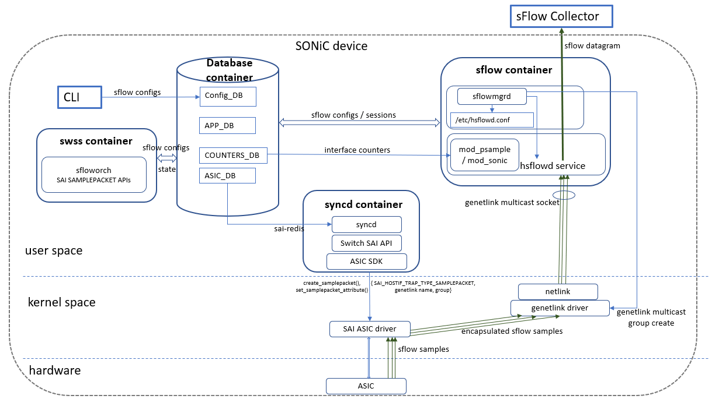
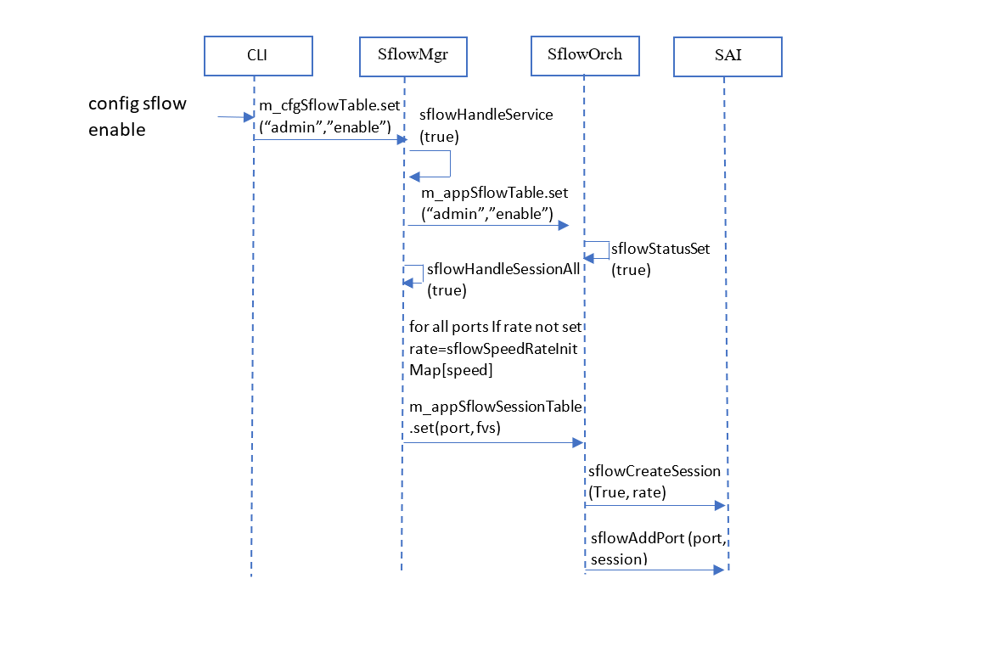
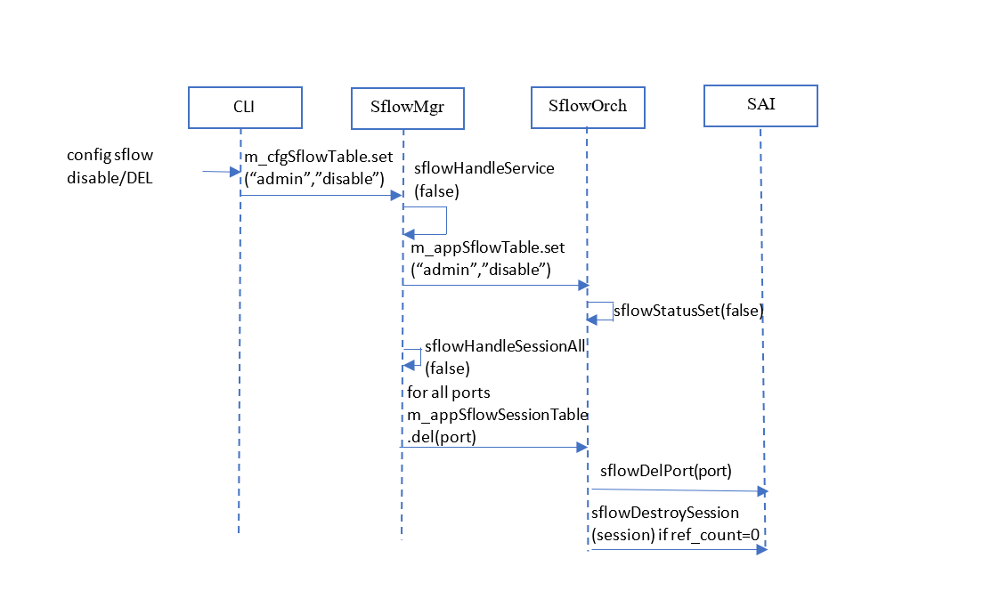
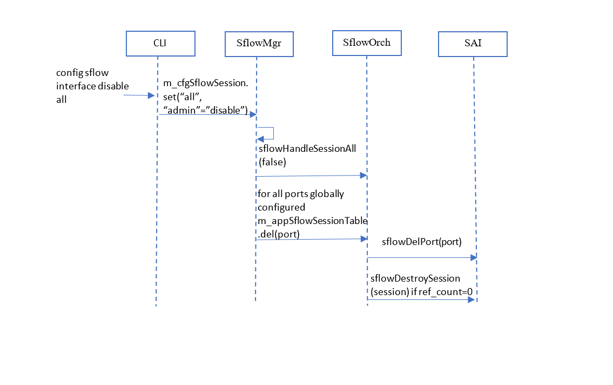
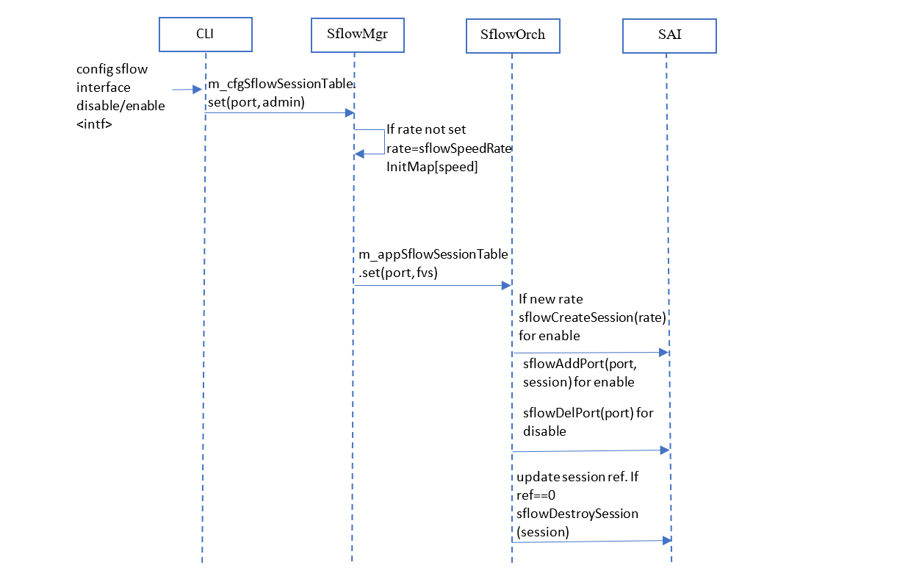
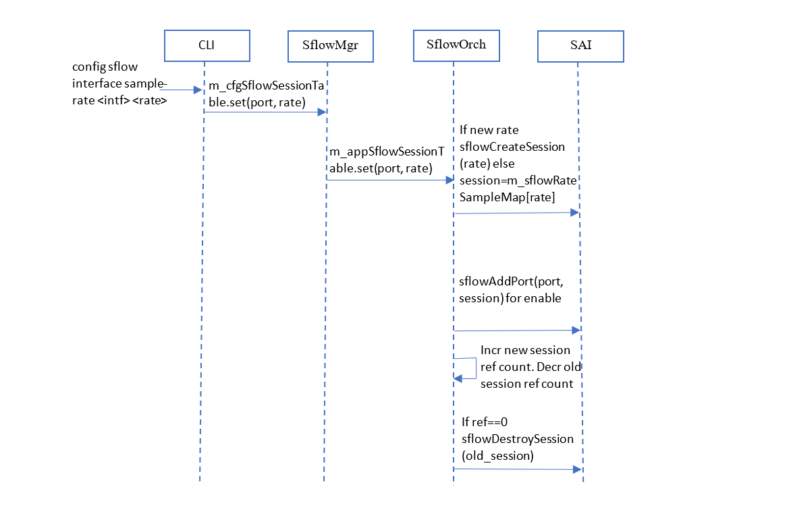

# sFlow High Level Design
### Rev 1.1
## Table of Contents

## 1. Revision
Rev | Rev	Date	| Author	| Change Description
---------|--------------|-----------|-------------------
|v0.1 |05/01/2019  |Padmanabhan Narayanan | Initial version
|v0.2 |05/20/2019  |Padmanabhan Narayanan | Updated based on internal review comments
|v0.3 |06/11/2019  |Padmanabhan Narayanan | Update CLIs, remove sflowcfgd
|v0.4 |06/17/2019  |Padmanabhan Narayanan | Add per-interface configurations, counter mode support and <br /> unit test cases. Remove genetlink CLI
|v0.5 |07/15/2019  |Padmanabhan Narayanan | Update CLI and DB schema based on comments from InMON : <br> Remove max-datagram-size from collector config <br/>Add CLI for counter polling interval <br/>Remvoe default header-size <br/>Add "all" interfaces option <br/> Separate CLI to set agent-id<br/>
|v1.0 |09/13/2019  |Sudharsan | Updating sequence diagram for various CLIs
|v1.1 |10/23/2019  |Padmanabhan Narayanan | Update SAI section to use SAI_HOSTIF_ATTR_GENETLINK_MCGRP_NAME instead of ID. Note on genetlink creation. Change admin_state values to up/down instead of enable/disable to be consistent with management framework's sonic-common.yang.
|v1.2 |03/07/2021  | Garrick He | Add VRF support and fix interface admin-status output.
|v1.3 |01/24/2023  | Rajkumar (Marvell) | Add Egress Sflow support.
## 2. Scope
This document describes the high level design of sFlow in SONiC

## 3. Definitions/Abbreviations

Definitions/Abbreviation|Description
------------------------|-----------
SAI| Switch Abstraction Interface
NOS| Network Operating System
OID| OBject Identifier

## 4. Overview

sFlow (defined in https://sflow.org/sflow_version_5.txt) is a standard-based sampling technology the meets the key requirements of network traffic monitoring on switches and routers. sFlow uses two types of sampling:

* Statistical packet-based sampling of switched or routed packet flows to provide visibility into network usage and active routes
* Time-based sampling of interface counters.

The sFlow monitoring system consists of:

 * sFlow Agents that reside in network equipment which gather network traffic and port counters and combines the flow samples and interface counters into sFlow datagrams and forwards them to the sFlow collector at regular intervals over a UDP socket. The datagrams consist of information on, but not limited to, packet header, ingress and egress interfaces, sampling parameters, and interface counters. A single sFlow datagram may contain samples from many flows.
 * sFlow collectors which receive and analyze the sFlow data.

 sFlow is an industry standard, low cost and scalable technique that enables a single analyzer to provide a network wide view.

## 5. Requirements

sFlow will be implemented in multiple phases:

### **Phase I:**

1. sFlow should be supported on physical interfaces.
2. sFlow should support 2 sFlow collectors.
3. sFlow collector IP can be either IPv4 or IPv6.
4. sFlow collector can be reachable via
	1. 	Front end port
	2. 	Management port
6. Default sFlow sample size should be set to 128 bytes.
7. Support sFlow related
	1. CLI show/config commands
	2. syslogs
8. sFlow counter support needed and config to change polling interval.

### **Phase II:**
1. Speed based sample rate setting (config sflow sample-rate speed...)
2. sFlow should be supported on portchannel interfaces.
2. Enhance CLI with session support (i.e create sessions add interfaces to specific sessions)
3. SNMP support for sFlow.

### **Phase III:**
1. sFlow extended switch support.
2. sFlow extended router support.

### Not planned to be supported:
1. sFlow backoff mechanism (Drop the packets beyond configured CPU Queue rate limit).
2. sFlow over vlan interfaces.

## 6. Module Design

### 6.1 **Overall design**
The following figure depicts the sFlow container in relation to the overall SONiC architecture:



The CLI is enhanced to provide configuring and display of sFlow parameters including sflow collectors, agent IP, sampling rate for interfaces. The CLI configurations currently only interact with the CONFIG_DB.

The newly introduced sflow container consists of:
* An instantiation of the InMon's hsflowd daemon (https://github.com/sflow/host-sflow described in https://sflow.net/documentation.php). The hsflowd is launched as a systemctl service. The host-sflow is customised to interact with SONiC subsystems by introducing a host-sflow/src/Linux/mod_sonic.c (described later)
* sflowmgrd : updates APP DB sFlow tables based on config updates

The swss container is enhanced to add the following component:
* sfloworch : which subscribes to the APP DB and acts as southbound interface to SAI for programming the SAI_SAMPLEPACKET sessions.
* copporch : Copporch gets the genetlink family name and multicast group from copp.json file, programs the SAI genetlink attributes and associates it with trap group present for sflow in copp.json

The syncd container is enhanced to support the SAI SAMPLEPACKET APIs.

The ASIC drivers need to be enhanced to:
* Associate the SAI_HOSTIF_TRAP_TYPE_SAMPLEPACKET to a specific genetlink channel and multicast group.
* Punt trapped samples to this genetlink group

The sflow container and changes to the existing components to support sflow are described in the following sections.

### 6.2 **Configuration and control flow**
The following figure shows the configuration and control flows for sFlow:


1. The user configures the sflow collector, agent, sampling related parameters (interfaces to be sampled and rate) and these configurations are added to the CONFIG DB.
2. The copporch (based on swssconfig/sample/00-copp.config.json) calls a SAI API that enables the ASIC driver to map the SAI_HOSTIF_TRAP_TYPE_SAMPLEPACKET trap to the specific genetlink channel and multicast group. The SAI driver creates the genetlink family and multicast group which will eventually be used to punt sFlow samples to hsflowd. If the SAI implementation uses the psample kernel driver (https://github.com/torvalds/linux/blob/master/net/psample/psample.c), the genetlink family "psample" and multicast group "packets" that the psample driver creates is to be used.
3. The sflowmgrd daemon watches the CONFIG DB's SFLOW_COLLECTOR table and updates the /etc/hsflowd.conf which is the configuration file for hsflowd. Based on the nature of changes, the sflowmgrd may restart the hsflowd service. The hsflowd service uses the collector, UDP port and agent IP information to open sockets to reach the sFlow collectors.
4. When hsflowd starts, the sonic module (mod_sonic) registered callback for packetBus/HSPEVENT_CONFIG_CHANGED opens a netlink socket for packet reception and registers an sflow sample handler over the netlink socket (HsflowdRx()).
5. Sampling rate changes are updated in the SFLOW table. The sflowmgrd updates sampling rate changes into SFLOW_TABLE in the App DB. The sfloworch subagent in the orchagent container processes the change to propagate as corresponding SAI SAMPLEPACKET APIs.

#### **Design Options**
Current CLI command takes "sample-rate" as input.
```
"SFLOW_SESSION": {
        "Ethernet0": {
           "admin_state": "down"
           "sample_rate": "40000"           
        },
}
```
With introduction of egress sflow, we need to change above schema to take ingress and egress sampling rate from user.

**Option 1 - Direction part of Key**

    "SFLOW_SESSION": {
        "Ethernet0|rx": {
           "admin_state": "down"
           "sample_rate": "40000"           
        },
        "Ethernet0|tx": {
           "admin_state": "down"
           "sample_rate": "40000"           
        },
        "Ethernet16|rx": {
           "admin_state": "up"
           "sample_rate": "32768"           
        }
    }

If user issues a "config sflow interface disable all", the SFLOW_SESSION will have the following:

```
    "SFLOW_SESSION": {
        "all|rx":{
            "admin_state":"down"
        },
        ...
     }
```
If user issues a "config sflow interface disable all direction both", the SFLOW_SESSION will have the following:
```
    "SFLOW_SESSION": {
        "all|rx":{
            "admin_state":"down"
        },
        "all|tx":{
            "admin_state":"down"
        },
        ...
     }
```
Pros:
1) User can manage admin_status per tx/rx.


Cons:
1) Not align to openconfig model. 
2) New sub-level cli command inside interface hierarchy. Get admin-status and sample-rate at interface and direction level.

Example:
```
localhost(config)# interface Ethernet 0
localhost(conf-if-Ethernet0)# sflow direction rx
localhost(conf-if-Ethernet0-sflow-rx)# enable
localhost(conf-if-Ethernet0-sflow-rx)# sampling-rate 10000
```

**Option 2: Introduce ingress/egress sample rate**
```
"SFLOW_SESSION": {
        "Ethernet0": {
           "admin_state": "down"
           "ingress_sample_rate": "40000"
           "egress_sample_rate": "50000"           
        }
}
```
**NOTES:**

- Single admin-state controls both rx and tx together.  
- In order for the administrator to disable sflow on a direction, administrator must set corresponding sampling-rate to 0.
- If sample-rate is not set, sflowmgrd will set default sample-rate based on port speed.

**Behavior on unsupported platforms:**
- For platforms not supporting egress Sflow, add SAI capability query and save this capability in STATE_DB. 
- CLIs will validate this capability check. For example, if user configures egress sampling-rate on un-supported ASIC, cli will throw error.
- sflowMgrd will query the capability and set egress-sampling rate to 0 in APP_DB.

Pros:
1) Align to openconfig model.

**Option 3 - Introduce sample_direction at global and interface level**
```
"SFLOW": {
        "global": {
           "admin_state": "up"
           "polling_interval": "20"
           "agent_id": "loopback0",
           "sample_direction": "rx"
         }
    }

"SFLOW_SESSION": {
        "Ethernet0": {
           "admin_state": "down"
           "sample_rate": "40000"
           "sample_direction": "both"           
        }
}

```
**NOTES:**

- sample_direction command determines the sampling direction. 
- admin-state and sample-rate will be applicable only for the configured sample_direction.
- sample_direction at interface-level has higher precedence then global configuration.
- If sample_direction is not set, default is rx for backward compatibility.

**Behavior on unsupported platforms:**
- In init, query SAI egress sample capability and save this capability in STATE_DB. 
- CLIs will validate this capability check. For example, if user configures sample_direction as "tx" or "both" on un-supported ASIC, cli will throw error.
- Similarly sflowOrch will also check the capability and set ASIC_DB only when supported.

**Preferred Option 3**: Based on community feedback, this option is selected.

Below figures explain the flow for different commands from CLI to SAI.

In sflowOrch, APIs sflowAddPort()/sflowDelPort will take "direction" as additional argument. Based on egress sampling query-capability support, egress sample will be enabled on interface.













### 6.3 **sFlow sample path**
The following figure shows the sFlow sample packet path flow:


1. The ASIC (DMAs) an sflow sample and interrupts the ASIC driver
2. The ASIC driver ascertains that this is sample buffer that has been received as a result of sflow sampling being enabled for this interface.
3. The ASIC driver checks that SAI_HOSTIF_TRAP_TYPE_SAMPLEPACKETs are associated with a specific genetlink channel name and group. the ASIC driver encapsulates the sample in a genetlink buffer and adds the following netlink attributes to the sample : IIFINDEX, OIFINDEX, ORIGSIZE, SAMPLE, SAMPLE RATE. The genetlink buffer is sent via genlmsg_multicast().
4. The hsflowd daemon's HsflowdRx() is waiting on the specific genetlink family name's multicast group id and receives the encapsulated sample. The HsflowdRx parses and extracts the encapsulated sflow attributes and injects the sample to the hsflowd packet thread using takeSample().
5. The hsflowd packet thread accumulates sufficient samples and then constructs an sFlow UDP datagram and forwards to the configured sFlow collectors.

### 6.4 **sFlow counters**

The sFlow counter polling interval is set to 20 seconds. The pollBus/HSPEVENT_UPDATE_NIO callback caches the interface SAI OIDs during the first call by querying COUNTER_DB:COUNTERS_PORT_NAME_MAP. It periodically retrieves the COUNTER_DB interface counters and fills the necessary counters in hsflowd's SFLHost_nio_counters.

### 6.5 **CLI**


#### sFlow utility interface
* sflow [options] {config | show} ...

  An sflow utility command is provided to operate with sflow configuration
  Also, the **config** and **show** commands would be extended to include the sflow option.

#### Config commands

* **sflow collector add** *{collector-name} {ipv4-address | ipv6-address}* [**--port** *{number}*]

  Where:
  * collector-name is the unique name of the sFlow collector
  * ipv4-address : IP address of the collector in dotted decimal format for IPv4
  * ipv6-address : x: x: x: x::x format for IPv6 address of the collector (where :: notation specifies successive hexadecimal fields of zeros)
  * port (OPTIONAL): specifies the UDP port of the collector (the range is from 0 to 65535. The default is 6343.)
  * vrf (OPTIONAL): specifies the VRF the collector is on. Only 'default' and 'mgmt' are supported (The default is 'default')

  Note:
  * A maximum of 2 collectors is allowed.

 * **sflow collector del** *{collector-name}*

    Delete the sflow collector with the given name

* **sflow agent-id <add | del>** *{interface-name}*

  Where:
  * agent-id: specify the interface name whose ipv4 or ipv6 address will be used as the agent-id in sFlow datagrams.

  Note:
  * This setting is global (applicable to both collectors) and optional. Only a single agent-id is allowed. If agent-id is not specified (with this CLI),  an appropriate IP that belongs to the switch is used as the agent-id based on some simple heuristics.

* **sflow <enable|disable>**

  Globally, sFlow is disabled by default. When sFlow is enabled globally, the sflow deamon is started and sampling will start on all interfaces which have sFlow enabled at the interface level (see “config sflow interface…”).
When sflow is disabled globally, sampling is stopped on all relevant interfaces and sflow daemon is stopped.

* **sflow sample-direction <rx|tx|both>**

  This command takes global sflow sample direction. If not configured, default is "rx" for backward compatibility. Based on the direction, the sFlow is enabled at all the interface level at rx or tx or both. 

* **sflow interface <enable|disable>** *<{interface-name}|**all**>*

  Enable/disable sflow at an interface level. By default, sflow is enabled on all interfaces at the interface level.  Use this command to explicitly disable sFlow for a specific interface. An interface is sampled if sflow is enabled globally as well as at the interface level.

  The “all” keyword is used as a convenience to enable/disable sflow at the interface level for all the interfaces.
  
  Note: The local configuration applied to an interface has higher precedence over the global configuration provided through the "all" keyword. If sample-direction is not set at interface level, it will configure direction "rx" irrespective of global configuraion. User needs to override the same with "config sflow interface sample-direction" command.
  
  This command enables sampling only in rx direction for backward compatibility.

* **sflow interface sample-direction <rx|tx|both>** *<{interface-name}|**all**>*

  Set sample direction to determine ingress sampling or egress sampling or both. If not configured, default is "rx". 

  Note: The local configuration applied to an interface has higher precedence over the global configuration provided through the "all" keyword.

* **sflow interface sample-rate** *{interface-name} {value}*

  Configure the sample-rate for a specific interface.

  The default sample rate for any interface is (ifSpeed / 1e6) where ifSpeed is in bits/sec.  So, the default sample rate based on interface speed is:

  * 1-in-1000 for a 1G link
  * 1-in-10,000  for a 10G link
  * 1-in-40,000  for a 40G link
  * 1-in-50,000  for a 50G link
  * 1-in-100,000  for a 100G link
  * 1-in-400,000  for a 400G link

  This default is chosen to allow the detection of a new flow of 10% link bandwidth in under 1 second. It is recommended not to change the defaults. This CLI is to be used only in case of exceptions (e.g., to set the sample-rate to the nearest power-of-2 if there are hardware restrictions in using the defaults)

  * value is the average number of packets skipped before the sample is taken. As per SAI samplepacket definition : "The sampling rate specifies random sampling probability as the ratio of packets observed to samples generated. For example a sampling rate of 256 specifies that, on average, 1 sample will be generated for every 256 packets observed."
  * Valid range 256:8388608.

  Note that on an interface, the sample-rate must be same in both tx and rx direction. 

  If sample-direction is not set at interface level, it will configure direction "rx" irrespective of global configuraion. User needs to override the same with "config sflow interface sample-direction" command.


* **sflow polling-interval** *{value}*

  The counter polling interval for all interfaces.

  * Valid range 0 or 5-300 seconds
  * Set polling-interval to 0 to disable

* **sflow sample-rate speed <100M|1G|10G|25G|40G|50G|100G>** *{value}*

  Set the sampling-rate for interfaces based on speed:
  e.g.
  ```
  config sflow sample-rate speed 100M 250
  config sflow sample-rate speed 1G 500
  config sflow sample-rate speed 40G 5000
  ```
  * This will override the default speed based setting (which is ifSpeed / 1e6 where ifSpeed is in bits/sec.)
  * If port speed changes, this setting will be used to determine the updated sample-rate for the interface.
  * The config sflow interface sample-rate {interface-name} {value} setting can still be used to override the speed based setting for specific interfaces.


#### Show commands

* **show sflow**
  * Displays the current configuration, global defaults as well as user configured values including collectors.
* **show sflow interface**
  * Displays the current running configuration of sflow interfaces.

#### Example SONiC CLI configuration ####

&#35; sflow collector add collector1 10.100.12.13

&#35; sflow collector add collector2 10.144.1.2 --port 6344 --vrf mgmt

&#35; sflow agent-id add loopback0

&#35; sflow enable

&#35; sflow sample-direction both

&#35; sflow interface disable Ethernet0

&#35; sflow interface sample-direction Ethernet0 tx

&#35; sflow interface sample-rate Ethernet16 32768

The configDB objects for the above CLI is given below:

```
{
    "SFLOW_COLLECTOR": {
        "collector1": {
            "collector_ip": "10.100.12.13",
            "collector_port": "6343"
			"collector_vrf": "default"
        },
        "collector2": {
            "collector_ip": "10.144.1.2",
            "collector_port": "6344"
			"collector_vrf": "mgmt"
        }
    },

    "SFLOW": {
        "global": {
           "admin_state": "up"
           "polling_interval": "20"
           "agent_id": "loopback0"
           "sample_direction": "both"
         }
    }
    "SFLOW_SESSION": {
        "Ethernet0": {
           "admin_state": "down"
           "sample_rate": "40000"
           "sample_direction": "tx"           
        }
}
```

&#35; show sflow

Displays the current configuration, global defaults as well as user configured values including collectors.

```
sFlow Global Information:
  sFlow Admin State:          up
  sFlow Sample Direction:     both
  sFlow Polling Interval:     0
  sFlow AgentID:              default

  2 Collectors configured:
    Name: prod                IP addr: fe80::6e82:6aff:fe1e:cd8e UDP port: 6343   VRF: mgmt
    Name: ser5                IP addr: 172.21.35.15    UDP port: 6343   VRF: default


```

&#35; show sflow interface 

Displays the current running configuration of sflow interfaces. 
```
Interface     Admin Status   Sampling rate     Sampling direction
---------     ------------   -------------     -------------------
Ethernet0     down           40000             rx
Ethernet1     up             25000             tx
Ethernet2     up             40000             both
Ethernet3     up             40000             both
Ethernet4     up             40000             rx
Ethernet5     up             40000             rx

```

### 6.6 **DB and Schema changes**

#### ConfigDB Table & Schema

A new SFLOW_COLLECTOR ConfigDB table entry would be added.
```
SFLOW_COLLECTOR|{{collector_name}}
    "collector_ip": {{ip_address}}
    "collector_port": {{ uint32 }} (OPTIONAL)
	"collector_vrf": {{string}}

; Defines schema for sFlow collector configuration attributes
key                    = SFLOW_COLLECTOR:collector_name   ; sFlow collector configuration
; field                = value
COLLECTOR_IP           = IPv4address / IPv6address        ; Ipv4 or IpV6 collector address
COLLECTOR_PORT         = 1*5DIGIT                         ; destination L4 port : a number between 0 and 65535
COLLECTOR_VRF          = "default" | "mgmt"               ; the VRF for the collector, currently only 'default' and 'mgmt' is supported

;value annotations
collector_name         = 1*16VCHAR
```

A new SFLOW table will be added which holds global configurations
```
; Defines schema for SFLOW table which holds global configurations
key                 = SFLOW
ADMIN_STATE         = "up" / "down"
POLLING_INTERVAL    = 1*3DIGIT      ; counter polling interval
AGENT_ID            = ifname        ; Interface name
SAMPLE_DIRECTION    = "rx"/"tx"/"both" ; Sampling direction
```

A new SFLOW_SESSION table would be added.
```
key SFLOW_SESSION:interface_name
ADMIN_STATE     = "up" / "down"
SAMPLE_RATE     = 1*7DIGIT      ; average number of packets skipped before the sample is taken
SAMPLE_DIRECTION    = "rx"/"tx"/"both" ; Sampling direction

```

#### AppDB & Schema

A new SFLOW_SESSION_TABLE is added to the AppDB:

```
; Defines schema for SFLOW_SESSION_TABLE which holds global configurations
key 			= SFLOW_SESSION_TABLE:interface_name
ADMIN_STATE	    = "up" / "down"
SAMPLE_RATE     = 1*7DIGIT      ; average number of packets skipped before the sample is taken
SAMPLE_DIRECTION    = "rx"/"tx"/"both" ; Sampling direction
```

A new SFLOW_SAMPLE_RATE_TABLE table which maps interface speed to the sample rate for that speed is added to the AppDB
```
; Defines schema for SFLOW_SAMPLE_RATE which maps interface speed to sampling rate
key                 = SFLOW_SAMPLE_RATE_TABLE:speed
SAMPLE_RATE         = 1*7DIGIT      ; average number of packets skipped before the sample is taken
```
Where speed         = 1*6DIGIT      ; port line speed in Mbps

#### StateDB Schema
Add "PORT_EGRESS_SAMPLE_CAPABLE" under swich capability.

```
"SWITCH_CAPABILITY|switch": {
    "value": {
      "PORT_EGRESS_SAMPLE_CAPABLE": "true"
    }
  }
```
#### **DB Migration**
Since there is a change in schema for SFLOW and SFLOW_SESSION in config DB and SFLOW_SESSION_TABLE in APP DB, we will add support to migrate the entries to new schema in db_migrator.py. Default behavior would be append the existing entries with "sample_direction" with value "rx".


Existing ConfigDB schema
```
"SFLOW": {
        "global": {
           "admin_state": "up",
           "polling_interval": "20",
           "agent_id": "loopback0"
         }
    }
"SFLOW_SESSION": {
        "Ethernet0": {
           "admin_state": "down",
           "sample_rate": "40000"           
        },
}
```
After migration
```
"SFLOW": {
        "global": {
           "admin_state": "up",
           "polling_interval": "20",
           "agent_id": "loopback0",
           "sample_direction": "rx"
         }
    }
"SFLOW_SESSION": {
        "Ethernet0": {
           "admin_state": "down",
           "sample_rate": "40000",           
           "sample_direction": "rx"           
        }
}  
```  
**APP DB Migration**

First-time when user migrates from non-supported to supported version. 

Before upgrade:
```
  "SFLOW_TABLE:global": {
      "admin_state": "up"
  },
 "SFLOW_SESSION_TABLE:Ethernet6": {
      "admin_state": "up",
      "sample_rate": "1000"
  }

```
Post upgrade: 
```
"SFLOW_TABLE:global": {
      "admin_state": "up",
      "sample_direction": "rx"
  },
 "SFLOW_SESSION_TABLE:Ethernet6": {
      "admin_state": "up",      
      "sample_rate": "1000",
      "sample_direction": "rx"
  }

```

### 6.7 **sflow container**

hsflowd (https://github.com/sflow/host-sflow) is the most popular open source implementation of the sFlow agent and provides support for DNS-SD (http://www.dns-sd.org/) and can be dockerised. hsflowd supports sFlow version 5 (https://sflow.org/sflow_version_5.txt which supersedes RFC 3176). hsflowd will run as a systemd service within the sflow docker.

CLI configurations will be saved to the ConfigDB. Once the genetlink channel has been initialised and the sFlow traps mapped to the genetlink group, the hsflowd service is started. The service startup script will derive the /etc/hsflowd.conf from the ConfigDB. Config changes will necessitate restart of hsflowd. hsflowd provides the necessary statistics for the "show" commands. CLI "config" commands will retrieve the entries in the config DB.

#### sflowmgrd

The sflowmgrd consumes sflow config DB changes and updates the SFLOW APP DB tables.

The sflowmgrd daemon listens to SFLOW_COLLECTOR to construct the hsflowd.conf and start the hsflowd service.
The mapping between the SONiC sflow CLI parameters and the host-sflow is given below:

SONIC CLI parameter| hsflowd.conf equivalent
-------------------|------------------------
collector ip-address | collector.ip
collector port| collector.UDPPort
collecttor vrf| collector.vrf
agent ip-address | agentIP
max-datagram-size | datagramBytes
sample-rate | sampling

The master list of supported host-sflow tokens are found in host-sflow/src/Linux/hsflowtokens.h

sflowmgrd also listens to SFLOW to propogate the sampling rate changes to App DB SFLOW_TABLE.

#### hsflowd service

hsflowd provides an module adaptation layer for interfacing with the NOS. In the host-sflow repo, a src/Linux/mod_sonic.c adaption layer will be provided for hsflowd APIs to SONiC that deal with hsflowd initialization, configuration changes, packet sample consumption etc. More specifically, SONiC will register and provide callbacks for the following HSP events:

hsflowd bus/events|SONiC callback actions
------------------|----------------------
  pollBus/HSPEVENT_INTF_READ | select all switchports for sampling by default
  pollBus/HSPEVENT_INTF_SPEED | set sampling rate
  pollBus/HSPEVENT_UPDATE_NIO | poll interface state from STATE_DB:PORT_TABLE and update counter stats in SFLHost_nio_counters from COUNTER DB
  pollBus/HSPEVENT_CONFIG_CHANGED)| Change sampling rate (/ port speed changed)
  packetBus/HSPEVENT_CONFIG_CHANGED | open netlink socket and register HsflowdRx()

Refer to host-sflow/src/Linux/hsflowd.h for a list of events.

### 6.8 **SWSS and syncd changes**

### sFlowOrch

An sFlowOrch is introduced in the Orchagent to handle configuration requests. The sFlowOrch essentially facilitates the creation/deletion of samplepacket sessions as well as get/set of session specific attributes. sFlowOrch sets the genetlink host interface that is to be used by the SAI driver to deliver the samples.

Also, it monitors the SFLOW_SESSIONS_TABLE and PORT state to determine sampling rate / speed changes to derive and set the sampling rate for all the interfaces. Ingress/Egress Sampling is enabled on the interfaces based on direction setting. It uses the SAI samplepacket APIs to set each ports's sampling rate.

### Rate limiting

Considering that sFlow backoff mechanism is not being implemented, users should consider rate limiting sFlow samples using the currently existing COPP mechanism (the COPP config (e.g. src/sonic-swss/swssconfig/sample/00-copp.config.json) can include appropriate settings for the samplepacket trap and initialised using swssconfig).

### 6.9 **SAI changes**

Creating sFlow sessions and setting attributes (e.g. sampling rate) is described in SAI proposal : https://github.com/opencomputeproject/SAI/tree/master/doc/Samplepacket

As per the sFlow specification, each packet sample should have certain minimal meta data for processing by the sFlow analyser. The psample infrastructure (http://man7.org/linux/man-pages/man8/tc-sample.8.html) already describes the desired metadata fields (which the SAI driver needs to add to each sample):

```
SAMPLED PACKETS METADATA FIELDS
       The metadata are delivered to userspace applications using the
       psample generic netlink channel, where each sample includes the
       following netlink attributes:

       PSAMPLE_ATTR_IIFINDEX
              The input interface index of the packet, if there is one.

       PSAMPLE_ATTR_OIFINDEX
              The output interface index of the packet. This field is not
              relevant on ingress sampling

       PSAMPLE_ATTR_ORIGSIZE
              The size of the original packet (before truncation)

       PSAMPLE_ATTR_SAMPLE_GROUP
              The psample group the packet was sent to

       PSAMPLE_ATTR_GROUP_SEQ
              A sequence number of the sampled packet. This number is
              incremented with each sampled packet of the current psample
              group

       PSAMPLE_ATTR_SAMPLE_RATE
              The rate the packet was sampled with
```

The SAI driver may provide the interface OIDs corresponding to the IIFINDEX AND OIFINDEX. The hsflowd mod_sonic HsflowdRx() may have to map these correspondingly to the netdev ifindex. Note that the default PSAMPLE_ATTR_SAMPLE_GROUP that hsflowd expects is 1 for ingress and 2 for egress.

Depending on platform capabilities, SAI driver may report additional attributes defined in https://github.com/torvalds/linux/blob/master/include/uapi/linux/psample.h. For example, PSAMPLE_ATTR_OUT_TC (egress queue), PSAMPLE_ATTR_OUT_TC_OCC (egress queue depth), and PSAMPLE_ATTR_LATENCY (transit delay) populate the sFlow Transit Delay Structures (https://sflow.org/sflow_transit.txt).

Rather than define a new framework for describing the metadata for sFlow use, SAI would re-use the framework that the psample driver (https://github.com/torvalds/linux/blob/master/net/psample/psample.c) currently uses. The psample kernel driver is based on the Generic Netlink subsystem that is described in https://wiki.linuxfoundation.org/networking/generic_netlink_howto. SAI ASIC drivers supporting sFlow may choose to use the psample.ko driver as-is or may choose to implement the generic netlink interface (that complies with the above listed metadata) using a private generic netlink family.

#### SAI Host Interface based on Generic Netlink

During SWSS init (as part of copporch), based on the swssconfig/sample/00-copp.config.json settings, sai_create_hostif_fn() is used to let the SAI driver create a special genetlink interface (type SAI_HOST_INTERFACE_TYPE_GENETLINK) and associate it with generic netlink family (SAI_HOST_INTERFACE_ATTR_NAME) and multicast group name (SAI_HOSTIF_ATTR_GENETLINK_MCGRP_NAME). Later, sai_create_hostif_table_entry_fn() is used to map SAI_HOSTIF_TRAP_TYPE_SAMPLEPACKET to the genetlink sai_host_if.

syncd/SAI implementations can use one of the following methods to create the genetlink interface:

1. As part of syncd/SAI driver init, a driver based on the standard psample driver (genetlink family ="psample" and multicast group "packets") may be installed which would create the genetlink. In this case the sai_create_hostif_fn() determines that the genetlink interface is already created and merely associates the sai_host_if to the genetlink.

2. The genetlink interface may alternatively be created during the call to sai_create_hostif_fn().


#### Changes in SAI to support the GENETLINK host interface

The changes in SAI to support the GENETLINK host interface is highlighted below:

```
 /** Generic netlink */
    SAI_HOSTIF_TYPE_GENETLINK

 /**
     * @brief Name [char[SAI_HOSTIF_NAME_SIZE]]
     *
     * The maximum number of characters for the name is SAI_HOSTIF_NAME_SIZE - 1 since
     * it needs the terminating null byte ('\0') at the end.
     *
     * In case of GENETLINK, name refers to the genl family name
     *
     * @type char
     * @flags MANDATORY_ON_CREATE | CREATE_ONLY
     * @condition SAI_HOSTIF_ATTR_TYPE == SAI_HOSTIF_TYPE_NETDEV or SAI_HOSTIF_ATTR_TYPE == SAI_HOSTIF_TYPE_GENETLINK
     */
    SAI_HOSTIF_ATTR_NAME,

    /**
     * @brief Name [char[SAI_HOSTIF_GENETLINK_MCGRP_NAME_SIZE]]
     *
     * The maximum number of characters for the name is SAI_HOSTIF_GENETLINK_MCGRP_NAME_SIZE - 1
     * Set the Generic netlink multicast group name on which the packets/buffers
     * are received on this host interface
     *
     * @type char
     * @flags MANDATORY_ON_CREATE | CREATE_ONLY
     * @condition SAI_HOSTIF_ATTR_TYPE == SAI_HOSTIF_TYPE_GENETLINK
     */
    SAI_HOSTIF_ATTR_GENETLINK_MCGRP_NAME,

 /** Receive packets via Linux generic netlink interface */
    SAI_HOSTIF_TABLE_ENTRY_CHANNEL_TYPE_GENETLINK
```
#### Creating a GENETLINK Host Interface

Below is an example code snip that shows how a GENETLINK based host inerface is created. It is assumed that the application has already installed the psample.ko and created multicast group 100.

```
// Create a Host Interface based on generic netlink
sai_object_id_t host_if_id;
sai_attribute_t sai_host_if_attr[3];
 
sai_host_if_attr[0].id=SAI_HOST_INTERFACE_ATTR_TYPE;
sai_host_if_attr[0].value=SAI_HOST_INTERFACE_TYPE_GENETLINK;
 
sai_host_if_attr[1].id= SAI_HOST_INTERFACE_ATTR_NAME;
sai_host_if_attr[1].value="psample";
 
sai_host_if_attr[2].id= SAI_HOSTIF_ATTR_GENETLINK_MCGRP_NAME;
sai_host_if_attr[2].value="packets";

sai_create_host_interface_fn(&host_if_id, 9, sai_host_if_attr);
```

### Mapping a sFlow (SAI_HOSTIF_TRAP_TYPE_SAMPLEPACKET) trap to a GENETLINK host interface multicast group id

Below is the code snip that outlines how an sFlow trap is mapped to the GENETLINK host interface created in the previous section.

```
// Configure the host table to receive traps on the generic netlink socket

sai_object_id_t host_table_entry;
sai_attribute_t sai_host_table_attr[9];
 
sai_host_table_attr[0].id=SAI_HOSTIF_TABLE_ENTRY_ATTR_TYPE;
sai_host_table_attr[0].value= SAI_HOST_INTERFACE_TABLE_ENTRY_TYPE_TRAP_ID;
 
sai_host_table_attr[1].id= SAI_HOSTIF_TABLE_ENTRY_ATTR_TRAP_ID;
sai_host_table_attr[1].value=sflow_trap_id; // Object referencing SAMPLEPACKET trap

sai_host_table_attr[2].id= SAI_HOSTIF_TABLE_ENTRY_ATTR_CHANNEL;
sai_host_table_attr[2].value=  SAI_HOSTIF_TABLE_ENTRY_CHANNEL_TYPE_GENETLINK;

sai_host_table_attr[3].id= SAI_HOSTIF_TABLE_ENTRY_ATTR_HOST_IF;
sai_host_table_attr[3].value=host_if_id; // host interface of type file descriptor for GENETLINK

sai_create_hostif_table_entry_fn(&host_table_entry, 4, sai_host_table_attr);
```

It is assumed that the trap group and the trap itself have been defined using sai_create_hostif_trap_group_fn() and sai_create_hostif_trap_fn().

#### SAI capability query for Sflow 
```
 sai_attr_capability_t capability;
// Ingress Sflow capability query
status = sai_query_attribute_capability(gSwitchId, SAI_OBJECT_TYPE_PORT, SAI_PORT_ATTR_INGRESS_SAMPLEPACKET_ENABLE, &capability);

// Egress Sflow capability query
status = sai_query_attribute_capability(gSwitchId, SAI_OBJECT_TYPE_PORT, SAI_PORT_ATTR_EGRESS_SAMPLEPACKET_ENABLE, &capability);
```
#### Mapping of Sflow to interface
```
// Ingress Sflow mapped to "ingress-sample" rate.
attr.id = SAI_PORT_ATTR_INGRESS_SAMPLEPACKET_ENABLE;
attr.value.oid = sample_id;
set_port_attribute(port_id, &attr);

// Egress Sflow mapped to direction "egress-sample" rate.
attr.id = SAI_PORT_ATTR_EGRESS_SAMPLEPACKET_ENABLE;
attr.value.oid = sample_id;
set_port_attribute(port_id, &attr);

```
## 7 **CLI Yang Model**
```
diff --git a/src/sonic-yang-models/yang-models/sonic-sflow.yang b/src/sonic-yang-models/yang-models/sonic-sflow.yang
index 62984f064..601d112fd 100644
--- a/src/sonic-yang-models/yang-models/sonic-sflow.yang
+++ b/src/sonic-yang-models/yang-models/sonic-sflow.yang
@@ -28,10 +28,28 @@ module sonic-sflow{

     description "SFLOW yang Module for SONiC OS";

+    revision 2023-03-14 {
+        description "Add direction command to support egress sflow";
+    }
+
     revision 2021-04-26 {
         description "First Revision";
     }

+    typedef sample_direction {
+        type enumeration {
+            enum rx {
+                description "rx direction";
+            }
+            enum tx {
+                description "tx direction";
+            }
+            enum both {
+                description "Both tx and rx direction";
+            }
+        }
+    }
+
     container sonic-sflow {

         container SFLOW_COLLECTOR {
@@ -89,6 +107,13 @@ module sonic-sflow{
                     }
                     description "Sets the packet sampling rate.  The rate is expressed as an integer N, where the intended sampling rate is 1/N packets.";
                 }
+
+                leaf sample_direction {
+                    type sample_direction;
+                    default "rx";
+                    description "sflow sample direction"
+                }
+
             } /* end of list SFLOW_SESSION_LIST */
         } /* end of container SFLOW_SESSION */

@@ -133,6 +158,13 @@ module sonic-sflow{
                     }
                     description "Interface name";
                 }
+
+                leaf sample_direction {
+                    type sample_direction;
+                    default "rx";
+                    description "sflow sample direction"
+                }
+
             } /* end of container global */
        } /* end of container SFLOW */

```
## 8 **Warmboot support**

sFlow packet/counter sampling should not be affected after a warm reboot. In case of a planned warm reboot, packet sampling will be stopped.

## 9 **sFlow in Virtual Switch**

On the SONiC VS, SAI calls would map to the tc_sample commands on the switchport interfaces (http://man7.org/linux/man-pages/man8/tc-sample.8.html).

## 10 **Build**

* The host-sflow package will be built with the mod_sonic callback implementations using the FEATURES="SONIC" option

## 11 **Restrictions**
* /etc/hsflowd.conf should not be modified manually. While it should be possible to change /etc/hsflowd.conf manually and restart the sflow container, it is not recommended.
* configuration updates will necessitate hsflowd service restart
* hsflowd daemon will initialize only after receiving the SYSTEM_READY|SYSTEM_STATE Status=Up from SONiC. The system ready state however depends on all the monitored daemons to be ready. Failure on any of these, will result in system state to be down. In such scenarios, sflow will wait until 180 seconds and if system ready is not up will proceed with initialization. For system ready feature please visit https://github.com/sonic-net/SONiC/blob/master/doc/system_health_monitoring/system-ready-HLD.md

## 12 **Unit Test cases**
Unit test case one-liners are given below:

| S.No | Test case synopsis                                                                                                                      |
|------|-----------------------------------------------------------------------------------------------------------------------------------------|
|  1   | Verify that the SFLOW_COLLECTOR configuration additions from CONFIG_DB are processed by hsflowd.                                        |
|  2   | Verify that the SFLOW_COLLECTOR configuration deletions from CONFIG_DB are processed by hsflowd.                                        |
|  3   | Verify that sFlowOrch creates "psample" multicast group "packets" if there is not psample driver inserted.                              |
|  4   | Verify that sFlowOrch maps SAI_HOSTIF_TRAP_TYPE_SAMPLEPACKET trap to the "psample" family and multicast group "packets".                |
|  5   | Verify that it is possible to enable and disable sflow using the SFLOW table's admin_state field in CONFIG_DB                           |
|  6   | Verify that interfaces can be enabled/disabled using additions/deletions in SFLOW_SESSION table.                           |
|  7   | Verify that it is possible to change the counter polling interval using the SFLOW table in CONFIG_DB                                    |
|  8   | Verify that it is possible to change the agent-id using the SFLOW table in CONFIG_DB
|  9   | Verify that it is possible to change the sampling rate per interface using SFLOW_SESSION interface sample_rate field for direction tx, rx and both in CONFIG_DB       |
| 10   | Verify that changes to SFLOW_SESSION CONFIG_DB entry is pushed to the corresponding table in APP_DB and to ASIC_DB by sFlowOrch         |
| 11   | Verify that collector and per-interface changes get reflected using the "show sflow" and "show sflow interface" commands                |
| 12   | Verify that packet samples are coming into hsflowd agent as per the global and per-interface configuration                              |
| 13   | Verify that the hsflowd generated UDP datagrams are generated as expected and contain all the PSAMPLE_ATTR* attributes in the meta data |
| 14   | Verify that samples are received when either 1 or 2 collectors are configured.                                                          |
| 15   | Verify the sample collection for both IPv4 and IPv6 collectors.                                                                         |
| 16   | Verify that sample collection works on all ports or on a subset of ports (using lowest possible sampling rate).                         |
| 17   | Verify that counter samples are updated every 20 seconds                                                                                |
| 18   | Verify that packet & counter samples stop for a disabled interface.                                                                     |
| 19   | Verify that sampling changes based on interface speed and per-interface and direction sampling rate change. Validate for sample-direction rx,txand both. |
| 20   | Verify that if sFlow is not enabled in the build, the sflow docker is not started                                                       |
| 21   | Verify that sFlow docker can be stopped and restarted and check that packet and counter sampling restarts.                              |
| 22   | Verify that with config saved in the config_db.json, restarting the unit should result in sFlow coming up with saved configuration.     |
| 23   | Verify sFlow functionality with valid startup configuration and after a normal reboot, fast-boot and warm-boot.                         |
| 24   | Verify that the sFlow hsflowd logs are emitted to the syslog file for various severities.                                               |
| 25   | Verify that the swss restart works without issues when sflow is enabled and continues to sample as configured. |
| 26   | Verify that collector functions properly on 'default' VRF and can send counter and flow samples |
| 27   | Verify that collector functions properly on 'mgmt' VRF and can send counter and flow samples |
| 28   | Verify that egress sampling is applied based on query-capability. |
|29   | Verify CONFIG DB migration changes for SFLOW SESSION table for old to new schema
|30    | Verify APP DB migration changes for SFLOW SESSION table for old to new schema

## 13 **System Testcase**
New ptf test cases will be added for this feature.

## 14 **Action items**
* Determine if it is possible to change configuration without restarting hsflowd
* Check host-sflow licensing options
* Change hsflowd to version 2.0.45-1 for accpeting egress samples.
