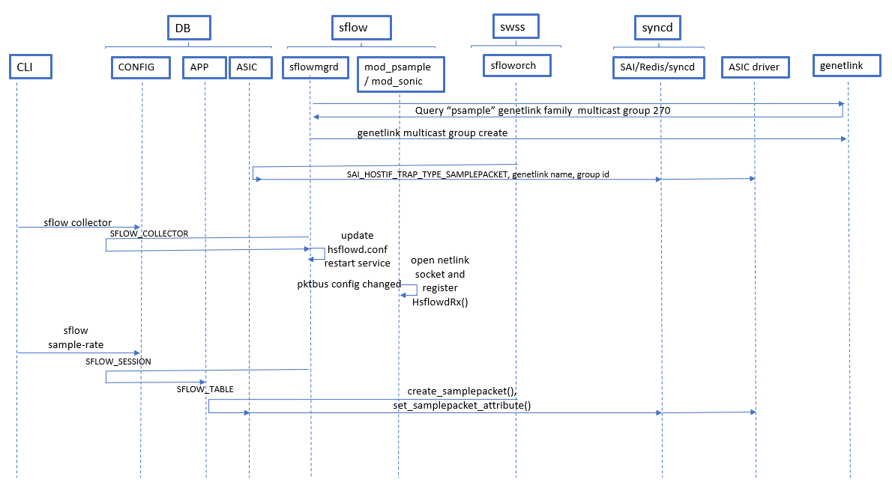

# sFlow High Level Design
### Rev 0.1
## Table of Contents

## 1. Revision 
Rev | Rev	Date	| Author	| Change Description
---------|--------------|-----------|-------------------
v0.1	 |05/01/2019	|Padmanabhan Narayanan	| Initial version

## 2. Scope
This document describes the high level design of sFlow in SONiC

## 3. Definitions/Abbreviations

Definitions/Abbreviation|Description
------------------------|-----------
SAI| Switch Abstraction Interface
NOS| Network Operating System
OID| OBject Identifier

## 4. Overview

sFlow (defined in https://sflow.org/sflow_version_5.txt) is a standard-based sampling technology the meets the key requirements of network traffic monitoring on switches and routers. sFlow uses two types of sampling:

* Statistical packet-based sampling of switched or routed packet flows to provide visibility into network usage and active routes
* Time-based sampling of interface counters.

The sFlow monitoring system consists of:

 * sFlow Agents that reside in network equipment which gather network traffic and port counters and combines the flow samples and interface counters into sFlow datagrams and forwards them to the sFlow collector at regular intervals over a UDP socket. The datagrams consist of information on, but not limited to, packet header, ingress and egress interfaces, sampling parameters, and interface counters. A single sFlow datagram may contain samples from many flows.
 * sFlow collectors which receive and analyze the sFlow data.

 sFlow is an industry standard, low cost and scalable technique that enables a single analyzer to provide a network wide view.

## 5. Requirements

sFlow will be implemented in multiple phases:

### **Phase I:**

1. sFlow should be supported on physical interfaces.
2. sFlow should support 2 sFlow collectors.
3. sFlow collector IP can be either IPv4 or IPv6.
4. sFlow collector can be reachable via
	1. 	Front end port
	2. 	Management port
5. Set the default sampling rate to 0, configuring non-default value should enable sFlow and start sampling.
6. Default sFlow sample size should be set to 128 bytes.
7. Support sFlow related
	1. CLI show/config commands
	2. syslogs


### **Phase II:**
1. sFlow should be supported on portchannel interfaces.
2. SNMP support for sFlow.
3. sFlow counter support needed.
4. Polling interval for sFlow counter.

### **Phase III:**
1. sFlow extended switch support.
2. sFlow extended router support.

### Not planned to be supported:
1. sFlow enable/disable option interface level as well as global level.
2. sFlow configuration at interface level.
2. Egress sampling support.
3. sFlow backoff mechanism (Drop the packets beyond configured CPU Queue rate limit).
4. sFlow over vlan interfaces.

## 6. Module Design

### 6.1 **Overall design**
The following figure depicts the sFlow container in relation to the overall SONiC architecture:


The CLI is enhanced to provide configuring and display of sFlow parameters including sflow collectors, agent IP, sampling rate for interfaces. The CLI configurations currently only interact with the CONFIG_DB.

The newly introduced sflow container consists of:
* An instantiation of the Inmon's hsflowd daemon (https://github.com/sflow/host-sflow described in https://sflow.net/documentation.php). The hsflowd is launched as a systemctl service. The host-sflow is customised to interact with SONiC subsystems by introducing a host-sflow/src/Linux/mod_sonic.c (descripted later)
* sflowcfgd : which is a python script that consumes sflow configurations from the CONFIG DB and updates the hsflowd.conf

The swss container is enhanced to add the following components:
* sflowmgrd : which subscribes to STATE DB to register and configure the genetlink family and multicast group for sflow use
* sfloworch : which subscribes to the APP DB and acts as southbound interface to SAI for programming the SAI_SAMPLEPACKET sessions, genetlink channel, multicast group and sampling parameters.

The syncd container is enhanced to support the SAI SAMPLEPACKET APIs.

The ASIC drivers need to be enhanced to:
* Associate the SAI_HOSTIF_TRAP_TYPE_SAMPLEPACKET to a specific genetlink channel and group.
* Punt trapped samples to this genetlink group

The sflow container and changes to the existing components to support sflow are described in the following sections.

### 6.2 **Configuration and control flow**
The following figure shows the configuration and control flows for sFlow:



1. The user configures the sflow collector, agent, sampling related parameters (rate, genetlink group) and these configurations are added to the CONFIG DB.
2. The sflowcfgd configuration daemon watches the CONFIG DB and is responsible for updating the /etc/sonic/hsflowd.conf which is the configuration file for hsflowd. Based on the nature of changes, the sflowcfgd may restart the hsflowd service. The hsflowd service uses the collector, UDP port and agent IP information to open sockets to reach the sFlow collectors.
3. The hsflowd's sonic module (mod_sonic) registered callback is invoked for any genetlink group creation/changes (pollBus/HSPEVENT_CONFIG_CHANGED) and the callback updates the STATE DB's SFLOW_STATE table. The sflowmgrd watches changes to the genetlink group and creates a netlink family and multicast group for SONiC sflow use. Once the genetlink group is created, the sflowmgrd initializes the TRAP_NETLINK table in the APP Db that contains the trap type (SAI_HOSTIF_TRAP_TYPE_SAMPLEPACKET) and the genetlink channel and group.
4. The sfloworch processes the TRAP_NETLINK changes and calls a SAI API that enables the ASIC driver to punt the traps to the specific genetlink channel and group.
5. Changes to the sampling rate invoke the sonic module (mod_sonic) registered callback for packetBus/HSPEVENT_CONFIG_CHANGED which opens a netlink socket for packet reception and registers an sflow sample handler over the netlink socket (HsflowdRx()).
5. If the speed or sampling rate changes, the sonic module callback for pollBus/HSPEVENT_INTF_SPEED updates the SFLOW_INTERFACE APP DB table. The sfloworch subagent in the orchagent container processes the change to propagate as corresponding SAI SAMPLEPACKET APIs.


### 6.3 **sFlow sample path**
The following figure shows the sFlow sample packet path flow:


1. The ASIC (DMAs) an sflow sample and interrupts the ASIC driver
2. The ASIC driver ascertains that this is sample buffer that has been received as a result of sflow sampling being enabled for this interface.
3. The ASIC driver checks that SAI_HOSTIF_TRAP_TYPE_SAMPLEPACKETs are associated with a specific genetlink channel name and group. the ASIC driver encapsulates the sample in a genetlink buffer and adds the following netlink attributes to the sample : IIFINDEX, OIFINDEX, ORIGSIZE, SAMPLE, SAMPLE RATE. The genetlink buffer is sent via genlmsg_multicast().
4. The hsflowd daemon's HsflowdRx() is waiting on the specific genetlink family name's multicast group id and receives the encapsulated sample. The HsflowdRx parses and extracts the encapsulated sflow attributes and injects the sample to the hsflowd packet thread using takeSample().
5. The hsflowd packet thread accumulates sufficient samples and then constructs an sFlow UDP datagram and forwards to the configured sFlow collectors.

### 6.4 **CLI**

#### sFlow utility interface
* sflow [options] {config | show} ...
  
  An sflow utility command is provided to operate with sflow configuration
  Also, the **config** and **show** commands would be extended to include the sflow option.

#### Config commands
* sflow collector <name> <ip-address | ipv6-address> [port <number>]

  Where:
  * name is the unique name of the sFlow collector
  * ip-address : IP address of the collector in dotted decimal format for IPv4
  * ipv6-address :  x:x:x:x::x format for IPv6 ( where :: notation specifies successive hexadecimal fields of zeros)
  * port : specifies the UDP port of the collector (the range is from 0 to 65535. The default is 6343.)
  
 * no sflow collector <name>

    Delete the sflow collector with the given name
   
* sflow agent <ip-address | ipv6-address>

  Where:
  * ip-address : IP address of the agent in dotted decimal format for IPv4
  * ipv6-address :  x:x:x:x::x format for IPv6 ( where :: notation specifies successive hexadecimal fields of zeros)


* sflow sample-rate value
  
  Where
  * value is a percentage of the bandwidth of the port (ifSpeed expressed in bits per second) that should be sampled.
    Default sampling rate =  ifSpeed / 1000000, where ifSpeed is expressed in bits per second and that gives:
    * sampling.1G = 1 in 1,000
    * sampling.10G = 1 in 10,000
    * sampling.40G = 1 in 40,000
    * sampling.100G = 1 in 100,000
	
	The value of 0 is used to disable sFlow.

* sflow [max-datagram-size <size>]

  Where:
  * max-datagram-size : in bytes (from 400 to 1500 : defaults to 1400)

#### Show commands
* show sflow 
  * Displays the current configuration. Includes global defaults as well as user configured values including collectors.
* show runningconfiguration sflow
  * Displays the current running configuration of sflow

### 6.5 **DB and Schema changes**

#### ConfigDB Table & Schema

A new SFLOW_COLLECTOR ConfigDB table entry would be added. 
```
SFLOW_COLLECTOR|{{collector_name}}
    "collector_ip": {{ip_address}}
    "collector_port": {{ uint32 }} (OPTIONAL)
    "datagram_size": {{ uint32 }} (OPTIONAL)

; Defines schema for sFlow collector configuration attributes
key                                   = SFLOW_COLLECTOR:collector_name   ; sFlow collector configuration
; field                               = value
collector_ip                          = IPv4address / IPv6address        ; Ipv4 or IpV6 collector address
agent_ip                              = IPv4address / IPv6address        ; Ipv4 or IpV6 agent address
collector_port                        = 1*5DIGIT                         ; destination L4 port : a number between 0 and 65535
datagram_size                         = 1*4DIGIT                         ; MTU of the sflow datagram

;value annotations
collector_name                        = 1*16VCHAR
```
A new SFLOW_AGENT ConfigDB table entry would be added. 
```
SFLOW_AGENT
    "agent_ip": {{ip_address}}

; Defines schema for sFlow collector configuration attributes
; field                               = value
agent_ip                              = IPv4address / IPv6address        ; Ipv4 or IpV6 agent address
```
#### AppDB & Schema

A new TRAP_NETLINK table entry would be added:

```
; Defines schema for TRAP_NETLINK table which maps trap types that need to be punted to a genetlink channel
key                                   = TRAP_NETLINK:trap_id             ; TRAP ID
; field                               = value
genetlink_name                        = 1*16VCHAR                        ; name of the genetlink family
genetlink_group                       = 1*4DIGIT                         ; genetlink multicast group id
```

A new field is added to the AppDB's PORT_TABLE:
```
;Defines layer 2 ports
;In SONiC, Data is loaded from configuration file by portsyncd
key                 = PORT_TABLE:ifname    ; ifname must be unique across PORT,INTF,VLAN,LAG TABLES
...
sampling_rate       = 1*3DIGIT      ; sflow sampling rate as a percentage of bandwidth
...
```
#### StateDB & Schema

The following SFLOW_STATE table is added to the StateDB:
```
; Defines schema for SFLOW_STATE table
; field                               = value
genetlink_name                        = 1*16VCHAR                        ; name of the genetlink family
genetlink_group                       = 1*4DIGIT                         ; genetlink multicast group id
genetlink_state                       = "" / "initialized"               ; initialized : genetlink group created successfully
hsflowd_state                         = "" / "started" / "stopped" / "listening" ; started : hsflowd daemon has been started
                                                                                 ; stopped : hsflowd daemon has been stopped
                                                                                 ; listening : hsflowd is listening for samples
```

### 6.6 **sflow container**

hsflowd (https://github.com/sflow/host-sflow) is the most popular open source implementation of the sFlow agent and provides support for DNS-SD (http://www.dns-sd.org/) and can be dockerised. hsflowd supports sFlow version 5 (https://sflow.org/sflow_version_5.txt which supersedes RFC 3176). hsflowd will run as a systemd service within the sflow docker.

CLI configurations will be saved to the ConfigDB. When hsflowd service is started, the service startup script will derive the /etc/sonic/hsflowd.conf from the ConfigDB. Config changes will necessitate restart of hsflowd. hsflowd provides the necessary statistics for the "show" commands. CLI "config" commands will retrieve the entries in the config DB.

#### sflowcfgd

The mapping between the SONiC sflow CLI parameters and the host-sflow is given below:

SONIC CLI parameter| hsflowd.conf equivalent
-------------------|------------------------
collector ip-address | collector.ip
collector port| collector.UDPPort
agent ip-address | agentIP
max-datagram-size | datagramBytes
sample-rate | sampling

The master list of supported host-sflow tokens are found in host-sflow/src/Linux/hsflowtokens.h

Example SONiC CLI configuration:

&#35; sflow collector sflow-a 10.100.12.13 

&#35; sflow collector sflow-b 10.144.1.2

&#35; sflow agent 10.0.0.10

&#35; sflow sample-rate 1

&#35; sflow max-datagramsize 1500

```
sflow {
  agentIP = 10.0.0.10
  sampling = 40000
  collector { ip = 10.100.12.13 }
  collector { ip = 10.144.1.2 UDPPort=6344 }
  datagramBytes = 1500
}
```
#### hsflowd service

hsflowd provides an module adaptation layer for interfacing with the NOS. In the host-sflow repo, a src/Linux/mod_sonic.c adaption layer will be provided for hsflowd APIs to SONiC that deal with hsflowd initialization, configuration changes, packet sample consumption etc. More specifically, SONiC will register and provide callbacks for the following HSP events:

hsflowd bus/events|SONiC callback actions
------------------|----------------------
  pollBus/HSPEVENT_INTF_READ | select all switchports for sampling by default
  pollBus/HSPEVENT_INTF_SPEED | set sampling rate
  pollBus/HSPEVENT_UPDATE_NIO | poll interface state from STATE_DB:PORT_TABLE
  pollBus/HSPEVENT_CONFIG_CHANGED)| 1. Update SFLOW_STATE table with genetlink information <br> 2. Change sampling rate (if rate/ port speed changed)
  packetBus/HSPEVENT_CONFIG_CHANGED | open netlink socket and register HsflowdRx()
  
Refer to host-sflow/src/Linux/hsflowd.h for a list of events.

### 6.7 **SWSS and syncd changes**

### sflowmgrd

The sflowmgrd reads the SFLOW_STATE table to create program genetlink groups that will be used by the SAI driver to lift packets to the hsflowd. Once the genetlink group is created, updates the TRAP_NETLINK table for sFlowOrch to process. A multicast group is typically created which enables multiple applications (e.g. even a local netlink sniffer tools) to additionally inspect the samples that are lifted to hsflowd.

### sFlowOrch

An sFlowOrch is introduced in the Orchagent to handle configuration requests. The sFlowOrch essentially facilitates the creation/deletion of samplepacket sessions as well as get/set of session specific attributes.

### 6.8 **SAI changes**

Creating sFlow sessions and setting attributes (e.g. sampling rate) is described in SAI proposal : https://github.com/opencomputeproject/SAI/tree/master/doc/Samplepacket 

The set_hostif_trap_group_attribute() can be used to assign the netlink multicast group name and id to a specific trap.

As per the sFlow specification, each packet sample should have certain minimal meta data for processing by the sFlow analyser. The psample infrastructure (http://man7.org/linux/man-pages/man8/tc-sample.8.html) already describes the desired metadata fields (which the SAI driver needs to add to each sample):

```
SAMPLED PACKETS METADATA FIELDS
       The metadata are delivered to userspace applications using the
       psample generic netlink channel, where each sample includes the
       following netlink attributes:

       PSAMPLE_ATTR_IIFINDEX
              The input interface index of the packet, if there is one.

       PSAMPLE_ATTR_OIFINDEX
              The output interface index of the packet. This field is not
              relevant on ingress sampling

       PSAMPLE_ATTR_ORIGSIZE
              The size of the original packet (before truncation)

       PSAMPLE_ATTR_SAMPLE_GROUP
              The psample group the packet was sent to

       PSAMPLE_ATTR_GROUP_SEQ
              A sequence number of the sampled packet. This number is
              incremented with each sampled packet of the current psample
              group

       PSAMPLE_ATTR_SAMPLE_RATE
              The rate the packet was sampled with
```

The SAI driver may provide the interface OIDs corresponding to the IIFINDEX AND OIFINDEX. The hsflowd mod_sonic HsflowdRx() may have to map these correspondingly to the netdev ifindex.

## 7 **Build**

* The host-sflow package will be built with the mod_sonic callback implementations using the FEATURES="SONIC" option

## 8 **Restrictions**
* /etc/sonic/hsflowd.conf should not be modified manually. While it should be possible to change /etc/sonic/hsflowd.conf manually and restart the sflow container, it is not recommended.
* Management VRF support: TBD
* configuration updates will necessitate hsflowd service restart

## 9 **Action items**
