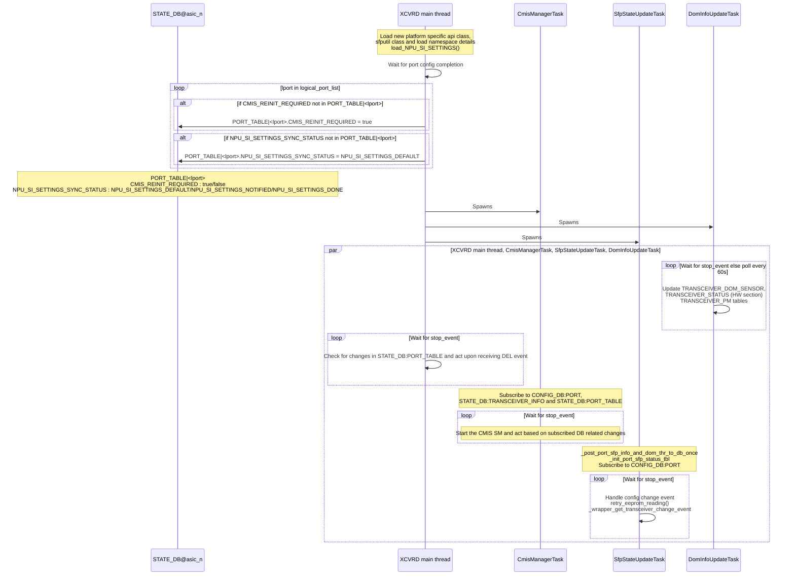
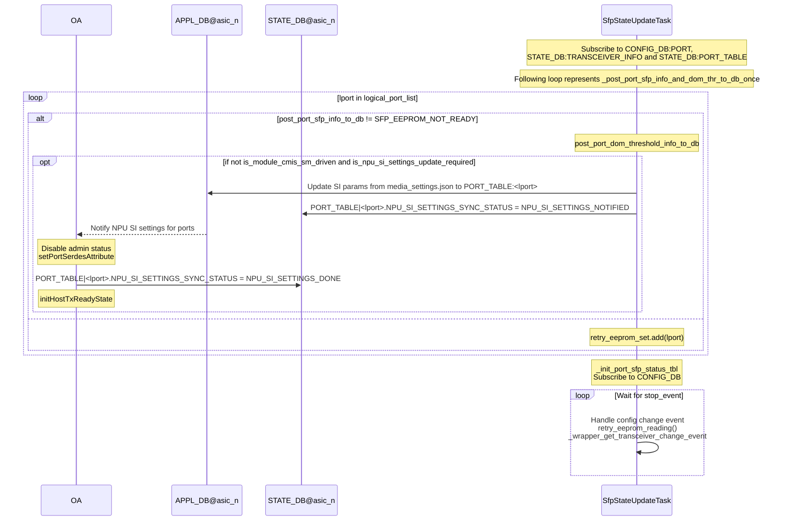
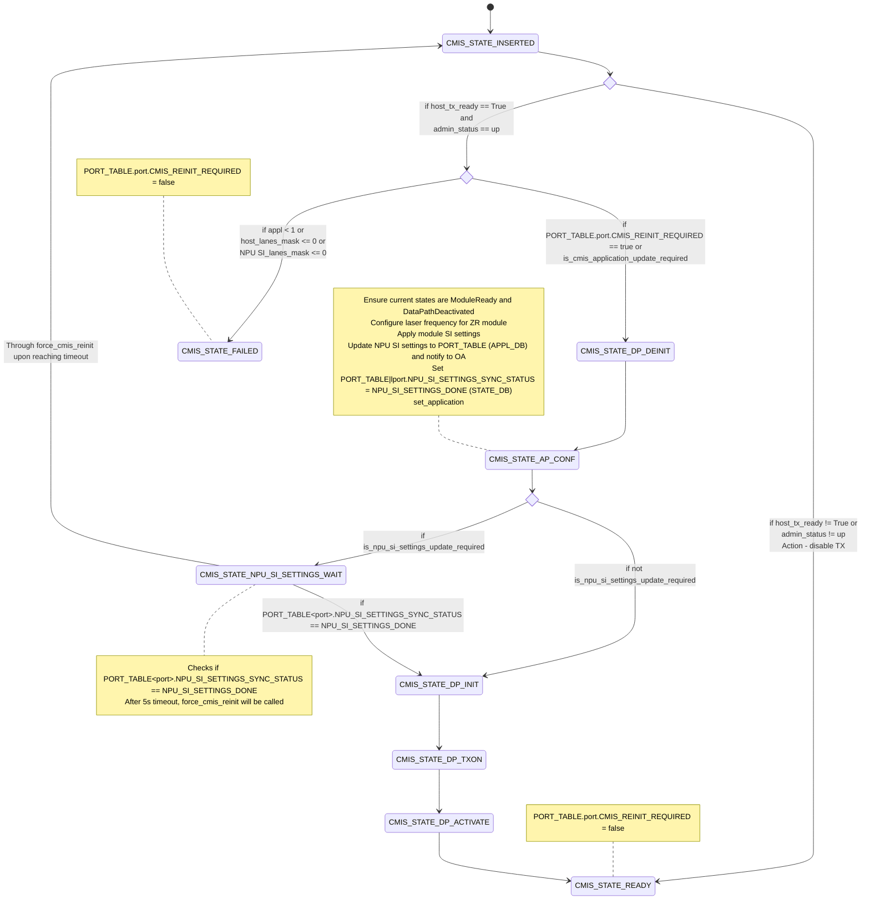
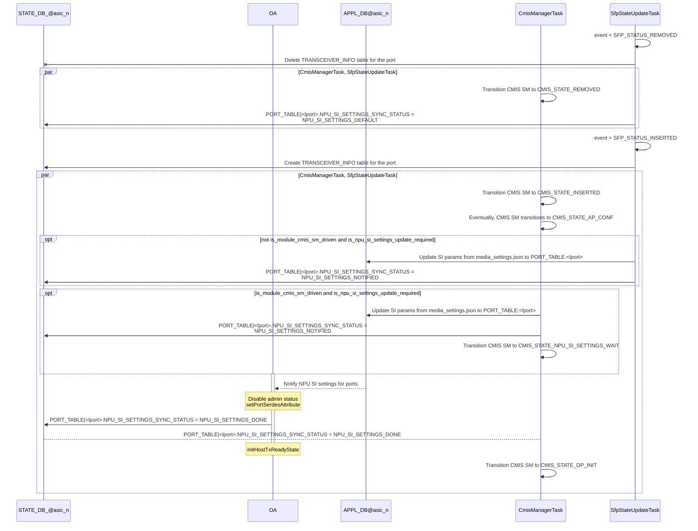
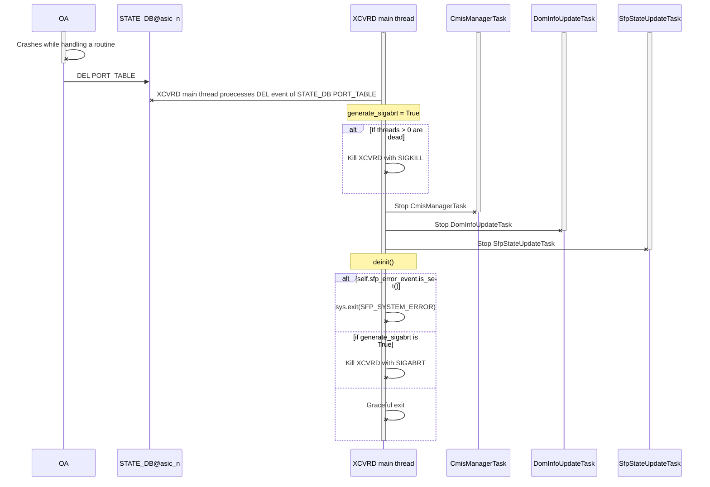

# Feature Name
Deterministic Approach for Interface Link bring-up sequence

# High Level Design Document
#### Rev 0.7

# Table of Contents
  * [List of Tables](#list-of-tables)
  * [Revision](#revision)
  * [About This Manual](#about-this-manual)
  * [Abbreviation](#abbreviation)
  * [References](#references)
  * [Problem Definition](#problem-definition)
  * [Background](#background)
  * [Objective](#objective)
  * [Plan](#plan)
  * [Pre-requisite](#pre-requisite)
  * [Breakout handling](#breakout-handling)
  * [Proposed Work-Flows](#proposed-work-flows)
  * [Port re-initialization during syncd/swss/orchagent crash](#port-re-initialization-during-syncdswssorchagent-crash)

# List of Tables
  * [Table 1: Definitions](#table-1-definitions)
  * [Table 2: References](#table-2-references)

# Revision
| Rev |     Date    |       Author                       | Change Description                  |
|:---:|:-----------:|:----------------------------------:|-------------------------------------|
| 0.1 | 08/16/2021  | Shyam Kumar                        | Initial version                       
| 0.2 | 12/13/2021  | Shyam Kumar,  Jaganathan Anbalagan | Added uses-cases, workflows  
| 0.3 | 01/19/2022  | Shyam Kumar,  Jaganathan Anbalagan | Addressed review-comments    
| 0.4 | 01/26/2022  | Shyam Kumar,  Jaganathan Anbalagan | Addressed further review-comments 
| 0.5 | 01/28/2022  | Shyam Kumar,  Jaganathan Anbalagan | Addressed further review-comments
| 0.6 | 02/02/2022  | Shyam Kumar                        | Added feature-enablement workflow 
| 0.7 | 02/02/2022  | Jaganathan Anbalagan               | Added Breakout Handling 
| 0.8 | 02/16/2022  | Shyam Kumar                        | Updated feature-enablement workflow
| 0.9 | 04/05/2022  | Shyam Kumar                        | Addressed review comments           |
| 1.0 | 10/20/2023  | Mihir Patel                        | Added Port re-initialization during syncd/swss/orchagent crash section           |

# About this Manual
This is a high-level design document describing the need to have determinstic approach for
Interface link bring-up sequence and workflows for use-cases around it 

# Abbreviation

# Table 1: Definitions
| **Term**       | **Definition**                                   |
| -------------- | ------------------------------------------------ |
| pmon           | Platform Monitoring Service                      |
| xcvr           | Transceiver                                      |
| xcvrd          | Transceiver Daemon                               |
| CMIS           | Common Management Interface Specification        |
| gbsyncd        | Gearbox (External PHY) docker container          |
| DPInit         | Data-Path Initialization                         |
| QSFP-DD        | QSFP-Double Density (i.e. 400G) optical module   |
| OIR            | Online Insertion and Removal                     |
| SM             | State Machine                                    |

# References

# Table 2 References

| **Document**                                            | **Location**  |
|---------------------------------------------------------|---------------|
| CMIS v4 | [QSFP-DD-CMIS-rev4p0.pdf](http://www.qsfp-dd.com/wp-content/uploads/2019/05/QSFP-DD-CMIS-rev4p0.pdf) | 
| CMIS v5 | [CMIS5p0.pdf](http://www.qsfp-dd.com/wp-content/uploads/2021/05/CMIS5p0.pdf) |

# Problem Definition

1.	Presently in SONiC, there is no synchronization between Datapath Init operation of CMIS complaint optical module and enabling ASIC (NPU/PHY) Tx which may cause link instability during administrative interface enable “config interface startup Ethernet” configuration and bootup scenarios. 
      
    For CMIS-compliant active (optical) modules, the Host (NPU/PHY) needs to provide a valid high-speed Tx input signal at the required signaling rate and encoding type prior to causing a DPSM to exit from DPDeactivated state and to move to DP Init transient state.
      
    Fundamentally it means - have a deterministic approach to bring-up the interface.
      
    Also, this problem is mentioned ‘as outside-the-scope’ of ‘CMIS Application Initialization’ high-level design document
      **(https://github.com/ds952811/SONiC/blob/0e4516d7bf707a36127438c7f2fa9cc2b504298e/doc/sfp-cmis/cmis-init.md#outside-the-scope)**

2.  During administrative interface disable “config interface shutdown Ethernet”, only the ASIC(NPU) Tx is disabled and not the opticcal module Tx/laser. 
      This will lead to power wastage and un-necessary fan power consumption to keep the module temperature in operating range 

# Background

  Per the ‘CMIS spec’,  ‘validation, diagnostics’ done by HW team' and 'agreement with vendors', 
  need to follow following bring-up seq to enable port/interface with CMIS compliant optical modules in LC/chassis:

    a) Enable port on NPU (bring-up port, serdes on the NPU ; enable signals) : syncd
    b) Enable port on PHY (bring-up port, serdes on the PHY ; enable signals) : gbsyncd
       - Wait for signal to stabilize on PHY   
    c) Enable optical module (data path initializatio, turn laser on/ enable tx) : xcvrd

  In boards not having PHY, #b) not needed but #a) and #c) sequence to be followed.
  
  ## Clause from CMIS4.0 spec
  
     Excerpt from CMIS4.0 spec providing detailed reasoning for the above-mentioned bring-up sequence
     
  

  ## Clause from CMIS5.0 spec
  
     Excerpt from CMIS5.0 spec providing detailed reasoning for the above-mentioned bring-up sequence
     
  
     

# Objective

Have a determistic approach for Interface link bring-up sequence for all interfaces types i.e. below sequence to be followed:
  1. Initialize and enable NPU Tx and Rx path
  2. For system with 'External' PHY: Initialize and enable PHY Tx and Rx on both line and host sides; ensure host side link is up 
  3. Then only perform optics data path initialization/activation/Tx enable (for CMIS complaint optical modules) and Tx enable (for SFF complaint optical modules)

# Plan

Plan is to follow this high-level work-flow sequence to accomplish the Objective:
- xcvrd to subscribe to a new field “host_tx_ready” in port table state-DB
- Orchagent will set the “host_tx_ready” to true/false based on the SET_ADMIN_STATE attribute return status from syncd/gbsyncd. (As part of SET_ADMIN_STATE attribute enable, the NPU Tx is enabled)
- xcvrd process the “host_tx_ready” value change event and do optics datapath init / de-init using CMIS API
- Per the discussion and agreement in sonic-chassis workgroup and OCP community, plan is to follow this proposal for all the known interfaces types- 400G/100G/40G/25G/10G. Reason being: 
  - CMIS complaint optical modules:-
      All CMIS complaint optical modules will follow this approach as recommended in the CMIS spec.
  - SFF complaint optical modules:- 
    - deterministic approach to bring the interface will eliminate any link stability issue which will be difficult to chase in the production network
      e.g. If there is a PHY device in between, and this 'deterministic approach' is not followed, PHY may adapt to a bad signal or interface flaps may occur when the optics tx/rx  enabled during PHY initialization. 
    - there is a possibility of interface link flaps with non-quiescent optical modules <QSFP+/SFP28/SFP+> if this 'deterministic approach' is not followed
    - It helps bring down the optical module laser when interface is adminstiratively shutdown. Per the workflow here, this is acheived by xcvrd listening to host_tx_ready field from PORT_TABLE of STATE_DB. Turning the laser off would reduce the power consumption and avoid any lab hazard
    - Additionally provides uniform workflow (from SONiC NOS) across all interface types with or without module presence. 
  - This synchronization will also benefit SFP+ optical modules as they are "plug N play" and may not have quiescent functionality. (xcvrd can use the optional 'soft tx disable' ctrl reg to disable the tx)

# Pre-requisite

As mentioned above in 'Background' and 'Plan' sections, need to follow specified bring-up sequence.
Work flows are designed considering SONiC NOS operating in sync mode.

In case SONiC NOS operates in async mode, then expected behavior is - the return status of the set ADMIN_STATE attribute update in ASIC-DB (syncd/GBsyncd) will be treated to set the host_tx_ready in Orchagent.

# Breakout Handling
  - The new 'host_tx_ready' field of Port table in state-DB is created for every interface <regular/breakout interface>.
  - Xcvrd processes the 'host_tx_ready' change event and is responsible to disable Tx/laser for all optical lanes or respective optical lane that belongs to the interface in case of breakout.
  - Currently the logical mapping between the interface and optical lane is not present in xcvrd. Creating this logical mapping in xcvrd will address breakout interface handling.

# Proposed Work-Flows

Please refer to the  flow/sequence diagrams which covers the following required use-cases
  - Enabling this feature 
  - Transceiver initialization
  - admin enable configurations 
  - admin disable configurations
  - No transceiver present

# Feature enablement
  This feature (optics Interface Link bring-up sequence) would be enabled on per platform basis.
  There could be cases where vendor(s)/platform(s) may take time to shift from existing codebase to the model (work-flows) described in this document.
  In order to avoid any breakage and ensure gradual migration of different platforms/vendors to this model, will add this new workflow to enable/disable this feature:
  
  In order to enable this feature, the platform would set ‘skip_xcvrd_cmis_mgr’ to ‘false’ in their respective pmon_daemon_control.json as part of platform bootstrap. When xcvrd would spawn on that hwsku (LC/board), it would parse ‘skip_xcvrd_cmis_mgr’ and if found 'false', it would launch CMIS task manager. This implies enabling this feature. 

Else, if ‘skip_xcvrd_cmis_mgr’ is set/found 'true' by xcvrd, it would skip launching CMIS task manager and this feature would remain disabled.
If a platform/vendor does not specify/set ‘skip_xcvrd_cmis_mgr’, xcvrd would exercise the default workflow (i.e. when xcvrd detects QSFP-DD, it would luanch CMIS task manager and initialize the module per CMIS specification). 

Note: This feature flag (skip_xcvrd_cmis_mgr) was added as a flexibility in case vendor/platform intend to disable this feature and not use CMIS task manager. However, techinically, as mentioned in this document, that should not be the case.
  
  Workflow :
  

# Transceiver Initialization 
  (at platform bootstrap layer)
  

# Applying 'interface admin startup' configuration

# Applying 'interface admin shutdown' configuration

# No transceiver present
if transceiver is not present:
 - All the workflows mentioned above will reamin same ( or get exercised) till host_tx_ready field update
 - xcvrd will not perform any action on receiving host_tx_ready field update 

# Port re-initialization during syncd/swss/orchagent crash
## Overview

When syncd/swss/orchagent crashes, all ports in the corresponding namespace will be reinitialized by xcvrd irrespective of the current state of the port. All the corresponding ports are expected to experience link down until the initialization is complete.  
If just xcvrd crashes and restarts, then forced re-initialization (CMIS reinit + NPU SI settings notification) of ports will not be performed. Hence, the ports will not experience link downtime during this scenario.
CMIS_REINIT_REQUIRED and NPU_SI_SETTINGS_SYNC_STATUS keys in PORT_TABLE|\<port\> (STATE_DB) are used to determine if port re-initialization is required or not.  
  - CMIS_REINIT_REQUIRED key states if CMIS re-initialization is required for a port after xcvrd is spawned. CMIS_REINIT_REQUIRED helps in mainly driving CMIS re-initialization after syncd/swss/orchagent crash since it will allow reinitializing ports belonging to the relevant namespace of the crashing process. This key is not planned to drive CMIS initialization after transceiver insertion.  
  - NPU_SI_SETTINGS_SYNC_STATUS key is used as a means to communicate the status of applying NPU SI settings for a transceiver requiring NPU SI settings. This key is used to update the NPU SI settings application status between SfpStateUpdateTask, CmisManagerTask and Orchagent. In case of warm reboot or xcvrd restart, this key will prevent application of NPU SI settings on the port if the settings are already applied. In case of transceiver insertion, NPU SI settings will be applied irrespective of the NPU SI settings application status for the port.  
  Also, this key helps in preventing additional link flap which can happen if CMIS state machine initializes a port before NPU SI settings are applied (since application of NPU SI settings involves disable followed by enable of it).  
In case of continuous restart of xcvrd, both the keys will still hold the same value as before the restart. This would ensure that the port re-initialization is resumed from the last known state.  

Following infra will ensure port re-initialization by xcvrd in case of syncd/swss/orchagent crash  
Pre-requisites for the infra to work:
  - All PORT_TABLE|Ethernet* keys of STATE_DB should be cleared after syncd/swss/orchagent crash/restart, config reload and cold reboot
  - All PORT_TABLE|Ethernet* keys of STATE_DB should be retained after 
    - pmon crash/restart
    - xcvrd crash/restart (does not apply to xcvrd restart triggered due to a different docker container crash/restart)
    - warm reboot

1. XCVRD main thread init
	- XCVRD main thread creates the key CMIS_REINIT_REQUIRED in PORT_TABLE|\<port\> (STATE_DB) with value as true for ports which do NOT have this key present 
	- XCVRD main thread creates the key NPU_SI_SETTINGS_SYNC_STATUS in PORT_TABLE|\<port\> (STATE_DB) with value NPU_SI_SETTINGS_DEFAULT for ports which do NOT have this key present.  
      - For transceivers which do not require NPU SI settings, NPU_SI_SETTINGS_SYNC_STATUS will stay with value NPU_SI_SETTINGS_DEFAULT  

    Following table describes the various values for NPU_SI_SETTINGS_SYNC_STATUS  
A transceiver is classified as CMIS SM driven transceiver if its module type is CMIS and it does not have flat memory  

| Value                    | Modifier thread and event                                                                                                                                                                                           | Consumer thread and purpose                                                                     |
| ------------------------ | ------------------------------------------------------------------------------------------------------------------------------------------------------------------------------------------------------------------- | ----------------------------------------------------------------------------------------------- |
| NPU_SI_SETTINGS_DEFAULT  | 1\. XCVRD main thread during cold start of XCVRD 2. SfpStateUpdateTask during transceiver removal                                                                                                                | XCVRD main thread during boot-up for deciding to notify NPU SI settings                         |
| NPU_SI_SETTINGS_NOTIFIED | 1\. SfpStateUpdateTask while updating and notifying the NPU SI settings for non-CMIS SM driven transceivers (this approach was chosen to preserve the existing behavior for non-CMIS SM driven transceivers)  2. CmisManagerTask while updating and notifying the NPU SI settings for CMIS SM driven transceivers | Not being used currently                                                                        |
| NPU_SI_SETTINGS_DONE     | Orchagent after applying the SI settings                                                                                                                                                                            | CmisManagerTask for proceeding from CMIS_STATE_NPU_SI_SETTINGS_WAIT to CMIS_STATE_DP_INIT state |

2. Update and notify NPU SI settings to OA  
      The API is_npu_si_settings_update_required will return true if a module requires NPU SI settings and PORT_TABLE|\<port\>.NPU_SI_SETTINGS_SYNC_STATUS == NPU_SI_SETTINGS_DEFAULT. It will return false in other cases  

      For non-CMIS SM driven transceivers, if is_npu_si_settings_update_required returns true, SfpStateUpdateTask thread will update NPU SI settings in the PORT_TABLE (APPL_DB) and OA will be notified eventually. Also, NPU_SI_SETTINGS_SYNC_STATUS will be set to NPU_SI_SETTINGS_NOTIFIED in PORT_TABLE (STATE_DB).  

      For CMIS SM driven transceivers, if is_npu_si_settings_update_required returns true, CmisManagerTask thread will update NPU SI settings in the PORT_TABLE (APPL_DB) and OA will be notified eventually.  Also, NPU_SI_SETTINGS_SYNC_STATUS will be set to NPU_SI_SETTINGS_NOTIFIED in PORT_TABLE (STATE_DB).  
      The CMIS SM will then transition from CMIS_STATE_AP_CONF to CMIS_STATE_NPU_SI_SETTINGS_WAIT. If port doesn't require NPU SI settings, CMIS SM will transition to CMIS_STATE_DP_INIT state.  

3. The OA upon receiving NPU SI settings will  
	- Disable port admin status
	- Request SAI-SDK to apply the NPU SI settings via syncd
		- If SAI-SDK returns success, OA will update the PORT_TABLE|\<port\>.NPU_SI_SETTINGS_SYNC_STATUS to NPU_SI_SETTINGS_DONE in STATE_DB
		- In case of failure, OA will log an error message and proceed to handling the next port

4. CMIS_STATE_NPU_SI_SETTINGS_WAIT state will wait for NPU_SI_SETTINGS_DONE and upon reaching to NPU_SI_SETTINGS_DONE, CMIS SM will transition to CMIS_STATE_DP_INIT state.  
There will be a timeout of 5s for every retry

5. The CmisManagerTask thread will set “CMIS_REINIT_REQUIRED" to false after CMIS SM reaches to a steady state (CMIS_STATE_UNKNOWN, CMIS_STATE_FAILED, CMIS_STATE_READY and CMIS_STATE_REMOVED) for the corresponding port

6. XCVRD will subscribe to PORT_TABLE in STATE_DB and trigger self-restart if the PORT_TABLE|Ethernet* is deleted for the namespace.  
All threads will be gracefully terminated and xcvrd deinit will be performed followed by issuing a SIGABRT to ensure XCVRD is restarted automatically by supervisord. After respawn, CMIS re-init and NPU_SI_SETTINGS notified is triggered for the ports belonging to the affected namespace

7. syncd/swss/orchagent restart (restart triggered due to docker container crash) clears the entire APPL-DB and PORT_TABLE|Ethernet* of STATE_DB (including “NPU_SI_SETTINGS_SYNC_STATUS” and "CMIS_REINIT_REQUIRED" keys in PORT_TABLE of STATE_DB)

8. In case of warm reboot, the PORT_TABLE in STATE_DB is not cleared. Hence, once xcvrd is spawned after the device reboot, the ports are not initialized again.

## XCVRD init sequence to support port re-initialization during syncd/swss/orchagent crash

## SfpStateUpdateTask's role to notify NPU SI settings to OA during xcvrd boot-up

## CMIS State machine with introduction of CMIS_STATE_NPU_SI_SETTINGS_WAIT states

The below state machine is a high level flow and doesn't capture details for states other than CMIS_STATE_AP_CONF and CMIS_STATE_NPU_SI_SETTINGS_WAIT  

## Transceiver OIR handling

## XCVRD termination during syncd/swss/orchagent crash

The below sequence diagram captures the termination of XCVRD during syncd/swss/orchagent crash.
  supervisord will respawn XCVRD after termination as xcvrd is killed using SIGABRT signal

## Test plan and expectation

**Process and device crash/restart and interface config command handling testplan**  
| Event          | STATE_DB_<asic_n> cleared | Xcvrd restarted | NPU SI settings renotify | NPU_SI_SETTINGS_SYNC_STATUS value on xcvrd boot-up for initialized transceiver | CMIS re-init triggered | Link flap |
| -------------- | ------------------------ | --------------- | ------------------------ | ------------------------------------------------------------------------------ | ---------------------- | --------- |
| Xcvrd restart | N | Y | N | NPU_SI_SETTINGS_DONE | N | N |
| Pmon restart | N | Y | N | NPU_SI_SETTINGS_DONE | N | N |
| orchagent restart | Y | Y | Y | NPU_SI_SETTINGS_DEFAULT | Y | N/A |
| Swss restart | Y | Y | Y | NPU_SI_SETTINGS_DEFAULT | Y | N/A |
| Syncd restart | Y | Y | Y | NPU_SI_SETTINGS_DEFAULT | Y | N/A |
| config reload | Y | Y | Y | NPU_SI_SETTINGS_DEFAULT | Y | N/A |
| Cold reboot | Y | Y | Y | NPU_SI_SETTINGS_DEFAULT | Y | N/A |
| Warm reboot | N | Y | N | NPU_SI_SETTINGS_DONE | N | N |  
| config interface shutdown | N | N | N | NPU_SI_SETTINGS_DONE | N | N/A |
| config interface startup | N | N | N | NPU_SI_SETTINGS_DONE | N | N/A |

**Transceiver OIR testplan**  
| Event | STATE_DB_<asic_n> cleared | Xcvrd restarted | NPU SI settings notified | NPU_SI_SETTINGS_SYNC_STATUS value upon event completion | CMIS init triggered |
| -------------- | ------------------------ | --------------- | ------------------------ | ------------------------------------------------------------------------------ | ---------------------- |
| Transceiver Removal | N | N | Y | NPU_SI_SETTINGS_DEFAULT | N/A |
| Transceiver Insertion | N | N | Y | NPU_SI_SETTINGS_DONE | Y |
# Out of Scope 
Following items are not in the scope of this document. They would be taken up separately
1. CMIS API feature is not part of this design and the APIs will be used in this design. For CMIS HLD, Please refer to:
   https://github.com/sonic-net/SONiC/blob/9d480087243fd1158e785e3c2f4d35b73c6d1317/doc/sfp-cmis/cmis-init.md
2. Error handling of SAI attributes
   a) At present, If there is a set attribute failure, orch agent will exit. 
      Refer the error handling API : https://github.com/sonic-net/sonic-swss/blob/master/orchagent/orch.cpp#L885
   b) Error handling for SET_ADMIN_STATUS attribute will be added in future.
   c) A propabale way to handle the failure is to set a error handling attribute to respective container syncd/GBsyncd with attribute that is failed. 
      The platform layer knows the error better and it will try to recover.

