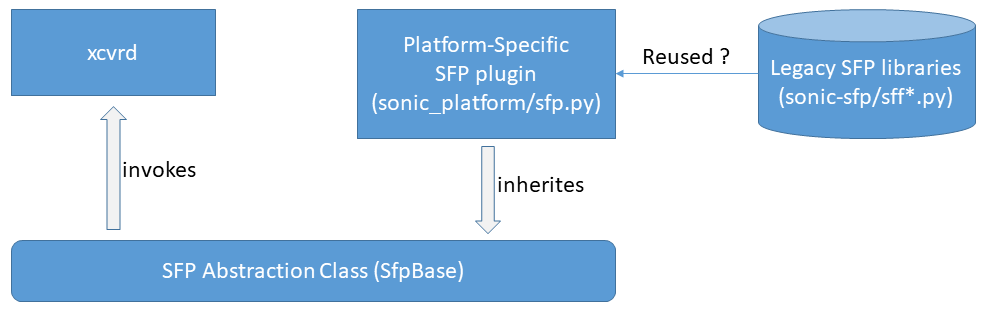

# Feature Name
CMIS Application Initialization

# High Level Design Document
#### Rev 0.1 (Draft)

# Table of Contents
  * [List of Tables](#list-of-tables)
  * [Revision](#revision)
  * [About This Manual](#about-this-manual)
  * [Abbreviation](#abbreviation)
  * [References](#references)
  * [Requirement](#requirement)  
    * [Overview](#overview)
    * [Scope](#scope)
    * [Outside the Scope](#outside-the-scope)
    * [Functional Requirements](#functional-requirements)
    * [Warm Boot Requirements](#warm-boot-requirements)
  * [Functional Description](#functional-description)
  * [Design](#design)  
    * [sonic-platform-daemons/sonic-xcvrd](#sonic-platform-daemonssonic-xcvrd)  
      * [Conditions for Datapath init](#conditions-for-datapath-init)
    * [sonic-platform-common/sonic_platform_base/sfp_base.py](#sonic-platform-commonsonic_platform_basesfp_base.py)
    * [sonic-platform-common/sonic_platform_base/sonic_xcvr/api/public/cmis.py](#sonic-platform-commonsonic_platform_basesonic_xcvrapipubliccmis.py)
    * [sonic-platform-common/sonic_platform_base/sonic_xcvr/fields/consts.py](#sonic-platform-commonsonic_platform_basesonic_xcvrfieldsconsts.py)
    * [sonic-platform-common/sonic_platform_base/sonic_xcvr/fields/public/cmis.py](#sonic-platform-commonsonic_platform_basesonic_xcvrfieldspubliccmis.py)
    * [sonic-platform-common/sonic_platform_base/sonic_xcvr/mem_maps/public/cmis.py](#sonic-platform-commonsonic_platform_basesonic_xcvrmem_mapspubliccmis.py)
    * [sonic-platform-common/sonic_platform_base/sonic_xcvr/sfp_optoe_base.py](#sonic-platform-commonsonic_platform_basesonic_xcvrsfp_optoe_base.py)
    * [sonic-utilities/sfputil](#sonic-utilitiessfputil)
    * [CLI commands](#cli-commands)  
      * [CLI Show Commands](#cli-show-commands)
      * [CLI Debug Commands](#cli-debug-commands)

# List of Tables
  * [Table 1: Definitions](#table-1-definitions)
  * [Table 2: References](#table-2-references)
  * [Table 3: Port Table Name Mappings](#table-3-port-table-name-mappings)
  * [Table 4: CMIS State Table](#table-4-cmis-state-table)

# Revision
| Rev |     Date    |       Author        | Change Description                        |
|:---:|:-----------:|:-------------------:|-------------------------------------------|
| 0.1 | 11/16/2021  | Dante (Kuo-Jung) Su | Initial version                           |

# About this Manual
This document provides general information about the CMIS application initialization
support for SONiC.

# Abbreviation

# Table 1: Definitions
| **Term**       | **Definition**                                   |
| -------------- | ------------------------------------------------ |
| pmon           | Platform Monitoring Service                      |
| xcvr           | Transceiver                                      |
| xcvrd          | Transceiver Daemon                               |
| CMIS           | Common Management Interface Specification        |

# References

# Table 2 References

| **Document**                                            | **Location**  |
|---------------------------------------------------------|---------------|
| CMIS v5 | [CMIS5p0.pdf](http://www.qsfp-dd.com/wp-content/uploads/2021/05/CMIS5p0.pdf) |

# Requirement

## Overview

This document describes functional behavior of the CMIS application initialization
support in SONiC.

The Common Management Interface Specification (CMIS) provides a variety of features
and support for different transceiver form factors. A CMIS transceiver may support
multiple application, and the application initialization sequence is now mandatory
upon port mode changes. Otherwise the link will be down if the host port mode
does not match the selected application on the CMIS transceiver.

The feature is built on top of SONiC **sfp-refactor** framework to provide a
platform-independent solution, and the individual platforms could easily enable
this feaure by having its **Sfp** object inherited from **SfpOptoeBase**.

**Example:**  
```
from sonic_platform_base.sonic_xcvr.sfp_optoe_base import SfpOptoeBase

class Sfp(SfpOptoeBase):

    def __init__(self, sfp_index):
        SfpOptoeBase.__init__(self)
        self.index = sfp_index

    def get_port_type(self):
        return self.SFP_PORT_TYPE_QSFPDD

    def get_eeprom_path(self):
        # platform-specific per-port I2C bus
        bus_id = 32 + self.index
        return "/sys/bus/i2c/devices/{}-0050/eeprom".format(bus_id)
```

## Scope

The scope of this feature are as follows:

- **CMIS software initialization for the default application.**  
  - All the lanes of the CMIS module will be reconfigured to use the default application.
  - Only staged control set 0 will be supported
  - No speed negotiation.
  - No custom signal integrity settings
  - Implement the procedures defined in Appendix D.1.3 and D.2.2 of [CMIS v5](http://www.qsfp-dd.com/wp-content/uploads/2021/05/CMIS5p0.pdf)
- **sonic-platform-common**: Update **sonic-xcvr** for CMIS application advertising and initialization
- **sonic-platform-daemons**: Update **sonic-xcvrd** for state-based CMIS application initialization
to support multiple CMIS transceivers in one single thread
- **sonic-utilities**: Update the **sfputil** and **sfpshow** for CMIS application advertisement

## Outside the Scope

The following items are outside the scope of this document:

- The synchronization between syncd and xcvrd  
  The datapath initialization should happen only when the Tx signals from the ASIC/MAC towards
  the optics is valid and good for the selected application (i.e. 6.3.3.5 DPInit State of [CMIS v5](http://www.qsfp-dd.com/wp-content/uploads/2021/05/CMIS5p0.pdf))
  Currently, **pmon#xcvrd** do not have any means to know this at runtime whether the port breakout
  configuration is done or ASIC/MAC is ready in the desired mode.
- The non-default application is not supported  
  Only application 1 (i.e. default application) is supported, the port configurations that
  require non-default application code may experience link failures on CMIS v4/v5 optics.

## Functional Requirements

1. Ability to parse the advertised applications from the transceivers
2. Ability to post the advertised applications to the STATE_DB
3. Ability to support multiple CMIS transceivers in one single thread.
4. Ability to detect the errors of the application initialization on the transceivers

**Note:**  
The duration of the CMIS application initialization greatly differs from transceivers
to transceivers, while some take 3 seconds for activating the 4x100G mode, some take 15 seconds.

## Warm Boot Requirements

Functionality should continue to work across warm boot. 
- The CMIS application initialization should not be performed during WarmBoot.
- The CMIS application initialization should be skipped if no application code updates.

# Functional Description

- The **pmon#xcvrd** should detect the module type of the attched CMIS transceiver and
post its module information onto the **STATE_DB**
- When a CMIS transceiver is attached, the **show interfaces transceiver eeprom**
should display the advertised applications of the transceiver.
- When a CMIS transceiver is attached, the **sfputil** should be capable of reporting
the errors of the CMIS application initialization.
- When a CMIS transceiver is detected, the **pmon#xcvrd** should automatically activate
the appropriate application as per the current port mode.
- Only the default application mode will be supported for now, we'll deal with the dynamic
application update later when the synchronization mechanism between **syncd** and **pmon#xcvrd**
is in place and ready.

# Design

## sonic-platform-daemons/sonic-xcvrd

The transceiver daemon will be enhanced as below:

- The **application_advertisement** in the **TRANSCEIVER_INFO** table is now updated
to the json format:  

**Original:**  
```
  "TRANSCEIVER_INFO|Ethernet0": {
    "type": "hash",
    "value": {
      "application_advertisement": "400GAUI-8 C2M (Annex 120E) - 400GBASE-DR4 (Cl 124)\n        100GAUI-2 C2M (Annex 135G) - 100G-FR/100GBASE-FR1 (Cl 140)",
      ...... omitted ......
    }
  },
```

**Modified:**  
```
  "TRANSCEIVER_INFO|Ethernet0": {
    "type": "hash",
    "value": {
      "application_advertisement": "{1: {'host_electrical_interface_id': '400GAUI-8 C2M (Annex 120E)', 'module_media_interface_id': '400GBASE-DR4 (Cl 124)', 'host_lane_count': 8, 'media_lane_count': 4, 'host_lane_assignment_options': 1, 'media_lane_assignment_options': None}, 2: {'host_electrical_interface_id': '100GAUI-2 C2M (Annex 135G)', 'module_media_interface_id': '100G-FR/100GBASE-FR1 (Cl 140)', 'host_lane_count': 2, 'media_lane_count': 1, 'host_lane_assignment_options': 85, 'media_lane_assignment_options': None}}",
      ...... omitted ......
    }
  },
  ...... omitted ......
```  

- **xcvrd_utilities/port_mapping.py**: Add support for **APPL_DB** and **STATE_DB**
  - **subscribe_port_update_event(db_list=['APPL_DB', 'STATE_DB'])** subscribes to both **APPL_DB** and **STATE_DB** by default.

  - **handle_port_update_event(sel, asic_context, stop_event, logger, handler)** is the wrapper for port update event handler,
    and the handler routines will be invoked upon all the database SET/DEL commands as follows  
    - **PortChangeEvent.PORT_SET**  
      The event for database **SET** operations.
    - **PortChangeEvent.PORT_DEL**  
      The event for database **DEL** operations.

  - The port table names associated with the database are as follows  

    ### Table 3 Port Table Name Mappings
    | Database  |      Table Name        |
    |:--------- |:---------------------- |
    | APPL_DB   | PORT_TABLE             |
    | CONFIG_DB | PORT                   |
    | STATE_DB  | TRANSCEIVER_INFO       |

  - The port update events from **APPL_DB** should be interpreted as the port config update
    notifications from the **swss#orchagent**
  - The port update events from **STATE_DB** should be interpreted as the transceiver insertion
    and removal notifications from the **xcvrd#SfpStateUpdateTask**
  - Upon **WARM-REBOOT** and **pmon** restart, these events will always be replayed to the
    **CmisManagerTask** and the initialization sequence will be skipped if the desired application
    is already in place and ready. (For more details, please refer to the summary of **xcvrd.py** below)

- **xcvrd.py**: Add **CmisManagerTask** for the state-based CMIS application initialization
to support multiple CMIS transceivers in one single thread.  
  - The CMIS states are listed below  

    ### Table 4 CMIS State Table
    |  State    | Description     |      Next State       |
    |:--------- |:----------------|:----------------------|
    | UNKNOWN   | Unknown state   | N/A                   |
    | INSERTED  | Module is newly inserted | DP_DEINIT    |
    | DP_DEINIT | DatPath is de-initialized with tx-power turned off | AP_CONFIGURED |
    | AP_CONFIGURED | Application configured | DP_INIT    |
    | DP_INIT   | DatPath is initialized with tx-power turned off | DP_TXON |
    | DP_TXON   | DatPath is initialized with tx-power turned on | READY |
    | READY     | Transceiver is ready in the new application mode | N/A |
    | REMOVED   | Module is removed  | N/A                |
    | FAILED    | Initialization failed | N/A             |

  - At each loop iteration of CmisManagerTask.task_worker(), the state will only be advanced by 1 and only 1 state upon success.
  - Prior to advancing the state, CmisManagerTask should always double-check the hardware module and datapath states.  
    - Prior to handling the CMIS state transitions, the following checkers are always performed  
      - **Check for the transceiver presence** via sfp.get_presence(),
        abort the initialization sequence if it's no loner present
      - **Validate the transceiver module type** via sfp.get_transceiver_info()['type_abbrv_name'],
        abort the initialization sequence if it's not a QSFP-DD
      - **Validate the transceiver memory type** via sfp.get_transceiver_info()['memory_type'],
        abort the initialization sequence if the **Paged** memory is not available.
    - From **INSERTED** to **DP_DEINIT**  
      Skip the initialization sequence by having the state transitioned to **READY**
      if no application code updates and DataPath state is 4 (i.e. DataPathActivated) and
      config state is 1 (i.e. ConfigSuccess), otherwise invoke sfp.set_cmis_application_stop()
      and have the state transitioned to **DP_DEINIT**
    - From **DP_DEINIT** to **AP_CONFIGURED**  
      Stay at **DP_DEINIT** state if module state != **ModuleReady(3)**, otherwise invoke
      sfp.set_cmis_application_apsel() and have the state transitioned to **AP_CONFIGURED**
    - From **AP_CONFIGURED** to **DP_INIT**  
      Stay at **AP_CONFIGURED** state if config state != **ConfigSuccess(1)**, otherwise
      invoke sfp.set_cmis_application_start() and have the state transitioned to **DP_INIT**
    - From **DP_INIT** to **DP_TXON**  
      Stay at **DP_INIT** state if DataPath state != **DataPathInitialized(7)**, otherwise
      invoke sfp.set_cmis_application_txon() and have the state transitioned to **DP_TXON**
    - From **DP_TXON** to **READY**  
      Stay at **DP_TXON** state if DataPath state != **DataPathActivated(4)**, otherwise have the
      state transitioned to **READY**
  - The CMIS state transition diagram  
  

  ### Conditions for Datapath init

  The datapath should be re-initialized in the following scenarios

  - Transceiver insertion detection  
    When a CMIS transceiver insertion is detected, it will be placed in **INSERTED** state,
    the datapath re-initialization should be skipped and directly transitioned to **READY** state
    if all the following checkers are positive  
    - The operational application code matches the desired application mode derived from
      the current port configurations in the CONFIG_DB/APPL_DB
    - The datapath state is **DataPathActivated(4)**
    - The configuration error is **ConfigSuccess(1)**
  - Port mode changes that require a CMIS application code update (e.g Dynamic Port Breakout,
    outside the scope of this document)
  - Port speed changes that require a CMIS application code update

## sonic-platform-common/sonic_platform_base/sfp_base.py

Add the following macro constants to differentiate the port/cage type from the media type fetched from the transceiver
- SFP_PORT_TYPE_UNSPECIFIED
- SFP_PORT_TYPE_SFP
- SFP_PORT_TYPE_QSFP
- SFP_PORT_TYPE_QSFPDD

Add the following stub routines
- get_port_type(self)  
  Retrieves the port/cage type of this SFP

## sonic-platform-common/sonic_platform_base/sonic_xcvr/api/public/cmis.py

- Add support for low-power mode controls
- Add support for reporting CMIS application advertisement
- Add support for reporting CMIS application initialization failures
- Add support for CMIS application initialization  
  For more details, please refer to **Appendix D.1.3 and D.2.2** of
[CMIS v5](http://www.qsfp-dd.com/wp-content/uploads/2021/05/CMIS5p0.pdf)

## sonic-platform-common/sonic_platform_base/sonic_xcvr/fields/consts.py

- Add register definitions for CMIS application initialization

## sonic-platform-common/sonic_platform_base/sonic_xcvr/fields/public/cmis.py

- Add support for parsing CMIS application advertisement

## sonic-platform-common/sonic_platform_base/sonic_xcvr/mem_maps/public/cmis.py

- Add support for CMIS registers those are necessary for application initialization

## sonic-platform-common/sonic_platform_base/sonic_xcvr/sfp_optoe_base.py

- Add the following routines for CMIS application initialization
  - **has_cmis_application_update(self, host_speed, host_lanes)**  
    Check for CMIS updates and the new application if an update if necessary
  - **set_cmis_application_stop(self, host_lanes)**  
    A non-blocking routine to deinitialize DataPath, put the CMIS module into low-power mode
    and finally reactivate high-power mode, the users are supposed to check the module state
    prior to configuring application code by **set_cmis_application_apsel()**
  - **set_cmis_application_apsel(self, host_lanes, appl_code=1)**  
    A non-blocking routine to configure the application code, the users are supposed to check
    the config error prior to initialize the DataPath by **set_cmis_application_start()**
  - **set_cmis_application_start(self, host_lanes)**  
    A non-blocking routine to configure initialize the DataPath, the users are supposed to check
    the DataPath state prior to turn on the Tx power by **set_cmis_application_txon()**
  - **set_cmis_application_txon(self, host_lanes)**  
    A non-blocking routine to turn on the Tx power, the users could later check the DataPath state
    to see if the module is correctly brought up.
  - **get_cmis_state(self)**  
    Retrieve the CMIS module state, config error and DataPath state.
  - **get_error_description(self)**  
    Report the CMIS application initialization failures
  - **get_lpmode(self)**  
    Check if the CMIS module is placed in low-power mode
  - **set_lpmode(self, lpmode)**  
    Enable/Disable the low-power mode
  - **get_module_state(self)**  
    Retrieve the CMIS module state

## sonic-utilities/sfputil

- Add supprot to show the CMIS application advertisement

## CLI commands

### CLI Show Commands

#### show interfaces transceiver eeprom

This utility is now updated as below.

**Original**
```
admin@sonic:~$ show interfaces transceiver eeprom Ethernet0
Ethernet0: SFP EEPROM detected
        Application Advertisement: {1: {'host_electrical_interface_id': '400GAUI-8 C2M (Annex 120E)', 'module_media_interface_id': '400GBASE-DR4 (Cl 124)', 'host_lane_count': 8, 'media_lane_count': 4, 'host_lane_assignment_options': 1, 'media_lane_assignment_options': None}, 2: {'host_electrical_interface_id': '100GAUI-2 C2M (Annex 135G)', 'module_media_interface_id': '100G-FR/100GBASE-FR1 (Cl 140)', 'host_lane_count': 2, 'media_lane_count': 1, 'host_lane_assignment_options': 85, 'media_lane_assignment_options': None}}
        Connector: SN optical connector
        Encoding: N/A
        Extended Identifier: Power Class 6 (12.0W Max)
        Extended RateSelect Compliance: N/A
        Identifier: QSFP-DD Double Density 8X Pluggable Transceiver
        Length cable Assembly(m): 0.0
        Nominal Bit Rate(100Mbs): 0
        Specification compliance: sm_media_interface
        Vendor Date Code(YYYY-MM-DD Lot): 2020-10-07
        Vendor Name: AVAGO
        Vendor OUI: 00-17-6a
        Vendor PN: AFCT-93DRPHZ-AZ2
        Vendor Rev: 01
        Vendor SN: FD2038FG0FY
```

**Modified**
```
admin@sonic:~$ show interfaces transceiver eeprom Ethernet0
Ethernet0: SFP EEPROM detected
        Application Advertisement:
                1: 400GAUI-8 C2M (Annex 120E) | 400GBASE-DR4 (Cl 124)
                2: 100GAUI-2 C2M (Annex 135G) | 100G-FR/100GBASE-FR1 (Cl 140)
        Connector: SN optical connector
        Encoding: N/A
        Extended Identifier: Power Class 6 (12.0W Max)
        Extended RateSelect Compliance: N/A
        Identifier: QSFP-DD Double Density 8X Pluggable Transceiver
        Length cable Assembly(m): 0.0
        Nominal Bit Rate(100Mbs): 0
        Specification compliance: sm_media_interface
        Vendor Date Code(YYYY-MM-DD Lot): 2020-10-07
        Vendor Name: AVAGO
        Vendor OUI: 00-17-6a
        Vendor PN: AFCT-93DRPHZ-AZ2
        Vendor Rev: 01
        Vendor SN: FD2038FG0FY
```

#### sudo sfputil show eeprom

This utility is now updated as below.

**Original**
```
admin@sonic:~$ sudo sfputil show eeprom -p Ethernet0
Ethernet0: SFP EEPROM detected
        Application Advertisement: {1: {'host_electrical_interface_id': '400GAUI-8 C2M (Annex 120E)', 'module_media_interface_id': '400GBASE-DR4 (Cl 124)', 'host_lane_count': 8, 'media_lane_count': 4, 'host_lane_assignment_options': 1, 'media_lane_assignment_options': None}, 2: {'host_electrical_interface_id': '100GAUI-2 C2M (Annex 135G)', 'module_media_interface_id': '100G-FR/100GBASE-FR1 (Cl 140)', 'host_lane_count': 2, 'media_lane_count': 1, 'host_lane_assignment_options': 85, 'media_lane_assignment_options': None}}
        Connector: SN optical connector
        Encoding: N/A
        Extended Identifier: Power Class 6 (12.0W Max)
        Extended RateSelect Compliance: N/A
        Identifier: QSFP-DD Double Density 8X Pluggable Transceiver
        Length cable Assembly(m): 0.0
        Nominal Bit Rate(100Mbs): 0
        Specification compliance: sm_media_interface
        Vendor Date Code(YYYY-MM-DD Lot): 2020-10-07
        Vendor Name: AVAGO
        Vendor OUI: 00-17-6a
        Vendor PN: AFCT-93DRPHZ-AZ2
        Vendor Rev: 01
        Vendor SN: FD2038FG0FY
```

**Modified**
```
admin@sonic:~$ sudo sfputil show eeprom -p Ethernet0
Ethernet0: SFP EEPROM detected
        Application Advertisement:
                1: 400GAUI-8 C2M (Annex 120E) | 400GBASE-DR4 (Cl 124)
                2: 100GAUI-2 C2M (Annex 135G) | 100G-FR/100GBASE-FR1 (Cl 140)
        Connector: SN optical connector
        Encoding: N/A
        Extended Identifier: Power Class 6 (12.0W Max)
        Extended RateSelect Compliance: N/A
        Identifier: QSFP-DD Double Density 8X Pluggable Transceiver
        Length cable Assembly(m): 0.0
        Nominal Bit Rate(100Mbs): 0
        Specification compliance: sm_media_interface
        Vendor Date Code(YYYY-MM-DD Lot): 2020-10-07
        Vendor Name: AVAGO
        Vendor OUI: 00-17-6a
        Vendor PN: AFCT-93DRPHZ-AZ2
        Vendor Rev: 01
        Vendor SN: FD2038FG0FY
```

### CLI Debug Commands

#### sfputil show error-status

This utility is also enhanced to detect CMIS failures

Example:
```
admin@sonic:~$ sudo sfputil show error-status
Port         Error Status
-----------  --------------
Ethernet0    OK
Ethernet8    ConfigRejected
Ethernet16   DataPathDeinit
Ethernet24   Unplugged
Ethernet32   Unplugged
```

#### show logging xcvrd

Please use **show logging xcvrd | grep CMIS** for the debug logs

Example:
```
admin@sonic:~$ show logging xcvrd | grep CMIS
Nov 19 07:28:53.878758 sonic NOTICE pmon#xcvrd[34]: CMIS: Starting...
Nov 19 07:28:54.571593 sonic NOTICE pmon#xcvrd[34]: CMIS: Ethernet32: 400G, 8-lanes, state=INSERTED
Nov 19 07:28:55.359298 sonic NOTICE pmon#xcvrd[34]: CMIS: Ethernet0: 400G, 8-lanes, state=INSERTED
Nov 19 07:28:57.203301 sonic NOTICE pmon#xcvrd[34]: CMIS: Ethernet32: 400G, 8-lanes, state=DP_DEINIT
Nov 19 07:28:57.874821 sonic NOTICE pmon#xcvrd[34]: CMIS: Ethernet0: 400G, 8-lanes, state=DP_DEINIT
Nov 19 07:28:59.550191 sonic NOTICE pmon#xcvrd[34]: CMIS: Ethernet32: 400G, 8-lanes, state=DP_DEINIT
Nov 19 07:29:00.287885 sonic NOTICE pmon#xcvrd[34]: CMIS: Ethernet0: 400G, 8-lanes, state=DP_DEINIT
Nov 19 07:29:02.059347 sonic NOTICE pmon#xcvrd[34]: CMIS: Ethernet32: 400G, 8-lanes, state=AP_CONFIGURED
Nov 19 07:29:02.781345 sonic NOTICE pmon#xcvrd[34]: CMIS: Ethernet0: 400G, 8-lanes, state=AP_CONFIGURED
Nov 19 07:29:04.504715 sonic NOTICE pmon#xcvrd[34]: CMIS: Ethernet32: 400G, 8-lanes, state=DP_INIT
Nov 19 07:29:05.210270 sonic NOTICE pmon#xcvrd[34]: CMIS: Ethernet0: 400G, 8-lanes, state=DP_INIT
Nov 19 07:29:06.877637 sonic NOTICE pmon#xcvrd[34]: CMIS: Ethernet32: 400G, 8-lanes, state=DP_TXON
Nov 19 07:29:06.902918 sonic NOTICE pmon#xcvrd[34]: CMIS: Ethernet32: 400G, 8-lanes, state=READY
Nov 19 07:29:07.545593 sonic NOTICE pmon#xcvrd[34]: CMIS: Ethernet0: 400G, 8-lanes, state=DP_TXON
Nov 19 07:29:07.581243 sonic NOTICE pmon#xcvrd[34]: CMIS: Ethernet0: 400G, 8-lanes, state=READY
```
