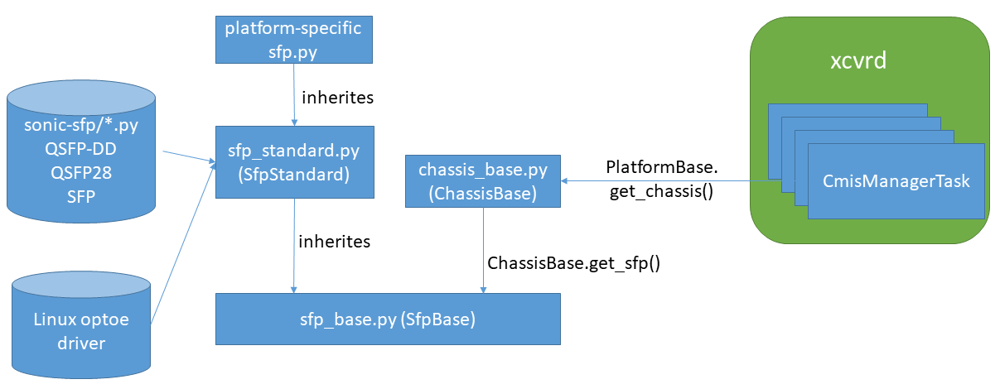

# Feature Name
CMIS Application Initialization

# High Level Design Document
#### Rev 0.2 (Draft)

# Table of Contents
  * [List of Tables](#list-of-tables)
  * [Revision](#revision)
  * [About This Manual](#about-this-manual)
  * [Scope](#scope)
  * [Abbreviation](#abbreviation)
  * [References](#references)
  * [Requirement Overview](#requirement-overview)
  * [Functional Description](#functional-description)
  * [Design](#design)

# List of Tables
  * [Table 1: Definitions](#table-1-definitions)
  * [Table 2: References](#table-2-references)

# Revision
| Rev |     Date    |       Author        | Change Description                        |
|:---:|:-----------:|:-------------------:|-------------------------------------------|
| 0.1 | 09/27/2021  | Dante (Kuo-Jung) Su | Initial version                           |
| 0.2 | 11/08/2021  | Dante (Kuo-Jung) Su | Migrate to the new sfp-refactoring framework |

# About this Manual
This document provides general information about the CMIS application initialization support for SONiC.

# Abbreviation

# Table 1: Definitions
| **Term**       | **Definition**                                   |
| -------------- | ------------------------------------------------ |
| pmon           | Platform Monitoring Service                      |
| xcvr           | Transceiver                                      |
| xcvrd          | Transceiver Daemon                               |
| CMIS           | Common Management Interface Specification        |

# References

# Table 2 References

| **Document**                                            | **Location**  |
|---------------------------------------------------------|---------------|
| Common Management Interface Specification (CMIS) | [CMIS5p0.pdf](http://www.qsfp-dd.com/wp-content/uploads/2021/05/CMIS5p0.pdf) |

# Requirement Overview

This document describes functional behavior of the CMIS application initialization support in SONiC.

The Common Management Interface Specification (CMIS) provides a variety of features
and support for different transceiver form factors. A 
CMIS transceiver may support multiple application, and the application initialization sequence is now mandatory for the dynamic port breakout mode to correctly update the active CMIS application based on the desired port mode. Otherwise the link will be down if the host port mode does not match the selected application on the CMIS transceiver.

The feature is built on top of SONiC **sfp-refactor** framework to provide a platform-independent
solution, and the individual platforms could easily enable this feaure by having its **Sfp** inherited from **SfpOptoeBase**.

**Example:**  
```
from sonic_platform_base.sonic_xcvr.sfp_optoe_base import SfpOptoeBase

class Sfp(SfpOptoeBase):

    def __init__(self, sfp_index):
        SfpOptoeBase.__init__(self)
        self.index = sfp_index

    def get_port_type(self):
        return self.SFP_PORT_TYPE_QSFPDD

    def get_eeprom_path(self):
        # platform-specific per-port I2C bus
        i2c_bus = 32 + self.index
        return "/sys/bus/i2c/devices/{}-0050/eeprom".format(i2c_bus)
```

The scope of this feature is as follow:

- **sonic-platform-common**  
  - Enhance the **sonic-xcvr** to support CMIS application advertising and initialization
- **sonic-platform-daemons**  
  - Enhance the **sonic-xcvrd** to support paralleled CMIS application initialization
- **sonic-utilities**  
  - Enhance the **sfputil** and **sfpshow** to show CMIS application advertisement

## Functional Requirements

1. Ability to parse the advertised applications from the transceivers
2. Ability to post the advertised applications to the STATE_DB
3. Ability to support parallel processing of the application initialization
4. Ability to detect the errors of the application initialization on the transceivers

**Note:**  
The duration of the CMIS application initialization greatly differs from transceivers
to transceivers, while some take 3 seconds for activating the 4x100G mode, some require 15 seconds.
Hence it's mandatory to support parallel processing.

## Warm Boot Requirements

Functionality should continue to work across warm boot. 
- The CMIS application initialization should not be performed during WarmBoot.
- The CMIS application initialization should be skipped if no application code updates.

# Functional Description

- The **pmon#xcvrd** will detect the module type of the attched transceivers and post the
information to the **STATE_DB**
- If the transceiver is a CMIS module, the **pmon#xcvrd** will activate the appropriate
application mode as per the current port mode.
- If the transceiver is a CMIS module, the **show interfaces transceiver eeprom**
should display the advertised applications of the transceiver.
- If the transceiver is a CMIS module, the **sfputil** should be capable of detecting the errors of the CMIS application initialization.

# Design

## sonic-platform-daemons/sonic-xcvrd (modified)

The transceiver daemon will be enhanced as below:

- Post the CMIS application advertisement into the **STATE_DB**  
  In the case of CMIS transceiver, the **application_advertisement** of **TRANSCEIVER_INFO**
is updated from plain test into json dictionary format:  

**Original:**  
```
  "TRANSCEIVER_INFO|Ethernet0": {
    "type": "hash",
    "value": {
      "application_advertisement": "400GAUI-8 C2M (Annex 120E) - 400GBASE-DR4 (Cl 124)\n        100GAUI-2 C2M (Annex 135G) - 100G-FR/100GBASE-FR1 (Cl 140)",
      ...... omitted ......
    }
  },
```

**Modified:**  
```
  "TRANSCEIVER_INFO|Ethernet0": {
    "type": "hash",
    "value": {
      "application_advertisement": "{1: {'ap_sel_code_id': 1, 'host_electrical_interface_id': '400GAUI-8 C2M (Annex 120E)', 'module_media_interface_id': '400GBASE-DR4 (Cl 124)', 'host_lane_count': 8, 'media_lane_count': 4, 'host_lane_assignment_options': 1, 'media_lane_assignment_options': None}, 2: {'ap_sel_code_id': 2, 'host_electrical_interface_id': '100GAUI-2 C2M (Annex 135G)', 'module_media_interface_id': '100G-FR/100GBASE-FR1 (Cl 140)', 'host_lane_count': 2, 'media_lane_count': 1, 'host_lane_assignment_options': 85, 'media_lane_assignment_options': None}}",
      ...... omitted ......
    }
  },
  ...... omitted ......
```  

- Add **CMIS_MEDIA_SETTINGS** to the media_settings.json for custom CMIS controls

**Format:**
```
{
    "CMIS_MEDIA_SETTINGS":{
        "<VENDOR_NAME>#<PART_NUMBER>": {
            "application_selection": true|false
        }
    }
}
```

**Example:**
```
{
    "CMIS_MEDIA_SETTINGS":{
        "AVAGO#AFCT-93DRPHZ-AZ2": {
            "application_selection": true
        },
        "Amphenol#NDYYYF-0001": {
            "application_selection": false
        },
        "DELL EMC#6MGDY": {
            "application_selection": true
        },
        "DELL EMC#DH11M": {
            "application_selection": false
        }
    }
}
```
  As of now, only **application_selection** is supported, and it defaults to **True** if unspecified

- Add a CMIS manager class to handle the application initializations in parallel  

  

- Add **PortChangeEvent.PORT_SET** and **PortChangeEvent.PORT_DEL** events to **xcvrd_utilities/port_mapping.py**  
  - PortChangeEvent.PORT_SET  
    Invoke the event callbacks upon **SET** operations, it includes all the port config updates,
not just the port add/remove events.
  - PortChangeEvent.PORT_DEL  
    Invoke the event callbacks upon **DEL** operations.

- As of now, the number of CmisManagerTask is hard coded to 4  
  - Task 0 is dedicated to listen for **PortChangeEvent.PORT_SET** events, and put requests into the shared message queue
  - Task 1-N are responsible for handling the CMIS application initializations in parallel,
  since all the requests are from the shared message queue, only one request will be processed
  by a certain task at a time.

  

## sonic-platform-common/sonic_platform_base/sfp_base.py (modified)

Add the following stub routines for the CMIS transceiver
- get_cmis_application_selected(self)  
Retrieves the selected application code of this CMIS transceiver
- get_cmis_application_matched(self, host_speed, host_lanes)  
Retrieves the matched application code by the host interface config
- set_cmis_application(self, host_speed, host_lanes)  
Updates the application selection of this CMIS transceiver

## sonic-platform-common/sonic_platform_base/sonic_xcvr/api/public/cmis.py (modified)

- Add support for software reset
- Add support for activating the CMIS application base on the host port mode.
- Detailed CMIS application initialization sequence is available in **Appendix D** of
[Common Management Interface Specification Rev. 5](http://www.qsfp-dd.com/wp-content/uploads/2021/05/CMIS5p0.pdf)

## sonic-platform-common/sonic_platform_base/sonic_xcvr/fields/consts.py (modified)

- Add register definitions for CMIS application initialization

## sonic-platform-common/sonic_platform_base/sonic_xcvr/fields/public/cmis.py (modified)

- Add support for parsing CMIS application advertisement

## sonic-platform-common/sonic_platform_base/sonic_xcvr/mem_maps/public/cmis.py (modified)

- Add the meory map for the CMIS registers which is necessary for application initialization

## sonic-platform-common/sonic_platform_base/sonic_xcvr/sfp_optoe_base.py (modified)

- Add support for CMIS application initialization
  - get_cmis_application_selected()
  - get_cmis_application_matched()
  - set_cmis_application()
- Add mutex lock to the follow routines to serialize CMIS application initializations  
  - reset()
  - set_cmis_application()

## sonic-utilities/sfputil (modified)

- Add supprot to show the CMIS application advertisement

## CLI commands

### CLI Show Commands

With CMIS application advertisement support, **show interfaces transceiver eeprom** is now as below.

```
admin@sonic:~$ show interfaces transceiver eeprom Ethernet0
Ethernet0: SFP EEPROM detected
        Application Advertisement:
                1: 400GAUI-8 C2M (Annex 120E) | 400GBASE-DR4 (Cl 124)
                2: 100GAUI-2 C2M (Annex 135G) | 100G-FR/100GBASE-FR1 (Cl 140)
        Connector: SN optical connector
        Encoding: N/A
        Extended Identifier: Power Class 6 (12.0W Max)
        Extended RateSelect Compliance: N/A
        Identifier: QSFP-DD Double Density 8X Pluggable Transceiver
        Length cable Assembly(m): 0.0
        Nominal Bit Rate(100Mbs): 0
        Specification compliance: sm_media_interface
        Vendor Date Code(YYYY-MM-DD Lot): 2020-10-07
        Vendor Name: AVAGO
        Vendor OUI: 00-17-6a
        Vendor PN: AFCT-93DRPHZ-AZ2
        Vendor Rev: 01
        Vendor SN: FD2038FG0FY
```

### CLI Debug Commands

The legacy **sfputil show error-status** is also enhanced to detect CMIS failures

Example:
```
admin@sonic:~$ sudo sfputil show error-status
Port         Error Status
-----------  --------------
Ethernet0    OK
Ethernet8    CMIS datapath error
Ethernet16   CMIS config error
Ethernet24   Unplugged
Ethernet32   Unplugged
```

Please use **show logging xcvrd | grep CMIS** for the logs of CMIS Manager

Example:
```
admin@sonic:~$ show logging xcvrd | grep CMIS
Nov 12 07:37:26.176160 sonic NOTICE pmon#xcvrd[36]: CMIS: Starting...
Nov 12 07:37:26.176513 sonic NOTICE pmon#xcvrd[37]: CMIS: Starting...
Nov 12 07:37:26.178932 sonic NOTICE pmon#xcvrd[38]: CMIS: Starting...
Nov 12 07:37:26.180756 sonic NOTICE pmon#xcvrd[42]: CMIS: Starting...
Nov 12 07:37:26.180882 sonic NOTICE pmon#xcvrd[40]: CMIS: Starting...
Nov 12 07:37:27.317755 sonic NOTICE pmon#xcvrd[37]: CMIS: Ethernet32: application update for 400G, 8-lanes
Nov 12 07:37:27.388256 sonic NOTICE pmon#xcvrd[37]: CMIS: Ethernet32: application update ... ok
```
